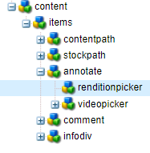
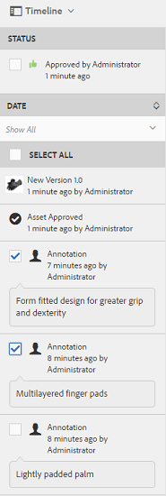

# 管理您的數位資產 {#manage-digital-assets}

| 版本 | 文章連結 |
| -------- | ---------------------------- |
| AEM as a Cloud Service  | [按一下這裡](https://experienceleague.adobe.com/docs/experience-manager-cloud-service/content/assets/manage/manage-digital-assets.html?lang=zh-Hant) |
| AEM 6.5 | 本文章 |

在[!DNL Adobe Experience Manager Assets]中，您除了儲存及控管資產之外，還能執行其他作業。 [!DNL Experience Manager]提供企業級資產管理功能。 您可以編輯和共用資產、執行進階搜尋，以及建立數十種支援的檔案格式的多重轉譯。 您也可以管理版本和數位版權、自動化資產處理、管理和控管中繼資料、使用註解進行合作等等。

本文會說明基本資產管理工作，例如建立或上傳、中繼資料更新、複製、移動和刪除、發佈、取消發佈和搜尋資產。 若要瞭解使用者介面，請參閱[開始使用資產使用者介面](/help/sites-authoring/basic-handling.md)。 若要管理內容片段，請參閱[管理內容片段](/help/assets/content-fragments/content-fragments-managing.md)資產。

## 建立檔案夾 {#creating-folders}

組織資產集合（例如，所有`Nature`影像）時，您可以建立資料夾以將它們保持在一起。 您可以使用資料夾來分類及組織您的資產。 [!DNL Experience Manager Assets]不要求您組織資料夾中的資產才能改善運作。

>[!NOTE]
>
>* 共用至Experience Cloud時不支援共用型別`sling:OrderedFolder`的[!DNL Assets]資料夾。 如果要共用資料夾，在建立資料夾時請勿選取[!UICONTROL 已訂購]。
>* [!DNL Experience Manager]不允許使用`subassets`字做為資料夾的名稱。 這是為包含複合資產的子資產的節點保留的關鍵字。

1. 導覽至數位資產資料夾中您要建立資料夾的位置。 在功能表中按一下&#x200B;**[!UICONTROL 建立]**。 選取&#x200B;**[!UICONTROL 新資料夾]**。
1. 在&#x200B;**[!UICONTROL 標題]**&#x200B;欄位中，提供資料夾名稱。 根據預設，DAM會使用您提供的標題作為資料夾名稱。 建立資料夾後，您可以覆寫預設值並指定另一個資料夾名稱。
1. 按一下「**[!UICONTROL 建立]**」。您的資料夾會顯示在數位資產資料夾中。

不支援下列（以空格分隔的）字元清單：

* 資產檔案名稱不能包含下列任一字元： `* / : [ \\ ] | # % { } ? &`
* 資產資料夾名稱不能包含下列任一字元： `* / : [ \\ ] | # % { } ? \" . ^ ; + & \t`

請勿在資產檔案名稱的副檔名中加入特殊字元。

## 上傳資產 {#uploading-assets}

<!-- TBD the following:
Move this section into a new article. CQDOC-14874 ticket is created for this.
In this complete article, replace emphasis with UICONTROL where appropriate.
-->

您可以從本機資料夾或網路磁碟機將各種型別的資產(包括影像、PDF檔案、RAW檔案等)上傳到[!DNL Experience Manager Assets]。

>[!NOTE]
>
>在Dynamic Media - Scene7模式中，預設的資產上傳檔案大小為2 GB以下。 若要設定大於2 GB的資產上傳，上限為15 GB，請參閱[ （選用）設定Dynamic Media - Scene7模式，以上傳大於2 GB的資產](/help/assets/config-dms7.md#optional-config-dms7-assets-larger-than-2gb)。

>[!IMPORTANT]
>
>您上傳至Experience Manager的Assets如果檔案名稱超過100個字元，在Dynamic Media中使用時會有簡稱。
>
>檔案名稱中的前100個字元會依原樣使用；其餘字元會由英數字元字串取代。 此重新命名方法可確保在資產用於Dynamic Media時具有唯一的名稱。 其目的也在於適應Dynamic Media中允許的資產檔案名稱長度上限。

您可以選擇將資產上傳到資料夾，而不論資料夾是否已指派處理設定檔。

若為已指派處理設定檔的資料夾，設定檔名稱會出現在卡片檢視的縮圖上。 在清單檢視中，設定檔名稱會顯示在&#x200B;**處理設定檔**&#x200B;欄中。 請參閱[處理設定檔](/help/assets/processing-profiles.md)。

上傳資產之前，請確定資產為[!DNL Experience Manager Assets]支援的[格式](/help/assets/assets-formats.md)。

1. 在[!DNL Assets]使用者介面中，導覽至您要新增數位資產的位置。
1. 若要上傳資產，請執行下列任一項作業：

   * 在工具列上，按一下[建立]。**&#x200B;** 然後在功能表上按一下&#x200B;**[!UICONTROL 檔案]**。 如有需要，您可以在顯示的對話方塊中重新命名檔案。
   * 在支援HTML5的瀏覽器中，直接在[!DNL Assets]使用者介面上拖曳資產。 不會顯示重新命名檔案的對話方塊。

   

   若要選取多個檔案，請選取`Ctrl`或`Command`索引鍵，然後在檔案選擇器對話方塊中選取資產。 使用iPad時，您一次只能選取一個檔案。

   您可以暫停上傳大型資產（大於500 MB），稍後再從相同頁面繼續上傳。 按一下上傳開始時所顯示的進度列旁的&#x200B;**[!UICONTROL 暫停]**。

   

可設定資產的大小，超過此大小即可視為大型資產。 例如，您可以將系統設定為將超過1000 MB （而非500 MB）的資產視為大型資產。 在此情況下，當大小超過1000 MB的資產被上傳時，**[!UICONTROL 暫停]**&#x200B;會出現在進度列上。

如果上傳大於1000 MB的檔案時小於1000 MB，則不會顯示[!UICONTROL 暫停]選項。 但是，如果您取消小於1000 MB的檔案上傳，則會顯示&#x200B;**[!UICONTROL 暫停]**&#x200B;選項。

若要修改大小限制，請在`/apps/dam/gui/content/assets/jcr:content/actions/secondary/create/items/fileupload`可用的CRX存放庫中設定`fileupload`節點的`chunkUploadMinFileSize`屬性。

當您按一下&#x200B;**[!UICONTROL 暫停]**&#x200B;時，它會切換到&#x200B;**[!UICONTROL 播放]**&#x200B;選項。 若要繼續上傳，請按一下[播放]。**&#x200B;**

若要取消進行中的上傳，請按一下進度列旁的關閉(`X`)。 當您取消上傳作業時，[!DNL Assets]會刪除已部分上傳的資產部分。

在低頻寬和網路故障的情況下，繼續上傳的功能特別實用，因為上傳大型資產需要花很長的時間。 您可以暫停上傳操作，等情況改善後再繼續。 當您繼續時，上傳會從您暫停的時間點開始。

在上傳作業期間，[!DNL Experience Manager]會將要上傳的資產部分儲存為CRX存放庫中的資料區塊。 上傳完成時，[!DNL Experience Manager]會將這些區塊合併成存放庫中的單一資料區塊。

若要設定未完成區塊上傳工作的清理工作，請移至`https://[aem_server]:[port]/system/console/configMgr/org.apache.sling.servlets.post.impl.helper.ChunkCleanUpTask`。

>[!CAUTION]
>
>當預設值為500 MB且區塊大小為50 MB時，就會觸發區塊上傳。 如果您編輯[Apache Jackrabbit Oak TokenConfiguration](https://experienceleague.adobe.com/docs/experience-cloud-kcs/kbarticles/KA-16464.html?lang=zh-Hant)，並將`timeout configuration`設定為少於資產上傳所花費的時間，則會在資產上傳進行期間遇到工作階段逾時狀況。 因此，請變更`chunkUploadMinFileSize`和`chunksize`，讓每個區塊要求都會重新整理工作階段。
>
>在提供認證到期逾時、延遲、頻寬和預期的並行上傳等條件的情況下，可讓您確保選擇下列專案的最高值：
>
>* 若要確保在上傳過程中檔案大小可能會導致認證過期時，已啟用區塊上傳。
>
>* 確保每個區塊在認證過期之前完成。

如果您上傳的資產名稱與上傳資產位置已有可用的資產名稱相同，則會顯示警告對話方塊。

您可以選擇重新命名上傳的新資產，以取代現有資產、建立其他版本或保留兩者。 如果您取代現有資產，則資產的中繼資料以及您先前對現有資產所作的任何修改（例如註解或裁切）都會被刪除。 如果您選擇保留兩個資產，則新資產會重新命名，並在名稱后面加上數字`1`。


>[!NOTE]
>
>當您在[!UICONTROL 名稱衝突]對話方塊中選取&#x200B;**[!UICONTROL 取代]**&#x200B;時，系統會重新產生新資產的資產識別碼。 此ID與先前資產的ID不同。
>
>如果已啟用Assets Insights以追蹤曝光次數或與[!DNL Adobe Analytics]的點按次數，則重新產生的資產ID會使在[!DNL Analytics]為資產擷取的資料失效。

如果您上傳的資產存在於[!DNL Assets]中，則&#x200B;**[!UICONTROL 偵測到重複專案]**&#x200B;對話方塊會警告您嘗試上傳重複的資產。 只有在現有資產二進位檔的`SHA 1`總和檢查碼值與您上傳之資產的總和檢查碼值相符時，對話方塊才會顯示。 在這種情況下，資產的名稱並不重要。

>[!NOTE]
>
>只有在啟用重複資料偵測功能時，才會出現[!UICONTROL 偵測到重複資料]對話方塊。 若要啟用重複資料偵測功能，請參閱[啟用重複資料偵測](/help/assets/duplicate-detection.md)。


若要在[!DNL Assets]中保留重複的資產，請按一下[保留]。**&#x200B;** 若要刪除您上傳的重複資產，請按一下[刪除]。**&#x200B;**

[!DNL Experience Manager Assets]會防止您上傳檔案名稱中包含禁止使用的字元的資產。 如果您嘗試上傳檔案名稱包含不允許的字元或多個字元的資產，[!DNL Assets]會顯示警告訊息並停止上傳，直到您移除這些字元或使用允許名稱上傳為止。

為了符合您組織的特定檔案命名慣例，[!UICONTROL 上傳Assets]對話方塊可讓您為上傳的檔案指定長名稱。

但是，不支援下列（以空格分隔的）字元清單：

* 資產檔案名稱不得包含`* / : [ \\ ] | # % { } ? &`
* 資產資料夾名稱不得包含`* / : [ \\ ] | # % { } ? \" . ^ ; + & \t`

請勿在資產檔案名稱的副檔名中加入特殊字元。


此外，[!DNL Assets]使用者介面會顯示您上傳的最新資產或您先建立的資料夾。

如果您在上傳檔案之前取消上傳作業，[!DNL Assets]會停止上傳目前的檔案並重新整理內容。 不過，不會刪除已上傳的檔案。

[!DNL Assets]中的上傳進度對話方塊會顯示已成功上傳檔案的計數以及無法上傳的檔案。

### 序列上傳 {#serialuploads}

大量上傳許多資產會耗用大量的I/O資源，這可能會對您的[!DNL Assets]部署效能造成負面影響。 特別是網際網路連線速度緩慢時，磁碟I/O尖峰會導致上傳時間大幅增加。此外，您的網頁瀏覽器可能會對[!DNL Assets]同時處理資產上傳的POST要求數量引入其他限制。 因此，上載作業失敗或過早終止。 換句話說，[!DNL Experience Manager Assets]在擷取一棧檔案時可能會遺漏某些檔案，或完全無法擷取任何檔案。

若要克服這種情況，[!DNL Assets]會在大量上傳作業期間一次擷取一個資產（序列上傳），而不是同時擷取所有資產。

資產序列上傳預設為啟用。 若要停用功能並允許同時上傳，請在Crx-de中覆蓋`fileupload`節點，並將`parallelUploads`屬性的值設定為`true`。

### 使用FTP上傳資產 {#uploading-assets-using-ftp}

Dynamic Media可透過FTP伺服器批次上傳資產。 如果您想要上傳大型資產（大於1 GB）或上傳整個資料夾和子資料夾，應使用FTP。 您甚至可以將FTP上傳設定為定期排程。

>[!NOTE]
>
>在Dynamic Media - Scene7模式中，預設的資產上傳檔案大小為2 GB以下。 若要設定大於2 GB的資產上傳，上限為15 GB，請參閱[ （選用）設定Dynamic Media - Scene7模式，以上傳大於2 GB的資產](/help/assets/config-dms7.md#optional-config-dms7-assets-larger-than-2gb)。

>[!NOTE]
>
>若要在Dynamic Media - Scene7模式中透過FTP上傳資產，請在[!DNL Experience Manager]作者執行個體上安裝Feature Pack 18912。 請連絡[Adobe客戶支援](https://experienceleague.adobe.com/zh-hant?support-solution=General#support)以存取FP-18912並完成FTP帳戶的設定。 如需詳細資訊，請參閱[安裝Feature Pack 18912以進行大量資產移轉](/help/assets/bulk-ingest-migrate.md)。
>
>如果您使用FTP上傳資產，則會忽略[!DNL Experience Manager]中指定的上傳設定。 而是改用在Dynamic Media Classic中定義的檔案處理規則。

**若要使用FTP上傳資產**

1. 使用您選擇的FTP使用者端，使用您從布建電子郵件收到的FTP使用者名稱和密碼登入FTP伺服器。 在FTP使用者端中，將檔案或資料夾上傳至FTP伺服器。

1. 開啟[Dynamic Media Classic案頭應用程式](https://experienceleague.adobe.com/docs/dynamic-media-classic/using/intro/dynamic-media-classic-desktop-app.html?lang=zh-Hant#system-requirements-dmc-app)，然後登入您的帳戶。

   布建時Adobe已提供您的認證和登入。 如果您沒有此資訊，請聯絡Adobe客戶支援。

1. 在全域導覽列上，按一下&#x200B;**[!UICONTROL 上傳]**。
1. 在「上傳」頁面的左上角，按一下「**[!UICONTROL 透過FTP]**」標籤。
1. 在頁面左側，選擇要上傳檔案的FTP資料夾；在頁面右側，選擇目的地資料夾。
1. 在頁面的右下角附近，按一下&#x200B;**[!UICONTROL 工作選項]**，然後根據您選取的資料夾中的資產設定您想要的選項。

   請參閱[上載工作選項](#upload-job-options)。

   >[!NOTE]
   >
   >當您透過FTP上傳資產時，您在Dynamic Media Classic (S7)中設定的上傳工作選項會先於在[!DNL Experience Manager]中設定的資產處理引數。

1. 在[上載工作選項]對話方塊的右下角，按一下[儲存]。**&#x200B;**
1. 在上傳頁面的右下角，按一下&#x200B;**[!UICONTROL 送出上傳]**。

   若要檢視上傳進度，請按一下全域導覽列上的&#x200B;**[!UICONTROL 工作]**。 「工作」頁面會顯示上載的進度。 您可以繼續在[!DNL Experience Manager]中工作，並隨時返回Dynamic Media Classic的[工作]頁面以檢閱進行中的工作。
若要取消進行中的上載工作，請按一下[持續時間]時間旁的[取消]。**&#x200B;**

#### 上載工作選項 {#upload-job-options}

| 上傳選項 | 次選項 | 說明 |
|---|---|---|
| 工作名稱 | | 文字欄位中預先填寫的預設名稱包括使用者輸入的名稱部分以及日期和時間戳記。 您可以使用預設名稱，或為此上載工作輸入您自己建立的名稱。 <br>工作和其他上載及發佈工作會記錄在「工作」頁面上，您可以在此檢查工作的狀態。 |
| 上傳後的Publish | | 自動發佈您上傳的資產。 |
| 任何檔案夾內若有基本資產名稱相同者 (無論副檔名為何)，將予以覆寫 | | 如果您希望上傳的檔案以相同名稱取代現有檔案，請選取此選項。 根據&#x200B;**[!UICONTROL 應用程式設定]** > **[!UICONTROL 一般設定]** > **[!UICONTROL 上傳至應用程式]** > **[!UICONTROL 覆寫影像]**&#x200B;中的設定，此選項的名稱可能會不同。 |
| 上傳時解壓縮Zip或Tar檔案 | | |
| 工作選項 | | 按一下&#x200B;**[!UICONTROL 工作選項]**，您就可以開啟[!UICONTROL 上載工作選項]對話方塊並選擇影響整個上載工作的選項。 這些選項對於所有檔案型別都相同。<br>您可以從[應用程式一般設定]頁面開始，選擇上傳檔案的預設選項。 若要開啟此頁面，請選擇&#x200B;**[!UICONTROL 設定]** > **[!UICONTROL 應用程式設定]**。 選取&#x200B;**[!UICONTROL 預設上載選項]**&#x200B;選項，以開啟[!UICONTROL 上載工作選項]對話方塊。 |
| | 時間 | 選取一次性或週期性。 若要設定週期性工作，請選擇重複選項（每日、每週、每月或自訂），以指定您希望FTP上載工作重複的時間。 然後視需要指定排程選項。 |
| | 包含子資料夾 | 上傳您要上傳之資料夾中的所有子資料夾。 您上傳的資料夾及其子資料夾名稱會自動在[!DNL Experience Manager Assets]中輸入。 |
| | 裁切選項 | 若要從影像側面手動裁切，請選取「裁切」選單，然後選擇「手動」。 然後輸入要從影像任何一面或每一面裁切的畫素數。 裁切多少影像取決於影像檔案中的ppi （每英吋畫素）設定。 例如，如果影像顯示150 ppi，而您在「上」、「右」、「下」和「左」文字方塊中輸入75，則會從每一側裁剪半英吋。<br>若要自動裁切影像中的空白畫素，請開啟[裁切]功能表，選擇[手動]，然後在[上]、[右]、[下]和[左]欄位中輸入畫素度量，從側面裁切。 您也可以在「裁切」功能表上選擇「裁切」，並選擇下列選項：<br> 根據&#x200B;**修剪掉** <ul><li>**色彩** — 選擇色彩選項。 接著，選取「邊角」功能表，並選取最能代表您要裁切之空白顏色的影像邊角。</li><li>**透明度** — 選擇「透明度」選項。<br> **容許度** — 拖曳滑桿以指定從0到1的容許度。若要根據顏色裁剪，請指定0以裁切畫素，但前提是這些畫素完全符合您在影像角落選取的顏色。 數字越接近1，色彩差異越大。<br>若要根據透明度進行裁剪，請指定0以裁切畫素，除非畫素是透明的。 數字越接近1，透明度越高。</li></ul><br>這些裁切選項不具破壞性。 |
| | 色彩設定檔選項 | 當您建立用於傳送的最佳化檔案時，請選擇色彩轉換：<ul><li>預設色彩儲存：當影像包含色域資訊時，維持來源影像顏色；沒有色彩轉換。 目前幾乎所有影像都已內嵌適當的色彩設定檔。 不過，如果CMYK來源影像未包含內嵌色彩設定檔，這些色彩會轉換成sRGB （標準紅綠藍）色域。 sRGB是在網頁上顯示影像的建議色域。</li><li>保留原始色域：保留原始顏色而不進行任何色彩轉換。 對於沒有內嵌色彩設定檔的影像，任何色彩轉換都是使用Publish設定中設定的預設色彩設定檔來完成。 色彩設定檔可能不會與使用此選項建立的檔案中的色彩一致。 因此，建議您使用「預設色彩儲存」選項。</li><li>自訂從>至<br>會開啟功能表，讓您能夠選擇「轉換自」和「轉換至」色域。 這個進階選項會覆寫任何內嵌在來源檔案中的顏色資訊。 當您提交的所有影像包含不正確或遺失色彩設定檔資料時，請選取此選項。</li></ul> |
| | 影像編輯選項 | 您可以保留影像中的剪裁遮色片，並選擇色彩設定檔。<br>請參閱[在上傳時設定影像編輯的選項](#setting-image-editing-options-at-upload)。 |
| | Postscript選項 | 您可以點陣化PostScript®檔案、裁切檔案、維持透明背景、選擇解析度，以及選擇色域。<br>請參閱[設定PostScript和Illustrator上傳選項](#setting-postscript-and-illustrator-upload-options)。 |
| | Photoshop選項 | 您可以從Adobe® Photoshop®檔案建立範本、維護圖層、指定圖層的命名方式、擷取文字，以及指定影像錨定到範本中的方式。[!DNL Experience Manager]不支援<br>範本。<br>請參閱[設定Photoshop上傳選項](#setting-photoshop-upload-options)。 |
| | PDF選項 | 您可以點陣化檔案、擷取搜尋字詞和連結、自動產生eCatalog、設定解析度，以及選擇色域。[!DNL Experience Manager]不支援<br>eCatalog。 <br>請參閱[設定PDF上傳選項](#setting-pdf-upload-options)。<br>**注意**：對於新上傳，要考慮用於擷取的PDF最大頁數為5000。 2022年12月31日，此限制將變更為100頁(適用於所有PDF)。 另請參閱[Dynamic Media限制](/help/assets/limitations.md)。 |
| | Illustrator選項 | 您可以點陣化Adobe Illustrator®檔案、維持透明背景、選擇解析度，以及選擇色域。<br>請參閱[設定PostScript和Illustrator上傳選項](#setting-postscript-and-illustrator-upload-options)。 |
| | EVideo選項 | 您可以透過選擇視訊預設集來轉碼視訊檔案。<br>請參閱[設定eVideo上傳選項](#setting-evideo-upload-options)。 |
| | 大量集預設集 | 若要從上傳的檔案建立「影像集」或「迴轉集」，請按一下您要使用之預設集的「作用中」欄。 您可以選取多個預設集。 您可以在Dynamic Media Classic的「應用程式設定/批次集預設集」頁面中建立預設集。<br>請參閱[設定批次集預設集以自動生成影像集和迴轉集](config-dms7.md#creating-batch-set-presets-to-auto-generate-image-sets-and-spin-sets)，深入瞭解如何建立批次集預設集。<br>請參閱[在上傳](#setting-batch-set-presets-at-upload)設定批次集預設集。 |

#### 設定上傳時影像編輯的選項 {#setting-image-editing-options-at-upload}

上傳影像檔案(包括AI、EPS和PSD檔案)時，您可以在[!UICONTROL 上傳工作選項]對話方塊中執行下列編輯動作：

* 從影像邊緣裁切空白字元（請參閱上表說明）。
* 從影像側面手動裁切（請參閱上表說明）。
* 選擇色彩設定檔（請參閱上表中的選項說明）。
* 從剪裁路徑建立遮色片。
* 使用不銳利化遮色片選項來銳利化影像
* 去底色背景

<!--
| Option | Sub-option | Description |
|---|---|---|
| Create Mask From Clipping Path | | Create a mask for the image based on its clipping path information. This option applies to images created with image-editing applications in which a clipping path was created. |
| Unsharp Masking | | Lets you fine-tune a sharpening filter effect on the final downsampled image, controlling the intensity of the effect, the radius of the effect (as measured in pixels), and a threshold of contrast that is ignored.<br> This effect uses the same options as Photoshop's Unsharp Mask filter. Contrary to what the name suggests, Unsharp Mask is a sharpening filter. Under Unsharp Masking, set the options you want. Setting options are described in the following: |
| | Amount | Controls the amount of contrast that is applied to edge pixels.<br> Think of it as the intensity of the effect. The main difference between the amount values of Unsharp Mask in Dynamic Media and the amount values in Adobe Photoshop, is that Photoshop has an amount range of 1% to 500%. Whereas, in Dynamic Media, the value range is 0.0 to 5.0. A value of 5.0 is the rough equivalent of 500% in Photoshop; a value of 0.9 is the equivalent of 90%, and so on. |
| | Radius | Controls the radius of the effect. The value range is 0-250.<br> The effect is run on all pixels in an image and radiates out from all pixels in all directions. The radius is measured in pixels. For example, to get a similar sharpening effect for a 2000 x 2000 pixel image and 500 x 500 pixel image, you would set a radius of two pixels on the 2000 x 2000 pixel image and a radius value of one pixel on the 500 x 500 pixel image. A larger value is used for an image that has more pixels. |
| | Threshold | Threshold is a range of contrast that is ignored when the Unsharp Mask filter is applied. It is important so that no "noise" is introduced to an image when this filter is used. The value range is 0-255, which is the number of brightness steps in a grayscale image. 0=black, 128=50% gray and 255=white.<br> For example, a threshold value of 12 ignores slight variations is skin tone brightness to avoid adding noise, but still add edge contrast to areas such as where eyelashes meet skin.<br> For example, if you have a photo of someone's face, the Unsharp Mask affects the parts of the image, such as where eyelashes and skin meet to create an obvious area of contrast, and the smooth skin itself. Even the smoothest skin exhibits subtle changes in brightness values. If you do not use a threshold value, the filter accentuates these subtle changes in skin pixels. In turn, a noisy and undesirable effect is created while contrast on the eyelashes is increased, enhancing sharpness.<br> To avoid this issue, a threshold value is introduced that tells the filter to ignore pixels that do not change contrast dramatically, like smooth skin.<br> In the zipper graphic shown earlier, notice the texture next to the zippers. Image noise is exhibited because the threshold values were too low to suppress the noise. |
| | Monochrome | Select to unsharp-mask image brightness (intensity).<br> Deselect to unsharp-mask each color component separately. |
| Knockout Background | | Automatically removes the background of an image when you upload it. This technique is useful to draw attention to a particular object and make it stand out from a busy background. Select to enable or "turn on" the Knockout Background feature and the following sub-options: |
| | Corner | Required.<br> The corner of the image that is used to define the background color to knockout.<br> You can choose from **Upper Left**, **Bottom Left**, **Upper Right**, or **Bottom Right**. |
| | Fill Method | Required.<br> Controls pixel transparency from the Corner location that you set.<br> You can choose from the following fill methods: <ul><li>**Flood Fill** - turns all pixels transparent that match the Corner that you have specified and are connected to it.</li><li>**Match Pixel** - turns all matching pixels transparent, regardless of their location on the image.</li></ul> |
| | Tolerance | Optional.<br> Controls the allowable amount of variation in pixel color matching based on the Corner location that you set.<br> Use a value of 0.0 to match pixel colors exactly or, use a value of 1.0 to allow for the greatest variation. |
-->

#### 設定PostScript和Illustrator上傳選項 {#setting-postscript-and-illustrator-upload-options}

上傳PostScript (EPS)或Illustrator (AI)影像檔案時，您可以透過各種方式格式化它們。 您可以點陣化檔案、維持透明背景、選擇解析度，以及選擇色域。 在[!UICONTROL PostScript選項]和[!UICONTROL Illustrator選項]下的[!UICONTROL 上傳工作選項]對話方塊中，有可用於格式化PostScript和Illustrator檔案的選項。

| 選項 | 次選項 | 說明 |
|---|---|---|
| 處理中 | | 選擇&#x200B;**[!UICONTROL 點陣化]**，將檔案中的向量圖形轉換成點陣圖格式。 |
| 在演算後的影像中維持透明背景 | | 維持檔案的背景透明度。 |
| 解決方法 | | 決定解析度設定。 此設定決定檔案中每英吋顯示的畫素數目。 |
| 色彩空間 | | 選取「色域」選單，然後從下列色域選項中選擇： |
| | 自動偵測 | 保留檔案的色域。 |
| | 強製為RGB | 轉換為RGB色域。 |
| | 強製為CMYK | 轉換為CMYK色彩空間。 |
| | 強製為灰階 | 轉換為灰階色域。 |

#### 設定Photoshop上傳選項 {#setting-photoshop-upload-options}

Photoshop檔案(PSD)檔案最常用於建立影像範本。 上傳PSD檔案時，您可以從檔案自動建立影像範本（在上傳畫面上選取[!UICONTROL 建立範本]選項）。

如果您使用包含圖層的PSD檔案來建立範本，Dynamic Media會從該檔案建立多個影像；它會為每個圖層建立一個影像。

使用上述[!UICONTROL 裁切選項]和[!UICONTROL 色彩設定檔選項]搭配Photoshop上傳選項。

>[!NOTE]
>
>[!DNL Experience Manager]不支援範本。

| 選項 | 次選項 | 說明 |
|---|---|---|
| 保留圖層 | | 將PSD中的圖層（如果有的話）擷取至個別資產。 資產圖層會維持與PSD相關聯。 您可以在「細節」檢視中開啟PSD檔案，並選取圖層面板來檢視它們。 |
| 建立範本 | | 從PSD檔案中的圖層建立範本。 |
| 擷取文字 | | 擷取文字，讓使用者能在檢視器中搜尋文字。 |
| 延伸圖層以符合背景大小 | | 將擷取的影像圖層大小延伸至背景圖層大小。 |
| 圖層命名 | | PSD檔案中的圖層會以個別影像的方式上傳。 |
| | 圖層名稱 | 將影像命名為PSD檔案中的圖層名稱。 例如，原始PSD檔案中名為「價格標籤」的圖層會變成名為「價格標籤」的影像。 不過，如果PSD檔案中的圖層名稱是預設的Photoshop圖層名稱（「背景」、「圖層1」、「圖層2」等等），則會以影像在PSD檔案中的圖層編號來命名影像。 它們不會以預設圖層名稱命名。 |
| | Photoshop和圖層編號 | 將影像命名為PSD檔案中的圖層編號後方，略過原始圖層名稱。 影像的命名方式為Photoshop檔案名稱及附加的圖層編號。 例如，名為Spring Ad.psd之檔案的第二個圖層命名為Spring Ad_2，即使Photoshop中有非預設名稱亦然。 |
| | Photoshop和圖層名稱 | 在PSD檔案後面加上圖層名稱或圖層編號來命名影像。 如果PSD檔案中的圖層名稱是預設的Photoshop圖層名稱，則會使用圖層編號。 例如，在名為SpringAd的PSD檔案中，名為Price Tag的圖層名為Spring Ad_Price Tag。 預設名稱為Layer 2的圖層稱為Spring Ad_2。 |
| 錨點 | | 指定如何在範本中錨定影像，範本是從PSD檔案產生的圖層構成產生的。 依預設，錨點是中心。 無論取代影像的外觀比例為何，置中錨點都可讓取代影像以最佳方式填滿相同的空間。 以不同外觀取代此影像的影像，在參照範本並使用引數替代時，實際上會佔據相同的空間。 如果您的應用程式需要替代影像來填滿範本中配置的空間，請變更為其他設定。 |

#### 設定PDF上傳選項 {#setting-pdf-upload-options}

上傳PDF檔案時，您可以透過各種方式將其格式化。 您可以裁切頁面、擷取搜尋字詞、輸入每英吋畫素解析度，以及選擇色域。 PDF檔案通常包含裁切邊界、裁切標籤、對齊標籤和其他印表機標籤。 您可在上傳PDF檔案時，從頁面側面裁切這些標籤。

對於新上傳，要考慮用於擷取的PDF最大頁數為5000。 2022年12月31日，此限制將變更為100頁(適用於所有PDF)。 另請參閱[Dynamic Media限制](/help/assets/limitations.md)。

>[!NOTE]
>
>[!DNL Experience Manager]不支援eCatalog。

從下列選項中選擇：

| 選項 | 次選項 | 說明 |
|---|---|---|
| 處理中 | 點陣化 | （預設）擷取PDF檔案中的頁面，並將向量影象轉換為點陣圖影像。 如果要建立eCatalog，請選擇此選項。 |
| 提取 | 搜尋字詞 | 從PDF檔案中擷取文字，以便在eCatalog檢視器中依關鍵字搜尋檔案。 |
| | 連結 | 從PDF檔案中擷取連結，並將其轉換成eCatalog檢視器中使用的影像地圖。 |
| 從多頁PDF自動產生eCatalog | | 自動從PDF檔案建立eCatalog。 eCatalog是以您上傳的PDF檔案命名。 (只有在您上傳時點陣化PDF檔案時，才能使用此選項。) |
| 解決方法 | | 決定解析度設定。 此設定決定PDF檔案中每英吋顯示的畫素數目。 預設值為150。 |
| 色彩空間 | | 選取「色域」選單，並為PDF檔案選擇色域。 大多數PDF檔案都有RGB和CMYK彩色影像。 線上檢視時最好使用RGB色域。 |
| | 自動偵測 | 保留PDF檔案的色域。 |
| | 強制為 RGB | 轉換為RGB色域。 |
| | 強制為 CMYK | 轉換為CMYK色彩空間。 |
| | 強制為灰階 | 轉換為灰階色域。 |

#### 設定eVideo上傳選項 {#setting-evideo-upload-options}

若要透過從各種視訊預設集進行選擇來轉碼視訊檔案。

| 選項 | 次選項 | 說明 |
|---|---|---|
| 自我調整視訊 | | 單一編碼預設集可與任何外觀比例搭配使用，建立視訊以傳送至行動裝置、平板電腦和案頭。 以此預設集編碼的已上傳來源視訊已設定為固定高度。 不過，寬度會自動調整比例，以保留視訊的外觀比例。 <br>最佳實務是使用最適化視訊編碼。 |
| 單一編碼預設集 | 排序編碼預設集 | 如果您要依名稱或解析度大小排序列在桌上型電腦、行動裝置和平板電腦下的編碼預設集，請選取&#x200B;**[!UICONTROL 名稱]**&#x200B;或&#x200B;**[!UICONTROL 大小]**。 |
| | 桌上型電腦 | 建立MP4檔案，為桌上型電腦提供串流或漸進式視訊體驗。 選取一或多個具有您想要的解析度大小和目標資料速率的外觀比例。 |
| | 行動 | 建立MP4檔案，以在iPhone或Android™行動裝置上傳送。 選取一或多個具有您想要的解析度大小和目標資料速率的外觀比例。 |
| | 平板電腦 | 建立MP4檔案，以在iPad或Android™平板電腦裝置上傳送。 選取一或多個具有您想要的解析度大小和目標資料速率的外觀比例。 |

#### 在上傳時設定批次集預設集 {#setting-batch-set-presets-at-upload}

如果您想要從上傳的影像自動建立「影像集」或「迴轉集」，請按一下您要使用之預設集的「作用中」欄。 您可以選取多個預設集。

請參閱[設定批次集預設集以自動生成影像集和迴轉集](/help/assets/config-dms7.md#creating-batch-set-presets-to-auto-generate-image-sets-and-spin-sets)，深入瞭解如何建立批次集預設集。

### 串流上傳 {#streamed-uploads}

如果上傳許多資產到Adobe Experience Manager，伺服器的I/O要求會大幅增加，這會降低上傳效率，甚至可能導致部分上傳任務逾時。 [!DNL Experience Manager Assets]支援串流上傳資產。 串流上傳作業可避免將資產儲存在伺服器上的暫存資料夾中，再複製到存放庫，以減少上傳作業期間的磁碟I/O。 相反地，資料會直接傳輸到存放庫。 如此一來，上傳大型資產的時間以及逾時的可能性就會降低。 在[!DNL Assets]中預設已啟用串流上傳。

>[!NOTE]
>
>若在JEE伺服器上執行的Adobe Experience Manager的servlet-api版本低於3.1，將停用串流上傳。

### 擷取包含資產的ZIP封存 {#extractzip}

您可以像上傳任何其他支援的資產一樣上傳ZIP封存檔。 相同的檔案名稱規則適用於ZIP檔案。 [!DNL Experience Manager]可讓您將ZIP封存解壓縮至DAM位置。 如果封存檔案不包含ZIP作為副檔名，請使用內容啟用檔案型別偵測。

一次選取一個ZIP封存，按一下&#x200B;**[!UICONTROL 解壓縮封存]**，然後選取目的地資料夾。 選取要處理衝突的選項（如果有）。 如果ZIP檔案中的資產存在於目的地資料夾中，您可以選取以下選項之一：略過擷取、取代現有檔案、透過重新命名來保留兩個資產，或建立版本。

擷取完成後，[!DNL Experience Manager]會在通知區域中通知您。 在[!DNL Experience Manager]解壓縮ZIP檔時，您可以在不中斷解壓縮的情況下返回工作。


此功能的一些限制包括：

* 如果目的地存在相同名稱的資料夾，則會將ZIP檔案中的資產擷取至現有資料夾。
* 如果取消擷取，則不會刪除已擷取的資產。
* 您無法同時選取兩個ZIP檔案並加以解壓縮。 您一次只能擷取一個ZIP封存。
* 上傳ZIP封存檔時，如果上傳對話方塊顯示500伺服器錯誤，請在安裝[最新的Service Pack](/help/release-notes/release-notes.md)後重試。

## 預覽資產 {#previewing-assets}

若要預覽資產，請依照下列步驟操作。

1. 從[!DNL Assets]使用者介面，導覽至您要預覽之資產的位置。
1. 按一下所需的資產，以便開啟。

1. 在預覽模式中，縮放選項可用於[支援的影像型別](/help/assets/assets-formats.md#supported-raster-image-formats) （具有互動式編輯）。

   若要放大資產，請按一下`+` （或按一下資產上的放大鏡）。 若要縮小顯示，請按一下`-`。 放大時，您可以透過平移仔細檢視影像的任何區域。 重設縮放箭頭可讓您回到原始檢視。 若要將檢視重設為原始大小，請按一下&#x200B;**[!UICONTROL 重設]** 。

**僅使用鍵盤鍵預覽資產**

若要使用鍵盤預覽資產，請執行下列步驟：

1. 從[!DNL Assets]使用者介面，使用`Tab`和方向鍵導覽至所需的資產。

1. 在想要的資產上按`Enter`鍵，以便開啟該資產。 您可以在預覽模式中放大資產。

1. 若要放大資產：
   1. 使用`Tab`鍵將焦點移動至放大選項。
   1. 使用`Enter`鍵放大影像。

   若要縮小顯示，請使用`Tab`鍵將焦點置於縮小顯示選項上，然後按`Enter`。

1. 使用`Shift` + `Tab`鍵將焦點移回影像。

1. 使用方向鍵在縮放的影像周圍移動。

>[!MORELIKETHIS]
>
>* [預覽Dynamic Media Assets](/help/assets/previewing-assets.md)。
>* [檢視子資產](managing-linked-subassets.md#viewing-subassets)。

## 編輯屬性和中繼資料 {#editing-properties}

1. 導覽至您要編輯其中繼資料的資產位置。

1. 選取資產，然後從工具列選取&#x200B;**[!UICONTROL 屬性]**，以便檢視資產的屬性。 或者，選擇資產卡上的&#x200B;**[!UICONTROL 屬性]**&#x200B;快速動作。

   

1. 在[!UICONTROL 屬性]頁面中，編輯各種標籤下的中繼資料屬性。 例如，在&#x200B;**[!UICONTROL 基本]**&#x200B;標籤下，編輯標題和說明。

   >[!NOTE]
   >
   >[!UICONTROL 屬性]頁面的版面配置以及可用的中繼資料屬性取決於基礎中繼資料結構描述。 若要瞭解如何修改[!UICONTROL 屬性]頁面的配置，請參閱[中繼資料結構](/help/assets/metadata-schemas.md)。

1. 若要排程啟動資產的特定日期/時間，請使用「準時」欄位旁的日 **[!UICONTROL 期選擇器]** 。

   ![日期時間選擇器，或在[準時]欄位中使用鍵盤鍵，以新增啟動資產的日期和時間](assets/datepicker.png)

   *圖：使用日期選擇器來排程資產啟動。*

1. 若要更新中繼資料屬性中的復寫代理程式觸發程式，請核取&#x200B;**[!UICONTROL 已達開啟/關閉時間]**&#x200B;選項。
   

1. 若要在特定期間之後停用資產，請從&#x200B;**[!UICONTROL 關閉時間]**&#x200B;欄位旁的日期選擇器中選擇停用日期/時間。 停用日期應晚於資產的啟用日期。 在[!UICONTROL 關閉時間]之後，無法透過[!DNL Assets]網頁介面或HTTP API使用資產及其轉譯。

1. 在&#x200B;**[!UICONTROL 標籤]**&#x200B;欄位中，選取一或多個標籤。 若要新增自訂標籤，請在方塊中輸入標簽名稱，然後選取`Enter`。 新標籤儲存在[!DNL Experience Manager]中。 [!DNL YouTube]需要標籤才能發佈。 請參閱[將視訊發佈至YouTube](video.md#publishing-videos-to-youtube)。

   >[!NOTE]
   >
   >若要建立標籤，您需要在CRX存放庫中的`/content/cq:tags/default`有寫入許可權。

1. 若要提供資產評等，請按一下&#x200B;**[!UICONTROL 進階]**&#x200B;標籤，然後按一下適當位置的星號，以指派所要的評等。

   資產屬性中的

   您指派給資產的評等分數會顯示在&#x200B;**[!UICONTROL 您的評等]**&#x200B;下。 從將資產分級的使用者收到的資產平均分級分數會顯示在&#x200B;**[!UICONTROL 分級]**&#x200B;之下。 此外，對平均評分有貢獻的評分劃分會顯示在&#x200B;**[!UICONTROL 評分劃分]**&#x200B;下。 您可以根據平均評等分數來搜尋資產。

1. 若要檢視資產的使用狀況統計資料，請按一下&#x200B;**[!UICONTROL Insights]**&#x200B;標籤。

   使用狀況統計資料包括下列專案：

   * 檢視或下載資產的次數
   * 用於使用資產的管道/裝置
   * 最近使用過資產的創意解決方案

   如需詳細資訊，請參閱[Assets Insights](/help/assets/asset-insights.md)。

1. 按一下&#x200B;**[!UICONTROL 「儲存並關閉」]**。
1. 導覽至[!DNL Assets]使用者介面。 編輯的中繼資料屬性（包括標題、說明、評等等）會顯示在「卡片」檢視的資產卡片上，以及「清單」檢視的相關欄下。

## 複製資產 {#copying-assets}

當您複製資產或資料夾時，將會複製整個資產或資料夾及其內容結構。 複製的資產或資料夾會複製到目標位置。 來源位置的資產不會變更。

資產特定副本的少數屬性不會移轉過來。 以下是一些範例：

* 資產ID、建立日期和時間，以及版本和版本記錄。 這些屬性中有些由屬性`jcr:uuid`、`jcr:created`和`cq:name`指示。

* 每個資產及其每個轉譯的建立時間和參照路徑都是唯一的。

其他屬性和中繼資料資訊會保留。 複製資產時不會建立部分副本。

1. 在[!DNL Assets]介面中，選取一或多個資產，然後按一下工具列中的&#x200B;**[!UICONTROL 複製]**。 或者，從資產卡選取Assets介面工具列中的&#x200B;**[!UICONTROL 複製]** 快速動作選項。

   >[!NOTE]
   >
   >如果您使用[!UICONTROL 複製]快速動作，一次只能複製一個資產。

1. 導覽至您要複製資產的位置。

   >[!NOTE]
   >
   >如果您在相同位置複製資產，[!DNL Experience Manager]會自動產生名稱的變體。 例如，如果您複製標題為`Square`的資產，[!DNL Experience Manager]會自動為其複製產生標題，如`Square1`。

1. 從工具列按一下Assets工具列中的&#x200B;**[!UICONTROL 貼上]** 資產選項。 Assets接著會複製到此位置。

   >[!NOTE]
   >
   >在貼上作業完成之前，工具列中可以使用&#x200B;**[!UICONTROL 貼上]**&#x200B;選項。

## 移動和重新命名資產 {#moving-or-renaming-assets}

將資產（或資料夾）移動到另一個位置時，資產（或資料夾）不會複製，這一點與複製資產時不同。 資產（或資料夾）會放置在目標位置，並從來源位置中移除。 將資產移至新位置時，您也可以重新命名資產。
如果您要將已發佈的資產移至其他位置，則可選擇重新發佈資產。 根據預設，已發佈資產上的移動作業會自動取消發佈資產。 如果作者在移動資產時選取[!UICONTROL 重新發佈]選項，則會重新發佈已移動的資產。


若要移動資產或資料夾：

1. 導覽至您要移動之資產的位置。

1. 選取資產，然後按一下工具列中的&#x200B;**[!UICONTROL 移動]**&#x200B;選項。
   

1. 在[!UICONTROL 移動Assets]精靈中，執行下列其中一項作業：

   * 指定資產移動後的名稱。 然後按一下[下一步]&#x200B;**&#x200B;**&#x200B;繼續。

   * 按一下&#x200B;**[!UICONTROL 取消]**&#x200B;以停止程式。

   >[!NOTE]
   >
   >* 如果新位置沒有該名稱的資產，您可以為該資產指定相同的名稱。 不過，如果您將資產移至有相同名稱的資產存在的位置，應使用不同的名稱。 如果您使用相同的名稱，系統會自動產生名稱的變體。 例如，如果資產的名稱為Square，則系統會為其副本產生名稱Square1。
   >* 重新命名時，檔案名稱中不允許空格。

1. 在&#x200B;**[!UICONTROL 選取目的地]**&#x200B;對話方塊上，執行下列任一項作業：

   * 導覽至資產的新位置，然後按一下[下一步] **以繼續。**

   * 按一下&#x200B;**[!UICONTROL 上一步]**&#x200B;以返回&#x200B;**[!UICONTROL 重新命名]**&#x200B;畫面。

1. 如果要移動的資產有任何參考頁面、資產或集合，則&#x200B;**[!UICONTROL 調整參考]**&#x200B;索引標籤會出現在&#x200B;**[!UICONTROL 選取目的地]**&#x200B;索引標籤旁邊。

   在&#x200B;**[!UICONTROL 調整參考]**&#x200B;畫面中執行下列任一項作業：

   * 指定要根據新詳細資料調整的參考，然後按一下[移動] **&#x200B;**&#x200B;以繼續。

   * 從&#x200B;**[!UICONTROL 調整]**&#x200B;欄，選取/取消選取資產的參考。
   * 按一下&#x200B;**[!UICONTROL 上一步]**&#x200B;以返回&#x200B;**[!UICONTROL 選取目的地]**&#x200B;畫面。

   * 按一下&#x200B;**[!UICONTROL 取消]**&#x200B;以停止移動作業。

   如果您不更新引用，引用會持續指向資產的上一個路徑。 如果您調整參照，參照會更新為新的資產路徑。

### 使用拖曳操作移動資產 {#move-using-drag}

您可以將資產（或資料夾）拖曳至目標位置，以將其移至同層級資料夾，而不需在使用者介面中使用[!UICONTROL 移動]選項。 不過，此作業只能在清單檢視中進行。

以拖曳方式移動資產不會開啟[!UICONTROL 移動資產]精靈，因此您無法在移動資產時選擇重新命名資產。 此外，已發佈的資產會在拖曳移動時重新發佈，而不會尋求使用者重新發佈的核准。


## 管理轉譯 {#managing-renditions}

1. 您可以為資產新增或移除轉譯，但原始資產除外。 導覽至您要新增或移除轉譯的資產位置。

1. 按一下資產以開啟其頁面。
1. 在Experience Manager介面中，從清單中選取&#x200B;**[!UICONTROL 轉譯]**。
1. 在&#x200B;**[!UICONTROL 轉譯]**&#x200B;面板中，檢視針對資產產生的轉譯清單。

   Assets詳細資料頁面上的

   >[!NOTE]
   >
   >根據預設，[!DNL Assets]不會在預覽模式中顯示資產的原始轉譯。 如果您是管理員，則可以使用覆蓋圖來設定[!DNL Assets]，以便在預覽模式下顯示原始轉譯。

1. 選取轉譯以檢視或刪除轉譯。

   **刪除轉譯**

   從「**[!UICONTROL 轉譯]**」面板選取轉譯，然後按一下「**[!UICONTROL 刪除轉譯]**」。 資產處理完成後，無法大量刪除轉譯。 若為個別資產，您可以從使用者介面手動移除轉譯。 對於多個資產，您可以自訂Experience Manager以刪除特定轉譯或刪除資產，並重新上傳已刪除的資產。

   **上傳新的轉譯**

   導覽至資產的資產詳細資訊頁面，然後按一下&#x200B;**[!UICONTROL 新增轉譯]** 選項，以上傳資產的新轉譯。

   >[!NOTE]
   >
   >如果您從「轉譯」面板選取轉譯 **&#x200B;**&#x200B;，工具列會變更上下文，並僅顯示與轉譯相關的動作。不會顯示[!UICONTROL 上傳轉譯]等選項。 若要在工具列中檢視這些選項，請導覽至資產的詳細資訊頁面。

   您可以設定要在影像或視訊資產的詳細資訊頁面中顯示的轉譯尺寸。 根據您指定的維度，[!DNL Assets]會顯示具有精確或最接近維度的轉譯。

   若要在資產詳細資料層級設定影像的轉譯尺寸，請覆蓋節 `renditionpicker` 點(`libs/dam/gui/content/assets/assetpage/jcr:content/body/content/content/items/assetdetail/items/col1/items/assetview/renditionpicker`)並設定width屬性的值。設定屬性&#x200B;**[!UICONTROL 大小（長） （以KB]**&#x200B;為單位）以取代寬度，以便您可以根據影像大小自訂資產詳細資料頁面上的轉譯。 對於基於大小的定製，如果匹配的 `preferOriginal` 格式副本的大小大於原始格式副本的大小，則屬性會為原始格式副本指定首選項。

   同樣地，您可以透過覆蓋`libs/dam/gui/content/assets/annotate/jcr:content/body/content/content/items/content/renditionpicker`來自訂註解頁面影像。

   在CRXDE中覆蓋renditionpicker節點以自訂註解頁面影像

   若要設定視訊資產的轉譯維度，請導覽至CRX存放庫中`/libs/dam/gui/content/assets/assetpage/jcr:content/body/content/content/items/assetdetail/items/col1/items/assetview/videopicker`位置的`videopicker`節點、覆蓋節點，然後編輯適當的屬性。

   >[!NOTE]
   >
   >視訊註解僅支援使用HTML5相容視訊格式的瀏覽器。 此外，視瀏覽器而定，支援不同的視訊格式。 不過，視訊註解尚不支援MXF視訊格式。

如需有關產生和檢視子資產的詳細資訊，請參閱[管理子資產](managing-linked-subassets.md#generate-subassets)。

## 刪除資產 {#deleting-assets}

若要刪除資產，使用者需要`dam/asset`的刪除許可權。 如果您只有修改許可權，您只能編輯資產中繼資料並將註解新增至資產。 不過，您無法刪除資產或其中繼資料。

若要從其他頁面解析或移除傳入的參考，請先更新相關參考，然後再刪除資產。 若要禁止使用者刪除參照的資產並留下中斷的連結，請使用覆蓋圖停用強制刪除選項。

若要刪除資產或包含資產的檔案夾：

1. 導覽至您要刪除的資產或資料夾位置。

1. 選取資產或資料夾，然後按一下工具列中的&#x200B;**[!UICONTROL 刪除]** 。

   確認刪除後：

   * 如果資產沒有參考，則會刪除資產。

   * 如果資產具有參考，錯誤訊息會通知您&#x200B;**一個或多個資產被參考**。 您可以選取&#x200B;**[!UICONTROL 強制刪除]**&#x200B;或&#x200B;**[!UICONTROL 取消]**。

   >[!NOTE]
   >
   >* 若要從其他頁面解析或移除傳入的參考，請先更新相關參考，然後再刪除資產。 同時，停用使用覆蓋的強制刪除選項，以禁止使用者刪除參照的資產並留下中斷的連結。
   >* 可以刪除包含已取出資產檔案的&#x200B;*資料夾*。 刪除資料夾之前，請確定使用者未簽出任何數位資產。

>[!NOTE]
>
>如果您從使用者介面中使用上述方法刪除資料夾，則關聯的使用者群組也會一併刪除。
>
>不過，您可以在編寫執行個體(`https://[server]:[port]/system/console/jmx/com.day.cq.dam.core.impl.team%3Atype%3DClean+redundant+groups+for+Assets`)中使用JMX中的`clean`方法，從存放庫清除現有的備援、未使用和自動產生的使用者群組。

## 下載資產 {#downloading-assets}

請參閱[從Experience Manager](/help/assets/download-assets-from-aem.md)下載資產。

## Publish或取消發佈資產 {#publish-assets}

在[!DNL Experience Manager]作者上傳、處理或編輯您的資產後，您將資產發佈至發佈伺服器。 發佈功能可讓資產公開使用。 取消發佈動作會從發佈伺服器移除資產，但不會從製作伺服器移除。

如需[!DNL Dynamic Media]的特定資訊，請參閱[發佈 [!DNL Dynamic Media] 資產](/help/assets/publishing-dynamicmedia-assets.md)。

1. 導覽至您要發佈或要從發佈環境移除（取消發佈）的資產或資產資料夾位置。

1. 選取您要取消發佈的資產或資料夾，然後在工具列按一下&#x200B;**[!UICONTROL 管理出版物]** 選項。 或者，若要快速發佈，請從工具列選取&#x200B;**[!UICONTROL 快速Publish]**&#x200B;選項。 如果您要發佈的資料夾包含空白資料夾，則不會發佈空白資料夾。

1. 視需要選取&#x200B;**[!UICONTROL Publish]**&#x200B;或&#x200B;**[!UICONTROL 取消發佈]**&#x200B;選項。

   
   *圖： Publish和取消發佈選項以及排程選項。*

1. 選取&#x200B;**[!UICONTROL 立即]**&#x200B;立即對資產執行動作，或選取&#x200B;**[!UICONTROL 稍後]**&#x200B;排程動作。 如果您選擇&#x200B;**[!UICONTROL 稍後]**&#x200B;選項，請選取日期和時間。 按一下「**[!UICONTROL 下一步]**」。

1. 發佈時，如果資產參考其他資產，其參考會列在精靈中。 只會顯示自上次發佈後未發佈或修改的參考。 選擇您要發佈的參考。

1. 取消發佈時，如果資產參考其他資產，請選擇您要取消發佈的參考。 點擊&#x200B;**[!UICONTROL 取消發佈]**。在確認對話方塊中，按一下&#x200B;**[!UICONTROL 取消]**&#x200B;以停止動作，或按一下&#x200B;**[!UICONTROL 取消發佈]**&#x200B;以確認資產將於指定日期取消發佈。

瞭解以下與發佈或取消發佈資產或資料夾相關的限制和提示：

* [!UICONTROL 管理發行集]的選項僅適用於具有復寫許可權的使用者帳戶。
* 取消發佈複雜資產時，請僅取消發佈資產。 請避免取消發佈引用，因為它們可能會被其他已發佈的資產引用。
* 未發佈空白資料夾。
* 如果您發佈正在處理的資產，只會發佈原始內容。 缺少轉譯。 請等待處理完成，然後在處理完成時發佈或重新發佈資產。

## 已關閉的使用者群組 {#closed-user-group}

封閉式使用者群組(CUG)是用來限制存取從[!DNL Experience Manager]發佈的特定資產資料夾。 如果您為資料夾建立CUG，則資料夾（包括資料夾資產和子資料夾）的存取權僅限指派的成員或群組使用。 若要存取資料夾，使用者必須使用其安全性認證登入。

CUG是限制資產存取權的額外方式。 您也可以設定資料夾的登入頁面。

1. 從[!DNL Assets]介面選取資料夾，然後按一下工具列中的[!UICONTROL 屬性]選項，以便顯示屬性頁面。
1. 從&#x200B;**[!UICONTROL 許可權]**&#x200B;索引標籤，在&#x200B;**[!UICONTROL 已關閉的使用者群組]**&#x200B;下新增成員或群組。

   

1. 若要在使用者存取資料夾時顯示登入畫面，請選取&#x200B;**[!UICONTROL 啟用]**&#x200B;選項。 然後，在[!DNL Experience Manager]中選取登入頁面的路徑，並儲存變更。

   

   >[!NOTE]
   >
   >如果您未指定登入頁面的路徑，[!DNL Experience Manager]會在發佈執行個體中顯示預設登入頁面。

1. 將資料夾設為Publish，然後嘗試從發佈例項存取該資料夾。 此時會顯示登入畫面。
1. 如果您是CUG成員，請輸入您的安全性認證。 資料夾會在[!DNL Experience Manager]驗證您之後顯示。

## 搜尋資產 {#assetsearch}

搜尋資產是使用數位資產管理系統的核心。 此功能對創意人員非常重要，對企業使用者和行銷人員穩健管理的資產，或DAM管理員的管理。

若要進行簡單、進階和自訂的搜尋，以探索和使用最適當的資產，請參閱[搜尋Experience Manager](search-assets.md)中的資產。

## 快速動作 {#quick-actions}

一次只能對單一資產使用快速動作圖示。 視您的裝置而定，執行下列動作以顯示快速動作圖示：

* 觸控裝置：觸控並按住。 例如，在iPad上，您可以選取並按住資產，以便顯示快速動作。
* 非觸控裝置：游標暫留。 例如，在案頭裝置上，如果游標停留在資產縮圖上，則會顯示快速動作列。

### 導覽並選取資產 {#navigating-and-selecting-assets}

您可以使用&#x200B;**[!UICONTROL 選取]**&#x200B;選項，檢視、瀏覽及選取包含任何可用檢視（卡片、欄及清單）的資產。

在清單檢視和欄檢視中，當您將指標停留在資產縮圖上時，會顯示&#x200B;**[!UICONTROL 選取]**&#x200B;選項。

在卡片檢視中，**[!UICONTROL 選取]**&#x200B;選項會顯示為快速動作。

在瀏覽器的[!DNL Assets]使用者介面中瀏覽資料夾或集合時，您可以使用右上角的[!UICONTROL 全選]選項，選取所有顯示或載入的資產。 最初，卡片檢視中僅載入100個資產，清單檢視中僅載入200個資產。 捲動搜尋結果頁面時，檢視中會載入更多資產。 [!UICONTROL 全選]選項只會選取載入的資產。

如需詳細資訊，請參閱[檢視並選取您的資源](/help/sites-authoring/basic-handling.md#viewing-and-selecting-resources)。

## 編輯影像 {#editing-images}

[!DNL Assets]介面中的編輯工具可讓您對影像資產執行小型編輯工作。 您可以裁切、旋轉、翻轉及執行影像上的其他編輯工作。 您也可以將影像地圖新增至資產。

>[!NOTE]
>
>對於某些元件，全熒幕模式有其他可用選項。

1. 執行下列任一項作業，在編輯模式中開啟資產：

   * 選取資產，然後按一下工具列中的&#x200B;**[!UICONTROL 編輯]**。
   * 按一下卡片檢視中資產上顯示的&#x200B;**[!UICONTROL 編輯]**&#x200B;選項。
   * 按一下工具列的[編輯]選項中的[編輯]&#x200B;**&#x200B;**。

1. 若要裁切影像，請按一下&#x200B;**[!UICONTROL 裁切]** 。

1. 從清單中選取所需的選項。裁切區域會根據您選擇的選項顯示在影像上。 「自 **由手形** 」選項可讓您裁切影像，而不受任何外觀比例限制。

1. 選取要裁切的區域，並在影像上調整大小或重新定位。

1. 使用&#x200B;**[!UICONTROL 復原]** 和&#x200B;**[!UICONTROL 重做]** 選項，分別回覆至未裁切的影像或保留已裁切的影像。
1. 按一下適當的&#x200B;**[!UICONTROL 旋轉]**&#x200B;選項，將影像順時針或逆時針旋轉。

   

1. 如果要水準翻轉影像或垂直翻轉，請按一下適當的&#x200B;**[!UICONTROL 翻轉]**&#x200B;選項。

1. 若要完成影像編輯，請按一下&#x200B;**[!UICONTROL 完成]** 。 按一下&#x200B;**完成**&#x200B;也會開始重新產生轉譯。

>[!NOTE]
>
>影像編輯支援BMP、GIF、PNG和JPEG檔案格式。

您也可以使用影像編輯器新增影像地圖。 如需詳細資訊，請參閱[新增影像地圖](/help/assets/image-maps.md)。

>[!NOTE]
>
>若要編輯TXT檔案，請從Configuration Manager設定&#x200B;**Day CQ Link Externalizer**。

## 時間表 {#timeline}

時間軸可讓您檢視所選專案的各種事件，例如資產的使用中工作流程、註解/註解、活動記錄及版本。


*圖：排序資產的時間表專案。*

>[!NOTE]
>
>在[集合主控台](/help/assets/manage-collections.md#navigating-the-collections-console)中，**[!UICONTROL 全部顯示]**&#x200B;清單僅提供檢視評論和工作流程的選項。 此外，時間軸只會針對主控台中列出的頂層集合顯示。 如果您在任何集合內導覽，則不會顯示該集合。

>[!NOTE]
>
>時間軸包含數個內容片段[&#128279;](/help/assets/content-fragments/content-fragments-managing.md#timeline-for-content-fragments)專屬的選項。

## 為資產加上註釋 {#annotating}

註解是新增至影像或影片的評論或說明附註。 註解讓行銷人員能夠共同作業並留下有關資產的意見回饋。

只有HTML5相容視訊格式的瀏覽器才支援視訊註解。 [!DNL Assets]支援的視訊格式取決於瀏覽器。 不過，視訊註解尚不支援MXF視訊格式。

>[!NOTE]
>
>對於內容片段，會在片段編輯器[&#128279;](/help/assets/content-fragments/content-fragments-variations.md#annotating-a-content-fragment)中建立註解。

1. 導覽至您要新增註解的資產位置。
1. 從下列選項之一按一下&#x200B;**[!UICONTROL 註釋]**&#x200B;選項：

   * [快速動作](/help/assets/manage-assets.md#quick-actions)
   * 在選取資產或導覽至資產頁面後，從工具列重新選取。

1. 在時間軸底部的 **[!UICONTROL 「注釋]** 」方塊中新增注釋。或者，在影像上標籤一個區域，並在「添加註釋」( **[!UICONTROL Add Annotation]** )對話框中添加註釋。

1. 若要通知註解的使用者，請指定使用者的電子郵件地址並新增註解。 例如，若要通知Aaron MacDonald註解的相關資訊，請輸入@aa。 所有相符使用者的提示都會顯示在清單中。 從清單中選取Aaron的電子郵件地址，這樣您便可以用評論標籤人員。 同樣地，您可以在註解的任何位置或在註解之前或之後標籤更多使用者。

   

   >[!NOTE]
   >
   >對於非管理員使用者，僅當使用者在CRXDE中擁有`/home`路徑的讀取許可權時，才會顯示建議。

1. 新增註解後，按一下&#x200B;**[!UICONTROL 新增]**&#x200B;以儲存。 註解的通知會傳送給Aaron。

   >[!NOTE]
   >
   >儲存註解之前，您可以新增多個註解。

1. 按一下&#x200B;**[!UICONTROL 關閉]**&#x200B;以退出註解模式。
1. 若要檢視通知，請使用Aaron MacDonald的認證登入[!DNL Assets]，然後按一下&#x200B;**[!UICONTROL 通知]**&#x200B;選項以檢視通知。

   >[!NOTE]
   >
   >註解也可以新增到視訊資產。 在影片的註解時，播放器會暫停，讓您在影格上註解。 如需詳細資訊，請參閱[管理視訊資產](/help/assets/managing-video-assets.md)。 視訊註解尚不支援MXF視訊格式。

1. 若要選擇不同的顏色以便區分使用者，請按一下[設定檔]選項，然後按一下[我的偏好設定] **&#x200B;**。

   ![選取使用者設定檔選項，然後選取[我的偏好設定]以開啟[使用者偏好設定]](assets/User-profile-preferences.png)

   在&#x200B;**[!UICONTROL 註釋顏色]**&#x200B;方塊中指定所要的顏色，然後按一下&#x200B;**[!UICONTROL 接受]**。

   

>[!NOTE]
>
>您也可以將註解新增至集合。 不過，如果集合包含子集合，您只能將註解/註解新增至父集合。 「註釋」選項不適用於子集合。

### 檢視儲存的註解 {#viewing-saved-annotations}

您一次只能檢視一個註解。

>[!NOTE]
>
>如果您選取多個註解，最新的註解會顯示在使用者介面上。
>
>僅支援將已附註的資產列印為PDF的多重選取。

**若要檢視資產的已儲存註解：**

1. 前往資產位置，然後開啟資產頁面。

1. 在Experience Manager介面中，選擇&#x200B;**[!UICONTROL 時間表]**。
1. 從時間軸 **[!UICONTROL 的「顯示全部]** 」清單中，選取「注 **[!UICONTROL 釋]** 」以根據註解來篩選結果。

   如果要檢視影像上的對應註解，請按一下&#x200B;**[!UICONTROL 時間軸]**&#x200B;面板中的註解。

   上註解的時間軸面板

   按一下&#x200B;**[!UICONTROL 刪除]**&#x200B;以刪除特定註解。

### 列印註解 {#printing-annotations}

如果資產有註解或受到稽核工作流程的約束，您可以列印資產連同註解和稽核狀態，作為PDF檔案供離線稽核。

您也可以選擇只列印註解或稽核狀態。

>[!NOTE]
>
>將已附註的資產列印為PDF時，您可以選取多個附註。

若要列印註解與檢閱狀態，請按一下[列印] **&#x200B;**，然後依照精靈中的指示進行。 **[!UICONTROL 列印]**&#x200B;選項只有在資產至少有一個指派給它的註釋或檢閱狀態時，才會出現在工具列中。

1. 從[!DNL Assets]介面，開啟資產的預覽頁面。
1. 執行下列任一項作業：

   * 若要列印所有附註和稽核狀態，請略過步驟3並直接跳至步驟4。
   * 若要列印特定註解及檢閱狀態，請開啟[時間表](/help/assets/manage-assets.md#timeline)，然後移至步驟3。

1. 若要列印特定註釋，請從時間軸選取註釋。

   

   若只要列印稽核狀態，請從時間表選取它。

1. 按一下工具列中的&#x200B;**[!UICONTROL 列印]**。

1. 從「列印」對話方塊中，選擇您要在PDF上顯示註釋/審閱狀態的位置。 例如，如果您希望註解/狀態列印在包含已列印影像的頁面的右上方，請使用&#x200B;**左上方**&#x200B;設定。 預設會選取此選項。

   您可以根據要在打印的PDF中顯示注釋/狀態的位置選擇其他設定。如果您希望註解/狀態顯示在與印刷資產不同的頁面中，請選擇「下 **[!UICONTROL 一頁」]**。

1. 按一下&#x200B;**[!UICONTROL 列印]**。 根據您在步驟2中選擇的選項，產生的PDF會在指定位置顯示註解/狀態。例如，如果您選擇使用左上角設定打印注釋和審閱狀態 **&#x200B;**&#x200B;，則生成的輸出類似於此處所示的PDF檔案。

   已產生PDF上的註解與檢閱狀態

1. 使用右上方的選項下載PDF的上列印PDF的列印選項。

   >[!NOTE]
   >
   >如果資產有子資產，您可以列印所有子資產及其特定的頁面附註。

   若要編輯演算PDF檔案的外觀，例如字型顏色、大小和樣式，請從Configuration Manager開啟&#x200B;**[!UICONTROL 註釋PDF組態]**，並修改所要的選項。 例如，若要變更已核准狀態的顯示顏色，請修改對應欄位中的顏色代碼。 如需有關變更註解字型顏色的資訊，請參閱[註解](/help/assets/manage-assets.md#annotating)。

   

   返回演算後的PDF檔案並重新整理。 重新整理的PDF會反映您所做的變更。

如果資產包含外文（尤其是非拉丁語言）的註解，您必須先在[!DNL Experience Manager]伺服器上設定CQ-DAM-Handler-Gibson Font Manager Service，才能列印這些註解。 設定CQ-DAM-Handler-Gibson Font Manager Service時，提供所需語言字型所在的路徑。

1. 從URL `https://[aem_server]:[port]/system/console/configMgr/com.day.cq.dam.handler.gibson.fontmanager.impl.FontManagerServiceImpl`開啟CQ-DAM-Handler-Gibson Font Manager服務設定頁面。
1. 若要設定CQ-DAM-Handler-Gibson Font Manager服務，請執行下列任一項作業：

   * 在System Fonts目錄選項中，指定系統上字型目錄的完整路徑。 例如，如果您是Mac使用者，您可以在System Fonts目錄選項中將路徑指定為&#x200B;*/Library/Fonts*。 [!DNL Experience Manager]會從此目錄中擷取字型。
   * 在`crx-quickstart`資料夾內建立名為`fonts`的目錄。 CQ-DAM-Handler-Gibson Font Manager Service會自動擷取位置`crx-quickstart/fonts`的字型。 您可以從「Adobe伺服器字型」目錄選項中覆寫此預設路徑。

   * 在您的系統中建立字型的資料夾，並將所需的字型儲存在資料夾中。 然後，在Customer Fonts目錄選項中指定該資料夾的完整路徑。

1. 從URL `https://[aem_server]:[4502]/system/console/configMgr/com.day.cq.dam.core.impl.annotation.pdf.AnnotationPdfConfig`存取註解PDF設定。
1. 使用正確的字型系列組來設定註釋PDF，如下所示：

   * 在字型系列選項中包含字串`<font_family_name_of_custom_font, sans-serif>`。 例如，如果您要以CJK （中文、日文和韓文）列印註解，請在font-family選項中包含字串`Arial Unicode MS, Noto Sans, Noto Sans CJK JP, sans-serif`。 如果要以印地語列印註解，請下載適當的字型並將字型系列設定為Arial®Unicode MS®、Noto Sans、Noto Sans CJK JP、Noto Sans Devanagari、sans-serif。

1. 重新啟動[!DNL Experience Manager]部署。

以下是如何設定[!DNL Experience Manager]以使用中日韓文（中文、日文和韓文）列印註解的範例：

1. 從下列連結下載Google Noto CJK字型，並將其儲存在在Font Manager Service中設定的字型目錄中。

   * 全部採用單一Super CJK字型： [https://fonts.google.com/noto/use](https://fonts.google.com/noto/use)
   * Noto Sans （適用於歐洲語言）： [https://fonts.google.com/noto](https://fonts.google.com/noto)
   * 您選擇的語言沒有字型： [https://fonts.google.com/noto](https://fonts.google.com/noto)

1. 將font-family引數設定為`Arial Unicode MS, Noto Sans, Noto Sans CJK JP, sans-serif`，以設定註解PDF檔案。 此設定預設可用，適用於所有歐洲和CJK語言。
1. 如果您選擇的語言與步驟2中提到的語言不同，請將適當的（逗號分隔）專案附加至預設字型系列。

## 建立、管理、預覽和恢復資產版本 {#asset-versioning}

版本設定功能會在特定時間點建立數位資產的快照。 版本設定功能有助於以後將資產還原成先前的狀態。 例如，如果您要復原對資產進行的變更，請還原該資產的未編輯版本。 在[!DNL Experience Manager]中，您可以建立版本、檢視目前的修訂版本、檢視兩個版本影像之間的並排差異，以及將資產還原到先前的版本。

您可以在下列情況下在[!DNL Experience Manager]中建立版本：

* 上傳具有相同檔案名稱、但位於相同位置的資產。 可以是新資產，或是相同資產的修改版本。
* 編輯[!DNL Experience Manager]中的影像並儲存變更。
* 編輯資產的中繼資料。
* 使用[!DNL Experience Manager]案頭應用程式來簽出現有的資產、編輯它，然後[上傳您的變更](https://experienceleague.adobe.com/docs/experience-manager-desktop-app/using/using.html?lang=zh-Hant#edit-assets-upload-updated-assets)。

您也可以透過工作流程啟用自動版本設定。 當您建立資產的版本時，中繼資料和轉譯會與版本一起儲存。 轉譯會取代相同的影像，例如，上傳之JPEG檔案的PNG轉譯。

1. 導覽至您要建立版本的資產位置，然後按一下以開啟其預覽。 從頁面的左上角，開啟功能表，然後選取&#x200B;**[!UICONTROL 時間軸]**。

   

   *圖：從頁面的左上角區域開啟功能表，並選取[!UICONTROL 時間表]選項。*

1. 若要建立資產的版本：

   * 按一下底部的&#x200B;**[!UICONTROL 動作]**。
   * 按一下&#x200B;**[!UICONTROL 另存為版本]**，您可以建立資產的版本。 或者，新增標籤和註解。
   * 按一下&#x200B;**[!UICONTROL 建立]**&#x200B;以建立版本。

     

     *圖：從[!UICONTROL 時間軸]左側邊欄建立資產的版本。*

1. 若要檢視資產的版本：

   * 按一下[!UICONTROL 時間表]中的&#x200B;**[!UICONTROL 全部顯示]**。
   * 按一下&#x200B;**[!UICONTROL 版本]**。 左側邊欄中會列出針對資產建立的所有版本。

   * 選取特定版本的資產，然後按一下&#x200B;**[!UICONTROL 預覽版本]**。

1. 若要回覆成資產的較舊版本，請執行下列動作。 還原後，此版本會顯示在[!DNL Assets]介面中，可供使用。

   * 按一下資產的版本。 或者，新增標籤和註解。
   * 按一下&#x200B;**[!UICONTROL 還原為此版本]**。

     

     *圖：選取版本並還原至該版本。 它會變成可供DAM使用者使用的目前版本。*

1. 若要比較兩個版本的影像，請遵循下列步驟：
   * 按一下要與目前版本比較的版本。
   * 將滑桿拖曳至左側，將此版本重疊在目前版本上並加以比較。

   

   *圖：使用滑桿輕鬆比較選取的資產版本與目前的版本。*

### 在資產上開始工作流程 {#starting-a-workflow-on-an-asset}

若要套用工作流程來處理資產，請參閱[在資產上啟動工作流程](/help/assets/assets-workflow.md#apply-a-workflow-to-an-asset)。

## 集合 {#collections}

集合是一組經過排序的資產。 使用收藏集在使用者之間共用相關資產，或將類似的資產叢集在一起，以便輕鬆探索。

* 收藏集可以包含來自不同位置的資產，因為它們僅包含這些資產的參考。 每個收藏集都會維護資產的參考完整性。
* 您可以與具有不同許可權層級的多個使用者共用集合，包括編輯、檢視等等。

若要瞭解集合管理的詳細資訊，請參閱[管理數位資產集合](/help/assets/manage-collections.md)。

## 在案頭應用程式中檢視資產或AdobeAsset Link時隱藏過期的資產 {#hide-expired-assets-via-acp-api}

[!DNL Experience Manager]案頭應用程式允許從Windows或Mac案頭存取DAM存放庫。 Adobe資產連結允許從支援的[!DNL Creative Cloud]案頭應用程式存取資產。

從[!DNL Experience Manager]使用者介面瀏覽資產時，不會顯示過期的資產。 為了防止在從案頭應用程式和Asset Link瀏覽資產時檢視、搜尋和擷取已到期資產，管理員可以執行下列設定。 此設定適用於所有使用者，無論管理員許可權為何。

執行下列CURL指令。 確定存取資產的使用者在`/conf/global/settings/dam/acpapi/`上有讀取存取權。 屬於`dam-user`群組的使用者預設擁有許可權。

```curl
curl -v -u admin:admin --location --request POST 'http://localhost:4502/conf/global/settings/dam/acpapi/configuration/_jcr_content' \
--header 'Content-Type: application/x-www-form-urlencoded' \
--data-urlencode 'jcr:title=acpapiconfig' \
--data-urlencode 'hideExpiredAssets=true' \
--data-urlencode 'hideExpiredAssets@TypeHint=Boolean' \
--data-urlencode 'jcr:primaryType=nt:unstructured' \
--data-urlencode '../../jcr:primaryType=sling:Folder'
```

若要瞭解更多資訊，請參閱如何使用案頭應用程式[瀏覽DAM資產](https://experienceleague.adobe.com/docs/experience-manager-desktop-app/using/using.html?lang=zh-Hant#browse-search-preview-assets)以及如何使用Adobe資產連結[&#128279;](https://helpx.adobe.com/tw/enterprise/using/manage-assets-using-adobe-asset-link.html)。
