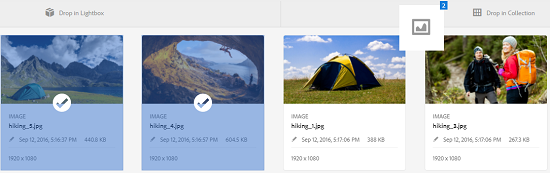
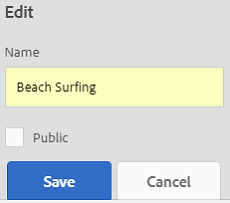

# 管理集合 {#managing-collections}

| 版本 | 文章連結 |
| -------- | ---------------------------- |
| AEM as a Cloud Service  | [按一下這裡](https://experienceleague.adobe.com/docs/experience-manager-cloud-service/content/assets/manage/manage-collections.html?lang=en) |
| AEM 6.5 | 本文章 |

集合是[!DNL Adobe Experience Manager Assets]中的一組資產。 使用集合在使用者之間共用資產。集合可以是靜態集合或基於搜尋結果的動態集合。

和檔案夾不同，集合可包含來自不同位置的資產。您可以與獲指派不同許可權層級（包括檢視、編輯等）的各種使用者共用集合。

您可以和使用者共用多個集合。每個集合都包含資產的參考資料。資產的參考完整性會跨越集合來維護。

根據集合整理資產的方式，集合有下列型別：

* 包含資產、資料夾和其他集合之靜態參考清單的集合。

* 根據搜尋條件動態包含資產的智慧型集合。

## 存取集合主控台 {#navigating-the-collections-console}

若要開啟&#x200B;**[!UICONTROL 集合]**，請在[!DNL Experience Manager]介面中移至&#x200B;**[!UICONTROL Assets]** > **[!UICONTROL 集合]**。

## 建立集合 {#creating-a-collection}

您可以使用[靜態參考](#creating-a-collection-with-static-references)或根據[搜尋條件型篩選器](#creating-a-smart-collection)來建立集合。 您也可以從Lightbox建立集合。

### 使用靜態參考建立集合 {#creating-a-collection-with-static-references}

您可以建立具有靜態參照的集合，例如，具有資產、資料夾、集合、迴轉集及影像集參照的集合。

1. 導覽至&#x200B;**[!UICONTROL 集合]**&#x200B;主控台。
1. 從工具列中按一下&#x200B;**[!UICONTROL 建立]**。
1. 在&#x200B;**[!UICONTROL 建立集合]**&#x200B;頁面中，輸入集合的標題和選擇性說明。
1. 新增成員至系列並指派適當的權限。或者，選取「 **[!UICONTROL 公用系列]** 」，讓所有使用者都能存取系列。

   >[!NOTE]
   >
   >若要讓成員與其他使用者共用集合，請在路徑`home/users`提供`dam-users`群組讀取許可權。 將許可權授與位於`/content/dam/collections`位置的使用者，讓使用者可以在彈出式清單中檢視集合。 或者，讓使用者成為`dam-users`群組的一部分。

1. （選用）為集合新增縮圖影像。
1. 按一下[建立]****，然後按一下[確定]]**關閉對話方塊。**[!UICONTROL &#x200B;具有指定標題和屬性的系列會在「系列」主控台中開啟。

   >[!NOTE]
   >
   >[!DNL Experience Manager Assets]可讓您為集合建立稽核任務，其方式與為資產資料夾建立稽核任務類似。

   若要將資產新增至收藏集，請導覽至[!DNL Assets]使用者介面。 如需詳細資訊，請參閱[將資產新增至集合](#adding-assets-to-a-collection)。

### 使用dropzone建立集合 {#create-collections-using-dropzone}

您可以從[!DNL Assets]使用者介面將資產拖曳至集合。 您也可以建立收藏集的副本，並將資產拖曳至該處。

1. 從[!DNL Assets]使用者介面中，選取您要新增至集合的資產。
1. 將資產拖曳至集合&#x200B;]**區域中的**[!UICONTROL &#x200B;拖放位置。 或者，按一下工具列中的&#x200B;**[!UICONTROL To Collection]**。

   

1. 在&#x200B;**[!UICONTROL 新增至集合]**&#x200B;頁面中，按一下工具列中的&#x200B;**[!UICONTROL 建立集合]**。

   如果您想要將資產新增至現有的集合，請從頁面中選取資產，然後按一下&#x200B;**[!UICONTROL 新增]**。 依預設，會選取最近更新的系列。

1. 在「建 **[!UICONTROL 立新系列]** 」對話方塊中，指定系列的名稱。如果您希望系列可供所有使用者存取，請選取「公用 **[!UICONTROL 系列」]**。
1. 按一下&#x200B;**[!UICONTROL 繼續]**&#x200B;以建立集合。

### 建立智慧型集合 {#creating-a-smart-collection}

智慧型集合會使用搜尋條件來動態填入資產。 您可以只使用檔案來建立Smart Collection，而不使用資料夾或檔案與資料夾。

若要建立智慧型集合，請遵循下列步驟：

1. 瀏覽至[!DNL Assets]使用者介面，然後按一下搜尋。

1. 在Omnisearch方塊中輸入搜尋關鍵字，並選取`Enter`。 開啟「篩選器」面板並套用搜尋篩選器。

1. 從&#x200B;**[!UICONTROL 檔案與資料夾]**&#x200B;清單中，選取&#x200B;**[!UICONTROL 檔案]**。

   

1. 按一下&#x200B;**[!UICONTROL 儲存智慧型集合]**。

1. 指定集合的名稱。 選取「**[!UICONTROL 公用]**」，將具有檢視器角色的DAM Users群組新增至智慧型集合。

   

   >[!NOTE]
   >
   >如果您選取&#x200B;**[!UICONTROL 公用]**，在您建立智慧型集合之後，擁有擁有者角色的所有人都可以使用該集合。 如果您取消&#x200B;**[!UICONTROL 公用]**&#x200B;選項，DAM使用者群組將不再與智慧型集合相關聯。

1. 按一下[儲存]**[!UICONTROL 以建立智慧型集合，然後關閉訊息方塊以完成程式。]**

   新的智慧型系列也會新增至&#x200B;**[!UICONTROL 已儲存的搜尋]**&#x200B;清單。

   

   **[!UICONTROL 建立智慧選擇]**&#x200B;選項的標籤變更為&#x200B;**[!UICONTROL 編輯智慧選擇]**。 要編輯智慧系列的設定，請從「檔案和文 **[!UICONTROL 件夾]** 」列 **[!UICONTROL 表中選擇「檔案]** 」。按一下&#x200B;**[!UICONTROL 編輯智慧選擇]** 選項。

## 將資產新增至集合 {#adding-assets-to-a-collection}

您可以將資產新增至包含參照資產或資料夾清單的集合。 智慧型集合會使用搜尋查詢來填入資產。 因此，資產和資料夾的靜態參考不適用於它們。

1. 在[!DNL A]資產使用者介面中，選取資產並按一下工具列中的&#x200B;**[!UICONTROL 至集合]** 。
或者，您可以將資產拖曳至介面上的**[!UICONTROL 拖放集合]**&#x200B;區域。 當區域的標籤變更為&#x200B;**[!UICONTROL 拖放以新增]**&#x200B;時，新增資產。

1. 在&#x200B;**[!UICONTROL 新增至集合]**&#x200B;頁面中，選取您要新增資產的集合。

1. 按一下&#x200B;**[!UICONTROL [新增]**]，然後關閉確認訊息。 資產會新增至集合中。

## 編輯智慧型集合 {#editing-a-smart-collection}

智慧型集合是透過儲存搜尋來建置，因此您可以修改[儲存的搜尋](#saved-searches)的搜尋引數來變更其內容。

1. 在[!DNL Assets]使用者介面中，按一下工具列中的搜尋選項。
1. 將游標放在Omnisearch方塊中，選取`Return`鍵。
1. 在[!DNL Experience Manager]介面中，開啟「篩選器」面板。
1. 從「保 **[!UICONTROL 存的搜索]** 」清單中，選擇要修改的智慧系列。「搜尋」面板會顯示為儲存的搜尋設定的篩選器。

   

1. 從&#x200B;**[!UICONTROL 檔案與資料夾]**&#x200B;清單中，選取&#x200B;**[!UICONTROL 檔案]**。
1. 視需要修改一或多個篩選器。 按一下&#x200B;**[!UICONTROL 編輯智慧型集合]**。

   您也可以編輯智慧型集合的名稱。

   

1. 按一下「**[!UICONTROL 儲存]**」。**[!UICONTROL 編輯智慧型集合]**&#x200B;對話方塊就會顯示。
1. 按一下&#x200B;**[!UICONTROL 覆寫]**，以已編輯的集合取代原始的智慧型集合。 或者，選取「**[!UICONTROL 另存新檔]**」以個別儲存編輯的集合。
1. 在確認對話方塊中，按一下&#x200B;**[!UICONTROL 儲存]**&#x200B;以完成程式。

## 檢視和編輯集合中繼資料 {#view-edit-collection-metadata}

收藏集中繼資料包含有關收藏集的資料，包括新增的任何標籤。

1. 從[!UICONTROL 集合]主控台，選取集合，然後按一下工具列中的&#x200B;**[!UICONTROL 屬性]**。
1. 在「系列 **[!UICONTROL 中繼資料]** 」頁面中，從「基本」和「進階」標籤檢視系 **[!UICONTROL 列中繼資]** 料 **** 。
1. 視需要修改中繼資料。 若要儲存變更，請按一下工具列中的[儲存並關閉]。****

## 大量編輯多個集合的中繼資料 {#editing-collection-metadata-in-bulk}

您可以同時編輯多個集合的中繼資料。 此功能可協助您在多個集合中快速復寫常見的中繼資料。

1. 在「集合」控制檯中，選取兩個或多個集合。
1. 在工具列中按一下&#x200B;**[!UICONTROL 屬性]**。
1. 在「系 **[!UICONTROL 列中繼資料]** 」頁面中，視需要編輯「基本」和「進階」標籤下的中繼資料 ******** 。
1. 若要檢視特定集合的中繼資料屬性，請取消選取集合清單中剩餘的集合。 中繼資料編輯器欄位會填入特定集合的中繼資料。

   >[!NOTE]
   >
   >* 在[!UICONTROL 屬性]頁面中，您可以取消選取範圍，從集合清單中移除集合。 集合清單預設會選取所有集合。 [!DNL Experience Manager]不會更新您移除之集合的中繼資料。
   >* 在清單頂端，選取&#x200B;**[!UICONTROL 標題]**&#x200B;附近的核取方塊，以在選取集合與清除清單之間切換。

1. 按一下工具列中的&#x200B;**[!UICONTROL 儲存並關閉]**，然後關閉確認對話方塊。
1. 若要將新的中繼資料附加至現有的中繼資料，請選取&#x200B;**[!UICONTROL 附加模式]**。 如果您未選取此選項，新的中繼資料會取代欄位中現有的中繼資料。按一下「**[!UICONTROL 提交]**」。

   >[!NOTE]
   >
   >您為所選集合新增的中繼資料會覆寫這些集合先前的中繼資料。 使用[!UICONTROL 附加模式]，在可以包含多個值的欄位中，將新值新增至現有的中繼資料。 一律會覆寫單值欄位。 您在[!UICONTROL 標籤]欄位中新增的任何標籤都會附加至中繼資料中的現有標籤清單。

若要自訂中繼資料[!UICONTROL 屬性]頁面，包括新增、修改、刪除中繼資料屬性，請使用結構描述編輯器。

>[!TIP]
>
>大量編輯方法適用於集合中可用的資產。 對於跨資料夾可用的資產，或符合共同條件的資產，可在搜尋](/help/assets/search-assets.md#metadataupdates)後[大量更新中繼資料。

## 搜尋集合 {#searching-collections}

您可以從「集合」控制檯搜尋集合。 當您在Omnisearch方塊中使用關鍵字搜尋時，[!DNL Assets]會搜尋系列名稱、中繼資料和新增至系列中的標籤。

如果您從最上層搜尋集合，搜尋結果中只會傳回個別集合。 已排除集合中的[!DNL Assets]個或資料夾。 在所有其他情況下（例如，在個別集合或資料夾階層中），所有相關的資產、資料夾和集合都會傳回。

## 在集合中搜尋 {#searching-within-collections}

在「系列」控制檯中，按一下某個系列以開啟它。

在收藏集中，[!DNL Experience Manager]搜尋僅限於您檢視之收藏集中的資產（及其標籤和中繼資料）。 在資料夾中搜尋時，系統將會傳回目前資料夾中所有相符的資產和子資料夾。 在集合中搜尋時，系統只會傳回符合的資產、資料夾及屬於集合直接成員的其他集合。

## 編輯集合設定 {#editing-collection-settings}

您可以編輯收藏集設定（例如標題和說明），或將成員新增至收藏集。

1. 選取集合，然後按一下工具列中的&#x200B;**[!UICONTROL 設定]**。 或者，使用集合縮圖中的&#x200B;**[!UICONTROL 設定]**&#x200B;快速動作。
1. 修改「系列設定」頁面中 **[!UICONTROL 的系列設定]** 。例如，如[新增集合](#creating-a-collection)中所述，修改集合標題、說明、成員和許可權。

1. 若要儲存變更，請按一下&#x200B;**[!UICONTROL 儲存]**。

## 刪除集合 {#deleting-a-collection}

1. 在「系列」控制檯中，選取一或多個系列，然後在工具列按一下「刪除」 。

1. 在對話方塊中，按一下&#x200B;**[!UICONTROL 刪除]**&#x200B;以確認刪除動作。

   >[!NOTE]
   >
   >您也可以[刪除已儲存的搜尋](#saved-searches)來刪除智慧型集合。

## 下載集合 {#downloading-a-collection}

下載收藏集時，會下載收藏集中資產的整個階層，包括資料夾和子收藏集。

1. 從「系列」控制檯中，選取要下載的一或多個系列。
1. 從工具列中按一下&#x200B;**[!UICONTROL 下載]**。
1. 在&#x200B;**[!UICONTROL 下載]**&#x200B;對話方塊中，按一下&#x200B;**[!UICONTROL 下載]**。 若要下載集合中資產的轉譯，請選取&#x200B;**[!UICONTROL 轉譯]**。 選取&#x200B;**[!UICONTROL 電子郵件]**&#x200B;選項，將電子郵件通知傳送給集合的擁有者。

   當您選取要下載的收藏集時，將會下載收藏集下的完整資料夾階層。 若要將您下載的每個收藏集（包括父收藏集下巢狀子收藏集中的資產）加入個別資料夾中，請選取&#x200B;**[!UICONTROL 為每個資產建立個別資料夾]**。

## 建立巢狀集合 {#creating-nested-collections}

您可以將集合新增至另一個集合，以建立巢狀集合。

1. 從「集合」控制檯中，選取想要的集合或集合群組，然後按一下工具列中的&#x200B;**[!UICONTROL 至集合]**。

1. 從&#x200B;**[!UICONTROL 新增至集合]**&#x200B;頁面，選取要新增集合的集合。

   >[!NOTE]
   >
   >預設會在&#x200B;**[!UICONTROL 新增至集合]**&#x200B;頁面中選取最近更新的集合。

1. 按一下&#x200B;**[!UICONTROL 「新增」]**。訊息會確認此集合已新增至&#x200B;**[!UICONTROL 選取目的地]**&#x200B;頁面中的目標集合。 關閉訊息以完成程式。

>[!NOTE]
>
>智慧型集合無法巢狀化。 換言之，智慧型集合不能包含任何其他集合。

## 已儲存搜尋 {#saved-searches}

在[!DNL Assets]使用者介面中，您可以根據特定規則、搜尋准則或自訂搜尋Facet來搜尋或篩選資產。 如果您將這些項目儲存為「 **[!UICONTROL 已儲存的搜尋]**」，您稍後可從「篩選」面板的「已儲存的搜尋 **** 」清單中存取。建立儲存的搜尋也會建立智慧型系列。

儲存的搜尋會在您建立智慧型系列時建立。智慧型系列會自動新增至「已儲 **[!UICONTROL 存的搜尋]** 」清單。集合的[!UICONTROL 已儲存搜尋]查詢儲存在CRXDE中相對位置`/content/dam/collections/`的`dam:query`屬性中。 您可以儲存的搜尋以及清單中顯示的已儲存搜尋沒有限制。

>[!NOTE]
>
>您可以使用與共用靜態集合相同的方式來共用智慧型集合。

編輯已儲存的搜尋與編輯智慧型集合相同。 如需詳細資訊，請參閱[編輯智慧型集合](#editing-a-smart-collection)。

若要刪除已儲存的搜尋，請執行下列步驟：

1. 在[!DNL Assets]使用者介面中，按一下搜尋。
1. 將游標放在Omnisearch欄位中，選取`Return`鍵。
1. 在[!DNL Experience Manager]介面中，開啟「篩選器」面板。
1. 從&#x200B;**[!UICONTROL 儲存的搜尋]**&#x200B;清單中，按一下您要刪除的智慧型系列旁的&#x200B;**[!UICONTROL 刪除]**。

   

1. 在對話方塊中，按一下&#x200B;**[!UICONTROL 刪除]**&#x200B;以刪除儲存的搜尋。

## 對集合執行工作流程 {#running-a-workflow-on-a-collection}

您可以為集合中的資產執行工作流程。 如果集合包含巢狀集合，工作流程也會在巢狀集合內的資產上執行。 不過，如果收藏集和巢狀收藏集包含重複資產，工作流程僅會針對此類資產執行一次。

1. 開啟&#x200B;**[!UICONTROL Assets]** > **[!UICONTROL 集合]**。 若要在特定集合上執行工作流程，請選取該工作流程。
1. 開啟&#x200B;**[!UICONTROL 時間表]**&#x200B;邊欄。 按一下，然後按一下&#x200B;**[!UICONTROL 開始工作流程]**。
1. 在「開 **[!UICONTROL 始工作流]** 」部分，從清單中選擇工作流模型。例如，選取「 **[!UICONTROL DAM更新資產」模型]** 。
1. 輸入工作流程的標題，然後按一下&#x200B;**[!UICONTROL 開始]**。
1. 在對話方塊中，按一下&#x200B;**[!UICONTROL 繼續]**。 工作流程會處理所選集合中的所有資產。

>[!MORELIKETHIS]
>
>* [設定Experience Manager Assets電子郵件通知](/help/sites-administering/notification.md#assetsconfig)
>* [建立集合的稽核任務](bulk-approval.md)
