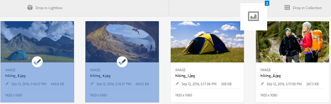
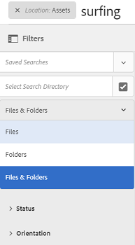
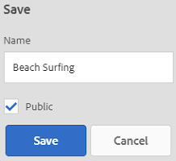
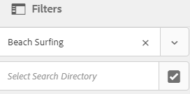
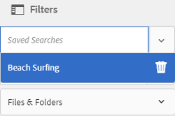
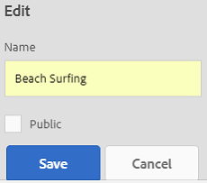
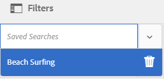

# 管理集合 {#managing-collections}

| 版本 | 文章連結 |
| -------- | ---------------------------- |
| AEM as a Cloud Service | [按一下這裡](https://experienceleague.adobe.com/docs/experience-manager-cloud-service/content/assets/manage/manage-collections.html?lang=en) |
| AEM 6.5 | 本文章 |

集合是[!DNL Adobe Experience Manager Assets]中的一組資產。 使用集合在使用者之間共用資產。 集合可以是靜態集合或基於搜尋結果的動態集合。

和檔案夾不同，集合可包含來自不同位置的資產。 您可以與獲指派不同許可權層級（包括檢視、編輯等）的各種使用者共用集合。

您可以和使用者共用多個集合。 每個集合都包含資產的參考資料。 資產的參考完整性會跨越集合來維護。

根據集合整理資產的方式，集合有下列型別：

* 包含資產、資料夾和其他集合之靜態參考清單的集合。

* 根據搜尋條件動態包含資產的智慧型集合。

## 存取集合主控台 {#navigating-the-collections-console}

若要開啟&#x200B;**[!UICONTROL 集合]**，請在[!DNL Experience Manager]介面中移至&#x200B;**[!UICONTROL Assets]** > **[!UICONTROL 集合]**。

## 建立集合 {#creating-a-collection}

您可以使用[靜態參考](#creating-a-collection-with-static-references)或根據[搜尋條件型篩選器](#creating-a-smart-collection)來建立集合。 您也可以從Lightbox建立集合。

### 使用靜態參考建立集合 {#creating-a-collection-with-static-references}

您可以建立具有靜態參照的集合，例如，具有資產、資料夾、集合、迴轉集及影像集參照的集合。

1. 導覽至&#x200B;**[!UICONTROL 集合]**&#x200B;主控台。
1. 從工具列中按一下&#x200B;**[!UICONTROL 建立]**。
1. 在&#x200B;**[!UICONTROL 建立集合]**&#x200B;頁面中，輸入集合的標題和選擇性說明。
1. 新增成員至系列並指派適當的權限。 或者，選取「 **[!UICONTROL 公用系列]** 」，讓所有使用者都能存取系列。

   >[!NOTE]
   >
   >若要讓成員與其他使用者共用集合，請在路徑`home/users`提供`dam-users`群組讀取許可權。 將許可權授與位於`/content/dam/collections`位置的使用者，讓使用者可以在彈出式清單中檢視集合。 或者，讓使用者成為`dam-users`群組的一部分。

1. （選用）為集合新增縮圖影像。
1. 按一下[建立]&#x200B;**&#x200B;**，然後按一下[確定]&#x200B;**關閉對話方塊。**&#x200B;具有指定標題和屬性的系列會在「系列」主控台中開啟。

   >[!NOTE]
   >
   >[!DNL Experience Manager Assets]可讓您為集合建立稽核任務，其方式與為資產資料夾建立稽核任務類似。

   若要將資產新增至收藏集，請導覽至[!DNL Assets]使用者介面。 如需詳細資訊，請參閱[將資產新增至集合](#adding-assets-to-a-collection)。

### 使用dropzone建立集合 {#create-collections-using-dropzone}

您可以從[!DNL Assets]使用者介面將資產拖曳至集合。 您也可以建立收藏集的副本，並將資產拖曳至該處。

1. 從[!DNL Assets]使用者介面中，選取您要新增至集合的資產。
1. 將資產拖曳至集合&#x200B;**區域中的**&#x200B;拖放位置。 或者，按一下工具列中的&#x200B;**[!UICONTROL To Collection]**。

   

1. 在&#x200B;**[!UICONTROL 新增至集合]**&#x200B;頁面中，按一下工具列中的&#x200B;**[!UICONTROL 建立集合]**。

   如果您想要將資產新增至現有的集合，請從頁面中選取資產，然後按一下&#x200B;**[!UICONTROL 新增]**。 依預設，會選取最近更新的系列。

1. 在「建 **[!UICONTROL 立新系列]** 」對話方塊中，指定系列的名稱。 如果您希望系列可供所有使用者存取，請選取「公用 **[!UICONTROL 系列」]**。
1. 按一下&#x200B;**[!UICONTROL 繼續]**&#x200B;以建立集合。

### 建立智慧型集合 {#creating-a-smart-collection}

智慧型集合會使用搜尋條件來動態填入資產。 您可以只使用檔案來建立Smart Collection，而不使用資料夾或檔案與資料夾。

若要建立智慧型集合，請遵循下列步驟：

1. 瀏覽至[!DNL Assets]使用者介面，然後按一下搜尋。

1. 在Omnisearch方塊中輸入搜尋關鍵字，並選取`Enter`。 開啟「篩選器」面板並套用搜尋篩選器。

1. 從&#x200B;**[!UICONTROL 檔案與資料夾]**&#x200B;清單中，選取&#x200B;**[!UICONTROL 檔案]**。

   

1. 按一下&#x200B;**[!UICONTROL 儲存智慧型集合]**。

1. 指定集合的名稱。 選取「**[!UICONTROL 公用]**」，將具有檢視器角色的DAM Users群組新增至智慧型集合。

   

   >[!NOTE]
   >
   >如果您選取&#x200B;**[!UICONTROL 公用]**，在您建立智慧型集合之後，擁有擁有者角色的所有人都可以使用該集合。 If you cancel the **[!UICONTROL Public]** option, the DAM user group is no longer associated with the smart collection.

1. Click **[!UICONTROL Save]** to create the smart collection, and then close the message box to complete the process.

   The new smart collection is also added to the **[!UICONTROL Saved Searches]** list.

   

   The label of the **[!UICONTROL Create Smart Selection]** option changes to **[!UICONTROL Edit Smart Selection]**. 要編輯智慧系列的設定，請從「檔案和文 **[!UICONTROL 件夾]** 」列 **[!UICONTROL 表中選擇「檔案]** 」。 Click the **[!UICONTROL Edit Smart Selection]**  option.

## 將資產新增至集合 {#adding-assets-to-a-collection}

You can add assets to a collection that contains a list of referenced assets or folders. Smart collections use a search query to populate assets. Therefore, static references to assets and folders are not applicable to them.

1. In the [!DNL A]ssets user interface, select the asset and click **[!UICONTROL To Collection]**  from the toolbar.
Alternatively, you can drag the asset to the **[!UICONTROL Drop in Collection]** area on the interface. Add the assets when the label of the region changes to **[!UICONTROL Drop to Add]**.

1. In the **[!UICONTROL Add To Collection]** page, select the collection to which you want to add the asset.

1. Click **[!UICONTROL Add]**, and then close the confirmation message. The asset is added to the collection.

## Edit a smart collection {#editing-a-smart-collection}

Smart collections are built by saving a search so you can alter their content by modifying the search parameters of the [saved search](#saved-searches).

1. In the [!DNL Assets] user interface, click the search option  from the toolbar.
1. With the cursor in the Omnisearch box, select the `Return` key.
1. In the [!DNL Experience Manager] interface, open the Filters panel.
1. 從「保 **[!UICONTROL 存的搜索]** 」清單中，選擇要修改的智慧系列。 「搜尋」面板會顯示為儲存的搜尋設定的篩選器。

   

1. 從&#x200B;**[!UICONTROL 檔案與資料夾]**&#x200B;清單中，選取&#x200B;**[!UICONTROL 檔案]**。
1. Modify one or more filters, as necessary. 按一下&#x200B;**[!UICONTROL 編輯智慧型集合]**。

   You can also edit the name of the smart collection.

   

1. 按一下「**[!UICONTROL 儲存]**」。 **[!UICONTROL 編輯智慧型集合]**&#x200B;對話方塊就會顯示。
1. 按一下&#x200B;**[!UICONTROL 覆寫]**，以已編輯的集合取代原始的智慧型集合。 或者，選取「**[!UICONTROL 另存新檔]**」以個別儲存編輯的集合。
1. 在確認對話方塊中，按一下&#x200B;**[!UICONTROL 儲存]**&#x200B;以完成程式。

## 檢視和編輯集合中繼資料 {#view-edit-collection-metadata}

收藏集中繼資料包含有關收藏集的資料，包括新增的任何標籤。

1. 從[!UICONTROL 集合]主控台，選取集合，然後按一下工具列中的&#x200B;**[!UICONTROL 屬性]**。
1. 在「系列 **[!UICONTROL 中繼資料]** 」頁面中，從「基本」和「進階」標籤檢視系 **[!UICONTROL 列中繼資]** 料 **&#x200B;**&#x200B;。
1. 視需要修改中繼資料。 若要儲存變更，請按一下工具列中的[儲存並關閉]。**&#x200B;**

## 大量編輯多個集合的中繼資料 {#editing-collection-metadata-in-bulk}

您可以同時編輯多個集合的中繼資料。 此功能可協助您在多個集合中快速復寫常見的中繼資料。

1. 在「集合」控制檯中，選取兩個或多個集合。
1. 在工具列中按一下&#x200B;**[!UICONTROL 屬性]**。
1. 在「系 **[!UICONTROL 列中繼資料]** 」頁面中，視需要編輯「基本」和「進階」標籤下的中繼資料 **&#x200B;**&#x200B;**&#x200B;** 。
1. 若要檢視特定集合的中繼資料屬性，請取消選取集合清單中剩餘的集合。 中繼資料編輯器欄位會填入特定集合的中繼資料。

   >[!NOTE]
   >
   >* 在[!UICONTROL 屬性]頁面中，您可以取消選取範圍，從集合清單中移除集合。 集合清單預設會選取所有集合。 [!DNL Experience Manager]不會更新您移除之集合的中繼資料。
   >* 在清單頂端，選取&#x200B;**[!UICONTROL 標題]**&#x200B;附近的核取方塊，以在選取集合與清除清單之間切換。

1. 按一下工具列中的&#x200B;**[!UICONTROL 儲存並關閉]**，然後關閉確認對話方塊。
1. 若要將新的中繼資料附加至現有的中繼資料，請選取&#x200B;**[!UICONTROL 附加模式]**。 如果您未選取此選項，新的中繼資料會取代欄位中現有的中繼資料。 按一下「**[!UICONTROL 提交]**」。

   >[!NOTE]
   >
   >您為所選集合新增的中繼資料會覆寫這些集合先前的中繼資料。 使用[!UICONTROL 附加模式]，在可以包含多個值的欄位中，將新值新增至現有的中繼資料。 一律會覆寫單值欄位。 您在[!UICONTROL 標籤]欄位中新增的任何標籤都會附加至中繼資料中的現有標籤清單。

To customize the metadata [!UICONTROL Properties] page, including adding, modifying, deleting metadata properties, use the Schema editor.

>[!TIP]
>
>The bulk editing method works for assets available in a collection. For the assets that are available across folders or match a common criteria, it is possible to [bulk update the metadata after searching](/help/assets/search-assets.md#metadataupdates).

## 搜尋集合 {#searching-collections}

You can search collections from the Collections console. When you search with keywords in the Omnisearch box, [!DNL Assets] searches for collection names, metadata, and the tags added to the collections.

If you search for collections from the top-level, only individual collections are returned in search results. [!DNL Assets] or folders within the collections are excluded. In all other cases (for example, within an individual collection or in a folder hierarchy), all relevant assets, folders, and collections are returned.

## 在集合內搜尋 {#searching-within-collections}

In the Collections console, click a collection to open it.

Within a collection, [!DNL Experience Manager] search is restricted to assets (and their tags and metadata) within the collection that you are viewing. When you search within a folder, all matching assets and child folders within the current folder are returned. When you search within a collection, only matching assets, folders, and other collections that are direct members of the collection are returned.

## Edit collection settings {#editing-collection-settings}

You can edit collection settings, such as title and description, or to add members to a collection.

1. Select a collection, and click **[!UICONTROL Settings]** in the toolbar. Alternatively, use the **[!UICONTROL Settings]** quick action from the collection thumbnail.
1. 修改「系列設定」頁面中 **[!UICONTROL 的系列設定]** 。 For example, modify the collection title, descriptions, members, and permissions as discussed in [Adding Collections](#creating-a-collection).

1. To save the changes, click **[!UICONTROL Save]**.

## 刪除集合 {#deleting-a-collection}

1. From the Collections console, select one or more collections and click delete from the toolbar.

1. In the dialog, click **[!UICONTROL Delete]** to confirm the delete action.

   >[!NOTE]
   >
   >You can also delete smart collections by [deleting saved searches](#saved-searches).

## 下載集合 {#downloading-a-collection}

When you download a collection, the entire hierarchy of assets within the collection is downloaded, including folders and child collections.

1. From the Collections console, select one or more collections to download.
1. From the toolbar, click **[!UICONTROL Download]**.
1. In the **[!UICONTROL Download]** dialog, click **[!UICONTROL Download]**. 若要下載集合中資產的轉譯，請選取&#x200B;**[!UICONTROL 轉譯]**。 選取&#x200B;**[!UICONTROL 電子郵件]**&#x200B;選項，將電子郵件通知傳送給集合的擁有者。

   當您選取要下載的收藏集時，將會下載收藏集下的完整資料夾階層。 若要將您下載的每個收藏集（包括父收藏集下巢狀子收藏集中的資產）加入個別資料夾中，請選取&#x200B;**[!UICONTROL 為每個資產建立個別資料夾]**。

## 建立巢狀集合 {#creating-nested-collections}

您可以將集合新增至另一個集合，以建立巢狀集合。

1. 從「集合」控制檯中，選取想要的集合或集合群組，然後按一下工具列中的&#x200B;**[!UICONTROL 至集合]**。

1. 從&#x200B;**[!UICONTROL 新增至集合]**&#x200B;頁面，選取要新增集合的集合。

   >[!NOTE]
   >
   >預設會在&#x200B;**[!UICONTROL 新增至集合]**&#x200B;頁面中選取最近更新的集合。

1. 按一下&#x200B;**[!UICONTROL 「新增」]**。 訊息會確認此集合已新增至&#x200B;**[!UICONTROL 選取目的地]**&#x200B;頁面中的目標集合。 關閉訊息以完成程式。

>[!NOTE]
>
>智慧型集合無法巢狀化。 換言之，智慧型集合不能包含任何其他集合。

## 已儲存搜尋 {#saved-searches}

在[!DNL Assets]使用者介面中，您可以根據特定規則、搜尋准則或自訂搜尋Facet來搜尋或篩選資產。 如果您將這些項目儲存為「 **[!UICONTROL 已儲存的搜尋]**」，您稍後可從「篩選」面板的「已儲存的搜尋 **&#x200B;**&#x200B;」清單中存取。 建立儲存的搜尋也會建立智慧型系列。

儲存的搜尋會在您建立智慧型系列時建立。 智慧型系列會自動新增至「已儲 **[!UICONTROL 存的搜尋]** 」清單。 集合的[!UICONTROL 已儲存搜尋]查詢儲存在CRXDE中相對位置`/content/dam/collections/`的`dam:query`屬性中。 您可以儲存的搜尋以及清單中顯示的已儲存搜尋沒有限制。

>[!NOTE]
>
>您可以使用與共用靜態集合相同的方式來共用智慧型集合。

編輯已儲存的搜尋與編輯智慧型集合相同。 如需詳細資訊，請參閱[編輯智慧型集合](#editing-a-smart-collection)。

若要刪除已儲存的搜尋，請執行下列步驟：

1. 在[!DNL Assets]使用者介面中，按一下搜尋。
1. 將游標放在Omnisearch欄位中，選取`Return`鍵。
1. 在[!DNL Experience Manager]介面中，開啟「篩選器」面板。
1. 從&#x200B;**[!UICONTROL 儲存的搜尋]**&#x200B;清單中，按一下您要刪除的智慧型系列旁的&#x200B;**[!UICONTROL 刪除]**。

   

1. In the dialog, click **[!UICONTROL Delete]** to delete the saved search.

## Execute a workflow on a collection {#running-a-workflow-on-a-collection}

You can run a workflow for the assets within a collection. If the collection contains nested collections, the workflow also runs on the assets within the nested collections. However, if the collection and the nested collection contain duplicate assets, the workflow only runs once for such assets.

1. Open **[!UICONTROL Assets]** > **[!UICONTROL Collections]**. To execute a workflow on a specific collection, select it.
1. Open **[!UICONTROL Timeline]** rail. Click  and click **[!UICONTROL Start Workflow]**.
1. 在「開 **[!UICONTROL 始工作流]** 」部分，從清單中選擇工作流模型。 例如，選取「 **[!UICONTROL DAM更新資產」模型]** 。
1. Enter a title for the workflow and click **[!UICONTROL Start]**.
1. In the dialog, click **[!UICONTROL Proceed]**. The workflow processes all the assets in the selected collection.

>[!MORELIKETHIS]
>
>* [Configure Experience Manager Assets email notifications](/help/sites-administering/notification.md#assetsconfig)
>* [Create a review task for Collections](bulk-approval.md)
