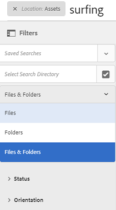

# 管理收藏集 {#managing-collections}

| 版本 | 文章連結 |
| -------- | ---------------------------- |
| AEM as a Cloud Service  | [按一下這裡](https://experienceleague.adobe.com/docs/experience-manager-cloud-service/content/assets/manage/manage-collections.html?lang=en) |
| AEM 6.5 | 本文 |

集合是 [!DNL Adobe Experience Manager Assets]。 使用收藏集在使用者之間共用資產。該集可以是靜態集合或基於搜索結果的動態集合。

和檔案夾不同，收藏集可包含來自不同位置的資產。您可以與分配了不同權限級別的不同用戶共用集合，包括查看、編輯等。

您可以和使用者共用多個收藏集。每個收藏集都包含資產的參考資料。資產的參考完整性會跨越收藏集來維護。

收集按資產歸類方式分為以下類型：

* 包含資產、資料夾和其他集合的靜態引用清單的集合。

* 基於搜索標準動態地包括資產的智慧集合。

## 訪問集合控制台 {#navigating-the-collections-console}

開啟 **[!UICONTROL 集合]**，也請參見Wiki頁。 [!DNL Experience Manager] 介面，轉到 **[!UICONTROL 資產]** > **[!UICONTROL 集合]**。

## 建立收藏集 {#creating-a-collection}

您可以使用 [靜態引用](#creating-a-collection-with-static-references) 或基於 [基於搜索准則的過濾器](#creating-a-smart-collection)。 也可以從光箱建立集合。

### 建立具有靜態引用的集合 {#creating-a-collection-with-static-references}

可以建立具有靜態引用的集合，例如具有對資產、資料夾、集合、旋轉集和影像集的引用的集合。

1. 導航到 **[!UICONTROL 集合]** 控制台。
1. 在工具欄中，按一下 **[!UICONTROL 建立]**。
1. 在 **[!UICONTROL 建立集合]** 的子菜單。
1. 新增成員至系列並指派適當的權限。或者，選取「 **[!UICONTROL 公用系列]** 」，讓所有使用者都能存取系列。

   >[!NOTE]
   >
   >要使成員能夠與其他用戶共用集合，請提供 `dam-users` 在路徑上組讀取權限 `home/users`。 將權限授予用戶 `/content/dam/collections` 位置，允許用戶查看彈出式清單中的「集合」。 或者，使用戶成為 `dam-users` 組。

1. （可選）為集合添加縮略圖。
1. 按一下 **[!UICONTROL 建立]**，然後按一下 **[!UICONTROL 確定]** 按鈕 具有指定標題和屬性的系列會在「系列」主控台中開啟。

   >[!NOTE]
   >
   >[!DNL Experience Manager Assets] 允許您為集合建立與為資產資料夾建立審閱任務類似的審閱任務。

   要將資產添加到收集，請定位至 [!DNL Assets] 用戶介面。 有關詳細資訊，請參閱 [將資產添加到集合](#adding-assets-to-a-collection)。

### 使用dropzone建立集合 {#create-collections-using-dropzone}

可以從 [!DNL Assets] 集合的用戶介面。 您還可以建立集合的副本，並將資產拖動到那裡。

1. 從 [!DNL Assets] 用戶介面，選擇要添加到集合的資產。
1. 將資產拖到 **[!UICONTROL 放入集合]** 的上界。 或者，按一下 **[!UICONTROL 收集]** 的子菜單。

   

1. 在 **[!UICONTROL 添加到集合]** 的 **[!UICONTROL 建立集合]** 的子菜單。

   如果要將資產添加到現有集合，請從頁面中選擇它，然後按一下 **[!UICONTROL 添加]**。 依預設，會選取最近更新的系列。

1. 在「建 **[!UICONTROL 立新系列]** 」對話方塊中，指定系列的名稱。如果您希望系列可供所有使用者存取，請選取「公用 **[!UICONTROL 系列」]**。
1. 按一下 **[!UICONTROL 繼續]** 的子菜單。

### 建立智慧集合 {#creating-a-smart-collection}

智慧集合使用搜索標準動態填充資產。 您只能使用檔案（而不是資料夾或檔案和資料夾）建立智慧集合。

要建立智慧集合，請執行以下步驟：

1. 導航到 [!DNL Assets] 用戶介面，然後按一下「搜索」。

1. 在「Omnisearch（搜索）」框中鍵入search關鍵字並選擇 `Enter`。 開啟「篩選器」面板並應用搜索篩選器。

1. 從 **[!UICONTROL 檔案和資料夾]** 清單，選擇 **[!UICONTROL 檔案]**。

   

1. 按一下 **[!UICONTROL 保存智慧集合]**。

1. 指定集合的名稱。 選擇 **[!UICONTROL 公共]** 將具有查看器角色的DAM用戶組添加到智慧集合。

   

   >[!NOTE]
   >
   >如果選擇 **[!UICONTROL 公共]**，建立後，具有所有者角色的每個人都可以使用智慧集合。 如果取消 **[!UICONTROL 公共]** 選項， DAM用戶組不再與智慧集合關聯。

1. 按一下 **[!UICONTROL 保存]** 建立智慧集合，然後關閉消息框以完成該過程。

   新智慧集合也添加到 **[!UICONTROL 保存的搜索]** 清單框。

   

   的標籤 **[!UICONTROL 建立智慧選擇]** 選項更改 **[!UICONTROL 編輯智慧選擇]**。 要編輯智慧系列的設定，請從「檔案和文 **[!UICONTROL 件夾]** 」列 **[!UICONTROL 表中選擇「檔案]** 」。按一下 **[!UICONTROL 編輯智慧選擇]**  的雙曲餘切值。

## 將資產新增至收藏集 {#adding-assets-to-a-collection}

您可以將資產添加到包含引用資產或資料夾清單的集合中。 智慧集合使用搜索查詢來填充資產。 因此，對資產和資料夾的靜態引用不適用於它們。

1. 在 [!DNL A]設定用戶介面，選擇資產，然後按一下 **[!UICONTROL 收集]**  的子菜單。
或者，可將資源拖動到 **[!UICONTROL 放入集合]** 的上界。 當區域的標籤更改為 **[!UICONTROL 拖放到添加]**。

1. 在 **[!UICONTROL 添加到集合]** 頁中，選擇要添加資產的集合。

1. 按一下 **[!UICONTROL 添加]**，然後關閉確認消息。 資產將添加到集合中。

## 編輯智慧集合 {#editing-a-smart-collection}

智慧集合是通過保存搜索來構建的，因此您可以通過修改 [保存的搜索](#saved-searches)。

1. 在 [!DNL Assets] 用戶介面，按一下搜索選項  的子菜單。
1. 在「搜索」框中，選擇 `Return` 按鈕
1. 在 [!DNL Experience Manager] 介面，開啟「篩選器」面板。
1. 從「保 **[!UICONTROL 存的搜索]** 」清單中，選擇要修改的智慧系列。「搜尋」面板會顯示為儲存的搜尋設定的篩選器。

   

1. 從 **[!UICONTROL 檔案和資料夾]** 清單，選擇 **[!UICONTROL 檔案]**。
1. 根據需要修改一個或多個篩選器。 按一下&#x200B;**[!UICONTROL 編輯智慧型集合]**。

   您也可以編輯智慧集合的名稱。

   

1. 按一下「**[!UICONTROL 儲存]**」。的 **[!UICONTROL 編輯智慧集合]** 對話框。
1. 按一下 **[!UICONTROL 覆蓋]** 將原始智慧集合替換為已編輯的集合。 或者，選擇 **[!UICONTROL 另存為]** 的子菜單。
1. 在確認對話框中，按一下 **[!UICONTROL 保存]** 來完成此過程。

## 檢視和編輯收藏集中繼資料 {#view-edit-collection-metadata}

集合元資料包括關於集合的資料，包括所添加的任何標籤。

1. 從 [!UICONTROL 集合] 控制台，選擇集合併按一下 **[!UICONTROL 屬性]** 的子菜單。
1. 在「系列 **[!UICONTROL 中繼資料]** 」頁面中，從「基本」和「進階」標籤檢視系 **[!UICONTROL 列中繼資]** 料 **** 。
1. 根據需要修改元資料。 要保存更改，請按一下 **[!UICONTROL 保存並關閉]** 的子菜單。

## 批量編輯多個集合的元資料 {#editing-collection-metadata-in-bulk}

可以同時編輯多個集合的元資料。 此功能可幫助您在多個集合中快速複製公共元資料。

1. 在「集合」控制台中，選擇兩個或多個集合。
1. 在工具欄中，按一下 **[!UICONTROL 屬性]**。
1. 在「系 **[!UICONTROL 列中繼資料]** 」頁面中，視需要編輯「基本」和「進階」標籤下的中繼資料 ******** 。
1. 要查看特定集合的元資料屬性，請取消在集合清單中選擇其餘集合。 元資料編輯器欄位用特定集合的元資料填充。

   >[!NOTE]
   >
   >* 在 [!UICONTROL 屬性] 的子菜單。 預設情況下，集合清單具有所有選定的集合。 [!DNL Experience Manager] 不更新您刪除的集合的元資料。
   >* 在清單頂部，選中靠近的複選框 **[!UICONTROL 標題]** 在選擇集合和清除清單之間切換。

1. 按一下 **[!UICONTROL 保存並關閉]** ，然後關閉確認對話框。
1. 要將新元資料與現有元資料一起追加，請選擇 **[!UICONTROL 追加模式]**。 如果您未選取此選項，新的中繼資料會取代欄位中現有的中繼資料。按一下 **[!UICONTROL 提交]**。

   >[!NOTE]
   >
   >為所選集合添加的元資料覆蓋這些集合的以前元資料。 使用 [!UICONTROL 追加模式] 將新值添加到包含多個值的欄位中的現有元資料。 始終覆蓋單值欄位。 添加到 [!UICONTROL 標籤] 的子菜單。

自定義元資料 [!UICONTROL 屬性] 頁，包括添加、修改、刪除元資料屬性，使用架構編輯器。

>[!TIP]
>
>批量編輯方法適用於集合中的可用資產。 對於跨資料夾可用或符合通用標準的資產， [搜索後批量更新元資料](/help/assets/search-assets.md#metadataupdates)。

## 搜索集合 {#searching-collections}

可以從「集合」控制台搜索集合。 在Omnisearch框中使用關鍵字搜索時， [!DNL Assets] 搜索集合名稱、元資料和添加到集合的標籤。

如果從頂層搜索集合，則搜索結果中只返回單個集合。 [!DNL Assets] 或將排除集合中的資料夾。 在所有其它情況下（例如，在單個集合或資料夾層次結構中），都會返回所有相關資產、資料夾和集合。

## 在集合內搜索 {#searching-within-collections}

在「集合」控制台中，按一下某個集合以將其開啟。

在收藏中， [!DNL Experience Manager] 搜索僅限於您正在查看的集合中的資產（及其標籤和元資料）。 在資料夾內搜索時，將返回當前資料夾中所有匹配的資產和子資料夾。 在集合內搜索時，只返回匹配的資產、資料夾和其他直接成員的集合。

## 編輯集合設定 {#editing-collection-settings}

您可以編輯集合設定，如標題和說明，或將成員添加到集合。

1. 選擇一個集合，然後按一下 **[!UICONTROL 設定]** 的子菜單。 或者，使用 **[!UICONTROL 設定]** 從集合縮略圖中快速執行操作。
1. 修改「系列設定」頁面中 **[!UICONTROL 的系列設定]** 。例如，修改集合標題、說明、成員和權限，如中所述 [添加集合](#creating-a-collection)。

1. 要保存更改，請按一下 **[!UICONTROL 保存]**。

## 刪除收藏集 {#deleting-a-collection}

1. 在「集合」控制台中，選擇一個或多個集合，然後從工具欄中按一下「刪除」。

1. 在對話框中，按一下 **[!UICONTROL 刪除]** 確認刪除操作。

   >[!NOTE]
   >
   >您也可以通過 [刪除已保存的搜索](#saved-searches)。

## 下載收藏集 {#downloading-a-collection}

下載集合時，將下載集合中資產的整個層次結構，包括資料夾和子集合。

1. 從「集合」控制台中，選擇要下載的一個或多個集合。
1. 在工具欄中，按一下 **[!UICONTROL 下載]**。
1. 在 **[!UICONTROL 下載]** 對話框，按一下 **[!UICONTROL 下載]**。 如果要下載收藏中資產的格式副本，請選擇 **[!UICONTROL 格式副本]**。 選擇 **[!UICONTROL 電子郵件]** 的子菜單。

   選擇要下載的集合時，將下載集合下的完整資料夾層次結構。 要將下載的每個集合（包括嵌套在父集合下的子集合中的資產）包括在單個資料夾中，請選擇 **[!UICONTROL 為每個資產建立單獨的資料夾]**。

## 建立嵌套集合 {#creating-nested-collections}

您可以將集合添加到另一個集合，從而建立嵌套集合。

1. 在「集合」控制台中，選擇所需的集合或集合組，然後按一下 **[!UICONTROL 收集]** 的子菜單。

1. 從 **[!UICONTROL 添加到集合]** 的子菜單。

   >[!NOTE]
   >
   >預設情況下，在 **[!UICONTROL 添加到集合]** 的子菜單。

1. 按一下 **[!UICONTROL 添加]**。 消息確認集合已添加到 **[!UICONTROL 選擇目標]** 的子菜單。 關閉消息以完成該過程。

>[!NOTE]
>
>智慧集合不能嵌套。 換句話說，智慧集合不能包含任何其他集合。

## 已儲存搜尋 {#saved-searches}

在 [!DNL Assets] 用戶介面中，您可以根據某些規則、搜索標準或自定義搜索小平面來搜索或過濾資產。 如果您將這些項目儲存為「 **[!UICONTROL 已儲存的搜尋]**」，您稍後可從「篩選」面板的「已儲存的搜尋 **** 」清單中存取。建立儲存的搜尋也會建立智慧型系列。

儲存的搜尋會在您建立智慧型系列時建立。智慧型系列會自動新增至「已儲 **[!UICONTROL 存的搜尋]** 」清單。的 [!UICONTROL 保存的搜索] 收集的查詢保存在 `dam:query` 相對位置的CRXDE中的屬性 `/content/dam/collections/`。 您可以保存的搜索和清單中顯示的已保存搜索沒有限制。

>[!NOTE]
>
>您可以以共用靜態集合的相同方式共用智慧集合。

編輯保存的搜索與編輯智慧集合相同。 有關詳細資訊，請參閱 [編輯智慧集合](#editing-a-smart-collection)。

要刪除已保存的搜索，請執行以下步驟：

1. 在 [!DNL Assets] 用戶介面，按一下「搜索」 。
1. 在Omnisearch欄位中，選擇 `Return` 按鈕
1. 在 [!DNL Experience Manager] 介面，開啟「篩選器」面板。
1. 從 **[!UICONTROL 保存的搜索]** 清單，按一下 **[!UICONTROL 刪除]** 的子菜單。

   

1. 在對話框中，按一下 **[!UICONTROL 刪除]** 的子菜單。

## 對集合執行工作流 {#running-a-workflow-on-a-collection}

您可以為集合內的資產運行工作流。 如果集合包含嵌套集合，則該工作流也會在嵌套集合內的資產上運行。 但是，如果集合和嵌套集合包含重複的資產，則此工作流僅為此類資產運行一次。

1. 開啟 **[!UICONTROL 資產]** > **[!UICONTROL 集合]**。 要在特定集合上執行工作流，請選擇它。
1. 開啟 **[!UICONTROL 時間軸]** 鐵軌。 按一下  按一下 **[!UICONTROL 啟動工作流]**。
1. 在「開 **[!UICONTROL 始工作流]** 」部分，從清單中選擇工作流模型。例如，選取「 **[!UICONTROL DAM更新資產」模型]** 。
1. 輸入工作流的標題，然後按一下 **[!UICONTROL 開始]**。
1. 在對話框中，按一下 **[!UICONTROL 繼續]**。 工作流將處理選定集合中的所有資產。

>[!MORELIKETHIS]
>
>* [配置Experience Manager Assets電子郵件通知](/help/sites-administering/notification.md#assetsconfig)
>* [為收集建立審閱任務](bulk-approval.md)

