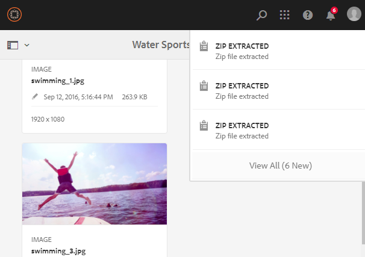

# 管理您的數位資產 {#managing-assets-with-the-touch-optimized-ui}

本文說明如何在Adobe Experience Manager(AEM)Assets中管理和編輯資產。 若要開始使用使用者介面和版面，請參閱「 [Touch UI的基本處理」](/help/sites-authoring/basic-handling.md)。 若要管理內容片段，請參 [閱管理內容片段](content-fragments-managing.md) 。

## 建立資料夾 {#creating-folders}

組織資產集合（例如，所有影像）時， `Nature` 您可以建立資料夾以將資產保持在一起。 您可以使用資料夾來分類和組織您的資產。 AEM Assets不需要您在檔案夾中組織資產，以提高工作效率。

>[!NOTE]
>
>* 共用至Marketing Cloud時不 `sling:OrderedFolder`支援共用類型的「資產」檔案夾。 如果要共用資料夾，在建立資料夾時不 [!UICONTROL 要選擇] 「有序」。
>* Experience Manager不允許將 `subassets` Word用作資料夾的名稱。 它是為節點保留的關鍵字，其中包含複合資產的子資產。

1. 導覽至您要建立新資料夾的數位資產檔案夾。 在功能表中，按一下「 **[!UICONTROL 建立]**」。 選擇「 **[!UICONTROL 新建資料夾]**」。
1. 在「標 **[!UICONTROL 題]** 」欄位中，提供檔案夾名稱。 依預設，DAM會使用您提供的標題作為檔案夾名稱。 建立資料夾後，您可以覆寫預設資料夾，並指定另一個資料夾名稱。
1. 按一下 **[!UICONTROL 建立]**。您的資料夾會顯示在數位資產資料夾中。

不支援下列（以空格分隔的）字元清單：

* 資產檔案名稱不能包含下列任何字元： `* / : [ \\ ] | # % { } ? &`
* 資產檔案夾名稱不能包含下列任何字元： `* / : [ \\ ] | # % { } ? \" . ^ ; + & \t`

## Upload assets {#uploading-assets}

<!-- TBD the following:
Move this section into a new article. CQDOC-14874 ticket is created for this.
In this complete article, replace emphasis with UICONTROL where appropriate.
-->

您可以從本機資料夾或網路磁碟機上傳各種類型的資產（包括影像、PDF檔案、RAW檔案等）至AEM Assets。

>[!NOTE]
>
>在動態媒體- Scene7模式中，您只能上傳檔案大小為2 GB或以下的資產。

您可以選擇將資產上傳至資料夾，不論資料夾是否已指派處理設定檔。

對於已指派處理設定檔的檔案夾，描述檔名稱會出現在卡片檢視的縮圖上。 在清單視圖中，配置檔案名稱將顯示在「處 **理配置檔案** 」列中。 請參閱 [處理描述檔](/help/assets/processing-profiles.md)。

在上傳資產之前，請確定其格式 [為](/help/assets/assets-formats.md) AEM Assets支援的格式。

1. 在「資產」使用者介面中，導覽至您要新增數位資產的位置。
1. 若要上傳資產，請執行下列其中一項作業：

   * 在工具列上，點選「建 **[!UICONTROL 立]** 」圖示。 然後在功能表上點選「 **[!UICONTROL 檔案」]**。 如有需要，可在顯示的對話框中更名檔案。
   * 在支援HTML5的瀏覽器中，直接將資產拖曳至「資產」使用者介面。 不會顯示要更名檔案的對話框。
   

   要選擇多個檔案，請按Ctrl或Command鍵，然後在檔案選擇器對話框中選擇資產。 使用iPad時，一次只能選取一個檔案。

   您可以暫停上傳大型資產（大於500 MB），稍後從同一頁繼續。 點選進 **[!UICONTROL 度列旁邊的]** 「暫停」圖示，此圖示會在上載開始時顯示。

   

   資產被視為大型資產的大小可以設定。 例如，您可以設定系統，將超過1000 MB（而非500 MB）的資產視為大型資產。 在這種情況下，當 **[!UICONTROL 上傳大小大於]** 1000 MB的資產時，進度列上會顯示「暫停」。

   如果上傳的檔案大於1000 MB，且檔案小於1000 MB，則「暫停」按鈕不會顯示。 不過，如果您取消少於1000 MB的檔案上傳，則會顯示「暫 **[!UICONTROL 停]** 」按鈕。

   要修改大小限制，請在CRX存 `chunkUploadMinFileSize` 儲庫中配 `fileupload`置節點的屬性。

   當您按一下「暫 **[!UICONTROL 停]** 」圖示時，會切換為「 **** 播放」圖示。 若要繼續上傳，請按一下「播 **[!UICONTROL 放]** 」圖示。

   

   若要取消進行中的上傳，請按一下進`X`度列旁的關閉()。 當您取消上傳作業時，AEM Assets會刪除部分上傳的資產。

   在低頻寬情況和網路故障中，恢復上傳的功能特別有用，因為上傳大型資產需要很長時間。 您可以暫停上傳作業，等到情況改善後再繼續。 繼續時，從您暫停的點開始上傳。

   在上傳作業期間，AEM會將上傳的資產部分儲存為CRX儲存庫中的資料區塊。 上傳完成時，AEM會將這些區塊整合到儲存庫中的單一資料區塊。

   要為未完成的區塊上載作業配置清除任務，請轉至 `https://[aem_server]:[port]/system/console/configMgr/org.apache.sling.servlets.post.impl.helper.ChunkCleanUpTask`。

   如果您上傳的資產名稱與資產名稱相同，且資產已在上傳資產的位置使用，則會顯示警告對話方塊。

   您可以選擇取代現有資產、建立其他版本，或借由重新命名已上傳的新資產來保留兩者。 如果您取代現有資產，資產的中繼資料以及您對現有資產所做的任何先前修改（例如註解或裁切）都會被刪除。 如果您選擇保留這兩個資產，新資產會重新命名，並附加 `1` 數字至其名稱。

   

   >[!NOTE]
   >
   >在「名稱衝 **[!UICONTROL 突]** 」( [!UICONTROL Name Conflict] )對話框中選擇「替換」(Replace)時，會為新資產重新生成資產ID。 此ID與先前資產的ID不同。
   >
   >如果「資產前瞻分析」已啟用，可以使用Adobe Analytics追蹤曝光／點按次數，則重新產生的資產ID會使Analytics上為資產擷取的資料無效。

   如果您上傳的資產存在於AEM Assets中，「偵測到重複項目 **** 」對話方塊會警告您嘗試上傳重複的資產。 僅當現有資產的二進 `SHA 1` 制校驗和值與您上傳的資產的校驗和值匹配時，才會顯示該對話框。 在這種情況下，資產名稱並不重要。

   >[!NOTE]
   >
   >僅當 [!UICONTROL 啟用重複檢測功能時] ，才會顯示「檢測到重複項」對話框。 若要啟用重複偵測功能，請參 [閱啟用重複偵測](/help/assets/duplicate-detection.md)。

   

   若要保留AEM Assets中的重複資產，請點選／按一下「 **[!UICONTROL 保留]**」。 若要刪除您上傳的重複資產，請點選／按一下「刪 **[!UICONTROL 除」]**。

   AEM Assets會防止您上傳檔案名稱中包含禁止字元的資產。 如果您嘗試上傳包含不允許之字元或以上之檔案名稱的資產，AEM Assets會顯示警告訊息並停止上傳，直到您移除這些字元或上傳包含允許名稱為止。

   為符合貴組織的特定檔案命名慣例，「上 [!UICONTROL 傳資產] 」對話方塊可讓您指定上傳之檔案的長名稱。

   但是，不支援下列（以空格分隔的）字元清單：

   * 資產檔案名稱不可包含 `* / : [ \\ ] | # % { } ? &`
   * 資產資料夾名稱不可包含 `* / : [ \\ ] | # % { } ? \" . ^ ; + & \t`
   

   此外，「資產」使用者介面會顯示您上傳的最近資產或您先建立的檔案夾。

   如果您在上傳檔案之前取消上傳作業，AEM Assets會停止上傳目前的檔案並重新整理內容。 不過，已上傳的檔案不會刪除。

   「AEM資產」中的上傳進度對話方塊會顯示成功上傳檔案的計數，以及無法上傳的檔案。

### 串列上傳 {#serialuploads}

大量上傳許多資產會耗用大量的I/O資源，這可能會對AEM Assets例項的效能造成負面影響。 尤其是，如果您的網際網路連線緩慢，由於磁碟I/O尖峰，上傳的時間會大幅增加。此外，您的網頁瀏覽器可能會對AEM Assets可處理的並行資產上傳POST請求數量加以限制。 因此，上載操作會失敗或提前終止。 換言之，AEM資產可能會在擷取大量檔案時遺失某些檔案，或完全無法擷取任何檔案。

為克服此情況，AEM Assets會在大量上傳作業期間一次收錄一個資產（串列上傳），而非同時擷取所有資產。

預設會啟用資產的串列上傳。 若要停用功能並允許並行上傳，請以Crx-de `fileupload` 覆蓋節點，並將屬性的值 `parallelUploads` 設為 `true`。

### 使用FTP上傳資產 {#uploading-assets-using-ftp}

動態媒體可讓您透過FTP伺服器批次上傳資產。 如果您要上傳大型資產(> 1 GB)或上傳整個資料夾和子資料夾，則應使用FTP。 您甚至可以設定FTP上傳，以定期執行。

>[!NOTE]
>
>在動態媒體- Scene7模式中，您只能上傳檔案大小為2 GB或以下的資產。

>[!NOTE]
>
>若要在「動態媒體- Scene7」模式中透過FTP上傳資產，請在AEM作者例項上安裝Feature Pack 18912。 請連 [絡Adobe客戶服務](https://helpx.adobe.com/contact/enterprise-support.ec.html) ，以取得FP-18912的存取權，並完成FTP帳戶的設定。 如需詳細資訊，請參 [閱安裝功能套件18912以進行大量資產移轉](/help/assets/bulk-ingest-migrate.md)。
>
>如果您使用FTP來上傳資產，則會忽略AEM中指定的上傳設定。 而是使用Dynamic Media Classic中定義的檔案處理規則。

**若要使用FTP上傳資產**

1. 使用您選擇的FTP用戶端，使用您從布建電子郵件收到的FTP使用者名稱和密碼登入FTP伺服器。 在FTP用戶端中，將檔案或資料夾上傳至FTP伺服器。
1. [使用從布建電子郵件收到的憑證](https://www.adobe.com/marketing-cloud/experience-manager/scene7-login.html) ，登入Dynamic Media Classic。 在全域導覽列上，點選「上 **[!UICONTROL 傳」]**。

1. 在左上角附近的「上傳」頁面上，點選「透過 **[!UICONTROL FTP]** 」標籤。
1. 在頁面的左側，選擇FTP資料夾，從中上傳檔案；在頁面的右側，選擇目標資料夾。
1. 在頁面的右下角，按一下「 **[!UICONTROL Job Options]** 」（作業選項），然後根據您選取之資料夾中的資產來設定所要的選項。

   請參 [閱上傳工作選項](#upload-job-options)。

   >[!NOTE]
   >
   >當您透過FTP上傳資產時，您在Dynamic Media Classic(S7)中設定的上傳工作選項會取代在AEM中設定的資產處理參數。

1. 在「上傳工作選項」對話方塊的右下角，點選「儲存 **[!UICONTROL 」]**。
1. 在「上傳」頁面的右下角，點選「提交 **[!UICONTROL 上傳」]**。

   若要檢視上傳的進度，請在全域導覽列上點選「工 **[!UICONTROL 作」]**。 「作業」頁面顯示上載進度。 您可以繼續在AEM中工作，並隨時返回Dynamic Media Classic中的「工作」頁面，以檢視進行中的工作。
若要取消正在進行中的上載作業，請點選「 **[!UICONTROL 持續時間]** 」旁的「取消」。

#### 上傳工作選項 {#upload-job-options}

| 上傳選項 | 子選項 | 說明 |
|---|---|---|
| 工作名稱 |  | 預先填入文字欄位的預設名稱包括名稱的使用者輸入部分以及日期和時間戳記。 您可以使用預設名稱，或輸入您自己為此上傳工作建立的名稱。  作業和其他上載和發佈作業記錄在「作業」頁面上，您可以在此處檢查作業的狀態。 |
| 上傳後發佈 |  | 自動發佈您上傳的資產。 |
| 在任何資料夾中覆寫相同的基本資產名稱，不論副檔名為何 |  | 如果希望上載的檔案用相同的名稱替換現有檔案，請選擇此選項。 此選項的名稱可能不同，具體取決於「應用程式設定 **[!UICONTROL >一般設定]** >上傳至應用程式 **[!UICONTROL >覆寫影像」中]**********&#x200B;的設定。 |
| 上傳時解壓縮Zip或Tar檔案 |  |  |
| 工作選項 |  | 點選／按一 **[!UICONTROL 下「工作選項]** 」以開啟「上傳工  作選項」對話方塊，並選擇影響整個上傳工作的選項。 這些選項對於所有檔案類型都是相同的。 您可以從「應用程式一般設定」頁面開始，選擇上傳檔案的預設選項。 要開啟此頁，請選擇「 **[!UICONTROL 設定]** >應 **[!UICONTROL 用程式設定]**」。 點選「預 **[!UICONTROL 設上傳選項]** 」按鈕，以開啟「  上傳工作選項」對話方塊。 |
|  | 時間 | 選擇「一次性」或「循環」。 若要設定循環作業，請選擇「重複」選項（每日、每週、每月或自訂），以指定何時要重複執行FTP上傳作業。 然後視需要指定排程選項。 |
|  | 包含子檔案夾 | 上傳您要上傳之資料夾內的所有子資料夾。 您上傳的檔案夾及其子檔案夾名稱會自動輸入到AEM Assets中。 |
|  | 裁切選項 | 若要從影像的兩側手動裁切，請選取「裁切」功能表，然後選擇「手動」。 然後輸入要從影像的任一側或每一側裁切的像素數。 影像被裁切的程度取決於影像檔案中的ppi（像素／英吋）設定。 例如，如果影像顯示150 ppi，而您在「頂端」、「右側」、「底部」和「左側」文字方塊中輸入75，則會從每側裁切半英吋。  若要自動裁切影像中的空白像素，請開啟「裁切」功能表，選擇「手動」，然後在「頂端」、「右側」、「底部」和「左側」欄位中輸入像素測量值，以便從兩側裁切。 您也可以在「裁切」選單中選擇「修剪」，然後選擇下列選項：  **根據** <ul><li>**顏色** -選擇顏色選項。 然後選取「角」選單，並選擇影像的角，其顏色最能代表您要裁切的空白顏色。</li><li>**透明度** -選擇「透明度」選項。  **容差** -拖曳滑桿以指定0到1的容差。若要根據顏色進行修剪，請指定0以裁切像素，前提是像素完全符合您在影像角落選取的顏色。 接近1的數字允許更多顏色差異。 若要根據透明度進行修剪，請指定0以僅在像素為透明時裁切像素。 接近1的數字可以增加透明度。</li></ul> 請注意，這些裁切選項不具破壞性。 |
|  | 色彩描述檔選項 | 當您建立用於傳送的最佳化檔案時，請選擇顏色轉換：<ul><li>預設色彩保留：當影像包含色域資訊時，保持原始影像顏色；沒有顏色轉換。 現今幾乎所有的影像都已內嵌適當的色彩描述檔。 不過，如果CMYK來源影像不包含內嵌的色彩描述檔，這些色彩會轉換為sRGB（標準紅綠藍）色域。 sRGB是建議在網頁上顯示影像的色域。</li><li>保留原始色域：保留原始顏色，點上不進行任何顏色轉換。 對於沒有內嵌色彩描述檔的影像，任何色彩轉換都會使用「發佈」設定中設定的預設色彩描述檔來完成。 顏色配置檔案可能與使用此選項建立的檔案中的顏色不對齊。 因此，建議您使用「預設色彩保留」選項。</li><li>「自訂自」>「至  」開啟功能表，您可以選擇「轉換自」和「轉換至顏色空間」。 此進階選項會覆寫內嵌在來源檔案中的任何色彩資訊。 當您要送出的所有影像都包含不正確或遺失的色彩描述檔資料時，請選取此選項。</li></ul> |
|  | 影像編輯選項 | 您可以保留影像中的剪裁遮色片，並選擇色彩描述檔。  請參 [閱上傳時的設定影像編輯選項](#setting-image-editing-options-at-upload)。 |
|  | Postscript選項 | 您可以點陣化PostScript®檔案、裁切檔案、維護透明背景、選擇解析度，以及選擇色域。  請參 [閱設定PostScript和Illustrator上傳選項](#setting-postscript-and-illustrator-upload-options)。 |
|  | Photoshop選項 | 您可以從Adobe® Photoshop®檔案建立範本、維護圖層、指定圖層的命名方式、擷取文字，以及指定影像錨定至範本的方式。  請注意，AEM不支援範本。  請參 [閱「設定Photoshop上傳選項](#setting-photoshop-upload-options)」。 |
|  | PDF選項 | 您可以點陣化檔案、擷取搜尋字詞和連結、自動產生eCatalog、設定解析度，以及選擇色域。  請注意，AEM不支援eCatalogs。   請參閱 [設定PDF上傳選項](#setting-pdf-upload-options)。 |
|  | Illustrator選項 | 您可以點陣化Adobe Illustrator®檔案、維護透明背景、選擇解析度，以及選擇色域。  請參 [閱設定PostScript和Illustrator上傳選項](#setting-postscript-and-illustrator-upload-options)。 |
|  | 視訊選項 | 您可以選擇「視訊預設集」來轉碼視訊檔案。  請參 [閱設定eVideo上傳選項](#setting-evideo-upload-options)。 |
|  | 批次集預設集 | 若要從上傳的檔案建立影像集或回轉集，請按一下您要使用之預設集的作用中欄。 您可以選取多個預設集。 您可以在Dynamic Media Classic的「應用程式設定／批次設定預設集」頁面中建立預設集。  請參 [閱將批次集預設集設定為自動產生影像集和回轉集](config-dms7.md#creating-batch-set-presets-to-auto-generate-image-sets-and-spin-sets) ，以進一步瞭解如何建立批次集預設集。  請參閱 [在上傳時設定批次集預設集](#setting-batch-set-presets-at-upload)。 |

#### 在上傳時設定影像編輯選項 {#setting-image-editing-options-at-upload}

上傳影像檔案（包括AI、EPS和PSD檔案）時，您可以在「上傳工作選項」對話方塊中執 [!UICONTROL 行下列編輯動作] :

* 從影像邊緣裁切空白（請參閱上表的說明）。
* 從影像側手動裁切（請參閱上表的說明）。
* 選擇顏色描述檔（請參閱上表中的選項說明）。
* 從剪裁路徑建立遮色片。
* 使用銳利化遮色片選項銳利化影像
* 挖空背景

<!--
| Option | Sub-option | Description |
|---|---|---|
| Create Mask From Clipping Path | | Create a mask for the image based on its clipping path information. This option applies to images created with image-editing applications in which a clipping path was created. |
| Unsharp Masking | | Lets you fine-tune a sharpening filter effect on the final downsampled image, controlling the intensity of the effect, the radius of the effect (as measured in pixels), and a threshold of contrast that is ignored.  This effect uses the same options as Photoshop’s Unsharp Mask filter. Contrary to what the name suggests, Unsharp Mask is a sharpening filter. Under Unsharp Masking, set the options you want. Setting options are described in the following: |
| | Amount | Controls the amount of contrast that is applied to edge pixels.  Think of it as the intensity of the effect. The main difference between the amount values of Unsharp Mask in Dynamic Media and the amount values in Adobe Photoshop, is that Photoshop has an amount range of 1% to 500%. Whereas, in Dynamic Media, the value range is 0.0 to 5.0. A value of 5.0 is the rough equivalent of 500% in Photoshop; a value of 0.9 is the equivalent of 90%, and so on. |
| | Radius | Controls the radius of the effect. The value range is 0-250.  The effect is run on all pixels in an image and radiates out from all pixels in all directions. The radius is measured in pixels. For example, to get a similar sharpening effect for a 2000 x 2000 pixel image and 500 x 500 pixel image, you would set a radius of two pixels on the 2000 x 2000 pixel image and a radius value of one pixel on the 500 x 500 pixel image. A larger value is used for an image that has more pixels. |
| | Threshold | Threshold is a range of contrast that is ignored when the Unsharp Mask filter is applied. It is important so that no "noise" is introduced to an image when this filter is used. The value range is 0-255, which is the number of brightness steps in a grayscale image. 0=black, 128=50% gray and 255=white.  For example, a threshold value of 12 ignores slight variations is skin tone brightness to avoid adding noise, but still add edge contrast to areas such as where eyelashes meet skin.  For example, if you have a photo of someone’s face, the Unsharp Mask affects the parts of the image, such as where eyelashes and skin meet to create an obvious area of contrast, and the smooth skin itself. Even the smoothest skin exhibits subtle changes in brightness values. If you do not use a threshold value, the filter accentuates these subtle changes in skin pixels. In turn, a noisy and undesirable effect is created while contrast on the eyelashes is increased, enhancing sharpness.  To avoid this issue, a threshold value is introduced that tells the filter to ignore pixels that do not change contrast dramatically, like smooth skin.  In the zipper graphic shown earlier, notice the texture next to the zippers. Image noise is exhibited because the threshold values were too low to suppress the noise. |
| | Monochrome | Select to unsharp-mask image brightness (intensity).  Deselect to unsharp-mask each color component separately. |
| Knockout Background | | Automatically removes the background of an image when you upload it. This technique is useful to draw attention to a particular object and make it stand out from a busy background. Select to enable or “turn on” the Knockout Background feature and the following sub-options: |
| | Corner | Required.  The corner of the image that is used to define the background color to knockout.  You can choose from **Upper Left**, **Bottom Left**, **Upper Right**, or **Bottom Right**. |
| | Fill Method | Required.  Controls pixel transparency from the Corner location that you set.  You can choose from the following fill methods: <ul><li>**Flood Fill** - turns all pixels transparent that match the Corner that you have specified and are connected to it.</li><li>**Match Pixel** - turns all matching pixels transparent, regardless of their location on the image.</li></ul> |
| | Tolerance | Optional.  Controls the allowable amount of variation in pixel color matching based on the Corner location that you set.  Use a value of 0.0 to match pixel colors exactly or, use a value of 1.0 to allow for the greatest variation. |
-->

#### 設定PostScript和Illustrator上傳選項 {#setting-postscript-and-illustrator-upload-options}

當您上傳PostScript(EPS)或Illustrator(AI)影像檔時，可以以各種方式設定檔案格式。 您可以點陣化檔案、維持透明背景、選擇解析度，以及選擇色域。 在「PostScript選項」和「Illustrator選項」下的「上傳工作選項」對話方塊中， [!UICONTROL 可使用PostScript和Illustrator] 檔案格式設 [!UICONTROL 定選項]。

| 選項 | 子選項 | 說明 |
|---|---|---|
| 處理 |  | 選擇「 **[!UICONTROL 點陣化]** 」，將檔案中的向量圖形轉換為點陣圖格式。 |
| 在轉譯的影像中維持透明背景 |  | 維持檔案的背景透明度。 |
| 解析度 |  | 決定解析度設定。 此設定會決定檔案中每英吋顯示多少像素。 |
| 色彩空間 |  | 選取「色域」選單，然後從下列色域選項中選擇： |
|  | 自動偵測 | 保留檔案的顏色空間。 |
|  | 強制為RGB | 轉換為RGB色域。 |
|  | 強制為CMYK | 轉換為CMYK色域。 |
|  | 強制為灰階 | 轉換為灰階色域。 |

#### 設定Photoshop上傳選項 {#setting-photoshop-upload-options}

Photoshop檔案(PSD)檔案最常用於建立影像範本。 上傳PSD檔案時，您可以自動從檔案建立影像範本(選取「上傳」畫面上的「 [!UICONTROL 建立範本] 」選項)。

如果您使用PSD檔案建立範本，Dynamic Media會從含圖層的PSD檔案建立多張影像；它會為每個圖層建立一個影像。

使用上 [!UICONTROL 述的「裁切選] 項 [!UICONTROL 」和「色彩描述檔選項]」以及Photoshop上傳選項。

>[!NOTE]
>
>AEM不支援範本。

| 選項 | 子選項 | 說明 |
|---|---|---|
| 維護圖層 |  | 將PSD中的圖層（如果有的話）分割為個別資產。 資產圖層仍與PSD相關聯。 您可以在「細節」視圖中開啟PSD檔案並選擇圖層面板來查看它們。 |
| 建立範本 |  | 從PSD檔案中的圖層建立範本。 |
| 擷取文字 |  | 擷取文字，讓使用者可在檢視器中搜尋文字。 |
| 將圖層延伸至背景大小 |  | 將撕開的影像圖層大小延伸至背景圖層的大小。 |
| 圖層命名 |  | PSD檔案中的圖層會上傳為個別影像。 |
|  | 圖層名稱 | 在PSD檔案中，將影像命名為圖層名稱之後。 例如，原始PSD檔案中名為「價格標籤」的圖層會變成名為「價格標籤」的影像。 但是，如果PSD檔案中的圖層名稱是預設的Photoshop圖層名稱（背景、圖層1、圖層2等），則影像會以其PSD檔案中的圖層編號命名，而非預設圖層名稱。 |
|  | Photoshop和圖層編號 | 在PSD檔案中將影像命名為圖層編號之後，忽略原始圖層名稱。 影像會以Photoshop檔案名稱和附加的圖層編號命名。 例如，檔案Spring Ad.psd的第二層名為Spring Ad_2，即使它在Photoshop中具有非預設名稱亦然。 |
|  | Photoshop和圖層名稱 | 在PSD檔案後面加上圖層名稱或圖層編號的影像名稱。 如果PSD檔案中的圖層名稱是預設的Photoshop圖層名稱，則會使用圖層編號。 例如，在名為SpringAd的PSD檔案中，名為Price Tag的圖層名為Spring Ad_Price Tag。 預設名為Layer 2的層稱為Spring Ad_2。 |
| 錨點 |  | 指定如何將影像錨定在範本中，範本是由PSD檔案產生的圖層構圖所產生。 依預設，錨點是中心。 中心錨點可讓取代影像最好填滿相同的空間，不論取代影像的長寬比為何。 當參考範本並使用參數替代時，以不同方式取代此影像的影像會有效佔據相同的空間。 如果您的應用程式需要取代影像來填滿範本中已分配的空間，請變更為不同的設定。 |

#### 設定PDF上傳選項 {#setting-pdf-upload-options}

當您上傳PDF檔案時，可以以多種方式格式化它。 您可以裁切其頁面、擷取搜尋字詞、輸入每英吋像素的解析度，並選擇色域。 PDF檔案通常包含修剪邊界、裁切標籤、註冊標籤和其他印表機標籤。 當您上傳PDF檔案時，可以從頁面兩側裁切這些標籤。

>[!NOTE]
>
>AEM不支援eCatalogs。

從下列選項中選擇：

| 選項 | 子選項 | 說明 |
|---|---|---|
| 處理 | 點陣化 | （預設值）將PDF檔案中的頁面分割，並將向量圖形轉換為點陣圖影像。 選擇此選項可建立eCatalog。 |
| 提取 | 搜尋字詞 | 從PDF檔案擷取字詞，以便在eCatalog檢視器中依關鍵字搜尋檔案。 |
|  | 連結 | 從PDF檔案擷取連結，並將其轉換為eCatalog檢視器中使用的影像地圖。 |
| 從多頁PDF自動產生eCatalog |  | 自動從PDF檔案建立eCatalog。 eCatalog是以您上傳的PDF檔案命名。 （只有當您上傳PDF檔案時點陣化時，此選項才可用。） |
| 解析度 |  | 決定解析度設定。 此設定會決定PDF檔案中每英吋顯示的像素數。 預設值為150。 |
| 色彩空間 |  | 選取「色域」選單，然後為PDF檔案選擇色域。 大部分的PDF檔案都有RGB和CMYK色彩影像。 RGB色域最適合線上檢視。 |
|  | 自動偵測 | 保留PDF檔案的色域。 |
|  | 強制為RGB | 轉換為RGB色域。 |
|  | 強制為CMYK | 轉換為CMYK色域。 |
|  | 強制為灰階 | 轉換為灰階色域。 |

#### 設定eVideo上傳選項 {#setting-evideo-upload-options}

若要轉碼視訊檔案，請從各種視訊預設集中選擇。

| 選項 | 子選項 | 說明 |
|---|---|---|
| 適應性影片 |  | 單一編碼預設集，可搭配任何外觀比例建立視訊，以便發佈至行動裝置、平板電腦和桌上型電腦。 使用此預設集編碼的已上傳來源影片會以固定高度設定。 不過，寬度會自動縮放，以保留視訊的外觀比例。  最佳實務是使用最適化視訊編碼。 |
| 單一編碼預設集 | 排序編碼預設集 | 選取「名稱」或「大小」，依名稱或解析度大小來排序「案頭」、「行動裝置」和「平板電腦」下方所列的編碼預設集。 |
|  | 桌面 | 建立MP4檔案，以提供串流或漸進式視訊體驗至桌上型電腦。選擇一或多個外觀比例，以符合您所需的解析度大小和目標資料速率。 |
|  | 行動 | 建立MP4檔案，以便在iPhone或Android行動裝置上傳送。選取一或多個寬高比，以符合您所需的解析度大小和目標資料速率。 |
|  | 平板電腦 | 建立MP4檔案，以便在iPad或Android平板裝置上發佈。選取一或多個外觀比例，以符合您所需的解析度大小和目標資料速率。 |

#### 在上傳時設定批次集預設集 {#setting-batch-set-presets-at-upload}

如果您想從上傳的影像自動建立影像集或回轉集，請按一下您要使用的預設集的作用中欄。 您可以選取多個預設集。

請參 [閱將批次集預設集設定為自動產生影像集和回轉集](/help/assets/config-dms7.md#creating-batch-set-presets-to-auto-generate-image-sets-and-spin-sets) ，以進一步瞭解如何建立批次集預設集。

### 串流上傳 {#streamed-uploads}

如果您將許多資產上傳至AEM，則伺服器的I/O要求會大幅增加，這會降低上傳效率，甚至會造成某些上傳工作逾時。 AEM Assets支援串流上傳資產。 串流上傳可避免在將磁碟複製到儲存庫之前，先將資產儲存在伺服器上的臨時資料夾中，從而減少上傳操作期間的磁碟I/O。 而是直接將資料傳輸到儲存庫。 這樣，上傳大型資產的時間和逾時的可能性就會減少。 AEM Assets預設會啟用串流上傳。

>[!NOTE]
>
>在JEE伺服器上執行的AEM，若servlet-api版本低於3.1，則會停用串流上傳。

### 解壓縮包含資產的ZIP封存 {#extractzip}

您可以像上傳任何其他支援的資產一樣，上傳ZIP封存。 相同的檔案名稱規則適用於ZIP檔案。 AEM可讓您將ZIP封存解壓縮至DAM位置。 如果封存檔未包含副檔名為ZIP，請啟用使用內容的檔案類型偵測。

一次選擇一個ZIP存檔，按一下「解 **[!UICONTROL 壓存檔]**」，然後選擇目標資料夾。 選擇一個選項來處理衝突（如果有）。 如果ZIP檔案中的資產已存在於目標檔案夾中，您可以選取下列其中一個選項：略過擷取、取代現有檔案、透過重新命名保留兩個資產，或建立新版本。

摘取完成後，AEM會在通知區中通知您。 當AEM擷取ZIP時，您可以回到您的工作中，而不會中斷擷取。

此功能的一些限制包括：

* 如果目的地存在同名的資料夾，ZIP檔案中的資產會解壓縮在現有資料夾中。
* 如果您取消擷取，則不會刪除已擷取的資產。
* 您不能同時選擇兩個ZIP檔案並解壓縮它們。 一次只能解壓縮一個ZIP檔案。
* 上傳ZIP封存時，如果上傳對話方塊顯示500伺服器錯誤，請在安裝最新的Service Pack後重試。

## 預覽資產 {#previewing-assets}

若要預覽資產，請依照下列步驟進行。

1. 從「資產」使用者介面，導覽至您要預覽的資產所在的位置。
1. 點選所要的資產以將其開啟。

1. 在預覽模式中，支援的影像類型(使用互 [動式編輯](/help/assets/assets-formats.md#supported-raster-image-formats) )可使用縮放選項。

   若要縮放資產，請點選／按一 `+` 下（或點選／按一下資產上的放大鏡）。 若要縮小，請點選／按一下 `-`。 當您放大時，可以透過平移來仔細檢視影像的任何區域。 重設縮放箭頭會將您帶回原始檢視。

   

   點選 **[!UICONTROL 「重設]** 」，將檢視重設為原始大小。

   

另請參閱 [預覽動態媒體資產。](/help/assets/previewing-assets.md)

## 編輯屬性和中繼資料 {#editing-properties}

1. 導覽至您要編輯其中繼資料的資產所在位置。

1. 選取資產，然後點選／按一下工 **[!UICONTROL 具列中的]** 「屬性」以檢視資產屬性。 或者，選擇資 **[!UICONTROL 產卡上]** 「屬性」的快速動作。

   

1. 在「屬 [!UICONTROL 性] 」頁面中，編輯各標籤下的中繼資料屬性。 例如，在「基 **[!UICONTROL 本]** 」標籤下，編輯標題、說明等。

   >[!NOTE]
   >
   >「屬性」頁面 [!UICONTROL 的版面配置] ，以及可用的中繼資料屬性，取決於基礎的中繼資料結構。 要瞭解如何修改「屬性」頁的 [!UICONTROL 佈局] ，請參 [閱元資料結構](/help/assets/metadata-schemas.md)。

1. 若要排程啟動資產的特定日期/時間，請使用「準時」欄位旁的日 **[!UICONTROL 期選擇器]** 。

   

1. 若要在特定持續時間後停用資產，請從「關閉時間」欄位旁的日期選擇器選擇停 **[!UICONTROL 用日期]** /時間。 停用日期應晚於資產的啟用日期。 在「關 [!UICONTROL 閉時間]」後，資產及其轉譯無法透過「資產」網頁介面或HTTP API使用。

   

1. 在「標 **[!UICONTROL 記]** 」欄位中，選取一或多個標籤。 若要新增自訂標籤，請在方塊中輸入標籤名稱，然後按Enter。 新標籤會儲存在AEM中。 YouTube需要標籤才能發佈。 請參 [閱將影片發佈至YouTube](video.md#publishing-videos-to-youtube)。

   >[!NOTE]
   >
   >要建立標籤，您需要在CRX儲存庫 `/content/cq:tags/default` 中的寫入權限。

1. 若要提供資產評等，請點選/按一下「進階 **** 」標籤，然後點選/按一下適當位置的星號，以指派所要的評等。

   

   您指派給資產的評分分數會顯示在「您的評 **[!UICONTROL 分」下]**。 從對資產評分的使用者收到的資產平均評分，會顯示在「評 **[!UICONTROL 分」下]**。 此外，「分級劃分」下方會顯示對平均分級分數貢獻的分 **[!UICONTROL 級分數]**。 您可以根據平均評分分數來搜尋資產。

1. 若要檢視資產的使用情況統計資料，請按一下／點選「 **[!UICONTROL 前瞻分析]** 」標籤。

   使用統計資料包括：

   * 檢視或下載資產的次數
   * 使用資產的通道／裝置
   * 最近使用資產的創意解決方案
   如需詳細資訊，請參 [閱資產分析](/help/assets/touch-ui-asset-insights.md)。

1. 點選／按一下「 **[!UICONTROL 儲存並關閉]**」。
1. 導覽至「資產」使用者介面。 編輯的中繼資料屬性（包括標題、說明、評分等）會顯示在資產卡片的「卡片」檢視中，以及「清單」檢視中相關欄下。

## 複製資產 {#copying-assets}

複製資產或資料夾時，會複製整個資產或資料夾及其內容結構。 複製的資產或資料夾會在目標位置複製。 來源位置的資產不會變更。

不會結轉資產特定副本的少數屬性。 例如：

* 資產ID、建立日期和時間，以及版本和版本記錄。 有些屬性由屬性、 `jcr:uuid`和 `jcr:created`指示 `cq:name`。

* 每個資產及其每個轉譯的建立時間和參考路徑都是唯一的。

保留其他屬性和元資料資訊。 複製資產時不會建立部分復本。

1. 從「資產」使用者介面中，選取一或多個資產，然後點選／按一下工具列 **[!UICONTROL 中的]** 「複製」圖示。 或者，從資 **[!UICONTROL 產卡選擇]** 「複製」快速動作。
   

   >[!NOTE]
   >
   >如果您使用「復 [!UICONTROL 制] 」快速動作，一次只能複製一個資產。

1. 導覽至您要複製資產的位置。

   >[!NOTE]
   >
   >如果您在相同位置複製資產，AEM會自動產生名稱的變更。 例如，如果您複製標題為「資產」的 `Square`資產，AEM會自動產生其復本的標題 `Square1`。

1. 按一下／點選工 **[!UICONTROL 具列中]** 「貼上資產」圖示。

   資產會複製至此位置。

   >[!NOTE]
   >
   >「貼 **[!UICONTROL 上]** 」圖示可在工具列中使用，直到貼上作業完成為止。

### 移動或重新命名資產 {#moving-or-renaming-assets}

1. 導覽至您要移動的資產所在的位置。

1. 選取資產，然後點選／按一下工 **[!UICONTROL 具列中的]** 「移動」圖示。
   

1. 在「移動資產」精靈中，執行下列其中一項作業：

   * 指定資產移動後的名稱。 然後點選／按一 **[!UICONTROL 下]** 「下一步」繼續。

   * 點選／按一 **[!UICONTROL 下「取消]** 」以停止程式。
   >[!NOTE]
   >
   >* 如果新位置沒有同名的資產，您可以指定該資產的相同名稱。 但是，如果您將資產移至同名資產所在的位置，則應使用不同的名稱。 如果您使用相同的名稱，系統會自動產生名稱的變化。 例如，如果您的資產名稱為Square，系統會為其副本產生名稱Square1。
   >* 重新命名時，檔案名稱中不允許空格。

1. 在「選 **[!UICONTROL 擇目標]** 」對話框中，執行下列操作之一：

   * 導覽至資產的新位置，然後點選／按「下一 **[!UICONTROL 步]** 」繼續。

   * 點選／按一 **[!UICONTROL 下「上]** 」，返回「重新 **[!UICONTROL 命名]** 」畫面。

1. 如果要移動的資產有任何參照頁面、資產或系列，則「選擇目標」標籤旁 **[!UICONTROL 會顯示]** 「調整參 **[!UICONTROL 考」標籤]** 。

   在「調整參照」( **[!UICONTROL Adjust References)螢幕中執行下列操作之一]** :

   * 指定要根據新詳細資料調整的參照，然後點選／按一下「移 **[!UICONTROL 動]** 」繼續。

   * 從「調 **[!UICONTROL 整」欄]** ，選取／取消選取資產參照。
   * 點選／按一 **[!UICONTROL 下「上]** 」，返回「 **[!UICONTROL 選取目標]** 」畫面。

   * 點選／按一 **[!UICONTROL 下「取消]** 」以停止移動作業。
   如果您不更新參照，則參照會繼續指向資產的先前路徑。 如果您調整參照，它們會更新為新資產路徑。

## 管理轉譯 {#managing-renditions}

1. 您可以新增或移除資產的轉譯，但原始的轉譯除外。 導覽至您要新增或移除轉譯的資產位置。

1. 點選／按一下資產以開啟其資產頁面。

   

1. 點選／按一下GlobalNav圖示，然後從清單中選 **[!UICONTROL 取]** 「轉譯」。

   

1. 在「轉 **[!UICONTROL 譯]** 」面板中，檢視為資產產生的轉譯清單。

   

   >[!NOTE]
   >
   >依預設，AEM Assets不會在預覽模式中顯示資產的原始轉譯。 如果您是管理員，可以使用覆蓋來設定AEM Assets，以在預覽模式中顯示原始轉譯。

1. 選取要檢視或刪除轉譯的轉譯。

   **刪除轉譯**

   從「轉譯」面板選取轉 **[!UICONTROL 譯]** ，然後點選／按一下工具列中的「 **[!UICONTROL 刪除轉譯]** 」圖示。

   

   **上傳新轉譯**

   導覽至資產的資產詳細資訊頁面，然後點選/按一下工具列中的「新增轉譯 **** 」圖示，以上傳資產的新轉譯。

   

   >[!NOTE]
   >
   >如果您從「轉譯」面板選取轉譯 **** ，工具列會變更上下文，並僅顯示與轉譯相關的動作。不會顯示「上傳轉譯」圖示等選項。若要在工具列中檢視這些選項，請導覽至資產的詳細資訊頁面。

   您可以設定要顯示在影像或視訊資產詳細資料頁面的轉譯尺寸。 AEM Assets會根據您指定的維度，顯示具有精確或最接近的維度的轉譯。

   若要在資產詳細資料層級設定影像的轉譯尺寸，請覆蓋節 `renditionpicker` 點(`libs/dam/gui/content/assets/assetpage/jcr:content/body/content/content/items/assetdetail/items/col1/items/assetview/renditionpicker`)並設定width屬性的值。設定屬性大 **[!UICONTROL 小 (長) (KB]** )以取代寬度，以根據影像大小自訂資產詳細資料頁面上的轉譯。對於基於大小的定製，如果匹配的 `preferOriginal` 格式副本的大小大於原始格式副本的大小，則屬性會為原始格式副本指定首選項。

   同樣地，您也可以透過覆蓋來自訂「注釋」頁面影像 `libs/dam/gui/content/assets/annotate/jcr:content/body/content/content/items/content/renditionpicker`。

   

   若要設定視訊資產的轉譯維度，請導覽至CRX `videopicker` 儲存庫中位於位置的節 `/libs/dam/gui/content/assets/assetpage/jcr:content/body/content/content/items/assetdetail/items/col1/items/assetview/videopicker`點、覆蓋節點，然後編輯適當的屬性。

   >[!NOTE]
   >
   >只有採用HTML5相容視訊格式的瀏覽器才支援視訊註解。 此外，視瀏覽器而定，支援不同的視訊格式。

如需有關產生和檢視子資產的詳細資訊，請參閱「管 [理子資產](managing-linked-subassets.md#generate-subassets)」。

## Delete assets {#deleting-assets}

若要解析或移除其他頁面的傳入參照，請先更新相關參照，再刪除資產。

此外，使用覆蓋停用強制刪除按鈕，以禁止使用者刪除參照的資產並留下中斷的連結。

1. 瀏覽至您要刪除的資產所在的位置。

1. 選取資產，然後點選／按一下工具 **[!UICONTROL 列中的]** 「刪除」圖示。

   

1. 在確認對話方塊中，按一下：

   * **[!UICONTROL 取消]** ，停止動作
   * **[!UICONTROL 刪除]**&#x200B;來確認動作：

      * 如果資產沒有參考，則會刪除資產。
      * 如果資產有參考，則會出現錯誤訊息通知您 **已參考一或多個資產。**&#x200B;您可以選取&#x200B;**[!UICONTROL 強制刪除]**&#x200B;或&#x200B;**[!UICONTROL 取消]**。
   >[!NOTE]
   >
   >若要刪除資產，使用者需要對的刪除權限 `dam/asset`。 如果您只有修改權限，則只能編輯資產中繼資料並新增附註至資產。 不過，您無法刪除資產或其中繼資料。

   >[!NOTE]
   >
   >若要解析或移除其他頁面的傳入參照，請先更新相關參照，再刪除資產。 此外，使用覆蓋停用強制刪除按鈕，以禁止使用者刪除參照的資產並留下中斷的連結。

## 下載資產 {#downloading-assets}

See [Download assets from AEM](/help/assets/download-assets-from-aem.md).

## Publish assets {#publishing-assets}

>[!NOTE]
>
>如需動態媒體的詳細資訊，請參閱發 [布動態媒體資產。](/help/assets/publishing-dynamicmedia-assets.md)

1. 導覽至您要發佈的資產／資料夾的位置

1. 從資產卡 **[!UICONTROL 中選取「發佈]** 」快速動作，或選取資產，然後點選/按一下工具列中的「 **[!UICONTROL 快速發佈]** 」圖示。
1. 如果資產引用其他資產，其引用將列在嚮導中。 只會顯示自上次發佈／未發佈後未發佈或已修改的參照。 選擇要發佈的參照。

   

   >[!NOTE]
   >
   >您已發佈之資料夾的空白檔案夾不會發佈。

1. 點選／按一 **[!UICONTROL 下「發佈]** 」以確認資產的啟動。

>[!CAUTION]
>
>如果您發佈正在處理的資產，則只會發佈原始內容。 缺少轉譯。 等待處理完成，然後在處理完成後發佈或重新發佈資產。

## 取消發佈資產 {#unpublishing-assets}

1. 導覽至您要從發佈環境（解除發佈）移除的資產／資產檔案夾的位置。

1. 選取要解除發佈的資產／資料夾，然後點選／按一下工具列 **[!UICONTROL 中的「管理出版物]** 」圖示。

   

1. 從清單 **[!UICONTROL 中選取]** 「取消發佈」動作。

   

1. 若要稍後解除發佈資產，請選取「 **[!UICONTROL 稍後解除發佈]**」，然後選取要解除發佈資產的日期。
1. 排程資產在發佈環境中無法使用的日期。
1. 如果資產參考其他資產，請選擇您要取消發佈的參考。 點選／按一下「 **[!UICONTROL 解除發佈]**」。
1. 在確認對話方塊中，點選／按一下：

   * **[!UICONTROL 取消]** ，停止動作
   * **[!UICONTROL 取消發佈]** ，以確認資產在指定日期已取消發佈（在發佈環境中不再可用）。
   >[!NOTE]
   >
   >解除發佈複雜資產時，僅解除發佈資產。 請避免取消發佈參照，因為其他已發佈資產可能會參照這些參照。

## 已關閉的使用者群組 {#closed-user-group}

已關閉的使用者群組(CUG)可用來限制對從AEM發佈的特定資產資料夾的存取權。 如果為資料夾建立CUG，則對資料夾（包括資料夾資產和子資料夾）的訪問僅限分配的成員或組。 若要存取資料夾，他們必須使用其安全憑證登入。

CUG是限制存取您資產的額外方式。 您也可以設定資料夾的登入頁面。

1. 從「資產」使用者介面選取資料夾，然後點選／按一下工具列中的「屬性」圖示以顯示屬性頁面。
1. 在「權 **[!UICONTROL 限]** 」標籤中，在「已關閉的使用者群組」 **[!UICONTROL 下新增成員或群組]**。

   

1. 若要在使用者存取資料夾時顯示登入畫面，請選取「啟 **[!UICONTROL 用]** 」選項。 然後，在AEM中選取登入頁面的路徑，並儲存變更。

   

   >[!NOTE]
   >
   >如果您未指定登入頁面的路徑，AEM會在發佈例項中顯示預設登入頁面。

1. 發佈資料夾，然後嘗試從發佈例項存取資料夾。 隨即顯示登入畫面。
1. 如果您是CUG成員，請輸入您的安全憑據。 資料夾會在AEM驗證您後顯示。

## 搜尋資產 {#assetsearch}

搜尋資產是數位資產管理系統的核心使用，不論是供創意人員進一步使用、由商業使用者和行銷人員強穩管理資產，或由DAM管理員管理。

如需簡單、進階和自訂搜尋，以發現和使用最適當的資產，請參閱「AEM [中的搜尋資產」](search-assets.md)。

## Quick actions {#quick-actions}

一次只有一個資產的快速動作圖示可用。視您的裝置而定，執行下列動作以顯示快速動作圖示：

* 觸控裝置：輕觸並按住。 例如，在iPad上，您可以點選並按住資產，以便顯示快速動作。
* 非觸控裝置：暫留指標。 例如，在案頭裝置上，如果您將指標暫留在資產縮圖上，就會顯示快速動作列。

### 導覽及選取資產 {#navigating-and-selecting-assets}

您可以使用「選取」選項，檢視、導覽及選取任何可用檢視（卡片、欄和清單）的 **[!UICONTROL 資產]** 。

在清單檢視和欄檢視中，當您將指標 **[!UICONTROL 暫留在資產縮圖上時]** ，會顯示「選取」選項。

在卡片檢視中，「選 **[!UICONTROL 取]** 」選項會顯示為快速動作。

在瀏覽器的「資產」使用者介面中瀏覽資料夾或系列時，您可以使用右上角的「全選  」選項，選取所有顯示或載入的資產。 如果您未在下方捲動，則卡片檢視中只會載入100個資產，清單檢視中只會載入200個資產。 「全選」選項只選取這些多個資產。

如需詳細資訊，請參 [閱檢視並選取您的資源](/help/sites-authoring/basic-handling.md#viewing-and-selecting-resources)。

## 編輯影像 {#editing-images}

AEM Assets介面中的編輯工具可讓您對影像資產執行小型編輯工作。 您可以裁切、旋轉、翻轉和執行其他影像編輯工作。 您也可以將影像地圖新增至資產。

>[!NOTE]
>
>對於某些元件，全屏模式還提供其他選項。

1. 執行下列任一項作業，以在編輯模式中開啟資產：

   * 選取資產，然後按一下／點選工具列 **[!UICONTROL 中的]** 「編輯」圖示。
   * 點選／按一 **[!UICONTROL 下]** 「卡片」檢視中資產上顯示的「編輯」圖示。
   * 在資產頁面中，點選／按一下工具 **[!UICONTROL 列中的]** 「編輯」圖示。
   

1. 若要裁切影像，請點選／按一下「裁切 **」圖** 示。

   

1. 從清單中選取所需的選項。裁切區域會根據您選擇的選項出現在影像上。「自 **由手形** 」選項可讓您裁切影像，而不受任何外觀比例限制。

   

1. 選取要裁切的區域，並調整影像上的大小或位置。
1. 使用「 **完成** 」圖示（右上角）裁切影像。 按一下「完 **成** 」圖示也會觸發轉譯的重新產生。

   

1. 使用右 **上角的** 「復原」和「 **** 重做」圖示，分別回復至未裁切的影像或保留已裁切的影像。

   

1. 點選／按一下適當的「旋轉」圖示，以順時針或逆時針旋轉影像。

   

1. 點選／按一下適當的「反向」圖示，以水準或垂直反向影像。

   

1. 點選／按一下「 **完成** 」圖示以儲存變更。

   

>[!NOTE]
>
>BMP、GIF、PNG和JPEG檔案格式支援影像編輯。

您也可以使用影像編輯器新增影像地圖。 如需詳細資訊，請參 [閱新增影像地圖](/help/assets/image-maps.md)。

>[!NOTE]
>
>要編輯TXT檔案，請從配置管 **理器中設定Day CQ Link Externalizer** 。

## 時間軸 {#timeline}

時間軸可讓您檢視所選項目的各種事件，例如資產的作用中工作流程、註解／註解、活動記錄檔和版本。

*圖：排序資產的時間軸項目*

>[!NOTE]
>
>在「系 [列」控制台](/help/assets/managing-collections-touch-ui.md#navigating-the-collections-console),「全 **[!UICONTROL 部顯示]** 」清單提供僅檢視注釋和工作流程的選項。 此外，時間軸只會針對控制台中列出的頂層系列顯示。 如果您在任何系列中導覽，則不會顯示它。

>[!NOTE]
>
>時間軸包含數 [個特定於內容片段的選項](/help/assets/content-fragments-managing.md#timeline-for-content-fragments)。

## 註解資產 {#annotating}

註解是影像或視訊中新增的註解或說明註解。 註解可讓行銷人員協作並留下有關資產的意見回應。

只有採用HTML5相容視訊格式的瀏覽器才支援視訊註解。 AEM Assets支援的視訊格式取決於瀏覽器。

>[!NOTE]
>
>對於「內容片段」, [會在片段編輯器中建立註解](/help/assets/content-fragments-variations.md#annotating-a-content-fragment)。

1. 導覽至您要新增附註的資產位置。
1. 點選／按一 **[!UICONTROL 下]** 下列其中一項的「註解」圖示：

   * [快速動作](/help/assets/managing-assets-touch-ui.md#quick-actions)
   * 在選取資產或導覽至資產頁面後，從工具列
   

1. 在時間軸底部的 **[!UICONTROL 「注釋]** 」方塊中新增注釋。或者，在影像上標籤一個區域，並在「添加註釋」( **[!UICONTROL Add Annotation]** )對話框中添加註釋。

   

1. 若要通知使用者註解的相關資訊，請指定使用者的電子郵件地址並新增註解。 例如，若要通知Aaron MacDonald有關註解的資訊，請輸入@aa。 所有相符使用者的提示會顯示在清單中。 從清單中選取Aaron的電子郵件地址，以便用注釋標籤她。 同樣地，您可以在注釋內或注釋之前或之後的任何地方標籤更多用戶。

   >[!NOTE]
   >
   >對於非管理員使用者，只有當使用者具有Crx-de中的「在 */home讀取* 」權限時，才會顯示建議。

   

1. 添加註釋後，按一下「 **[!UICONTROL 添加]** 」(Add)保存注釋。 註解通知會傳送給Aaron。

   

   >[!NOTE]
   >
   >您可以在儲存多個註解之前，先加入這些註解。

1. 點選／按一 **[!UICONTROL 下「關閉]** 」(Close)以退出「注釋」模式。
1. 若要檢視通知，請使用Aaron MacDonald的認證登入AEM Assets，然後按一下「 **[!UICONTROL Notifications]** 」圖示以檢視通知。

   >[!NOTE]
   >
   >您也可以將註解新增至視訊資產。 在為視訊加上註解時，播放器會暫停，讓您在影格上加上註解。 如需詳細資訊，請參 [閱「管理視訊資產](/help/assets/managing-video-assets.md)」。

1. 若要選擇不同的顏色以便區分使用者，請按一下／點選「描述檔」圖示，然後按一下／點選「我的偏 **[!UICONTROL 好設定」]**。

   

   在「注釋顏色」( **[!UICONTROL Annotation Color)框中指定所要的顏色]** ，然後按一下/點選「 **[!UICONTROL 接受」(Accept]**)。

   

>[!NOTE]
>
>您也可以新增註解至系列。 不過，如果系列包含子系列，您只能將註解／留言新增至父系列。 子系列無法使用「註解」選項。

### 查看保存的注釋 {#viewing-saved-annotations}

1. 要查看資產的已保存批注，請定位至資產的位置並開啟資產的資產頁。

1. 點選／按一下GlobalNav圖示，然後從清 **[!UICONTROL 單中選擇]** 「時間軸」。

   

1. 從時間軸 **[!UICONTROL 的「顯示全部]** 」清單中，選取「注 **[!UICONTROL 釋]** 」以根據註解來篩選結果。

   

   在「時間軸」面板中點選／按 **[!UICONTROL 一下注釋]** ，以檢視影像上的對應註解。

   

   點選／按一 **[!UICONTROL 下「刪除]**」，以刪除特定留言。

### 列印註解 {#printing-annotations}

如果資產有註解或已經受審核工作流程，您可以將資產連同註解列印為PDF檔案，以便離線審核。

您也可以選擇僅打印注釋或查看狀態。

要打印注釋和查看狀態，請點選／按一下「 **[!UICONTROL Print]** （打印）」表徵圖，然後按照嚮導中的說明操作。 只有當資 **[!UICONTROL 產至少指派了一個註解或審閱狀態時，「列印]** 」圖示才會出現在工具列中。

1. 從「資產」使用者介面，開啟資產的預覽頁面。
1. 執行下列任一項作業：

   * 要打印所有注釋和審閱狀態，請跳過步驟3並直接轉到步驟4。
   * 若要列印特定的註解和檢閱狀態，請開啟 [時間軸](/help/assets/managing-assets-touch-ui.md#timeline) ，然後移至步驟3。

1. 要打印特定注釋，請從時間軸中選擇注釋。

   

   要僅打印審閱狀態，請從時間軸中選擇它。

   

1. Tap/click the **[!UICONTROL Print]** icon from the toolbar.

   

1. 從「列印」對話方塊中，選擇您要在PDF上顯示註解／審閱狀態的位置。 例如，如果您希望註解／狀態列印在包含已列印影像之頁面的右上角，請使用左上 **角設定** 。 預設會選取它。

   

   您可以根據要在打印的PDF中顯示注釋/狀態的位置選擇其他設定。如果您希望註解/狀態顯示在與印刷資產不同的頁面中，請選擇「下 **[!UICONTROL 一頁」]**。

   >[!NOTE]
   >
   >冗長的註解可能無法在PDF檔案中正確呈現。 為獲得最佳演算效果，Adobe建議您將註解限制在50字以內。

1. 點選/按一下「 **[!UICONTROL 列印]**」。根據您在步驟2中選擇的選項，產生的PDF會在指定位置顯示註解/狀態。例如，如果您選擇使用左上角設定打印注釋和審閱狀態 **** ，則生成的輸出類似於此處所示的PDF檔案。

   

1. 使用右上角的選項下載或列印PDF。

   

   >[!NOTE]
   >
   >如果資產有子資產，您可以列印所有子資產及其特定頁面註解。

   要修改渲染的PDF檔案的外觀，例如注釋和狀態的字型顏色、大小和樣式、背景顏色，請從「配置管理器」(Configuration Manager)開啟「注釋 **[!UICONTROL PDF」(]** Annotation PDF)配置，並修改所需的選項。 例如，要更改批准狀態的顯示顏色，請修改相應欄位中的顏色代碼。 有關更改批注的字型顏色的資訊，請參 [閱注釋](/help/assets/managing-assets-touch-ui.md#annotating)。

   

   返回轉譯的PDF檔案並重新整理它。 重新整理的PDF會反映您所做的變更。

如果資產包含外語（尤其是非拉丁語言）的註解，您必須先在AEM伺服器上設定CQ-DAM-Handler-Gibson Font Manager Service，才能列印這些註解。 在設定CQ-DAM-Handler-Gibson Font Manager服務時，請提供所需語言字型所在的路徑。

1. 從URL開啟「CQ-DAM-Handler-Gibson字型管理員服務」設定頁面 `https://[aem_server]:[port]/system/console/configMgr/com.day.cq.dam.handler.gibson.fontmanager.impl.FontManagerServiceImpl`。
1. 要配置CQ-DAM-Handler-Gibson Font Manager服務，請執行下列操作之一：

   * 在「系統字型」目錄選項中，指定系統上字型目錄的完整路徑。 例如，如果您是Mac使用者，可以在「系統字型」目錄選項中將路徑指定為 */Library/Fonts* 。 AEM會從此目錄擷取字型。
   * 在資料夾內建立 `fonts` 名為的 ``crx-quickstart`` 目錄。 CQ-DAM-Handler-Gibson Font Manager Service會自動擷取位置的字型 `crx-quickstart/fonts`。 您可以從Adobe Server Fonts目錄選項中覆寫此預設路徑。

   * 在您的系統中為字型建立新的檔案夾，並將所要的字型儲存在檔案夾中。 然後，在「客戶字型」目錄選項中指定該資料夾的完整路徑。

1. 從URL存取「註解PDF」設定 `https://[aem_server]:[4502]/system/console/configMgr/com.day.cq.dam.core.impl.annotation.pdf.AnnotationPdfConfig`。
1. 使用正確的字型系列設定注釋PDF，如下所示：

   * 在font-family選 `<font_family_name_of_custom_font, sans-serif>` 項中包含字串。 例如，如果要在CJK（中文、日文和韓文）中打印注釋，請在font-family選 `Arial Unicode MS, Noto Sans, Noto Sans CJK JP, sans-serif` 項中包括字串。 如果要用印地文打印注釋，請下載相應的字型並將該字型系列配置為Arial Unicode MS、Noto Sans、Noto Sans CJK JP、Noto Sans Devanagari、sans-serif。

1. 重新啟動AEM例項。

以下是如何設定AEM以列印CJK（中文、日文和韓文）註解的範例：

1. 從下列連結下載Google Noto CJK字型，並將其儲存在Font Manager Service中設定的字型目錄中。

   * 全部整合在一個超級CJK字型中： [https://www.google.com/get/noto/help/cjk/](https://www.google.com/get/noto/help/cjk/)
   * Noto Sans（歐洲語言版）: [https://www.google.com/get/noto/](https://www.google.com/get/noto/)
   * 您所選語言的Noto字型： [https://www.google.com/get/noto/](https://www.google.com/get/noto/)

1. 將font-family參數設定為，以配置注釋PDF檔案 `Arial Unicode MS, Noto Sans, Noto Sans CJK JP, sans-serif`。 此配置預設可用，適用於所有歐洲語言和CJK語言。
1. 如果您選擇的語言與步驟2中提及的語言不同，請在預設的字型系列中附加適當（以逗號分隔）的項目。

## 資產版本 {#asset-versioning}

版本設定會建立數位資產在特定時間點的快照。版本修訂功能有助於將資產還原為先前的狀態。 例如，如果您想要還原對資產所做的變更，請還原未編輯的資產版本。

以下是您建立版本的案例：

* 您可以修改不同應用程式中的影像，並上傳至AEM Assets。 會建立影像版本，以免覆寫原始影像。
* 您可以編輯資產的中繼資料。
* 您使用AEM案頭應用程式來結帳現有資產並儲存變更。 每次儲存資產時，都會建立新版本。

您也可以透過工作流程啟用自動版本修訂。 當您為資產建立版本時，中繼資料和轉譯會與版本一起儲存。 轉譯是相同影像的替代格式，例如已上傳JPEG檔案的PNG轉譯。

版本控制功能可讓您執行下列動作：

* 建立資產版本。
* 檢視資產的目前修訂。
* 將資產還原為舊版。

1. 導覽至您要建立版本的資產所在位置，點選／按一下該位置以開啟其資產頁面。

1. 點選／按一下GlobalNav圖示，然後從選單 **[!UICONTROL 選擇]** 「時間軸」。

   

1. 點選／按一 **[!UICONTROL 下底部的]** 「動作（箭頭）」圖示，以檢視可對資產執行的可用動作。

   

1. 點選／按一 **[!UICONTROL 下「另存為版本]** 」以建立資產的版本。

   

1. 新增標籤和註解，然後按一下「 **[!UICONTROL 建立]** 」以建立版本。 或者，點選／按一 **下「取消** 」以退出作業。

   

1. 若要檢視新版本，請從資產詳細資 **[!UICONTROL 訊頁面或資產UI開啟時間軸中的「顯示全部]** 」清單，然後選擇「版 **[!UICONTROL 本」]**。為資產建立的所有版本都會列在時間軸標籤下。您可以按一下下拉箭頭並從清單中選取「版本」，篩選清單以顯 **[!UICONTROL 示「版本]** 」。

   

1. 為資產選取特定版本以進行預覽，或讓資產顯示在資產UI中。

   

   >[!NOTE]
   >
   >您也可以從「清單」檢視或「 [欄」檢視](/help/sites-authoring/basic-handling.md#viewing-and-selecting-resources) ，選 [取資產](/help/sites-authoring/basic-handling.md#viewing-and-selecting-resources)。

1. 新增版本的標籤和註解，以回復至資產UI中的特定版本。

   

1. 若要產生版本的預覽，請點選/按一下「預 **[!UICONTROL 覽版本」]**。
1. 若要在資產UI中顯示此版本，請選取「 **[!UICONTROL 回復至此版本」]**。
1. 若要比較兩個版本，請前往資產的資產頁面，點選／按一下要與目前版本比較的版本。

   

1. 從時間軸中，選取您要比較的版本，並將滑桿拖曳至左側，將此版本重疊在目前版本上並進行比較。

   

### 在資產上啟動工作流程 {#starting-a-workflow-on-an-asset}

1. 導覽至您要啟動工作流程的資產所在位置，然後點選／按一下資產以開啟資產頁面。
1. 點選「GlobalNav」圖示，然後從選 **[!UICONTROL 單中選取]** 「時間軸」以顯示時間軸。

   

1. 點選下 **[!UICONTROL 方的]** 「動作（箭頭）」圖示，以開啟資產可用的動作清單。

   

1. 從清 **[!UICONTROL 單中點選「開始工作流程]** 」。

   

1. In the **[!UICONTROL Start Workflow]** dialog, select a workflow model from the list.

   

1. （可選）指定工作流的標題，可用來參考工作流實例。

   

1. Tap **[!UICONTROL Start]**, then tap **[!UICONTROL Proceed]** in the dialog to confirm. 工作流程的每個步驟都會以事件的形式顯示在時間軸中。

   

## 集合 {#collections}

系列是一組已訂購的資產。 使用系列在使用者之間共用相關資產，或將類似資產叢集在一起，以方便搜尋。

* 系列可以包含不同位置的資產，因為它們只包含這些資產的參考。 每個系列都會維護資產的參考完整性。
* 您可以與擁有不同權限層級的多位使用者共用系列，包括編輯、檢視等。

如需系列 [管理的詳細資訊](/help/assets/managing-collections-touch-ui.md) ，請參閱「管理系列」。
