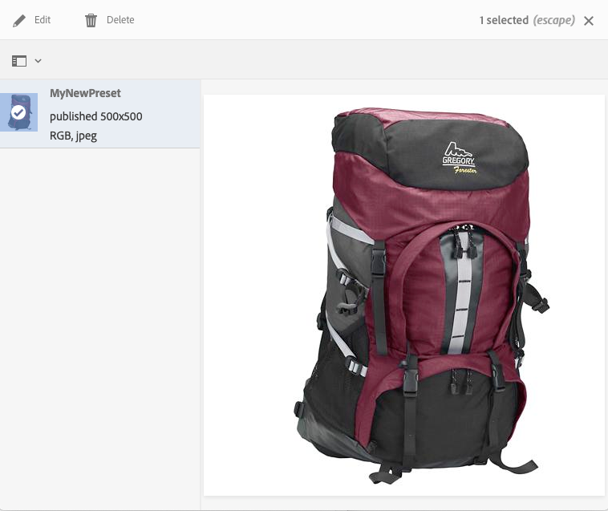
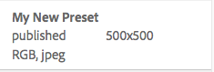

# 管理Dynamic Media影像預設{#managing-image-presets}

「影像預設」使Adobe Experience Manager資產能夠以不同大小、不同格式或動態生成的其他影像屬性動態傳送影像。 每個「影像預設」表示用於顯示影像的大小和格式命令的預定義集合。 建立「影像預設」時，將選擇影像傳送的大小。 您還可以選擇格式命令，以便在傳送影像以供查看時優化影像的外觀。

管理員可以建立用於導出資產的預設。 用戶在導出影像時可以選擇預設，這也會按照管理員指定的規範重新格式化影像。

您還可以建立響應的影像預設。 如果將響應影像預設應用於您的資產，則這些影像會根據所查看的設備或螢幕大小而改變。 除了RGB或灰色外，還可以配置影像預設以在顏色空間中使用CMYK。

本節介紹如何建立、修改和一般管理影像預設。 您可以在預覽影像時將影像預設應用於影像。 請參閱 [應用影像預設](/help/assets/image-presets.md)。

>[!NOTE]
>
>智慧成像可與您現有的影像預設配合使用，並在傳輸的最後一毫秒使用智慧功能，以根據瀏覽器或網路連接速度進一步減小影像檔案大小。 請參閱 [智慧映像](/help/assets/imaging-faq.md) 的子菜單。

## 瞭解Dynamic Media影像預設 {#understanding-image-presets}

像宏一樣，「影像預設」是預定義的大小和格式命令集合，這些命令以名稱保存。 要瞭解「影像預設」的工作原理，請假設您的網站要求每個產品影像以不同大小、不同格式和壓縮率顯示，以用於案頭和移動交付。

>[!NOTE]
>
>在Dynamic Media-Scene7模式中，僅影像資產支援影像預設。

可以建立兩個影像預設：一個為500 x 500像素（台式機版），另一個為150 x 150像素（移動版）。 您建立兩個影像預設，一個稱為 `Enlarge` 以500x500像素顯示影像，稱為 `Thumbnail` 以150 x 150像素顯示影像。 在 `Enlarge` 和 `Thumbnail` 大小，Experience Manager查找「放大影像預設」和「縮略圖影像預設」的定義。 然後，Experience Manager動態地生成每個「影像預設」的大小和格式規範的影像。

動態傳送時尺寸減小的影像會丟失清晰度和細節。 因此，每個「影像預設」都包含格式控制，用於在以特定大小傳送影像時優化影像。 這些控制項確保在將影像傳送到您的網站或應用程式時影像清晰清晰清晰。

管理員可以建立影像預設。 要建立影像預設，可以從頭開始，也可以從現有預設開始，然後以新名稱保存。

## 管理Dynamic Media影像預設 {#managing-image-presets-1}

通過點擊或按一下Experience Manager徽標訪問全局導航控制台，然後點擊或按一下「工具」表徵圖並導航至，可以管理Experience Manager中的影像預設 **[!UICONTROL 資產>影像預設]**。


>[!NOTE]
>
>在預覽或交付資產時，您建立的任何影像預設也可作為動態格式副本使用。
>
>在 *Dynamic Media-Scene7模式*, *不* 需要發佈影像預設，因為影像預設會自動發佈。
>
>在 *Dynamic Media — 混合模式*，必須手動發佈影像預設。
>
>請參閱 [發佈影像預設](#publishing-image-presets)。

>[!NOTE]
>
>當您選擇 **[!UICONTROL 格式副本]** 的子菜單。 可以增加或減少顯示的影像預設數。 請參閱 [增加顯示的影像預設數](#increasing-or-decreasing-the-number-of-image-presets-that-display)。

### 智慧作物、Adobe Illustrator(AI)、Postscript(EPS)和PDF檔案格式 {#adobe-illustrator-ai-postscript-eps-and-pdf-file-formats}

>[!NOTE]
>
>本主題僅適用於Dynamic Media — 混合模式。

如果要支援接收AI、EPS和PDF檔案，以便可以生成這些檔案格式的動態格式副本，請在建立影像預設之前查看以下資訊。

Adobe Illustrator的檔案格式是PDF的變體。 在Experience Manager Assets方面，主要差異如下：

* Adobe Illustrator文檔由單頁和多層組成。 每個層都作為PNG子元件提取在主Illustrator資產下。
* PDF文檔由一個或多個頁面組成。 每個頁面都作為單頁PDF子集在主多頁PDF文檔下進行提取。

子集由 `Create Sub Asset process` 元件 `DAM Update Asset` 工作流。 要在工作流中查看此流程元件，請點擊 **[!UICONTROL 工具]** > **[!UICONTROL 工作流]** > **[!UICONTROL 模型]** > **[!UICONTROL DAM更新資產]** > **[!UICONTROL 編輯]**。

另請參閱 [查看多頁檔案的頁面](/help/assets/managing-linked-subassets.md#view-pages-of-a-multi-page-file)。

開啟資產時，可以查看子組或頁面，點擊「內容」(Content)菜單，然後選擇 **[!UICONTROL 子元件]** 或 **[!UICONTROL 頁面]**。 子元件是實物資產。 即，PDF頁由 `Create Sub Asset` 工作流元件。 然後儲存為 `page1.pdf`。 `page2.pdf`等等。 儲存後， `DAM Update Asset` 工作流處理它們。

要使用Dynamic Media預覽和生成AI、EPS或PDF檔案的動態格式副本，需要執行以下處理步驟：

1. 在 `DAM Update Asset` 工作流， `Rasterize PDF/AI Image Preview Rendition` 流程元件使用配置的解析度將原始資產的第一頁柵格化為 `cqdam.preview.png` 格式副本。

1. 的 `cqdam.preview.png` 然後，格式副本將通過 `Dynamic Media Process Image Assets` 工作流中的進程元件。

>[!NOTE]
>
>在 [!UICONTROL DAM更新資產] 工作流， **[!UICONTROL EPS縮略圖]** step為EPS檔案生成縮略圖。

#### PDF/大赦國際/EPS資產元資料屬性 {#pdf-ai-eps-asset-metadata-properties}

| **元資料屬性** | **說明** |
|---|---|
| `dam:Physicalwidthininches` | 文檔寬度（英吋）。 |
| `dam:Physicalheightininches` | 文檔高度（英吋）。 |

您訪問 `Rasterize PDF/AI Image Preview Rendition` 流程元件選項 `DAM Update Asset` 工作流。

點擊左上角的Adobe Experience Manager，導航到 **[!UICONTROL 工具]** > **[!UICONTROL 工作流]** > **[!UICONTROL 模型]**。 在「工作流模型」頁面上，選擇 **[!UICONTROL DAM更新資產]**，然後在工具欄上按一下 **[!UICONTROL 編輯]**。 在 [!UICONTROL DAM更新資產] 工作流頁面，按兩下 `Rasterize PDF/AI Image Preview Rendition` 進程元件以開啟其「步驟屬性」(Step Properties)對話框。

#### 柵格化PDF/AI影像預覽格式副本選項 {#rasterize-pdf-ai-image-preview-rendition-options}


柵格化PDF或AI工作流的參數

<table>
 <tbody>
  <tr>
   <td><strong>進程參數</strong></td>
   <td><strong>預設設定</strong></td>
   <td><strong>說明</strong></td>
  </tr>
  <tr>
   <td>Mime 類型</td>
   <td><p>application/pdf</p> <p>application/postscript</p> <p>應用程式/illustrator<br /> </p> </td>
   <td>被視為PDF或Illustrator文檔的文檔mime類型清單。<br /> </td>
  </tr>
  <tr>
   <td>寬度上限</td>
   <td>2048</td>
   <td>生成的預覽格式副本的最大寬度（以像素為單位）。<br /> </td>
  </tr>
  <tr>
   <td>高度上限</td>
   <td>2048</td>
   <td>生成的預覽格式副本的最大高度（以像素為單位）。<br /> </td>
  </tr>
  <tr>
   <td>解析度</td>
   <td>72</td>
   <td>解析度：柵格化第一頁(ppi)（像素/英吋）。</td>
  </tr>
 </tbody>
</table>

使用預設處理參數，將PDF/AI文檔的第一頁柵格化為72 ppi，並且生成的預覽影像的大小為2048 x 2048像素。 對於典型部署，您可能希望將解析度提高到至少150 ppi或更高。 例如，美國字母大小為300 ppi的文檔要求最大寬度和高度分別為2550 x 3300像素。

「最大寬度」(Max Width)和「最大高度」(Max Height)限制柵格化的解析度。 例如，如果最大值保持不變，並且「解析度」(Resolution)設定為300 ppi，則「美國字母」(US Letter)文檔的柵格化為186 ppi。 即，文檔為1581 x 2046像素。

的 `Rasterize PDF/AI Image Preview Rendition` 進程元件定義了最大值，以確保它不會在記憶體中建立過大的映像。 這樣大的映像可能會使提供給JVM（Java™虛擬機）的記憶體溢出。 必須小心為JVM提供足夠的記憶體來管理已配置的並行工作流數，每個工作流都有可能以最大配置大小建立映像。

### InDesign(INDD)檔案格式 {#indesign-indd-file-format}

如果要支援接收INDD檔案，以便生成此檔案格式的動態格式副本，則可能需要在建立影像預設之前查看以下資訊。

對於InDesign檔案，子資產只在Adobe InDesign Server與Experience Manager整合時提取。 引用的資產基於其元資料進行連結。 InDesign Server不是連結的必需項。 但是，在為要在Experience Manager檔案和引用的資產之間建立的連結處理InDesign檔案之前，引用的資產必須存在於InDesign中。

請參閱 [將Experience Manager Assets與InDesign Server](/help/assets/indesign.md)。

介質提取流程元件 `DAM Update Asset` 工作流運行多個預配置的擴展指令碼以處理InDesign檔案。


介質抽取進程元件參數中的ExtendScript路徑 [!UICONTROL DAM更新資產] 工作流。

以下指令碼由Dynamic Media整合使用：

<table>
 <tbody>
  <tr>
   <td><strong>ExtendScript名</strong></td>
   <td><strong>預設</strong></td>
   <td><strong>說明</strong></td>
  </tr>
  <tr>
   <td>ThumbnailExport.jsx</td>
   <td>是</td>
   <td>生成300 ppi <code>thumbnail.jpg</code> 已優化並通過 <code>Dynamic Media Process Image Assets</code> 進程元件。<br /> </td>
  </tr>
  <tr>
   <td>JPEGPagesExport.jsx</td>
   <td>是</td>
   <td>為每頁生成300 PPIJPEG子集。 JPEG子集是儲存在InDesign資產下的實際資產。 還通過 <code>DAM Update Asset</code> 工作流。<br /> </td>
  </tr>
  <tr>
   <td>PDFPagesExport.jsx</td>
   <td>否</td>
   <td>為每頁生成PDF子組。 PDF子集將按前面所述進行處理。 由於PDF僅包含單頁，因此不生成子集。<br /> </td>
  </tr>
 </tbody>
</table>

## 配置影像縮略圖大小 {#configuring-image-thumbnail-size}

通過在 **[!UICONTROL DAM更新資產]** 工作流。 工作流中有兩個步驟，您可以在其中配置影像資產的縮略圖大小。 儘管(**[!UICONTROL Dynamic Media處理映像資產]**)用於動態映像資產，和(**[!UICONTROL 處理縮略圖]**)用於生成靜態縮略圖，或當所有其他進程無法生成縮略圖時， *兩者* 必須具有相同的設定。

在「動 **[!UICONTROL 態媒體處理影像資產」步驟中]** ，影像伺服器會產生縮圖，此組態與套用至「處理縮圖」步驟的組態無關 **** 。透過「處理縮圖 **[!UICONTROL 」步驟產生縮圖]** ，是建立縮圖的最慢且記憶體最耗用的方式。

縮略圖大小按以下格式定義： **[!UICONTROL 寬度:height:中心]**，例如 `80:80:false`。 寬度和高度決定縮略圖的像素大小。 中心值為false或true，如果設定為true，則表示縮略圖的大小與配置中給定的大小完全相同。 如果調整大小的影像較小，則其居中在縮略圖中。

>[!NOTE]
>
>* EPS檔案的縮略圖大小在 **[!UICONTROL EPS縮略圖]** 的 **[!UICONTROL 參數]** 頁籤。
>
>* 視頻的縮略圖大小在 **[!UICONTROL FFmpeg縮略圖]** 的 **[!UICONTROL 進程]** 頁籤 **[!UICONTROL 參數]**。
>


**配置影像縮略圖大小：**

1. 點擊 **[!UICONTROL 工具]** > **[!UICONTROL 工作流]** > **[!UICONTROL 模型]** > **[!UICONTROL DAM更新資產]** > **[!UICONTROL 編輯]**。
1. 點擊 **[!UICONTROL Dynamic Media處理映像資產]** 步驟，點擊或按一下 **[!UICONTROL 縮略圖]** 頁籤。 視需要變更縮圖大小，然後點選「 **[!UICONTROL 確定]**」。

   

1. 點選「處 **[!UICONTROL 理縮圖]** 」步驟，然後點選「縮 **[!UICONTROL 圖]** 」標籤。視需要變更縮圖大小，然後點選「 **[!UICONTROL 確定]**」。

   >[!NOTE]
   >
   >「處理縮圖」步驟中縮圖引數中 **[!UICONTROL 的值必須與「動態媒體處理影像資產」]** 步驟中的縮圖引數相符 **** 。

1. 點擊 **[!UICONTROL 保存]** 的子菜單。

### 增加或減少顯示的Dynamic Media影像預設數 {#increasing-or-decreasing-the-number-of-image-presets-that-display}

在預覽資產時，您建立的影像預設可用作動態格式副本。 Experience Manager顯示從中查看資產時的各種動態格式副本 **[!UICONTROL 詳細資訊視圖>格式副本]**。 您可以增加或減少顯示的格式副本的限制。

**增加或減少顯示的Dynamic Media影像預設數：**

1. 導航到CRXDE Lite([https://localhost:4502/crx/de](https://localhost:4502/crx/de))。
1. 導航到位於的影像預設清單節點 `/libs/dam/gui/coral/content/commons/sidepanels/imagepresetsdetail/imgagepresetslist`

   

1. 在 **[!UICONTROL limit]** 屬性中，將預設設 ****&#x200B;定為15的值變更為所要的數字。
1. 導航到位於的影像預設資料源 `/libs/dam/gui/coral/content/commons/sidepanels/imagepresetsdetail/imgagepresetslist/datasource`

   

1. 在limit屬性中，將數字更改為所需的數字，例如 `{empty requestPathInfo.selectors[1] ? "20" : requestPathInfo.selectors[1]}`
1. 點擊 **[!UICONTROL 全部保存]**。

## 建立Dynamic Media影像預設 {#creating-image-presets}

建立Dynamic Media影像預設允許您在預覽或發佈時將這些設定應用於任何影像。

>[!NOTE]
>
>如果使用Internet Explorer 9，則在保存後不會立即在預設清單中顯示預設。 要解決此問題，請禁用IE9的快取。

如果要支援接收AI、PDF和EPS檔案，以便可以生成這些檔案格式的動態格式副本，請在建立影像預設之前查看以下資訊。
請參閱 [Adobe Illustrator（大赦國際）、Postscript(EPS)和PDF檔案格式](#adobe-illustrator-ai-postscript-eps-and-pdf-file-formats)。

如果要支援接收INDD檔案，以便生成此檔案格式的動態格式副本，則可能需要在建立影像預設之前查看以下資訊。
請參閱 [InDesign(INDD)檔案格式](#indesign-indd-file-format)。

>[!NOTE]
>
>要建立Dynamic Media影像預設，您必須具有Experience Manager管理員或Admin Console管理員的管理員權限。

**要建立Dynamic Media影像預設：**

1. 在Experience Manager中，按一下Experience Manager徽標以訪問全局導航控制台，然後按一下 **[!UICONTROL 工具]** > **[!UICONTROL 資產]** > **[!UICONTROL 影像預設]**。
1. 按一下&#x200B;**[!UICONTROL 建立]**。的 **[!UICONTROL 編輯影像預設]** 的下界。

   

   >[!NOTE]
   >
   >若要讓此影像預設變得自適應，請擦除 **[!UICONTROL 寬度]****[!UICONTROL 和高度欄]** 位中的值，並保留空白。

1. 視需要在「基 **[!UICONTROL 本]** 」和「 **[!UICONTROL 進階]** 」標籤中輸入值，包括名稱。這些選項在「影像預設 [集選項」中概述](#image-preset-options)。預設集會出現在左窗格中，並可與其他資產一起即時使用。

   

1. 按一下「**[!UICONTROL 儲存]**」。

## 建立響應影像預設 {#creating-a-responsive-image-preset}

要建立響應影像預設，請執行中的步驟 [建立影像預設](#creating-image-presets)。 在 **[!UICONTROL 編輯影像預設]** 窗口，拭除這些值並將其留空。

留空會告訴Experience Manager此影像預設是響應的。 您可以根據需要調整其它值。


>[!NOTE]
>
>為了查看 **[!UICONTROL URL]** 和 **[!UICONTROL RESS]** 按鈕將影像預設應用於資源時，必須發佈資源。
>
>
>
>在Dynamic Media-Scene7模式中，影像預設和影像資產將自動發佈。
>
>在Dynamic Media — 混合模式下，必須手動發佈影像預設和影像資產。

### 影像預設選項 {#image-preset-options}

建立或編輯影像預設時，您將具有本節中介紹的選項。 此外，Adobe建議從以下「最佳做法」選項開始：

* **[!UICONTROL 格式]** (**[!UICONTROL 基本]** 頁籤) — 選擇 **[!UICONTROL JPEG]** 或符合您要求的其他格式。 所有網頁瀏覽器都支援JPEG影像格式；它在小檔案大小和影像品質之間提供良好的平衡。但是，JPEG格式影像使用有損壓縮方案，如果壓縮設定太低，則該壓縮方案會引入不想要的影像偽影。因此，Adobe建議將壓縮品質設為75。此設定在影像品質和檔案大小之間取得良好的平衡。

* **[!UICONTROL 啟用簡單銳利化]** -請勿選取「啟用簡 **** 單銳利化」 (此銳利化濾鏡提供的控制力比「非銳利化遮色片」設定少)。

* **[!UICONTROL 銳化：重新取樣模式]**  — 選擇 **[!UICONTROL 夏普2]**。

#### 基本頁籤選項 {#basic-tab-options}

<table>
 <tbody>
  <tr>
   <td><strong>欄位</strong></td>
   <td><strong>說明</strong></td>
  </tr>
  <tr>
   <td><strong>名稱</strong></td>
   <td>輸入不帶空格的描述性名稱。 在名稱中包括影像大小說明，以便幫助用戶識別此影像預設。</td>
  </tr>
  <tr>
   <td><strong>寬度和高度</strong></td>
   <td>以像素為單位輸入影像傳送的大小。 寬度和高度必須大於0像素。 如果其中一個值為0，則不建立預設。 如果這兩個值都為空，則建立響應影像預設。</td>
  </tr>
  <tr>
   <td><strong>格式</strong></td>
   <td><p>從菜單中選擇格式。</p> <p>選擇 <strong>JPEG</strong> 提供了以下附加選項：</p>
    <ul>
     <li><strong>質量</strong>  — 控制JPEG壓縮級別。 此設定既影響檔案大小又影響影像質量。 JPEG質量等級為1-100。 拖動滑塊時，縮放是可見的。</li>
     <li><strong>啟用JPG色度下採樣</strong>  — 由於眼睛對高頻顏色資訊的敏感度低於高頻亮度，JPEG影像將影像資訊分為亮度和顏色分量。 當JPEG影像被壓縮時，亮度分量以全解析度保持，而顏色分量通過平均成組的像素而被降採樣。 縮減採樣將資料量減少一半或三分之一，幾乎不會影響感知質量。 下採樣不適用於灰度影像。 該技術減少了對具有高對比度的影像（例如，具有重疊文本的影像）有用的壓縮量。</li>
    </ul>
    <div>
      選擇
     <strong>GIF</strong> 或
     <strong>帶α的GIF</strong> 提供
     <strong>GIF顏色量化</strong> 選項：
    </div>
    <ul>
     <li><strong>類型 </strong> — 選擇 <strong>自適應</strong> （預設值）, <strong>Web</strong>或 <strong>麥金托什</strong>。 如果選擇 <strong>帶Alpha的GIF</strong>, Macintosh選項不可用。</li>
     <li><strong>抖動</strong>  — 選擇 <strong>擴散</strong> 或 <strong>關閉</strong>。</li>
     <li><strong>顏色數 </strong> — 輸入2到256之間的數字。</li>
     <li><strong>顏色清單</strong>  — 輸入逗號分隔的清單。 例如，對於白色、灰色和黑色，輸入 <code>000000,888888,ffffff</code>。</li>
    </ul>
    <div>
      選擇
     <strong>PDF</strong>。
     <strong>TIFF</strong>或
     <strong>帶α的TIFF</strong> 提供了此附加選項：
    </div>
    <ul>
     <li><strong>壓縮</strong>  — 選擇壓縮算法。 用於PDF的算法選項有 <strong>無</strong>。 <strong>Zip</strong>, <strong>Jpeg</strong>;TIFF <strong>無</strong>。 <strong>LZW</strong>。 <strong>Jpeg</strong>, <strong>Zip</strong>;而與AlphaTIFF <strong>無</strong>。 <strong>LZW</strong>, <strong>Zip</strong>。</li>
    </ul> <p>選擇 <strong>PNG</strong>。 <strong>PNG,Alpha,</strong> 或 <strong>EPS</strong> 不提供其他選項。</p> </td>
  </tr>
  <tr>
   <td><strong>銳利化</strong></td>
   <td>選擇 <strong>啟用簡單銳化</strong> 選項，在進行所有縮放後將基本銳化濾鏡應用到影像。銳化有助於補償以不同大小顯示影像時可能產生的模糊性。 </td>
  </tr>
 </tbody>
</table>

#### 高級頁籤選項 {#advanced-tab-options}

<table>
 <tbody>
  <tr>
   <td><strong>欄位</strong></td>
   <td><strong>說明</strong></td>
  </tr>
  <tr>
   <td><strong>色域</strong></td>
   <td>選擇 <strong>RGB,CMYK,</strong> 或 <strong>灰度</strong> 的上界。</td>
  </tr>
  <tr>
   <td><strong>色彩設定檔</strong></td>
   <td>如果資產與工作配置檔案不同，請選擇應將其轉換為的輸出顏色空間配置檔案。</td>
  </tr>
  <tr>
   <td><strong>渲染方法</strong></td>
   <td>可以覆蓋預設的渲染意圖。 渲染意圖確定目標顏色配置檔案中無法再現的顏色（超出色域）的情況。 如果「渲染意圖」與ICC配置檔案不相容，則會忽略它。
    <ul>
     <li>選擇 <strong>感知</strong> 當原始影像中的一個或多個顏色超出目標顏色空間的色域時，將整個色域從一個顏色空間壓縮到另一個顏色空間。</li>
     <li>選擇 <strong>相對比色</strong> 當當前顏色空間中的顏色在目標顏色空間中超出色域時。 而且，您希望將其映射到目標顏色空間的色域內最接近的可能顏色，而不影響任何其他顏色。 </li>
     <li>選擇 <strong>飽和度</strong> 的子菜單。 </li>
     <li>選擇 <strong>絕對比色</strong> 與顏色完全匹配，而白點或黑點不會調整，這將改變影像的亮度。</li>
    </ul> </td>
  </tr>
  <tr>
   <td><strong>黑點補償</strong></td>
   <td>如果輸出配置檔案支援此功能，則選擇此選項。 如果黑點補償與指定的ICC配置檔案不相容，則忽略它。</td>
  </tr>
  <tr>
   <td><strong>正在遞色</strong></td>
   <td>選擇此選項可能會避免或減少色帶對象。 </td>
  </tr>
  <tr>
   <td><strong>銳化類型</strong></td>
   <td><p>選擇 <strong>無</strong>。 <strong>銳化</strong>或 <strong>非銳化蒙版</strong>。 </p>
    <ul>
     <li>選擇 <strong>無</strong> 的子菜單。</li>
     <li>選擇 <strong>銳化</strong> ，也請參見Wiki頁。 銳化有助於補償以不同大小顯示影像時可能產生的模糊性。 </li>
     <li>選擇<strong> 非銳化蒙版</strong> 的子菜單。 可以控制效果強度、效果半徑（以像素計量）以及忽略的對比度閾值。 此效果使用的選項與Photoshop的「非銳化掩碼」濾鏡相同。</li>
    </ul> <p>在 <strong>非銳化蒙版</strong>，您有以下選項：</p>
    <ul>
     <li><strong>金額</strong>  — 控制應用於邊緣像素的對比度量。 預設實數值為1.0。對於高解析度影像，可將其增加到高達5.0。將Amount視為過濾器強度的度量。</li>
     <li><strong>半徑</strong>  — 確定影響銳化的邊緣像素周圍的像素數。 對於高解析度影像，請輸入1到2的實數。 低值只會銳化邊緣像素；高值會銳化更寬的像素帶。 正確的值取決於影像的大小。</li>
     <li><strong>閾值</strong>  — 確定應用非銳化蒙版濾鏡時要忽略的對比度範圍。 換句話說，此選項確定銳化的像素在被視為邊緣像素和銳化之前必須與周圍區域有多大差異。 為避免引入雜訊，對2到20的整數值進行實驗。 </li>
     <li><strong>應用於</strong>  — 確定未銳化是否適用於每種顏色或亮度。</li>
    </ul>
    <div>
      銳化在
     <a href="https://experienceleague.adobe.com/docs/experience-manager-65/assets/sharpening_images.pdf">銳化影像</a>。
    </div> </td>
  </tr>
  <tr>
   <td><strong>重新取樣模式</strong></td>
   <td>選擇 <strong>重採樣模式</strong> 的雙曲餘切值。 當影像被下採樣時，以下選項將銳化影像：
    <ul>
     <li><strong>雙線性</strong>  — 最快的重採樣方法。某些鋸齒偽像是可以察覺的。</li>
     <li><strong>雙立方</strong>  — 增加CPU使用量，但生成更清晰的影像，並減少明顯的鋸齒偽影。</li>
     <li><strong>夏普2</strong>  — 結果比Bi-Cubic更清晰，但CPU成本更高。</li>
     <li><strong>比夏普</strong>  — 選擇Photoshop預設重採樣器以減小影像大小， <strong>雙立方</strong> 在Adobe Photoshop。</li>
     <li><strong>每種顏色</strong> 和 <strong>亮度</strong>  — 每種方法都可以基於顏色或亮度。 預設情況下 <strong>每種顏色</strong> 的子菜單。</li>
    </ul> </td>
  </tr>
  <tr>
   <td><strong>打印解析度</strong></td>
   <td>選擇打印此影像的解析度；預設為72像素。</td>
  </tr>
  <tr>
   <td><strong>影像修飾元</strong></td>
   <td><p>除了UI中可用的常用映像設定外，Dynamic Media還支援在 <strong>影像修飾符</strong> 的子菜單。 這些參數在 <a href="https://experienceleague.adobe.com/docs/dynamic-media-developer-resources/image-serving-api/image-serving-api/http-protocol-reference/command-reference/c-command-reference.html#image-serving-api">映像伺服器協定命令參考</a>。</p> <p>重要提示：不支援API中列出的以下功能：</p>
    <ul>
     <li>基本模板和文本渲染命令： <code>text= textAngle= textAttr= textFlowPath= textFlowXPath= textPath=</code> 和 <code>textPs=</code></li>
     <li>本地化命令： <code>locale=</code> 和 <code>req=xlate</code></li>
     <li><code>req=set</code> 不可用於一般用途。</li>
     <li><code>req=mbrset</code></li>
     <li><code>req=saveToFile</code></li>
     <li><code>req=targets</code></li>
     <li><code>template=</code></li>
     <li>非核心Dynamic Media服務：SVG、影像渲染和Web到打印</li>
    </ul> </td>
  </tr>
 </tbody>
</table>

## 使用影像修飾符定義影像預設選項 {#defining-image-preset-options-with-image-modifiers}

除了「基本」(Basic)和「高級」(Advanced)頁籤中提供的選項外，您還可以定義影像修飾符，以便在定義影像預設時為您提供更多選項。 影像呈現依賴於在 [HTTP協定引用](https://experienceleague.adobe.com/docs/dynamic-media-developer-resources/image-serving-api/image-serving-api/http-protocol-reference/command-reference/c-command-reference.html#image-serving-api)。

下面是一些基本示例，說明了如何使用影像修飾符。

>[!NOTE]
>
>某些影像修飾符 [無法在Experience Manager中使用](#advanced-tab-options)。

* [op_invert](https://experienceleague.adobe.com/docs/dynamic-media-developer-resources/image-serving-api/image-serving-api/http-protocol-reference/command-reference/r-op-invert.html#image-serving-api)  — 反轉每個顏色分量以獲得負影像效果。

   ```xml
   &op_invert=1
   ```

   

* [op_blur](https://experienceleague.adobe.com/docs/dynamic-media-developer-resources/image-serving-api/image-serving-api/http-protocol-reference/command-reference/r-op-blur.html#image-serving-api)  — 對影像應用模糊濾鏡。

   ```xml
   &op_blur=7
   ```

   

* 組合命令 — op_blur和op-invert

   ```xml
   &op_invert=1&op_blur=7
   ```

   

* [op_brightness](https://experienceleague.adobe.com/docs/dynamic-media-developer-resources/image-serving-api/image-serving-api/http-protocol-reference/command-reference/r-op-brightness.html#image-serving-api)  — 降低或增加亮度。

   ```xml
   &op_brightness=58
   ```

   

* [Opac](https://experienceleague.adobe.com/docs/dynamic-media-developer-resources/image-serving-api/image-serving-api/http-protocol-reference/command-reference/r-opac.html#image-serving-api)  — 調整影像不透明度。 用於降低前景不透明度。

   ```xml
   opac=29
   ```

   

## 編輯影像預設 {#modifying-image-presets}

1. 在Experience Manager中，按一下Experience Manager徽標以訪問全局導航控制台，然後按一下 **[!UICONTROL 工具]** > **[!UICONTROL 資產]** > **[!UICONTROL 影像預設]**。

   

1. 選擇預設，然後按一下 **[!UICONTROL 編輯]**。 的 **[!UICONTROL 編輯影像預設]** 的下界。
1. 進行更改並按一下 **[!UICONTROL 保存]** 保存更改或 **[!UICONTROL 取消]** 的子菜單。

## 發佈Dynamic Media影像預設 {#publishing-image-presets}

如果運行的是Dynamic Media — 混合模式，則必須手動發佈影像預設。

(如果您運行的是Dynamic Media-Scene7模式，則會自動為您發佈影像預設；您不需要完成這些步驟。)

**要在Dynamic Media — 混合模式中發佈影像預設：**

1. 在Experience Manager中，點擊或按一下Experience Manager徽標以訪問全局導航控制台，點擊或按一下「工具」表徵圖並導航至 **[!UICONTROL 資產]** > **[!UICONTROL 影像預設]**。
1. 從影像預設清單中選擇影像預設或多個影像預設，然後按一下或點擊 **[!UICONTROL 發佈]**。
1. 在發佈影像預設後，狀態將從未發佈更改為已發佈。

   

## 刪除Dynamic Media影像預設 {#deleting-image-presets}

1. 在Experience Manager中，點擊或按一下Experience Manager徽標以訪問全局導航控制台。
1. 點擊 **[!UICONTROL 工具]** 表徵圖，然後導航 **[!UICONTROL 資產]** > **[!UICONTROL 影像預設]**。
1. 選擇預設，然後按一下 **[!UICONTROL 刪除]**。 Dynamic Media確認要刪除。 點擊 **[!UICONTROL 刪除]** 刪除或點擊 **[!UICONTROL 取消]** 中止。
