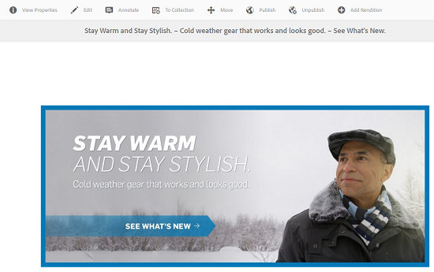

# 管理複合和多頁資產 {#managing-compound-assets}

[!DNL Adobe Experience Manager Assets] 可以確定上載的檔案是否包含對儲存庫中已存在資產的引用。 此功能僅適用於支援的檔案格式。 如果上載的資產包含對 [!DNL Experience Manager] assets)，在上載的和引用的資產之間建立雙向連結。

除消除冗餘外，還參考 [!DNL Adobe Creative Cloud] 應用程式增強了協作，提高了用戶的效率和工作效率。

[!DNL Experience Manager Assets] 支援雙向引用。 您可以在上載檔案的資產詳細資訊頁面中找到引用的資產。 此外，您還可以在引用資產的資產詳細資訊頁面中查看引用檔案。

根據引用資產的路徑、文檔ID和實例ID解析引用。

## [!DNL Adobe Illustrator]:添加數字資產作為參考 {#refai}

您可以從 [!DNL Adobe Illustrator] 的子菜單。

1. 使用 [[!DNL Experience Manager] 案頭應用](https://experienceleague.adobe.com/docs/experience-manager-desktop-app/using/using.html)，獲取本地檔案系統上的數字資產。 導航到要引用的資產的檔案系統位置。
1. 將資源從本地資料夾拖動到 [!DNL Illustrator] 的子菜單。

1. 保存 [!DNL Illustrator] 檔案到已裝載的驅動器，或 [上載](/help/assets/manage-assets.md#uploading-assets) 到 [!DNL Experience Manager] 儲存庫。

1. 工作流完成後，轉至資產的資產詳細資訊頁面。 對現有數字資產的引用列於 **[!UICONTROL 依賴項]** 的 **[!UICONTROL 引用]** 的雙曲餘切值。

   

1. 顯示在 **[!UICONTROL 依賴項]** 也可由當前檔案以外的檔案引用。 要查看資產的引用檔案清單，請按一下下面的 **[!UICONTROL 依賴項]**。

   

1. 按一下 **[!UICONTROL 查看屬性]** 的子菜單。 在 [!UICONTROL 屬性] 頁中，引用當前資產的檔案清單顯示在 **[!UICONTROL 引用]** 列 **[!UICONTROL 基本]** 頁籤。

   

   *圖：資產詳細資訊中的資產引用。*

## [!DNL Adobe InDesign]:添加數字資產作為參考 {#add-aem-assets-as-references-in-adobe-indesign}

參考來自 [!DNL InDesign] 檔案，或將資源拖到 [!DNL InDesign] 檔案或導出 [!DNL InDesign] 檔案作為ZIP存檔。

引用的資產已存在於 [!DNL Experience Manager Assets]。 可通過 [配置InDesign Server](indesign.md)。 於一間 [!DNL InDesign] 檔案被提取為子組。

>[!NOTE]
>
>如果 [!DNL InDesign Server] 是代理的， [!DNL InDesign] 檔案的預覽嵌入到元資料XMP中。 在這種情況下，不需要顯式提取縮略圖。 但是，如果 [!DNL InDesign Server] 未代理，必須顯式提取縮略圖 [!DNL InDesign] 的子菜單。

當上載INDD檔案時，通過查詢具有 `xmpMM:InstanceID` 和 `xmpMM:DocumentID` 屬性。

### 通過拖動資產建立引用 {#create-references-by-dragging-aem-assets}

此過程類似於 [添加數字資產作為Adobe Illustrator](#refai)。

### 通過導出ZIP檔案建立對資產的引用 {#create-references-to-aem-assets-by-exporting-a-zip-file}

1. 執行中的步驟 [建立工作流模型](/help/sites-developing/workflows-models.md) 的子菜單。
1. 使用 [包功能](https://helpx.adobe.com/indesign/how-to/indesign-package-files-for-handoff.html) 共 [!DNL Adobe InDesign] 的子菜單。 [!DNL Adobe InDesign] 可以將文檔和連結的資產導出為包。 在這種情況下，導出的資料夾包含 `Links` 包含子組的資料夾 [!DNL InDesign] 的子菜單。 的 `Links` 資料夾與INDD檔案位於同一資料夾中。
1. 建立ZIP檔案並將其上載到 [!DNL Experience Manager] 儲存庫。
1. 啟動 `Unarchiver` 工作流。
1. 工作流完成後，「連結」(Links)資料夾中的引用將自動作為子組引用。 要查看引用資產清單，請定位至 [!DNL InDesign] 並關閉 [鐵路](/help/sites-authoring/basic-handling.md#rail-selector)。

## [!DNL Adobe Photoshop]:添加數字資產作為參考 {#refps}

1. 使用 [!DNL Experience Manager] 案頭應用 [!DNL Experience Manager Assets]。 下載並顯示本地檔案系統上的資產。 使用 [!UICONTROL 連結位置] 功能 [!DNL Adobe Photoshop]。 請參閱 [將資產放置到案頭應用](https://experienceleague.adobe.com/docs/experience-manager-desktop-app/using/using.html#place-assets-in-native-documents)。

1. 保存 [!DNL Photoshop] 檔案到已掛載驅動器或 [上載](/help/assets/manage-assets.md#uploading-assets) 到 [!DNL Experience Manager] 儲存庫。
1. 工作流完成後，對現有的引用 [!DNL Experience Manager] 資產列在資產詳細資訊頁面。

   要查看引用的資產，請關閉 [鐵路](/help/sites-authoring/basic-handling.md#rail-selector) 的子菜單。

1. 引用的資產還包含它們所引用的資產的清單。 要查看引用資產的清單，請定位至資產詳細資訊頁並關閉 [鐵路](/help/sites-authoring/basic-handling.md#rail-selector)。

>[!NOTE]
>
>也可以根據複合資產中的文檔ID和實例ID來引用複合資產中的資產。 此功能可用於 [!DNL Adobe Illustrator] 和 [!DNL Adobe Photoshop] 版本。 對於其他人，參考是根據主要複合資產中連結資產的相對路徑進行的，如早期版本的 [!DNL Experience Manager]。

## 建立子組 {#generate-subassets}

對於支援的多頁格式資產 — PDF檔案、AI檔案、 [!DNL Microsoft PowerPoint] 和 [!DNL Apple Keynote] 檔案和 [!DNL Adobe InDesign] 檔案 —  [!DNL Experience Manager] 可以生成與原始資產的每個單獨頁面對應的子元件。 這些子組連結到 *父* 方便多頁查看。 對於所有其它目的，子元件在 [!DNL Experience Manager]。

預設情況下禁用子集生成。 要啟用子集生成，請執行以下步驟：

1. 登錄 [!DNL Experience Manager] 作為管理員。 訪問 **[!UICONTROL 工具]** > **[!UICONTROL 工作流]** > **[!UICONTROL 模型]**。
1. 選擇 **[!UICONTROL DAM更新資產]** 工作流，按一下 **[!UICONTROL 編輯]**。
1. 按一下 **[!UICONTROL 切換側面板]** 找到 **[!UICONTROL 建立子資產]** 的子菜單。 將步驟添加到工作流。 按一下&#x200B;**[!UICONTROL 「同步」]**。

要生成子元件，請執行以下操作之一：

* 新資產：的 [!UICONTROL DAM更新資產] 工作流對上載到的任何新資產執行 [!DNL Experience Manager]。 子元件是為新多頁資產自動生成的。
* 現有多頁資產：手動執行 [!UICONTROL DAM更新資產] 工作流執行以下任一步驟：

   * 選擇資產並按一下 [!UICONTROL 時間軸] 開啟左面板。 或者，使用鍵盤快捷鍵 `alt + 3`。 按一下 [!UICONTROL 啟動工作流]選中 [!UICONTROL DAM更新資產]按一下 [!UICONTROL 開始]，然後按一下 [!UICONTROL 繼續]。
   * 選擇資產並按一下 [!UICONTROL 建立] > [!UICONTROL 工作流] 的子菜單。 從彈出式對話框中，選擇 [!UICONTROL DAM更新資產] 工作流，按一下 [!UICONTROL 開始]，然後按一下 [!UICONTROL 繼續]。

具體針對MicrosoftWord文檔，執行 **[!UICONTROL DAM解析Word文檔]** 工作流。 它產生 `cq:Page` 從MicrosoftWord文檔的內容中獲取。 從文檔中提取的影像從 `cq:Page` 元件。 即使子資產生成被禁用，也提取這些影像。

>[!NOTE]
>
>在 [!UICONTROL 建立子資產流程 — 步驟屬性] 在 [!UICONTROL 進程參數]，您可以指定 [!DNL Experience Manager] 生成。 預設值為 5。要生成所有子資產，請將欄位留空。 如果欄位為負，則不生成子資產。

## 查看子組 {#viewing-subassets}

僅當生成子集並且可用於所選多頁資產時，才顯示子集。 要查看生成的子集，請開啟多頁資產。 在頁面的左上區域，按一下  按一下 **[!UICONTROL 子元件]** 清單中。 選擇時 **[!UICONTROL 子元件]** 清單中。 或者，使用鍵盤快捷鍵 `alt + 5`。

## 查看多頁檔案的頁面 {#view-pages-of-a-multi-page-file}

使用的「頁面查看器」功能，您可以查看多頁檔案，如PDF、INDD、PPT、PPTX和AI檔案 [!DNL Experience Manager Assets]。 開啟多頁資產，然後按一下 **[!UICONTROL 查看頁面]** 左上角。 開啟的「頁面查看器」顯示資產的頁面以及瀏覽和縮放每頁的控制項。

對於 [!DNL InDesign]，您可以使用 [!DNL InDesign Server]。 如果在 [!DNL InDesign] 檔案建立，然後 [!DNL InDesign Server] 不需要頁面提取。

以下選項可在工具欄、左欄和「頁面查看器」控制項中使用：

* **[!UICONTROL 案頭操作]** 開啟或顯示特定子組使用 [!DNL Experience Manager] 案頭應用。 瞭解如何 [配置案頭操作](https://experienceleague.adobe.com/docs/experience-manager-desktop-app/using/using.html#desktopactions-v2) 如果您 [!DNL Experience Manager] 案頭應用。

* **[!UICONTROL 屬性]** 選項 [!UICONTROL 屬性] 的子組。

* **[!UICONTROL 注釋]** 選項允許您注釋特定子組。 在開啟父資產以供查看時，將收集並同時顯示您在單獨子集上使用的注釋。

* **[!UICONTROL 頁面概述]** 選項同時顯示所有子集。

* **[!UICONTROL 時間軸]** 選項  顯示檔案的活動流。

## 最佳做法和限制 {#best-practice-limitation-tips}

* 子元件生成在任何元件上都可能佔用大量資源 [!DNL Experience Manager] 部署。 如果在上載複雜資產時生成子集，則在「DAM更新資產」工作流中添加步驟。 如果要按需生成子集，則建立單獨的工作流以生成子集。 專用工作流允許您跳過DAM更新資產工作流中的其他步驟並保存計算資源。

>[!MORELIKETHIS]
>
>* [使用Adobe Experience Manager案頭應用](https://experienceleague.adobe.com/docs/experience-manager-desktop-app/using/using.html)
>* [在Adobe Experience Manager配置案頭操作](https://experienceleague.adobe.com/docs/experience-manager-desktop-app/using/using.html#desktopactions-v2)
>* [在Adobe Photoshop建立連結的智慧對象](https://helpx.adobe.com/photoshop/using/create-smart-objects.html#create-linked-smart-objects)
>* [在Adobe InDesign放置圖形](https://helpx.adobe.com/indesign/using/placing-graphics.html)

