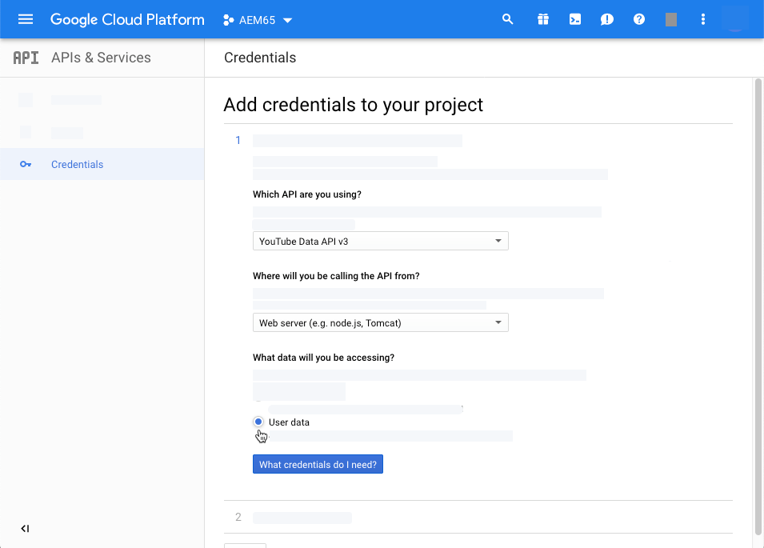
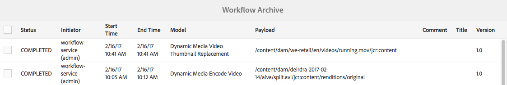

# 管理影片資產 {#manage-video-assets}

| 版本 | 文章連結 |
| -------- | ---------------------------- |
| AEM as a Cloud Service  | [按一下這裡](https://experienceleague.adobe.com/docs/experience-manager-cloud-service/content/assets/manage/manage-video-assets.html?lang=en) |
| AEM 6.5 | 本文 |

視頻格式是組織數字資產的關鍵部分。 [!DNL Adobe Experience Manager] 提供成熟的產品和功能，以在視頻資產建立後管理其整個生命週期。

瞭解如何在中管理和編輯視頻資產 [!DNL Adobe Experience Manager Assets]。 視頻編碼和轉碼，例如FFmpeg轉碼，可使用 [!DNL Dynamic Media] 整合。

## 上載和預覽視頻資產 {#upload-and-preview-video-assets}

[!DNL Adobe Experience Manager Assets] 為副檔名為MP4的視頻資產生成預覽。 如果資產的格式不是MP4，請安裝FFmpeg包以生成預覽。 Fmpeg建立OGG和MP4類型的視頻呈現。 您可以在 [!DNL Assets] 用戶介面。

1. 在數字資產資料夾或子資料夾中，導航到要添加數字資產的位置。
1. 要上載資產，請按一下 **[!UICONTROL 建立]** ，然後選擇 **[!UICONTROL 檔案]**。 或者，在用戶介面上拖動檔案。 請參閱 [上載資產](manage-assets.md#uploading-assets) 的雙曲餘切值。
1. 要在「卡」視圖中預覽視頻，請按一下 **[!UICONTROL 播放]**  的子菜單。 您只能在卡視圖中暫停或播放視頻。 的 [!UICONTROL 播放] 和 [!UICONTROL 暫停] 選項在清單視圖中不可用。

1. 要在資產詳細資訊頁面中預覽視頻，請按一下 **[!UICONTROL 編輯]** 卡上。 視頻在瀏覽器的本機視頻播放器中播放。 您可以播放、暫停、控制音量，並將視頻縮放到全屏。

   

## 要上載大於2 GB的資產的配置 {#configuration-to-upload-assets-that-are-larger-than-gb}

預設情況下， [!DNL Assets] 不允許您上載任何因檔案大小限制而大於2 GB的資產。 但是，您可以通過進入CRXDE Lite並在 `/apps` 的子菜單。 節點必須具有相同的節點名稱、目錄結構和順序的可比節點屬性。

除 [!DNL Assets] 配置，更改以下配置以上載大型資產：

* 增加令牌過期時間。 請參閱 [!UICONTROL Adobe花崗岩CSRF Servlet] 在Web控制台中， `https://[aem_server]:[port]/system/console/configMgr`。 有關詳細資訊，請參見 [CSRF保護](/help/sites-developing/csrf-protection.md)。
* 增加 `receiveTimeout` 在Dispatcher配置中。 有關詳細資訊，請參見 [Experience Manager調度程式配置](https://experienceleague.adobe.com/docs/experience-manager-dispatcher/using/configuring/dispatcher-configuration.html#renders-options)。

>[!NOTE]
>
>的 [!DNL Experience Manager] 傳統用戶介面沒有2 GB檔案大小限制。 此外，大型視頻的端到端工作流不完全受支援。

要配置更高的檔案大小限制，請在 `/apps` 的子菜單。

1. 在 [!DNL Experience Manager]按一下 **[!UICONTROL 工具]** > **[!UICONTROL 常規]** > **[!UICONTROL CRXDE Lite]**。
1. 在CRXDE Lite中，導航到 `/libs/dam/gui/content/assets/jcr:content/actions/secondary/create/items/fileupload`。 要查看目錄窗口，請按一下 `>>`。
1. 在工具欄中，按一下 **[!UICONTROL 覆蓋節點]**。 或者，從上 **[!UICONTROL 下文選單選取]** 「覆蓋節點」。
1. 在 **[!UICONTROL 覆蓋節點]** 對話框，按一下 **[!UICONTROL 確定]**。

   

1. 刷新瀏覽器。 覆蓋節點 `/apps/dam/gui/content/assets/jcr:content/actions/secondary/create/items/fileupload` 的子菜單。
1. 在 **[!UICONTROL 屬性]** 頁籤，輸入以位元組為單位的適當值，以將大小限制增加到所需大小。 例如，要將大小限制增加到30 GB，請輸入 `32212254720` 值。

1. 在工具欄中，按一下 **[!UICONTROL 全部保存]**。
1. 在 [!DNL Experience Manager]按一下 **[!UICONTROL 工具]** > **[!UICONTROL 操作]** > **[!UICONTROL Web控制台]**。
1. 在 [!DNL Adobe Experience Manager] [!UICONTROL Web控制台捆綁包] 頁，在表的「名稱」列下，找到並按一下 **[!UICONTROL Adobe花崗岩工作流外部進程作業處理程式]**。
1. 在 [!UICONTROL Adobe花崗岩工作流外部進程作業處理程式] 頁面，設定兩者的秒數 **[!UICONTROL 預設超時]** 和 **[!UICONTROL 最大超時]** 欄位 `18000` （5小時）。 按一下「**[!UICONTROL 儲存]**」。
1. 在 [!DNL Experience Manager]按一下 **[!UICONTROL 工具]** > **[!UICONTROL 工作流]** > **[!UICONTROL 模型]**。
1. 在「工作流模型」頁面上，選擇 **[!UICONTROL Dynamic Media編碼視頻]**，然後按一下 **[!UICONTROL 編輯]**。
1. 在工作流頁面上，按兩下 **[!UICONTROL Dynamic Media視頻服務流程]** 元件。
1. 在「步 [!UICONTROL 驟屬性] 」對話框的「常用」頁籤下，展開「 **[!UICONTROL 高級設定」]******。
1. 在 **[!UICONTROL 超時]** 欄位，指定 `18000`，然後按一下 **[!UICONTROL 確定]** 返回 **[!UICONTROL Dynamic Media編碼視頻]** 的子菜單。
1. 靠近頁面頂部，位於 [!UICONTROL Dynamic Media編碼視頻] 頁面標題，按一下 **[!UICONTROL 保存]**。

## 發佈視頻資產 {#publish-video-assets}

發佈後，可以將視頻資產作為URL包括在網頁中，或直接嵌入資產。 有關詳細資訊，請參閱 [發佈Dynamic Media資產](/help/assets/publishing-dynamicmedia-assets.md)。

## 將視頻發佈到YouTube {#publishing-videos-to-youtube}

您可以直接將內部Experience Manager視頻資產發佈到以前建立的YouTube渠道。

要向YouTube發佈視頻資產，請設定帶標籤的Experience Manager Assets。 將這些標籤與YouTube頻道關聯。 如果視頻資產的標籤與YouTube頻道的標籤匹配，則視頻將發佈到YouTube。 只要使用關聯的標籤，發佈到YouTube就會與視頻的正常發佈一起發生。

YouTube自己編碼。 因此，上傳到Experience Manager的原始視頻檔案將發佈到YouTube，而不是Dynamic Media編碼建立的任何視頻格式副本。 雖然不需要使用Dynamic Media處理視頻，但在播放時需要觀眾預設時，應該會這樣做。

當您繞過視頻處理配置檔案並直接發佈到YouTube時，這僅僅意味著您的Experience Manager資產中的視頻資產無法獲得可查看的縮略圖。 這也意味著如果你跑進去 `dynamicmedia` 或 `dynamicmedia_scene7` 運行模式，未編碼的視頻不適用於任何Dynamic Media資產類型。

向YouTube伺服器發佈視頻資產涉及完成以下任務，以確保與YouTube進行安全、安全的伺服器對伺服器身份驗證：

1. [配置Google雲設定](#configuring-google-cloud-settings)
1. [建立YouTube頻道](#creating-a-youtube-channel)
1. [添加用於發佈的標籤](#adding-tags-for-publishing)
1. [啟用YouTube發佈複製代理](#enabling-the-youtube-publish-replication-agent)
1. [設定YouTubeExperience Manager](#setting-up-youtube-in-aem)
1. [（可選）自動設定上載視頻的預設YouTube屬性](#optional-automating-the-setting-of-default-youtube-properties-for-your-uploaded-videos)
1. [將視頻發佈到您的YouTube頻道](#publishing-videos-to-your-youtube-channel)
1. [（可選）驗證YouTube上發佈的視頻](/help/assets/video.md#optional-verifying-the-published-video-on-youtube)
1. [將YouTubeURL連結到Web應用程式](#linking-youtube-urls-to-your-web-application)

您也可以 [取消發佈視頻，從YouTube](#unpublishing-videos-to-remove-them-from-youtube)。

### 配置Google雲設定 {#configuring-google-cloud-settings}

要發佈到YouTube，你需要一個Google帳戶。 如果你有GMAIL賬戶，那麼你已經有Google賬戶了；如果您沒有Google帳戶，則可以輕鬆建立一個帳戶。 您需要該帳戶，因為您需要憑據將視頻資產發佈到YouTube。 如果已建立帳戶，則跳過此任務並直接轉到 [建立YouTube頻道](#creating-a-youtube-channel)。

與Google雲使用的帳戶和用於YouTube的Google帳戶不必相同。

Google定期更改其用戶介面。 因此，向YouTube發佈視頻的步驟與下面記錄的步驟稍有不同。 當您嘗試檢查視頻是否上傳到YouTube時，此警告也適用。

>[!NOTE]
>
>在編寫本文時，以下步驟是準確的。 不過，Google會不經通知就定期更新網站。 因此，這些步驟可能略有不同。

配置Google雲設定：

1. 建立Google帳戶。
   [https://accounts.google.com/SignUp?service=mail](https://accounts.google.com/SignUp?service=mail)

   如果您已擁有Google帳戶，請跳至下一步。

1. 轉到 [https://cloud.google.com/](https://cloud.google.com/)。
1. 在Google cloud頁面的右上角，按一下「主控台」 ****。

   如有必要， **[!UICONTROL 登錄]** 使用你的Google帳戶憑據查看 **[!UICONTROL 控制台]** 的雙曲餘切值。

1. 在儀表板頁面的右側 **[!UICONTROL Google雲平台]**，按一下「項目」(Project)下拉清單以開啟「選擇項目」(Select a Project)對話框。
1. 在「選擇項目」對話框中，按一下 **[!UICONTROL 新建項目]**。

   

1. 在「新建項目」對話框的「項目名稱」欄位中，鍵入新項目的名稱。

   您的項目ID基於您的項目名稱。 因此，仔細選擇項目名稱；建立後無法更改。 此外，以後在Experience Manager中設定YouTube時，必須再次輸入相同的項目ID;考慮寫下來。

1. 按一下&#x200B;**[!UICONTROL 建立]**。

1. 執行下列任一操作：

   * 在項目的儀表板上，在「入門」卡中，點擊 **[!UICONTROL 瀏覽和啟用API]**。
   * 在項目的儀表板上，在API卡中，點擊 **[!UICONTROL 轉到API概述]**。

   

1. 在「APIs &amp; Services（API和服務）」頁面頂部附近，點擊 **[!UICONTROL 啟用API和服務]**。
1. 在「API庫」頁的左側，在 **[!UICONTROL 類別]**&#x200B;按一下 **[!UICONTROL YouTube]**。 在頁面的右側，點擊 **[!UICONTROL YouTube資料API]**。
1. 在「YouTube資料API v3」頁上，點擊 **[!UICONTROL 啟用]**。

   

1. 要使用API，需要憑據。 如有必要，按一下 **[!UICONTROL 建立憑據]**。

   

1. 在 **[!UICONTROL 向項目添加憑據]** 頁面，步驟1，執行以下操作：

   * 從 **[!UICONTROL 您正在使用哪個API?]** 下拉清單，選擇 **[!UICONTROL YouTube資料API v3]**。

   * 從 **[!UICONTROL 您從何處調用API?]** 下拉清單，選擇 **[!UICONTROL Web伺服器（例如，node.js、Tomcat）]**

   * 從 **[!UICONTROL 您正在訪問哪些資料？]** 下拉清單，點擊 **[!UICONTROL 用戶資料]**。

   

1. 點擊 **[!UICONTROL 我需要什麼憑證？]**
1. 在「 **[!UICONTROL 新增認證至您的專案]** 」頁面的「建立OAuth 2.0用戶端ID **** 」標題下，視需要在「名稱」欄位中輸入唯一名稱。或者，您可以使用Google指定的預設名稱。
1. 在 **[!UICONTROL 已授權的JavaScript源]** 標題，在文本欄位中，輸入以下路徑，替換路徑中的域和埠號，然後按 **[!UICONTROL 輸入]** 將路徑添加到清單：

   `https://<servername.domain>:<port_number>`

   例如 `https://1a2b3c.mycompany.com:4321`

   **注釋**:上面的路徑示例僅供演示之用。

   

1. 在 **[!UICONTROL 授權重定向URI]** 標題，在文本欄位中，輸入以下路徑，替換路徑中的域和埠號，然後按 **[!UICONTROL 輸入]** 將路徑添加到清單：

   `https://<servername.domain>:<port_number>/etc/cloudservices/youtube.youtubecredentialcallback.json`

   例如 `https://1a2b3c.mycompany.com:4321/etc/cloudservices/youtube.youtubecredentialcallback.json`

   **注釋**:上面的路徑示例僅供演示之用。

1. 按一下 **[!UICONTROL 建立OAuth客戶端ID]**。
1. 在「 **[!UICONTROL 新增認證至您的專案]****** 」頁面的「設定OAuth 2.0同意書」畫面標題下方，選取您目前使用的Gmail電子郵件地址。

   

1. 在 **[!UICONTROL 顯示給用戶的產品名稱]** 標題，在文本欄位中，輸入要在同意螢幕上顯示的內容。

   當Experience Manager管理員向YouTube進行身份驗證時，會向其顯示同意螢幕；Experience Manager聯繫YouTube請其允許。

1. 按一下&#x200B;**[!UICONTROL 「繼續」]**。
1. 在「新增認證至您的專案」頁面的「下載認證」標題下，點選「 **[!UICONTROL 下載]** 」 **[!UICONTROL 步驟4]**。

   

1. 保存 `client_id.json` 的子菜單。

   稍後在Adobe Experience Manager設定YouTube時，您需要此下載的json檔案。

1. 按一下 **[!UICONTROL 完成]**。

   註銷你的Google帳戶。 現在建立一個YouTube頻道。

### 建立YouTube頻道 {#creating-a-youtube-channel}

向YouTube發佈視頻需要您有一個或多個渠道。 如果已建立YouTube頻道，則可以跳過此任務並轉到 [添加用於發佈的標籤](/help/assets/video.md#adding-tags-for-publishing)。

>[!WARNING]
>
>確保已在YouTube設定一個或多個頻道 *先* 在Experience Manager中的YouTube設定下添加頻道(請參閱 [設定YouTubeExperience Manager](#setting-up-youtube-in-aem) )。 如果您未能設定一個或多個頻道，則系統不會警告您不存在頻道。 但是，添加頻道時仍會進行Google驗證，但無法選擇發送視頻的頻道。

**要建立YouTube頻道：**

1. 轉到 [https://www.youtube.com](https://www.youtube.com/) 並使用你的Google帳戶憑據登錄。
1. 在YouTube頁面的右上角，按一下您的配置檔案圖片（也可以顯示為實心彩色圓圈中的字母），然後按一下 **[!UICONTROL YouTube設定]** （圓齒輪表徵圖）。
1. 在「概述」(Overview)頁面的「附加功能」(Additional Features)標題下，按一下 **[!UICONTROL 查看我的所有頻道或建立頻道]**。
1. 在「通道」頁面上，按一下 **[!UICONTROL 建立新渠道]**。
1. 在「品牌帳戶」頁面的「品牌帳戶名稱」欄位中，輸入您選擇的發佈視頻資產的位置的企業名稱或任何其他渠道名稱，然後按一下 **[!UICONTROL 建立]**。

   記住在此處輸入的名稱，因為在Experience Manager中設定YouTube時必須再次輸入該名稱。

1. （可選）如有必要，請添加更多通道。

   現在添加用於發佈的標籤。

### 添加用於發佈的標籤 {#adding-tags-for-publishing}

要發佈到您的視頻到YouTube,Experience Manager會將標籤關聯到一個或多個YouTube頻道。 要添加用於發佈的標籤，請參見 [管理標籤](/help/sites-administering/tags.md)。

或者，如果要在Experience Manager中使用預設標籤，可以跳過此任務並轉到 [啟用YouTube發佈複製代理](#enabling-the-youtube-publish-replication-agent)。

### 啟用YouTube發佈複製代理 {#enabling-the-youtube-publish-replication-agent}

啟用YouTube發佈複製代理後，如果要test到Google雲帳戶的連接，請點擊 **[!UICONTROL Test連接]**。 瀏覽器頁籤顯示連接結果。 如果已添加「YouTube頻道」，則清單將作為test的一部分顯示。

1. 在Experience Manager的左上角，按一下Experience Manager徽標，然後在左滑軌中按一下 **[!UICONTROL 工具]** > **[!UICONTROL 部署]** > **[!UICONTROL 複製]** > **[!UICONTROL 作者代理]**。
1. 在「作者代理」頁上，按一下 **[!UICONTROL YouTube出版]**。
1. 在工具欄上，按一下「設定」(Settings)右側的 **[!UICONTROL 編輯]**。
1. 選擇 **[!UICONTROL 已啟用]** 複選框，以便您可以開啟複製代理。
1. 按一下&#x200B;**[!UICONTROL 「確定」]**。

   現在在YouTube設Experience Manager。

### 設定YouTubeExperience Manager {#setting-up-youtube-in-aem}

從Experience Manager6.4開始，介紹了一種新的觸摸式用戶介面方法，用於Experience Manager建立YouTube出版。 根據您正在使用的Experience Manager的已安裝實例，執行以下操作之一：

* 要在6.4之前的Experience Manager中配置YouTube，請參見 [在6.4之前在Experience Manager建立YouTube](/help/assets/video.md#setting-up-youtube-in-aem-before)。
* 要在Experience Manager6.4或更高版本中配置YouTube，請參見 [在Experience Manager6.4及更高版本中設定YouTube](#setting-up-youtube-in-aem-and-later)。

#### 在Experience Manager6.4及更高版本中設定YouTube {#setting-up-youtube-in-aem-and-later}

1. 確保以管理員身份登錄到Dynamic Media實例。
1. 在左上角，點擊Experience Manager徽標，然後在左滑軌中點擊 **[!UICONTROL 工具]**（錘子表徵圖）> **[!UICONTROL Cloud Services]** > **[!UICONTROL YouTube發佈配置]**。
1. 點擊 **[!UICONTROL 全球]** （不選）。

1. 在全局頁面的右上角，點擊 **[!UICONTROL 建立]**。
1. 在「建立YouTube設定」頁面的「Google cloud 平台設定」下方的「應用程式名稱」欄位 **[!UICONTROL 中]** ，輸入Google專案ID。

   您最初在較早配置Google雲設定時指定了項目ID。
保持「建立YouTube配置」頁面開啟；過一會，你就會回到它。

   

1. 使用純文字檔案編輯器，開啟您在任務早期下載並保存的JSON檔案 [配置Google雲設定](/help/assets/video.md#configuring-google-cloud-settings)。
1. 選擇並複製整個JSON文本。
1. 返回YouTube帳戶設定對話方塊。在「 **[!UICONTROL JSON設定」欄位中]** ，貼上JSON文字。
1. 在頁面的右上角，點擊 **[!UICONTROL 保存]**。

   現在在YouTube開設Experience Manager頻道。

1. 點擊 **[!UICONTROL 添加通道]**。
1. 在「渠道名稱」欄位中，輸入您在任務中建立的渠道的名稱 **[!UICONTROL 向YouTube添加一個或多個頻道]** 早些。

   如果需要，您可以根據需要添加說明。

1. 點擊 **[!UICONTROL 添加]**。
1. 顯示YouTube/Google驗證。 如果您尚未登錄Google雲帳戶，則跳過此步驟。

   * 輸入與上面的Google項目ID和JSON文本關聯的Google用戶名和密碼。
   * 根據您的帳戶有多少個渠道，您可以看到兩個或多個項目。 選擇一個頻道。 不要選擇電子郵件地址；不是頻道。
   * 在下一頁，點擊 **[!UICONTROL 接受]** 允許訪問此頻道。

1. 點擊 **[!UICONTROL 允許]**。

   現在設定發佈標籤。

1. **[!UICONTROL 設定發佈標籤]**  — 在「Cloud Services」>「YouTube」頁面上，按一下鉛筆表徵圖以編輯要使用的標籤清單。
1. 按一下下拉清單表徵圖（倒置插入符號），以便在Experience Manager中顯示可用標籤的清單。
1. 點擊一個或多個標籤，以便添加標籤。

   要刪除已添加的標籤，請選擇該標籤，然後點擊 **[!UICONTROL X]**。

1. 添加完所需標籤後，點擊 **[!UICONTROL 保存]**。

   現在你將視頻發佈到你的YouTube頻道。

#### 在6.4之前在Experience Manager建立YouTube {#setting-up-youtube-in-aem-before}

1. 確保以管理員身份登錄到Dynamic Media實例。

1. 在左上角，點擊Experience Manager徽標，然後在左滑軌中點擊 **[!UICONTROL 工具]** （錘子表徵圖）> **[!UICONTROL 部署]** > **[!UICONTROL Cloud Services]**。
1. 在第三方服務標題下，在YouTube下，點擊 **[!UICONTROL 立即配置]**。
1. 在「建立配置」對話框中，在相應欄位中輸入標題（必需）和名稱（可選）。
1. 點擊 **[!UICONTROL 建立]**。
1. 在「YouTube帳戶設定」對話方塊的「應用程式名 **[!UICONTROL 稱」欄位中]** ，輸入Google專案ID。

   最初指定項目ID時 [已配置Google雲設定](/help/assets/video.md#configuring-google-cloud-settings) 早些。
保持「YouTube帳戶設定」對話框開啟；你馬上就會回到這裡。

1. 使用純文字檔案編輯器，開啟在「配置Google雲」設定任務中先前下載並保存的JSON檔案。
1. 選擇並複製整個JSON文本。
1. 返回YouTube帳戶設定對話方塊。在「 **[!UICONTROL JSON設定」欄位中]** ，貼上JSON文字。
1. 點擊 **[!UICONTROL 確定]**。

   現在在YouTube開設Experience Manager頻道。

1. 在「可用頻道」 **[!UICONTROL 的右側]**，點 **選+**  (加號圖示)。
1. 在「YouTube頻道設定」對話方塊的「標題」欄位中，輸入您在「先前新增一或多個頻道至YouTube」工作中建立的頻道名稱 **** 。

   如果需要，您可以根據需要添加說明。

1. 點擊 **[!UICONTROL 確定]**。
1. 顯示YouTube/Google驗證。 如果您尚未登錄Google雲帳戶，則跳過此步驟。

   * 輸入與上面的Google項目ID和JSON文本關聯的Google用戶名和密碼。
   * 根據您的帳戶有多少個渠道，您可以看到兩個或多個項目。 選擇一個頻道。 不要選擇電子郵件地址；不是頻道。
   * 在下一頁，點擊 **[!UICONTROL 接受]** 允許訪問此頻道。

1. 點擊 **[!UICONTROL 允許]**。

   現在設定發佈標籤。

1. **[!UICONTROL 設定發佈標籤]**  — 在「Cloud Services」>「YouTube」頁面上，按一下鉛筆表徵圖以編輯要使用的標籤清單。
1. 按一下下拉清單表徵圖（倒置插入符號），以便在Experience Manager中顯示可用標籤的清單。
1. 點擊一個或多個標籤，以便添加標籤。

   要刪除已添加的標籤，請選擇該標籤，然後點擊 **X**。

1. 添加完所需標籤後，點擊 **[!UICONTROL 確定]**。

   現在你將視頻發佈到你的YouTube頻道。

### （可選）自動設定上載視頻的預設YouTube屬性 {#optional-automating-the-setting-of-default-youtube-properties-for-your-uploaded-videos}

通過在Experience Manager中建立元資料處理配置檔案，您可以選擇在上傳視頻時自動設定YouTube屬性。

若要建立中繼資料處理設定檔，您必須先從「欄位標籤 **[!UICONTROL 」、「對應至屬性]********** 」和「選擇」欄位複製值，這些全都可在視訊的中繼資料結構中找到。然後，通過將這些值添加到您的YouTube視頻元資料處理配置檔案中來構建這些值。

要自動設定上載視頻的預設YouTube屬性，請執行以下操作：

1. 在左上角，點擊Experience Manager徽標，然後在左滑軌中按一下 **[!UICONTROL 工具]** （錘子表徵圖）> **[!UICONTROL 資產]** > **[!UICONTROL 元資料架構]**。
1. 按一下 **[!UICONTROL 預設]**。 （不要在「default」左側的選擇框中添加複選標籤。）
1. 在 **[!UICONTROL 預設]** 頁面，選中 **[!UICONTROL 視頻]**，然後按一下 **[!UICONTROL 編輯]**。
1. 在「元資料架構編輯器」頁上，按一下 **[!UICONTROL 高級]** 頁籤。
1. 在「YouTube發佈」標題下，按一下「 **[!UICONTROL YouTube類別」]**。
1. 在頁面的右側，在 **[!UICONTROL 設定]** 頁籤中，執行以下操作：

   * 在 **[!UICONTROL 映射到屬性]** 文本欄位，選擇並複製值。
將複製的值貼上到開啟的文本編輯器中。 以後建立元資料處理配置檔案時，您將需要此值。 保持文本編輯器開啟。

   * 下 **[!UICONTROL 選擇]**，選擇並複製您要使用的預設值（如「人員和部落格」或「科學與技術」）。
將複製的值貼上到開啟的文本編輯器中。 以後建立元資料處理配置檔案時，您將需要此值。 保持文本編輯器開啟。

1. 在「YouTube出版」標題下，點擊 **[!UICONTROL YouTube隱私]**。
1. 在頁面的右側，在 **[!UICONTROL 設定]** 頁籤中，執行以下操作：

   * 在 **[!UICONTROL 映射到屬性]** 文本欄位，選擇並複製值。
將複製的值貼上到開啟的文本編輯器中。 以後建立元資料處理配置檔案時，您將需要此值。 保持文本編輯器開啟。

   * 下 **[!UICONTROL 選擇]**，選擇並複製要使用的預設值。 請注意，「選項」(Choices)分成兩對。 對中的底部欄位是要複製的預設值，如公共、未列出或私有。
將複製的值貼上到開啟的文本編輯器中。 以後建立元資料處理配置檔案時，您將需要此值。 保持文本編輯器開啟。

1. 在「元資料架構編輯器」頁的右上角，按一下 **[!UICONTROL 取消]**。
1. 在Experience Manager的左上角，按一下Experience Manager徽標，然後在左滑軌中按一下 **[!UICONTROL 工具]** （錘子表徵圖）> **[!UICONTROL 資產]** > **[!UICONTROL 元資料配置檔案]**。

1. 在「元資料概要檔案」頁面的右上角附近，按一下 **[!UICONTROL 建立]**。
1. 在「新增中繼資料描述檔」對話方塊的「描述檔標題 **[!UICONTROL 」文字欄位中，輸入名稱，]** 然後按一下「 `YouTube Video` 建立 ****」。
1. 在「元資料配置檔案編輯器」頁上，按一下 **[!UICONTROL 先進]** 頁籤。
1. 通過執行以下操作將複製的YouTube發佈值添加到配置檔案：

   * 在頁面的右側，按一下 **[!UICONTROL 生成窗體]** 頁籤。
   * （可選）拖動標有 **[!UICONTROL 節標題]** 左邊，然後放到窗體區域。
   * （可選）按一下 **[!UICONTROL 欄位標籤]** 的子菜單。
   * （可選）在頁面右側的「設定」頁籤下的「欄位標籤」文本欄位中，輸入 `YouTube Publishing`。
   * 按一下 **[!UICONTROL 生成窗體]** 頁籤，然後拖動標籤為 **[!UICONTROL 多值文本]** 放在下面 **[!UICONTROL YouTube出版]** 建立的標題。

   * 按一下 **[!UICONTROL 欄位標籤]** 這樣，元件即被選中。
   * 在頁面右側的「設定」頁籤下，將先前複製的YouTube發佈值（欄位標籤值和映射到屬性值）貼上到窗體中的相應欄位中。 將「選擇」值貼上到「預設值」欄位。

1. 通過執行以下操作將複製的YouTube隱私值添加到配置檔案：

   * 在頁面的右側，按一下 **[!UICONTROL 生成窗體]** 頁籤。
   * （可選）拖動標有 **[!UICONTROL 節標題]** 左邊，然後放到窗體區域。
   * （可選）按一下 **[!UICONTROL 欄位標籤]** 的子菜單。
   * （可選）在頁面右側的「設定」頁籤下的「欄位標籤」文本欄位中，輸入 `YouTube Privacy`。
   * 按一下 **[!UICONTROL 生成窗體]** 頁籤，然後拖動標籤為 **[!UICONTROL 多值文本]** 放在下面 **[!UICONTROL YouTube隱私]** 的子菜單。

   * 按一下 **[!UICONTROL 欄位標籤]** 這樣，元件即被選中。
   * 在頁面右側的「設定」頁籤下，將先前複製的YouTube發佈值（欄位標籤值和映射到屬性值）貼上到窗體中的相應欄位中。 將「選擇」值貼上到「預設值」欄位。

1. 在頁面的右上角附近，按一下「儲 **[!UICONTROL 存」]**。
1. 將YouTube發佈元資料配置檔案應用到要上載視頻的資料夾。 必須同時設定元資料配置檔案和視頻配置檔案。

   請參 [閱中繼資料](/help/assets/metadata-config.md#metadata-profiles)[描述檔和視訊描述檔](/help/assets/video-profiles.md)。

### 將視頻發佈到您的YouTube頻道 {#publishing-videos-to-your-youtube-channel}

現在，您將先前添加的標籤與視頻資產相關聯。 此過程使Experience Manager知道要發佈到您的YouTube渠道的資產。

>[!NOTE]
>
>在Dynamic Media-Scene7模式下運行時，立即發佈不會自動發佈到YouTube。 設定Dynamic Media-Scene7模式時，有兩個發佈選項可供選擇： **[!UICONTROL 立即]** 或 **[!UICONTROL 激活後]**。
>
>**[!UICONTROL 立即發佈]** 表示上載的資產在與IPS同步後自動發佈到傳遞系統。 雖然Dynamic Media是如此，但YouTube並非如此。 要發表到YouTube，必須以Experience Manager作者的方式發表。

>[!NOTE]
>
>要從YouTube發佈內容，Experience Manager使用 **[!UICONTROL 發佈到YouTube]** 工作流，它允許您監視進度並查看任何故障資訊。
>
>請參閱 [監視視頻編碼和YouTube發佈進度](#monitoring-video-encoding-and-youtube-publishing-progress)。
>
>有關更詳細的進度資訊，您可以監視複製下的YouTube日誌。 但是，請注意，此類監視需要管理員訪問權限。

**要將視頻發佈到您的YouTube頻道：**

1. 在Experience Manager中，導航到要發佈到YouTube頻道的視頻資產。
1. 選擇視頻資產（自適應視頻集）。
1. 在工具欄上，按一下 **[!UICONTROL 屬性]**。
1. 在「基本」頁籤的「元資料」標題下，按一下 **[!UICONTROL 開啟選擇對話框]** 的子菜單。
1. 在「選擇標籤」頁上，導航到要使用的標籤，然後選擇一個或多個標籤。

   請記住，標籤必須與YouTube頻道關聯。

1. 在頁面的右上角，按一下 **[!UICONTROL 選擇]**。
1. 在視頻的屬性頁面的右上角，按一下 **[!UICONTROL 保存並關閉]**。
1. 在工具欄上，按一下 **[!UICONTROL 快速發佈]**。

   另請參閱 [將出版管理與Experience Manager Sites](https://experienceleague.adobe.com/docs/experience-manager-learn/sites/page-authoring/publication-management-feature-video-use.html)。

   您可以選擇驗證您的YouTube頻道上發佈的視頻。

### （可選）驗證YouTube上發佈的視頻 {#optional-verifying-the-published-video-on-youtube}

您可以選擇監視YouTube發佈（或取消發佈）的進度。

請參閱 [監視視頻編碼和YouTube發佈進度](#monitoring-video-encoding-and-youtube-publishing-progress)。

發佈時間可能會有很大差異，具體取決於包括主源視頻格式、檔案大小和上載通信量在內的眾多因素。 發佈過程可能需要幾分鐘到幾個小時。 此外，解析度更高的格式的渲染速度要慢得多。 例如，720p和1080p的顯示時間要長於480p。

八小時後，如果您仍然看到狀態消息， **[!UICONTROL 已上載（正在處理，請稍候）]**，嘗試從Adobe的站點刪除視頻並重新上傳。

### 將YouTubeURL連結到Web應用程式 {#linking-youtube-urls-to-your-web-application}

您可以獲取在發佈視頻後由Dynamic Media生成的YouTubeURL字串。 複製YouTubeURL時，它會降落到剪貼簿上，以便您可以根據需要貼上到網站或應用程式中的頁面。

>[!NOTE]
>
>在您將視頻資產發佈到YouTube之前，YouTubeURL不可複製。

**要將YouTubeURL連結到Web應用程式：**

1. 導航到 *YouTube* 要複製其URL的視頻資產，然後選擇它。

   請記住，YouTubeURL僅可複製 *後* 你先 *出版* 視頻資產給YouTube。

1. 在工具欄上，按一下 **[!UICONTROL 屬性]**。
1. 按一下 **[!UICONTROL 高級]** 頁籤。
1. 在「YouTube發佈」標題下的「YouTubeURL清單」中，選擇URL文本並將其複製到Web瀏覽器以預覽資產或添加到Web內容頁面。

### 取消發佈視頻，以便從YouTube刪除 {#unpublishing-videos-to-remove-them-from-youtube}

在Experience Manager中取消發佈視頻資產時，該視頻將從YouTube刪除。

>[!CAUTION]
>
>如果直接從YouTube內刪除視頻，Experience Manager不會察覺，並繼續表現得好像該視頻仍然發佈到YouTube。 總是通過Experience Manager取消發佈來自YouTube的視頻資產。

>[!NOTE]
>
>要從YouTube刪除內容，Experience Manager使用 **[!UICONTROL 從YouTube取消出版]** 工作流，它允許您監視進度並查看任何故障資訊。
>
>請參閱 [監視視頻編碼和YouTube發佈進度](#monitoring-video-encoding-and-youtube-publishing-progress)。

**要取消發佈視頻以從YouTube刪除視頻，請：**

1. 導航到要從您的YouTube頻道取消發佈的視頻資產。
1. 在資產選擇模式中，選擇一個或多個已發佈視頻資產。
1. 在工具欄上，按一下 **[!UICONTROL 管理發布]**。 點擊三點表徵圖(.。。) 工具欄上 **[!UICONTROL 管理發布]** 的上界。
1. 在「管理發布」頁上，按一下 **[!UICONTROL 取消發佈]**。
1. 在頁面的右上角，點擊 **[!UICONTROL 下一個]**。
1. 在頁面的右上角，點擊 **[!UICONTROL 取消發佈]**。

## 監視視頻編碼和YouTube發佈進度 {#monitoring-video-encoding-and-youtube-publishing-progress}

當您將新視頻上載到應用了視頻編碼的資料夾，或將視頻發佈到YouTube時，您可以監視視頻編碼/Youtube發佈的進展情況。 實際的YouTube發佈進度僅通過日誌提供。 但是，其失敗或成功將以下步驟中描述的其他方式列出。 此外，當YouTube發佈工作流或視頻編碼完成或中斷時，您會收到電子郵件通知。

### 監視進度 {#monitoring-progress}

1. 查看資產資料夾中的視頻編碼進度：

   * 在卡視圖中，按百分比顯示資產的視頻編碼進度。 如果出現錯誤，此資訊也會顯示在資產上。

   

   * 在清單視圖中，視頻編碼進度顯示在 **[!UICONTROL 處理狀態]** 的雙曲餘切值。 如果出現錯誤，則該欄會顯示此訊息。

   

   預設不會顯示此欄。若要啟用欄，請從檢視下拉 **[!UICONTROL 式選單中選取「檢視設定]** 」，然後新增「處理狀態」欄，然後點選或按一下「更新」 ********。

   

1. 查看資產詳細資訊中的進度。 點擊或按一下資產時，開啟下拉菜單並選擇 **[!UICONTROL 時間軸]**。 要將其縮小到工作流活動(如編碼或YouTube發佈)，請選擇 **[!UICONTROL 工作流]**。

   

   任何工作流資訊（如編碼）都顯示在時間軸中。 對於YouTube發佈，工作流時間線還包括YouTube頻道和YouTube視頻URL的名稱。 此外，在發佈完成後，在工作流時間線中可以看到任何失敗通知。

   >[!NOTE]
   >
   >由於上的多個工作流配置，最終記錄失敗/錯誤消息可能需要很長時間 **[!UICONTROL 重試]**。 **[!UICONTROL 重試延遲]**, **[!UICONTROL 超時]** 從 [https://localhost:4502/system/console/configMgr](https://localhost:4502/system/console/configMgr)，例如：
   >
   >    * Apache Sling作業隊列配置
   >    * Adobe花崗岩工作流外部進程作業處理程式
   >    * 花崗岩工作流超時隊列

   >
   >您可以調整 **[!UICONTROL 重試]**。 **[!UICONTROL 重試延遲]**, **[!UICONTROL 超時]** 屬性。

1. 如需進行中的工作流程，請參閱「工具 **[!UICONTROL >工作流程]** >例項」中的「工作流程例 **[!UICONTROL 項」]******。

   >[!NOTE]
   >
   >您需要管理權限才能訪問 **[!UICONTROL 工具]** 的子菜單。

   

   選擇實例並點擊 **[!UICONTROL 開啟歷史記錄]**。

   

   在「工作流實例」(Workflow Instances)區域中，您還可以掛起、終止或更名工作流。 請參閱 [管理工作流](/help/sites-administering/workflows-administering.md) 的子菜單。

1. 有關失敗的作業，請參閱「工具」>「工作流 **[!UICONTROL 程」]** > 「失敗 **[!UICONTROL 」中的「工]** 作流失敗 ****」。「工作 **[!UICONTROL 流失敗]** 」(Workflow Failure)列出所有失敗的工作流活動。

   >[!NOTE]
   >
   >您需要管理權限才能訪問 **[!UICONTROL 工具]** 的子菜單。

   

   >[!NOTE]
   >
   >由於上的多個工作流配置，最終記錄錯誤消息可能需要很長時間 **[!UICONTROL 重試]**。 **[!UICONTROL 重試延遲]**, **[!UICONTROL 超時]** 從 [https://localhost:4502/system/console/configMgr](https://localhost:4502/system/console/configMgr)，例如：
   >
   >
   >
   >    * Apache Sling作業隊列配置
   >    * Adobe花崗岩工作流外部進程作業處理程式
   >    * 花崗岩工作流超時隊列

   >
   >
   >您可以調整 **[!UICONTROL 重試]**。 **[!UICONTROL 重試延遲]**, **[!UICONTROL 超時]** 屬性。

1. 如需完成的工作流程，請參閱「工具 **[!UICONTROL >工作流程]** >封存 **[!UICONTROL 」中的「工作流程封存]******」。「工作 **[!UICONTROL 流程存檔]** 」會列出所有已完成的工作流活動。

   >[!NOTE]
   >
   >您需要管理權限才能訪問 **[!UICONTROL 工具]** 的子菜單。

   

1. 您會收到有關已中止或失敗的工作流作業的電子郵件通知。 管理員可配置這些電子郵件通知。 請參閱 [配置電子郵件通知](#configuring-e-mail-notifications)。

#### 配置電子郵件通知 {#configuring-e-mail-notifications}

>[!NOTE]
>
>您需要管理權限才能訪問 **[!UICONTROL 工具]** 的子菜單。

如何配置通知取決於您是希望通知編碼作業還是YouTube發佈作業：

* 對於編碼作業，您可以訪問以下位置的所有Experience Manager工作流電子郵件通知的配置頁： **[!UICONTROL 工具]** > **[!UICONTROL 操作]** > **[!UICONTROL Web控制台]** 通過搜索 **[!UICONTROL 第CQ天工作流電子郵件通知服務]**。 請參閱 [在Experience Manager中配置電子郵件通知](/help/sites-administering/notification.md)。 可以選中或清除 **[!UICONTROL 中止時通知]** 或 **[!UICONTROL 完成時通知]** 因此。

* 對於YouTube發佈作業，請執行以下操作：

1. 在Experience Manager中，點擊 **[!UICONTROL 工具]** > **[!UICONTROL 工作流]** > **[!UICONTROL 模型]**。
1. 在「工作流模型」頁面上，選擇 **[!UICONTROL 發佈到YouTube]**，然後按一下 **[!UICONTROL 編輯]** 的上界。
1. 在「發佈到YouTube」工作流頁面的右上角，點擊 **[!UICONTROL 編輯]**。
1. 將滑鼠指針懸停在「YouTube上載」元件上，然後點擊一次以顯示內嵌工具欄。

   

1. 在內聯工具欄上，按一下「配置」表徵圖（扳手）。 按一下 **[!UICONTROL 參數]** 頁籤。

   

1. 在「YouTube上載進程 — 步驟屬性」對話框中，按一下 **[!UICONTROL 參數]** 頁籤。

   

1. 可以選中或清除以下複選框：

   * 發佈開始
   * 發佈失敗
   * 發佈完成 — 包括有關渠道和URL的資訊

   清除複選框表示您未從「YouTube發佈」工作流接收指定的電子郵件通知。

   >[!NOTE]
   >
   >這些電子郵件是特定於YouTube的，並且是通用工作流電子郵件通知的附加。 因此，您可以接收兩組電子郵件通知 — 通用通知 **[!UICONTROL 第CQ天工作流電子郵件通知服務]** 和特定於YouTube的配置，具體取決於您的配置設定。

1. 完成後，在對話框的右上角附近按一下 **[!UICONTROL 完成]** 表徵圖（複選標籤）。
1. 在「發佈到YouTube」工作流頁面的右上角附近，點擊 **[!UICONTROL 同步]**。

## 注釋視頻資產 {#annotate-video-assets}

1. 從 [!DNL Assets] 控制台，選擇 **[!UICONTROL 編輯]** 顯示資產詳細資訊頁面。
1. 要播放視頻，請按一下 **[!UICONTROL 預覽]**。
1. 要注釋視頻，請按一下 **[!UICONTROL 注釋]**。 在視頻中的特定時間（幀）添加註釋。 注釋時，可以在畫布上進行繪製，並在繪圖中包括注釋。 注釋將自動保存。 要退出注釋嚮導，請按一下 **[!UICONTROL 關閉]**。

   

1. 尋找視訊中的特定點，在&#x200B;**「文字」**&#x200B;欄位中指定時間 (以秒為單位)，然後按一下&#x200B;**「跳至」**。例如，若要略過前 20 秒的視訊，請在文字欄位中輸入 20。

   

1. 要在時間軸中查看它，請按一下注釋。 要從時間軸中刪除注釋，請按一下 **[!UICONTROL 刪除]**。

   

>[!MORELIKETHIS]
>
>* [管理Experience Manager Assets的數字資產](/help/assets/manage-assets.md)
>* [管理Experience Manager Assets的收藏](/help/assets/manage-collections.md)
>* [Dynamic Media視頻文檔](/help/assets/video.md)。

