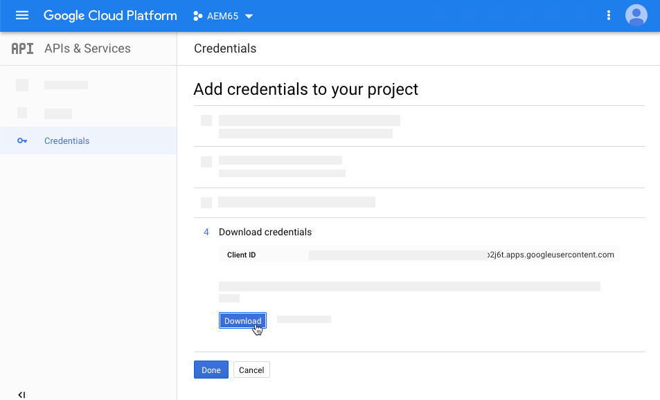

# 管理影片資產 {#manage-video-assets}

| 版本 | 文章連結 |
| -------- | ---------------------------- |
| AEM as a Cloud Service  | [按一下這裡](https://experienceleague.adobe.com/docs/experience-manager-cloud-service/content/assets/manage/manage-video-assets.html?lang=en) |
| AEM 6.5 | 本文章 |

視訊格式是組織數位資產的重要一環。 [!DNL Adobe Experience Manager]提供成熟的產品和功能，可在建立視訊資產後管理其整個生命週期。

瞭解如何在[!DNL Adobe Experience Manager Assets]中管理和編輯視訊資產。 可以使用[!DNL Dynamic Media]整合進行視訊編碼與轉碼（例如FFmpeg轉碼）。

## 上傳和預覽視訊資產 {#upload-and-preview-video-assets}

[!DNL Adobe Experience Manager Assets]會產生副檔名為MP4之視訊資產的預覽。 如果資產的格式不是MP4，請安裝FFmpeg套件以產生預覽。 FFmpeg會建立OGG和MP4型別的視訊轉譯。 您可以在[!DNL Assets]使用者介面中預覽轉譯。

1. 在數位資產資料夾或子資料夾中，導覽至您要新增數位資產的位置。
1. 若要上傳資產，請按一下工具列中的[建立]，然後選擇[檔案]。**&#x200B;** **&#x200B;**&#x200B;或者，在使用者介面上拖曳檔案。 如需詳細資訊，請參閱[上傳資產](manage-assets.md#uploading-assets)。
1. 若要在卡片檢視中預覽視訊，請按一下視訊資產上的&#x200B;**[!UICONTROL 播放]** 選項。 您只能在卡片檢視中暫停或播放視訊。 清單檢視中不提供[!UICONTROL 播放]和[!UICONTROL 暫停]選項。

1. 若要在資產詳細資訊頁面中預覽視訊，請按一下卡片上的&#x200B;**[!UICONTROL 編輯]**。 視訊會在瀏覽器的原生視訊播放器中播放。 您可以播放、暫停、控制音量，以及將視訊縮放至全熒幕。

   

## 上傳大於2 GB之資產的設定 {#configuration-to-upload-assets-that-are-larger-than-gb}

根據預設，[!DNL Assets]不允許您上傳任何因檔案大小限制而大於2 GB的資產。 不過，您可以進入CRXDE Lite並在`/apps`目錄下建立節點，覆寫此限制。 節點必須具有相同的節點名稱、目錄結構和順序的可比較節點屬性。

除了[!DNL Assets]設定外，請變更下列設定以上傳大型資產：

* 增加權杖到期時間。 在`https://[aem_server]:[port]/system/console/configMgr`的Web主控台中檢視[!UICONTROL AdobeGranite CSRF Servlet]。 如需詳細資訊，請參閱[CSRF保護](/help/sites-developing/csrf-protection.md)。
* 在Dispatcher設定中增加`receiveTimeout`。 如需詳細資訊，請參閱[Experience ManagerDispatcher組態](https://experienceleague.adobe.com/docs/experience-manager-dispatcher/using/configuring/dispatcher-configuration.html#renders-options)。

>[!NOTE]
>
>[!DNL Experience Manager]傳統使用者介面沒有2 GB的檔案大小限制。 此外，大型視訊的端對端工作流程並非完全支援。

若要設定較高的檔案大小限制，請在`/apps`目錄中執行下列步驟。

1. 在[!DNL Experience Manager]中，按一下&#x200B;**[!UICONTROL 工具]** > **[!UICONTROL 一般]** > **[!UICONTROL CRXDE Lite]**。
1. 在CRXDE Lite中，導覽至`/libs/dam/gui/content/assets/jcr:content/actions/secondary/create/items/fileupload`。 若要檢視目錄視窗，請按一下`>>`。
1. 在工具列中按一下&#x200B;**[!UICONTROL 覆蓋節點]**。 或者，從上 **[!UICONTROL 下文選單選取]** 「覆蓋節點」。
1. 在&#x200B;**[!UICONTROL 覆蓋節點]**&#x200B;對話方塊中，按一下&#x200B;**[!UICONTROL 確定]**。

   

1. 重新整理瀏覽器。 已選取覆蓋節點`/apps/dam/gui/content/assets/jcr:content/actions/secondary/create/items/fileupload`。
1. 在&#x200B;**[!UICONTROL 屬性]**&#x200B;索引標籤中，輸入適當的值（位元組），將大小限制增加到所需的大小。 例如，若要將大小限制增加到30 GB，請輸入`32212254720`值。

1. 在工具列中按一下&#x200B;**[!UICONTROL 儲存全部]**。
1. 在[!DNL Experience Manager]中，按一下&#x200B;**[!UICONTROL 工具]** > **[!UICONTROL 作業]** > **[!UICONTROL 網頁主控台]**。
1. 在[!DNL Adobe Experience Manager] [!UICONTROL Web主控台組合]頁面上，在表格的「名稱」欄下，找到並按一下&#x200B;**[!UICONTROL AdobeGranite工作流程外部程式工作處理常式]**。
1. 在[!UICONTROL AdobeGranite工作流程外部處理作業處理常式]頁面上，將&#x200B;**[!UICONTROL 預設逾時]**&#x200B;和&#x200B;**[!UICONTROL 最大逾時]**&#x200B;欄位的秒數設定為`18000` （5小時）。 按一下「**[!UICONTROL 儲存]**」。
1. 在[!DNL Experience Manager]中，按一下&#x200B;**[!UICONTROL 工具]** > **[!UICONTROL 工作流程]** > **[!UICONTROL 模型]**。
1. 在工作流程模型頁面上，選取&#x200B;**[!UICONTROL Dynamic Media編碼影片]**，然後按一下&#x200B;**[!UICONTROL 編輯]**。
1. 在工作流程頁面上，連按兩下&#x200B;**[!UICONTROL Dynamic Media視訊服務處理序]**&#x200B;元件。
1. 在「步 [!UICONTROL 驟屬性] 」對話框的「常用」頁籤下，展開「 **[!UICONTROL 高級設定」]**&#x200B;**&#x200B;**。
1. 在&#x200B;**[!UICONTROL 逾時]**&#x200B;欄位中，指定值`18000`，然後按一下&#x200B;**[!UICONTROL 確定]**&#x200B;以返回&#x200B;**[!UICONTROL Dynamic Media編碼視訊]**&#x200B;工作流程頁面。
1. 在頁面頂端附近，[!UICONTROL Dynamic Media編碼視訊]頁面標題下方，按一下&#x200B;**[!UICONTROL 儲存]**。

## Publish視訊資產 {#publish-video-assets}

發佈後，您可以將視訊資產以URL形式納入網頁中，或直接內嵌資產。 如需詳細資訊，請參閱[發佈Dynamic Media資產](/help/assets/publishing-dynamicmedia-assets.md)。

## Publish影片至YouTube {#publishing-videos-to-youtube}

您可以將內部部署Experience Manager視訊資產直接發佈至您先前建立的YouTube頻道。

若要將視訊資產發佈至YouTube，請使用標籤設定Experience Manager Assets。 您可以將這些標籤與YouTube頻道建立關聯。 如果視訊資產的標籤符合YouTube頻道的標籤，則視訊會發佈至YouTube。 只要使用關聯的標籤，Publish到YouTube就會與視訊的正常發佈同時發生。

YouTube會自行編碼。 因此，上傳至Experience Manager的原始視訊檔案會發佈至YouTube，而不是Dynamic Media編碼建立的任何視訊轉譯。 雖然使用Dynamic Media處理視訊並非必要，但播放時若需要檢視器預設集，可預期使用此功能。

當您略過視訊處理設定檔並直接發佈至YouTube時，這僅代表您在Experience Manager資產中的視訊資產沒有取得可檢視的縮圖。 這也表示如果您以`dynamicmedia`或`dynamicmedia_scene7`執行模式執行，未編碼的視訊將無法與任何Dynamic Media資產型別搭配使用。

若要將視訊資產發佈至YouTube伺服器，必須完成下列工作，以確保使用YouTube進行安全無虞的伺服器對伺服器驗證：

1. [配置Google雲端設定](#configuring-google-cloud-settings)
1. [建立YouTube管道](#creating-a-youtube-channel)
1. [新增標籤以供發佈](#adding-tags-for-publishing)
1. [啟用YouTube Publish復寫代理程式](#enabling-the-youtube-publish-replication-agent)
1. [在Experience Manager中設定YouTube](#setting-up-youtube-in-aem)
1. [（可選）為您上傳的視訊自動設定預設YouTube屬性](#optional-automating-the-setting-of-default-youtube-properties-for-your-uploaded-videos)
1. [Publish影片至您的YouTube頻道](#publishing-videos-to-your-youtube-channel)
1. [（選用）驗證YouTube上的已發佈影片](/help/assets/video.md#optional-verifying-the-published-video-on-youtube)
1. [將YouTube URL連結至您的網頁應用程式](#linking-youtube-urls-to-your-web-application)

您也可以[取消發佈視訊，以從YouTube](#unpublishing-videos-to-remove-them-from-youtube)中移除這些視訊。

### 配置Google雲端設定 {#configuring-google-cloud-settings}

若要發佈至YouTube，您需要Google帳戶。 如果您有GMAIL帳戶，表示您已經擁有Google帳戶；如果您沒有Google帳戶，可以輕鬆建立帳戶。 您需要帳戶，因為您需要憑證才能將視訊資產發佈到YouTube。 如果您已建立帳戶，請略過此工作並直接繼續進行[建立YouTube管道](#creating-a-youtube-channel)。

Google Cloud所用的帳戶與YouTube所用的Google帳戶不必相同。

Google會定期變更其使用者介面。 因此，將視訊發佈至YouTube的步驟可能會與以下說明略有不同。 此警告也適用於您嘗試檢查是否將視訊上傳到YouTube的。

>[!NOTE]
>
>在撰寫本文時，下列步驟是準確的。 不過，Google會定期更新其網站，恕不另行通知。 因此，這些步驟可能會稍微不同。

若要設定Google雲端設定：

1. 建立Google帳戶。

   如果您已有Google帳戶，請跳至下一步。

1. 移至[https://cloud.google.com/](https://cloud.google.com/)。
1. 在Google cloud頁面的右上角，按一下「主控台」 **&#x200B;**。

   如有必要，請使用您的Google帳戶認證&#x200B;**[!UICONTROL 登入]**&#x200B;以檢視&#x200B;**[!UICONTROL 主控台]**&#x200B;選項。

1. 在「控制面板」頁面的&#x200B;**[!UICONTROL Google Cloud Platform]**&#x200B;右側，按一下「專案」下拉式清單以開啟「選取專案」對話方塊。
1. 在「選取專案」對話方塊中，選取&#x200B;**[!UICONTROL 新增專案]**。

   

1. 在「新專案」對話方塊的「專案名稱」欄位中，輸入新專案的名稱。

   您的專案ID是以專案名稱為基礎。 因此，請謹慎選擇專案名稱；專案建立後即無法變更。 此外，當您稍後在Experience Manager中設定YouTube時，必須再次輸入相同的專案ID；請考慮將其寫下。

1. 按一下&#x200B;**[!UICONTROL 建立]**。

1. 執行下列任一項作業：

   * 在您的專案的[儀表板]上，在[快速入門]卡中，選取[**[!UICONTROL 探索並啟用API]**]。
   * 在您的專案的「儀表板」上，在API卡中，選取「**[!UICONTROL 前往API總覽]**」。

   

1. 在[API與服務]頁面頂端附近，選取[啟用API與服務]&#x200B;**&#x200B;**。
1. 在「API程式庫」頁面的左側，**[!UICONTROL 類別]**&#x200B;下方選取&#x200B;**[!UICONTROL YouTube]**。 在頁面右側，選取&#x200B;**[!UICONTROL YouTube Data API]**。
1. 在YouTube Data API v3頁面上，選取&#x200B;**[!UICONTROL 啟用]**。

   

1. 若要使用API，您需要憑證。 如有必要，請按一下&#x200B;**[!UICONTROL 建立認證]**。

   

1. 在&#x200B;**[!UICONTROL 新增認證至您的專案]**&#x200B;頁面上的步驟1，執行下列動作：

   * 從&#x200B;**[!UICONTROL 您使用哪個API？]**&#x200B;下拉式清單，選取&#x200B;**[!UICONTROL YouTube Data API v3]**。

   * 從&#x200B;**[!UICONTROL 您從哪裡呼叫API？]**&#x200B;下拉式清單，選取&#x200B;**[!UICONTROL 網頁伺服器（例如node.js、Tomcat）]**

   * 從&#x200B;**[!UICONTROL 您正在存取哪些資料？]**&#x200B;下拉式清單，選取&#x200B;**[!UICONTROL 使用者資料]**。

   

1. 選取&#x200B;**[!UICONTROL 我需要什麼認證？]**
1. 在「 **[!UICONTROL 新增認證至您的專案]** 」頁面的「建立OAuth 2.0用戶端ID **&#x200B;**&#x200B;」標題下，視需要在「名稱」欄位中輸入唯一名稱。或者，您可以使用Google指定的預設名稱。
1. 在&#x200B;**[!UICONTROL 授權的JavaScript來源]**&#x200B;標題下，在文字欄位中輸入以下路徑，在路徑中取代您自己的網域和連線埠號碼，然後按&#x200B;**[!UICONTROL Enter]**&#x200B;將路徑新增至清單：

   `https://<servername.domain>:<port_number>`

   例如 `https://1a2b3c.mycompany.com:4321`

   **注意**：上述路徑範例僅供示範之用。

   

1. 在&#x200B;**[!UICONTROL 授權的重新導向URI]**&#x200B;標題下，在文字欄位中輸入以下路徑，取代路徑中您自己的網域和連線埠號碼，然後按&#x200B;**[!UICONTROL Enter]**&#x200B;將路徑新增至清單：

   `https://<servername.domain>:<port_number>/etc/cloudservices/youtube.youtubecredentialcallback.json`

   例如 `https://1a2b3c.mycompany.com:4321/etc/cloudservices/youtube.youtubecredentialcallback.json`

   **注意**：上述路徑範例僅供示範之用。

1. 按一下&#x200B;**[!UICONTROL 建立OAuth使用者端識別碼]**。
1. 在「 **[!UICONTROL 新增認證至您的專案]**&#x200B;**&#x200B;** 」頁面的「設定OAuth 2.0同意書」畫面標題下方，選取您目前使用的Gmail電子郵件地址。

   

1. 在顯示給使用者的&#x200B;**[!UICONTROL 產品名稱]**&#x200B;標題下，在文字欄位中輸入您要在同意畫面上顯示的內容。

   當Experience Manager管理員向YouTube驗證時，會向管理員顯示同意畫面；Experience Manager會聯絡YouTube以取得許可權。

1. 按一下&#x200B;**[!UICONTROL 「繼續」]**。
1. 在[新增認證至您的專案]頁面的[下載認證] **標題下，選取[下載]**&#x200B;**，步驟4。**

   

1. 儲存 `client_id.json` 檔案。

   您稍後在Adobe Experience Manager中設定YouTube時，需要此下載的json檔案。

1. 按一下&#x200B;**[!UICONTROL 「完成」]**。

   登出您的Google帳戶。 現在建立YouTube管道。

### 建立YouTube管道 {#creating-a-youtube-channel}

若要將影片發佈至YouTube，您必須具備一或多個管道。 如果您已建立YouTube管道，則可以略過此工作，並移至[新增標籤以進行發佈](/help/assets/video.md#adding-tags-for-publishing)。

>[!WARNING]
>
>請確定您已在YouTube *之前設定一或多個管道*&#x200B;並在Experience Manager的YouTube設定下新增管道(請參閱下方的[在Experience Manager中設定YouTube](#setting-up-youtube-in-aem))。 如果您無法設定一或多個管道，則不會警告您管道不存在。 不過，當您新增頻道時，Google驗證仍會發生，但無法選擇傳送視訊的頻道。

**若要建立YouTube頻道：**

1. 移至[https://www.youtube.com](https://www.youtube.com/)並使用您的Google帳戶認證登入。
1. 在YouTube頁面的右上角，按一下您的個人資料圖片（也可以顯示為實色圓圈中的字母），然後按一下&#x200B;**[!UICONTROL YouTube設定]** （圓形齒輪圖示）。
1. 在「概觀」頁面的「其他功能」標題下，按一下「**[!UICONTROL 檢視我的所有管道」或建立管道]**。
1. 在[頻道]頁面上，按一下[**[!UICONTROL 建立新頻道]**]。
1. 在「品牌帳戶」頁面的「品牌帳戶名稱」欄位中，輸入您要發佈視訊資產的商業名稱或任何其他管道名稱，然後按一下「**[!UICONTROL 建立]**」。

   請記住您在這裡輸入的名稱，因為當您在Experience Manager中設定YouTube時，必須再次輸入此名稱。

1. （選用）如有需要，請新增更多管道。

   現在新增標籤以供發佈。

### 新增標籤以供發佈 {#adding-tags-for-publishing}

若要將影片發佈至YouTube，Experience Manager會將標籤與一個或多個YouTube管道建立關聯。 若要新增標籤以進行發佈，請參閱[管理標籤](/help/sites-administering/tags.md)。

或者，如果您想要在Experience Manager中使用預設標籤，您可以略過此工作並移至[啟用YouTube Publish復寫代理程式](#enabling-the-youtube-publish-replication-agent)。

### 啟用YouTube Publish復寫代理程式 {#enabling-the-youtube-publish-replication-agent}

啟用YouTube Publish復寫代理程式後，如果要測試與Google Cloud帳戶的連線，請選取&#x200B;**[!UICONTROL 測試連線]**。 瀏覽器標籤會顯示連線結果。 如果您已新增YouTube管道，測試期間會顯示管道清單。

1. 在Experience Manager的左上角，按一下Experience Manager標誌，然後在左側邊欄中，按一下&#x200B;**[!UICONTROL 工具]** > **[!UICONTROL 部署]** > **[!UICONTROL 復寫]** > **[!UICONTROL 作者代理程式]**。
1. 在作者代理程式頁面上，按一下&#x200B;**[!UICONTROL YouTube Publish]**。
1. 在工具列的[設定]右側，按一下[編輯]。**&#x200B;**
1. 選取&#x200B;**[!UICONTROL 已啟用]**&#x200B;核取方塊，以便您開啟復寫代理程式。
1. 按一下&#x200B;**[!UICONTROL 「確定」]**。

   現在在Experience Manager中設定YouTube。

### 在Experience Manager中設定YouTube {#setting-up-youtube-in-aem}

從Experience Manager 6.4開始，引進了全新的觸控使用者介面方法，以在Experience Manager中設定YouTube發佈。 根據您所使用的Experience Manager安裝例項，執行下列任一項作業：

* 若要在6.4之前的Experience Manager中設定YouTube，請參閱[在6.4](/help/assets/video.md#setting-up-youtube-in-aem-before)之前的Experience Manager中設定YouTube 。
* 若要在Experience Manager 6.4或更新版本中設定YouTube，請參閱[在Experience Manager 6.4及更新版本中設定YouTube](#setting-up-youtube-in-aem-and-later)。

#### 在Experience Manager 6.4和更新版本中設定YouTube {#setting-up-youtube-in-aem-and-later}

1. 請確定您以管理員身分登入您的Dynamic Media執行個體。
1. 在左上角，選取Experience Manager標誌，然後在左側導軌中，選取&#x200B;**[!UICONTROL 工具]** （槌子圖示） > **[!UICONTROL Cloud Service]** > **[!UICONTROL YouTube Publishing Configuration]**。
1. 選取&#x200B;**[!UICONTROL 全域]** （不要選取它）。

1. 在全域頁面的右上角附近，選取&#x200B;**[!UICONTROL 建立]**。
1. 在「建立YouTube設定」頁面的「Google cloud 平台設定」下方的「應用程式名稱」欄位 **[!UICONTROL 中]** ，輸入Google專案ID。

   您已在先前設定Google Cloud設定時指定專案ID。
讓「建立YouTube設定」頁面保持開啟；稍後，您將會返回該頁面。

   

1. 使用純文字編輯器，開啟您先前在[設定Google雲端設定](/help/assets/video.md#configuring-google-cloud-settings)工作中下載並儲存的JSON檔案。
1. 選取並複製整個JSON文字。
1. 返回YouTube帳戶設定對話方塊。在「 **[!UICONTROL JSON設定」欄位中]** ，貼上JSON文字。
1. 在頁面的右上角附近，選取&#x200B;**[!UICONTROL 儲存]**。

   現在在Experience Manager中設定YouTube管道。

1. 選取&#x200B;**[!UICONTROL 新增頻道]**。
1. 在「頻道名稱」欄位中，輸入您在&#x200B;**[!UICONTROL 先前新增一或多個頻道至YouTube]**&#x200B;工作中建立的頻道名稱。

   如有需要，您可以選擇新增說明。

1. 選取「**[!UICONTROL 新增]**」。
1. 隨即顯示YouTube/Google驗證。 如果您尚未登入Google Cloud帳戶，請略過此步驟。

   * 輸入與Google專案ID及上述JSON文字相關聯的Google使用者名稱和密碼。
   * 視您的帳戶有多少個管道會顯示兩個或更多專案而定。 選取管道。 請勿選取電子郵件地址；此地址不是管道。
   * 在下一頁，選取&#x200B;**[!UICONTROL 接受]**&#x200B;以允許存取此頻道。

1. 選取&#x200B;**[!UICONTROL 允許]**。

   現在設定標籤以供發佈。

1. **[!UICONTROL 設定標籤以供發佈]** — 在Cloud Service> YouTube頁面上，選取鉛筆圖示以編輯您要使用的標籤清單。
1. 選取下拉式清單圖示（上下顛倒的插入號），以便在Experience Manager中顯示可用標籤清單。
1. 選取一或多個標籤，以便新增。

   若要刪除您已新增的標籤，請選取標籤，然後選取&#x200B;**[!UICONTROL X]**。

1. 完成新增您想要的標籤後，請選取&#x200B;**[!UICONTROL 儲存]**。

   現在您可將視訊發佈至YouTube頻道。

#### 在6.4之前的Experience Manager中設定YouTube {#setting-up-youtube-in-aem-before}

1. 請確定您以管理員身分登入您的Dynamic Media執行個體。

1. 在左上角選取Experience Manager標誌，然後在左側導軌中選取&#x200B;**[!UICONTROL 工具]** （槌子圖示） > **[!UICONTROL 部署]** > **[!UICONTROL Cloud Service]**。
1. 在「協力廠商服務」標題的「YouTube」下方，選取&#x200B;**[!UICONTROL 立即設定]**。
1. 在「建立組態」對話方塊的個別欄位中，輸入標題（必要）和名稱（選用）。
1. 選取「**[!UICONTROL 建立]**」。
1. 在「YouTube帳戶設定」對話方塊的「應用程式名 **[!UICONTROL 稱」欄位中]** ，輸入Google專案ID。

   您已在最初[設定Google雲端設定](/help/assets/video.md#configuring-google-cloud-settings)時指定專案ID。
保留YouTube帳戶設定對話方塊開啟；您稍後將返回該對話方塊。

1. 使用純文字編輯器，開啟您先前在「設定Google雲端設定」工作中下載並儲存的JSON檔案。
1. 選取並複製整個JSON文字。
1. 返回YouTube帳戶設定對話方塊。在「 **[!UICONTROL JSON設定」欄位中]** ，貼上JSON文字。
1. 選取&#x200B;**[!UICONTROL 確定]**。

   現在在Experience Manager中設定YouTube管道。

1. 在&#x200B;**[!UICONTROL 可用頻道]**&#x200B;的右側，選取&#x200B;**+** （加號圖示）。
1. 在「YouTube頻道設定」對話方塊的「標題」欄位中，輸入您在「先前新增一或多個頻道至YouTube」工作中建立的頻道名稱 **&#x200B;**&#x200B;。

   如有需要，您可以選擇新增說明。

1. 選取&#x200B;**[!UICONTROL 確定]**。
1. 隨即顯示YouTube/Google驗證。 如果您尚未登入Google Cloud帳戶，請略過此步驟。

   * 輸入與Google專案ID及上述JSON文字相關聯的Google使用者名稱和密碼。
   * 視您的帳戶有多少個管道會顯示兩個或更多專案而定。 選取管道。 請勿選取電子郵件地址；此地址不是管道。
   * 在下一頁，選取&#x200B;**[!UICONTROL 接受]**&#x200B;以允許存取此頻道。

1. 選取&#x200B;**[!UICONTROL 允許]**。

   現在設定標籤以供發佈。

1. **[!UICONTROL 設定標籤以供發佈]** — 在Cloud Service> YouTube頁面上，選取鉛筆圖示以編輯您要使用的標籤清單。
1. 選取下拉式清單圖示（上下顛倒的插入號），以便在Experience Manager中顯示可用標籤清單。
1. 選取一或多個標籤，以便新增。

   若要刪除您已新增的標籤，請選取標籤，然後選取&#x200B;**X**。

1. 完成新增您想要的標籤後，請選取&#x200B;**[!UICONTROL 確定]**。

   現在您可將視訊發佈至YouTube頻道。

### （可選）為您上傳的視訊自動設定預設YouTube屬性 {#optional-automating-the-setting-of-default-youtube-properties-for-your-uploaded-videos}

您可以選擇在Experience Manager中建立中繼資料處理設定檔，在上傳視訊時自動設定YouTube屬性。

若要建立中繼資料處理設定檔，您必須先從「欄位標籤 **[!UICONTROL 」、「對應至屬性]**&#x200B;**&#x200B;**&#x200B;**&#x200B;** 」和「選擇」欄位複製值，這些全都可在視訊的中繼資料結構中找到。然後，您可以新增這些值，以建立您的YouTube視訊中繼資料處理設定檔。

若要針對您上傳的視訊自動設定預設YouTube屬性：

1. 在左上角，選取Experience Manager標誌，然後在左側導軌中，按一下&#x200B;**[!UICONTROL 工具]** （槌子圖示） > **[!UICONTROL Assets]** > **[!UICONTROL 中繼資料結構描述]**。
1. 按一下&#x200B;**[!UICONTROL 預設]**。 （請勿在「預設」左側的選取方塊中新增核取記號。）
1. 在&#x200B;**[!UICONTROL 預設]**&#x200B;頁面上，勾選&#x200B;**[!UICONTROL 影片]**&#x200B;左側的方塊，然後選取&#x200B;**[!UICONTROL 編輯]**。
1. 在「中繼資料結構編輯器」頁面上，選取&#x200B;**[!UICONTROL 進階]**&#x200B;標籤。
1. 在「YouTube發佈」標題下，按一下「 **[!UICONTROL YouTube類別」]**。
1. 在頁面右側的&#x200B;**[!UICONTROL 設定]**&#x200B;標籤下方，執行下列動作：

   * 在&#x200B;**[!UICONTROL 對應至屬性]**&#x200B;文字欄位中，選取並複製值。
將複製的值貼到開啟的文字編輯器中。 當您稍後建立中繼資料處理設定檔時，會需要此值。 讓文字編輯器保持開啟狀態。

   * 在&#x200B;**[!UICONTROL 選擇]**&#x200B;下，選取並複製您要使用的預設值（例如「人員與部落格」或「科學與技術」）。
將複製的值貼到開啟的文字編輯器中。 當您稍後建立中繼資料處理設定檔時，會需要此值。 讓文字編輯器保持開啟狀態。

1. 在「YouTube發佈」標題下，選取&#x200B;**[!UICONTROL YouTube隱私權]**。
1. 在頁面右側的&#x200B;**[!UICONTROL 設定]**&#x200B;標籤下方，執行下列動作：

   * 在&#x200B;**[!UICONTROL 對應至屬性]**&#x200B;文字欄位中，選取並複製值。
將複製的值貼到開啟的文字編輯器中。 當您稍後建立中繼資料處理設定檔時，會需要此值。 讓文字編輯器保持開啟狀態。

   * 在&#x200B;**[!UICONTROL 選擇]**&#x200B;下，選取並複製您要使用的預設值。 請注意，「選擇」會組成兩個選項組。 配對中的底部欄位是您要複製的預設值，例如public、unlisted或private。
將複製的值貼到開啟的文字編輯器中。 當您稍後建立中繼資料處理設定檔時，會需要此值。 讓文字編輯器保持開啟狀態。

1. 在「中繼資料結構描述編輯器」頁面的右上角附近，按一下&#x200B;**[!UICONTROL 取消]**。
1. 在Experience Manager的左上角，選取Experience Manager標誌，然後在左側導軌中，按一下&#x200B;**[!UICONTROL 工具]** （槌子圖示） > **[!UICONTROL Assets]** > **[!UICONTROL 中繼資料設定檔]**。

1. 在「中繼資料描述檔」頁面的右上角，按一下「**[!UICONTROL 建立]**」。
1. 在「新增中繼資料描述檔」對話方塊的「描述檔標題 **[!UICONTROL 」文字欄位中，輸入名稱，]** 然後按一下「 `YouTube Video` 建立 **&#x200B;**」。
1. 在中繼資料設定檔編輯器頁面上，按一下&#x200B;**[!UICONTROL 進階]**&#x200B;標籤。
1. 執行下列操作，將複製的YouTube發佈值新增至設定檔：

   * 在頁面右側，按一下&#x200B;**[!UICONTROL 建置表單]**&#x200B;標籤。
   * （可選）將標示為&#x200B;**[!UICONTROL Section Header]**&#x200B;的元件拖曳至左側，並將它拖放到表單區域中。
   * （選擇性）按一下&#x200B;**[!UICONTROL 欄位標籤]**&#x200B;以選取元件。
   * （選擇性）在頁面右側的「設定」標籤下方，於「欄位標籤」文字欄位中輸入`YouTube Publishing`。
   * 按一下&#x200B;**[!UICONTROL 建置表單]**&#x200B;標籤，然後拖曳標示為&#x200B;**[!UICONTROL 多值文字]**&#x200B;的元件，並將它拖曳至您建立的&#x200B;**[!UICONTROL YouTube發佈]**&#x200B;標題下方。

   * 按一下「**[!UICONTROL 欄位標籤]**」以選取元件。
   * 在頁面右側的「設定」標籤下方，將您先前複製的YouTube發佈值（「欄位標籤」值和「對應至屬性值」）貼入表單上各自的欄位中。 將選擇值貼到「預設值」欄位中。

1. 執行下列操作，將複製的YouTube隱私權值新增至設定檔：

   * 在頁面右側，按一下&#x200B;**[!UICONTROL 建置表單]**&#x200B;標籤。
   * （可選）將標示為&#x200B;**[!UICONTROL Section Header]**&#x200B;的元件拖曳至左側，並將它拖放到表單區域中。
   * （選擇性）按一下&#x200B;**[!UICONTROL 欄位標籤]**&#x200B;以選取元件。
   * （選擇性）在頁面右側的「設定」標籤下方，於「欄位標籤」文字欄位中輸入`YouTube Privacy`。
   * 按一下&#x200B;**[!UICONTROL 建置表單]**&#x200B;標籤，然後拖曳標示為&#x200B;**[!UICONTROL 多值文字]**&#x200B;的元件，並將它拖曳至您建立的&#x200B;**[!UICONTROL YouTube隱私權]**&#x200B;標題下方。

   * 按一下「**[!UICONTROL 欄位標籤]**」以選取元件。
   * 在頁面右側的「設定」標籤下方，將您先前複製的YouTube發佈值（「欄位標籤」值和「對應至屬性值」）貼入表單上各自的欄位中。 將選擇值貼到「預設值」欄位中。

1. 在頁面的右上角附近，按一下「儲 **[!UICONTROL 存」]**。
1. 將YouTube發佈中繼資料設定檔套用至您要上傳影片的資料夾。 您必須同時設定中繼資料設定檔和視訊設定檔。

   請參 [閱中繼資料](/help/assets/metadata-config.md#metadata-profiles) [描述檔和視訊描述檔](/help/assets/video-profiles.md)。

### Publish影片至您的YouTube頻道 {#publishing-videos-to-your-youtube-channel}

現在，您將先前新增的標籤關聯至視訊資產。 此程式可讓Experience Manager知道要將哪些資產發佈至您的YouTube頻道。

>[!NOTE]
>
>在Dynamic Media - Scene7模式中執行時，立即發佈不會自動發佈至YouTube。 設定Dynamic Media - Scene7模式時，有兩個發佈選項可供選擇： **[!UICONTROL 立即]**&#x200B;或&#x200B;**[!UICONTROL 啟動時]**。
>
>**[!UICONTROL Publish立即]**&#x200B;表示上傳的資產（在與IPS同步之後）會自動發佈至傳遞系統。 Dynamic Media雖然如此，YouTube則否。 若要發佈至YouTube，您必須透過Experience Manager Author發佈。

>[!NOTE]
>
>若要從YouTube發佈內容，Experience Manager會使用&#x200B;**[!UICONTROL Publish至YouTube]**&#x200B;工作流程，讓您監視進度並檢視任何失敗資訊。
>
>請參閱[監視視訊編碼和YouTube發佈進度](#monitoring-video-encoding-and-youtube-publishing-progress)。
>
>如需詳細進度資訊，您可以在復寫下監視YouTube記錄。 但是，請注意，此類監視需要管理員存取權。

**若要將視訊發佈至您的YouTube頻道：**

1. 在Experience Manager中，導覽至您要發佈至YouTube頻道的視訊資產。
1. 選取視訊資產（最適化視訊集）。
1. 在工具列上，按一下&#x200B;**[!UICONTROL 屬性]**。
1. 在「基本」標籤的「中繼資料」標題下，按一下「標籤」欄位右側的&#x200B;**[!UICONTROL 「開啟選取範圍對話方塊」]**。
1. 在「選取標籤」頁面上，導覽至您要使用的標籤，然後選取一或多個標籤。

   請記住，標籤必須與YouTube管道相關聯。

1. 在頁面的右上角，按一下&#x200B;**[!UICONTROL 選取]**。
1. 在視訊屬性頁面的右上角，按一下[儲存並關閉]。**&#x200B;**
1. 在工具列上，按一下&#x200B;**[!UICONTROL 快速Publish]**。

   另請參閱[搭配Experience Manager Sites](https://experienceleague.adobe.com/docs/experience-manager-learn/sites/page-authoring/publication-management-feature-video-use.html)使用出版物管理。

   您可以選擇驗證在YouTube頻道上發佈的影片。

### （選用）驗證YouTube上的已發佈影片 {#optional-verifying-the-published-video-on-youtube}

您可以選擇監視YouTube發佈（或取消發佈）的進度。

請參閱[監視視訊編碼和YouTube發佈進度](#monitoring-video-encoding-and-youtube-publishing-progress)。

發佈時間可能會因多項因素而有很大的差異，包括主要來源視訊格式、檔案大小和上傳流量。 發佈程式可能需要幾分鐘到幾小時的時間。 此外，解析度較高的格式呈現得也比較慢。 例如，720p和1080p需要比480p更長的時間。

八小時後，如果您仍然看到顯示&#x200B;**[!UICONTROL 已上傳（正在處理，請稍候）]**&#x200B;的狀態訊息，請嘗試從Adobe網站移除視訊，然後再次上傳。

### 將YouTube URL連結至您的網頁應用程式 {#linking-youtube-urls-to-your-web-application}

您可以取得Dynamic Media在發佈影片後產生的YouTube URL字串。 當您複製YouTube URL時，它會貼到剪貼簿，以便您視需要將其貼到網站或應用程式中的頁面。

>[!NOTE]
>
>您必須先將視訊資產發佈至YouTube，才能複製YouTube URL。

**若要將YouTube URL連結至您的Web應用程式：**

1. 導覽至您要複製其URL的&#x200B;*YouTube已發佈*&#x200B;視訊資產，然後選取該資產。

   請記住，YouTube URL僅可在您首次&#x200B;*發佈*&#x200B;視訊資產至YouTube *後複製*。

1. 在工具列上，按一下&#x200B;**[!UICONTROL 屬性]**。
1. 按一下「**[!UICONTROL 進階]**」標籤。
1. 在「YouTube發佈」標題下方的「YouTube URL清單」中，選取URL文字，並將URL文字複製到網頁瀏覽器，以預覽資產或新增至網頁內容頁面。

### 取消發佈影片，以便從YouTube中將其移除 {#unpublishing-videos-to-remove-them-from-youtube}

當您在Experience Manager中取消發佈視訊資產時，視訊會從YouTube中移除。

>[!CAUTION]
>
>如果您直接從YouTube中移除視訊，Experience Manager會保持警覺，並繼續視訊發佈至YouTube。 一律透過Experience Manager從YouTube取消發佈視訊資產。

>[!NOTE]
>
>若要從YouTube移除內容，Experience Manager會使用&#x200B;**[!UICONTROL 從YouTube取消發佈]**&#x200B;工作流程，讓您監視進度並檢視任何失敗資訊。
>
>請參閱[監視視訊編碼和YouTube發佈進度](#monitoring-video-encoding-and-youtube-publishing-progress)。

**若要取消發佈視訊以從YouTube移除它們：**

1. 導覽至您要從YouTube頻道取消發佈的視訊資產。
1. 在資產選擇模式中，選取一或多個已發佈的視訊資產。
1. 在工具列上，按一下&#x200B;**[!UICONTROL 管理出版物]**。 選取三個點的圖示(. ..) 工具列上，因此&#x200B;**[!UICONTROL 管理出版物]**&#x200B;會開啟。
1. 在[管理出版物]頁面上，選取[**[!UICONTROL 取消發佈]**]。
1. 在頁面的右上角，選取&#x200B;**[!UICONTROL 下一步]**。
1. 在頁面的右上角，選取&#x200B;**[!UICONTROL 取消發佈]**。

## 監視視訊編碼和YouTube發佈進度 {#monitoring-video-encoding-and-youtube-publishing-progress}

當您將新視訊上傳至已套用視訊編碼的資料夾，或您將視訊發佈至YouTube時，您可以監視視訊編碼/Youtube發佈的進度。 您只能透過記錄檔取得實際YouTube發佈進度。 但是，其失敗或成功會以其他方式列出，如下列程式所述。 此外，當YouTube發佈工作流程或視訊編碼完成或中斷時，您會收到電子郵件通知。

### 監視進度 {#monitoring-progress}

1. 在您的資產資料夾中檢視視訊編碼進度：

   * 在卡片檢視中，視訊編碼進度會依百分比顯示在資產上。 如果發生錯誤，資產上也會顯示此資訊。

   

   * 在清單檢視中，視訊編碼進度會顯示在&#x200B;**[!UICONTROL 處理狀態]**&#x200B;欄中。 如果出現錯誤，則該欄會顯示此訊息。

   

   預設不會顯示此欄。若要啟用欄，請從檢視下拉式功能表中選取&#x200B;**[!UICONTROL 檢視設定]**，然後新增&#x200B;**[!UICONTROL 處理狀態]**&#x200B;欄，然後按一下&#x200B;**[!UICONTROL 更新]**。

   

1. 在資產詳細資料中檢視進度。 當您按一下資產時，請開啟下拉式功能表，然後選取&#x200B;**[!UICONTROL 時間軸]**。 若要將其縮小至工作流程活動，例如編碼或YouTube發佈，請選取&#x200B;**[!UICONTROL 工作流程]**。

   

   任何工作流程資訊（例如編碼）都會顯示在時間軸中。 就YouTube發佈而言，工作流程時間軸也包含YouTube頻道名稱和YouTube影片URL。 此外，發佈完成後，您會在工作流程時間軸中看到任何失敗通知。

   >[!NOTE]
   >
   >由於來自[https://localhost:4502/system/console/configMgr](https://localhost:4502/system/console/configMgr)的&#x200B;**[!UICONTROL 重試]**、**[!UICONTROL 重試延遲]**&#x200B;及&#x200B;**[!UICONTROL 逾時]**&#x200B;有多個工作流程設定，因此最終記錄失敗/錯誤訊息可能需要較長時間，例如：
   >
   >* Apache Sling工作佇列設定
   >* AdobeGranite工作流程外部程式工作處理常式
   >* Granite工作流程逾時佇列
   >
   >您可以調整這些組態中的&#x200B;**[!UICONTROL 重試]**、**[!UICONTROL 重試延遲]**&#x200B;和&#x200B;**[!UICONTROL 逾時]**&#x200B;屬性。

1. 如需進行中的工作流程，請參閱「工具 **[!UICONTROL >工作流程]** >例項」中的「工作流程例 **[!UICONTROL 項」]**&#x200B;**&#x200B;**。

   >[!NOTE]
   >
   >您需要管理許可權才能存取&#x200B;**[!UICONTROL 工具]**&#x200B;功能表。

   

   選取執行個體並選取&#x200B;**[!UICONTROL 開啟歷程記錄]**。

   

   您也可以從「工作流程例證」區域暫停、終止或重新命名工作流程。 如需詳細資訊，請參閱[管理工作流程](/help/sites-administering/workflows-administering.md)。

1. 有關失敗的作業，請參閱「工具」>「工作流 **[!UICONTROL 程」]** > 「失敗 **[!UICONTROL 」中的「工]** 作流失敗 **&#x200B;**」。「工作 **[!UICONTROL 流失敗]** 」(Workflow Failure)列出所有失敗的工作流活動。

   >[!NOTE]
   >
   >您需要管理許可權才能存取&#x200B;**[!UICONTROL 工具]**&#x200B;功能表。

   

   >[!NOTE]
   >
   >由於來自[https://localhost:4502/system/console/configMgr](https://localhost:4502/system/console/configMgr)的&#x200B;**[!UICONTROL 重試]**、**[!UICONTROL 重試延遲]**&#x200B;及&#x200B;**[!UICONTROL 逾時]**&#x200B;有多個工作流程組態，最終記錄錯誤訊息可能需要較長時間，例如：
   >
   >* Apache Sling工作佇列設定
   >* AdobeGranite工作流程外部程式工作處理常式
   >* Granite工作流程逾時佇列
   >
   >您可以調整這些組態中的&#x200B;**[!UICONTROL 重試]**、**[!UICONTROL 重試延遲]**&#x200B;和&#x200B;**[!UICONTROL 逾時]**&#x200B;屬性。

1. 如需完成的工作流程，請參閱「工具 **[!UICONTROL >工作流程]** >封存 **[!UICONTROL 」中的「工作流程封存]**&#x200B;**&#x200B;**」。「工作 **[!UICONTROL 流程存檔]** 」會列出所有已完成的工作流活動。

   >[!NOTE]
   >
   >您需要管理許可權才能存取&#x200B;**[!UICONTROL 工具]**&#x200B;功能表。

   

1. 您會收到有關已中止或失敗的工作流程作業的電子郵件通知。 這些電子郵件通知可由管理員設定。 請參閱[設定電子郵件通知](#configuring-e-mail-notifications)。

#### 設定電子郵件通知 {#configuring-e-mail-notifications}

>[!NOTE]
>
>您需要管理許可權才能存取&#x200B;**[!UICONTROL 工具]**&#x200B;功能表。

通知的設定方式取決於您是要接收編碼作業還是YouTube發佈作業的通知：

* 針對編碼工作，您可以在&#x200B;**[!UICONTROL 工具]** > **[!UICONTROL 作業]** > **[!UICONTROL Web主控台]**&#x200B;以及搜尋&#x200B;**[!UICONTROL Day CQ工作流程電子郵件通知服務]**，存取所有Experience Manager工作流程電子郵件通知的設定頁面。 請參閱[在Experience Manager](/help/sites-administering/notification.md)中設定電子郵件通知。 您可以選取或清除&#x200B;**[!UICONTROL 中止時通知]**&#x200B;或&#x200B;**[!UICONTROL 完成時通知]**&#x200B;的核取方塊。

* 針對YouTube發佈工作，請執行以下作業：

1. 在Experience Manager中，選取&#x200B;**[!UICONTROL 工具]** > **[!UICONTROL 工作流程]** > **[!UICONTROL 模型]**。
1. 在[工作流程模型]頁面上，選取&#x200B;**[!UICONTROL Publish到YouTube]**，然後在工具列上選取&#x200B;**[!UICONTROL 編輯]**。
1. 在Publish到YouTube工作流程頁面的右上角附近，選取&#x200B;**[!UICONTROL 編輯]**。
1. 將滑鼠指標暫留在YouTube上傳元件上，然後選取一次，以顯示內嵌工具列。

   

1. 在內嵌工具列上，選取「組態」(Configuration)圖示（扳手）。 按一下&#x200B;**[!UICONTROL 引數]**&#x200B;標籤。

   

1. 在YouTube上傳程式 — 步驟屬性對話方塊中，選取&#x200B;**[!UICONTROL 引數]**&#x200B;索引標籤。

   

1. 您可以選取或清除下列核取方塊：

   * 發佈開始
   * 發佈失敗
   * Publish完成 — 包含管道和URL的相關資訊

   清除核取方塊表示您不會從YouTube Publish工作流程收到指定的電子郵件通知。

   >[!NOTE]
   >
   >這些電子郵件是特定於YouTube的，並且是一般工作流程電子郵件通知的補充。 因此，您可以收到兩組電子郵件通知 — **[!UICONTROL Day CQ工作流程電子郵件通知服務]**&#x200B;中可用的通用通知，以及一組特定於YouTube的通知（視您的組態設定而定）。

1. 完成後，在對話方塊的右上角附近，選取&#x200B;**[!UICONTROL 完成]**&#x200B;圖示（核取記號）。
1. 在「Publish到YouTube」工作流程頁面的右上角，選取「**[!UICONTROL 同步]**」。

## 為視訊資產加上註釋 {#annotate-video-assets}

1. 從[!DNL Assets]主控台，選取資產卡上的&#x200B;**[!UICONTROL 編輯]**&#x200B;以顯示資產詳細資訊頁面。
1. 若要播放視訊，請按一下[預覽]。**&#x200B;**
1. 若要為視訊加上註解，請按一下&#x200B;**[!UICONTROL 加上註解]**。 註解會新增至視訊中的特定時間（影格）。 在註解時，您可以在畫布上繪圖，並在繪圖中包含註解。 註解會自動儲存。 若要結束註解精靈，請按一下&#x200B;**[!UICONTROL 關閉]**。

   

1. 尋找視訊中的特定點，在&#x200B;**「文字」**&#x200B;欄位中指定時間 (以秒為單位)，然後按一下&#x200B;**「跳至」**。例如，若要略過前 20 秒的視訊，請在文字欄位中輸入 20。

   

1. 若要在時間軸中檢視註釋，請按一下註釋。 若要從時間表刪除附註，請按一下&#x200B;**[!UICONTROL 刪除]**。

   

>[!MORELIKETHIS]
>
>* [在Experience Manager Assets中管理數位資產](/help/assets/manage-assets.md)
>* [在Experience Manager Assets中管理集合](/help/assets/manage-collections.md)
>* [Dynamic Media視訊檔案](/help/assets/video.md)。
