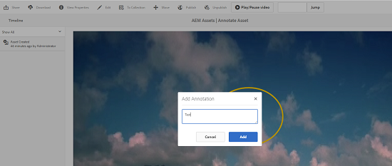

# 管理影片資產 {#manage-video-assets}

| 版本 | 文章連結 |
| -------- | ---------------------------- |
| AEM as a Cloud Service  | [按一下這裡](https://experienceleague.adobe.com/docs/experience-manager-cloud-service/content/assets/manage/manage-video-assets.html?lang=en) |
| AEM 6.5 | 本文 |
| AEM 6.4 | [按一下這裡](https://experienceleague.adobe.com/docs/experience-manager-64/assets/managing/managing-video-assets.html?lang=en) |

視頻格式是組織數字資產的關鍵部分。 [!DNL Adobe Experience Manager] 提供成熟的產品和功能，以在視頻資產建立後管理其整個生命週期。

瞭解如何在中管理和編輯視頻資產 [!DNL Adobe Experience Manager Assets]。 視頻編碼和轉碼，例如FFmpeg轉碼，可使用 [!DNL Dynamic Media] 整合。

## 上載和預覽視頻資產 {#upload-and-preview-video-assets}

[!DNL Adobe Experience Manager Assets] 為副檔名為MP4的視頻資產生成預覽。 如果資產的格式不是MP4，請安裝FFmpeg包以生成預覽。 Fmpeg建立OGG和MP4類型的視頻呈現。 您可以在 [!DNL Assets] 用戶介面。

1. 在數字資產資料夾或子資料夾中，導航到要添加數字資產的位置。
1. 要上載資產，請按一下 **[!UICONTROL 建立]** ，然後選擇 **[!UICONTROL 檔案]**。 或者，在用戶介面上拖動檔案。 請參閱 [上載資產](manage-assets.md#uploading-assets) 的雙曲餘切值。
1. 要在「卡」視圖中預覽視頻，請按一下 **[!UICONTROL 播放]**  的子菜單。 您只能在卡視圖中暫停或播放視頻。 的 [!UICONTROL 播放] 和 [!UICONTROL 暫停] 選項在清單視圖中不可用。

1. 要在資產詳細資訊頁面中預覽視頻，請按一下 **[!UICONTROL 編輯]** 卡上。 視頻在瀏覽器的本機視頻播放器中播放。 您可以播放、暫停、控制音量，並將視頻縮放到全屏。

   

## 要上載大於2 GB的資產的配置 {#configuration-to-upload-assets-that-are-larger-than-gb}

預設情況下， [!DNL Assets] 不允許您上載任何因檔案大小限制而大於2 GB的資產。 但是，您可以通過進入CRXDE Lite並在 `/apps` 的子菜單。 節點必須具有相同的節點名稱、目錄結構和順序的可比節點屬性。

除 [!DNL Assets] 配置，更改以下配置以上載大型資產：

* 增加令牌過期時間。 請參閱 [!UICONTROL Adobe花崗岩CSRF Servlet] 在Web控制台中， `https://[aem_server]:[port]/system/console/configMgr`。 有關詳細資訊，請參見 [CSRF保護](/help/sites-developing/csrf-protection.md)。
* 增加 `receiveTimeout` 在Dispatcher配置中。 有關詳細資訊，請參見 [Experience Manager調度程式配置](https://experienceleague.adobe.com/docs/experience-manager-dispatcher/using/configuring/dispatcher-configuration.html#renders-options)。

>[!NOTE]
>
>的 [!DNL Experience Manager] 傳統用戶介面沒有2 GB檔案大小限制。 此外，大型視頻的端到端工作流不完全受支援。

要配置更高的檔案大小限制，請在 `/apps` 的子菜單。

1. 在 [!DNL Experience Manager]按一下 **[!UICONTROL 工具]** > **[!UICONTROL 常規]** > **[!UICONTROL CRXDE Lite]**。
1. 在CRXDE Lite中，導航到 `/libs/dam/gui/content/assets/jcr:content/actions/secondary/create/items/fileupload`。 要查看目錄窗口，請按一下 `>>`。
1. 在工具欄中，按一下 **[!UICONTROL 覆蓋節點]**。 或者，從上 **[!UICONTROL 下文選單選取]** 「覆蓋節點」。
1. 在 **[!UICONTROL 覆蓋節點]** 對話框，按一下 **[!UICONTROL 確定]**。

   

1. 刷新瀏覽器。 覆蓋節點 `/apps/dam/gui/content/assets/jcr:content/actions/secondary/create/items/fileupload` 的子菜單。
1. 在 **[!UICONTROL 屬性]** 頁籤，輸入以位元組為單位的適當值，以將大小限制增加到所需大小。 例如，要將大小限制增加到30 GB，請輸入 `32212254720` 值。

1. 在工具欄中，按一下 **[!UICONTROL 全部保存]**。
1. 在 [!DNL Experience Manager]按一下 **[!UICONTROL 工具]** > **[!UICONTROL 操作]** > **[!UICONTROL Web控制台]**。
1. 在 [!DNL Adobe Experience Manager] [!UICONTROL Web控制台捆綁包] 頁，在表的「名稱」列下，找到並按一下 **[!UICONTROL Adobe花崗岩工作流外部進程作業處理程式]**。
1. 在 [!UICONTROL Adobe花崗岩工作流外部進程作業處理程式] 頁面，設定兩者的秒數 **[!UICONTROL 預設超時]** 和 **[!UICONTROL 最大超時]** 欄位 `18000` （5小時）。 按一下「**[!UICONTROL 儲存]**」。
1. 在 [!DNL Experience Manager]按一下 **[!UICONTROL 工具]** > **[!UICONTROL 工作流]** > **[!UICONTROL 模型]**。
1. 在「工作流模型」頁面上，選擇 **[!UICONTROL Dynamic Media編碼視頻]**，然後按一下 **[!UICONTROL 編輯]**。
1. 在工作流頁面上，按兩下 **[!UICONTROL Dynamic Media視頻服務流程]** 元件。
1. 在「步 [!UICONTROL 驟屬性] 」對話框的「常用」頁籤下，展開「 **[!UICONTROL 高級設定」]******。
1. 在 **[!UICONTROL 超時]** 欄位，指定 `18000`，然後按一下 **[!UICONTROL 確定]** 返回 **[!UICONTROL Dynamic Media編碼視頻]** 的子菜單。
1. 靠近頁面頂部，位於 [!UICONTROL Dynamic Media編碼視頻] 頁面標題，按一下 **[!UICONTROL 保存]**。

## 發佈視頻資產 {#publish-video-assets}

發佈後，可以將視頻資產作為URL包括在網頁中，或直接嵌入資產。 有關詳細資訊，請參閱 [發佈Dynamic Media資產](/help/assets/publishing-dynamicmedia-assets.md)。

## 注釋視頻資產 {#annotate-video-assets}

1. 從 [!DNL Assets] 控制台，選擇 **[!UICONTROL 編輯]** 顯示資產詳細資訊頁面。
1. 要播放視頻，請按一下 **[!UICONTROL 預覽]**。
1. 要注釋視頻，請按一下 **[!UICONTROL 注釋]**。 在視頻中的特定時間（幀）添加註釋。 注釋時，可以在畫布上進行繪製，並在繪圖中包括注釋。 注釋將自動保存。 要退出注釋嚮導，請按一下 **[!UICONTROL 關閉]**。

   

1. 尋找視訊中的特定點，在&#x200B;**「文字」**&#x200B;欄位中指定時間 (以秒為單位)，然後按一下&#x200B;**「跳至」**。例如，若要略過前 20 秒的視訊，請在文字欄位中輸入 20。

   

1. 要在時間軸中查看它，請按一下注釋。 要從時間軸中刪除注釋，請按一下 **[!UICONTROL 刪除]**。

   

>[!MORELIKETHIS]
>
>* [管理Experience Manager Assets的數字資產](/help/assets/manage-assets.md)
>* [管理Experience Manager Assets的收藏](/help/assets/manage-collections.md)
>* [Dynamic Media視頻文檔](/help/assets/video.md)。

