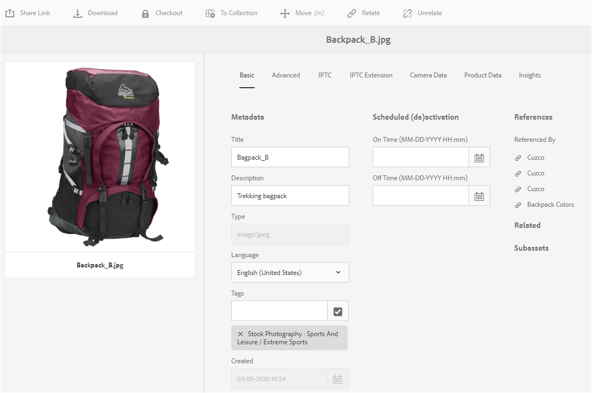

# 如何編輯或新增中繼資料 {#how-to-edit-or-add-metadata}

中繼資料是可搜尋之資產的其他資訊。 上傳影像時會自動擷取。 您可以編輯現有的中繼資料，或將新的中繼資料屬性新增至現有欄位，例如，中繼資料欄位空白時。

組織需要可控且可靠的中繼資料辭彙。 因 [!DNL Experience Manager Assets] 此不允許隨選新增中繼資料屬性。 開發人員而非作者可以新增資產的中繼資料欄位。 請參 [閱建立資產的中繼資料屬性](meta-edit.md#editing-metadata-schema)。

## 編輯資產的中繼資料 {#editing-metadata-for-an-asset}

若要編輯中繼資料，請依照下列步驟進行：

1. 執行下列任一項作業：

   * 從介面 [!DNL Assets] 中，選擇資產，然後從工具 **[!UICONTROL 列按一下「檢視屬性]** 」。
   * 從資產縮圖中，選取「檢視 **[!UICONTROL 屬性]** 」快速動作。
   * 在資產頁面中，按一下工 **[!UICONTROL 具列中的「檢]** 產資訊」圖示。

   資產頁面會顯示資產的所有中繼資料。 當資產上傳（收錄）至時，會擷取中繼資料 [!DNL Experience Manager]。

   

   *圖：在資產屬性頁面上編輯或新[!UICONTROL 增中繼資]料。*

1. Make edits to the metadata under the various tabs, as required, and when completed, click **[!UICONTROL Save]** from the toolbar to save your changes. Click **[!UICONTROL Close]** to return to the [!DNL Assets] web interface.

   >[!NOTE]
   >
   >如果文字欄位空白，則沒有現有的中繼資料集。 您可以在欄位中輸入值，並儲存它以新增該中繼資料屬性。

對資產中繼資料所做的任何變更都會寫入原始二進位檔，作為其XMP資料的一部分。 中繼資料回寫工作流程會將中繼資料新增至原始二進位檔。 對現有屬性所做的變更(如 `dc:title`)會被覆寫，而新屬性(包括自訂屬性 `cq:tags`等)會隨架構新增。

支援並啟用XMP回寫功能，適用於技術需求中所述的平台 [和檔案格式。](/help/sites-deploying/technical-requirements.md)

## 編輯中繼資料結構 {#editing-metadata-schema}

如需詳細資訊，請參 [閱編輯中繼資料結構表單](metadata-schemas.md#edit-metadata-schema-forms)。

## 在 [!DNL Experience Manager] {#registering-a-custom-namespace-within-aem}

您可以在中新增自己的名稱空間 [!DNL Experience Manager]。 就像有預先定義的名稱空間 `cq`(如、 `jcr`和 `sling`)一樣，您也可以為儲存庫元資料和XML處理提供一個命名空間。

1. 訪問節點類型管理頁 `https://[aem_server]:[port]/crx/explorer/nodetypes/index.jsp`。
1. 若要存取命名空間管理頁面，請按 **[!UICONTROL 一下頁面頂端的]** 「命名空間」。
1. 若要新增命名空間，請 **[!UICONTROL 按一下]** 頁面底部的「新增」。
1. 在XML命名空間慣例中指定自訂命名空間。 以URI的形式指定ID，並為ID指定相關首碼。 按一下&#x200B;**[!UICONTROL 「儲存」]**。

## 提示與限制 {#best-practices-limitations}

* 透過Touch-UI更新的中繼資料會變更命名空間中的中繼資料 `dc` 屬性。 透過HTTP API進行的任何更新都會變更命名空間中的中繼資料 `jcr` 屬性。 瞭解 [如何使用HTTP API更新中繼資料](/help/assets/mac-api-assets.md#update-asset-metadata)。

>[!MORELIKETHIS]
>
>* [關於資產中的中繼資料及其需求](metadata.md)
>* [XMP 中繼資料](xmp.md)
>* [中繼資料圖式參考](meta-ref.md)

