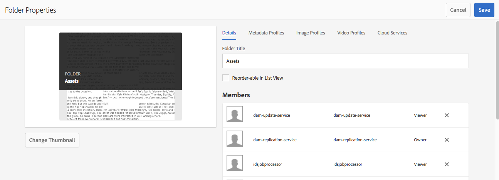

# 在中配置和管理元資料功能 [!DNL Assets] {#config-metadata}

| 版本 | 文章連結 |
| -------- | ---------------------------- |
| AEM as a Cloud Service  | [按一下這裡](https://experienceleague.adobe.com/docs/experience-manager-cloud-service/content/assets/manage/metadata-profiles.html?lang=en) |
| AEM 6.5 | 本文 |
| AEM 6.4 | [按一下這裡](https://experienceleague.adobe.com/docs/experience-manager-64/assets/administer/metadata-profiles.html?lang=en) |

<!-- Scope of metadata articles:
* metadata.md: The scope of this article is basic metadata updates, changes, etc. operations that end-users can do.
* metadata-concepts.md: All conceptual information. Minor instructions are OK but it is an FYI article about support and standards.
* metadata-config.md: New article. Contains all configuration and administration how-to info related to metadata of assets.
-->

[!DNL Adobe Experience Manager Assets] 保留每個資產的元資料。 它使資產的分類和組織變得更容易，並幫助尋找特定資產的人。 通過能夠保留和管理與資產相關的元資料，您可以根據資產的元資料自動組織和處理資產。 [!DNL Adobe Experience Manager Assets] 允許管理員配置和自定義元資料功能以修改預設Adobe產品。

## 編輯元資料架構 {#metadata-schema}

有關詳細資訊，請參閱 [編輯元資料架構表單](metadata-schemas.md#edit-metadata-schema-forms)。

## 在中註冊自定義命名空間 [!DNL Experience Manager] {#registering-a-custom-namespace-within-aem}

可以在中添加自己的命名空間 [!DNL Experience Manager]。 正如有預定義的命名空間一樣， `cq`。 `jcr`, `sling`，您可以為儲存庫元資料和XML處理提供一個命名空間。

1. 訪問節點類型管理頁 `https://[aem_server]:[port]/crx/explorer/nodetypes/index.jsp`。
1. 要訪問命名空間管理頁，請按一下 **[!UICONTROL 命名空間]** 頁面頂部。
1. 要添加命名空間，請按一下 **[!UICONTROL 新建]** 在頁面底部。
1. 在XML命名空間約定中指定自定義命名空間。 以URI和ID關聯前置詞的形式指定ID。 按一下「**[!UICONTROL 儲存]**」。

## 配置批量元資料更新的限制 {#bulk-metadata-update-limit}

為防止出現拒絕服務(DOS)等情況， [!DNL Enterprise Manager] 限制Sling請求中支援的參數數。 在一次更新多個資產的元資料時，您可能會達到此限制，並且不會為更多資產更新元資料。 Enterprise Manager在日誌中生成以下警告：

`org.apache.sling.engine.impl.parameters.Util Too many name/value pairs, stopped processing after 10000 entries`

要更改限制，請訪問 **[!UICONTROL 工具]** > **[!UICONTROL 操作]** > **[!UICONTROL Web控制台]** 並更改 **[!UICONTROL 最大POST參數]** 在 **[!UICONTROL Apache Sling請求參數處理]** OSGi配置。

## 中繼資料設定檔 {#metadata-profiles}

元資料配置檔案允許您將預設元資料應用於資料夾內的資產。 建立元資料配置檔案並將其應用於資料夾。 稍後上載到資料夾的任何資產都會繼承您在元資料配置檔案中配置的預設元資料。

### 添加元資料配置檔案 {#adding-a-metadata-profile}

1. 導航到 **[!UICONTROL 工具]** > **[!UICONTROL 資產]** > **[!UICONTROL 元資料配置檔案]** 按一下 **[!UICONTROL 建立]**。
1. 輸入配置檔案的標題，例如 `Sample Metadata`，然後按一下 **[!UICONTROL 建立]**。 的 [!UICONTROL 編輯窗體] 顯示元資料配置檔案。

   

1. 按一下元件並在 **[!UICONTROL 設定]** 頁籤。 例如，按一下 **[!UICONTROL 說明]** 並編輯其屬性。

   

   編輯以下屬性 **[!UICONTROL 說明]** 元件：

   * **[!UICONTROL 欄位標籤]**:元資料屬性的顯示名稱。 僅供用戶參考。

   * **[!UICONTROL 映射到屬性]**:此屬性的值提供了資產節點的相對路徑或名稱，該節點保存在儲存庫中。 值應始終以 `./` 因為它表示路徑位於資產的節點下。

   

   為指定的值 **[!UICONTROL 映射到屬性]** 儲存為資產的元資料節點下的屬性。 例如，如果 `./jcr:content/metadata/dc:desc` 的名稱 **[!UICONTROL 映射到屬性]**。 [!DNL Assets] 儲存值 `dc:desc` 元資料節點。 Adobe建議您只將一個欄位映射到元資料架構中的給定屬性。 否則，系統將選取映射到該屬性的最新添加欄位。

   * **[!UICONTROL 預設值]**:使用此屬性可為元資料元件添加預設值。 例如，如果指定「我的說明」，則會將此值分配給屬性 `dc:desc` 元資料節點。

   

   >[!NOTE]
   >
   >向新元資料屬性添加預設值(在 `/jcr:content/metadata` 節點)不在資產上顯示屬性及其值 [!UICONTROL 屬性] 的子菜單。 查看資產上的新屬性 [!UICONTROL 屬性] 頁，修改相應的架構窗體。

1. （可選）在 **[!UICONTROL 生成窗體]** 頁籤，添加更多元件 [!UICONTROL 編輯窗體]，並在 **[!UICONTROL 設定]** 頁籤。 以下屬性可在 **[!UICONTROL 生成窗體]** 頁籤：

| Component | 屬性 |
| ----------------------------- | ----------------------------------------------------------------------- |
| [!UICONTROL 區段標題] | 欄位標籤，   說明 |
| [!UICONTROL 單行文本] | 欄位標籤，   映射到屬性，   預設值 |
| [!UICONTROL 多值文字] | 欄位標籤，   映射到屬性，   預設值 |
| [!UICONTROL 數量] | 欄位標籤，   映射到屬性，   預設值 |
| [!UICONTROL 日期] | 欄位標籤，   映射到屬性，   預設值 |
| [!UICONTROL 標準標記] | 欄位標籤，   映射到屬性，   預設值，   說明 |

1. 按一下 **[!UICONTROL 完成]**。 元資料配置檔案將添加到 **[!UICONTROL 元資料配置檔案]** 的子菜單。 

   

### 複製元資料配置檔案 {#copying-a-metadata-profile}

1. 從 **[!UICONTROL 元資料配置檔案]** 的子菜單。

   

1. 按一下 **[!UICONTROL 複製]** 的子菜單。
1. 在 **[!UICONTROL 複製元資料配置檔案]** 對話框，輸入元資料配置檔案新副本的標題。
1. 按一下 **[!UICONTROL 複製]**。 中繼資料描述檔的復本會顯示在「中繼資料描述檔」頁面的描述檔 **[!UICONTROL 清單中]** 。

   

### 刪除元資料配置檔案 {#deleting-a-metadata-profile}

1. 從 **[!UICONTROL 元資料配置檔案]** 的子菜單。

1. 按一下 **[!UICONTROL 刪除元資料配置檔案]** 的子菜單。
1. 在對話框中，按一下 **[!UICONTROL 刪除]** 確認刪除操作。 元資料配置檔案將從清單中刪除。

<!-- TBD: Revisit to find out the correct config. and update these steps. When fixed, also o
These steps have been carried forward from old AEM versions. See https://helpx.adobe.com/experience-manager/6-2/assets/using/metadata-profiles.html#ApplyingaMetadataProfiletoFolders

### Configuration to apply a metadata profile globally {#apply-a-metadata-profile-globally}

In addition to applying a profile to a folder, you can also apply one globally so that any content uploaded into [!DNL Experience Manager] assets in any folder has the selected profile applied.

You can reprocess assets in a folder that already has an existing metadata profile that you later changed. See [Reprocessing assets in a folder after you have edited its processing profile](processing-profiles.md#reprocessing-assets).

To apply a metadata profile globally, follow these steps:

* Navigate to `https://[aem_server]:[port]/mnt/overlay/dam/gui/content/assets/foldersharewizard.html/content/dam` and apply the appropriate profile and click **[!UICONTROL Save]**.

  

* In CRXDE Lite, navigate to the following node: `/content/dam/jcr:content`. Add the property `metadataProfile:/etc/dam/metadata/dynamicmedia/<name of metadata profile>` and click **[!UICONTROL Save All]**.

  
-->

## 資料夾的元資料架構 {#folder-metadata-schema}

[!DNL Adobe Experience Manager Assets] 用於為資產資料夾建立元資料方案，這些資料夾定義資料夾屬性頁中顯示的佈局和元資料。

### 添加資料夾元資料架構表單 {#add-a-folder-metadata-schema-form}

使用資料夾元資料架構Forms編輯器建立和編輯資料夾的元資料架構。

1. 在 [!DNL Experience Manager] 介面，轉到 **[!UICONTROL 工具]** > **[!UICONTROL 資產]** > **[!UICONTROL 資料夾元資料架構]**。
1. 在 [!UICONTROL 資料夾元資料架構Forms] 的 **[!UICONTROL 建立]**。
1. 指定表單的名稱，然後按一下 **[!UICONTROL 建立]**。 新架構窗體列於 [!UICONTROL 架構Forms] 的子菜單。

### 編輯資料夾元資料架構表單 {#edit-folder-metadata-schema-forms}

您可以編輯新添加的或現有的元資料架構表單，其中包括以下內容：

* 索引標籤
* 制表符內的窗體項。

您可以將這些表單項映射到/配置到CRX儲存庫的元資料節點中的欄位。 可以將新頁籤或表單項添加到元資料架構表單中。

1. 在「方案Forms」頁中，選擇您建立的表單，然後選擇 **[!UICONTROL 編輯]** 的子菜單。
1. 在「資料夾元資料架構編輯器」頁中，按一下 `+` 的子菜單。 要更名頁籤，請按一下預設名稱，然後在 **[!UICONTROL 設定]**。

   

   要添加更多頁籤，請按一下 `+`。 要刪除，請按一下 `X` 的雙曲餘切值。

1. 在活動頁籤中，從 **[!UICONTROL 生成窗體]** 頁籤。

   

   如果建立多個頁籤，請按一下特定頁籤以添加元件。

1. 要配置元件，請選擇它並在 **[!UICONTROL 設定]** 頁籤。

   如有必要，請從 **[!UICONTROL 設定]** 頁籤。

   

1. 要保存更改，請選擇 **[!UICONTROL 保存]** 的子菜單。

#### 要生成表單的元件 {#components-to-build-forms}

的 **[!UICONTROL 生成窗體]** 頁籤列出在資料夾元資料架構窗體中使用的窗體項。 的 **[!UICONTROL 設定]** 頁籤顯示您在 **[!UICONTROL 生成窗體]** 頁籤。 下面列出了 **[!UICONTROL 生成窗體]** 頁籤：

| 元件名稱 | 說明 |
|---|---|
| [!UICONTROL 區段標題] | 為公用元件清單添加節標題。 |
| [!UICONTROL 單行文字] | 添加單行文本屬性。 它儲存為字串。 |
| [!UICONTROL 多值文字] | 添加多值文本屬性。 它儲存為字串陣列。 |
| [!UICONTROL 數量] | 添加數字元件。 |
| [!UICONTROL 日期] | 添加日期元件。 |
| [!UICONTROL 下拉式] | 添加下拉清單。 |
| [!UICONTROL 標準標記] | 新增標記. |
| [!UICONTROL 隱藏欄位] | 添加隱藏欄位。 保存資產時，它將作為POST參數發送。 |

#### 編輯表單項 {#editing-form-items}

要編輯表單項的屬性，請按一下元件並在 **[!UICONTROL 設定]** 頁籤。

**[!UICONTROL 欄位標籤]**:顯示在資料夾屬性頁面上的元資料屬性的名稱。

**[!UICONTROL 映射到屬性]**:此屬性指定保存資料夾節點的CRX儲存庫中資料夾節點的相對路徑。 它以&quot;開頭&#x200B;**。/**&quot; ，表示路徑位於資料夾的節點下。

以下是此屬性的有效值：

* `./jcr:content/metadata/dc:title`:將資料夾的元資料節點上的值儲存為屬性 `dc:title`。

* `./jcr:created`:在資料夾的節點顯示JCR屬性。 如果在CRXDE中配置這些屬性，Adobe建議將它們標籤為「禁用編輯」，因為它們受保護。 否則，錯誤「 `Asset(s) failed to modify`&#39;在保存資產屬性時發生。

要確保元件在元資料架構表單中正確顯示，請不要在屬性路徑中包含空格。

**[!UICONTROL JSON路徑]**:使用它可指定JSON檔案的路徑，在該路徑中為選項指定鍵值對。

**[!UICONTROL 佔位符]**:使用此屬性可指定與元資料屬性相關的佔位符文本。

**[!UICONTROL 選擇]**:使用此屬性可指定清單中的選項。

**[!UICONTROL 說明]**:使用此屬性可為元資料元件添加簡短說明。

**[!UICONTROL 類]**:屬性與關聯的對象類。

### 刪除資料夾元資料架構表單 {#delete-folder-metadata-schema-forms}

可以從「資料夾元資料架構」Forms頁中刪除資料夾元資料架構表單。 要刪除表單，請選擇表單，然後按一下工具欄中的刪除選項。

### 分配資料夾元資料架構 {#assign-a-folder-metadata-schema}

可以從「資料夾元資料方案」Forms頁或在建立資料夾時將資料夾元資料方案分配給資料夾。

如果為資料夾配置元資料架構，則架構表單的路徑將儲存在 `folderMetadataSchema` 資料夾節點的屬性 `./jcr:content`。

#### 從「資料夾元資料方案」頁分配到方案 {#assign-to-a-schema-from-the-folder-metadata-schema-page}

1. 在 [!DNL Experience Manager] 介面，轉到 **[!UICONTROL 工具]** > **[!UICONTROL 資產]** > **[!UICONTROL 資料夾元資料架構]**。
1. 從「資料夾元資料方案」Forms頁中，選擇要應用於資料夾的方案表單。
1. 在工具欄中，按一下 **[!UICONTROL 應用於資料夾]**。

1. 選擇要應用架構的資料夾，然後按一下 **[!UICONTROL 應用]**。 如果已在資料夾上應用元資料架構，則會顯示一則警告消息，通知您將覆蓋現有元資料架構。 按一下 **[!UICONTROL 覆蓋]**。
1. 開啟應用元資料架構的資料夾的元資料屬性。

   

   要查看資料夾元資料欄位，請按一下 **[!UICONTROL 資料夾元資料]** 頁籤。

   

#### 在建立資料夾時分配架構 {#assign-a-schema-when-creating-a-folder}

建立資料夾時，可以分配資料夾元資料架構。 如果系統中至少存在一個資料夾元資料架構，則在 **[!UICONTROL 建立資料夾]** 對話框。 可以選擇所需的架構。 預設情況下，未選擇任何架構。

1. 從 [!DNL Experience Manager Assets] 用戶介面，按一下 **[!UICONTROL 建立]** 的子菜單。
1. 指定資料夾的標題和名稱。
1. 從資料夾元資料架構清單中，選擇所需的架構。 然後，按一下 **[!UICONTROL 建立]**。

   

1. 開啟應用元資料架構的資料夾的元資料屬性。
1. 要查看資料夾元資料欄位，請按一下 **[!UICONTROL 資料夾元資料]** 頁籤。

### 使用資料夾元資料架構 {#use-the-folder-metadata-schema}

開啟配置了資料夾元資料架構的資料夾的屬性。A **[!UICONTROL 資料夾元資料]** 的子菜單。 [!UICONTROL 屬性] 的子菜單。 要查看資料夾元資料結構表單，請選擇此頁籤。

在各個欄位中輸入元資料值，然後按一下 **[!UICONTROL 保存]** 儲存值。 您指定的值將儲存在CRX儲存庫的資料夾節點中。

## 提示和限制 {#best-practices-limitations}

* 要在自定義命名空間上導入元資料，請首先註冊命名空間。
* 屬性選取器顯示在架構編輯器和搜索表單中使用的屬性。 屬性選取器不會從資產中選取元資料屬性。
* 在升級到 [!DNL Experience Manager] 6.5升級後，如果在資料夾中應用此配置檔案 [!UICONTROL 屬性] 在 [!UICONTROL 元資料配置檔案] 頁籤，則不顯示元資料窗體域。 但是，如果應用新建立的元資料配置檔案，則表單域將顯示，但不能按預期方式使用。 功能不會丟失，但是如果要查看（不可用）表單域，請編輯並保存現有元資料配置檔案。

>[!MORELIKETHIS]
>
>* [元資料概念和理解](metadata-concepts.md)。
>* [編輯多個集合的元資料屬性](manage-collections.md#editing-collection-metadata-in-bulk)。
>* [元資料在Experience Manager Assets的導入和導出](https://experienceleague.adobe.com/docs/experience-manager-learn/assets/metadata/metadata-import-export.html)。
>* [處理元資料、影像和視頻的配置檔案](processing-profiles.md)。
>* [組織數字資產以使用處理配置檔案的最佳做法](/help/assets/organize-assets.md)。
>* [XMP寫](/help/assets/xmp-writeback.md)。

