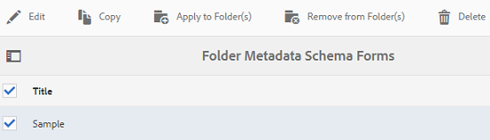

# [!DNL Assets] {#config-metadata}中元資料功能的配置和管理

<!-- Scope of metadata articles:
* metadata.md: The scope of this article is basic metadata updates, changes, etc. operations that end-users can do.
* metadata-concepts.md: All conceptual information. Minor instructions are OK but it is an FYI article about support and standards.
* metadata-config.md: New article. Contains all configuration and administration how-to info related to metadata of assets.
-->

[!DNL Adobe Experience Manager Assets] 保留每個資產的中繼資料。它可讓資產分類和組織更輕鬆，並協助尋找特定資產的人。 您可以使用資產保留和管理中繼資料，並根據資產的中繼資料自動組織和處理資產。 [!DNL Adobe Experience Manager Assets] 可讓管理員設定和自訂中繼資料功能，以修改預設Adobe方案。

## 編輯元資料架構{#metadata-schema}

如需詳細資訊，請參閱[編輯中繼資料結構表單](metadata-schemas.md#edit-metadata-schema-forms)。

## 在[!DNL Experience Manager] {#registering-a-custom-namespace-within-aem}中註冊自訂命名空間

您可以在[!DNL Experience Manager]中新增您自己的命名空間。 就像有預先定義的命名空間，如`cq`、`jcr`和`sling`一樣，您也可以擁有儲存庫元資料和XML處理的命名空間。

1. 訪問節點類型管理頁`https://[aem_server]:[port]/crx/explorer/nodetypes/index.jsp`。
1. 若要存取命名空間管理頁面，請按一下頁面頂端的「**[!UICONTROL 命名空間]**」。
1. 若要新增命名空間，請按一下頁面底部的&#x200B;**[!UICONTROL 新增]**。
1. 在XML命名空間約定中指定自訂命名空間。 以URI的形式指定ID以及ID的相關前置詞。 按一下「**[!UICONTROL 儲存]**」。

## 配置批量元資料更新的限制{#bulk-metadata-update-limit}

為避免發生類似DOS的情況，[!DNL Enterprise Manager]會限制Sling請求中支援的參數數。 一次更新多個資產的中繼資料時，您可能會達到上限，且不會針對更多資產更新中繼資料。 Enterprise Manager會在記錄檔中產生下列警告：

`org.apache.sling.engine.impl.parameters.Util Too many name/value pairs, stopped processing after 10000 entries`

要更改限制，請訪問&#x200B;**[!UICONTROL 工具]** > **[!UICONTROL 操作]** > **[!UICONTROL Web控制台]**&#x200B;並更改&#x200B;**[!UICONTROL Apache Sling請求參數處理]** OSGi配置中&#x200B;**[!UICONTROL 最大POST參數]**&#x200B;的值。

## 中繼資料設定檔 {#metadata-profiles}

中繼資料設定檔可讓您將預設中繼資料套用至資料夾內的資產。 建立中繼資料設定檔並將其套用至資料夾。 您隨後上傳至資料夾的任何資產都會繼承您在中繼資料設定檔中設定的預設中繼資料。

### 新增中繼資料設定檔{#adding-a-metadata-profile}

1. 導覽至&#x200B;**[!UICONTROL 工具]** > **[!UICONTROL 資產]** > **[!UICONTROL 中繼資料描述檔]**，然後按一下&#x200B;**[!UICONTROL 建立]**。
1. 輸入設定檔的標題，例如`Sample Metadata`，然後按一下&#x200B;**[!UICONTROL Create]**。 此時會顯示中繼資料設定檔的[!UICONTROL 編輯表單]。

   

1. 按一下元件，然後在&#x200B;**[!UICONTROL Settings]**&#x200B;標籤中配置其屬性。 例如，按一下&#x200B;**[!UICONTROL Description]**&#x200B;元件並編輯其屬性。

   

   編輯&#x200B;**[!UICONTROL Description]**&#x200B;元件的以下屬性：

   * **[!UICONTROL 欄位標籤]**:中繼資料屬性的顯示名稱。僅供使用者參考。

   * **[!UICONTROL 對應至屬性]**:此屬性的值提供儲存在儲存庫中的資產節點的相對路徑或名稱。值應一律以`./`開頭，因為它表示路徑位於資產節點下。

   

   您為&#x200B;**[!UICONTROL Map to property]**&#x200B;指定的值會儲存為資產中繼資料節點下的屬性。 例如，如果您指定`./jcr:content/metadata/dc:desc`作為&#x200B;**[!UICONTROL Map to property]**&#x200B;的名稱， [!DNL Assets]會將值`dc:desc`儲存在資產的中繼資料節點。

   * **[!UICONTROL 預設值]**:使用此屬性為元資料元件添加預設值。例如，如果您指定「My description」，則此值會指派給資產中繼資料節點的屬性`dc:desc`。

   

   >[!NOTE]
   >
   >新增預設值至新中繼資料屬性（在中尚未存在）。 `/jcr:content/metadata` 節點)預設不會在資產的「屬性」頁面上顯示屬性及其值。若要在資產的「[!UICONTROL 屬性]」頁面上檢視新屬性，請修改對應的結構表單。

1. (可選) 從「建置表單」標籤新增更多元件至「 **[!UICONTROL 編輯表單]** 」，並在「設定」標籤中設定 **[!UICONTROL 其屬性]** 。「生成表單」頁籤提供 **[!UICONTROL 以下屬性]** :

| 元件 | 屬性 |
| ----------------------------- | ----------------------------------------------------------------------- |
| [!UICONTROL 區段標題] | 欄位標籤， 說明 |
| [!UICONTROL 單行文字] | 欄位標籤，  映射至屬性，  預設值 |
| [!UICONTROL 多值文字] | 欄位標籤，  映射至屬性，  預設值 |
| [!UICONTROL 數量] | 欄位標籤，  映射至屬性，  預設值 |
| [!UICONTROL 日期] | 欄位標籤，  映射至屬性，  預設值 |
| [!UICONTROL 標準標記] | 欄位標籤，  映射至屬性，  預設值，  說明 |

1. 按一下&#x200B;**[!UICONTROL Done]**。 元資料配置檔案將添加到&#x200B;**[!UICONTROL 元資料配置檔案]**&#x200B;頁中的配置檔案清單中。 

   

### 複製元資料配置檔案{#copying-a-metadata-profile}

1. 從&#x200B;**[!UICONTROL 中繼資料描述檔]**&#x200B;頁面中，選取中繼資料描述檔以製作其復本。

   

1. 按一下工具列中的&#x200B;**[!UICONTROL 複製]**。
1. 在&#x200B;**[!UICONTROL 複製元資料配置檔案]**&#x200B;對話框中，輸入元資料配置檔案新副本的標題。
1. 按一下&#x200B;**[!UICONTROL Copy]**。 中繼資料描述檔的復本會顯示在「中繼資料描述檔」頁面的描述檔 **[!UICONTROL 清單中]** 。

   

### 刪除元資料配置檔案{#deleting-a-metadata-profile}

1. 從&#x200B;**[!UICONTROL 中繼資料描述檔]**&#x200B;頁面中，選取要刪除的描述檔。

1. 按一下工具列中的&#x200B;**[!UICONTROL 刪除中繼資料描述檔]** 。
1. 在對話方塊中，按一下&#x200B;**[!UICONTROL Delete]**&#x200B;以確認刪除操作。 元資料設定檔會從清單中刪除。

<!-- TBD: Revisit to find out the correct config. and update these steps. When fixed, also o
These steps have been carried forward from old AEM versions. See https://helpx.adobe.com/experience-manager/6-2/assets/using/metadata-profiles.html#ApplyingaMetadataProfiletoFolders

### Configuration to apply a metadata profile globally {#apply-a-metadata-profile-globally}

In addition to applying a profile to a folder, you can also apply one globally so that any content uploaded into [!DNL Experience Manager] assets in any folder has the selected profile applied.

You can reprocess assets in a folder that already has an existing metadata profile that you later changed. See [Reprocessing assets in a folder after you have edited its processing profile](processing-profiles.md#reprocessing-assets).

To apply a metadata profile globally, follow these steps:

* Navigate to `https://[aem_server]:[port]/mnt/overlay/dam/gui/content/assets/foldersharewizard.html/content/dam` and apply the appropriate profile and click **[!UICONTROL Save]**.

  

* In CRXDE Lite, navigate to the following node: `/content/dam/jcr:content`. Add the property `metadataProfile:/etc/dam/metadata/dynamicmedia/<name of metadata profile>` and click **[!UICONTROL Save All]**.

  
-->

## 資料夾{#folder-metadata-schema}的元資料架構

[!DNL Adobe Experience Manager Assets] 可讓您建立資產資料夾的中繼資料結構，定義資料夾屬性頁面中顯示的配置和中繼資料。

### 從{#add-a-folder-metadata-schema-form}添加資料夾元資料架構

使用資料夾中繼資料結構Forms編輯器，建立和編輯資料夾的中繼資料結構。

1. 在[!DNL Experience Manager]介面中，轉至&#x200B;**[!UICONTROL 工具]** > **[!UICONTROL 資產]** > **[!UICONTROL 資料夾元資料結構]**。
1. 在「[!UICONTROL 資料夾元資料結構Forms]」頁面上，按一下「**[!UICONTROL 建立]**」。
1. 指定表單的名稱，然後按一下「**[!UICONTROL 建立]**」。 新架構表單會列在「[!UICONTROL 架構Forms]」頁面中。

### 編輯資料夾元資料結構表單{#edit-folder-metadata-schema-forms}

您可以編輯新增或現有的中繼資料結構表單，其中包括：

* 索引標籤
* 標籤內的表單項目。

您可以將這些表單項目對應/設定至CRX存放庫中中繼資料節點內的欄位。 您可以將新索引標籤或表單項目新增至中繼資料結構表單。

1. 在「方案Forms」頁中，選擇您建立的表單，然後從工具欄中選擇&#x200B;**[!UICONTROL 編輯]**&#x200B;選項。
1. 在「資料夾元資料結構編輯器」頁中，按一下`+`將頁簽添加到窗體中。 要更名頁簽，請按一下預設名稱，並在&#x200B;**[!UICONTROL Settings]**&#x200B;下指定新名稱。

   

   要添加更多頁簽，請按一下`+`。 按一下索引標籤上的`X`加以刪除。

1. 在活動頁簽中，從&#x200B;**[!UICONTROL 生成表單]**&#x200B;頁簽添加一個或多個元件。

   

   如果您建立多個標籤，請按一下特定標籤以新增元件。

1. 要配置元件，請選擇該元件並在&#x200B;**[!UICONTROL Settings]**&#x200B;頁簽中修改其屬性。

   如果需要，請從&#x200B;**[!UICONTROL Settings]**&#x200B;頁簽中刪除元件。

   

1. 按一下工具列中的&#x200B;**[!UICONTROL 儲存]**&#x200B;以儲存變更。

#### 要建立表單的元件{#components-to-build-forms}

**[!UICONTROL 建置表單]**&#x200B;索引標籤會列出您在資料夾中繼資料結構表單中使用的表單項目。 **[!UICONTROL 設定]**&#x200B;標籤顯示您在&#x200B;**[!UICONTROL 生成表單]**&#x200B;標籤中選擇的每個項的屬性。 以下是&#x200B;**[!UICONTROL Build Form]**&#x200B;標籤中可用的表單項清單：

| 元件名稱 | 說明 |
|---|---|
| [!UICONTROL 區段標題] | 新增區段標題，以取得通用元件清單。 |
| [!UICONTROL 單行文字] | 新增單行文字屬性。 會儲存為字串。 |
| [!UICONTROL 多值文字] | 新增多值文字屬性。 會儲存為字串陣列。 |
| [!UICONTROL 數量] | 新增數字元件。 |
| [!UICONTROL 日期] | 新增日期元件。 |
| [!UICONTROL 下拉式] | 新增下拉式清單。 |
| [!UICONTROL 標準標記] | 新增標記. |
| [!UICONTROL 隱藏欄位] | 新增隱藏欄位。 資產儲存時會以POST參數的形式傳送。 |

#### 編輯表單項{#editing-form-items}

要編輯表單項的屬性，請按一下元件並在&#x200B;**[!UICONTROL Settings]**&#x200B;頁簽中編輯以下屬性的全部或子集。

**[!UICONTROL 欄位標籤]**:顯示在資料夾屬性頁面上的元資料屬性的名稱。

**[!UICONTROL 對應至屬性]**:此屬性指定儲存CRX儲存庫中資料夾節點的相對路徑。開頭為&quot;**。/**&quot;，表示路徑位於資料夾的節點下。

以下是此屬性的有效值：

* `./jcr:content/metadata/dc:title`:將值儲存在資料夾的中繼資料節點，作為屬 `dc:title`性。

* `./jcr:created`:在資料夾的節點顯示JCR屬性。如果您在CRXDE中設定這些屬性，Contaign建議您將它們標示為「停用編輯」，因為這些屬性受到保護。 否則，當您儲存資產的屬性時，會發生錯誤「 `Asset(s) failed to modify`」。

若要確保元件在中繼資料結構表單中正確顯示，請勿在屬性路徑中包含空格。

**[!UICONTROL JSON路徑]**:使用它來指定JSON檔案的路徑，您可在此指定選項的索引鍵值配對。

**[!UICONTROL 佔位符]**:使用此屬性可指定與中繼資料屬性相關的預留位置文字。

**[!UICONTROL 選擇]**:使用此屬性可指定清單中的選擇。

**[!UICONTROL 說明]**:使用此屬性可為中繼資料元件新增簡短說明。

**[!UICONTROL 類別]**:屬性關聯的對象類。

### 刪除資料夾元資料結構表單{#delete-folder-metadata-schema-forms}

您可以從「資料夾元資料結構」「Forms」頁中刪除資料夾元資料結構表單。 若要刪除表單，請選取表單，然後按一下工具列中的刪除選項。

### 分配資料夾元資料架構{#assign-a-folder-metadata-schema}

您可以從「資料夾元資料結構」Forms頁或建立資料夾時，將資料夾元資料結構分配給資料夾。

如果為資料夾配置元資料架構，架構表單的路徑將儲存在`./jcr:content`下資料夾節點的`folderMetadataSchema`屬性中。

#### 從「資料夾元資料結構」頁{#assign-to-a-schema-from-the-folder-metadata-schema-page}分配到架構

1. 在[!DNL Experience Manager]介面中，轉至&#x200B;**[!UICONTROL 工具]** > **[!UICONTROL 資產]** > **[!UICONTROL 資料夾元資料結構]**。
1. 從「資料夾元資料結構Forms」頁中，選擇要應用於資料夾的結構表單。
1. 在工具欄中，按一下&#x200B;**[!UICONTROL 應用到資料夾]**。

1. 選擇要在其上應用架構的資料夾，然後按一下&#x200B;**[!UICONTROL Apply]**。 如果資料夾上已套用中繼資料結構，警告訊息會通知您即將覆寫現有的中繼資料結構。 按一下「**[!UICONTROL 覆寫]**」。
1. 開啟您套用中繼資料結構的資料夾的中繼資料屬性。

   

   要查看資料夾元資料欄位，請按一下&#x200B;**[!UICONTROL 資料夾元資料]**&#x200B;頁簽。

   

#### 在建立資料夾{#assign-a-schema-when-creating-a-folder}時分配架構

建立資料夾時，您可以指派資料夾中繼資料結構。 如果系統中至少存在一個資料夾元資料架構，則在&#x200B;**[!UICONTROL 建立資料夾]**&#x200B;對話框中將顯示額外的清單。 您可以選取所需的結構。 預設情況下，不選擇任何架構。

1. 在[!DNL Experience Manager Assets]用戶介面中，從工具欄按一下&#x200B;**[!UICONTROL 建立]**。
1. 指定資料夾的標題和名稱。
1. 從「資料夾元資料結構」清單中，選擇所需的結構。 然後，按一下&#x200B;**[!UICONTROL Create]**。

   

1. 開啟您套用中繼資料結構的資料夾的中繼資料屬性。
1. 要查看資料夾元資料欄位，請按一下&#x200B;**[!UICONTROL 資料夾元資料]**&#x200B;頁簽。

### 使用資料夾元資料架構{#use-the-folder-metadata-schema}

開啟配置了資料夾元資料架構的資料夾的屬性。資料夾[!UICONTROL 屬性]頁中顯示&#x200B;**[!UICONTROL 資料夾元資料]**&#x200B;頁簽。 要查看資料夾元資料結構表單，請選擇此頁籤。

在各欄位中輸入元資料值，然後按一下&#x200B;**[!UICONTROL 儲存]**&#x200B;以儲存值。 您指定的值會儲存在CRX存放庫的資料夾節點中。

## 提示和限制{#best-practices-limitations}

* 若要匯入自訂命名空間上的中繼資料，請先註冊命名空間。
* 屬性選擇器顯示架構編輯器和搜尋表單中使用的屬性。 屬性選擇器不會從資產中挑選中繼資料屬性。
* 在升級到[!DNL Experience Manager] 6.5之前，您可能已存在以前存在的元資料配置檔案。升級後，如果在[!UICONTROL 元資料配置檔案]頁簽的資料夾[!UICONTROL 屬性]中應用此配置檔案，則不會顯示元資料表單欄位。 不過，如果您套用新建立的中繼資料設定檔，表單欄位會顯示，但無法如預期使用。 功能並未遺失，但如果您想查看（無法使用）表單欄位，請編輯並儲存現有的中繼資料設定檔。

>[!MORELIKETHIS]
>
>* [中繼資料概念與了解](metadata-concepts.md)。
>* [編輯多個集合的中繼資料屬性](manage-collections.md#editing-collection-metadata-in-bulk)。
>* [在Experience Manager資產中匯入和匯出中繼資料](https://experienceleague.adobe.com/docs/experience-manager-learn/assets/metadata/metadata-import-feature-video-use.html)。
>* [處理中繼資料、影像和視訊的設定檔](processing-profiles.md)。
>* [組織數位資產以使用處理設定檔的最佳實務](/help/assets/organize-assets.md)。
>* [XMP回寫](/help/assets/xmp-writeback.md)。

