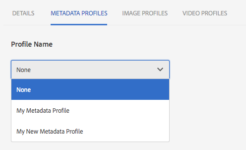

# Metadata profiles {#metadata-profiles}

中繼資料設定檔可讓您將預設中繼資料套用至資料夾中的資產。 建立中繼資料描述檔並將它套用至資料夾。 您隨後上傳至資料夾的任何資產都會繼承您在中繼資料描述檔中設定的預設中繼資料。

## 新增中繼資料設定檔 {#adding-a-metadata-profile}

1. 導覽至「工 **[!UICONTROL 具>資產>中繼資料設定檔]** 」，然後點 **[!UICONTROL 選「建立]**」。
1. 輸入中繼資料描述檔的標題，例如範例中繼資料，然後點選「建 **[!UICONTROL 立」]**。 此時將顯示 [!UICONTROL 元資料配置檔案的編輯表單] 。

   

1. 按一下元件，並在「設定」標籤中設 **[!UICONTROL 定其屬]** 性。 例如，按一下「說 **[!UICONTROL 明]** 」元件並編輯其屬性。

   

   編輯Description元件的以 **[!UICONTROL 下屬性]** :

   * **[!UICONTROL 欄位標籤]** -中繼資料屬性的顯示名稱。 僅供使用者參考。

   * **[!UICONTROL 映射到屬性]** -此屬性的值提供到資產節點的相對路徑／名稱，該資產節點保存在儲存庫中。 值應一律以開頭 `./` ，因為它表示路徑位於資產的節點下。
   

   您為「對應至屬性」 **[!UICONTROL 所指定的值]** ，會儲存為資產中繼資料節點下的屬性。 例如，如果您指定。 `/jcr:content/metadata/dc:desc` AEM Assets會將值儲 **[!UICONTROL 存在資產的中繼資料節點，作為]**`dc:desc` 「對應至屬性」的名稱。

   * **[!UICONTROL 預設值]** -使用此屬性為元資料元件添加預設值。 例如，如果您指定「我的說明」，則會將此值指派給資產中繼資 `dc:desc` 料節點的屬性。
   

   >[!NOTE]
   >
   >新增預設值至新的中繼資料屬性(此屬性在中已不存在。 `/jcr:content/metadata` 節點)預設不會在資產的「屬性」頁面上顯示屬性及其值。 要在資產的「屬性」頁上查看新屬 [!UICONTROL 性] ，請修改相應的架構表單。

1. （可選）從「建置表單」標籤新增更多元件至「 **[!UICONTROL 編輯表單]** 」，並在「設定」標籤中設定 **[!UICONTROL 其屬性]** 。 「生成表單」頁籤提供 **[!UICONTROL 以下屬性]** :

| 元件 | 屬性 |
|---|---|
| [!UICONTROL 區段標題] | 欄位標籤，說   明 |
| [!UICONTROL 單行文字] | 欄位標籤、   對應至屬性、預   設值 |
| [!UICONTROL 多值文字] | 欄位標籤、   對應至屬性、預   設值 |
| [!UICONTROL 數字] | 欄位標籤、   對應至屬性、預   設值 |
| [!UICONTROL 日期] | 欄位標籤、   對應至屬性、預   設值 |
| [!UICONTROL 標準標記] | 欄位標籤、   對應至屬性、預   設值、說   明 |

1. 點選／按一下「 **[!UICONTROL 完成]**」。 中繼資料描述檔會新增至「中繼資料描述檔」頁面中的描 **[!UICONTROL 述檔清單]** 。 

   

## 複製中繼資料描述檔 {#copying-a-metadata-profile}

1. 從「中 **[!UICONTROL 繼資料描述檔]** 」頁面中，選取中繼資料描述檔以製作其副本。

   

1. 從工具 **[!UICONTROL 列點選]** 「複製」。
1. 在「復 **[!UICONTROL 制中繼資料設定檔]** 」對話方塊中，輸入中繼資料設定檔新副本的標題。
1. 點選「 **[!UICONTROL 複製]**」。 中繼資料描述檔的復本會顯示在「中繼資料描述檔」頁面的描述檔 **[!UICONTROL 清單中]** 。

   

## 刪除中繼資料設定檔 {#deleting-a-metadata-profile}

1. 從「中繼資 **[!UICONTROL 料描述檔]** 」頁面中，選取要刪除的描述檔。

   

1. 在工[] 具列中刪除中繼資料設定檔 **** 。
1. 在對話方塊中，按一下「 **[!UICONTROL 刪除]** 」以確認刪除作業。 元資料配置檔案將從清單中刪除。

## 將中繼資料描述檔套用至資料夾 {#applying-a-metadata-profile-to-folders}

將元資料配置檔案分配給資料夾時，任何子資料夾都會自動從其父資料夾繼承該配置檔案。 這表示您只能將一個中繼資料描述檔指派給資料夾。 因此，請仔細考慮您上傳、儲存、使用和封存資產的檔案夾結構。

如果您指派不同的中繼資料描述檔給資料夾，新的描述檔會覆寫先前的描述檔。 舊有的資料夾資產仍維持不變。 新的描述檔會套用至稍後新增至資料夾的資產。

在用戶介面中，配置了配置檔案的資料夾會以卡名稱中顯示的配置檔案的名稱來表示。

您可以將中繼資料設定檔套用至特定資料夾，或全域套用至所有資產。

您可以重新處理已有現有中繼資料設定檔的資料夾中的資產，而您稍後會加以變更。 請參 [閱編輯資料夾的處理設定檔後，重新處理資產](processing-profiles.md#reprocessing-assets)。

### 將中繼資料描述檔套用至特定的資料夾 {#applying-metadata-profiles-to-specific-folders}

您可以從「工具」菜單或者在資料夾內的「屬性」中，將元資料配置檔案應 **[!UICONTROL 用到資料夾]******。 本節說明如何以兩種方式將中繼資料描述檔套用至資料夾。

已為其分配配置檔案的資料夾將通過資料夾名稱正下方的配置檔案名稱顯示來指示。

您可以重新處理已有現有視訊設定檔的資料夾中的資產，您稍後會加以變更。 請參 [閱編輯資料夾的處理設定檔後，重新處理資產](processing-profiles.md#reprocessing-assets)。

#### 從Profiles使用者介面將中繼資料描述檔套用至資料夾 {#applying-metadata-profiles-to-folders-from-profiles-user-interface}

請依照下列步驟來套用中繼資料描述檔：

1. 點選AEM標誌並導覽至「工具> **[!UICONTROL 資產>中繼資料設定檔]**」。
1. 選擇要應用於資料夾或多個資料夾的元資料配置檔案。

   

1. 點選 **[!UICONTROL 「將中繼資料設定檔套用至資料夾」]** ，然後選取您要用來接收新上傳資產的資料夾或多個資料夾，然後點選「 **[!UICONTROL 完成」]**。 已為其分配配置檔案的資料夾將通過資料夾名稱正下方的配置檔案名稱顯示來指示。

#### 從屬性將中繼資料描述檔套用至資料夾 {#applying-metadata-profiles-to-folders-from-properties}

1. 在左側導軌中，點選「 **[!UICONTROL 資產]** 」，然後瀏覽至您要套用中繼資料描述檔的檔案夾。
1. 在資料夾上，點選或按一下核取標籤以選取它，然後點選或按一下「 **[!UICONTROL 屬性]**」。

1. 選取「中 **[!UICONTROL 繼資料描述檔]** 」標籤，然後從下拉式選單中選取描述檔，然後點選「 **[!UICONTROL 儲存」]**。

   

   已為其分配配置檔案的資料夾將通過資料夾名稱正下方的配置檔案名稱顯示來指示。

### 全域套用中繼資料設定檔 {#applying-a-metadata-profile-globally}

除了將描述檔套用至檔案夾外，您也可以全域套用一個，如此任何檔案夾中上傳至AEM資產的內容都會套用選取的描述檔。

您可以重新處理已有現有中繼資料設定檔的資料夾中的資產，而您稍後會加以變更。 請參 [閱編輯資料夾的處理設定檔後，重新處理資產](processing-profiles.md#reprocessing-assets)。

**若要全域套用中繼資料設定檔，請執行下列其中一項作業**

* 導覽至 `https://[aem_server]:[port]/mnt/overlay/dam/gui/content/assets/foldersharewizard.html/content/dam` 並套用適當的描述檔，然後點選「 **[!UICONTROL 儲存]**」。

   

* 導覽至CRXDE Lite至下列節點： `/content/dam/jcr:content`。 新增屬性並 `metadataProfile:/etc/dam/metadata/dynamicmedia/<name of metadata profile>` 點選「 **全部儲存」**。

   

## 從資料夾移除中繼資料描述檔 {#removing-a-metadata-profile-from-folders}

從資料夾中刪除元資料配置檔案時，任何子資料夾都會自動繼承從其父資料夾中刪除配置檔案。 不過，對檔案夾中發生的檔案處理仍維持不變。

您可以從「工具」功能表內的資料夾或在資料夾內的「屬性」中移除中繼資料描述檔 ********。 本節將說明如何以兩種方式從資料夾中移除中繼資料描述檔。

### 透過描述檔使用者介面，從資料夾移除中繼資料描述檔 {#removing-metadata-profiles-from-folders-via-profiles-user-interface}

1. 點選或按一下AEM標誌，然後導覽至「工具> **[!UICONTROL 資產>中繼資料設定檔]**」。
1. 選擇要從資料夾或多個資料夾中刪除的元資料配置檔案。
1. 點選 **[!UICONTROL 「從資料夾移除中繼資料描述檔」]** ，然後選取您要用來從中移除描述檔的資料夾或多個資料夾，並點選「 **[!UICONTROL 完成」]**。

   您可以確認中繼資料描述檔不再套用至資料夾，因為該名稱不會再顯示在資料夾名稱下方。

### 透過屬性從資料夾移除中繼資料描述檔 {#removing-metadata-profiles-from-folders-via-properties}

1. 點選AEM標誌並導覽 **[!UICONTROL Assets]** ，然後前往您要從中移除中繼資料描述檔的檔案夾。
1. 在資料夾上，點選核取標籤以選取它，然後點選「 **[!UICONTROL 屬性]**」。
1. 選擇「元 **[!UICONTROL 資料描述檔]** 」標籤，然後從下拉式選單中選 **[!UICONTROL 擇「無]** 」，然後按一下「 **[!UICONTROL 儲存]**」。 已為其分配配置檔案的資料夾將通過資料夾名稱正下方的配置檔案名稱顯示來指示。

>[!MORELIKETHIS]
>
>* [處理中繼資料、影像和視訊的設定檔](processing-profiles.md)
>* [組織數位資產以使用處理設定檔的最佳實務](/help/assets/organize-assets.md)

