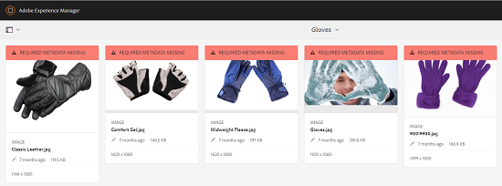

# 中繼資料結構描述 {#metadata-schemas}

| 版本 | 文章連結 |
| -------- | ---------------------------- |
| AEM as a Cloud Service  | [按一下這裡](https://experienceleague.adobe.com/docs/experience-manager-cloud-service/content/assets/manage/metadata-schemas.html?lang=en) |
| AEM 6.5 | 本文 |

組織提出了元資料模型，可增強資產探索、使用、互操作性等。 正確的中繼資料應用程式是維護中繼資料導向的工作流程和程式的神聖不可侵犯。 若要遵循整個組織的中繼資料策略和標準，您可以使用中繼資料結構，協助DAM使用者協調。 [!DNL Adobe Experience Manager] 可讓您以簡單而有彈性的方法建立、維護和套用中繼資料結構。

在 [!DNL Adobe Experience Manager Assets]，結構會包含特定欄位，以取得要填入的特定資訊。 它也包含版面資訊，以方便使用的方式顯示中繼資料欄位。 中繼資料屬性包括標題、說明、MIME類型、標籤等。 您可以使用 [!UICONTROL 中繼資料結構Forms] 編輯器來修改現有結構或新增自訂中繼資料結構。

若要檢視及編輯資產的屬性頁面，請執行下列步驟：

1. 按一下 **[!UICONTROL 檢視屬性]** 選項（位於「卡片」檢視中資產圖磚的快速動作）。 或者，選取資產，然後按一下 **[!UICONTROL 屬性]**  的上界。

1. 您可以在可用標籤下編輯各種可編輯的中繼資料屬性。 不過，您無法修改資產 [!UICONTROL 類型] 在 [!UICONTROL 基本] 頁簽。

   

   *圖：資產上的基本索引標籤 [!UICONTROL 屬性].*

   建立或編輯中繼資料結構時，請確定只有一個屬性對應至欄位。

   若要修改資產的MIME類型，請使用自訂中繼資料結構表單或修改現有表單。 請參閱 [編輯中繼資料結構Forms](#edit-metadata-schema-forms) 以取得更多資訊。 如果您修改MIME類型的中繼資料結構，則會修改資產和所有子類型的屬性頁面配置。 例如，修改下方的jpeg架構 `default/image` 只會修改MIME類型資產的中繼資料配置（資產屬性） `image/jpeg`. 不過，如果您編輯預設結構，您的變更會修改所有資產類型的中繼資料配置。

## 中繼資料結構表單 {#default-metadata-schema-forms}

若要檢視表單或範本清單，請在 [!DNL Experience Manager] 介面導覽至 **[!UICONTROL 工具]** > **[!UICONTROL 資產]** > **[!UICONTROL 中繼資料結構]**.

[!DNL Experience Manager] 提供下列中繼資料結構表單範本。

| 範本 |  | 說明 |
|---|---|---|
| [!UICONTROL 預設] |  | 資產的基本中繼資料結構表單。 |
|  | 以下子表單將繼承 [!UICONTROL 預設] 表單： |  |
|  | <ul><li>[!UICONTROL dm_video]</li></ul> | Dynamic Media影片的結構描述表單。 |
|  | <ul><li>[!UICONTROL 影像]</li></ul> | MIME類型的影像的架構表單，例如 `image/jpeg` 和 `image/png`.   此 [!UICONTROL 影像] 表單具有以下子表單模板： <ul><li> [!UICONTROL jpeg]:子類型資產的結構表單 [!UICONTROL jpeg].</li> <li>[!UICONTROL tiff]:具有子類型TIFF的資產的結構表單。</li></ul> |
|  | <ul><li>[!UICONTROL 應用程式]</li></ul> | MIME類型資產的結構表單，例如 `application/pdf` 和 `application/zip`.  [!UICONTROL pdf]:具有子類型PDF的資產的結構表單。 |
|  | <ul><li>[!UICONTROL 視訊]</li></ul> | MIME類型視訊資產的結構表單，例如 `video/avi` 和 `video/mp4`. |
| [!UICONTROL 集合] |  | 集合的結構描述表單。 |
| [!UICONTROL contentfragment] |  | [內容片段的結構描述表單](/help/sites-developing/customizing-content-fragments.md). |
| [!UICONTROL 表單] |  | 此結構表單與 [Adobe Experience Manager Forms](/help/forms/home.md). |
| [!UICONTROL ugc_contentfragment] |  | 使用者產生的內容片段和資產，從社交媒體整合至Experience Manager的結構表單。 |

>[!NOTE]
>
>要查看架構表單的子表單，請按一下架構表單名稱。

## 新增中繼資料結構表單 {#add-a-metadata-schema-form}

若要新增中繼資料結構表單，請執行下列步驟：

1. 若要將自訂範本新增至清單，請按一下 **[!UICONTROL 建立]** 的上界。

   >[!NOTE]
   >
   >未編輯的模板將顯示鎖定符號。 如果您自訂範本，則不會鎖定範本 .

1. 在對話方塊中，提供結構表單的標題，然後按一下 **[!UICONTROL 建立]** 以完成表單建立程式。

## 編輯中繼資料結構表單 {#edit-metadata-schema-forms}

您可以編輯新增或現有的中繼資料結構表單。 中繼資料結構表單包含索引標籤和索引標籤內的表單項目。 您可以將這些表單項目對應/設定至CRX存放庫中中繼資料節點內的欄位。 您可以將索引標籤或表單項目新增至中繼資料結構表單。 從父級派生的頁簽和表單項處於鎖定狀態。 不能在子級更改它們。

1. 在 [!UICONTROL 中繼資料結構Forms] 頁面，選擇表單並按一下 **[!UICONTROL 編輯]** 的下一頁。

1. 在 **[!UICONTROL 中繼資料結構表單編輯器]** 頁面，自訂中繼資料表單。 將所需元件從 **[!UICONTROL 建置表單]** 頁簽到其中一個頁簽。

1. 若要設定元件，請選取元件，並修改其屬性，位於 **[!UICONTROL 設定]** 標籤。

### 中的元件 [!UICONTROL 建置表單] 標籤 {#components-within-the-build-form-tab}

此 **[!UICONTROL 建置表單]** 索引標籤會列出您在架構表單中使用的表單項目。 此 **[!UICONTROL 設定]** 索引標籤提供您在 **[!UICONTROL 建置表單]** 標籤。 下表列出 **[!UICONTROL 建置表單]** 標籤：

| 元件名稱 | 說明 |
| -------------------------------- | ----------------------------------------------------------------------------------- |
| [!UICONTROL 區段標題] | 新增區段標題，以取得通用元件清單。 |
| [!UICONTROL 單行文字] | 新增單行文字屬性。 會儲存為字串。 |
| [!UICONTROL 多值文字] | 新增多值文字屬性。 會儲存為字串陣列。 |
| [!UICONTROL 數字] | 新增數字元件。 |
| [!UICONTROL 日期] | 新增日期元件。 |
| [!UICONTROL 下拉式] | 新增下拉式清單。 |
| [!UICONTROL 標準標記] | 新增標記. |
| [!UICONTROL 智慧標記] | 借由自動新增中繼資料標籤來增加搜尋功能。 |
| [!UICONTROL 隱藏欄位] | 新增隱藏欄位。 資產儲存時會以POST參數的形式傳送。 |
| [!UICONTROL 資產引用者] | 新增此元件以檢視資產參考的資產清單。 |
| [!UICONTROL 資產引用] | 新增以顯示參考資產的資產清單。 |
| [!UICONTROL 產品參考] | 新增以顯示與資產連結的產品清單。 |
| [!UICONTROL 資產評等] | 新增至顯示資產評等選項。 |
| [!UICONTROL 關聯式中繼資料] | 「新增」可控制資產屬性頁面中其他中繼資料索引標籤的顯示。 |

#### 編輯中繼資料元件 {#edit-the-metadata-component}

若要編輯表單上元資料元件的屬性，請按一下元件以編輯以下屬性的全部或子集，位於 **[!UICONTROL 設定]** 標籤。 建議您只將一個欄位對應至中繼資料結構中的指定屬性。 否則，系統會挑選對應至屬性的最新新增欄位。

**欄位標籤**:資產屬性頁面上顯示的中繼資料屬性名稱。

**對應至屬性**:此屬性會指定資產節點的相對路徑或名稱，資產節點儲存在CRX存放庫中。 開頭為 `./` 以指出路徑位於資產節點下。

以下是屬性有效值的範例：

* `./jcr:content/metadata/dc:title`:將值儲存在資產的中繼資料節點，做為屬性 `dc:title`。

* `./jcr:created`:儲存資產的建立日期和時間。 它是受保護的屬性。 如果配置了這些屬性，Adobe建議將它們標籤為「禁用編輯」。 否則，當您儲存資產的屬性時，會出現「資產無法修改」錯誤。

為確保元資料結構表單中正確顯示元件，屬性路徑不應包含任何空格。

* **預留位置**:使用此屬性可指定與中繼資料屬性相關的預留位置文字。
* **必填**:使用此屬性可在屬性頁面上將中繼資料屬性標示為必要屬性。
* **禁用編輯**:使用此屬性可禁止對屬性頁面上的屬性進行任何編輯。
* **以只讀方式顯示空欄位**:將此屬性標籤為在屬性頁面上顯示元資料屬性（即使它沒有值）。 預設情況下，當元資料屬性沒有值時，它不會列在屬性頁面上。
* **顯示已排序的清單**:使用此屬性可顯示選擇的有序清單。
* **選擇**:使用此屬性可指定清單中的選擇。
* **說明** :使用此屬性可為中繼資料元件新增簡短說明。
* **類別**:屬性關聯的對象類。
* **刪除**:按一下 [!UICONTROL 刪除] 從架構表單中刪除元件。

>[!NOTE]
>
>此 [!UICONTROL 隱藏欄位] 元件不包含這些屬性。 而是包含屬性，例如屬性名稱、值、欄位標籤和說明。 「隱藏欄位」元件的值在儲存資產時會以POST參數的形式傳送。 不會將其儲存為資產的中繼資料。

如果您選取「必 **[!UICONTROL 要]** 」選項，可以搜尋遺失必要中繼資料的資產。從「篩 **[!UICONTROL 選器]** 」面板中，展開「中繼資料 **[!UICONTROL 驗證謂語]** 」並選取「 **[!UICONTROL 無效]** 」選項。搜尋結果會顯示遺失您透過結構表單設定之必要中繼資料的資產。

如果您將內容中繼資料元件新增至任何結構表單的任何索引標籤，該元件會在套用特定結構的資產的屬性頁面中顯示為清單。 此清單包含除了您套用內容中繼資料元件的索引標籤以外的所有其他索引標籤。 目前，此功能提供基本功能，可根據內容控制中繼資料的顯示。

除了套用內容中繼資料元件的索引標籤之外，若要在屬性頁面中顯示任何索引標籤，請從清單中選取索引標籤。 索引標籤會新增至屬性頁面。

*圖：資產屬性頁面中的內容中繼資料。*

### 在JSON檔案中指定屬性 {#specify-properties-in-json-file}

您不必在「設定」標籤中指定選項的屬 **[!UICONTROL 性]** ，而是可以透過指定對應的索引鍵值配對，來定義JSON檔案中的選項。在「 **[!UICONTROL JSON路徑」欄位中指定JSON檔案的]** 路徑。

#### 在架構表單中新增或刪除索引標籤 {#adding-deleting-a-tab-in-the-schema-form}

架構編輯器可讓您新增或刪除標籤。預設架構表單包含 **[!UICONTROL 基本]**, **[!UICONTROL 進階]** , **[!UICONTROL IPTC]**，和 **[!UICONTROL IPTC擴展]** 頁簽。

按一下 `+` 在架構表單上添加頁簽。 依預設，新索引標籤的名稱為 `Unnamed-1`. 您可以從 **[!UICONTROL 設定]** 標籤。 按一下 `X` 刪除頁簽。

## 階層式中繼資料 {#cascading-metadata}

擷取資產的中繼資料資訊時，使用者會在各種可用欄位中提供資訊。 您可以顯示與在其他欄位中選取的選項相關的特定中繼資料欄位或欄位值。 這種元資料的條件顯示稱為級聯元資料。 換言之，您可以在特定中繼資料欄位/值與一或多個欄位及/或其值之間建立相依性。

使用中繼資料結構來定義顯示階層式中繼資料的規則。 例如，如果您的中繼資料結構包含資產類型欄位，您可以根據使用者選取的資產類型，定義要顯示的相關欄位集。

>[!CAUTION]
>
>內容片段不支援階層式中繼資料。

以下是您可以定義階層式中繼資料的一些使用案例：

* 如果需要使用者位置，請根據使用者的國家/地區和州選擇，顯示相關的城市名稱。
* 根據使用者對產品類別的選擇，將相關品牌名稱載入清單中。
* 根據在另一個欄位中指定的值，切換特定欄位的可見性。 例如，如果用戶希望將發運傳送到不同地址，則顯示單獨的發運地址欄位。
* 根據其他欄位中指定的值，將欄位指定為必填欄位。
* 根據在另一個欄位中指定的值，變更特定欄位所顯示的選項。
* 根據其他欄位中指定的值，在特定欄位中設定預設中繼資料值。

### 在中設定階層式中繼資料 [!DNL Experience Manager] {#configure-cascading-metadata-in-aem}

假設您要根據選取的資產類型顯示階層式中繼資料。 一些範例

* 對於視訊，顯示適用的欄位，例如格式、轉碼器、持續時間等。
* 對於Word或PDF文檔，顯示欄位，如頁數、作者等。

無論選擇的資產類型為何，都將版權資訊顯示為必填欄位。

1. 在 [!DNL Experience Manager] 介面，轉到 **[!UICONTROL 工具]** > **[!UICONTROL 資產]** > **[!UICONTROL 中繼資料結構]**.
1. 在 **[!UICONTROL 綱要Forms]** 頁，選擇方案表單，然後按一下 **[!UICONTROL 編輯]** 從工具列編輯架構。

   

1. （選用）在中繼資料結構編輯器中，建立新欄位以條件化。 在 **[!UICONTROL 設定]** 標籤。

   若要建立新索引標籤，請按一下 `+` 新增索引標籤，然後新增中繼資料欄位。

   

1. 為資產類型新增下拉式清單欄位。 在 **[!UICONTROL 設定]** 標籤。 新增選用說明。

   

1. 機碼值組是提供給表單使用者的選項。 您可以手動或從JSON檔案提供索引鍵值配對。

   * 若要手動指定值，請選取 **[!UICONTROL 手動新增]**，然後按一下 **[!UICONTROL 添加選擇]** 和指定選項文本和值。 例如，指定視訊、PDF、字詞和影像資產類型。

   * 若要動態從JSON檔案擷取值，請選取 **[!UICONTROL 透過JSON路徑新增]** 和提供JSON檔案的路徑。 [!DNL Experience Manager] 當表單顯示給使用者時，會即時擷取機碼值組。

   兩個選項互斥。 您無法從JSON檔案匯入選項並手動編輯。

   

   >[!NOTE]
   >
   >新增JSON檔案時，索引鍵值配對不會顯示在中繼資料結構編輯器中，但可在已發佈的表單中使用。

   >[!NOTE]
   >
   >新增選擇時，如果按一下「下拉式清單」欄位，介面會扭曲，且選擇的刪除選項會停止運作。 儲存變更前，請勿按一下下拉式清單。 如果您遇到此問題，請儲存結構並再次開啟以繼續編輯。

1. （選用）新增其他必填欄位。 例如，資產類型視訊的格式、編碼解碼器和持續時間。

   同樣地，為其他資產類型新增相依欄位。 例如，為檔案資產(例如PDF和Word檔案)新增欄位頁數和作者。

   

1. 要在資產類型欄位和其他欄位之間建立相關性，請選擇相依欄位並開啟 **[!UICONTROL 規則]** 標籤。

   

1. 在 **[!UICONTROL 需求]**，選擇 **[!UICONTROL 必要，根據新規則]** 選項。
1. 按一下 **[!UICONTROL 新增規則]** 並選擇 **[!UICONTROL 資產類型]** 欄位來建立相依性。 也選擇要在其上建立相關性的欄位值。在這種情況下，請選擇「 **[!UICONTROL 視訊」]**。按一下「**[!UICONTROL 完成]**」以儲存變更。

   

   >[!NOTE]
   >
   >含有手動預先定義值的下拉式清單可與規則搭配使用。 具有已設定JSON路徑的下拉式功能表無法搭配使用預先定義值來套用條件的規則使用。 如果值在執行階段從JSON載入，則無法套用預先定義的規則。

1. 在「可 **[!UICONTROL 見性]**」下，選擇「可 **[!UICONTROL 見」，根據新規則選項]** 。

1. 按一下 **[!UICONTROL 新增規則]** 並選擇 **[!UICONTROL 資產類型]** 欄位來建立相依性。 也選擇要在其上建立相關性的欄位值。在這種情況下，請選擇「 **[!UICONTROL 視訊」]**。按一下「**[!UICONTROL 完成]**」以儲存變更。

   

   >[!NOTE]
   >
   >按一下空白字元（或值以外的任何位置）會重設值。 如果發生此情況，請重新選取值。

   >[!NOTE]
   >
   >您可以套用 **[!UICONTROL 「需求]** 」條件 **[!UICONTROL 和「可見性]** 」條件，它們彼此獨立。

1. 同樣地，在「資產類型」欄位中的「視訊」值與其他欄位（例如「編碼解碼器」和「持續時間」）之間建立相依性。
1. 重複下列步驟，在 [!UICONTROL 資產類型] 欄位和欄位，例如 [!UICONTROL 頁數] 和 [!UICONTROL 作者].
1. 按一下「**[!UICONTROL 儲存]**」。將中繼資料結構套用至資料夾。

1. 導覽至您套用中繼資料結構的資料夾，然後開啟資產的屬性頁面。 視您在「資產類型」欄位中的選擇而定，會顯示相關的階層式中繼資料欄位。

   

   *圖：視訊的階層式中繼資料。*

   

   *圖：文檔的級聯元資料。*

## 刪除中繼資料結構表單 {#delete-metadata-schema-forms}

[!DNL Experience Manager] 可讓您僅刪除自訂結構描述表單。 它不會讓您刪除預設的結構描述表單/範本。 不過，您可以刪除這些表單中的任何自訂變更。

若要刪除表單，請選取表單並按一下刪除。

>[!NOTE]
>
>* 刪除預設表單的自訂變更後，鎖定  重新出現在表單之前。 它表示表單已還原為其預設狀態。
>* 您無法刪除中預設的中繼資料結構表單 [!DNL Assets].

## MIME類型的架構表單 {#schema-forms-for-mime-types}

[!DNL Experience Manager] 提供各種現成MIME類型的預設表單。 不過，您可以為各種MIME類型的資產新增自訂表單。

### 為MIME類型添加新表單 {#add-new-forms-for-mime-types}

在適當的表單類型下建立表單。 例如，若要為 `image/png` 子類型，在「影像」表單下建立表單。 方案表單的標題是子類型名稱。在此案例中，標題為 `png`.

#### 對各種MIME類型使用現有架構模板 {#use-an-existing-schema-template-for-various-mime-types}

您可以將現有範本用於不同的MIME類型。 例如，使用 `image/jpeg` MIME類型資產的表單 `image/png`.

在此情況下，請在 `/etc/dam/metadataeditor/mimetypemappings` 在CRX存放庫中。 指定節點的名稱並定義下列屬性：

| 名稱 | 說明 | 類型 | 值 |
|------|-------------|------|-------|
| `exposedmimetype` | 要映射的現有表單的名稱 | `String` | `image/jpeg` |
| `mimetypes` | 使用中定義之表單的MIME類型清單 `exposedmimetype` 屬性 | `String` | `image/png` |

[!DNL Assets] 映射以下MIME類型和架構表單：

| 結構表單 | MIME類型 |
|---|---|
| image/jpeg | image/pjpeg |
| image/tiff | 影像/x-tiff |
| application/pdf | application/postscript |
| application/x-ImageSet | Multipart/Related; type=application/x-ImageSet |
| application/x-SpinSet | Multipart/Related; type=application/x-SpinSet |
| application/x-MixedMediaSet | Multipart/Related; type=application/x-MixedMediaSet |
| video/quicktime | video/x-quicktime |
| 視頻/mpeg4 | video/mp4 |
| video/avi | video/avi, video/msvideo, video/x-msvideo |
| video/wmv | video/x-ms-wmv |
| video/flv | video/x-flv |

## 授予中繼資料結構的存取權 {#grant-access-to-metadata-schemas}

中繼資料結構功能僅供管理員使用。 不過，管理員可以修改某些權限，以提供對非管理員的存取權。 提供非管理員使用者建立、修改和刪除 `/conf` 檔案夾。

## 套用資料夾特定中繼資料 {#apply-folder-specific-metadata}

[!DNL Assets] 可讓您定義中繼資料結構的變體，並將其套用至特定資料夾。

例如，您可以定義預設中繼資料結構的變體，並將其套用至資料夾。 套用修改後的結構時，會覆寫套用至資料夾內資產的原始預設中繼資料結構。

只有上傳至套用此結構的資料夾的資產，才會符合變體中繼資料結構中定義的修改中繼資料。 [!DNL Assets] 在應用原始架構的其他資料夾中，繼續符合在原始架構中定義的元資料。

資產的中繼資料繼承是根據套用至階層中頂層資料夾的結構。 子資料夾會套用或繼承相同的架構。 如果在子資料夾層級套用不同架構，繼承就會停止。

1. 在 [!DNL Experience Manager] 介面，導覽至 **[!UICONTROL 工具]** > **[!UICONTROL 資產]** > **[!UICONTROL 中繼資料結構]**. 此時會顯示&#x200B;**[!UICONTROL 「中繼資料結構描述表單」]**&#x200B;頁面。
1. 選取表單前的核取方塊，例如預設中繼資料表單，然後按一下 **[!UICONTROL 複製]** 並儲存為自訂表單。 指定表單的自訂名稱，例如 `my_default`. 或者，您也可以建立自訂表單。

1. 在 **[!UICONTROL 中繼資料結構Forms]** 頁面，選擇 `my_default` 表單，然後按一下 **[!UICONTROL 編輯]**.

1. 在 **[!UICONTROL 中繼資料結構編輯器]** 頁面，將文本欄位添加到架構表單中。 例如，新增帶標籤的欄位 **[!UICONTROL 類別]**.

   

   *圖：已將文字欄位新增至中繼資料結構表單編輯器。*

1. 按一下「**[!UICONTROL 儲存]**」。修改後的表單會列在 **[!UICONTROL 中繼資料結構Forms]** 頁面。
1. 按一下 **[!UICONTROL 應用於資料夾]** ，將自訂中繼資料套用至資料夾。

1. 選擇要在其上應用修改的架構的資料夾，然後按一下 **[!UICONTROL 套用]**.

   

1. 如果資料夾已套用其他中繼資料結構，則會出現警告，指出您即將覆寫現有的中繼資料結構。 按一下 **覆寫**.
1. 按一下 **確定** 來關閉成功訊息。
1. 導覽至您套用已修改中繼資料結構的資料夾。

## 定義必要中繼資料 {#define-mandatory-metadata}

您可以在資料夾層級定義必填欄位，這會對上傳至資料夾的資產強制執行。 如果您上傳的資產上傳之前定義之必填欄位的中繼資料遺失，卡片檢視的資產上會顯示遺失中繼資料的視覺指示。

>[!NOTE]
>
>根據其他欄位的值，中繼資料欄位可定義為必填欄位。 在卡片檢視中， [!DNL Experience Manager] 不會顯示有關此類必要中繼資料欄位遺失中繼資料的警告訊息。

1. 在 [!DNL Experience Manager] 介面，導覽至 **[!UICONTROL 工具]** > **[!UICONTROL 資產]** > **[!UICONTROL 中繼資料結構]**. 此時會顯示&#x200B;**[!UICONTROL 「中繼資料結構描述表單」]**&#x200B;頁面。
1. 將預設中繼資料表單儲存為自訂表單。 例如，將其儲存為 `my_default`.

1. 編輯自訂表單。 新增必填欄位。 例如，新增 **[!UICONTROL 類別]** 欄位，並將欄位設為必填。

   

   *圖：中繼資料結構表單編輯器中的必填欄位。*

1. 按一下「**[!UICONTROL 儲存]**」。修改後的表單會列在 **[!UICONTROL 中繼資料結構Forms]** 頁面。 選取表單，然後按一下 **[!UICONTROL 應用於資料夾]** ，將自訂中繼資料套用至資料夾。

1. 導覽至資料夾，並上傳一些資產，其中遺失您新增至自訂表單之必填欄位的中繼資料。 資產的卡片檢視上會顯示必填欄位遺漏中繼資料的訊息。

   

1. （可選）存取 `https://[aem_server]:[port]/system/console/components/`. 配置和啟用 `com.day.cq.dam.core.impl.MissingMetadataNotificationJob` 預設停用的元件。 設定頻率， [!DNL Experience Manager] 檢查資產上中繼資料的有效性。 此設定會新增屬性 `hasValidMetadata` to `jcr:content` 資產。 [!DNL Experience Manager] 使用此屬性來篩選搜尋結果中的無效資產。 如果您在檢查後新增資產，系統不會將資產標示為 `hasValidMetadata` 直到下次排程的檢查。 因此，直到下次排程檢查後，資產才會出現在無效中繼資料的搜尋篩選器中。

   >[!CAUTION]
   >
   >中繼資料驗證檢查耗用大量資源，且可能會影響您的系統效能。 據此安排檢查。 如果伺服器無法處理負載，請嘗試禁用此作業。

<!-- TBD: Add this method to find invalid metadata in the metadata.md article later when it is published as a top-level metadata article.
-->
