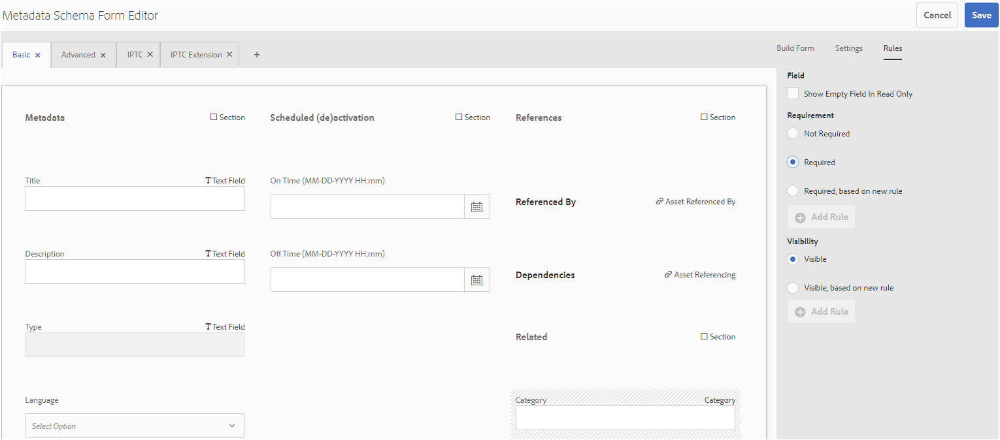

# Metadata schemas {#metadata-schemas}

企業組織會提供中繼資料模型，以增強資產發現、使用、互操作性等。 正確的中繼資料應用程式對於維護中繼資料導向的工作流程和程式而言是神聖不可侵犯的。 為符合整個組織的中繼資料策略和標準，您可以使用中繼資料結構，協助DAM使用者對齊。 [!DNL Adobe Experience Manager] 可讓您以簡單而有彈性的方式建立、維護和套用中繼資料結構。

在中， [!DNL Adobe Experience Manager Assets]結構包含要填充的特定資訊的特定欄位。 它也包含版面資訊，以方便使用者的方式顯示中繼資料欄位。 中繼資料屬性包括標題、說明、MIME類型、標籤等。 您可以使用中繼資  料結構表單編輯器來修改現有結構或新增自訂的中繼資料結構。

若要檢視和編輯資產的屬性頁面，請依照下列步驟進行：

1. 按一下資 **[!UICONTROL 產圖格中]** ，卡片檢視中「快速動作」的「檢視屬性」圖示。

   

   或者，選取資產，然後按一下工 [!UICONTROL 具列中的] 「屬性」圖示。

1. 您可以編輯可用標籤下的各種可編輯中繼資料屬性。 但是，您無法修改屬 [!UICONTROL 性頁面] 「基本  」索引標籤中的資產類型。

   

*圖： 資產屬性上的「基[!UICONTROL 本」標籤]。*

若要修改資產的MIME類型，請使用自訂中繼資料結構表單或修改現有表單。 如需詳 [細資訊，請參閱編輯中繼資料結構](/help/assets/metadata-schemas.md#edit-metadata-schema-forms) 表單。 如果您修改MIME類型的中繼資料結構，資產和所有子類型的屬性頁面配置都會被修改。 例如，在下修改jpeg架構時， `default/image` 僅會修改MIME類型資產的中繼資料配置（資產屬性） `image/jpeg`。 不過，如果您編輯預設結構，您的變更會修改所有類型資產的中繼資料配置。

## 中繼資料結構表單 {#default-metadata-schema-forms}

若要檢視表單或範本清單，請在介面中導 [!DNL Experience Manager] 覽至「工 **[!UICONTROL 具]** >資 **[!UICONTROL 產]** >中繼資 **[!UICONTROL 料結構]**」。

[!DNL Experience Manager] 提供了以下元資料架構表單模板。

| 範本 |  | 說明 |
|---|---|---|
| [!UICONTROL 預設] |  | 資產的基本中繼資料結構表單。 |
|  | 以下子表單繼承預設表單的 [!UICONTROL 屬性] : |  |
|  | [!UICONTROL 影像] | 具有MIME類型（如和）的映像的 `image/jpeg` 架構表 `image/png`單。   影 [!UICONTROL 像表單] 包含下列子表單範本： <ul><li> [!UICONTROL jpeg]: 子類型 [!UICONTROL jpeg資產的架構表單]。</li> <li>[!UICONTROL tiff]: 子類型為TIFF的資產的架構表單。</li></ul> |
|  | [!UICONTROL 應用程式] | 具有MIME類型（如和）的資產的 `application/pdf` 架構表 `application/zip`格。  [!UICONTROL pdf]: 子類型為PDF的資產的架構表單。 |
|  | [!UICONTROL 視訊] | 具有MIME類型（如和）的視訊資產的 `video/avi` 架構表 `video/mp4`格。 |
| [!UICONTROL 集合] |  | 系列的結構表單。 |
| [!UICONTROL contentfragment] |  | [內容片段的架構表單](/help/sites-developing/customizing-content-fragments.md)。 |
| [!UICONTROL 表單] |  | 此結構表單與 [Adobe Experience Manager Forms相關](/help/forms/home.md)。 |

<!-- 
TBD: Add dm_video child for the default form OOTB.
video doesn't contain any sub types as listed above OOTB.
application doesn't contain the sub type zip OOTB.
-->

>[!NOTE]
>
>要查看方案表單的子表單，請按一下方案表單名稱。

## 新增中繼資料結構表單 {#add-a-metadata-schema-form}

要添加元資料結構表單，請執行以下步驟：

1. 若要將自訂範本新增至清單，請按一下工 **[!UICONTROL 具列中的]** 「建立」。

   >[!NOTE]
   >
   >鎖定表徵圖與未編輯的模板一起顯示。 如果您自訂範本，則不會顯示鎖定圖示。

1. 在對話方塊中，提供架構表單的標題，然後按一下「 **[!UICONTROL 建立]** 」以完成表單建立程式。

## 編輯中繼資料結構表單 {#edit-metadata-schema-forms}

您可以編輯新增或現有的中繼資料結構表單。 中繼資料結構表單包含標籤和標籤內的表單項目。 您可以將這些表單項目映射／配置到CRX儲存庫中元資料節點中的欄位。 您可以將標籤或表單項目新增至中繼資料結構表單。 衍生自父項的制表符和表單項處於鎖定狀態。 您無法在子級更改它們。

1. 在「元數 [!UICONTROL 據結構表單] 」頁上，選擇一個表單，然後按一下工 **[!UICONTROL 具欄中的]** 編輯。

1. 在「元數 **[!UICONTROL 據結構表單編輯器」頁]** ，自定義元資料表單。 將所需的元件從「建 **[!UICONTROL 立表單]** 」標籤拖曳至其中一個標籤。

   

   *圖： 「元數[!UICONTROL 據結構表單編輯器」頁]，帶有可用頁籤。*

1. 要配置元件，請選擇該元件並在「設定」頁籤中修改 **[!UICONTROL 其屬]** 性。

### 「生成表單」選 [!UICONTROL 項卡中的組] 件 {#components-within-the-build-form-tab}

「建 **[!UICONTROL 立表單]** 」標籤會列出您在架構表單中使用的表單項目。 「設 **[!UICONTROL 定]** 」標籤提供您在「建置表單」標籤中選取之每 **[!UICONTROL 個項目的屬性]** 。 下表列出了「生成表單」頁籤中可 **[!UICONTROL 用的表單]** 項：

| 元件名稱 | 說明 |
| -------------------------------- | ----------------------------------------------------------------------------------- |
| [!UICONTROL 區段標題] | 新增共用元件清單的區段標題。 |
| [!UICONTROL 單行文字] | 新增單行文字屬性。 它儲存為字串。 |
| [!UICONTROL 多值文字] | 新增多值文字屬性。 它儲存為字串陣列。 |
| [!UICONTROL 數字] | 添加數字元件。 |
| [!UICONTROL 日期] | 新增日期元件。 |
| [!UICONTROL 下拉式] | 新增下拉式清單。 |
| [!UICONTROL 標準標記] | 新增標記. |
| [!UICONTROL 智慧標記] | 自動新增中繼資料標籤，以增強搜尋功能。 |
| [!UICONTROL 隱藏欄位] | 新增隱藏欄位。 儲存資產時，會以POST參數傳送。 |
| [!UICONTROL 資產引用者] | 新增此元件以檢視資產參考的資產清單。 |
| [!UICONTROL 資產引用] | 新增以顯示參考資產的資產清單。 |
| [!UICONTROL 產品參考] | 新增以顯示與資產連結的產品清單。 |
| [!UICONTROL 資產評等] | 新增至顯示選項，以評分資產。 |
| [!UICONTROL 關聯式中繼資料] | 新增以控制資產屬性頁面中其他中繼資料標籤的顯示。 |

#### 編輯中繼資料元件 {#edit-the-metadata-component}

要編輯表單上元資料元件的屬性，請按一下該元件以編輯「設定」頁籤中的以下全部或子 **[!UICONTROL 集]** 。

**欄位標籤**: 顯示在資產屬性頁面上的中繼資料屬性名稱。

**對應至屬性**: 此屬性指定資產節點的相對路徑或名稱，該資產節點保存在CRX儲存庫中。 它以開 `./` 頭表示路徑位於資產的節點下。

以下是此屬性的有效值：

* `./jcr:content/metadata/dc:title`:將值儲存在資產的中繼資料節點，做為屬性 `dc:title`。

* `./jcr:created`: 儲存資產的建立日期和時間。 它是受保護的屬性。 如果您設定這些屬性，Adobe建議您將其標示為「停用編輯」。

為確保元資料架構表單中的元件正確顯示，屬性路徑不應包含任何空格。

* **預留位置**: 使用此屬性可指定與中繼資料屬性相關的預留位置文字。
* **必要**: 使用此屬性可將中繼資料屬性標示為屬性頁面上的必要屬性。
* **停用編輯**: 使用此屬性可禁止對屬性頁面上的屬性進行任何編輯。
* **在唯讀中顯示空白欄位**: 標籤此屬性，即使其沒有值，也可在屬性頁面上顯示中繼資料屬性。 預設情況下，當中繼資料屬性沒有值時，該屬性不會列在屬性頁面上。
* **顯示順序清單**: 使用此屬性可顯示選擇的有序清單。
* **選擇**: 使用此屬性可指定清單中的選擇。
* **說明** : 使用此屬性可為中繼資料元件新增簡短說明。
* **類別**: 屬性與關聯的對象類。
* **刪除**: 按一下 [!UICONTROL 刪除] ，從架構表單中刪除元件。

>[!NOTE]
>
>「隱 [!UICONTROL 藏欄位] 」元件不包含這些屬性。 而是包含屬性，例如屬性名稱、值、欄位標籤和說明。 每當儲存資產時，「隱藏欄位」元件的值都會以POST參數傳送。 它不會儲存為資產的中繼資料。

如果您選取「必 **[!UICONTROL 要]** 」選項，可以搜尋遺失必要中繼資料的資產。從「篩 **[!UICONTROL 選器]** 」面板中，展開「中繼資料 **[!UICONTROL 驗證謂語]** 」並選取「 **[!UICONTROL 無效]** 」選項。搜尋結果會顯示遺失您透過結構表單設定之必要中繼資料的資產。

如果將上下文元資料元件添加到任何方案表單的任何頁籤，則該元件將作為清單顯示在應用特定方案的資產的屬性頁中。 該清單包括除應用上下文元資料元件的頁籤之外的所有其他頁籤。 目前，此功能提供基本功能，可根據內容控制中繼資料的顯示。

要顯示屬性頁面中除了應用上下文元資料元件的頁籤之外的任何頁籤，請從清單中選擇該頁籤。 該頁籤將添加到屬性頁。

*圖： 資產屬性頁面中的內容相關中繼資料。*

### 在JSON檔案中指定屬性 {#specify-properties-in-json-file}

您不必在「設定」標籤中指定選項的屬 **[!UICONTROL 性]** ，而是可以透過指定對應的索引鍵值配對，來定義JSON檔案中的選項。在「 **[!UICONTROL JSON路徑」欄位中指定JSON檔案的]** 路徑。

#### 在架構表單中添加或刪除頁籤 {#adding-deleting-a-tab-in-the-schema-form}

架構編輯器可讓您新增或刪除標籤。The default schema form includes the **[!UICONTROL Basic]**, **[!UICONTROL Advanced]** , **[!UICONTROL IPTC]**, and **[!UICONTROL IPTC Extension]** tabs.

單 `+` 擊可在架構表單上添加頁籤。 依預設，新標籤的名稱為 `Unnamed-1`。 您可以從「設定」索引標籤修 **[!UICONTROL 改名稱]** 。

按一 `X` 下以刪除標籤。

## 刪除中繼資料結構表單 {#delete-metadata-schema-forms}

[!DNL Experience Manager] 可讓您僅刪除自訂結構描述表單。 它不允許您刪除預設模式表單／模板。 不過，您可以刪除這些表單中的任何自訂變更。

要刪除表單，請選擇一個表單並按一下刪除。

>[!NOTE]
>
>* 刪除對預設表單的自定義更改後，鎖定表徵圖將重新顯示在元資料架構介面上。 它表示表單已回復為預設狀態。
>* 您無法刪除中的預設元資料架構表 [!DNL Assets]單。

## MIME類型的架構表單 {#schema-forms-for-mime-types}

[!DNL Experience Manager] 為各種現成可用的MIME類型提供預設表單。 不過，您可以為各種MIME類型的資產新增自訂表格。

### 為MIME類型添加新表單 {#add-new-forms-for-mime-types}

在適當的表單類型下建立表單。 For example, to add a template for the `image/png` subtype, create the form under the &quot;image&quot; forms. 方案表單的標題是子類型名稱。In this case, the title is `png`.

#### 對各種MIME類型使用現有的架構模板 {#use-an-existing-schema-template-for-various-mime-types}

您可以針對不同的MIME類型使用現有範本。 例如，使用MIME `image/jpeg` 類型資產的表單 `image/png`。

在這種情況下，請在CRX儲存庫 `/etc/dam/metadataeditor/mimetypemappings` 中建立節點。 指定節點的名稱並定義以下屬性：

| 名稱 | 說明 | 類型 | 值 |
|------|-------------|------|-------|
| `exposedmimetype` | 要映射的現有表單的名稱 | `String` | `image/jpeg` |
| `mimetypes` | 使用屬性中定義的表單的MIME類型列 `exposedmimetype` 表 | `String` | `image/png` |

[!DNL Assets] 映射以下MIME類型和模式表單：

| 架構表單 | MIME類型 |
| --------------------------- | --------------------------------------------------- |
| image/jpeg | image/pjpeg |
| image/tiff | image/x-tiff |
| application/pdf | application/postscript |
| application/x-ImageSet | Multipart/Related; type=application/x-ImageSet |
| application/x-SpinSet | Multipart/Related; type=application/x-SpinSet |
| application/x-MixedMediaSet | Multipart/Related; type=application/x-MixedMediaSet |
| video/quicktime | video/x-quicktime |
| video/mpeg4 | video/mp4 |
| video/avi | 視訊/avi，視訊/msvideo，視訊/x-msvideo |
| video/wmv | video/x-ms-wmv |
| 視訊/flv | video/x-flv |

## 授予對中繼資料結構的存取權 {#grant-access-to-metadata-schemas}

「中繼資料結構」功能僅供管理員使用。 不過，管理員可修改某些權限，以提供非管理員的存取權。 提供非管理員使用者對資料夾建立、修改和刪除權 `/conf` 限。

## 套用資料夾特定的中繼資料 {#apply-folder-specific-metadata}

[!DNL Assets] 可讓您定義中繼資料結構的變體，並將其套用至特定資料夾。

例如，您可以定義預設中繼資料結構的變體，並將其套用至資料夾。 當您套用已修改的架構時，它會覆寫套用至資料夾內資產的原始預設中繼資料架構。

只有上傳至套用此架構的資料夾的資產，才符合變型中繼資料架構中定義的已修改中繼資料。 [!DNL Assets] 在應用原始模式的其他資料夾中，繼續與原始模式中定義的元資料保持一致。

資產的中繼資料繼承是根據套用至階層中第一層資料夾的架構。 換言之，如果資料夾不包含子檔案夾，資料夾內的資產會繼承套用至資料夾之結構的中繼資料。

您可以在子資料夾中應用不同的方案。 子資料夾內的資產繼承直接子資料夾的元資料結構。 如果子資料夾級別未應用方案或相同方案，則其資產會從父資料夾繼承方案。

1. 在介 [!DNL Experience Manager] 面中，導覽至「工 **[!UICONTROL 具]** >資 **[!UICONTROL 產]** >中 **[!UICONTROL 繼資料結構]**」。 此時會顯示&#x200B;**[!UICONTROL 「中繼資料結構描述表單」]**&#x200B;頁面。
1. 選取表單前的核取方塊，例如預設中繼資料表單，然後按一下「復 **[!UICONTROL 制]** 」並儲存為自訂表單。 例如，指定表單的自訂名稱 `my_default`。 或者，您也可以建立自訂表格。

1. 在「元數 **[!UICONTROL 據結構表單]** 」頁中，選擇 `my_default` 表單，然後按一下 **[!UICONTROL 編輯]**。

1. 在「元數 **[!UICONTROL 據結構編輯器]** 」頁中，將文本欄位添加到結構表單中。 例如，新增標籤為「類別」的 **[!UICONTROL 欄位]**。

   

   *圖： 已新增文字欄位至中繼資料結構表單編輯器。*

1. 按一下&#x200B;**[!UICONTROL 「儲存」]**。已修改的表單列在「元資料結構表 **[!UICONTROL 單」頁中]** 。
1. 按一 **[!UICONTROL 下工具列中的「套用至資料夾」]** ，將自訂中繼資料套用至資料夾。

1. 選擇要在其上應用已修改方案的資料夾，然後按一下應 **[!UICONTROL 用]**。

   

1. 如果資料夾已套用其他中繼資料結構，會出現警告訊息，指出您即將覆寫現有的中繼資料結構。 按一 **下覆寫**。
1. 按一 **下「確定** 」以關閉成功訊息。
1. 導覽至您套用已修改中繼資料結構的資料夾。

## 定義必備中繼資料 {#define-mandatory-metadata}

您可以在資料夾層級定義必要欄位，並強制執行在上傳至資料夾的資產上。 如果您上傳資產時，先前定義的必填欄位會遺失中繼資料，則卡片檢視中的資產上會顯示遺失中繼資料的視覺指示。

>[!NOTE]
>
>中繼資料欄位可根據其他欄位的值，定義為必填欄位。 在卡片檢視中，不 [!DNL Experience Manager] 會針對此類強制中繼資料欄位顯示遺失中繼資料的警告訊息。

1. 在介 [!DNL Experience Manager] 面中，導覽至「工 **[!UICONTROL 具]** >資 **[!UICONTROL 產]** >中 **[!UICONTROL 繼資料結構]**」。 此時會顯示&#x200B;**[!UICONTROL 「中繼資料結構描述表單」]**&#x200B;頁面。
1. 將預設中繼資料表單儲存為自訂表單。 例如，將它另存為 `my_default`。

1. 編輯自訂表格。 新增必填欄位。 例如，新增「類 **[!UICONTROL 別」欄位]** ，並將欄位設為必填。

   

   *圖： 中繼資料結構表單編輯器中的必填欄位。*

1. 按一下&#x200B;**[!UICONTROL 「儲存」]**。已修改的表單列在「元資料結構表 **[!UICONTROL 單」頁中]** 。 選取表單，然後按一 **[!UICONTROL 下工具列中的「套用至資料夾」]** ，將自訂中繼資料套用至資料夾。

1. 導覽至資料夾，並上傳您新增至自訂表單之必填欄位中遺失中繼資料的部分資產。 在資產的卡片檢視中，會顯示必要欄位遺失中繼資料的訊息。

   

1. （可選）存取 `https://[aem_server]:[port]/system/console/components/`。 配置並啟 `com.day.cq.dam.core.impl.MissingMetadataNotificationJob` 用預設禁用的元件。 設定檢查資產上 [!DNL Experience Manager] 中繼資料有效性的頻率。 此設定會將屬性新 `hasValidMetadata` 增至 `jcr:content` 資產。 [!DNL Experience Manager] 使用此屬性來篩選搜尋結果中的無效資產。 如果您在勾選後新增資產，則資產會在下次排程的勾選前 `hasValidMetadata` 才加上標幟。 因此，資產不會出現在搜尋篩選器中，搜尋無效中繼資料，直到下次排程檢查之後。

   >[!CAUTION]
   >
   >中繼資料驗證檢查需要耗費大量資源，而且可能會影響您系統的效能。 相應地安排檢查。 如果伺服器無法處理負載，請嘗試禁用此作業。

<!-- TBD: Add this method to find invalid metadata in the metadata.md article later when it is published as a top-level metadata article.
-->
