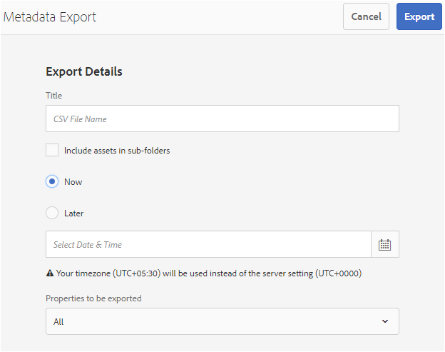

# 管理數字資產的元資料 {#managing-metadata-for-digital-assets}

| 版本 | 文章連結 |
| -------- | ---------------------------- |
| AEM as a Cloud Service  | [按一下這裡](https://experienceleague.adobe.com/docs/experience-manager-cloud-service/content/assets/manage/manage-metadata.html?lang=en) |
| AEM 6.5 | 本文 |

<!-- Scope of metadata articles:
* metadata.md: The scope of this article is basic metadata updates, changes, etc. operations that end-users can do.
* metadata-concepts.md: All conceptual information. Minor instructions are OK but it is an FYI article about support and standards.
* metadata-config.md: New article. Contains all configuration and administration how-to info related to metadata of assets.
-->

[!DNL Adobe Experience Manager Assets] 保留每個資產的元資料。 它使資產的分類和組織變得更容易，並幫助尋找特定資產的人。 能夠從上載到的檔案中提取元資料 [!DNL Experience Manager Assets]元資料管理與創意工作流整合。 通過能夠保留和管理與資產相關的元資料，您可以根據資產的元資料自動組織和處理資產。

## 元資料及其來源 {#how-to-edit-or-add-metadata}

元資料是可搜索的資產的其他資訊。 它被添加到資產和 [!DNL Experience Manager] 在您上載資產時將處理它。 您可以編輯現有元資料，將新元資料屬性添加到現有欄位。 組織需要受控且可靠的元資料辭彙。 因此 [!DNL Experience Manager Assets] 不允許按需添加新元資料屬性。 只有管理員和開發人員才能添加新的屬性或包含元資料的欄位。 用戶可以用元資料填充現有欄位。

以下方法可用於向數字資產添加元資料：

* 首先，建立資產的本機應用程式會向其添加一些元資料。 比如說， [Acrobat添加了一些元資料](https://helpx.adobe.com/acrobat/using/pdf-properties-metadata.html) PDF檔案或相機會向照片添加一些基本元資料。 在生成資產時，可以在本機應用程式本身中添加元資料。 例如， [在Adobe Lightroom添加IPTC元資料](https://helpx.adobe.com/lightroom-classic/help/metadata-basics-actions.html)。

* 將資產上載到 [!DNL Experience Manager]，可以使用用於建立資產的本機應用程式或使用其他元資料編輯應用程式來編輯和修改元資料。 將資產上載到Experience Manager時，將處理元資料。 例如，請參見如何 [使用元資料 [!DNL Adobe Bridge]](https://helpx.adobe.com/bridge/user-guide.html/bridge/using/metadata-adobe-bridge.ug.html) 看 [標籤面板 [!DNL Adobe Bridge]](https://exchange.adobe.com/creativecloud.details.20009.aem-tags-panel-for-bridge-cc.html) 在 [!DNL Adobe Exchange]。

* 在 [!DNL Experience Manager Assets]，可以手動添加或編輯 [!UICONTROL 屬性] 的子菜單。

* 你可以利用 [元資料配置檔案](/help/assets/metadata-config.md#metadata-profiles) 功能 [!DNL Experience Manager Assets] 以在資產上載到DAM時自動添加元資料。

## 在中添加或編輯元資料 [!DNL Experience Manager Assets] {#add-edit-metadata}

在中編輯資產的元資料 [!DNL Assets] 用戶介面，請執行以下步驟：

1. 執行下列任一項作業：

   * 從 [!DNL Assets] 介面，選擇資產，然後按一下 **[!UICONTROL 查看屬性]** 的子菜單。
   * 從資產縮略圖中，選擇 **[!UICONTROL 查看屬性]** 快速操作。
   * 在資產頁面中，按一下 **[!UICONTROL 查看屬性]**  的子菜單。

   資產頁顯示資產的所有元資料。 當將資產上載（接收）到 [!DNL Experience Manager]。

   

   *圖：編輯或添加資產上的元資料 [!UICONTROL 屬性] 的子菜單。*

1. 根據需要對各頁籤下的元資料進行編輯，完成後按一下 **[!UICONTROL 保存]** 的子菜單。 按一下 **[!UICONTROL 關閉]** 返回 [!DNL Assets] Web介面。

   >[!NOTE]
   >
   >如果文本欄位為空，則不存在現有元資料集。 您可以在欄位中輸入一個值並保存該值以添加該元資料屬性。

對資產元資料的任何更改都作為其資料的一部分寫回原始二進位XMP檔案。 元資料回寫工作流將元資料添加到原始二進位檔案中。 對現有物業(如 `dc:title`)和新屬性(包括自定義屬性，如 `cq:tags`)。

支XMP持並啟用了中所述的平台和檔案格式 [技術要求。](/help/sites-deploying/technical-requirements.md)

## 編輯多個資產的元資料屬性 {#editing-metadata-properties-of-multiple-assets}

[!DNL Adobe Enterprise Manager Assets] 允許您同時編輯多個資產的元資料，以便可以將公共元資料更改快速批量傳播到資產。 您也可以批量編輯多個集合的元資料。 使用「屬性」頁可以對多個資產或集合執行元資料更改：

* 將元資料屬性更改為公用值
* 添加或修改標籤

要自定義元資料屬性頁，包括添加、修改、刪除元資料屬性，請使用 [架構編輯器](metadata-config.md#folder-metadata-schema)。

>[!NOTE]
>
>批量編輯方法適用於資料夾或集合中的可用資產。 對於跨資料夾可用或符合通用標準的資產， [搜索後批量更新元資料](search-assets.md#metadataupdates)。

1. 在 [!DNL Assets] 用戶介面，導航到要編輯的資產的位置。
1. 選擇要編輯其公用屬性的資產。
1. 在工具欄中，按一下 **[!UICONTROL 屬性]** 開啟選定資產的屬性頁。
1. 修改各頁籤下選定資產的元資料屬性。
1. 要查看特定資產的元資料，請取消選擇清單中剩餘的資產。 如果取消選擇 [!UICONTROL 屬性] 頁面中，不更新此類資產的元資料。
1. 要為資產選擇其他元資料架構，請按一下 **[!UICONTROL 設定]** ，然後選擇一個架構。 按一下&#x200B;**[!UICONTROL 「儲存並關閉」]**。
1. 若要在包含多個值的欄位中，將新中繼資料與現有中繼資料一起附加，請選取「附 **[!UICONTROL 加模式」]**。如果您未選取此選項，新的中繼資料會取代欄位中現有的中繼資料。按一下 **[!UICONTROL 提交]**。

>[!CAUTION]
>
>對於單值欄位，即使您選擇「附加模式」，新元資料也不會附加到欄位中的現 **[!UICONTROL 有值]**。

## 導入元資料 {#import-metadata}

[!DNL Assets] 允許您使用CSV檔案批量導入資產元資料。 您可以通過導入CSV檔案為最近上載的資產或現有資產進行批量更新。 您還可以以CSV格式從第三方系統批量接收資產元資料。

元資料導入是非同步的，不會影響系統效能。 如果選中了工作流標誌，則由於寫回活動，因XMP此同時更新多個資產的元資料可能會佔用大量資源。 在精益伺服器使用期間計畫此類導入，以便不影響其他用戶的效能。

>[!NOTE]
>
>要在自定義命名空間上導入元資料，請首先註冊命名空間。

1. 導航到 [!DNL Assets] 用戶介面，然後按一下 **[!UICONTROL 建立]** 的子菜單。
1. 從菜單中，選擇 **[!UICONTROL 元資料]**。
1. 在 **[!UICONTROL 元資料導入]** 的 **[!UICONTROL 選擇檔案]**。 選取包含中繼資料的CSV檔案。
1. 指定以下參數。 請參閱CSV檔案示例 [元資料 — 導入 — sample-file.csv](/help/assets/assets/metadata-import-sample-file.csv)。

   | 元資料導入參數 | 說明 |
   |:---|:---|
   | [!UICONTROL 批次大小] | 要為其導入元資料的批中的資產數。 預設值為 50。最大值為100。 |
   | [!UICONTROL 欄位分隔符號] | 預設值為 `,` （逗號）。 可以指定任何其他字元。 |
   | [!UICONTROL 多值分隔符號] | 元資料值的分隔符。 預設值為 `|`. |
   | [!UICONTROL 啟動工作流程] | 預設為False。 設定為時 `true` 預設設定對 [!UICONTROL DAM元資料回寫] 工作流(將元資料寫入二進位XMP資料)。 啟用工作流會降低系統的速度。 |
   | [!UICONTROL 資產路徑欄名稱] | 定義帶資產的CSV檔案的列名。 |

1. 按一下 **[!UICONTROL 導入]** 的子菜單。 導入元資料後，將在中顯示通知 [!UICONTROL 通知] 收件箱。

1. 要驗證導入是否正確，請導航到資產 [!UICONTROL 屬性] 並驗證欄位中的值。

要在導入元資料時添加日期和時間戳，請使用 `YYYY-MM-DDThh:mm:ss.fff-00:00` 的子菜單。 日期和時間以 `T`。 `hh` 是24小時制， `fff` 是納秒 `-00:00` 是時區偏移。 比如說， `2020-03-26T11:26:00.000-07:00` 是2020年3月26日:26:太平洋標準時間上午00時。

>[!CAUTION]
>
>如果日期格式不匹配 `YYYY-MM-DDThh:mm:ss.fff-00:00`，未設定日期值。 導出的元資料CSV檔案的日期格式為 `YYYY-MM-DDThh:mm:ss-00:00`。 如果要導入它，請通過添加由表示的納秒值將其轉換為可接受的格式 `fff`。

## 導出元資料 {#export-metadata}

可以以CSV格式導出多個資產的元資料。 元資料是非同步導出的，不會影響系統效能。 要導出元資料， [!DNL Experience Manager] 遍歷資產節點的屬性 `jcr:content/metadata` 以及其子節點，並將元資料屬性導出到CSV檔案中。

批量導出元資料的幾個使用案例包括：

* 遷移資產時，在第三方系統中導入元資料。
* 與更廣泛的項目團隊共用資產元資料。
* Test或審核元資料以實現法規遵從性。
* 將元資料外部化以將其單獨本地化。

1. 選擇包含要導出元資料的資產的資產資料夾。 在工具欄中，選擇 **[!UICONTROL 導出元資料]**。

1. 在 [!UICONTROL 元資料導出] 對話框，指定CSV檔案的名稱。 要導出子資料夾中資產的元資料，請選擇 **[!UICONTROL 在子資料夾中包括資產]**。

   

1. 選擇所需選項。 提供檔案名和必要時的日期。

1. 在 **[!UICONTROL 要導出的屬性]** 欄位，指定是要導出所有屬性還是要導出特定屬性。 如果選擇要導出的「選擇性屬性」，請添加所需的屬性。

1. 在工具欄中，按一下 **[!UICONTROL 導出]**。 消息確認元資料已導出。 關閉消息。

1. 開啟導出作業的收件箱通知。選擇作業，然後從工具 **[!UICONTROL 欄中]** ，按一下「開啟」。要下載包含元資料的CSV檔案，請按一下 **[!UICONTROL CSV下載]** 的子菜單。 按一下&#x200B;**[!UICONTROL 關閉]**。

   

   *圖：對話框，用於下載包含批量導出的元資料的CSV檔案。*

## 編輯集合的元資料 {#collections-metadata}

有關詳細資訊，請參閱 [查看和編輯收集元資料](/help/assets/manage-collections.md#view-edit-collection-metadata) 和 [批量編輯多個集合的元資料](/help/assets/manage-collections.md#editing-collection-metadata-in-bulk)。

## 將元資料配置檔案應用於資料夾 {#applying-a-metadata-profile-to-folders}

<!-- TBD: Review this overview.
-->

將元資料配置檔案分配給資料夾時，任何子資料夾都會自動從其父資料夾繼承該配置檔案。 這意味著您只能將一個元資料配置檔案分配給資料夾。 因此，請仔細考慮上載、儲存、使用和存檔資產所在的資料夾結構。

如果為資料夾分配了不同的元資料配置檔案，則新配置檔案將覆蓋以前的配置檔案。 以前現有的資料夾資產保持不變。 新配置檔案將應用於稍後添加到資料夾的資產。

在用戶介面中，將分配了配置檔案的資料夾以卡名稱中顯示的配置檔案的名稱來表示。

您可以將元資料配置檔案應用於特定資料夾或全局應用於所有資產。

您可以在資料夾中重新處理資產，該資料夾中已有您稍後更改的現有元資料配置檔案。 請參閱 [在編輯資料夾的處理配置檔案後重新處理資料夾中的資產](processing-profiles.md#reprocessing-assets)。

您可以從「工具」菜單或者在資料夾內的「屬性」中，將元資料配置檔案應 **[!UICONTROL 用到資料夾]******。本節說明如何以兩種方式將中繼資料描述檔套用至資料夾。

已為其分配配置檔案的資料夾將通過資料夾名稱正下方的配置檔案名稱顯示來指示。

您可以重新處理資料夾中的資產，該資料夾中已有您稍後更改的現有視頻配置檔案。 請參閱 [在編輯資料夾的處理配置檔案後重新處理資料夾中的資產](processing-profiles.md#reprocessing-assets)。

### 將元資料配置檔案應用到資料夾 [!UICONTROL 配置檔案] 用戶介面 {#applying-metadata-profiles-to-folders-from-profiles-user-interface}

按照以下步驟應用元資料配置檔案：

1. 按一下 [!DNL Experience Manager] 徽標並導航 **[!UICONTROL 工具]** > **[!UICONTROL 資產]** > **[!UICONTROL 元資料配置檔案]**。
1. 選擇要應用於資料夾或多個資料夾的元資料配置檔案。
1. 按一下 **[!UICONTROL 將元資料配置檔案應用於資料夾]** 並選擇要用於接收新上載資產的資料夾或多個資料夾，然後按一下 **[!UICONTROL 完成]**。 已為其分配配置檔案的資料夾將通過資料夾名稱正下方的配置檔案名稱顯示來指示。

### 將元資料配置檔案應用到資料夾 [!UICONTROL 屬性] {#applying-metadata-profiles-to-folders-from-properties}

1. 在左滑軌中，按一下 **[!UICONTROL 資產]** 然後導航到要應用元資料配置檔案的資料夾。
1. 在資料夾上，按一下複選標籤以選擇它，然後按一下 **[!UICONTROL 屬性]**。

1. 選擇 **[!UICONTROL 元資料配置檔案]** 頁籤，然後從彈出式菜單中選擇配置檔案並按一下 **[!UICONTROL 保存]**。

已為其分配配置檔案的資料夾將通過資料夾名稱正下方的配置檔案名稱顯示來指示。

<!-- TBD: Commenting as the topic in metadata-config.md is incomplete.

### Apply metadata profile globally {#metadata-profile-global}

For details, see [configuration to apply metadata profile globally](/help/assets/metadata-config.md#apply-a-metadata-profile-globally). -->

### 從資料夾中刪除元資料配置檔案 {#removing-a-metadata-profile-from-folders}

從資料夾中刪除元資料配置檔案時，任何子資料夾都會自動從其父資料夾中繼承刪除配置檔案。 但是，對資料夾中已發生的檔案的任何處理都保持不變。

可以從資料夾中刪除元資料配置檔案 **[!UICONTROL 工具]** 的子菜單。 **[!UICONTROL 屬性]** 的下界。

#### 通過配置檔案用戶介面從資料夾中刪除元資料配置檔案 {#removing-metadata-profiles-from-folders-via-profiles-user-interface}

1. 按一下 [!DNL Experience Manager] 徽標並導航 **[!UICONTROL 工具]** > **[!UICONTROL 資產]** > **[!UICONTROL 元資料配置檔案]**。
1. 選擇要從資料夾或多個資料夾中刪除的元資料配置檔案。
1. 按一下 **[!UICONTROL 從資料夾中刪除元資料配置檔案]** 並選擇要用於從中刪除配置檔案的資料夾或多個資料夾，然後按一下 **[!UICONTROL 完成]**。

   您可以確認元資料配置檔案不再應用於資料夾，因為該名稱不再顯示在資料夾名稱下方。

#### 通過屬性從資料夾中刪除元資料配置檔案 {#removing-metadata-profiles-from-folders-via-properties}

1. 按一下 [!DNL Experience Manager] 徽標和導航 **[!UICONTROL 資產]** 然後轉到要從中刪除元資料配置檔案的資料夾。
1. 在資料夾上，按一下複選標籤以選擇它，然後按一下 **[!UICONTROL 屬性]**。
1. 選擇「元 **[!UICONTROL 資料描述檔]** 」標籤，然後從下拉式選單中選 **[!UICONTROL 擇「無]** 」，然後按一下「 **[!UICONTROL 儲存]**」。已為其分配配置檔案的資料夾將通過資料夾名稱正下方的配置檔案名稱顯示來指示。

## 提示和限制 {#best-practices-limitations}

* 通過用戶介面的元資料更新更改了 `dc` 命名空間。 通過HTTP API進行的任何更新都會更改 `jcr` 命名空間。 請參閱 [如何使用HTTP API更新元資料](/help/assets/mac-api-assets.md#update-asset-metadata)。

* 用於導入資產元資料的CSV檔案的格式非常特定。 為節省工作和時間並避免意外錯誤，可以開始使用導出的CSV檔案格式建立CSV。

* 使用CSV檔案導入元資料時，所需的日期日期格式為 `YYYY-MM-DDThh:mm:ss.fff-00:00`。 如果使用任何其他格式，則不設定日期值。 導出的元資料CSV檔案的日期格式為 `YYYY-MM-DDThh:mm:ss-00:00`。 如果要導入它，請通過添加由表示的納秒值將其轉換為可接受的格式 `fff`。

>[!MORELIKETHIS]
>
>* [元資料概念和理解](metadata-concepts.md)。
>* [編輯多個集合的元資料屬性](manage-collections.md#editing-collection-metadata-in-bulk)
>* [元資料在Experience Manager Assets的導入和導出](https://experienceleague.adobe.com/docs/experience-manager-learn/assets/metadata/metadata-import-feature-video-use.html)

<!-- TBD: Try filling the available information in these topics to the extent possible. As and when complete, publish the sections live.

## Where to find metadata of an asset or folder {#find-metadata}

What all methods to access asset Properties. More Details option in column view. Select asset and click Properties. Keyboard shortcut `p`. What else?

## Understand metadata handling in Experience Manager {#metadata-possibilities-with-aem}

Describe the journey of an assets' metadata. What all happens to metadata when an asset is added to Experience Manager.

## Add metadata to your digital assets {#add-metadata}

* To begin with, assets come with some metadata. The applications that create digital assets add some metadata to the assets created. Before uploading an asset to Experience Manager, you can edit and modify metadata using either the native application used to create an asset or using some other metadata editing application. When you upload an asset to Experience Manager, the metadata is processed.

* Link to PS, ID, AI, PDF, etc. metadata-related help articles.

* Link to XMP writeback.

* Manually add (or edit) metadata in AEM in Properties page.

* Metadata profiles

* Any workflows related to metadata?

* Advanced topic: Add, edit, modify, process and writeback metadata of subassets.

## Metadata of assets, folders, and collections {#metadata-of-assets-folders-collections}

Similarities and differences between metadata of asset and folder. 

Link to metadata handling of collections.

## Modify metadata of an asset, folder, or collection {#modify-metadata}

* While creating assets: Native application.

* Before ingesting assets: Metadata editors

* After ingesting assets: Properties of an asset, folder, collection, etc.

* Any supported programmatic method to bulk edit metadata directly in JCR?

## Modify metadata in bulk {#modify-metadata-in-bulk}

[!DNL Adobe Enterprise Manager Assets] lets you edit the metadata of multiple assets simultaneously so you can quickly propagate common metadata changes to assets in bulk. You can also edit the metadata for multiple collections in bulk.

Use the properties page to perform metadata changes on multiple assets or collections:

* Change metadata properties to a common value

* Add or modify tags

To customize the metadata properties page, including adding, modifying, deleting metadata properties, use the schema editor.

>[!NOTE]
>
>The bulk editing methods work for assets available in a folder or a collection. For the assets that are available across folders or match a common criteria, it is possible to [bulk update the metadata after searching](search-assets.md#metadataupdates).

1. In the [!DNL Assets] user interface, navigate to the location of the assets you want to edit.
1. Select the assets for which you want to edit common properties.
1. From the toolbar, click **[!UICONTROL Properties]** to open the properties page for the selected assets.

   >[!NOTE]
   >
   >When you select multiple assets, the lowest common parent form is selected for the assets. In other words, the properties page only displays metadata fields that are common across the properties pages of all the individual assets.

1. Modify the metadata properties for selected assets under the various tabs.
1. To view the metadata editor for a specific asset, deselect the remaining assets in the list. The metadata editor fields are populated with the metadata for the particular asset.

   >[!NOTE]
   >
   >* In the Properties page, you can remove assets from the asset list by deselecting them. The asset list has all the assets selected by default. The metadata for assets that you remove from the list is not updated.
   >
   >* At the top of assets list, select the check box near **[!UICONTROL Title]** to toggle between selecting the assets and clearing the list.

1. To select a different metadata schema for the assets, click **[!UICONTROL Settings]** from the toolbar, and select the desired schema.
1. Save the changes.
1. To append the new metadata with the existing metadata in fields that contain multiple values, select **[!UICONTROL Append mode]**. If you do not select this option, the new metadata replaces the existing metadata in the fields. click **[!UICONTROL Submit]**.

   >[!CAUTION]
   >
   >For single-value fields, the new metadata is not appended to the existing value in the field even if you select **[!UICONTROL Append mode]**.

-->
