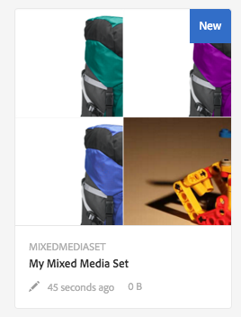

# 混合媒體集{#mixed-media-sets}

混合媒體集可讓您在單一簡報中混合提供影像、影像集、回轉集和視訊。

混合媒體集由橫幅指定，並加上單字 **[!UICONTROL MixedMediaSet。]**&#x200B;此外，如果「混合媒體集」已發佈，則會顯示「鉛筆」圖示所指示的發佈日期(以 **[!UICONTROL World]** 圖示指示)與上次修改日期(以 **** Pencil圖示表示)。

>[!NOTE]
>
>如需Assets使用者介面的資訊，請參閱[管理資產](/help/assets/manage-assets.md)。

## 快速入門：混合媒體集{#quick-start-mixed-media-sets}

若要使用混合媒體集快速上手並執行，請執行下列步驟：

1. [上傳您的資產](#uploading-assets)。

   首先，上傳混合媒體集的影像和視訊。如有必要，請建立 [影像集](/help/assets/image-sets.md)[和回轉集](/help/assets/spin-sets.md)。由於使用者可以在混合媒體集檢視器中放大影像，因此當您選擇影像時，請考量放大比例。請確定影像在最大尺寸中至少為2000像素。

1. [建立混合媒體集。](#creating-mixed-media-sets)

   若要建立混合媒體集，請從「資產」頁面，點選「建立>混合媒體集 **** 」，然後命名該集合，選擇資產，然後選擇影像的顯示順序。

   請參閱[使用選取器。](/help/assets/working-with-selectors.md)

1. 視需要設定[混合媒體檢視器預設集](/help/assets/managing-viewer-presets.md)。

   管理員可以建立或修改混合媒體集檢視器預設集。若要檢視您的混合媒體與檢視器預設集，請選取混合媒體集，然後在左側導軌下拉式選單中，選取「**[!UICONTROL 檢視器」。]**

   請參閱&#x200B;**[!UICONTROL 工具>資產>檢視器預設集]**&#x200B;以建立或編輯檢視器預設集。

   請參閱[添加和編輯查看器預設集。](/help/assets/managing-viewer-presets.md)

1. [預覽混合媒體集。](#previewing-mixed-media-sets)

   選取「混合媒體集」，即可預覽。 按一下縮圖圖示，檢查所選檢視器中的混合媒體集。 您可以從&#x200B;**[!UICONTROL 檢視器]**&#x200B;選單中選擇不同的檢視器，該選單可從左側導軌下拉式選單中取得。

1. [發佈混合媒體集。](#publishing-mixed-media-sets)

   發佈混合媒體集會啟用URL和內嵌字串。 此外，您必須[發佈檢視器預設集](/help/assets/managing-viewer-presets.md#publishing-viewer-presets)。

1. [將URL連結至您的Web](/help/assets/linking-urls-to-yourwebapplication.md) 應用程 [式，或內嵌視訊或影像檢視器](/help/assets/embed-code.md)。

   AEM Assets會為混合媒體集建立URL呼叫，並在您發佈混合媒體集後啟用它們。 您可以在預覽資產時複製這些URL。 或者，您也可以將它們嵌入您的網站。

   選取「混合媒體集」，然後在左側導軌下拉式選單中選取「**[!UICONTROL 檢視器」。]**

   請參 [閱將混合媒體集連結至網頁](/help/assets/linking-urls-to-yourwebapplication.md)[和內嵌視訊或影像檢視器](/help/assets/embed-code.md)。

如果需要，可以編輯[混合媒體集](#editing-mixed-media-sets)。 此外，還可以查看和修改[混合媒體集屬性](/help/assets/manage-assets.md#editing-properties)。

>[!NOTE]
>
>如果建立集時遇到問題，請參閱[疑難排解Dynamic Media - Scene7模式](/help/assets/troubleshoot-dms7.md)。

## 上傳資產 {#uploading-assets}

首先，上傳混合媒體集的影像和視訊。由於使用者可以在混合媒體集檢視器中放大影像，因此當您選擇影像時，請務必考量放大比例。 請確定影像在最大尺寸中至少為2000像素。

此外，如果您想要將回轉集或影像集新增至混合媒體集，也請建立這些回轉集或影像集。

## 建立混合媒體集{#creating-mixed-media-sets}

您可以將影像、影像集、回轉集和視訊新增至混合媒體集。 在將檔案、影像集和回轉集新增至混合媒體集之前，請確定您的檔案、影像集和回轉集已準備好發佈。

將資產新增至資產集時，資產會以英數字元順序自動新增。 新增資產後，您可以手動重新排序或排序資產。

**建立混合媒體集的方式**

1. 在「資產」中，導覽至您要建立混合媒體集的位置，然後按一下「建 **[!UICONTROL 立]**」，然後選 **[!UICONTROL 取「混合媒體集」。]**&#x200B;您也可以從包含資產的資料夾內建立資產集。顯示混合媒體集編輯器。

   

1. 在混合媒體集編輯器的&#x200B;**[!UICONTROL Title]**&#x200B;中，輸入混合媒體集的名稱。 名稱會出現在混合媒體集的橫幅中。 （可選）輸入說明。

   

   >[!NOTE]
   >
   >建立混合媒體集時，您可以變更混合媒體集縮圖，或允許AEM根據混合媒體集中的資產自動選取縮圖。 若要選取縮圖，請按一下「**[!UICONTROL 變更縮圖]**」並選取任何影像（您也可以導覽至其他資料夾以尋找影像）。 如果您已選取縮圖，然後決定要讓AEM從混合媒體集產生縮圖，請選取「切換至自動縮圖」。]****[!UICONTROL 

1. 點選「資產選擇器」以選取您要納入混合媒體集的資產。 選擇它們，然後按一下&#x200B;**[!UICONTROL 選擇。]**

   使用「資產選擇器」，您可以輸入關鍵字並點選「回報」來搜尋 **[!UICONTROL 資產。]**&#x200B;您也可以套用篩選條件來調整搜尋結果。您可以依路徑、系列、檔案類型和標籤來篩選。選取篩選，然後從工具列點選 **[!UICONTROL 「篩選]** 」圖示。通過選擇&#x200B;**[!UICONTROL View]**&#x200B;表徵圖並選擇&#x200B;**[!UICONTROL List View]**、**[!UICONTROL Column View]**&#x200B;或&#x200B;**[!UICONTROL Card View.]**&#x200B;更改視圖。

   請參閱[使用選取器](/help/assets/working-with-selectors.md)。

   

1. 將資產向上或向下拖曳以重新排序（必須視需要選取&#x200B;**[!UICONTROL Reorder]**&#x200B;圖示）。

   

   如果您想要新增縮圖，請按一 **下影像旁** 的+ **[!UICONTROL 縮圖]** 圖示，並導覽至您想要的縮圖。選擇完所有縮圖影像後，按一下「保存」。]****[!UICONTROL 

   >[!NOTE]
   >
   >如果您想要新增資產，請點選「**[!UICONTROL 新增資產」。]**

1. 若要刪除資產，請選取對應的核取方塊，然後點選「刪除資產」。]****[!UICONTROL 
1. 若要套用預設集，請點選右上角的&#x200B;**[!UICONTROL 預設]**，並選取要套用至資產的預設集。
1. 按一下「**[!UICONTROL 儲存」。]** 新建立的混合媒體集會顯示在您建立它的資料夾中。

## 編輯混合媒體集{#editing-mixed-media-sets}

您可以直接在使用者介面[中，對混合媒體集中的資產執行各種編輯工作，如同對資產](/help/assets/manage-assets.md)中的任何資產執行一樣。 您也可以在混合媒體集中執行下列動作：

* 新增資產至混合媒體集。
* 在混合媒體集中重新排序資產。
* 刪除混合媒體集中的資產。
* 套用檢視器預設集。
* 變更預設縮圖。

**編輯混合媒體集**

1. 執行下列任一操作：

   * 將滑鼠指標暫留在「混合媒體集」資產上，然後點選&#x200B;**[!UICONTROL Edit]**（鉛筆圖示）。
   * 將游標暫留在「混合媒體集」資產上，點選「**[!UICONTROL 選取]**」（勾選圖示），然後點選工具列上的「 **[!UICONTROL 編輯]**」。

   * 點選「混合媒體集」資產，然後點選工具列上的「 **[!UICONTROL Edit]**（鉛筆圖示）」。

1. 在混合媒體集編輯器中，執行下列任一操作：

   * 若要重新排序資產 — 在左側面板，點選&#x200B;**[!UICONTROL 資產]**（圖片圖示），將資產拖曳至新位置。
   * 若要新增資產 — 在工具列上，點選「 **[!UICONTROL 新增資產」。]** 導覽至資產。對於您要新增的每個資產，將滑鼠指標暫留在資產的影像上（而非資產名稱），然後點選核取標籤圖示。 在右上角，點選「**[!UICONTROL Select」。]**

   * 若要刪除資產 — 在左側面板，點選&#x200B;**[!UICONTROL 資產]**（圖片圖示），然後選取資產。 在工具列上，點選&#x200B;**[!UICONTROL 刪除資產。]**

   * 若要依資產名稱的遞增或遞減順序排序，請在左側面板中，點選&#x200B;**[!UICONTROL Assets]**（圖片圖示）。 在&#x200B;**[!UICONTROL Assets]**&#x200B;標題的右側，點選向上或向下插入符號圖示。

      >[!NOTE]
      >
      >* 若要刪除整個混合媒體集，請從任何檢視模式（例如&#x200B;**[!UICONTROL 卡片檢視]**&#x200B;或&#x200B;**[!UICONTROL 欄檢視]**）導覽至混合媒體集。 將滑鼠指標暫留在資產上，點選核取標籤圖示以加以選取。在鍵盤上按&#x200B;**[!UICONTROL Backspace]**，或在工具列上按一下&#x200B;**[!UICONTROL More]**（三個點），然後點選&#x200B;**[!UICONTROL Delete。]**
         >
         >
      * 您可以導覽至混合媒體集，按一下左側導軌中的&#x200B;**[!UICONTROL 設定成員]**，然後點選個別資產上的&#x200B;**[!UICONTROL 鉛筆]**&#x200B;圖示以開啟編輯視窗，以編輯該集合中的資產。

1. 完成編輯時，點選「**[!UICONTROL 儲存]**」。

   >[!NOTE]
   >
   >* 若要編輯混合媒體集中的資產 — 導覽至混合媒體集。 點選 (不要選取) 設定，以在「AEM設定預覽」頁面中開啟該設定。在左側導軌中，按一下向下插入符號以開啟下拉式清單，然後點選&#x200B;**[!UICONTROL 設定成員。]** 在「設定成員」頁面中，暫留在資產上，然後點選「編 **[!UICONTROL 輯]** （鉛筆圖示）」以開啟編輯頁面。
      >
      >
   * 若要刪除整個混合媒體集 — 從任何檢視模式（例如卡片檢視或欄檢視），導覽至混合媒體集。 暫留在集上，然後點選&#x200B;**選取**（勾選圖示）。 在鍵盤上按&#x200B;**[!UICONTROL Backspace]**，或點選&#x200B;**[!UICONTROL More]**（三個點的列），然後點選&#x200B;**[!UICONTROL Delete。]**

## 預覽混合媒體集{#previewing-mixed-media-sets}

如需如何預覽混合媒體集的詳細資訊，請參閱[預覽資產](/help/assets/previewing-assets.md)。

## 發佈混合媒體集{#publishing-mixed-media-sets}

如需如何發佈混合媒體集的詳細資訊，請參閱[發佈資產](/help/assets/publishing-dynamicmedia-assets.md)。

>[!NOTE]
>
>如果混合媒體集在您第一次發佈時並未完全進入傳送服務，您可能需要第二次發佈混合媒體集。
