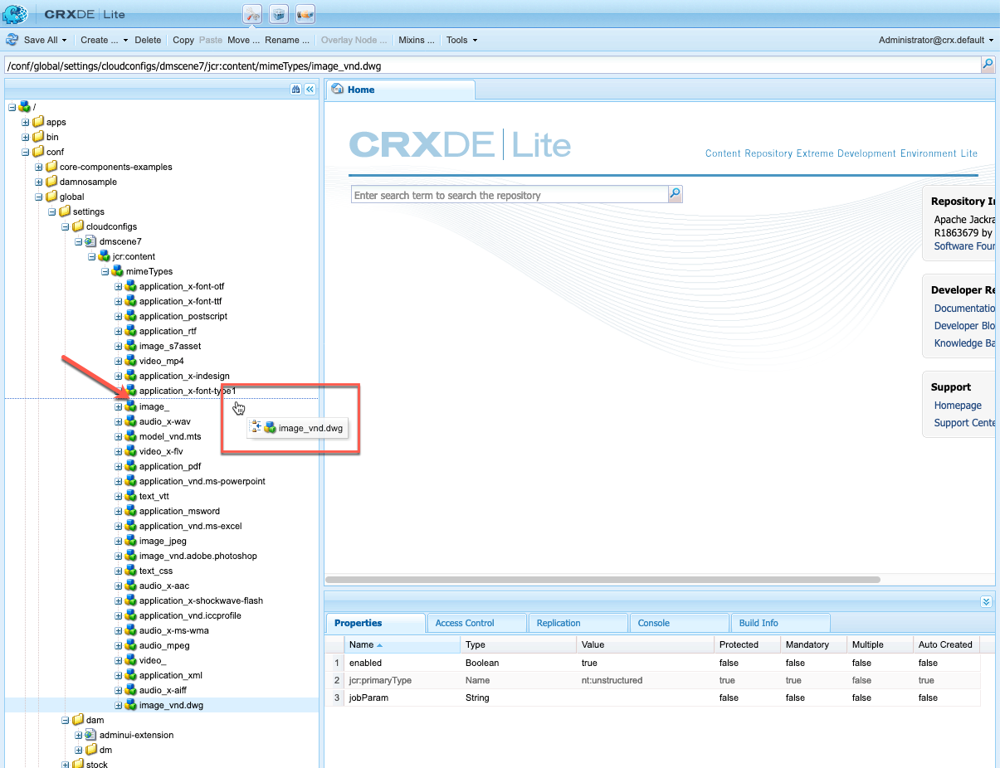

# 選項A — 設定Dynamic Media - Scene7模式{#configuring-dynamic-media-scene-mode}

>[!NOTE]
>
>選項A — 我寫的兩個新主題被刪除。 但在刪除主題之前，其所有內容已移至本主題中已討論一般設定和發佈設定的個別區域。

如果您使用針對不同環境（例如開發、測試和生產）設定的Adobe Experience Manager，請針對其中每個環境設定Dynamic MediaCloud Services。

## Dynamic Media - Scene7模式的架構圖 {#architecture-diagram-of-dynamic-media-scene-mode}

**里克：保持原樣**

以下架構圖表說明Dynamic Media - Scene7模式的運作方式。

透過新架構，Experience Manager負責主要來源資產，並與Dynamic Media同步處理及發佈資產：

1. 將主要來源資產上傳至Experience Manager時，資產會複製至Dynamic Media。 此時，Dynamic Media會處理所有資產處理和轉譯產生，例如影像的視訊編碼和動態變體。
(在Dynamic Media - Scene7模式中，預設上傳檔案大小為2 GB或更小。 若要啟用2 GB至15 GB的上傳檔案大小，請參閱 [（選用）設定Dynamic Media - Scene7模式，以上傳大於2 GB的資產](#optional-config-dms7-assets-larger-than-2gb).)
1. 產生轉譯後，Experience Manager可以安全地存取和預覽遠端Dynamic Media轉譯(不會將任何二進位檔傳回至Experience Manager執行個體)。
1. 內容準備好發佈及核准後，就會觸發Dynamic Media服務將內容推送至傳遞伺服器，並在CDN（內容傳遞網路）快取內容。


>[!IMPORTANT]
>
>下列功能清單需要您使用隨附於Adobe Experience Manager - Dynamic Media的現成可用CDN。 這些功能不支援任何其他自訂CDN。
>
>* [智慧型影像](/help/assets/imaging-faq.md)
>* [快取失效](/help/assets/invalidate-cdn-cache-dynamic-media.md)
>* [熱連結保護](/help/assets/hotlink-protection.md)
>* [HTTP/2 內容傳送](/help/assets/http2.md)
>* CDN層級的URL重新導向
>* Akamai ChinaCDN（以最佳方式在中國傳送）


## 在Scene7模式中啟用Dynamic Media {#enabling-dynamic-media-in-scene-mode}

**里克：保持原樣**

[Dynamic Media](https://business.adobe.com/products/experience-manager/assets/dynamic-media.html) 預設為停用。 若要運用Dynamic Media功能，您必須啟用此功能。

>[!WARNING]
>
>Dynamic Media - Scene7模式適用於 *僅Experience Manager製作例項*. 因此，您必須設定 `runmode=dynamicmedia_scene7` 在Experience Manager製作例項上， *not* Experience Manager發佈例項。

若要啟用Dynamic Media，您必須使用 `dynamicmedia_scene7` 通過在終端窗口中輸入以下命令行運行模式（使用的示例埠為4502）:

```shell
java -Xms4096m -Xmx4096m -Doak.queryLimitInMemory=500000 -Doak.queryLimitReads=500000 -jar cq-quickstart-6.5.0.jar -gui -r author,dynamicmedia_scene7 -p 4502
```

## （選用）將Dynamic Media預設集和設定從6.3移轉至6.5零停機時間 {#optional-migrating-dynamic-media-presets-and-configurations-from-to-zero-downtime}

**里克：保持原樣**

將Experience ManagerDynamic Media從6.3升級至6.4或6.5，現在包含零停機部署的功能。 若要從 `/etc` to `/conf` 在CRXDE Lite中，請務必執行下列curl命令。

>[!NOTE]
>
>如果您以相容模式運行Experience Manager實例（即安裝了相容性包），則無需運行這些命令。

對於所有升級，無論是否使用相容性套件，您都可以執行下列Linux® curl命令，以複製Dynamic Media最初隨附的預設現成檢視器預設集：

`curl -u admin:admin -X POST https://<server_address>:<server_port>/libs/settings/dam/dm/presets/viewer.pushviewerpresets.json`

移轉您從以下位置建立的任何自訂檢視器預設集和設定： `/etc` to `/conf`，請執行下列Linux® curl命令：

`curl -u admin:admin -X POST https://<server_address>:<server_port>/libs/settings/dam/dm/presets.migratedmcontent.json`

## 安裝Feature Pack 18912以大量移轉資產 {#installing-feature-pack-for-bulk-asset-migration}

**里克：保持原樣**

安裝Feature Pack 18912為 *可選*.

Feature Pack 18912可讓您透過FTP大量內嵌資產，或在Experience Manager時從Dynamic Media — 混合模式或Dynamic Media Classic移轉至Dynamic Media - Scene7模式。 可從以下網址取得： [Adobe Professional Services](https://business.adobe.com/customers/consulting-services/main.html).

請參閱 [安裝Feature Pack 18912以大量移轉資產](/help/assets/bulk-ingest-migrate.md) 以取得更多資訊。

## 在Cloud Services中建立Dynamic Media設定 {#configuring-dynamic-media-cloud-services}

**里克：保持原樣**

**設定Dynamic Media之前**  — 收到含有Dynamic Media憑證的布建電子郵件後，您必須開啟 [Dynamic Media Classic案頭應用程式](https://experienceleague.adobe.com/docs/dynamic-media-classic/using/getting-started/signing-out.html#getting-started)，然後登入您的帳戶以變更密碼。 預配電子郵件中提供的密碼是系統生成的，並且僅用於臨時密碼。 請務必更新密碼，以便使用正確的憑證來設定Dynamic MediaCloud Service。


**若要在Cloud Services中建立Dynamic Media設定：**

1. 在「Experience Manager作者」模式中，選取Experience Manager標誌以存取全域導覽主控台，並選取「工具」圖示，然後前往 **[!UICONTROL Cloud Services]** > **[!UICONTROL Dynamic Media設定]**.
1. 在Dynamic Media設定瀏覽器頁面的左窗格中，選取 **[!UICONTROL 全球]** (不要選取 **[!UICONTROL 全球]**)，然後選取 **[!UICONTROL 建立]**.
1. 在 **[!UICONTROL 建立Dynamic Media設定]** 頁面，輸入標題、Dynamic Media帳戶電子郵件地址、密碼，然後選取您的地區。 此資訊是透過布建電子郵件中的Adobe提供給您的。 如果您未收到電子郵件，請聯絡Adobe客戶支援。

   選擇 **[!UICONTROL 連線至Dynamic Media]**.

   >[!NOTE]
   **里克：保持原狀??** 收到含有Dynamic Media憑證的布建電子郵件後，請開啟 [Dynamic Media Classic案頭應用程式](https://experienceleague.adobe.com/docs/dynamic-media-classic/using/getting-started/signing-out.html#getting-started)，然後登入您的帳戶以變更密碼。 預配電子郵件中提供的密碼是系統生成的，並且僅用於臨時密碼。 請務必更新密碼，以便使用正確的憑證來設定Dynamic MediaCloud Service。

1. 連線成功時，請設定下列項目。 含星號(*)的標題為必填：

   * **[!UICONTROL 公司]** -Dynamic Media帳戶的名稱。 您有多個Dynamic Media帳戶。 例如，您可以有不同的子品牌、部門、測試或生產環境。

   * **[!UICONTROL 公司根資料夾路徑]**

   * **[!UICONTROL 發佈資產]**  — 您可從下列三個選項中選擇：
      * **[!UICONTROL 立即]** 表示上傳資產時，系統會擷取資產並立即提供URL/內嵌。 發佈資產不需要使用者干預。
      * **[!UICONTROL 啟動時]** 表示您必須先明確發佈資產，才能提供URL/內嵌連結。<br><!-- CQDOC-17478, Added March 9, 2021-->從Experience Manager6.5.8開始，「Experience Manager發佈」例項會反映精確的Dynamic Media中繼資料值，例如 `dam:scene7Domain` 和 `dam:scene7FileStatus` in **[!UICONTROL 啟動時]** 僅發佈模式。 若要啟用此功能，請安裝Service Pack 8，然後重新啟動Experience Manager。 前往Sling Config Manager。 尋找 `Scene7ActivationJobConsumer Component` 或建立新的)。 選取核取方塊 **[!UICONTROL 在Dynamic Media發佈後復寫中繼資料]**，然後選取 **[!UICONTROL 儲存]**.

         

      * **[!UICONTROL 選擇性發佈]** 此選項可讓您控制要在Dynamic Media中發佈的資料夾。 它可讓您使用智慧型裁切或動態轉譯等功能，或決定要預覽的Experience Manager中專門發佈的資料夾。 同樣的資產 *not* 發佈於Dynamic Media，以在公共網域中傳遞。<br>您可以在此處，在 **[!UICONTROL Dynamic Media雲端設定]** 或者，您也可以選擇在資料夾層級、資料夾的 **[!UICONTROL 屬性]**.<br>請參閱 [在Dynamic Media中使用選擇性發佈](/help/assets/selective-publishing.md).<br>如果您稍後變更此設定，或稍後在資料夾層級變更，這些變更只會影響您從此時間點上傳的新資產。 資料夾中現有資產的發佈狀態會維持原狀，直到您手動從 **[!UICONTROL 快速發佈]** 或 **[!UICONTROL 管理出版物]** 對話框。
   * **[!UICONTROL 安全預覽伺服器]**  — 可讓您指定安全轉譯預覽伺服器的URL路徑。 也就是說，產生轉譯後，Experience Manager可以安全地存取和預覽遠端Dynamic Media轉譯(不會將任何二進位檔傳回至Experience Manager執行個體)。
除非您有使用自己公司的伺服器或特殊伺服器的特殊安排，否則Adobe建議您保留此設定的指定。

   * **[!UICONTROL 同步所有內容]** - <!-- NEW OPTION, CQDOC-15371, Added March 4, 2020-->預設為選取。 如果您想要選擇性地包含或排除從同步至Dynamic Media的資產，請取消選取此選項。 取消選取此選項可讓您從下列兩個Dynamic Media同步模式中選擇：

   * **[!UICONTROL Dynamic Media 同步處理模式]**
      * **[!UICONTROL 預設為啟用]**  — 預設會將設定套用至所有資料夾，除非您特別標示要排除的資料夾。 <!-- you can then deselect the folders that you do not want the configuration applied to.-->
      * **[!UICONTROL 預設為停用]**  — 在您明確標示選取的資料夾以同步至Dynamic Media之前，不會將設定套用至任何資料夾。
若要將選取的資料夾標示為同步至Dynamic Media，請選取資產資料夾，然後在工具列上選取 **[!UICONTROL 屬性]**. 在 **[!UICONTROL 詳細資料]** 標籤中 **[!UICONTROL Dynamic Media同步模式]** 下拉式清單中，從下列三個選項中選擇。 完成後，選取 **[!UICONTROL 儲存]**. *記住：如果您選取&#x200B;**[!UICONTROL 同步所有內容]**更早。* 另請參閱 [在Dynamic Media的資料夾層級使用選擇性發佈](/help/assets/selective-publishing.md).
         * **[!UICONTROL 繼承]**  — 資料夾上沒有明確的同步值；相反，資料夾會繼承其上階資料夾中的一個同步值，或繼承雲配置中的預設模式。 繼承的詳細狀態會透過工具提示顯示。
         * **[!UICONTROL 啟用子資料夾]**  — 將所有項目納入此子樹狀結構中，以同步至Dynamic Media。 資料夾特定設定會覆寫雲端設定中的預設模式。
         * **[!UICONTROL 子資料夾已停用]**  — 排除此子樹狀結構中的所有項目，使其無法同步至Dynamic Media。

   >[!NOTE]
   DMS7不支援版本設定。 此外，延遲啟動僅適用於在「編輯動態媒體設定」頁面中的「發佈資產 ********」設定為「啟動時」，然後只適用於在首次啟動資產時。
   啟動資產後，任何更新都會立即上線發佈至S7傳送。

1. 選擇 **[!UICONTROL 儲存]**.
1. 若要在發佈Dynamic Media內容之前安全地預覽，您必須「允許清單」Experience Manager製作例項，才能連線至Dynamic Media:

   * **里克：連結至新的發佈設定主題** 開啟 [Dynamic Media Classic案頭應用程式](https://experienceleague.adobe.com/docs/dynamic-media-classic/using/getting-started/signing-out.html#getting-started)，然後登入您的帳戶。 配置時，Adobe提供了您的憑據和登錄詳細資訊。 如果您沒有此資訊，請聯絡Adobe客戶支援。

   * 在頁面右上角的導覽列中，導覽至 **[!UICONTROL 設定]** > **[!UICONTROL 應用程式設定]** > **[!UICONTROL 發佈設定]** > **[!UICONTROL 影像伺服器]**.

   * 在「影像伺服器發佈」頁面的「發佈內容」下拉式清單中，選取 **[!UICONTROL 測試影像提供]**.
   * 對於客戶端地址篩選器，請選擇 **[!UICONTROL 新增]**.
   * 若要啟用（開啟）地址，請選取核取方塊。 輸入Experience Manager製作例項的IP位址（非Dispatcher IP）。
   * 選擇 **[!UICONTROL 儲存]**.

您現在已完成基本設定；您已準備好使用Dynamic Media - Scene7模式。

如果您想進一步自訂設定，您可以選擇完成下方的任何工作 [（選用）在Dynamic Media - Scene7模式中設定進階設定](#optional-configuring-advanced-settings-in-dynamic-media-scene-mode).

## （選用）在Dynamic Media - Scene7模式中設定進階設定 {#optional-configuring-advanced-settings-in-dynamic-media-scene-mode}

**里克：保持原樣**

如果您想進一步自訂Dynamic Media - Scene7模式的設定和設定，或最佳化其效能，您可以完成下列一或多個作業 *可選* 任務：

* [（選用）設定Dynamic Media - Scene7模式，以上傳大於2 GB的資產](#optional-config-dms7-assets-larger-than-2gb)

* [（選用）Dynamic Media - Scene7模式設定的設定與設定](#optional-setup-and-configuration-of-dynamic-media-scene7-mode-settings)

* [（選用）調整Dynamic Media - Scene7模式的效能](#optional-tuning-the-performance-of-dynamic-media-scene-mode)

* [（選用）篩選資產以進行復寫](#optional-filtering-assets-for-replication)

### （選用）設定Dynamic Media - Scene7模式，以上傳大於2 GB的資產 {#optional-config-dms7-assets-larger-than-2gb}

**里克：保持原樣**

在Dynamic Media - Scene7模式中，預設資產上傳檔案大小為2 GB或更小。 不過，您可以選擇設定大於2 GB和高達15 GB的資產上傳。

如果您要使用此功能，請注意下列必要條件和要點：

* 您必須以Dynamic Media - Scene7模式，使用Service Pack 6.5.4.0或更新版本執行Experience Manager6.5。
* 此大型上傳功能僅支援 [*Managed Services*](https://business.adobe.com/products/experience-manager/managed-services.html) 客戶。
* 請確定您的Experience Manager執行個體已使用Amazon S3或Microsoft® Azure Blob儲存。

   >[!NOTE]
   使用存取金鑰和機密金鑰設定Azure Blob儲存，因為Blob儲存設定中的AzureSas不支援此大型上傳功能。

* 橡樹 [直接二進位存取下載](https://jackrabbit.apache.org/oak/docs/features/direct-binary-access.html) 已啟用(Oak的 *直接二進位存取上傳* 非必要)。

   要啟用直接二進位訪問下載，請設定屬性 `presignedHttpDownloadURIExpirySeconds > 0` 在資料存放區設定中。 值應足以下載較大的二進位檔，然後可能會重試。

* 超過15 GB的資產不會上傳。 （大小限制設定在下面的步驟8中。）
* 當 **[!UICONTROL Dynamic Media重新處理]** 資產工作流程會在資料夾上觸發，會重新處理已與Dynamic Media公司同步的任何大型資產。 不過，如果資料夾中尚未同步任何大型資產，則不會上傳資產。 因此，若要同步Dynamic Media中的現有大型資產，您可以執行 **[!UICONTROL Dynamic Media重新處理]** 個別資產的資產工作流程。

**若要設定Dynamic Media - Scene7模式，以上傳大於2 GB的資產：**

1. 在Experience Manager中，選取Experience Manager標誌以存取全域導覽主控台，然後導覽至 **[!UICONTROL 工具]** > **[!UICONTROL 一般]** > **[!UICONTROL CRXDE Lite]**.

1. 在「CRXDE Lite」視窗中，執行下列其中一項操作：

   * 在左側邊欄中，導覽至下列路徑：

      `/libs/dam/gui/content/assets/jcr:content/actions/secondary/create/items/fileupload`

   * 將上方的路徑複製並貼到工具列下方的CRXDE Lite路徑欄位中，然後按 `Enter`.

1. 在左側邊欄中，按一下滑鼠右鍵 `fileupload`，然後從快顯功能表中選取 **[!UICONTROL 覆蓋節點]**.

   

1. 在「覆蓋節點」對話方塊中，選取 **[!UICONTROL 匹配節點類型]** 核取方塊以啟用（開啟）選項，然後選取 **[!UICONTROL 確定]**.

   

1. 從「CRXDE Lite」視窗，執行下列其中一項操作：

   * 在左側邊欄中，導覽至下列覆蓋節點路徑：

      `/apps/dam/gui/content/assets/jcr:content/actions/secondary/create/items/fileupload`

   * 將上方的路徑複製並貼到工具列下方的CRXDE Lite路徑欄位中，然後按 `Enter`.

1. 在 **[!UICONTROL 屬性]** 頁簽 **[!UICONTROL 名稱]** 欄，找到 `sizeLimit`.
1. 在 `sizeLimit` 名稱，在 **[!UICONTROL 值]** 欄，按兩下值欄位。
1. 以位元組為單位輸入適當值，以便將大小限制增加到最大所需上傳大小。 例如，若要將上傳資產大小限制提高至10 GB，請輸入 `10737418240` 在值欄位中。
您可以輸入最多15 GB的值(`2013265920` 位元組)。 在此情況下，超過15 GB的已上傳資產將不會上傳。


   

1. 在CRXDE Lite窗口的左上角附近，選擇 **[!UICONTROL 全部儲存]**.

   *現在，請執行下列動作，為AdobeGranite工作流程外部處理程式工作處理常式設定逾時：*

1. 在Experience Manager中，選取Experience Manager標誌以存取全域導覽主控台。
1. 執行下列任一操作：

   * 導覽至下列URL路徑：

      `localhost:4502/system/console/configMgr/com.adobe.granite.workflow.core.job.ExternalProcessJobHandler`

   * 將上方的路徑複製並貼到瀏覽器的URL欄位中。 請務必取代 `localhost:4502` 搭配您自己的Experience Manager例項。

1. 在 **[!UICONTROL AdobeGranite工作流程外部流程作業處理常式]** 對話框， **[!UICONTROL 逾時上限]** 欄位中，將值設定為 `18000` 分鐘（五小時）。 預設為10800分鐘（三小時）。

   

1. 在對話框的右下角，選擇 **[!UICONTROL 儲存]**.

   *現在，請執行下列動作，為Scene7直接二進位上傳程式步驟設定逾時：*

1. 在Experience Manager中，選取Experience Manager標誌以存取全域導覽主控台。
1. 導覽至 **[!UICONTROL 工具]** > **[!UICONTROL 工作流程]** > **[!UICONTROL 模型]**.
1. 在「工作流模型」頁上，選擇 **[!UICONTROL Dynamic Media編碼視訊]**.
1. 在工具列上，選取 **[!UICONTROL 編輯]**.
1. 在工作流程頁面上，連按兩下 **[!UICONTROL Scene7直接二進位上傳]** 處理步驟。
1. 在 **[!UICONTROL 步驟屬性]** 對話框 **[!UICONTROL 常見]** 頁簽 **[!UICONTROL 進階設定]** 標題中 **[!UICONTROL 逾時]** 欄位，輸入 `18000` 分鐘（五小時）。 預設為 `3600` 分鐘（1小時）。
1. 選擇 **[!UICONTROL 確定]**.
1. 選擇 **[!UICONTROL 同步]**.
1. 對 **[!UICONTROL DAM更新資產]** 工作流模型和 **[!UICONTROL Dynamic Media重新處理]** 工作流程模型。

### （選用）設定Dynamic Media發佈設定 {#optional-setup-and-configuration-of-dynamic-media-scene7-mode-settings}

**里克：此處新增的新發佈設定主題的完整內容**

>[!IMPORTANT]
Dynamic Media發佈設定僅適用於：
* 您以Scene7模式執行Dynamic Media。
* 您有 *現有* **[!UICONTROL Dynamic Media設定]** (在 **[!UICONTROL Cloud Services]**)、Adobe Experience Manager 6.5或Experience Manageras a Cloud Service。
* 您是具有管理員權限的Experience Manager系統管理員。


Dynamic Media發佈設定頁面設定依預設會決定資產從AdobeDynamic Media伺服器傳送至網站或應用程式的方式。 如果未指定任何設定，AdobeDynamic Media伺服器會根據「發佈設定」頁面上的預設設定來傳送資產。 例如，傳送不包含解析度屬性的影像的請求會產生影像，影像伺服器頁面上具有「預設物件解析度」設定。

管理員可以變更影像伺服器、影像轉譯器和暈映頁面上的預設設定，以建立從伺服器傳送資產的預設設定。

>[!NOTE]
Dynamic Media發佈設定供經驗豐富的網站開發人員和程式設計人員使用。 Adobe建議變更下列任何預設發佈設定的使用者熟悉AdobeDynamic Media、HTTP通訊協定標準和慣例，以及基本影像技術。

**若要設定Dynamic Media發佈設定：**

1. 在「Experience Manager作者」模式中，選取Experience Manager標誌以存取全域導覽主控台。
1. 在左側邊欄中，選取「工具」圖示，然後前往 **[!UICONTROL 資產]** > **[!UICONTROL Dynamic Media發佈設定]**.
1. 在「影像伺服器」頁面中，設定您的影像伺服器 — 發佈內容，然後使用五個索引標籤來配置預設發佈設定。

   * [影像伺服器](#image-server)
   * [安全性](#security-tab) 標籤
   * [目錄管理](#catalog-management-tab) 標籤
   * [請求屬性](#request-attributes-tab) 標籤
   * [常見縮圖屬性](#common-thumbnail-attributes-tab) 標籤
   * [色彩管理屬性](#color-management-attributes-tab) 標籤

   
   *Dynamic Media發佈設定頁面，**[!UICONTROL 請求屬性]**頁簽。*<br><br>

1. 完成後，在頁面右上角附近選取 **[!UICONTROL 儲存]**.

#### 影像伺服器 {#image-server}

「影像伺服器」頁建立從影像伺服器傳送影像的預設設定。 設定分為五個類別

| 發佈內容 | 說明 |
| --- | --- |
| 影像服務 | 指定發佈設定的上下文。 |
| 測試影像服務 | 指定測試發佈設定的上下文。<br>請參閱 [在將資產公開之前先測試資產](#test-assets-before-making-public). |

#### 「安全」頁簽 {#security-tab}

**[!UICONTROL 用戶端地址]**  — 可讓您指定一或多個IP位址或IP位址範圍。 指定後，拒絕對源自未列出IP地址的客戶端的此映像目錄的請求。 此規則同時適用於影像傳送和已轉譯的影像。

#### 目錄管理索引標籤 {#catalog-management-tab}

**[!UICONTROL 規則集定義檔案路徑]**  — 指定包含影像目錄規則集定義的檔案。

另請參閱 [RuleSetFile](https://experienceleague.adobe.com/docs/dynamic-media-developer-resources/image-serving-api/image-serving-api/attributes/r-rulesetfile.html) 參數。

#### 請求屬性索引標籤 {#request-attributes-tab}

這些設定與影像的預設外觀相關。

| 設定 | 說明 |
| --- | --- |
| **[!UICONTROL 回覆影像大小限制]** | 必要.<br>指定傳回給用戶端的最大回覆影像寬度和高度。 如果請求導致寬度、高度或兩者均大於此設定的回覆影像，則伺服器會傳回錯誤。<br>另請參閱 [MaxPix](https://experienceleague.adobe.com/docs/dynamic-media-developer-resources/image-serving-api/image-serving-api/attributes/r-maxpix.html) 參數。 |
| **[!UICONTROL 要求混淆模式]** | 如果要將base64編碼應用於有效請求，請啟用。<br>另請參閱 [RequestObfuscation](https://experienceleague.adobe.com/docs/dynamic-media-developer-resources/image-serving-api/image-serving-api/attributes/r-requestobfuscation.html) 參數。 |
| **[!UICONTROL 要求鎖定模式]** | 如果您想在請求中加入簡單雜湊鎖定，請啟用。<br>另請參閱 [RequestLock](https://experienceleague.adobe.com/docs/dynamic-media-developer-resources/image-serving-api/image-serving-api/attributes/r-requestlock.html) 參數。 |
| **[!UICONTROL 預設要求屬性]** |  |
| **[!UICONTROL 預設影像檔案字尾]** | 必要.<br>如果路徑不包含檔案尾碼，則預設資料檔案副檔名附加到目錄路徑和掩碼路徑欄位值。<br>另請參閱 [DefaultExt](https://experienceleague.adobe.com/docs/dynamic-media-developer-resources/image-serving-api/image-serving-api/attributes/r-defaultext.html) 參數。 |
| **[!UICONTROL 預設字體名稱]** | 指定如果文字層請求未提供字型，則使用的字型。 如果指定，則必須是此影像目錄的字型映射或預設目錄的字型映射中的有效字型名稱值。<br>另請參閱 [DefaultFont](https://experienceleague.adobe.com/docs/dynamic-media-developer-resources/image-serving-api/image-serving-api/attributes/r-defaultfont.html) 參數。 |
| **[!UICONTROL 預設影像]** | 提供預設影像以回應找不到要求影像的要求。<br>另請參閱 [預設影像](https://experienceleague.adobe.com/docs/dynamic-media-developer-resources/image-serving-api/image-serving-api/attributes/r-is-cat-defaultimage.html) 參數。 |
| **[!UICONTROL 預設影像模式]** | 啟用滑桿方塊時（右側的滑桿）, **[!UICONTROL 預設影像]** 以預設影像替換源影像中的每個缺失層，並照常返回複合。 當滑塊框被禁用時（左側的滑塊），預設影像將替換整個複合影像，即使缺少的影像只是多個圖層中的一個。<br>另請參閱 [DefaultImageMode](https://experienceleague.adobe.com/docs/dynamic-media-developer-resources/image-serving-api/image-serving-api/attributes/r-defaultimagemode.html) 參數。 |
| **[!UICONTROL 預設檢視大小]** | 必要.<br>如果請求未明確指定檢視大小，則伺服器會限制回覆影像不大於此寬度和高度 `wid=`, `hei=`，或 `scl=`.<br>另請參閱 [DefaultPix](https://experienceleague.adobe.com/docs/dynamic-media-developer-resources/image-serving-api/image-serving-api/attributes/r-defaultpix.html) 參數。 |
| **[!UICONTROL 預設縮圖大小]** | 必要.<br>使用而非屬性 **[!UICONTROL 預設視圖大小]** 針對縮圖請求(`req=tmb`)。 如果縮圖請求(`req=tmb`)未明確指定大小 `wid=`, `hei=`，或 `scl=`.<br>另請參閱 [DefaultThumbPix](https://experienceleague.adobe.com/docs/dynamic-media-developer-resources/image-serving-api/image-serving-api/attributes/r-defaultthumbpix.html) 參數。 |
| **[!UICONTROL 預設背景顏色]** | 指定用於填入不包含實際影像資料之回覆影像任何區域的RGB值。<br>另請參閱 [BkgColor](https://experienceleague.adobe.com/docs/dynamic-media-developer-resources/image-serving-api/image-serving-api/attributes/r-bkgcolor.html) 參數。 |
| **[!UICONTROL JPEG 編碼屬性]** |  |
| **[!UICONTROL 品質]** | 指定JPEG回覆影像的預設屬性。 此 **[!UICONTROL 品質]** 欄位在1 - 100範圍中定義。<br>另請參閱 [JpegQuality](https://experienceleague.adobe.com/docs/dynamic-media-developer-resources/image-serving-api/image-serving-api/attributes/r-jpegquality.html) 參數。 |
| **[!UICONTROL 色度縮減取樣]** | 啟用或停用JPEG編碼器所採用的色彩下採樣。 |
| **[!UICONTROL 預設重新取樣模式]** | 指定用於縮放影像資料的預設重採樣和插值屬性。 使用時機 `resMode` 未在請求中指定。<br>另請參閱 [ResMode](https://experienceleague.adobe.com/docs/dynamic-media-developer-resources/image-serving-api/image-serving-api/attributes/r-is-cat-resmode.html) 參數。 |

#### 常見縮圖屬性索引標籤 {#common-thumbnail-attributes-tab}

這些設定與縮圖影像的預設外觀和對齊方式有關。

| 設定 | 說明 |
| --- | --- |
| **[!UICONTROL 縮圖的預設背景顏色]** | 指定用於填充不包含實際影像資料的輸出縮圖影像區域的RGB值。 僅用於縮圖請求(`req=tmb`)和 **[!UICONTROL 預設縮圖類型]** 設定設為 **[!UICONTROL 適合]** 或 **[!UICONTROL 紋理]**.<br>另請參閱 [ThumbBkgColor](https://experienceleague.adobe.com/docs/dynamic-media-developer-resources/image-serving-api/image-serving-api/attributes/r-thumbbkgcolor.html) 參數。 |
| **[!UICONTROL 水準對齊]** | 指定回復影像矩形中縮圖影像的水準對齊方式，由 `wid=` 和 `hei=` 值。<br>僅用於縮圖請求(`req=tmb`)和 **[!UICONTROL 預設縮圖類型]** 設定設為 **[!UICONTROL 適合]**.<br>有三個水準對齊可供選擇： **[!UICONTROL 中心對齊]**, **[!UICONTROL 左對齊]**，和 **[!UICONTROL 右對齊]**.<br>另請參閱 [ThumbHorizAlign](https://experienceleague.adobe.com/docs/dynamic-media-developer-resources/image-serving-api/image-serving-api/attributes/r-thumbhorizalign.html) 參數。 |
| **[!UICONTROL 垂直對齊]** | 指定回復影像矩形中縮圖影像的垂直對齊方式，由 `wid=` 和 `hei=` 值。 僅用於縮圖請求(`req=tmb`)和 **[!UICONTROL 預設縮圖類型]** 設定設為 **[!UICONTROL 適合]**.<br>有三個垂直對齊可供選擇： **[!UICONTROL 頂端對齊方式]**, **[!UICONTROL 中心對齊]**，和 **[!UICONTROL 底部對齊]**.<br>另請參閱 [ThumbVertAlign](https://experienceleague.adobe.com/docs/dynamic-media-developer-resources/image-serving-api/image-serving-api/attributes/r-thumbvertalign.html) 參數。 |
| **[!UICONTROL 預設快取存留時間]** | 提供預設過期時間間隔（小時），以防特定目錄記錄未包含有效的目錄過期值。 設為 `-1` 以標示為永不過期。 <br>另請參閱 [過期](https://experienceleague.adobe.com/docs/dynamic-media-developer-resources/image-serving-api/image-serving-api/attributes/r-expiration.html) 參數。 |
| **[!UICONTROL 預設縮圖類型]** | 提供縮圖類型的預設值，以備特定目錄記錄不包含有效的目錄ThumbType值時使用。 僅用於縮圖請求(`req=tmb`)。<br>有三種縮圖類型可供選擇： **[!UICONTROL 裁切]**, **[!UICONTROL 適合]**，和 **[!UICONTROL 紋理]**.<br>另請參閱 [ThumbType](https://experienceleague.adobe.com/docs/dynamic-media-developer-resources/image-serving-api/image-serving-api/attributes/r-thumbtype.html) 參數。 |
| **[!UICONTROL 預設縮圖解析度]** | 提供縮圖對象解析的預設值，以備特定目錄記錄不包含有效的目錄ThumbRes值時使用。 僅用於縮圖請求(`req=tmb`)和 **[!UICONTROL 預設縮圖類型]** 設定設為 **[!UICONTROL 紋理]**.<br>另請參閱 [ThumbRes](https://experienceleague.adobe.com/docs/dynamic-media-developer-resources/image-serving-api/image-serving-api/attributes/r-thumbres.html) 參數。 |

#### 色彩管理屬性索引標籤 {#color-management-attributes-tab}

這些設定確定用於影像的ICC顏色配置檔案。

**色彩轉換演算方式**
顏色轉換呈現意圖允許覆蓋工作配置檔案的預設呈現意圖以確定如何調整源顏色。 用於：

1. 預設的ICC配置檔案之一是顏色轉換的目標顏色空間。
1. 輸出設備（打印機或顯示器）由此配置檔案特徵。
1. 而且，指定的呈現目的對此配置檔案有效。

不同的渲染意圖使用不同的規則來確定如何調整源顏色。

例如，您可以設定 **[!UICONTROL RGB預設顏色空間]** to **[!UICONTROL sRGB]**，和 **[!UICONTROL CMYK預設顏色空間]** to **[!UICONTROL WebCobated]**.

這麼做會執行下列動作：

* 啟用RGB和CMYK影像的顏色校正。
* 沒有顏色描述檔的RGB影像會假設在 *sRGB* 色域。
* 假定沒有顏色輪廓的CMYK影像為 *WebCobated* 色域。
* 傳回RGB輸出的動態轉譯，會在 *sRGB* 色域。
* 傳回CMYK輸出的動態轉譯，會在 *WebCobated* 色域。

另請參閱 [IccRenderIntent](https://experienceleague.adobe.com/docs/dynamic-media-developer-resources/image-serving-api/image-serving-api/attributes/r-iccrenderintent.html) 參數。

>[!NOTE]
一般而言，最好針對選取的顏色設定使用預設的演算方式，此設定已由Adobe測試，以符合業界標準。 例如，如果您選擇北美或歐洲的色彩設定，預設的色彩轉換演算方式為 **[!UICONTROL 相對顏色量度]**. 如果您選擇日本的顏色設定，預設的顏色轉換呈現方式為 **[!UICONTROL 知覺]**.

| 設定 | 特徵 |
| --- | --- |
| **[!UICONTROL CMYK預設顏色空間]** | 指定要用作CMYK資料工作配置檔案的ICC顏色配置檔案的名稱。 若 **[!UICONTROL 未指定]** 如果選擇，則當涉及CMYK源影像時，將禁用此影像目錄的顏色管理。 所有CMYK工作空間都取決於設備，這意味著它們基於實際的油墨和紙張組合。 CMYK工作空間Adobe供應基於標準商業打印條件。<br> 另請參閱 [IccProfileCMYK](https://experienceleague.adobe.com/docs/dynamic-media-developer-resources/image-serving-api/image-serving-api/attributes/r-iccprofilecmyk.html) 參數。 |
| **[!UICONTROL 灰階預設顏色空間]** | 指定要用作灰度資料工作配置檔案的ICC顏色配置檔案的名稱。 若 **[!UICONTROL 未指定]** 選擇，當涉及灰度源影像時，將禁用此影像目錄的顏色管理。<br>另請參閱 [IccProfileGray](https://experienceleague.adobe.com/docs/dynamic-media-developer-resources/image-serving-api/image-serving-api/attributes/r-iccprofilegray.html) 參數。 |
| **[!UICONTROL RGB預設顏色空間]** | 指定要用作RGB資料工作配置檔案的ICC顏色配置檔案的名稱。 若 **[!UICONTROL 未指定]** 選擇此選項時，當涉及RGB源影像時，將禁用此影像目錄的顏色管理。 總的來說，最好選擇 **[!UICONTROL Adobe RGB]** 或 **[!UICONTROL sRGB]**，而非特定裝置的設定檔（例如監視器設定檔）。 **[!UICONTROL sRGB]** 當您為網頁或行動裝置準備影像時，建議使用，因為它會定義用於在網頁上檢視影像的標準監視器的色彩空間。 **[!UICONTROL sRGB]** 當您使用消費者層級數位相機的影像時，也是不錯的選擇，因為這些相機大多使用sRGB作為預設的色域。<br>另請參閱 [IccProfileRBG](https://experienceleague.adobe.com/docs/dynamic-media-developer-resources/image-serving-api/image-serving-api/attributes/r-iccprofilergb.html) 參數。 |
| **[!UICONTROL 色彩轉換演算方式]** | **[!UICONTROL 知覺]**  — 旨在保持顏色之間的視覺關係，使人眼認為顏色是自然的，即使顏色值本身可能改變。 本目的適用於具有大量色域外顏色的照片影像。 此設定是日本印刷業的標準轉譯目的。 |
|  | **[!UICONTROL 相對比色]**  — 將源顏色空間的極高亮與目標顏色空間的極高亮進行比較，並相應地移動所有顏色。 色域外顏色被移動到目標顏色空間中最接近的可再現顏色。 相對比色保留了影像中更多的原始顏色，而不是感知。 此設定是在北美和歐洲打印的標準渲染意圖。 |
|  | **[!UICONTROL 飽和度]**  — 試圖在影像中生成生動的顏色，但犧牲顏色準確度。 此渲染方式適用於圖形或圖表等商業圖形，其中亮飽和顏色比顏色之間的精確關係更重要。 |
|  | **[!UICONTROL 絕對比色]**  — 保持目標色域內部的顏色不變。 色域外的顏色被剪下。 不執行顏色到目標白點的縮放。 該目的旨在以保持顏色之間關係為代價來保持顏色精度，並且適於校樣以模擬特定設備的輸出。 此目的對於預覽紙張顏色對打印顏色的影響很有用。 |

### 在將資產公開之前先測試資產 {#test-assets-before-making-public}

Secure Testing可幫助您定義安全的測試環境，並基於一組可配置的IP地址和範圍，構建強大的企業對企業解決方案。 此功能可讓您將AdobeDynamic Media部署與內容管理和業務系統的架構搭配使用。

透過安全測試，您可以預覽含有未發佈內容之網站的測試版本。

如果需要，請建立測試環境，而非公開提供資產，原因如下：

* 在公開啟動前預覽網站（測試網站）。
* 提供需要限制存取的資產，例如在B2B Web應用程式中顯示價格的eCatalog。
* 使用防火牆後的資產作為產品資訊管理系統、客戶服務應用程式、培訓網站等的一部分。

>[!NOTE]
安全測試不會影響對Adobe Dynamic Media Classic的存取。 Adobe Dynamic Media Classic安全性仍維持一致，並需有存取Adobe Dynamic Media Classic和相關網站服務的一般認證。

#### 安全測試如何運作 {#how-test-assets-works}

大多數公司都把網際網路放在防火牆的後面。 某些路由（通常通過有限的公用IP地址）可以訪問Internet。

從您的公司網路中，您可以使用以下網站來找出您的公開IP位址： [https://www.whatismyip.com](https://www.whatismyip.com/) 或向貴公司的IT組織請求此資訊。

通過安全測試，AdobeDynamic Media為測試環境或內部應用程式建立專用的映像伺服器。 對此伺服器的任何請求都會檢查來源IP位址。 如果傳入的請求不在核准的IP位址清單內，則會傳回失敗回應。 AdobeDynamic Media公司管理員會為其公司的安全測試環境設定已核准的IP位址清單。

由於必須確認原始請求的位置，因此安全測試服務的流量不會經由內容分發網路(如公用Dynamic Media影像伺服器流量)路由。 與公開的Dynamic Media影像伺服器相比，向安全測試服務提出的延遲略高。

取消發佈的資產可立即從安全測試服務取得，而無需發佈。 如此一來，您就可以在資產發佈至其公開的影像伺服器之前，執行預覽。

>[!NOTE]
安全測試服務使用配置了內部發佈上下文的目錄伺服器。 因此，如果貴公司已設定為發佈至Secure Testing,AdobeDynamic Media中任何上傳的資產都會立即在Secure Testing服務上使用。 無論資產是否在上傳時標示為要發佈，此功能都為true。

安全測試服務目前支援下列資產類型和功能：

* 影像.
* 暈映（呈現伺服器請求）。
* 呈現伺服器請求（支援，但必須由客戶明確請求）。
* 集，包括影像集、eCatalog、渲染集和媒體集。
* 標準AdobeDynamic Media多媒體檢視器。
* AdobeDynamic Media OnDemand JSP頁。
* 靜態內容，例如PDF檔案和逐步提供的影片。
* HTTP視訊串流。
* 漸進式視訊串流。

目前不支援下列資產類型和功能：

* Adobe Dynamic Media Classic資訊或eCatalog搜尋
* RTMP視訊串流
* 網路印刷
* UGC（使用者產生的內容）服務

>[!IMPORTANT]
Adobe Dynamic Media中對新或現有UGC向量影像資產的支援已於2021年9月30日終止。

#### 測試安全測試服務 {#test-secure-testing-service}

要確保安全測試服務正常工作，請執行以下操作：

##### 準備您的帳戶

1. 請連絡Adobe客戶服務，要求他們在您的帳戶上啟用安全測試。
1. 在Adobe Experience Manager中，選取 **[!UICONTROL 工具]** > **[!UICONTROL 資產]** > **[!UICONTROL Dynamic Media發佈設定]**.
1. 在「影像伺服器」頁面上， **[!UICONTROL 發佈內容]** 下拉清單，選擇 **[!UICONTROL 測試影像提供]**.
1. 選取 **[!UICONTROL 安全性]** 標籤。
1. 若 **[!UICONTROL 用戶端地址]** 篩選，選取 **[!UICONTROL 新增]**.
1. 在 **[!UICONTROL IP位址]** 欄位，輸入IP位址。
1. 在 **[!UICONTROL 遮色片]** 欄位，鍵入網路掩碼。

   >[!NOTE]
   如果添加多個IP地址和網路掩碼，則它實際上允許 *all* 進行資產呼叫的IP位址，都會顯示。

1. 執行下列任一操作：

   * 若要新增更多IP位址，請重複前三個步驟。
   * 繼續下一步。

1. 在「影像伺服器」頁的右上角，選擇 **[!UICONTROL 儲存]**.
1. 上傳所需影像至您的AdobeDynamic Media帳戶。

<!--    See [Upload files](uploading-files.md#uploading_files). -->

1. 請確定某些影像已標示為要發佈，而其他影像已取消標示，然後提交發佈工作。

<!--    See [Publish files](publishing-files.md#publishing_files). -->

1. 請前往 **[!UICONTROL 工具]** > **[!UICONTROL 資產]** > **[!UICONTROL Dynamic Media一般設定]**.
1. 在 **[!UICONTROL 伺服器]** 頁面，找到右側的伺服器名稱 **[!UICONTROL 已發佈的伺服器名稱]**.

如果伺服器名稱遺失或伺服器的URL無法運作，請聯絡Adobe服務。

##### 準備網站變體

您需要連結已發佈和未發佈資產的網站的兩個變數：

* 公開版本 — 使用傳統AdobeDynamic Media URL語法連結資產。
* 測試版本 — 使用相同語法但使用安全測試網站名稱連結資產。

##### 執行測試

執行下列測試：

1. 檢查公司網路中是否顯示資產。

   從由先前定義的IP位址範圍所識別的公司網路中，網站的測試版本會顯示所有影像，無論是否標示為發佈。 因此，您可以在預覽核准或產品發佈之前，不會意外讓影像可供使用，進行測試。

   確認網站的公開版本顯示先前使用AdobeDynamic Media時所體驗的已發佈資產。

1. 從公司網路外部，確認未發佈的資產（即未標示為發佈）受到保護，不受第三方存取。

   從外部（例如從家用電腦或4G/5G連線）存取您的網路，然後確認網站的公開版本顯示所有已發佈資產，但未顯示任何未發佈的內容。

   確認測試版本不顯示任何資產，因為您是從未核准的IP位址存取安全測試服務。

### 配置Dynamic Media一般設定 {#configuring-application-general-settings}

>[!IMPORTANT]
Dynamic Media一般設定僅在下列情況下可用：
* 您以Scene7模式執行Dynamic Media。
* 您有 *現有* **[!UICONTROL Dynamic Media設定]** (在 **[!UICONTROL Cloud Services]**)、Adobe Experience Manager 6.5或Experience Manageras a Cloud Service。
* 您是具有管理員權限的Experience Manager系統管理員。


在建立帳戶時，AdobeDynamic Media會自動為您的公司提供指派的伺服器。 這些伺服器可用來建構您網站和應用程式的URL字串。 這些URL呼叫是您的帳戶專屬的。

另請參閱 [測試安全測試服務](/help/assets/dm-publish-settings.md#test-assets-before-making-public).

**設定Dynamic Media一般設定：**

1. 在「Experience Manager作者」模式中，選取Experience Manager標誌以存取全域導覽主控台。
1. 在左側邊欄中，選取「工具」圖示，然後前往 **[!UICONTROL 資產]** > **[!UICONTROL Dynamic Media一般設定]**.
1. 在「伺服器」頁面中，設定 **[!UICONTROL 已發佈的伺服器名稱]** 和 **[!UICONTROL 源伺服器名稱]**，然後使用五個標籤來配置預設的發佈設定。

   * [伺服器](#server-general-setting)
   * [上傳至應用程式](#upload-to-application)
   * [影像編輯](#image-editing-tab) 標籤
   * [PostScript](#postscript-tab) 標籤
   * [Photoshop](#photoshop-tab) 標籤
   * [PDF](#pdf-tab) 標籤
   * [Illustrator](#illustrator-tab) 標籤

   
   *Dynamic Media一般設定頁面，**[!UICONTROL 影像編輯]**頁簽。*<br><br>

1. 完成後，在頁面右上角附近選取 **[!UICONTROL 儲存]**.

#### 伺服器 {#server-general-setting}

在建立帳戶時，AdobeDynamic Media會自動為您的公司提供指派的伺服器。 這些伺服器可用來建構您網站和應用程式的URL字串。 這些URL呼叫是您的帳戶專屬的。

| 選項 | 說明 |
| --- | --- |
| **[!UICONTROL 已發佈的伺服器名稱]** | 必要.<br>此伺服器是即時CDN（內容傳遞網路）伺服器，用於您帳戶專屬的所有系統產生URL呼叫。 除非Adobe技術支援指示您更改此伺服器名稱，否則請勿更改此伺服器名稱。 名稱必須使用 `https://` 在路徑中。 |
| **[!UICONTROL 原始伺服器名稱]** | 必要.<br>此伺服器僅用於質量保證測試。 除非Adobe技術支援指示更改此伺服器名稱，否則請勿更改此伺服器名稱。 |

#### 上傳至應用程式 {#upload-to-application}

* **[!UICONTROL 覆寫影像]**

   AdobeDynamic Media不允許兩個檔案具有相同名稱。 每個項目的AdobeDynamic Media ID（影像名稱減去副檔名）必須是唯一的。 因為這個規則， **[!UICONTROL 上傳至應用程式]** 有覆寫。 此選項的確切效果取決於您選擇的指定「覆寫影像」選項。 這些選項指定替換影像的上傳方式：是替換原始影像，還是變成重複影像。 重複影像會以 `-1`. 例如， `chair.tif` 已重新命名 `chair-1.tif`. 這些選項會影響上傳到與原始資料夾不同的資料夾的影像，或具有與原始資料夾不同副檔名的影像，例如JPG、TIF或PNG。

   | 覆寫影像選項 | 說明 |
   | --- | --- |
   | **[!UICONTROL 在目前檔案夾中有相同基底名稱/副檔名時覆寫]** | 預設.<br>此選項是最嚴格的取代規則。 它要求您將取代影像上傳至與原始影像相同的資料夾，且取代影像的副檔名與原始影像相同。 若不符合這些要求，則會建立重複項目。 |
   | **[!UICONTROL 目前檔案夾內若有基本名稱相同者 (無論副檔名為何)，將予以覆寫]** | 需要您將取代影像上傳至與原始檔案相同的資料夾，但副檔名可能與原始檔案不同。 例如， chair.tif會取代chair.jpg。 |
   | **[!UICONTROL 任何檔案夾內若有基本資產名稱/副檔名相同者，將予以覆寫]** | 需要替換影像的副檔名與原始影像相同（例如chair.jpg必須替換chair.jpg，而不是chair.tif）。 不過，您可以將取代影像上傳至與原始影像不同的資料夾。 更新後的影像位於新資料夾中；在檔案的原始位置找不到該檔案。 |
   | **[!UICONTROL 任何檔案夾內若有基本資產名稱相同者 (無論副檔名為何)，將予以覆寫]** | 此選項是最包容的取代規則。 您可以將取代影像上傳至與原始檔案不同的資料夾、以不同副檔名上傳檔案，然後取代原始檔案。 如果原始檔案位於不同的資料夾中，則替換影像位於上載到的新資料夾中。 |

* **[!UICONTROL 保留裁切]**

   控制任何現有手動裁切定義的保留。

   另請參閱 `preserveCrop` in [UploadPostJob](https://experienceleague.adobe.com/docs/dynamic-media-developer-resources/image-production-api/data-types/r-upload-post-job.html) 和 [ReprocessAssetsJob](https://experienceleague.adobe.com/docs/dynamic-media-developer-resources/image-production-api/data-types/r-reprocess-assets-job.html)，兩者皆在Dynamic Media檢視器參考指南中。

#### 預設上傳選項 {#default-upload-options}

##### 影像編輯標籤 {#image-editing-tab}

此篩選器可讓您微調最終縮減取樣影像的銳利化濾鏡效果。 它可協助您控制效果的強度、效果半徑（如以像素計量），以及忽略的對比度臨界值。

「遮色片銳利化」效果使用的選項與Photoshop的「遮色片銳利化」濾鏡相同。 與名稱相反，「遮色片銳利化」是銳利化濾鏡。

| 遮色片不銳利化選項 | 說明 |
| --- | --- |
| **[!UICONTROL 數量]** | 必要.<br>控制套用至邊緣像素的對比度。<br>把它想成效果的強度。 在「AdobeDynamic Media」中，「遮色片銳利化」的量值與在「Adobe Photoshop」中的量值之間的主要差異，是Photoshop的量範圍介於1%到500%之間。 而在AdobeDynamic Media中，值範圍為 `0.0` to `5.0`. AdobeDynamic Media中的5.0值大致等於Photoshop中的500%;值0.9等於90%，以此類推。 |
| **[!UICONTROL 半徑]** | 必要.<br>控制效果的半徑。<br>值範圍是 `0` to `250`. 此效果在影像中的所有像素上運行，並從所有方向的所有像素輻射出來。 半徑以像素計量。 例如，若要獲得類似於2000 x 2000像素影像和500 x 500像素影像的銳利化效果，您可以在2000 x 2000像素影像上設定兩個像素的半徑。 然後在500 x 500像素影像上設定一個像素的半徑值。 較大的值用於具有較多像素的影像。 |
| **[!UICONTROL 臨界值]** | 必要.<br>臨界值是套用遮色片銳利化濾鏡時會忽略的對比範圍。 這種效果非常重要，這樣在使用此濾波器時，影像就不會引入「雜訊」。 值範圍是 `0` - `255`，即灰度影像中的亮度步驟數。 `0`=黑色， `128`=50%灰色， `255`=white。<br>閾值為 `12` 忽略稍微變化的是膚色亮度以避免加噪，但仍然會為對比區域增加邊緣對比度，例如睫毛與皮膚相遇的區域。<br>如果您有某人的臉部照片，「銳利化遮色片」會影響影像的對位部分。 例如，睫毛和皮膚會聚形成明顯的對比區域，皮膚本身也是光滑的。 即使最平滑的皮膚也表現出亮度值的細微變化。 如果您未使用臨界值，濾鏡會強調外觀像素中的這些細微變化。 然後，產生噪音和不期望的效果，同時增加對睫毛的對比度，增強銳度。<br>為避免此問題，會引入臨界值，告知篩選器忽略不會大幅改變對比度的像素，例如平滑外觀。<br>在前面顯示的拉鍊圖中，注意拉鍊旁邊的紋理。 由於閾值太低，無法抑制雜訊，因此會產生影像雜訊。 |
| **[!UICONTROL 單色]** | 選擇以取消銳利化遮色片影像亮度（強度）。<br>取消選取「 」，將每個顏色元件分別遮色片銳利化。 |

另請參閱 [在AdobeDynamic Media和影像伺服器上銳化影像](/help/assets/assets/sharpening_images.pdf).

##### PostScript索引標籤 {#postscript-tab}

您可以柵格化Adobe PostScript®檔案、維護透明背景、選擇解析度，以及選擇顏色空間。

您可以在AdobeDynamic Media中使用Adobe PostScript®(EPS)檔案。 AdobeDynamic Media會在您上傳這些檔案時提供設定這些檔案的命令。

上傳PostScript(EPS)影像檔案時，可以以多種方式格式化它們。 您可以柵格化檔案、維護透明背景、選擇解析度和選擇顏色空間。

| PostScript選項 | 說明 |
| --- | --- |
| **[!UICONTROL 處理]** | 選擇柵格化將檔案中的向量圖形轉換為點陣圖格式。 |
| **[!UICONTROL 在演算後的影像中保留透明背景]** | 保留檔案的背景透明度。 |
| **[!UICONTROL 解析度 (像素/英吋)]** | 確定解析度設定。 此設定決定檔案中每英吋顯示的像素數。 |
| **[!UICONTROL 色域]** | · **[!UICONTROL 自動檢測]**  — 保留檔案的顏色空間。<br>· **[!UICONTROL 強制為RGB]**  — 轉換為RGB顏色空間。<br>· **[!UICONTROL 強制為CMYK]**  — 轉換為CMYK顏色空間。<br>· **[!UICONTROL 強制為灰度]**  — 轉換為灰度顏色空間。 |

##### Photoshop標籤 {#photoshop-tab}

您可以從Adobe® Photoshop®檔案建立範本、維護圖層、指定圖層的命名方式、擷取文字，以及指定如何將影像錨定到範本中。

| Photoshop選項 | 說明 |
| --- | --- |
| **[!UICONTROL 保留圖層]** | 將PSD中的圖層（如果有的話）分割為個別資產。 資產層仍與PSD相關聯。 您可以在「詳細資訊視圖」中開啟PSD檔案並選取圖層面板來查看它們。 請參閱在PSD檔案中查看和編輯圖層。 |
| **[!UICONTROL 建立範本]** | 從PSD檔案中的圖層建立模板。 |
| **[!UICONTROL 擷取文字]** | 擷取文字，讓使用者能在檢視器中搜尋文字。 |
| **[!UICONTROL 延伸圖層以符合背景大小]** | 將撕開的影像層的大小擴展到背景層的大小。 |
| **[!UICONTROL 圖層命名]** | 將撕開的影像層的大小擴展到背景層的大小。<br>· **[!UICONTROL 圖層名稱]**  — 在影像的圖層名稱后面命名PSD檔案。 例如，原始PSD檔案中名為「價格標籤」的圖層會變成名為「價格標籤」的影像。 但是，如果PSD檔案中的圖層名稱是預設的Photoshop圖層名稱（背景、第1層、第2層等），則影像的名稱將以PSD檔案中的圖層號命名。 <br>· **[!UICONTROL Photoshop和圖層編號]**  — 在PSD檔案中的圖層編號後命名影像，忽略原始圖層名稱。 影像的名稱為Photoshop檔案名稱及附加的圖層編號。 例如，檔案的第二層稱為 `Spring Ad.psd` 已命名 `Spring Ad_2` 即使在Photoshop中有非預設名稱。<br>· **[!UICONTROL Photoshop和圖層名稱]**  — 在PSD檔案後面加上圖層名稱或圖層編號的影像名稱。 如果PSD檔案中的圖層名稱是預設的Photoshop圖層名稱，則使用圖層號。 例如，名為 `Price Tag` 在名為的PSD檔案中 `SpringAd` 已命名 `Spring Ad_Price Tag`. 名為「第2層」的預設名稱為 `Spring Ad_2`. |
| **[!UICONTROL 錨點]** | 指定如何將影像錨定在從PSD檔案生成的分層合成生成的模板中。 預設情況下，錨點為中心。 中心錨點允許替換影像最好地填充相同的空間，而不管替換影像的長寬比如何。 當參考範本並使用參數替代時，具有替代此影像的不同方面的影像會有效佔據相同的空間。 如果您的應用程式需要替換影像以填充模板中已分配的空間，請更改為其他設定。 |

##### PDF標籤 {#pdf-tab}

您可以選擇柵格化檔案、提取搜索詞和連結、設定解析度，以及選擇顏色空間。

| PDF選項 | 說明 |
| --- | --- |
| **[!UICONTROL 處理]** | · **[!UICONTROL 無]**  — 不會處理PDF。<br>· **[!UICONTROL 縮圖]**  — 將PDF檔案中的每個頁面翻轉為縮圖影像。<br> · **[!UICONTROL 光柵化]**  — 拆分PDF檔案中的頁面，並將向量圖形轉換為點陣圖影像。 若要建立eCatalog，請選擇此選項。 |
| **[!UICONTROL 提取]** | · **[!UICONTROL 無]**  — 不會從PDF中擷取搜尋字詞或連結。<br>· **[!UICONTROL 搜尋字詞]**  — 從PDF檔案中提取搜索詞，以便在eCatalog查看器中按關鍵字搜索該檔案。<br>· **[!UICONTROL 連結]**  — 從PDF檔案中提取連結，並將其轉換為eCatalog檢視器中使用的影像地圖。<br>· **[!UICONTROL 搜尋字詞和連結]**  — 擷取搜尋字詞和連結，以用於eCatalog檢視器。 |
| **[!UICONTROL 解析度 (像素/英吋)]** | 確定解析度設定。 此設定決定每英吋顯示的PDF檔案像素數。 預設為150。 |
| **[!UICONTROL 色域]** | · **[!UICONTROL 自動檢測]**  — 維護PDF檔案的顏色空間。<br>· **[!UICONTROL 強制為RGB]**  — 轉換為RGB顏色空間。<br>· **[!UICONTROL 強制為CMYK]**  — 轉換為CMYK顏色空間。<br>· **[!UICONTROL 強制為灰度]**  — 轉換為灰度顏色空間。 |

##### Illustrator標籤 {#illustrator-tab}

您可以柵格化Adobe Illustrator®檔案、維護透明背景、選擇解析度，以及選擇顏色空間。

您可以在AdobeDynamic Media中使用Adobe® Illustrator®(AI)檔案。 AdobeDynamic Media會在您上傳這些檔案時提供設定這些檔案的命令。

上傳Illustrator(AI)影像檔案時，可以使用各種方式來格式化它們。 您可以柵格化檔案、維護透明背景、選擇解析度和選擇顏色空間。 在「上傳工作選項」方塊的「PostScript選項」和「Illustrator選項」下的「上傳」畫面上，可使用格式化PostScript和Illustrator檔案的選項。


| Illustrator選項 | 說明 |
| --- | --- |
| **[!UICONTROL 處理]** | 選擇柵格化將檔案中的向量圖形轉換為點陣圖格式。 |
| **[!UICONTROL 在演算後的影像中保留透明背景]** | 保留檔案的背景透明度。 |
| **[!UICONTROL 解析度 (像素/英吋)]** | 確定解析度設定。 此設定決定檔案中每英吋顯示的像素數。 |
| **[!UICONTROL 色域]** | · **[!UICONTROL 自動檢測]**  — 保留檔案的顏色空間。<br>· **[!UICONTROL 強制為RGB]**  — 轉換為RGB顏色空間。<br>· **[!UICONTROL 強制為CMYK]**  — 轉換為CMYK顏色空間。<br>· **[!UICONTROL 強制為灰度]**  — 轉換為灰度顏色空間。 |


**[!UICONTROL 預設顏色配置檔案]**  — 請參閱 [設定色彩管理](#configuring-color-management) 以取得其他資訊。

>[!NOTE]
依預設，當您選取「轉譯」時，系統會顯示15個轉譯，當您在資產的詳細資料檢視中選取「檢視器 ******** 」時，系統會顯示15個檢視器預設集。您可以提高此限制。請參閱 [增加顯示的影像預設集數量](/help/assets/managing-image-presets.md#increasing-or-decreasing-the-number-of-image-presets-that-display) 或 [增加顯示的檢視器預設集數目](/help/assets/managing-viewer-presets.md#increasing-the-number-of-viewer-presets-that-display).

### （可選）其他配置任務

可選的設定和配置任務包括：

* [編輯支援格式的MIME類型](#editing-mime-types-for-supported-formats) **里克：留著？**
* [為不支援的格式添加MIME類型](#adding-mime-types-for-unsupported-formats) **里克：留著？**
* [建立批集預設集以自動生成影像集和回轉集](#creating-batch-set-presets-to-auto-generate-image-sets-and-spin-sets) **里克：留著？**

* **[!UICONTROL 相容性屬性]** - **里克：還需要嗎？ 是經典** 此設定可讓文字層中的前導和尾隨段落，如同在3.6版中處理，以便回溯相容。
* **[!UICONTROL 本地化支援]** - **里克：還需要嗎？ 是經典** 這些設定可讓您管理多個地區設定屬性。 它也可讓您指定地區對應字串，以便定義要在檢視器中支援各種工具提示的語言。 如需設定的詳細資訊 **[本地化支援]**，請參閱 [設定資產本地化時的考量事項](https://experienceleague.adobe.com/docs/dynamic-media-classic/using/setup/publish-setup.html#considerations-when-setting-up-localization-of-assets).

#### 編輯支援格式的MIME類型 {#editing-mime-types-for-supported-formats}

**里克：保持原狀??**

您可以定義由Dynamic Media處理的資產類型，並自訂進階資產處理參數。 例如，您可以指定資產處理參數以執行下列動作：

* 將Adobe PDF轉換為eCatalog資產。
* 將Adobe Photoshop檔案(.PSD)轉換為橫幅範本資產，以便個人化。
* 柵格化Adobe Illustrator檔案(.AI)或Adobe Photoshop封裝的PostScript®檔案(.EPS)。
* [視訊設定檔](/help/assets/video-profiles.md) 和 [影像設定檔](/help/assets/image-profiles.md) 可分別用來定義視訊和影像的處理。

請參閱 [上傳資產](/help/assets/manage-assets.md#uploading-assets).

**要編輯支援格式的MIME類型，請執行以下操作：**

1. 在Experience Manager中，選取Experience Manager標誌以存取全域導覽主控台，然後導覽至 **[!UICONTROL 工具]** > **[!UICONTROL 一般]** > **[!UICONTROL CRXDE Lite]**.
1. 在左側邊欄中，導覽至下列項目：

   `/conf/global/settings/cloudconfigs/dmscene7/jcr:content/mimeTypes`

   

1. 在mimeTypes資料夾下，選擇mime類型。
1. 在CRXDE Lite頁面的右側，下方：

   * 按兩下 **[!UICONTROL 已啟用]** 欄位。 依預設，會啟用所有資產mime類型(設為 **[!UICONTROL true]**)，這表示資產會同步至Dynamic Media以進行處理。 如果您不想處理此資產mime類型，請將此設定變更為 **[!UICONTROL false]**.

   * 按兩下 **[!UICONTROL jobParam]** 開啟其關聯的文本欄位。 請參閱 [支援的Mime類型](/help/assets/assets-formats.md#supported-mime-types) 對於允許的處理參數值清單，可以用於給定mime類型。

1. 執行下列任一操作：

   * 重複步驟3-4以編輯更多MIME類型。
   * 在「CRXDE Lite」頁的菜單欄上，選擇 **[!UICONTROL 全部儲存]**.

1. 在頁面的左上角，選取 **[!UICONTROL CRXDE Lite]** 返回Experience Manager。

#### 為不支援的格式添加MIME類型 {#adding-mime-types-for-unsupported-formats}

**里克：保持原狀??**

您可以針對Experience Manager Assets中不支援的格式新增自訂MIME類型。 請確定您在CRXDE Lite中新增的任何新節點，不會由Experience Manager刪除，方法是先移動MIME類型 `image_`. 同時，請確定其啟用值已設為 **[!UICONTROL false]**.

**為不支援的格式添加MIME類型：**

1. 從Experience Manager導覽至 **[!UICONTROL 工具]** > **[!UICONTROL 操作]** > **[!UICONTROL Web主控台]**.

   

1. 新的瀏覽器標籤隨即開啟， **[!UICONTROL Adobe Experience Manager Web主控台設定]** 頁面。

   

1. 在頁面上，向下捲動至名稱 *Adobe CQ Scene7 Asset MIME類型Service* ，如下列螢幕擷取所示。在名稱的右側，選取 **[!UICONTROL 編輯配置值]** （鉛筆圖示）。

   

1. 在 **Adobe CQ Scene7資產MIME類型服務** 頁，請選擇任何加號表徵圖&lt;+>。 表格中您選取加號以新增新mime類型的位置很瑣碎。

   

1. 類型 `DWG=image/vnd.dwg` 填入您剛新增的空白文字欄位。

   範例 `DWG=image/vnd.dwg` 僅供示範之用。 您在此處新增的MIME類型可能是任何其他不支援的格式。

   

1. 在頁面的右下角，選取 **[!UICONTROL 儲存]**.

   此時，您可以關閉開啟「Adobe Experience Manager Web Console設定」頁面的瀏覽器標籤。

1. 返回具有開啟的Experience Manager控制台的瀏覽器頁簽。
1. 從Experience Manager導覽至 **[!UICONTROL 工具]** > **[!UICONTROL 一般]** > **[!UICONTROL CRXDE Lite]**.

   

1. 在左側邊欄中，導覽至下列項目：

   `conf/global/settings/cloudconfigs/dmscene7/jcr:content/mimeTypes`

1. 拖曳mime類型 `image_vnd.dwg` 直接放在上面 `image_` 在樹中，如下面的螢幕截圖所示。

   

1. 具有mime類型 `image_vnd.dwg` 仍選取，從 **[!UICONTROL 屬性]** 標籤中 **[!UICONTROL 已啟用]** 行，在 **[!UICONTROL 值]** 欄標題，點選兩下值以開啟 **[!UICONTROL 值]** 下拉式清單。
1. 類型 `false` 在欄位中(或選取 **[!UICONTROL false]** )。

   

1. 在CRXDE Lite頁面的左上角附近，選取 **[!UICONTROL 全部儲存]**.

#### 建立批集預設集以自動生成影像集和回轉集 {#creating-batch-set-presets-to-auto-generate-image-sets-and-spin-sets}

**里克：保持原狀??**

在資產上傳至Dynamic Media時，使用批次集預設集來自動建立影像集或回轉集。

首先，定義資產在集合中分組方式的命名慣例。 然後建立批集預設集，該預設集是一組唯一命名的、自包含的指令集。 它必須定義如何使用符合預設方式中已定義命名慣例的影像來建構集。

上傳檔案時，Dynamic Media會自動建立一組檔案，其中包含所有符合使用中預設集中所定義命名慣例的檔案。

##### 配置預設命名

建立用於任何批集預設配方的預設命名慣例。 在批集預設集定義中選取的預設命名慣例可能是貴公司為批生成集所需的全部。 系統會建立批集預設集，以使用您定義的預設命名慣例。 如果公司定義的預設命名有例外，您可以建立任意數量的批集預設集，其中包含特定內容集所需的替代自定義命名慣例。

雖然使用批次集預設集功能不需要設定預設命名慣例，但最佳實務建議您使用預設命名慣例。 它可讓您定義要分組到一組中的命名約定的任意元素，以便簡化批集建立。

另外，您可以使用 **[!UICONTROL 檢視程式碼]** 沒有可用的表單欄位。 在此檢視中，您可以完全使用規則運算式建立命名慣例定義。

定義有兩個元素：「比對」和「基本名稱」。 這些欄位可讓您定義命名約定的所有元素，並識別用於為包含這些元素的集命名的約定的一部分。 公司的個別命名慣例通常會針對每個元素使用一或多行定義。 您可以針對唯一定義使用任意數行，並將它們分組為不同的元素，例如主影像、顏色元素、替代視圖元素和色票元素。

**配置預設命名：**

**里克：保持原狀??**

1. 開啟 [Dynamic Media Classic案頭應用程式](https://experienceleague.adobe.com/docs/dynamic-media-classic/using/getting-started/signing-out.html#getting-started)，然後登入您的帳戶。

   配置時，Adobe提供了您的憑據和登錄詳細資訊。 如果您沒有此資訊，請聯絡Adobe客戶支援。

1. 在頁面頂端附近的導覽列中，導覽至 **[!UICONTROL 設定]** > **[!UICONTROL 應用程式設定]** > **[!UICONTROL 批集預設集]** > **[!UICONTROL 預設命名]**.
1. 選擇 **[!UICONTROL 「查看表單]** 」或「 **[!UICONTROL 查看代碼」]** ，以指定要查看的方式並輸入有關每個元素的資訊。

   您可以選取 **[!UICONTROL 檢視程式碼]** 核取方塊，檢視建立與表單選取項目搭配的規則運算式值。 如果表單視圖因任何原因限制您，則可以輸入或更改這些值，以幫助定義命名約定的元素。 如果無法在表單檢視中剖析您的值，表單欄位就會變成非作用中。

   >[!NOTE]
   已停用的表單欄位不會執行規則運算式正確無誤的驗證。 您會看到在結果行後面為每個元素建立的規則運算式的結果。 頁面底部會顯示完整的規則運算式。

1. 視需要展開每個元素，並輸入您要使用的命名慣例。
1. 視需要執行下列任一操作：

   * 選擇 **[!UICONTROL 新增]** 為元素新增其他命名慣例。
   * 選擇 **[!UICONTROL 移除]** 刪除元素的命名慣例。

1. 執行下列任一操作：

   * 選擇 **[!UICONTROL 另存新檔]** 並輸入預設集的名稱。
   * 選擇 **[!UICONTROL 儲存]** 如果您正在編輯現有的預設集。

##### 建立批集預設集

Dynamic Media使用批次集預設集，將資產組織成影像集（替代影像、顏色選項、360回轉），以便在檢視器中顯示。 批次集預設集會在Dynamic Media中與資產上傳程式一起自動執行。

您可以建立、編輯和管理批集預設集。 有兩種形式的批集預設集定義：一個是您可設定的預設命名慣例，另一個是您即時建立的自訂命名慣例。

您可以使用表單欄位方法來定義批次集預設集，或使用程式碼方法來使用規則運算式。 如同在「預設命名」中，您可以在「表單檢視」中定義的同時選擇「檢視程式碼」，並使用規則運算式來建立定義。 或者，您也可以取消勾選任一個檢視，以專用使用其中一個檢視。

**要建立批集預設集，請執行以下操作：**

**里克：保持原狀??**

1. 開啟 [Dynamic Media Classic案頭應用程式](https://experienceleague.adobe.com/docs/dynamic-media-classic/using/getting-started/signing-out.html#getting-started)，然後登入您的帳戶。

   配置時，Adobe提供了您的憑據和登錄詳細資訊。 如果您沒有此資訊，請聯絡Adobe客戶支援。

1. 在頁面頂端附近的導覽列中，導覽至 **[!UICONTROL 設定]** > **[!UICONTROL 應用程式設定]** > **[!UICONTROL 批集預設集]** > **[!UICONTROL 批集預設集]**.

   **[!UICONTROL 檢視表單]**，如「詳細資料」頁面右上角所設定，為預設檢視。

1. 在「預設清單」面板中，選擇 **[!UICONTROL 新增]** 啟用螢幕右側「詳細資訊」面板中的定義欄位。
1. 在「詳細資料」面板的「預設集名稱」欄位中，輸入預設集的名稱。
1. 在「批集類型」下拉菜單中，選擇預設類型。
1. 執行下列任一操作：

   * 如果您使用先前在 **[!UICONTROL 應用程式設定]** > **[!UICONTROL 批集預設集]** > **[!UICONTROL 預設命名]**，展開 **[!UICONTROL 資產命名慣例]**，然後在「檔案命名」下拉式清單中，選取 **[!UICONTROL 預設]**.

   * 若要在設定預設集時定義新的命名慣例，請展開 **[!UICONTROL 資產命名慣例]**，然後在「檔案命名」下拉式清單中，選取 **[!UICONTROL 自訂]**.

1. 對於「序列」順序，定義在影像集在Dynamic Media中分組後的顯示順序。

   依預設，您的資產依字母順序排列。 不過，您可以使用逗號分隔的規則運算式清單來定義順序。

1. 對於「設定命名和建立慣例」，請指定尾碼或前置詞至您在「資產命名慣例」中定義的基礎名稱。 此外，定義在Dynamic Media資料夾結構內建立集的位置。

   如果您定義大量集，請將集與包含資產本身的資料夾分開。 例如，建立「影像集」資料夾並將生成的集放在此處。

1. 在「詳細資訊」面板中，選擇 **[!UICONTROL 儲存]**.
1. 選擇 **[!UICONTROL 作用中]** 新預設集名稱旁邊。

   啟動預設會確保當您將資產上傳至Dynamic Media時，會套用批次集預設集以產生該集。

##### 建立批集預設集以自動生成2D回轉集

您可以使用批集類型 **[!UICONTROL 多軸回轉集]** 建立可自動產生2D回轉集的方式。 影像分組使用「列」和「列」規則運算式，以便在多維度陣列中的對應位置正確對齊影像資產。 在多軸回轉集中，沒有必須具有的最小或最大行數或列數。

例如，假設您要建立名為 `spin-2dspin`. 您有一組回轉集影像，包含三列，每列12個影像。 這些影像的名稱如下：

```
spin-01-01
 spin-01-02
 …
 spin-01-12
 spin-02-01
 …
 spin-03-12
```

使用此資訊，可以按如下方式建立批集類型處方：


將回轉集的共用資產名稱部分分組新增至 **[!UICONTROL 符合]** 欄位（如突出顯示）。 包含行和列的資產名稱的變數部分將分別添加到 **[!UICONTROL 行]** 和 **[!UICONTROL 列欄位中]** 。

上傳和發佈回轉集時，您會啟用「上傳工作選項」對話方塊中「批次集預設集」下方所列的2D回轉集 **[!UICONTROL 方式名稱]****** 。

**要為自動生成2D回轉集建立批集預設集，請執行以下操作：**

**里克：保持原狀??**

1. 開啟 [Dynamic Media Classic案頭應用程式](https://experienceleague.adobe.com/docs/dynamic-media-classic/using/getting-started/signing-out.html#getting-started)，然後登入您的帳戶。

   配置時，Adobe提供了您的憑據和登錄詳細資訊。 如果您沒有此資訊，請聯絡Adobe客戶支援。

1. 在頁面頂端附近的導覽列中，導覽至 **[!UICONTROL 設定]** > **[!UICONTROL 應用程式設定]** > **[!UICONTROL 批集預設集]** > **[!UICONTROL 批集預設集]**.

   **[!UICONTROL 檢視表單]**，如「詳細資料」頁面右上角所設定，為預設檢視。

1. 在「預設清單」面板中，選擇 **[!UICONTROL 新增]** 啟用螢幕右側「詳細資訊」面板中的定義欄位。
1. 在「詳細資料」面板的「預設集名稱」欄位中，輸入預設集的名稱。
1. 在「批集類型」下拉式功能表中，選擇「資產 **[!UICONTROL 集」]**。
1. 在「子類型」下拉清單中，選擇 **[!UICONTROL 多軸回轉集]**.
1. 展開 **[!UICONTROL 資產命名慣例]**，然後在「檔案命名」下拉式清單中，選取 **[!UICONTROL 自訂]**.
1. 使用「 **[!UICONTROL 比對]** 」(Match **[!UICONTROL )和 (可選) 「基本名稱]** 」(Base Name)屬性，定義組成群組之影像資產的命名規則運算式。

   例如，您的常值「比對」規則運算式可能如下所示：

   `(w+)-w+-w+`

1. 展開 **[!UICONTROL 行列位置]**，然後定義2D回轉集陣列內影像資產位置的名稱格式。

   使用括弧在檔案名中包含行或列位置。

   例如，對於您的列規則運算式，它可能如下所示：

   `\w+-R([0-9]+)-\w+`

   或

   `\w+-(\d+)-\w+`

   對於欄規則運算式，它可能如下所示：

   `\w+-\w+-C([0-9]+)`

   或

   `\w+-\w+-C(\d+)`

   上述範例僅供示範之用。 您可以建立規則運算式，但需視需要而定。

   >[!NOTE]
   如果列和欄規則運算式的組合無法判斷資產在多維度回轉集陣列內的位置，資產不會新增至集。 也會記錄錯誤。

1. 對於「設定命名和建立慣例」，請指定尾碼或前置詞至您在「資產命名慣例」中定義的基礎名稱。

   此外，定義回轉集在Dynamic Media Classic資料夾結構內建立的位置。

   如果您定義大量集，請將集與包含資產本身的資料夾分開。 例如，建立「回轉集」資料夾，將產生的集放在此處。

1. 在「詳細資訊」面板中，選擇 **[!UICONTROL 儲存]**.
1. 選擇 **[!UICONTROL 作用中]** 新預設集名稱旁邊。

   啟動預設會確保當您將資產上傳至Dynamic Media時，會套用批次集預設集以產生該集。

### （選用）調整Dynamic Media - Scene7模式的效能 {#optional-tuning-the-performance-of-dynamic-media-scene-mode}

**里克：保持原狀??**

為了讓Dynamic Media - Scene7模式順利執行，Adobe建議使用下列同步效能/可擴充性微調提示：

* 更新預定義的作業參數，以處理不同的檔案格式。
* 更新預先定義的Granite工作流程（視訊資產）佇列背景工作執行緒。
* 更新預先定義的Granite暫時性工作流程（影像和非視訊資產）佇列背景工作執行緒。
* 更新最大上傳連線至Dynamic Media Classic伺服器。

#### 更新預定義的作業參數以處理不同的檔案格式

**里克：保持原狀??**

上傳檔案時，您可以調整工作參數以加快處理速度。 例如，如果您上傳PSD檔案，但不想以範本形式處理，則可將圖層擷取設為false(off)。 在這種情況下，調整的作業參數如下所示： `process=None&createTemplate=false`.

如果您確實要開啟範本建立，請使用下列參數： `process=MaintainLayers&layerNaming=AppendName&createTemplate=true`.

<!-- THIS PARAGRAPH WAS REPLACED WITH THE TWO PARAGRAPHS DIRECTLY ABOVE BASED ON CQDOC-17657 You can tune job parameters for faster processing when you upload files. For example, if you are uploading PSD files, but do not want to process them as templates, you can set layer extraction to false (off). In such case, the tuned job parameter would appear as `process=None&createTemplate=false`. -->

Adobe建議對PDF、PostScript®和PSD檔案使用以下「調整」作業參數：

<!-- OLD PDF JOB PARAMETERS `pdfprocess=Rasterize&resolution=150&colorspace=Auto&pdfbrochure=false&keywords=false&links=false` -->

<!-- OLD POSTSCRIPT JOB PARAMETERS `psprocess=Rasterize&psresolution=150&pscolorspace=Auto&psalpha=false&psextractsearchwords=false&aiprocess=Rasterize&airesolution=150&aicolorspace=Auto&aialpha=false` -->

| 檔案類型 | 建議的作業參數 |
| ---| ---|
| PDF | `pdfprocess=Thumbnail&resolution=150&colorspace=Auto&pdfbrochure=false&keywords=false&links=false` |
| PostScript® | `psprocess=Rasterize&psresolution=150&pscolorspace=Auto&psalpha=false&psextractsearchwords=false&aiprocess=Thumbnail&airesolution=150&aicolorspace=Auto&aialpha=false` |
| PSD | `process=None&layerNaming=AppendName&anchor=Center&createTemplate=false&extractText=false&extendLayers=false` |

<!-- CQDOC-17657 for PSD entry in table above -->

若要更新任何這些參數，請遵循 [啟用MIME類型型資產/Dynamic Media Classic上傳工作參數支援](/help/sites-administering/scene7.md#enabling-mime-type-based-assets-scene-upload-job-parameter-support).

#### 更新Granite暫時工作流程佇列 {#updating-the-granite-transient-workflow-queue}

**里克：保持原狀??**

Granite傳輸工作流程佇列用於 **[!UICONTROL DAM更新資產]** 工作流程。 在Dynamic Media中，它用於影像擷取和處理。

**若要更新Granite暫時工作流程佇列：**

1. 導覽至 [https://localhost:4502/system/console/configMgr](https://localhost:4502/system/console/configMgr) 和搜索 **隊列：Granite暫時工作流程佇列**.

   >[!NOTE]
   由於OSGi PID是動態產生的，因此必須進行文字搜尋，而非直接URL。

1. 在 **[!UICONTROL 最大並行作業數]** 欄位中，將數字變更為所需值。

   您可以增加 **[!UICONTROL 最大並行作業數]** 以充分支援將檔案大量上傳至Dynamic Media。 確切值取決於硬體容量。 在某些情況下（即初始移轉或一次性大量上傳），您可以使用大值。 但請注意，使用大值（如內核數的2倍）可能會對其他併發活動產生負面影響。 因此，請根據您的特定使用案例來測試和調整值。

<!--    By default, the maximum number of parallel jobs depends on the number of available CPU cores. For example, on a 4-core server, it assigns 2 worker threads. (A value between 0.0 and 1.0 is ratio based, or any numbers greater than 1 will assign the number of worker threads.)

   Adobe recommends that 32 **[!UICONTROL Maximum Parallel Jobs]** be configured to adequately support heavy upload of files to Dynamic Media Classic (Scene7). -->


1. 選擇 **[!UICONTROL 儲存]**.

#### 更新Granite工作流程佇列 {#updating-the-granite-workflow-queue}

**里克：保持原狀??**

Granite工作流程佇列用於非暫時性的工作流程。 在Dynamic Media中，它過去會透過 **[!UICONTROL Dynamic Media編碼視訊]** 工作流程。

**若要更新Granite工作流程佇列：**

1. 導覽至 `https://<server>/system/console/configMgr` 和搜索 **隊列：Granite工作流程佇列**.

   >[!NOTE]
   由於OSGi PID是動態產生的，因此必須進行文字搜尋，而非直接URL。

1. 在 **[!UICONTROL 最大並行作業數]** 欄位中，將數字變更為所需值。

   您可以增加「最大並行作業數」，以充分支援檔案大量上傳至Dynamic Media。 確切值取決於硬體容量。 在某些情況下（即初始移轉或一次性大量上傳），您可以使用大值。 但請注意，使用大值（如內核數的2倍）可能會對其他併發活動產生負面影響。 因此，請根據您的特定使用案例來測試和調整值。

   

1. 選擇 **[!UICONTROL 儲存]**.

#### 更新Dynamic Media Classic上傳連線 {#updating-the-scene-upload-connection}

**里克：保持原狀??**

Scene7上傳連線設定會將Experience Manager資產同步至Dynamic Media Classic伺服器。

**若要更新Dynamic Media Classic上傳連線：**

1. 導航到 `https://<server>/system/console/configMgr/com.day.cq.dam.scene7.impl.Scene7UploadServiceImpl`
1. 在 **[!UICONTROL 連接數]** 欄位和/或 **[!UICONTROL 活動作業超時]** 欄位，視需要變更數字。

   此 **[!UICONTROL 連接數]** 設定會控制Experience Manager上傳至Dynamic Media所允許的HTTP連線數量上限；通常，十個連線的預先定義值就足夠了。

   此 **[!UICONTROL 活動作業超時]** 設定會決定已上傳Dynamic Media資產在傳送伺服器中發佈的等待時間。 預設情況下，此值為2100秒或35分鐘。

   對於大多數使用案例，2100的設定已足夠。

   

1. 選擇 **[!UICONTROL 儲存]**.

### （選用）篩選資產以進行復寫 {#optional-filtering-assets-for-replication}

**里克：保持原樣**

在非Dynamic Media部署中，您會復寫 *all* Experience Manager製作環境中的資產（影像和影片）傳送至「Experience Manager發佈」節點。 此工作流程是必要的，因為Experience Manager發佈伺服器也會傳送資產。

不過，在Dynamic Media部署中，由於資產是透過Cloud Service傳送，因此不需要將這些相同的資產複製到Experience Manager發佈節點。 這樣的「混合發佈」工作流程可避免額外的儲存成本和更長的複製資產處理時間。 其他內容（例如網站頁面）會繼續從Experience Manager發佈節點提供。

這些篩選器可讓您 *排除* Experience Manager發佈節點。

#### 對復寫使用預設資產篩選器 {#using-default-asset-filters-for-replication}

**里克：保持原樣**

如果您使用Dynamic Media進行影像處理或影片，或兩者皆使用，則可使用Adobe依原樣提供的預設篩選器。 下列篩選器預設為作用中：

|  | 篩選 | Mime類型 | 轉譯 |
| --- | --- | --- | --- |
| Dynamic Media影像傳送 | 濾鏡影像<br>篩選集 | 開頭為 **影像/**<br>&#x200B;包含 **應用程式/** 結尾為 **set**. | 現成可用的「篩選影像」（套用至單一影像資產，包括互動式影像）和「篩選集」（套用至回轉集、影像集、混合媒體集和轉盤集）將：<br>·不複製原始影像和靜態影像轉譯。 |
| Dynamic Media影片傳送 | filter-video | 開頭為 **video/** | 現成可用的「篩選視訊」將：<br>·排除原始視訊和靜態縮圖轉譯。 |

>[!NOTE]
篩選器會套用至MIME類型，且不能是路徑專屬的。

#### 自訂復寫的資產篩選器 {#customizing-asset-filters-for-replication}

**里克：保持原樣**

1. 在Experience Manager中，選取Experience Manager標誌以存取全域導覽主控台，並導覽至 **[!UICONTROL 工具]** > **[!UICONTROL 一般]** > **[!UICONTROL CRXDE Lite]**.
1. 在左側資料夾樹中，導覽至 `/etc/replication/agents.author/publish/jcr:content/damRenditionFilters` 來檢閱篩選器。

   

1. 若要定義篩選器的Mime類型，可以按如下方式找到Mime類型：

   在左側邊欄中，展開 `content > dam > <locate_your_asset> > jcr:content > metadata`，然後在表格中找出 `dc:format`.

   下圖為資產之路徑的範例 `dc:format`.

   

   請注意， `dc:format` 資產 `Fiji Red.jpg` is `image/jpeg`.

   若要讓此篩選器套用至所有影像（不論其格式為何），請將值設為 `image/*` where `*` 是套用至任何格式之所有影像的規則運算式。

   若要讓篩選器只套用至類型JPEG的影像，請輸入 `image/jpeg`.

1. 定義您要包含或排除在復寫中的轉譯。

   可用於篩選複製的字元包括：

   | 要使用的字元 | 如何篩選資產以進行復寫 |
   | --- | --- |
   | * | 萬用字元 |
   | + | 包括用於複製的資產 |
   | - | 排除復寫中的資產 |

   導航到 `content/dam/<locate your asset>/jcr:content/renditions`.

   下圖是資產轉譯的範例。

   

   如果您只想複製原稿，則可輸入 `+original`.
