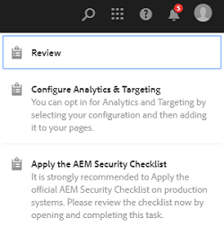

# [!DNL Adobe Experience Manager Assets]中的私人資料夾 {#private-folder}

| 版本 | 文章連結 |
| -------- | ---------------------------- |
| AEM as a Cloud Service  | [按一下這裡](https://experienceleague.adobe.com/docs/experience-manager-cloud-service/content/assets/manage/private-folder.html?lang=en) |
| AEM 6.5 | 本文章 |

您可以在[!DNL Adobe Experience Manager Assets]使用者介面中建立您專屬的私人資料夾。 您可以與其他使用者共用此私人資料夾，並為他們指派各種許可權。 根據您指派的許可權層級，使用者可以在資料夾上執行各種工作，例如，檢視資料夾內的資產或編輯資產。

>[!NOTE]
>
>私人資料夾至少有一個成員具有擁有者角色。

## 私人資料夾的建立和共用 {#create-share-private-folder}

若要建立和共用私人資料夾：

1. 在[!DNL Assets]主控台中，按一下工具列中的[建立] ****，然後從功能表中選擇[資料夾] ****。

   

1. 在&#x200B;**[!UICONTROL 建立資料夾]**&#x200B;對話方塊中，輸入資料夾的標題和名稱（選擇性），並選取&#x200B;**[!UICONTROL 私人]**&#x200B;選項。

1. 按一下「**[!UICONTROL 建立]**」。已建立私人資料夾。

   

1. 若要與其他使用者共用資料夾以及為其指派許可權，請選取該資料夾，然後按一下工具列中的&#x200B;**[!UICONTROL 內容]**。

   

   >[!NOTE]
   >
   >在您共用資料夾之前，其他使用者看不到該資料夾。

1. 在&#x200B;**[!UICONTROL 資料夾屬性]**&#x200B;頁面中，從&#x200B;**[!UICONTROL 新增使用者]**&#x200B;清單中選取使用者，將角色指派給私人資料夾中的使用者，然後按一下&#x200B;**[!UICONTROL 新增]**。

   

   >[!NOTE]
   >
   >您可以將各種角色（例如`Editor`、`Owner`或`Viewer`）指派給共用資料夾的使用者。 如果您將`Owner`角色指派給使用者，則使用者擁有資料夾的`Editor`許可權。 此外，使用者可以與其他人共用資料夾。 如果您指派`Editor`角色，使用者可以編輯您私人資料夾中的資產。 如果您指派檢視器角色，則使用者只能檢視您私人資料夾中的資產。

   >[!NOTE]
   >
   >私人資料夾至少有一個成員具有`Owner`角色。 因此，管理員無法從私人資料夾中移除所有擁有者成員。 但是，若要從私人資料夾中移除現有的擁有者（以及管理員本身），管理員必須新增其他使用者作為擁有者。

1. 按一下「**[!UICONTROL 儲存]**」。根據您指派的角色，當使用者登入[!DNL Assets]時，會指派一組許可權給使用者處理您的私人資料夾。
1. 按一下&#x200B;**[!UICONTROL 確定]**&#x200B;關閉確認訊息。
1. 共用資料夾的使用者會收到共用通知。 使用使用者的認證登入[!DNL Assets]以檢視通知。

   

1. 按一下[!UICONTROL 通知]以開啟通知清單。

   

1. 按一下管理員共用的私人資料夾專案，以開啟資料夾。

>[!NOTE]
>
>若要建立私人資料夾，您必須在要建立私人資料夾的父資料夾上要求讀取和修改[存取控制許可權](/help/sites-administering/security.md#permissions-in-aem)。 如果您不是管理員，預設不會在`/content/dam`上為您啟用這些許可權。 在這種情況下，請先為您的使用者ID/群組取得這些許可權，然後再嘗試建立私人資料夾。

## 私人資料夾刪除 {#delete-private-folder}

您可以選取資料夾，然後從頂端功能表選取[!UICONTROL 刪除]選項，或使用鍵盤上的退格鍵來刪除資料夾。

>[!CAUTION]
>
>如果您從CRXDE Lite中刪除私人資料夾，則多餘的使用者群組會留在存放庫中。

>[!NOTE]
>
>如果您從使用者介面中使用上述方法刪除資料夾，則關聯的使用者群組也會一併刪除。
>
>不過，現有的備援、未使用和自動產生的使用者群組，可以在編寫執行個體(`http://[server]:[port]/system/console/jmx/com.day.cq.dam.core.impl.team%3Atype%3DClean+redundant+groups+for+Assets`)中使用JMX中的`clean`方法從存放庫中移除。
