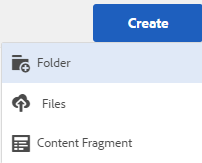
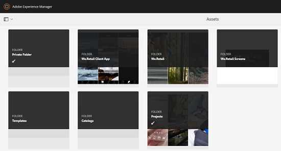
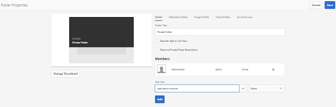
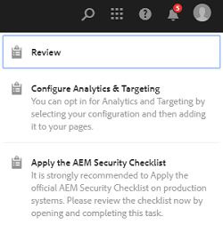
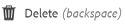

# Private folder in [!DNL Adobe Experience Manager Assets] {#private-folder}

| 版本 | 文章連結 |
| -------- | ---------------------------- |
| AEM as a Cloud Service | [按一下這裡](https://experienceleague.adobe.com/docs/experience-manager-cloud-service/content/assets/manage/private-folder.html?lang=zh-Hant) |
| AEM 6.5 | 本文章 |

You can create a private folder in the [!DNL Adobe Experience Manager Assets] user interface that is available exclusively to you. You can share this private folder to other users and assign various privileges to them. Based on the privilege level you assign, users can perform various tasks on the folder, for example, view assets within the folder or edit the assets.

>[!NOTE]
>
>Private folder has at least one member with Owner role.

## Private folder creation and sharing {#create-share-private-folder}

To create and share private folder:

1. In the [!DNL Assets] console, click **[!UICONTROL Create]** from the toolbar and then choose **[!UICONTROL Folder]** from the menu.

   

1. In the **[!UICONTROL Create Folder]** dialog, enter a title and name (optional) for the folder, and select **[!UICONTROL Private]** option.

1. 按一下「**[!UICONTROL 建立]**」。 A private folder is created.

   

1. To share the folder with other users and the assign privileges to them, select the folder, and click **[!UICONTROL Properties]** from the toolbar.

   

   >[!NOTE]
   >
   >The folder is not visible to any other user until you share it.

1. In the **[!UICONTROL Folder Properties]** page, select a user from the **[!UICONTROL Add User]** list, assign a role to the user on your private folder, and click **[!UICONTROL Add]**.

   

   >[!NOTE]
   >
   >You can assign various roles, such as `Editor`, `Owner`, or `Viewer` to the user with whom you share the folder. If you assign an `Owner` role to the user, the user has `Editor` privileges on the folder. In addition, the user can share the folder with others. If you assign an `Editor` role, the user can edit the assets in your private folder. If you assign a viewer role, the user can only view the assets in your private folder.

   >[!NOTE]
   >
   >Private folder has at least one member with `Owner` role. Therefore, administrator cannot remove all the owner members from a private folder. 但是，若要從私人資料夾中移除現有的擁有者（以及管理員本身），管理員必須新增其他使用者作為擁有者。

1. 按一下「**[!UICONTROL 儲存]**」。 根據您指派的角色，當使用者登入[!DNL Assets]時，會指派一組許可權給使用者處理您的私人資料夾。
1. 按一下&#x200B;**[!UICONTROL 確定]**&#x200B;關閉確認訊息。
1. 共用資料夾的使用者會收到共用通知。 使用使用者的認證登入[!DNL Assets]以檢視通知。

   

1. 按一下[!UICONTROL 通知]以開啟通知清單。

   

1. 按一下管理員共用的私人資料夾專案，以開啟資料夾。

>[!NOTE]
>
>若要建立私人資料夾，您必須在要建立私人資料夾的父資料夾上要求讀取和修改[存取控制許可權](/help/sites-administering/security.md#permissions-in-aem)。 如果您不是管理員，預設不會在`/content/dam`上為您啟用這些許可權。 在這種情況下，請先為您的使用者ID/群組取得這些許可權，然後再嘗試建立私人資料夾。

## 私人資料夾刪除 {#delete-private-folder}

您可以選取資料夾，然後從頂端功能表選取[!UICONTROL 刪除]選項，或使用鍵盤上的退格鍵來刪除資料夾。

>[!CAUTION]
>
>如果您從CRXDE Lite刪除私人資料夾，則多餘的使用者群組會留在存放庫中。

>[!NOTE]
>
>如果您從使用者介面中使用上述方法刪除資料夾，則關聯的使用者群組也會一併刪除。
>
>不過，現有的備援、未使用和自動產生的使用者群組，可以在編寫執行個體(`http://[server]:[port]/system/console/jmx/com.day.cq.dam.core.impl.team%3Atype%3DClean+redundant+groups+for+Assets`)中使用JMX中的`clean`方法從存放庫中移除。
