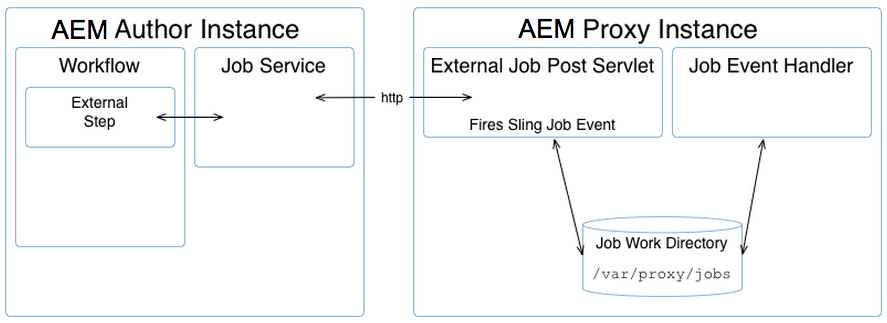

# [!DNL Assets] Proxy開發 {#assets-proxy-development}

[!DNL Adobe Experience Manager Assets]使用Proxy來分配特定工作的處理。

Proxy是一種特定（有時是獨立的） Experience Manager執行個體，它使用Proxy背景工作器作為負責處理工作並建立結果的處理器。 Proxy Worker可用於多種任務。 如果有[!DNL Assets] Proxy，這可用來載入資產，以便在Assets中呈現。 例如，[IDS Proxy背景工作](indesign.md)使用[!DNL Adobe InDesign]伺服器來處理檔案以用於Assets。

當Proxy是單獨的[!DNL Experience Manager]執行個體時，這有助於減少[!DNL Experience Manager]編寫執行個體的負載。 根據預設，[!DNL Assets]會在相同的JVM中執行資產處理工作（透過Proxy外部化），以減少[!DNL Experience Manager]編寫執行個體的負載。

## Proxy （HTTP存取） {#proxy-http-access}

Proxy可透過HTTP Servlet使用，當它設定為接受處理工作於： `/libs/dam/cloud/proxy`時。 此servlet會根據發佈的引數建立Sling作業。 然後，這會新增至Proxy工作佇列，並連線至適當的Proxy背景工作。

### 支援的作業 {#supported-operations}

* `job`

  **需求**：引數`jobevent`必須設定為序列化值對應。 這可用來建立工作處理器的`Event`。

  **結果**：新增工作。 如果成功，則會傳回唯一的工作ID。

```shell
curl -u admin:admin -F":operation=job" -F"someproperty=xxxxxxxxxxxx"
    -F"jobevent=serialized value map" http://localhost:4502/libs/dam/cloud/proxy
```

* `result`

  **需求**：必須設定引數`jobid`。

  **Result**: Returns a JSON representation of the result Node as created by the job processor.

```shell
curl -u admin:admin -F":operation=result" -F"jobid=xxxxxxxxxxxx"
    http://localhost:4502   /libs/dam/cloud/proxy
```

* `resource`

  **Requirements**: the parameter jobid must be set.

  **Result**: Returns a resource associated with the given job.

```shell
curl -u admin:admin -F":operation=resource" -F"jobid=xxxxxxxxxxxx"
    -F"resourcePath=something.pdf" http://localhost:4502/libs/dam/cloud/proxy
```

* `remove`

  **Requirements**: the parameter jobid must be set.

  **Results**: Removes a job if found.

```shell
curl -u admin:admin -F":operation=remove" -F"jobid=xxxxxxxxxxxx"
    http://localhost:4502/libs/dam/cloud/proxy
```

### Proxy Worker {#proxy-worker}

A proxy worker is a processor responsible for handling a job and creating a result. Workers reside on the proxy instance and must implement [sling JobProcessor](https://sling.apache.org/site/eventing-and-jobs.html) to be recognized as a proxy worker.

>[!NOTE]
>
>The worker must implement [sling JobProcessor](https://sling.apache.org/site/eventing-and-jobs.html) to be recognized as a proxy worker.

### Client API {#client-api}

[`JobService`](https://helpx.adobe.com/experience-manager/6-5/sites/developing/using/reference-materials/javadoc/index.html) is available as an OSGi service that provides methods to create jobs, remove jobs and to get results from those jobs. The default implementation of this service (`JobServiceImpl`) uses the HTTP client to communicate with the remote proxy servlet.

The following is an example of API usage:

```java
@Reference
 JobService proxyJobService;

 // to create a job
 final Hashtable props = new Hashtable();
 props.put("someproperty", "some value");
 props.put(JobUtil.PROPERTY_JOB_TOPIC, "myworker/job"); // this is an identifier of the worker
 final String jobId = proxyJobService.addJob(props, new Asset[]{asset});

 // to check status (returns JobService.STATUS_FINISHED or JobService.STATUS_INPROGRESS)
 int status = proxyJobService.getStatus(jobId)

 // to get the result
 final String jsonString = proxyJobService.getResult(jobId);

 // to remove job and cleanup
 proxyJobService.removeJob(jobId);
```

### Cloud Service configurations {#cloud-service-configurations}

<!--
TBD: Cannot find com.day.cq.dam.api.proxy at https://helpx.adobe.com/experience-manager/6-5/sites/developing/using/reference-materials/javadoc/index.html which were generated in May 2020. Hiding this broken link for now.
>[!NOTE]
>
>Reference documentation for the proxy API is available under [`com.day.cq.dam.api.proxy`](https://helpx.adobe.com/experience-manager/6-5/sites/developing/using/reference-materials/javadoc/com/day/cq/dam/api/proxy/package-summary.html).
-->

Both proxy and proxy worker configurations are available via cloud services configurations as accessible from the [!DNL Assets] **Tools** console or under `/etc/cloudservices/proxy`. Each proxy worker is expected to add a node under `/etc/cloudservices/proxy` for worker specific configuration details (for example, `/etc/cloudservices/proxy/workername`).

>[!NOTE]
>
>See [InDesign Server Proxy Worker configuration](indesign.md#configuring-the-proxy-worker-for-indesign-server) and [Cloud Services configuration](../sites-developing/extending-cloud-config.md) for more information.

The following is an example of API usage:

```java
@Reference(policy = ReferencePolicy.STATIC)
 ProxyConfig proxyConfig;

 // to get proxy config
 Configuration cloudConfig = proxyConfig.getConfiguration();
 final String value = cloudConfig.get("someProperty", "defaultValue");

 // to get worker config
 Configuration cloudConfig = proxyConfig.getConfiguration("workername");
 final String value = cloudConfig.get("someProperty", "defaultValue");
```

### Developing a Customized Proxy Worker {#developing-a-customized-proxy-worker}

The [IDS proxy worker](indesign.md) is an example of a [!DNL Assets] proxy worker that is already provided out-of-the-box to outsource the processing of InDesign assets.

You can also develop and configure your own [!DNL Assets] proxy worker to create a specialized worker to dispatch and outsource your [!DNL Assets] processing tasks.

Setting up your own custom proxy worker requires you to:

* Set up and implement (using Sling eventing):

   * a custom job topic
   * a custom job event handler

* 然後使用JobService API來：

   * 將您的自訂工作分派給Proxy
   * 管理您的工作

* 如果您想要使用工作流程的Proxy，您必須使用WorkflowExternalProcess API和JobService API實作自訂外部步驟。

以下圖表和步驟詳細說明如何繼續：



>[!NOTE]
>
>在下列步驟中，InDesign的對等項會以參考範例表示。

1. 已使用[Sling工作](https://sling.apache.org/site/eventing-and-jobs.html)，因此您需要為使用案例定義工作主題。

   例如，請參閱`IDSJob.IDS_EXTENDSCRIPT_JOB`以取得IDS Proxy背景工作。

1. 外部步驟會用於觸發事件，然後等待直到完成；這是透過輪詢ID來完成。 開發您自己的步驟來實作新功能。

   實作`WorkflowExternalProcess`，然後使用JobService API和您的工作主題來準備工作事件，並將其分派到JobService （OSGi服務）。

   例如，請參閱`INDDMediaExtractProcess`.java以取得IDS Proxy背景工作。

1. 實作您主題的工作處理常式。 此處理常式需要開發，以便執行您的特定動作，並被視為背景工作實作。

   例如，請參閱`IDSJobProcessor.java`以取得IDS Proxy背景工作。

1. 在dam-commons中使用`ProxyUtil.java`。 這可讓您使用dam Proxy將工作分派給背景工作。

>[!NOTE]
>
>[!DNL Assets] Proxy架構未提供現成可用的是集區機制。
>
>[!DNL InDesign]整合允許存取[!DNL InDesign]部伺服器(IDSPool)的集區。 此集區專屬於[!DNL InDesign]整合，不是[!DNL Assets] Proxy架構的一部分。

>[!NOTE]
>
>結果的同步化：
>
>如果有n個執行個體使用相同的Proxy，處理結果會保留在Proxy。 使用者端（Experience Manager作者）的作業是使用建立作業時提供給使用者端的相同唯一作業ID來請求結果。 Proxy只會讓工作完成，並讓結果準備好進行要求。
