# 相關資產 {#related-assets}

您可以透過 [!DNL Adobe Experience Manager Assets] 使用相關資產功能，根據組織的需求手動建立資產關聯。 例如，您可以將授權檔案與類似主題的資產或影像/影片建立關聯。 您可以將具有特定通用屬性的資產建立關聯。 您也可以使用此功能來建立資產之間的來源/衍生關係。 例如，如果您有一個從 INDD 檔案產生的 PDF 檔案，您可以將 PDF 檔案與其來源 INDD 檔案相關聯。

使用此功能，您可以彈性地與供應商或機構共用低解析度的 PDF 檔案或 JPG 檔案，並僅在對方提出要求時提供高解析度的 INDD 檔案。

>[!NOTE]
>
>唯有具有資產之編輯權限的使用者才能建立資產的關聯或取消其關聯。

## 相關資產 {#relating-assets}

1. 於 [!DNL Experience Manager] 介面，開啟要建立關聯之資產的「**[!UICONTROL 屬性]**」頁面。

   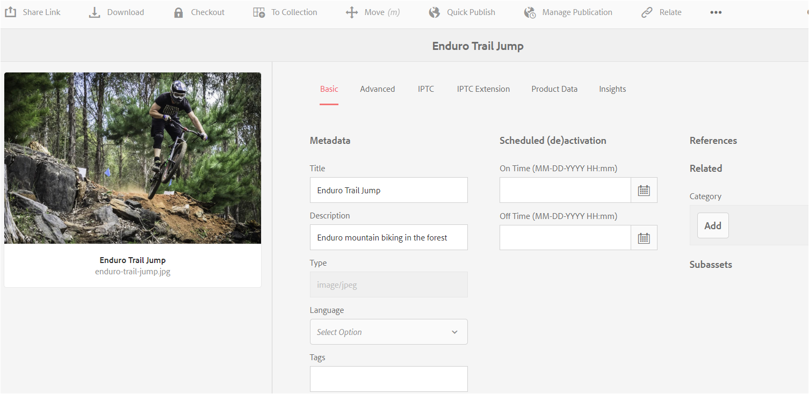

   *圖： [!DNL Assets] [!UICONTROL 屬性]頁面以關聯資產。*

   或者，從清單檢視中選取資產。

   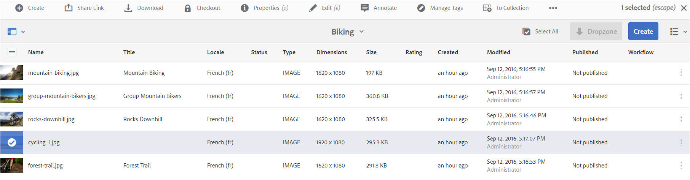

   您也可以從集合中選取資產。

   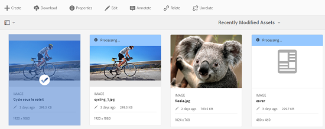

1. 若要將另一個資產與您選取的資產建立關聯，請從工具列按一下&#x200B;**[!UICONTROL 關聯]** 。
1. 執行下列任一項作業：

   * 若要關聯資產的來源檔案，請從清單中選取&#x200B;**[!UICONTROL Source]**。
   * 若要關聯衍生檔案，請從清單中選取&#x200B;**[!UICONTROL 衍生]**。
   * 若要在資產之間建立雙向關係，請從清單中選取&#x200B;**[!UICONTROL 其他]**。

1. 從&#x200B;**[!UICONTROL 選取資產]**&#x200B;畫面中，導覽至您要建立關聯的資產位置，然後選取該資產。

   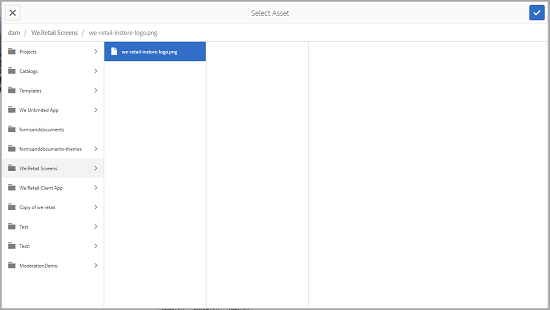

1. 按一下&#x200B;**[!UICONTROL 確認]**。
1. 按一下&#x200B;**[!UICONTROL 確定]**&#x200B;關閉對話方塊。 根據您在步驟3中選擇的關係，相關資產會列在&#x200B;**[!UICONTROL 相關]**&#x200B;區段的適當類別下。 例如，如果您關聯的資產是目前資產的來源檔案，則會列在「**[!UICONTROL 來源]**」之下。

   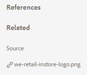

1. 若要取消關聯資產，請從工具列按一下&#x200B;**[!UICONTROL 取消關聯]** 。

1. 從&#x200B;**[!UICONTROL 移除關係]**&#x200B;對話方塊中選取您要取消關聯的資產，然後按一下&#x200B;**[!UICONTROL 取消關聯]**。

   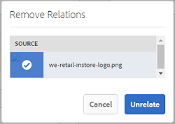

1. 按一下&#x200B;**[!UICONTROL 確定]**&#x200B;關閉對話方塊。 您移除關係的資產會從&#x200B;**[!UICONTROL 相關]**&#x200B;區段下的相關資產清單中刪除。

## 翻譯已關聯資產 {#translating-related-assets}

使用關聯資產功能在資產之間建立來源/衍生關係，對於翻譯工作流程也很有幫助。 當您在衍生資產上執行翻譯工作流程時，[!DNL Experience Manager Assets] 會自動擷取來源檔案參照的任何資產，並將其加入翻譯中。 如此一來，來源資產所參照的資產會與來源和衍生資產一併翻譯。 例如，假設您的英文副本包含衍生資產及其來源檔案（如圖所示）。

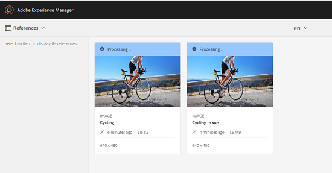

如果來源檔案與另一個資產關聯，[!DNL Experience Manager Assets] 會擷取所參照的資產並將其加入翻譯中。

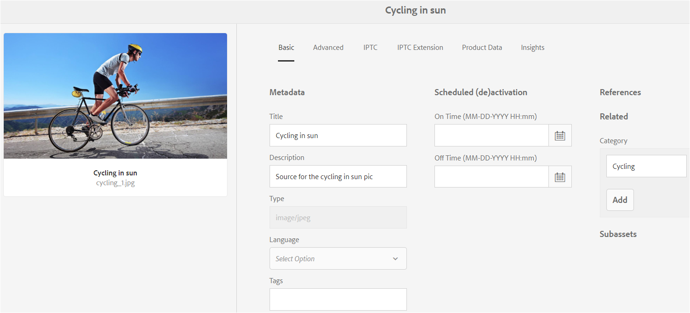

*圖：要納入翻譯之相關資產的Source資產。*

1. 依照[建立翻譯專案](translation-projects.md#create-a-new-translation-project)中的步驟，將來源資料夾中的資產翻譯成目標語言。 例如，在此案例中，請將您的資產翻譯為法文。

1. 從[!UICONTROL 專案]頁面，開啟翻譯資料夾。

1. 按一下專案拼貼以開啟詳細資訊頁面。

   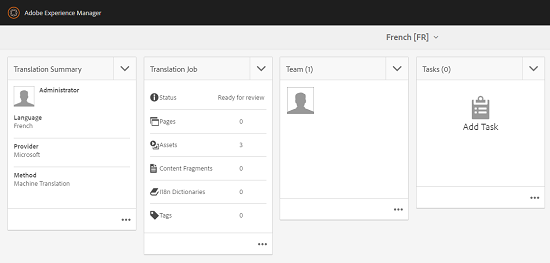

1. 按一下翻譯工作卡片下方的省略符號以檢視翻譯狀態。

   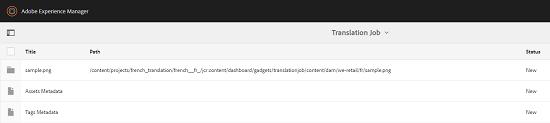

1. 選取資產，然後從工具列按一下&#x200B;**[!UICONTROL 在Assets中顯示]**&#x200B;以檢視資產的翻譯狀態。

   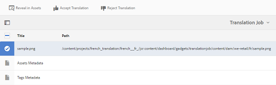

1. 若要驗證與來源相關的資產是否已翻譯，請按一下來源資產。

1. 選取與來源相關的資產，然後按一下[在Assets中顯示] **&#x200B;**。 隨即顯示翻譯的相關資產。
