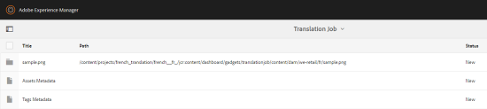

# 相關資產 {#related-assets}

Adobe Experience Manager(AEM)Assets可讓您使用相關資產功能，根據組織的需求手動建立資產關聯。 例如，您可以將授權檔案與類似主題上的資產或影像／視訊建立關聯。 您可以建立與共用特定共同屬性的資產關聯。 您也可以使用此功能來建立資產間的來源／衍生關係。 例如，如果您有PDF檔案是從INDD檔案產生，則可將PDF檔案與其來源INDD檔案建立關聯。

使用此功能，您就可以彈性地與廠商或機構共用低解析度的PDF檔案或JPG檔案，並且只有在要求時才提供高解析度的INDD檔案。

## Relate assets {#relating-assets}

1. 從AEM介面，開啟您 [!UICONTROL 要建立關聯之資產的「屬性] 」頁面。

   

   或者，從清單檢視中選取資產。

   

   您也可以從系列中選取資產。

   

1. 若要將另一個資產與您選取的資產建立關聯，請按一下／點選工具 **[!UICONTROL 列中的]** 「建立關聯」圖示。

   

1. 執行下列任一項作業：

   * 要關聯資產的源檔案，請從清單中 **[!UICONTROL 選擇]** 「源」。
   * 要關聯派生檔案，請從列 **[!UICONTROL 表中選擇]** 「派生」。
   * 若要在資產之間建立雙向關係，請從清單中選 **[!UICONTROL 取]** 「其他」。
   

1. 從「選 **[!UICONTROL 取資產]** 」畫面，導覽至您要建立關聯的資產所在的位置，然後加以選取。

   

1. 按一下／點選「 **[!UICONTROL 確認]** 」圖示。
1. 按一下／點選「 **[!UICONTROL 確定]** 」以關閉對話方塊。 根據您在步驟3中選擇的關係，相關資產會列在「相關」區段的適當類別 **[!UICONTROL 下]** 。 例如，如果您相關的資產是目前資產的來源檔案，則會列在「來源」 **[!UICONTROL 下]**。

   

1. 若要解除資產的關聯，請按一下工具列中的「取消 **[!UICONTROL 關聯]** 」(Unrelate)。

   

1. 從「移除關係」( **[!UICONTROL Remove Relations]** )對話框中選取要解除關聯的資產，然後按一下／點選「取消關 **[!UICONTROL 聯」(Unrelate)]**。

   

1. 按一下／點選「 **[!UICONTROL 確定]** 」以關閉對話方塊。 移除關係的資產會從「相關」(Related)區段下的相關資產清單中 **[!UICONTROL 刪除]** 。

## 折算相關資產 {#translating-related-assets}

使用「相關資產」功能建立資產間的來源／衍生關係，在轉譯工作流程中也很有幫助。 當您對衍生資產執行轉譯工作流程時，AEM Assets會自動擷取來源檔案所參照的任何資產，並將其納入轉譯。 這樣，源資產引用的資產與源資產和衍生資產一起折算。 例如，假設您的英文版副本包含衍生資產及其來源檔案，如所示。

如果來源檔案與其他資產相關，AEM Assets會擷取參考的資產並加入它以進行轉換。

1. 遵循「建立新翻譯專案」中的步驟，將來源檔案夾中的資產翻譯 [成目標語言](translation-projects.md#create-a-new-translation-project)。 例如，在此例中，請將您的資產翻譯為法文。
1. 從「項 [!UICONTROL 目] 」頁開啟翻譯資料夾。

   

1. 按一下／點選專案圖格以開啟詳細資訊頁面。

   

1. 按一下／點選翻譯工作卡下的省略號以查看翻譯狀態。

   

1. 選取資產，然後從工具列按一下／點 **[!UICONTROL 選「在資產中顯現]** 」，以檢視資產的轉換狀態。

   

1. 若要確認是否已轉換與來源相關的資產，請按一下／點選來源資產。

   

1. 選取與來源相關的資產，然後按一下／點選「在資產中顯 **[!UICONTROL 示」]**。 會顯示已轉換的相關資產。

   
