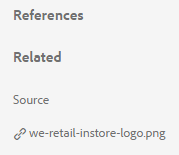

# 相關資產 {#related-assets}

[!DNL Adobe Experience Manager Assets] 允許您使用相關資產功能根據組織的需要手動關聯資產。 例如，可以將許可證檔案與類似主題上的資產或影像/視頻相關聯。 您可以將共用某些公共屬性的資產關聯起來。 您還可以使用該功能在資產之間建立源/派生關係。 例如，如果有從INDD檔案生成的PDF檔案，則可以將PDF檔案與其源INDD檔案相關。

使用此功能，您可以靈活地與供應商或代理共用低解析度PDF檔案或JPG檔案，並且僅在請求時才可用高解析度INDD檔案。

>[!NOTE]
>
>只有對資產具有編輯權限的用戶才能關聯和解除資產關聯。

## 相關資產 {#relating-assets}

1. 從 [!DNL Experience Manager] 介面，開啟 **[!UICONTROL 屬性]** 頁面中，您需要關聯的資產。

   

   *圖： [!DNL Assets] [!UICONTROL 屬性] 與資產相關。*

   或者，從清單視圖中選擇資產。

   

   您也可以從集合中選擇資產。

   

1. 要將另一資產與所選資產關聯，請按一下 **[!UICONTROL 相關]**  的子菜單。
1. 執行下列任一項作業：

   * 要將資產的源檔案關聯，請選擇 **[!UICONTROL 源]** 清單中。
   * 要關聯派生檔案，請選擇 **[!UICONTROL 派生]** 清單中。
   * 要在資產之間建立雙向關係，請選擇 **[!UICONTROL 其他]** 清單中。

1. 從 **[!UICONTROL 選擇資產]** 螢幕中，導航到要關聯的資產的位置，然後選擇它。

   

1. 按一下 **[!UICONTROL 確認]**。
1. 按一下 **[!UICONTROL 確定]** 按鈕 根據您在步驟3中選擇的關係，相關資產將列在「」中相應的類別下 **[!UICONTROL 相關]** 的子菜單。 例如，如果您相關的資產是當前資產的源檔案，則會在 **[!UICONTROL 源]**。

   

1. 要取消與資產關聯，請按一下 **[!UICONTROL 取消關聯]**  的子菜單。

1. 從中選擇要取消關聯的資產 **[!UICONTROL 刪除關係]** 對話框，然後按一下 **[!UICONTROL 取消關聯]**。

   

1. 按一下 **[!UICONTROL 確定]** 按鈕 您刪除的關係的資產將從 **[!UICONTROL 相關]** 的子菜單。

## 轉換相關資產 {#translating-related-assets}

使用相關資產功能在資產之間建立源/派生關係在翻譯工作流中也有幫助。 在派生資產上運行翻譯工作流時， [!DNL Experience Manager Assets] 自動提取源檔案引用並包含的任何資產以供翻譯。 這樣，源資產引用的資產與源資產和派生資產一起進行折算。 例如，假設您的英語副本包含派生資產及其源檔案的方案如所示。

如果源檔案與另一個資產相關， [!DNL Experience Manager Assets] 讀取引用的資產並包括它以進行轉換。

*圖：相關資產之來源資產以供換算。*

1. 按照中的步驟將源資料夾中的資產翻譯為目標語言 [新建翻譯項目](translation-projects.md#create-a-new-translation-project)。 例如，在本例中，將您的資產翻譯為法語。

1. 從 [!UICONTROL 項目] 的子菜單。

1. 按一下項目磁貼以開啟詳細資訊頁面。

   

1. 按一下「翻譯作業」卡下的省略號以查看翻譯狀態。

   

1. 選擇資產，然後按一下 **[!UICONTROL 在資產中顯示]** 的子菜單。

   

1. 要驗證是否已轉換與源相關的資產，請按一下源資產。

1. 選擇與源相關的資產，然後按一下 **[!UICONTROL 在資產中顯示]**。 將顯示已轉換的相關資產。
