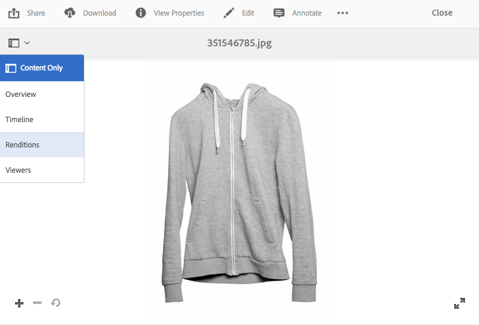

# 為回應式網站傳送最佳化影像 {#delivering-optimized-images-for-a-responsive-site}

當您想要與網頁開發人員共用程式碼以進行回應式服務時，請使用回應式程式碼功能。 您將回應式(**[!UICONTROL RESS]**)程式碼複製到剪貼簿，以便與Web開發人員共用。

如果您的網站位於協力廠商WCM，則使用此功能有意義。 不過，如果您的網站是AEM,Offsite影像伺服器會轉譯影像並提供給網頁。

另請參閱[在網頁上嵌入視頻查看器](embed-code.md)。

另請參閱[將URL連結到Web應用程式](linking-urls-to-yourwebapplication.md)。

**若要為回應式網站提供最佳化的影像：**

1. 導覽至您要為提供回應式程式碼的影像，然後在下拉式選單中，點選&#x200B;**[!UICONTROL 轉譯]**。

   

1. 選取回應式影像預設集。URL **[!UICONTROL 和]****[!UICONTROL RESS]** 按鈕出現。

   

   >[!NOTE]
   >
   >必須發佈 *選取的資產* ，以及選取的影像預設集或檢視器預設集，才能使 **[!UICONTROL URL]** 或 **[!UICONTROL RESS]** 按鈕可用。
   >
   >Dynamic Media — 混合模式需要您發佈影像預設集；Dynamic Media - Scene7模式會自動發佈影像預設集。

1. 點選&#x200B;**[!UICONTROL RESS]**。

   

1. 在&#x200B;**[!UICONTROL 內嵌回應式影像]**&#x200B;對話方塊中，選取並複製回應式程式碼文字，並貼到您的網站中以存取回應式資產。
1. 編輯內嵌程式碼中的預設中斷點，以直接比對程式碼中回應式網站的中斷點。 此外，測試在不同頁面斷點處提供的不同影像解析度。

## 使用HTTP/2傳送Dynamic Media資產{#using-http-to-delivery-your-dynamic-media-assets}

HTTP/2是全新、更新的Web通訊協定，可改善瀏覽器和伺服器的通訊方式。 它提供了更快的資訊傳輸，並降低了所需的處理能力。 支援使用HTTP/2來傳送Dynamic Media資產，以提供更理想的回應和載入時間。

如需開始使用Dynamic Media帳戶的HTTP/2的完整詳細資訊，請參閱[HTTP2內容傳送](http2.md)。
