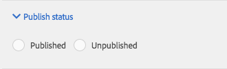

# 將Dynamic Media Classic功能添加到頁面 {#adding-scene-features-to-your-page}

[Adobe Dynamic Media Classic](https://experienceleague.adobe.com/docs/dynamic-media-classic/using/home.html) 是一個托管解決方案，用於管理、增強、發佈富媒體資產，並將富媒體資產交付到Web 、移動、電子郵件和網際網路連接的顯示和打印。

您可以通過各種查看者查看在Dynamic Media Classic發佈的Experience Manager資產：

* 縮放
* 飛出
* 影片
* 影像範本
* 影像

您可以直接將數字資產從Experience Manager發佈到Dynamic Media Classic，也可以將數字資產從Dynamic Media Classic發佈到Experience Manager。

本文檔介紹如何發佈從Experience Manager到Dynamic Media Classic的數字資產，反之亦然。 還對查看者進行了詳細描述。 有關為Dynamic Media Classic配置Experience Manager的資訊，請參見 [將Dynamic Media Classic與Experience Manager](/help/sites-administering/scene7.md)。

另請參閱 [添加影像映射](image-maps.md)。

有關使用帶Experience Manager的視頻元件的詳細資訊，請參見 [視頻](video.md)。

>[!NOTE]
>
>如果Dynamic Media Classic資產顯示不正確，請確保Dynamic Media [禁用](config-dynamic.md#disabling-dynamic-media) 然後刷新頁面。

## 從資產手動發佈到Dynamic Media Classic {#manually-publishing-to-scene-from-assets}

您可以按如下方式向Dynamic Media Classic發佈數字資產：

* [在Assets控制台的經典用戶介面中](/help/sites-classic-ui-authoring/manage-assets-classic-s7.md#publishing-from-the-assets-console)
* [在來自資產的經典用戶介面中](/help/sites-classic-ui-authoring/manage-assets-classic-s7.md#publishing-from-an-asset)
* [在CQ目標資料夾外的經典用戶介面中](/help/sites-classic-ui-authoring/manage-assets-classic-s7.md#publishing-assets-from-outside-the-cq-target-folder)

>[!NOTE]
>
>Experience Manager非同步發行到Dynamic Media Classic。 選擇後 **[!UICONTROL 發佈]**，您的資產要花幾秒鐘時間才能發佈到Dynamic Media Classic。

## Dynamic Media Classic元件 {#scene-components}

以下Dynamic Media Classic元件可在Experience Manager中提供：

* 縮放
* 浮動（縮放）
* 影像範本
* 影像
* 影片

>[!NOTE]
>
>預設情況下，這些元件不可用，必須在 **[!UICONTROL 設計]** 模式。

在中提供它們後 **[!UICONTROL 設計]** 模式下，您可以像其他任何Experience Manager元件一樣將元件添加到頁面。 尚未發佈到Dynamic Media Classic的資產將發佈到Dynamic Media Classic(如果位於同步資料夾中、頁面中或具有Dynamic Media Classic雲配置)。

>[!NOTE]
>
>如果要建立和開發自定義查看器並使用Content Finder，則必須顯式添加 `allowfullscreen` 的下界。

### Flash 檢視器生命週期結束注意事項 {#flash-viewers-end-of-life-notice}

自2017年1月31日起，Adobe Dynamic Media Classic終止對Flash觀看平台的支援。

### 將Dynamic Media Classic(Scene7)元件添加到頁面 {#adding-a-scene-component-to-a-page}

將Dynamic Media Classic(Scene7)元件添加到頁面與將元件添加到任何頁面相同。 Dynamic Media Classic元件在以下各節中作了詳細說明。

**要將Dynamic Media Classic(Scene7)元件添加到頁面：**

1. 在Experience Manager中，開啟要添加 **[!UICONTROL Dynamic Media Classic(Scene7)]** 元件。

1. 如果沒有可用的Dynamic Media Classic元件，請選擇 **[!UICONTROL 設計]** 模式，選擇任何具有藍色邊框的元件，選擇 **[!UICONTROL 父級]** ，然後 **[!UICONTROL 配置]** 表徵圖 在 **[!UICONTROL 參數（設計）]**，選擇所有Dynamic Media Classic元件以使其可用，然後選擇 **[!UICONTROL 確定]**。

   

1. 選擇 **[!UICONTROL 編輯]** 這樣你就可以 **[!UICONTROL 編輯]** 的子菜單。

1. 將副腳中的元件從Dynamic Media Classic組拖到所需位置的頁面上。

1. 選擇 **[!UICONTROL 配置]** 表徵圖以開啟元件。

1. 根據需要編輯元件並選擇 **[!UICONTROL 確定]** 的子菜單。
1. 將影像或視頻從內容瀏覽器拖到您添加到頁面的Dynamic Media Classic元件上。

   >[!NOTE]
   >
   >僅在UI中，必須將影像或視頻拖放到您放置在頁面上的Dynamic Media Classic元件上。 不支援選擇和編輯Dynamic Media Classic元件，然後選擇資產。

### 向響應的站點添加互動式觀看體驗 {#adding-interactive-viewing-experiences-to-a-responsive-website}

對資產進行響應性設計意味著您的資產會根據其顯示位置進行調整。 通過響應性設計，可以在多個設備上有效地顯示相同的資產。

另請參閱 [網頁響應性設計](/help/sites-developing/responsive.md)。

**要向響應的站點添加互動式查看體驗，請執行以下操作：**

1. 登錄到Experience Manager，並確保 [配置的Adobe Dynamic Media ClassicCloud Services](/help/sites-administering/scene7.md#configuring-scene-integration) 還有Dynamic Media Classic的部件。

   >[!NOTE]
   >
   >如果Dynamic Media Classic元件不可用，請確保 [通過設計模式啟用它們](/help/sites-authoring/default-components-designmode.md)。

1. 在包含 **[!UICONTROL Dynamic Media Classic]** 元件已啟用，拖動 **[!UICONTROL 影像]** 元件。
1. 選擇元件並選擇配置表徵圖。
1. 在 **[!UICONTROL Dynamic Media Classic設定]** 頁籤。

   

1. 確認查看器正在響應性地調整大小，並且所有交互都針對案頭、平板電腦和移動設備進行了優化。

### 所有Dynamic Media Classic元件的公用設定 {#settings-common-to-all-scene-components}

儘管配置選項各不相同，但以下是所有配置的通用選項 [!UICONTROL Dynamic Media Classic] 元件：

* **[!UICONTROL 檔案引用]**  — 瀏覽到要引用的檔案。 檔案引用顯示資產URL，而不一定是包括URL命令和參數的完整Dynamic Media ClassicURL。 不能在此欄位中添加Dynamic Media ClassicURL命令和參數。 而是通過元件中的相應功能添加它們。
* **[!UICONTROL 寬度]**  — 用於設定寬度。
* **[!UICONTROL 高度]**  — 用於設定高度。

通過開啟（按兩下）Dynamic Media Classic元件(例如，在開啟 **[!UICONTROL 縮放]** 元件：

### 縮放 {#zoom}

HTML5縮放元件在按下 **[!UICONTROL +]** 按鈕

資產底部有縮放工具。 選擇 **[!UICONTROL +]** 要放大，選擇 **[!UICONTROL -]** 如果你想減少的話。 點擊 **[!UICONTROL x]** 或者，重置縮放箭頭會將影像恢復為原來導入的大小。 選取對角線箭頭，使其全屏。 選擇 **[!UICONTROL 編輯]** 這樣您就可以配置元件。 使用此元件，您可以 [所有設定 [!UICONTROL Dynamic Media Classic] 元件](#settings-common-to-all-scene-components)。

### 飛出 {#flyout}

在HTML5 **[!UICONTROL 飛出]** 顯示為拆分螢幕；將資產保留在指定的規模；右側顯示縮放部分。 選擇 **[!UICONTROL 編輯]** 這樣您就可以配置元件。 使用此元件，您可以 [所有Dynamic Media Classic元件公用的設定](#settings-common-to-all-scene-components)。

>[!NOTE]
>
>如果 **[!UICONTROL 飛出]** 元件使用自定義大小，然後使用自定義大小並禁用元件的響應設定。
>
>如果 **[!UICONTROL 飛出]** 元件使用預設大小，如中所設定 **[!UICONTROL 設計視圖]**，然後使用預設大小，元件將擴展以適應頁面佈局大小，並啟用元件的響應設定。 對元件的響應設定存在限制。 使用 **[!UICONTROL 飛出]** 具有響應性設定的元件，請勿將其用於全頁延伸。 否則， **[!UICONTROL 飛出]** 超出頁面的右邊框。

### 影像 {#image}

Dynamic Media Classic **[!UICONTROL 影像]** 元件允許您向影像添加Dynamic Media Classic功能，如Dynamic Media Classic修飾符、影像或查看器預設和銳化。 Dynamic Media Classic **[!UICONTROL 影像]** 與具有特殊Dynamic Media Classic功能的Experience Manager中的其他映像元件類似。 在此示例中，影像具有Dynamic Media ClassicURL修飾符， `&op_invert=1` 。

**[!UICONTROL 標題，替代文字]**  — 在 **[!UICONTROL 高級]** 頁籤，為圖形關閉的用戶添加標題和alt文本。

**[!UICONTROL URL，在中開啟]**  — 您可以設定資產，以開啟連結。 設定 **[!UICONTROL URL]** 在 **[!UICONTROL 開啟位置]** 指明是希望在同一窗口或新窗口中開啟。

**[!UICONTROL 查看器預設]**  — 從下拉菜單中選擇現有查看器預設。 如果您要查找的查看器預設不可見，則必須使其可見。 請參閱 [管理查看器預設](/help/assets/managing-viewer-presets.md)。 如果使用影像預設，則不能選擇查看器預設，反之，則無法選擇。

**[!UICONTROL Dynamic Media Classic配置]**  — 選擇要用於從SPS中提取活動影像預設的Dynamic Media Classic配置。

**[!UICONTROL 影像預設]**  — 從下拉菜單中選擇現有影像預設。 如果您要查找的影像預設不可見，則必須使其可見。 請參閱 [管理影像預設](/help/assets/managing-image-presets.md)。 如果使用影像預設，則不能選擇查看器預設，反之，則無法選擇。

**[!UICONTROL 輸出格式]**  — 選擇影像的輸出格式，例如jpeg。 根據您選擇的輸出格式，還有其它配置選項。 請參閱 [映像預設最佳實踐](/help/assets/managing-image-presets.md#image-preset-options)。

**[!UICONTROL 銳化]**  — 選擇銳化影像的方式。 銳化在以下方面進行了詳細說明： [映像預設最佳實踐](/help/assets/managing-image-presets.md#image-preset-options) 和 [加強最佳做法](/help/assets/assets/sharpening_images.pdf)。

**[!UICONTROL URL修飾符]**  — 通過提供附加的Dynamic Media Classic影像命令，可以更改影像效果。 這些命令在中介紹 [影像預設](/help/assets/managing-image-presets.md) 和 [命令引用](https://experienceleague.adobe.com/docs/dynamic-media-developer-resources/image-serving-api/image-serving-api/http-protocol-reference/command-reference/c-command-reference.html)。

**[!UICONTROL 斷點]**  — 如果網站響應，則要調整斷點。 斷點必須用逗號(,)分隔。

### 影像範本 {#image-template}

[Dynamic Media Classic影像模板](https://experienceleague.adobe.com/docs/dynamic-media-classic/using/template-basics/quick-start-template-basics.html) 是導入到Dynamic Media Classic的分層Photoshop內容，其中內容和屬性是參數化的，可變性。 的 **[!UICONTROL 影像模板]** 元件允許導入影像並動態更改Experience Manager中的文本。 此外，您還可以 **[!UICONTROL 影像模板]** 元件使用客戶端上下文中的值，以便每個用戶以個性化的方式體驗影像。

選擇 **[!UICONTROL 編輯]** 的子菜單。 您可以配置 [所有Dynamic Media Classic元件公用的設定](#settings-common-to-all-scene-components) 以及本節中介紹的其他設定。

**[!UICONTROL 檔案引用、寬度、高度]**  — 查看所有ScDynamic Media Classicene7元件的常用設定。

>[!NOTE]
>
>Dynamic Media ClassicURL命令和參數不能直接添加到檔案引用URL。 它們只能在元件UI中定義 **[!UICONTROL 參數]** 的子菜單。

**[!UICONTROL 標題，替代文字]**  — 在「Dynamic Media Classic影像模板」頁籤中，為影像關閉的用戶添加標題和替代文字。

**[!UICONTROL URL，在中開啟]**  — 您可以設定資產，以開啟連結。 設定URL，在「開啟」(Open)中，指明希望在同一窗口或新窗口中開啟它。

**[!UICONTROL 參數面板]**  — 導入映像時，參數會預先填充映像中的資訊。 如果沒有可動態更改的內容，則此窗口為空。

#### 動態更改文本 {#changing-text-dynamically}

要動態更改文本，請在欄位中輸入新文本，然後選擇 **[!UICONTROL 確定]**。 在此示例中， **[!UICONTROL 價格]** 現在是50美元，運費是99美分。

影像中的文本將更改。 可通過點擊將文本重置回原始值 **[!UICONTROL 重置]** 的子菜單。

#### 更改文本以反映客戶端上下文值的值 {#changing-text-to-reflect-the-value-of-a-client-context-value}

要將欄位連結到客戶端上下文值，請選擇 **[!UICONTROL 選擇]** 要開啟客戶端上下文菜單，請選擇客戶端上下文，然後選擇 **[!UICONTROL 確定]**。 在本示例中，名稱會根據將「名稱」與配置檔案中的格式化名稱連結而更改。

文本反映當前登錄用戶的名稱。 通過按一下，可將文本重置回原始值 **[!UICONTROL 重置]** 的子菜單。

#### 使Dynamic Media Classic影像模板成為連結 {#making-the-scene-image-template-a-link}

1. 在Dynamic Media Classic **[!UICONTROL 影像模板]** 元件，選擇 **[!UICONTROL 編輯]**。
1. 在 **[!UICONTROL URL]** 欄位，輸入用戶在點擊影像時轉到的URL。 在 **[!UICONTROL 開啟位置]** 欄位中，選擇是否要開啟目標（新窗口或同一窗口）。

   

1. 選擇 **[!UICONTROL 確定]**。

### 視頻元件 {#video-component}

Dynamic Media Classic **[!UICONTROL 視頻]** 元件(可從側腳的Dynamic Media Classic部分獲得)使用設備和頻寬檢測為每個螢幕提供正確的視頻。 該元件是HTML5視頻播放器；它是一個可以跨頻道使用的查看器。

它可用於自適應視頻集、單個MP4視頻或單個F4V視頻。

請參閱 [視頻](s7-video.md) 瞭解有關視頻如何與Dynamic Media Classic整合協作的更多資訊。 此外，請參見 [Dynamic Media Classic視頻元件與Foundation視頻元件](s7-video.md)。

### 視頻元件的已知限制 {#known-limitations-for-the-video-component}

AdobeDAM和WCM顯示是否上載主源視頻。 它們不顯示這些代理資產：

* Dynamic Media Classic編碼格式轉換
* Dynamic Media Classic自適應視頻集

在將自適應視頻集與Dynamic Media Classic視頻元件一起使用時，必須調整元件的大小以適合視頻的尺寸。

## Dynamic Media Classic內容瀏覽器 {#scene-content-browser}

Dynamic Media Classic內容瀏覽器允許您直接以Experience Manager查看來自Dynamic Media Classic的內容。 要訪問內容瀏覽器，請在 **[!UICONTROL 內容查找器]**&#x200B;選中 **[!UICONTROL Dynamic Media Classic]** 在觸控優化用戶介面或 **[!UICONTROL S7]** 表徵圖。 兩個用戶介面的功能完全相同。

如果您有多個配置，預設情況下Experience Manager將顯示 [預設配置](/help/sites-administering/scene7.md#configuring-a-default-configuration)。 您可以直接在下拉菜單的Dynamic Media Classic內容瀏覽器中選擇不同的配置。

>[!NOTE]
>
>* 按需資料夾中的資產不會顯示在Dynamic Media Classic內容瀏覽器中。
>* 當 [已啟用安全預覽](/help/sites-administering/scene7.md#configuring-the-state-published-unpublished-of-assets-pushed-to-scene),Dynamic Media Classic上已發佈和未發佈的資產都會出現在Dynamic Media Classic內容瀏覽器中。
>* 如果你看不到 **[!UICONTROL Dynamic Media Classic]** 或 **[!UICONTROL S7]** 表徵圖作為內容瀏覽器中的選項，您必須 [配置Dynamic Media Classic以與Experience Manager協作](/help/sites-administering/scene7.md)。
>* 對於視頻，Dynamic Media Classic內容瀏覽器支援：
   >
   >   * 自適應視頻集：容器，用於跨多個螢幕無縫播放所需的所有視頻格式副本
   >   * 單個MP4視頻
   >   * 單個F4V視頻

### 瀏覽觸控優化用戶介面中的內容 {#browsing-content-in-the-touch-optimized-ui}

您可以在觸控優化或經典用戶介面中訪問內容瀏覽器。 目前，觸控優化有以下限制：

* 不支援FXG和來自Dynamic Media Classic的Flash資產。

通過選擇 **[!UICONTROL Dynamic Media Classic]** 的下界。 如果您未配置Dynamic Media Classic/Experience Manager整合，則Dynamic Media Classic不會出現在清單中。

>[!NOTE]
>
>* Dynamic Media Classic內容瀏覽器載入大約100個資產，並按名稱排序。
>* 如果設定了安全預覽伺服器，則瀏覽器使用該預覽伺服器來呈現縮略圖和資產。
>

此外，您還可以通過在瀏覽器中懸停在資產上來瀏覽解析度資訊、大小、修改後的天數和檔案名。

* 對於自適應視頻集和模板，不會為縮略圖生成大小資訊。
* 對於自適應視頻集，不為縮略圖生成解析度。

### 使用內容瀏覽器搜索Dynamic Media Classic資產 {#searching-for-scene-assets-with-the-content-browser}

在Dynamic Media Classic尋找資產與在Experience Manager Assets尋找資產類似。 但是，當您搜索時，您實際看到的是Dynamic Media Classic系統中資產的遠程視圖，而不是直接將它們導入Experience Manager。

您可以使用經典UI或觸控優化UI來查看和搜索資產。 根據介面的不同，搜索方式稍有不同。

在任一UI中搜索時，可以按以下條件進行篩選（如觸控優化UI中所示）:

**[!UICONTROL 輸入關鍵字]**  — 您可以按名稱搜索資產。 搜索時，輸入的關鍵字是檔案名的開頭。 例如，鍵入單詞&quot;swimming&quot;將查找以這些字母開頭的所有資產檔案名。 鍵入要查找資產的術語後，請務必按Enter鍵。

**[!UICONTROL 資料夾/路徑]**  — 所查看的資料夾的名稱基於您選擇的配置。 您可以通過按一下資料夾表徵圖並選擇子資料夾，然後按一下複選標籤來選擇它，向下鑽取到較低級別。

如果輸入關鍵字並選擇資料夾，則Experience Manager將搜索該資料夾和任何子資料夾。 但是，如果在搜索時未輸入任何關鍵字，則選擇資料夾只會顯示該資料夾中的資產，並且不包括任何子資料夾。

預設情況下，Experience Manager會搜索選定的資料夾和所有子資料夾。

**[!UICONTROL 資產類型]**  — 選擇 **[!UICONTROL Dynamic Media Classic]** 瀏覽Dynamic Media Classic內容。 此選項僅在配置了Dynamic Media Classic時才可用。

**[!UICONTROL 配置]**  — 如果您在中定義了多個Dynamic Media Classic配置 [!UICONTROL Cloud Services]，可在此處選擇它。 因此，資料夾會根據您選擇的配置進行更改。

**[!UICONTROL 資產類型]**  — 在Dynamic Media Classic瀏覽器中，您可以篩選結果以包括以下任何內容：影像、模板、視頻和自適應視頻集。 如果未選擇任何資產類型，則預設情況下，Experience Manager會搜索所有資產類型。

>[!NOTE]
>
>* 在經典UI中，您還可以搜索 **Flash** 和 **FXG**。 不支援在觸控優化用戶介面中篩選這些類型。
>
>* 搜索視頻時，您正在搜索單個格式副本。 結果返回原始格式副本（僅&amp;ast;.mp4）和編碼格式副本。
>* 搜索自適應視頻集時，您將搜索該資料夾和所有子資料夾，但前提是向搜索中添加了關鍵字。 如果未添加關鍵字，則Experience Manager不會搜索子資料夾。
>

**[!UICONTROL 發佈狀態]**  — 您可以根據發佈狀態篩選資產： **[!UICONTROL 未發佈]** 或 **[!UICONTROL 已發佈]**。 如果未選擇任何 **[!UICONTROL 發佈狀態]**，預設情況下Experience Manager會搜索所有發佈狀態。

