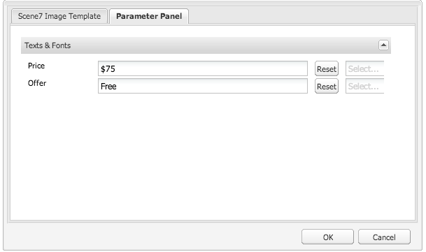

# 將Dynamic Media Classic功能新增至頁面 {#adding-scene-features-to-your-page}

[Adobe Dynamic Media Classic](https://experienceleague.adobe.com/docs/dynamic-media-classic/using/home.html)是託管式解決方案，可管理、增強、發佈多媒體資產，並將其傳送至Web、行動裝置、電子郵件及連線至網際網路的顯示器和列印。

您可以在多種檢視器中檢視Dynamic Media Classic中發佈的Experience Manager資產：

* 縮放
* 彈出
* 影片
* 影像範本
* 影像

您可以直接從Experience Manager將數位資產發佈到Dynamic Media Classic，也可以從Dynamic Media Classic將數位資產發佈到Experience Manager。

本檔案說明如何從Experience Manager發佈數位資產到Dynamic Media Classic，反之亦然。 檢視器也會詳細說明。 如需設定Dynamic Media ClassicExperience Manager的詳細資訊，請參閱[將Dynamic Media Classic與Experience Manager整合](/help/sites-administering/scene7.md)。

另請參閱[新增影像地圖](image-maps.md)。

如需有關搭配Experience Manager使用視訊元件的詳細資訊，請參閱[視訊](video.md)。

>[!NOTE]
>
>如果Dynamic Media Classic資產未正確顯示，請確定Dynamic Media已[停用](config-dynamic.md#disabling-dynamic-media)，然後重新整理頁面。

## 從資產手動發佈至Dynamic Media Classic {#manually-publishing-to-scene-from-assets}

您可以依照下列步驟，將數位資產發佈至Dynamic Media Classic：

* [在Assets主控台的傳統使用者介面中](/help/sites-classic-ui-authoring/manage-assets-classic-s7.md#publishing-from-the-assets-console)
* [在資產的傳統使用者介面中](/help/sites-classic-ui-authoring/manage-assets-classic-s7.md#publishing-from-an-asset)
* [在CQ Target資料夾外部的傳統使用者介面中](/help/sites-classic-ui-authoring/manage-assets-classic-s7.md#publishing-assets-from-outside-the-cq-target-folder)

>[!NOTE]
>
>Experience Manager以非同步方式發佈至Dynamic Media Classic。 選取&#x200B;**[!UICONTROL Publish]**&#x200B;後，您的資產需要幾秒鐘才能發佈至Dynamic Media Classic。
>

## Dynamic Media Classic元件 {#scene-components}

Experience Manager中有下列Dynamic Media Classic元件：

* 縮放
* 彈出（縮放）
* 影像範本
* 影像
* 影片

>[!NOTE]
>
>預設不會提供這些元件，且必須在使用&#x200B;**[!UICONTROL 設計]**&#x200B;模式中選取這些元件。

在&#x200B;**[!UICONTROL 設計]**&#x200B;模式中提供元件後，您可以將元件新增至您的頁面，就像任何其他Experience Manager元件一樣。 如果是在已同步處理的資料夾、頁面或具有Assets雲端設定的情況下，尚未發佈至Dynamic Media Classic的Dynamic Media Classic會發佈至Dynamic Media Classic。

>[!NOTE]
>
>如果您正在建立及開發自訂檢視器並使用「內容尋找器」，則必須明確新增`allowfullscreen`引數。

### Flash檢視器生命週期結束通知 {#flash-viewers-end-of-life-notice}

自2017年1月31日起，Adobe Dynamic Media Classic不再支援Flash檢視器平台。

### 將Dynamic Media Classic (Scene7)元件新增至頁面 {#adding-a-scene-component-to-a-page}

將Dynamic Media Classic (Scene7)元件新增至頁面，與將元件新增至任何頁面相同。 以下各節將詳細說明Dynamic Media Classic元件。

**若要將Dynamic Media Classic (Scene7)元件新增至頁面：**

1. 在Experience Manager中，開啟您要新增&#x200B;**[!UICONTROL Dynamic Media Classic (Scene7)]**&#x200B;元件的頁面。

1. 如果沒有可用的Dynamic Media Classic元件，請選取&#x200B;**[!UICONTROL 設計]**&#x200B;模式、選取任何具有藍色邊框的元件、選取&#x200B;**[!UICONTROL 父項]**&#x200B;圖示，然後選取&#x200B;**[!UICONTROL 組態]**&#x200B;圖示。 在&#x200B;**[!UICONTROL Parsys （設計）]**&#x200B;中，選取所有Dynamic Media Classic元件以使其可用，並選取&#x200B;**[!UICONTROL 確定]**。

   

1. 選取「**[!UICONTROL 編輯]**」以便返回「**[!UICONTROL 編輯]**」模式。

1. 將元件從Sidekick中的Dynamic Media Classic群組拖曳到頁面上的所需位置。

1. 選取&#x200B;**[!UICONTROL 組態]**&#x200B;圖示，讓您可以開啟元件。

1. 視需要編輯元件，並選取&#x200B;**[!UICONTROL 確定]**&#x200B;以儲存變更。
1. 從內容瀏覽器將影像或視訊拖曳至您新增至頁面的Dynamic Media Classic元件。

   >[!NOTE]
   >
   >僅限觸控式UI中，您必須將影像或視訊拖放至您放置在頁面上的Dynamic Media Classic元件上。 不支援選取和編輯Dynamic Media Classic元件，然後選取資產。

### 為回應式網站新增互動式檢視體驗 {#adding-interactive-viewing-experiences-to-a-responsive-website}

資產的回應式設計表示您的資產會根據顯示位置進行調整。 透過回應式設計，相同的資產能夠有效地在多部裝置上顯示。

另請參閱[網頁的回應式設計](/help/sites-developing/responsive.md)。

**若要在回應式網站中新增互動式檢視體驗：**

1. 登入Experience Manager，並確認您已設定[Adobe Dynamic Media ClassicCloud Service](/help/sites-administering/scene7.md#configuring-scene-integration)，且Dynamic Media Classic元件可供使用。

   >[!NOTE]
   >
   >如果Dynamic Media Classic元件無法使用，請確定[以設計模式](/help/sites-authoring/default-components-designmode.md)啟用它們。

1. 在啟用&#x200B;**[!UICONTROL Dynamic Media Classic]**&#x200B;元件的網站中，將&#x200B;**[!UICONTROL Image]**&#x200B;元件拖曳至頁面。
1. 選取元件並選取配置圖示。
1. 在&#x200B;**[!UICONTROL Dynamic Media Classic設定]**&#x200B;索引標籤中，調整中斷點。

   

1. 確認檢視器是否以回應式方式調整大小，以及所有互動是否針對桌上型電腦、平板電腦和行動裝置進行最佳化。

### 所有Dynamic Media Classic元件的通用設定 {#settings-common-to-all-scene-components}

雖然組態選項不盡相同，但下列是所有[!UICONTROL Dynamic Media Classic]元件的共同選項：

* **[!UICONTROL 檔案參考]** — 瀏覽您要參考的檔案。 檔案參考會顯示資產URL，不一定是完整的Dynamic Media Classic URL，包括URL命令和引數。 您無法在此欄位中新增Dynamic Media Classic URL命令和引數。 而是透過元件中對應的功能來新增它們。
* **[!UICONTROL 寬度]** — 可讓您設定寬度。
* **[!UICONTROL 高度]** — 可讓您設定高度。

您可以透過開啟（按兩下） Dynamic Media Classic元件來設定這些組態選項，例如，當您開啟&#x200B;**[!UICONTROL 縮放]**&#x200B;元件時：

### 縮放 {#zoom}

當您按下&#x200B;**[!UICONTROL +]**&#x200B;按鈕時，HTML5縮放元件會顯示較大的影像。

資產底部有縮放工具。 若要放大，請選取&#x200B;**[!UICONTROL +]**；若要縮小，請選取&#x200B;**[!UICONTROL -]**。 點選&#x200B;**[!UICONTROL x]**&#x200B;或重設縮放箭頭，可讓影像回覆為匯入的原始大小。 選取對角線箭頭，使其成為全熒幕。 選取「**[!UICONTROL 編輯]**」以設定元件。 使用此元件，您可以設定所有[!UICONTROL Dynamic Media Classic]元件[&#128279;](#settings-common-to-all-scene-components)的通用設定。

### 彈出 {#flyout}

在HTML5 **[!UICONTROL 彈出式專案]**&#x200B;元件中，資產會顯示為分割熒幕；將資產保留為指定大小；顯示縮放部分時則顯示為右側。 選取「**[!UICONTROL 編輯]**」以設定元件。 使用此元件，您可以設定所有Dynamic Media Classic元件的[共同設定](#settings-common-to-all-scene-components)。

>[!NOTE]
>
>如果您的&#x200B;**[!UICONTROL 彈出式視窗]**&#x200B;元件使用自訂大小，則會使用該自訂大小並停用該元件的回應式設定。
>
>如果您的&#x200B;**[!UICONTROL 彈出式視窗]**&#x200B;元件使用預設大小（如&#x200B;**[!UICONTROL 設計檢視]**&#x200B;中所設定），則會使用預設大小，元件會延伸以容納啟用元件回應式設定的頁面配置大小。 元件的回應式設定存在限制。 當您搭配回應式設定使用&#x200B;**[!UICONTROL 彈出式專案]**&#x200B;元件時，請勿將其用於完整頁面延伸。 否則，**[!UICONTROL 彈出式視窗]**&#x200B;會延伸超過頁面的右邊框。

### 影像 {#image}

Dynamic Media Classic **[!UICONTROL 影像]**&#x200B;元件可讓您將Dynamic Media Classic功能新增至影像，例如Dynamic Media Classic修飾元、影像或檢視器預設集，以及銳利化。 Dynamic Media Classic **[!UICONTROL 影像]**&#x200B;元件類似於Experience Manager中的其他影像元件，具有特殊的Dynamic Media Classic功能。 在此範例中，影像已套用Dynamic Media Classic URL修飾元`&op_invert=1`。

**[!UICONTROL 標題，替代文字]** — 在&#x200B;**[!UICONTROL 進階]**&#x200B;索引標籤中，為圖形關閉的使用者新增標題和替代文字。

**[!UICONTROL URL，在]**&#x200B;中開啟 — 您可以從設定開啟連結的資產。 設定&#x200B;**[!UICONTROL URL]**，並在&#x200B;**[!UICONTROL 在]**&#x200B;中開啟以指示您要在相同視窗中開啟還是在新視窗中開啟。

**[!UICONTROL 檢視器預設集]** — 從下拉式選單中選取現有的檢視器預設集。 如果您要尋找的檢視器預設集未顯示，您必須讓它顯示。 請參閱[管理檢視器預設集](/help/assets/managing-viewer-presets.md)。 如果您使用影像預設集，則無法選取檢視器預設集，反之亦然。

**[!UICONTROL Dynamic Media Classic設定]** — 選取您要用來從SPS擷取作用中影像預設集的Dynamic Media Classic設定。

**[!UICONTROL 影像預設集]** — 從下拉式選單中選取現有的影像預設集。 如果您要尋找的影像預設集不可見，您必須讓它可見。 請參閱[管理影像預設集](/help/assets/managing-image-presets.md)。 如果您使用影像預設集，則無法選取檢視器預設集，反之亦然。

**[!UICONTROL 輸出格式]** — 選取影像的輸出格式，例如jpeg。 視您選取的輸出格式而定，會有其他組態選項。 請參閱[影像預設集最佳實務](/help/assets/managing-image-presets.md#image-preset-options)。

**[!UICONTROL 銳利化]** — 選取您要如何銳利化影像。 在[影像預設集最佳實務](/help/assets/managing-image-presets.md#image-preset-options)與[銳利化最佳實務](/help/assets/assets/sharpening_images.pdf)中詳細說明銳利化功能。

**[!UICONTROL URL修飾元]** — 您可以提供其他Dynamic Media Classic影像命令來變更影像效果。 這些命令在[影像預設集](/help/assets/managing-image-presets.md)和[命令參考](https://experienceleague.adobe.com/docs/dynamic-media-developer-resources/image-serving-api/image-serving-api/http-protocol-reference/command-reference/c-command-reference.html)中有說明。

**[!UICONTROL 中斷點]** — 如果您的網站有回應，您想要調整中斷點。 中斷點必須以逗號( 、 )分隔。

### 影像範本 {#image-template}

[Dynamic Media Classic影像範本](https://experienceleague.adobe.com/docs/dynamic-media-classic/using/template-basics/quick-start-template-basics.html)是匯入至Dynamic Media Classic的層級Photoshop內容，其內容和屬性已引數化為變動。 **[!UICONTROL 影像範本]**&#x200B;元件可讓您以Experience Manager匯入影像並動態變更文字。 此外，您可以將&#x200B;**[!UICONTROL 影像範本]**&#x200B;元件設定為使用使用者端內容的值，讓每位使用者都能透過個人化的方式體驗影像。

若要設定元件，請選取&#x200B;**[!UICONTROL 編輯]**。 您可以設定所有Dynamic Media Classic元件的[通用設定](#settings-common-to-all-scene-components)以及本節中說明的其他設定。

**[!UICONTROL 檔案參考、寬度、高度]** — 檢視所有ScDynamic Media Classicene7元件通用的設定。

>[!NOTE]
>
>Dynamic Media Classic URL命令和引數無法直接新增至檔案參考URL。 它們只能在&#x200B;**[!UICONTROL 引數]**&#x200B;面板的元件UI中定義。

**[!UICONTROL 標題，替代文字]** — 在Dynamic Media Classic的「影像範本」標籤中，為已關閉圖形的使用者新增標題和替代文字。

**[!UICONTROL URL，在]**&#x200B;中開啟 — 您可以從設定開啟連結的資產。 設定URL，並在的「開啟」中指定您要在相同視窗中開啟還是要在新視窗中開啟。

**[!UICONTROL 引數面板]** — 匯入影像時，引數會預先填入影像中的資訊。 如果沒有可動態變更的內容，此視窗為空白。

#### 動態變更文字 {#changing-text-dynamically}

若要動態變更文字，請在欄位中輸入新文字，並選取&#x200B;**[!UICONTROL 確定]**。 在此範例中，**[!UICONTROL 價格]**&#x200B;現在為$50，而運費為99美分。

影像中的文字會變更。 您可以點選欄位旁的&#x200B;**[!UICONTROL 重設]**，將文字重設為原始值。

#### 變更文字以反映使用者端內容值的值 {#changing-text-to-reflect-the-value-of-a-client-context-value}

若要將欄位連結到使用者端內容值，請選取&#x200B;**[!UICONTROL 選取]**&#x200B;以開啟使用者端內容功能表，選取使用者端內容，然後選取&#x200B;**[!UICONTROL 確定]**。 在此範例中，名稱會根據連結設定檔中帶有格式化名稱的「名稱」而變更。

此文字反映目前登入使用者的名稱。 您可以按一下欄位旁的&#x200B;**[!UICONTROL 重設]**，將文字重設為原始值。

#### 將Dynamic Media Classic影像範本設為連結 {#making-the-scene-image-template-a-link}

1. 在具有Dynamic Media Classic **[!UICONTROL 影像範本]**&#x200B;元件的頁面上，選取&#x200B;**[!UICONTROL 編輯]**。
1. 在&#x200B;**[!UICONTROL URL]**&#x200B;欄位中，輸入使用者點選影像時前往的URL。 在&#x200B;**[!UICONTROL 在]**&#x200B;中開啟欄位中，選取是否要開啟目標（新視窗或相同視窗）。

   

1. 選取&#x200B;**[!UICONTROL 確定]**。

### 視訊元件 {#video-component}

Dynamic Media Classic **[!UICONTROL 視訊]**&#x200B;元件(可從sidekick的Dynamic Media Classic區段取得)會使用裝置和頻寬偵測，將正確的視訊提供給每個熒幕。 此元件是HTML5視訊播放器；它是可用於跨頻道的單一檢視器。

它可用於自我調整視訊集、單一MP4視訊或單一F4V視訊。

請參閱[影片](s7-video.md)，瞭解影片如何與Dynamic Media Classic整合搭配運作的詳細資訊。 此外，請參閱[Dynamic Media Classic視訊元件與Foundation視訊元件](s7-video.md)。

### 視訊元件的已知限制 {#known-limitations-for-the-video-component}

AdobeDAM和WCM會顯示是否上傳主要來源影片。 它們不會顯示這些Proxy資產：

* Dynamic Media Classic編碼的轉譯
* Dynamic Media Classic最適化視訊集

搭配Dynamic Media Classic視訊元件使用自我調整視訊集時，您必須調整元件大小以符合視訊的尺寸。

## Dynamic Media Classic內容瀏覽器 {#scene-content-browser}

Dynamic Media Classic內容瀏覽器可讓您直接在Experience Manager檢視Dynamic Media Classic的內容。 若要存取內容瀏覽器，請在&#x200B;**[!UICONTROL 內容尋找器]**&#x200B;中，選取觸控最佳化使用者介面中的&#x200B;**[!UICONTROL Dynamic Media Classic]**，或傳統使用者介面中的&#x200B;**[!UICONTROL S7]**&#x200B;圖示。 兩個使用者介面之間的功能相同。

如果您有多個組態，依預設Experience Manager會顯示[預設組態](/help/sites-administering/scene7.md#configuring-a-default-configuration)。 您可以在下拉式選單中直接在Dynamic Media Classic內容瀏覽器中選取不同的設定。

>[!NOTE]
>
>* 隨選資料夾中的Assets未出現在Dynamic Media Classic內容瀏覽器中。
>* 啟用[安全預覽](/help/sites-administering/scene7.md#configuring-the-state-published-unpublished-of-assets-pushed-to-scene)時，Dynamic Media Classic上已發佈和未發佈的資產都會出現在Dynamic Media Classic內容瀏覽器中。
>* 如果您在內容瀏覽器中看不到&#x200B;**[!UICONTROL Dynamic Media Classic]**&#x200B;或&#x200B;**[!UICONTROL S7]**&#x200B;圖示為選項，您必須[設定Dynamic Media Classic以使用Experience Manager](/help/sites-administering/scene7.md)。
>* 對於視訊，Dynamic Media Classic內容瀏覽器支援：
>
>   * 最適化視訊集：包含跨多個熒幕無縫播放所需的所有視訊轉譯的容器
>   * 單一MP4視訊
>   * 單一F4V視訊

### 在觸控最佳化UI中瀏覽內容 {#browsing-content-in-the-touch-optimized-ui}

您可以在觸控最佳化或傳統UI中存取內容瀏覽器。 目前，觸控最佳化有下列限制：

* 不支援來自Dynamic Media Classic的FXG和Flash資產。

從第三個下拉式功能表中選取&#x200B;**[!UICONTROL Dynamic Media Classic]**，以瀏覽Dynamic Media Classic資產。 如果您尚未設定Dynamic Media Classic/Experience Manager整合，Dynamic Media Classic就不會出現在清單中。

>[!NOTE]
>
>* Dynamic Media Classic內容瀏覽器會載入約100個資產，並依名稱排序。
>* 如果您已設定安全預覽伺服器，瀏覽器會使用該預覽伺服器來轉譯縮圖和資產。
>

此外，您可以在瀏覽器中暫留在資產上，以瀏覽解析度資訊、大小、修改後的天數以及檔案名稱。

* 針對最適化視訊集和範本，不會為縮圖產生大小資訊。
* 針對最適化視訊集，不會為縮圖產生解析度。

### 使用內容瀏覽器搜尋Dynamic Media Classic資產 {#searching-for-scene-assets-with-the-content-browser}

在Dynamic Media Classic中搜尋資產與在Experience Manager Assets中搜尋資產類似。 不過，當您搜尋時，您實際上會在Dynamic Media Classic系統中看到資產的遠端檢視，而不是直接將資產匯入Experience Manager。

您可以使用傳統UI或觸控最佳化UI來檢視和搜尋資產。 依介面而定，您的搜尋方式會有些微差異。

在任一UI中搜尋時，您可以依據以下條件進行篩選（如觸控最佳化UI中所示）：

**[!UICONTROL 輸入關鍵字]** — 您可以依名稱搜尋資產。 搜尋時，您輸入的關鍵字是檔案名稱的開頭。 例如，輸入「swimming」會尋找任何以那個順序開頭字母的資產檔案名稱。 輸入辭彙以尋找資產後，請務必按下Enter鍵。

**[!UICONTROL 資料夾/路徑]** — 所看到的資料夾名稱是根據您選取的設定而定。 您可以點選資料夾圖示並選取子資料夾，然後點選核取記號以選取它，以向下展開至較低層級。

如果您輸入關鍵字並選取資料夾，Experience Manager會搜尋該資料夾及任何子資料夾。 但是，如果您在搜尋時未輸入任何關鍵字，則選取資料夾只會顯示該資料夾中的資產，不包含任何子資料夾。

根據預設，Experience Manager會搜尋選取的資料夾和所有子資料夾。

**[!UICONTROL 資產型別]** — 選取&#x200B;**[!UICONTROL Dynamic Media Classic]**&#x200B;以瀏覽Dynamic Media Classic內容。 此選項僅在已設定Dynamic Media Classic時可用。

**[!UICONTROL 組態]** — 如果您在[!UICONTROL Cloud Service]中定義了多個Dynamic Media Classic組態，您可以在這裡選取它。 因此，資料夾會根據您選擇的設定而變更。

**[!UICONTROL 資產型別]** — 在Dynamic Media Classic瀏覽器中，您可以篩選結果以納入下列任一專案：影像、範本、視訊和最適化視訊集。 如果您未選取任何資產型別，依預設，會Experience Manager搜尋所有資產型別。

>[!NOTE]
>
>* 在傳統UI中，您也可以搜尋&#x200B;**Flash**&#x200B;和&#x200B;**FXG**。 不支援在觸控最佳化UI中篩選這些型別。
>
>* 搜尋視訊時，您會搜尋單一轉譯。 結果會傳回原始轉譯（僅限&amp;amp；ast；.mp4）和編碼的轉譯。
>* 搜尋最適化視訊集時，您將會搜尋資料夾和所有子資料夾，但前提是您已新增關鍵字至搜尋。 如果您尚未新增關鍵字，Experience Manager不會搜尋子資料夾。
>

**[!UICONTROL Publish狀態]** — 您可以根據發佈狀態來篩選資產： **[!UICONTROL 已取消發佈]**&#x200B;或&#x200B;**[!UICONTROL 已發佈]**。 如果您未選取任何&#x200B;**[!UICONTROL Publish狀態]**，根據預設，Experience Manager會搜尋所有發佈狀態。

