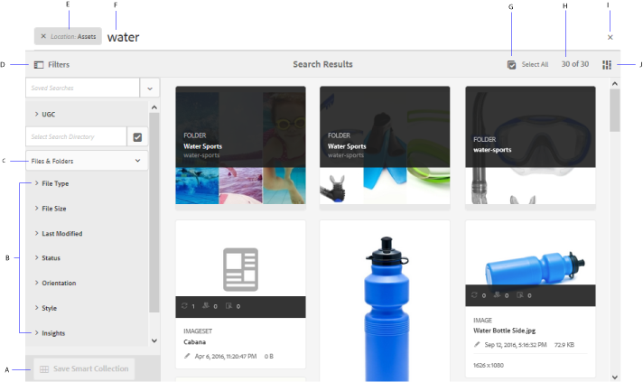

# 搜尋 [!DNL Adobe Experience Manager] 中的資產 {#search-assets-in-aem}

| 版本 | 文章連結 |
| -------- | ---------------------------- |
| AEM as a Cloud Service  | [按一下這裡](https://experienceleague.adobe.com/docs/experience-manager-cloud-service/content/assets/manage/search-assets.html?lang=en) |
| AEM 6.5 | 本文 |
| AEM 6.4 | [按一下這裡](https://experienceleague.adobe.com/docs/experience-manager-64/assets/using/search-assets.html?lang=zh-Hant) |

[!DNL Adobe Experience Manager Assets] 提供了強健的資產發現方法，可幫助您實現更高的內容速度。 您的團隊可以使用現成功能和定制方法，通過無縫、智慧的搜索體驗縮短上市時間。 搜索資產是數字資產管理系統使用的核心 — 無論是供創意人員進一步使用、供商業用戶和營銷人員對資產進行穩健管理，還是供DAM管理員管理。 您可以通過以下方式執行的簡單、高級和自定義搜索 [!DNL Assets] 用戶介面或其他應用和曲面有助於完成這些使用案例。

[!DNL Experience Manager Assets] 支援以下使用案例，本文介紹這些使用案例的用法、概念、配置、限制和故障排除。

| 搜索資產 | 配置和管理搜索功能 | 使用搜索結果 |
|---|---|---|
| [基本搜索](#searchbasics) | [搜索索引](#searchindex) | [對結果排序](#sort) |
| [瞭解搜索UI](#searchui) | [視覺或相似性搜索](#configvisualsearch) | [檢查資產的屬性和元資料](#checkinfo) |
| [搜索建議](#searchsuggestions) | [強制元資料](#mandatorymetadata) | [下載](#download) |
| [瞭解搜索結果和行為](#searchbehavior) | [修改搜索小平面](#searchfacets) | [批量元資料更新](#metadataupdates) |
| [搜索排名和提升](#searchrank) | [文本提取](#extracttextupload) | [智慧收藏](#collections) |
| [高級搜索：過濾和搜索範圍](#scope) | [自定義謂語](#custompredicates) | [瞭解並排除意外結果](#unexpected-results) |
| [從其他解決方案和應用程式搜索](#search-assets-other-surfaces):<ul><li>[Adobe資產連結](#aal)</li><li>[Brand Portal](#brand-portal)</li><li>[Experience Manager案頭應用](#desktop-app)</li><li>[Adobe Stock影像](#adobe-stock)</li><li>[Dynamic Media資產](#dynamic-media)</li></ul> |  |  |
| [資產選擇器](#asset-picker) |  |  |
| [限制](#limitations) 和 [提示](#tips) |  |  |
| [示例](#samples) |  |  |

使用頂部的Omnisearch欄位搜索資產 [!DNL Experience Manager] Web介面。 轉到 **[!UICONTROL 資產]** > **[!UICONTROL 檔案]** 在 [!DNL Experience Manager]按一下  在頂欄中，輸入搜索關鍵字，然後選擇 `Return`。 或者，使用關鍵字快捷方式 `/` （正斜線）以開啟Omnisearch欄位。 `Location:Assets` 將搜索限制為DAM資產。 [!DNL Experience Manager] 在開始鍵入搜索關鍵字時提供建議。

使用 **[!UICONTROL 篩選器]** 用於搜索資產、資料夾、標籤和元資料的面板。 您可以根據各種選項（謂語）篩選搜索結果，如檔案類型、檔案大小、上次修改日期、資產狀態、見解資料和Adobe Stock授權。 可以使用自定義「篩選器」面板和添加或刪除搜索謂語 [搜索小面](/help/assets/search-facets.md)。 的 [!UICONTROL 檔案類型] 在 [!UICONTROL 篩選器] 面板具有混合狀態複選框。 因此，除非選中所有嵌套的謂詞（或格式），否則將部分選中第一級複選框。

[!DNL Experience Manager] 搜索功能支援搜索集合和搜索集合內的資產。 請參閱 [搜索集合](/help/assets/manage-collections.md)。

## 瞭解搜索介面 {#searchui}

熟悉搜索介面和可用操作。

*圖：瞭解 [!DNL Experience Manager Assets] 搜索結果介面。*

**答：** 將搜索另存為智慧集合。 **B** 篩選器或謂語以縮小搜索結果的範圍。 **C.** 顯示檔案、資料夾或兩者。 **D.** 按一下「篩選器」以開啟或關閉左側邊欄。**E.** 搜尋位置為 DAM。**F.** 使用用戶提供的搜索關鍵字的Omnisearch欄位。 **G.** 選擇載入的搜索結果。 **H** 顯示的搜索結果在總搜索結果中的數目。 **我。** 關閉搜索。 **J** 在卡視圖和清單視圖之間切換。

### 動態搜索小面 {#dynamicfacets}

使用搜索方面中動態更新的預期搜索結果數，可以更快地從搜索結果頁面中發現所需的資產。 即使在應用搜索篩選器之前，也會更新預期的資產數。 查看過濾器的預期計數有助於您快速高效地瀏覽搜索結果。

*圖：請參閱在搜索方面中不過濾搜索結果的資產的大致數量。*

## 瞭解搜索結果和行為 {#searchbehavior}

### 基本搜索詞和結果 {#searchbasics}

可以從OmniSearch欄位運行關鍵字搜索。 關鍵字搜索不區分大小寫，是全文搜索（跨常用元資料欄位）。 如果使用了多個關鍵字， `AND` 是關鍵字之間的預設運算子。

結果按相關性排序，從最接近的匹配開始。 對於多個關鍵字，更相關的結果是在其元資料中包含兩個術語的資產。 在元資料中，顯示為智慧標籤的關鍵字的排名高於顯示在其他元資料欄位中的關鍵字。 [!DNL Experience Manager] 允許賦予特定搜索詞更高的權重。 另外， [提高排名](#searchrank) 特定搜索條款的目標資產。

為了快速查找相關資產，豐富的介面提供了過濾、分類和選擇機制。 您可以根據多個條件篩選結果，並查看各種篩選器的搜索資產數。 或者，也可以通過更改「Omnisearch」欄位中的查詢來重新運行搜索。 更改搜索詞或篩選器時，其它篩選器仍應用於保留搜索的上下文。

當結果是很多資產時， [!DNL Experience Manager] 在卡視圖中顯示前100個，在清單視圖中顯示200個。 當用戶滾動時，將載入更多資產。 這是為了提高效能。 觀看視頻演示 [顯示的資產數](https://www.youtube.com/watch?v=LcrGPDLDf4o)。

有時，您可能會在搜索結果中看到一些意外的資產。 有關詳細資訊，請參見 [意外結果](#unexpected-results)。

[!DNL Experience Manager] 可以搜索多種檔案格式，而且可以自定義搜索篩選器以滿足您的業務要求。 請與管理員聯繫，瞭解哪些搜索選項可用於您的DAM儲存庫，以及您的帳戶有哪些限制。

### 帶增強智慧標籤和不帶增強智慧標籤的結果 {#withsmarttags}

預設情況下， [!DNL Experience Manager] 搜索將搜索詞與AND子句組合。 例如，請考慮搜索正在運行的關鍵字婦女。 預設情況下，只有元資料中同時包含wamon和running關鍵字的資產才會顯示在搜索結果中。 當與關鍵字一起使用特殊字元（句點、下划線或短划線）時，將保留相同的行為。 以下搜索查詢返回的結果相同：

* `woman running`
* `woman.running`
* `woman-running`

但是，查詢 `woman -running` 返回資產 `running` 元資料。
使用智慧標籤添加額外 `OR` 子句，以查找作為應用的智慧標籤的搜索項。 標籤了以下任一項的資產 `woman` 或 `running` 使用智慧標籤也會出現在此類搜索查詢中。 所以搜索結果是，

* 資產 `woman` 和 `running` 元資料中的關鍵字（預設行為）。

* 使用任一關鍵字（智慧標籤行為）標籤的智慧資產。

### 鍵入時搜索建議 {#searchsuggestions}

開始鍵入關鍵字時， [!DNL Experience Manager] 建議可能的搜索關鍵字或短語。 這些建議是基於現有資產的元資料。 [!DNL Experience Manager] 索引所有元資料欄位以幫助搜索。 為了提供搜索建議，系統使用以下幾個元資料欄位的值。 要提供搜索建議，請考慮使用適當的關鍵字填充以下欄位：

* 資產標籤。 (映射到 `jcr:content/metadata/cq:tags`)
* 資產標題。 (映射到 `jcr:content/metadata/dc:title`)
* 資產說明。 (映射到 `jcr:content/metadata/dc:description`)
* JCR儲存庫中的標題。 值可以映射到資產標題。 (映射到 `jcr:content/jcr:title`)
* JCR儲存庫中的說明。 該值可能映射到資產說明。 (映射到 `jcr:content/jcr:description`)

要接收多個搜索關鍵字的建議，請繼續鍵入所有關鍵字，而不為單個關鍵字選擇任何建議。

*圖：鍵入多個關鍵字以查看適合所有關鍵字的建議。*

### 搜索排名和提升 {#searchrank}

首先顯示與元資料欄位中的所有搜索項相匹配的搜索結果，然後顯示與智慧標籤中任何搜索項相匹配的搜索結果。 在上例中，搜索結果的大致顯示順序是：

1. 匹配項 `woman running` 的子菜單。
1. 匹配項 `woman running` 在智慧標籤中。
1. 匹配項 `woman` 或 `running` 在智慧標籤中。

您可以提高特定資產的關鍵字的相關性，以幫助根據關鍵字提高搜索速度。 換句話說，基於這些關鍵字進行搜索時，升級特定關鍵字的影像會出現在搜索結果的頂部。

1. 從 [!DNL Assets] 用戶介面，開啟資產的屬性頁。 按一下 **[!UICONTROL 高級]** 按一下 **[!UICONTROL 添加]** 在 **[!UICONTROL 提升搜索關鍵字]**。
1. 在 **[!UICONTROL 搜索升級]** 框中，指定要增加影像搜索的關鍵字，然後按一下 **[!UICONTROL 添加]**。 可以以相同的方式指定多個關鍵字。
1. 按一下&#x200B;**[!UICONTROL 「儲存並關閉」]**。您為此關鍵字升級的資產出現在頂級搜索結果中。

通過提高目標關鍵字的搜索結果中某些資產的排名，您可以利用此功能。 請參閱下面的示例視頻。 有關詳細資訊，請參見 [搜索 [!DNL Experience Manager]](https://experienceleague.adobe.com/docs/experience-manager-learn/assets/search-and-discovery/search-boost.html)。

>[!VIDEO](https://video.tv.adobe.com/v/16766/?quality=6)

*視頻：瞭解搜索結果的排序方式以及排序方式。*

## 高級搜索 {#scope}

[!DNL Experience Manager] 提供了各種方法，如應用於搜索的資產的篩選器，以幫助您更快地定位所需資產。 下面介紹了幾種常用的方法。 部分 [示例](#samples) 共用。

**搜索檔案或資料夾**:在搜索結果中，請參閱檔案、資料夾或兩者。 從 **[!UICONTROL 篩選器]** 的子菜單。 請參閱 [搜索介面](#searchui)。

**在資料夾中搜索資產**:可以將搜索限制到特定資料夾。 在 **[!UICONTROL 篩選器]** 面板，添加資料夾的路徑。 一次只能選擇一個資料夾。

*圖：通過在「篩選器」面板中添加資料夾路徑，將搜索結果限制到資料夾。*

### 查找類似影像 {#visualsearch}

若要尋找視覺上類似使用者選取之影像的影像，請從影像的卡片檢視或工具列按一下「尋找類似 **** 」選項。[!DNL Experience Manager]會顯示來自DAM儲存庫的智慧型標籤影像，這些影像類似於使用者選取的影像。瞭解 [如何設定相似性搜尋](#configvisualsearch)。

*圖：使用卡視圖中的選項查找類似的影像。*

### Adobe Stock影像 {#adobe-stock}

從 [!DNL Experience Manager] 用戶介面，用戶可搜索 [Adobe Stock資產](/help/assets/aem-assets-adobe-stock.md) 並許可所需資產。 添加 `Location: Adobe Stock` 的下界。 您還可以使用「篩選器」面板查找所有許可或未授權的資產，或使用Adobe Stock檔案號搜索特定資產。

### Dynamic Media資產 {#dmassets}

您可以從&#x200B;**[!UICONTROL 「篩選器」]**&#x200B;面板中選取&#x200B;**[!UICONTROL 「動態媒體」]**>**[!UICONTROL 「集合」]**，以篩選動態媒體影像。這樣可以篩選並顯示影像集、旋轉木馬、混合媒體集和迴轉集等資產。

### 使用元資料欄位中的特定值進行GQL搜索 {#gql-search}

您可以根據元資料欄位的準確值來搜索資產，如標題、說明和建立者。 GQL全文搜索功能只提取元資料值與搜索查詢完全匹配的那些資產。 屬性（建立者、標題等）和值的名稱區分大小寫。

| 元資料欄位 | 方面值和使用 |
|---|---|
| 標題 | 標題：John |
| 產生器 | 建立者：John |
| 位置 | 位置：NA |
| 說明 | 說明：&quot;示例映像&quot; |
| 建立者工具 | 創作工具：&quot;Adobe Photoshop&quot; |
| 版權擁有者 | 版權人：&quot;Adobe Systems&quot; |
| 參與者 | 貢獻者：約翰 |
| 使用條款 | usageterms:&quot;保留CopyRights&quot; |
| 建立日期 | 已建立：YYYY-MM-DDTHH |
| 過期日期 | 過期：YYYY-MM-DDTHH |
| 準時 | ontime:YYYY-MM-DDTHH |
| 關機時間 | offtime:YYYY-MM-DDTHH |
| 時間範圍（過期日期時間，offtime） | 方面域：下界……上界 |
| 路徑 | /content/dam/&lt;folder name=&quot;&quot;> |
| PDF 標題 | pdftitle:&quot;Adobe文檔&quot; |
| 主旨 | 主題：「培訓」 |
| 標記 | 標籤：&quot;位置和行程&quot; |
| 類型 | 類型：&quot;image\png&quot; |
| 影像寬度 | 寬度：下界……上界 |
| 影像高度 | 高度：下限。上界 |
| 人員 | 人：約翰 |

屬性 `path`。 `limit`。 `size`, `orderby` 無法組合使用 `OR` 具有任何其他屬性的運算子。

<!-- TBD: Where are the limit, size, orderby properties defined?
-->

用戶生成的屬性的關鍵字是其屬性編輯器中的欄位標籤（小寫），並刪除空格。

下面是複雜查詢的搜索格式的一些示例：

* 顯示具有多個Facet欄位的所有資產(例如：title=John Doe和建立工具=Adobe Photoshop): `title:"John Doe" creatortool:Adobe*`
* 當facets值不是單詞而是句子時顯示所有資產(例如：title=Scott Reynolds): `title:"Scott Reynolds"`
* 顯示具有單個屬性的多個值的資產(例如：title=Scott Reynolds或John Doe): `title:"Scott Reynolds" OR "John Doe"`
* 顯示以特定字串開頭的屬性值的資產(例如：標題是斯科特·雷諾茲): `title:Scott*`
* 顯示屬性值以特定字串結尾的資產(例如：標題是斯科特·雷諾茲): `title:*Reynolds`
* 使用包含特定字串的屬性值顯示資產(例如：標題=巴塞爾會議室): `title:*Meeting*`
* 顯示包含特定字串並具有特定屬性值的資產(例如：在title=John Doe的資產中搜索字串Adobe): `*Adobe* title:"John Doe"`

## 從其他資源中搜索資產 [!DNL Experience Manager] 產品或介面 {#search-assets-other-surfaces}

[!DNL Adobe Experience Manager] 將DAM儲存庫連接到其他 [!DNL Experience Manager] 提供更快訪問數字資產和簡化創造性工作流的解決方案。 任何資產發現都從瀏覽或搜索開始。 在不同的曲面和解中，搜索行為基本上保持不變。 某些搜索方法會隨著目標受眾、使用案例和用戶介面的不同而改變 [!DNL Experience Manager] 解決方案。 下面的連結中記錄了各個解決方案的具體方法。 本文介紹了普遍適用的提示和行為。

### 從「Adobe資產連結」面板搜索資產 {#aal}

使用Adobe資產連結，創意專業人員現在可以訪問儲存在 [!DNL Experience Manager Assets]，而不離開受支援的Adobe Creative Cloud應用。 創意人員可以使用應用程式中的面板無縫瀏覽、搜索、簽出和簽入資產 [!DNL Adobe Creative Cloud] 應用： [!DNL Adobe Photoshop]。 [!DNL Adobe Illustrator], [!DNL Adobe InDesign]。 資產連結還允許用戶搜索外觀相似的結果。 視覺搜索顯示結果由Adobe Sensei的機器學習算法提供動力，幫助用戶找到美學上相似的影像。 請參閱 [搜索和瀏覽資產](https://helpx.adobe.com/tw/enterprise/using/manage-assets-using-adobe-asset-link.html#UseAdobeAssetLink) 使用Adobe資產連結。

### 在中搜索資產 [!DNL Experience Manager] 案頭應用 {#desktop-app}

創意專業人士使用案頭應用 [!DNL Experience Manager Assets] 可輕鬆搜索並在其本地案頭(Win或Mac)上提供。 創意人員可以輕鬆地在Mac查找器或Windows資源管理器中顯示所需資產，在案頭應用程式中開啟，並在本地更改 — 更改將保存回 [!DNL Experience Manager] 在儲存庫中建立了新版本。 應用程式支援使用一個或多個關鍵字進行基本搜索， `*` 和 `?` 通配符和 `AND` 運算子。 請參閱 [瀏覽、搜索和預覽資產](https://experienceleague.adobe.com/docs/experience-manager-desktop-app/using/using.html#browse-search-preview-assets) 在案頭應用中。

### 搜尋 [!DNL Brand Portal] 中的資產 {#brand-portal}

業務線用戶和營銷人員使用Brand Portal公司與其擴展的內部團隊、合作夥伴和轉銷商高效、安全地共用經批准的數字資產。 請參閱 [搜索Brand Portal](https://experienceleague.adobe.com/docs/experience-manager-brand-portal/using/search-capabilities/brand-portal-searching.html)。

### 搜索 [!DNL Adobe Stock] 影像 {#adobe-stock1}

從 [!DNL Experience Manager] 用戶介面，用戶可以搜索Adobe Stock資產，並授權所需資產。 添加 `Location: Adobe Stock` 的上界。 您還可以使用 **[!UICONTROL 篩選器]** 查找所有授權或未授權資產或使用Adobe Stock檔案號搜索特定資產。 請參閱 [管理 [!DNL Adobe Stock] 影像 [!DNL Experience Manager]](/help/assets/aem-assets-adobe-stock.md#usemanage)。

### 搜索 [!DNL Dynamic Media] 資產 {#dynamic-media}

您可以從&#x200B;**[!UICONTROL 「篩選器」]**&#x200B;面板中選取&#x200B;**[!UICONTROL 「動態媒體」]**>**[!UICONTROL 「集合」]**，以篩選動態媒體影像。這樣可以篩選並顯示影像集、旋轉木馬、混合媒體集和迴轉集等資產。在製作網頁時，作者可在內容尋找工具中搜尋集合。集合的篩選器可從快顯功能表中取得。

### 在創作網頁時在Content Finder中搜索資產 {#content-finder}

作者可以使用Content Finder在DAM儲存庫中搜索相關資產，並在他們建立的網頁中使用資產。 作者還可以使用「已連接資產」功能搜索遠程上可用的資產 [!DNL Experience Manager] 部署。 然後，作者可以在本地網頁中使用這些資產 [!DNL Experience Manager] 部署。 請參閱 [使用遠程資產](/help/assets/use-assets-across-connected-assets-instances.md#use-remote-assets)。

### 搜索集合 {#collections}

[!DNL Experience Manager] 搜索功能支援搜索集合和搜索集合內的資產。 請參閱 [搜索集合](/help/assets/manage-collections.md)。

## 資產選擇器 {#asset-picker}

>[!NOTE]
>
>調用了資產選擇器 [資產選取器](https://helpx.adobe.com/experience-manager/6-2/assets/using/asset-picker.html) 以前的版本 [!DNL Adobe Experience Manager]。

資產選擇器允許您以特殊方式搜索、篩選和瀏覽DAM資產。 資產選擇器可在 `https://[aem_server]:[port]/aem/assetpicker.html`。 您可以使用資產選擇器獲取所選資產的元資料。 可以使用支援的請求參數啟動它，如資產類型（影像、視頻、文本）和選擇模式（單個或多個選擇）。 這些參數為特定搜索實例設定資產選擇器的上下文，並在整個選擇過程中保持不變。

資產選擇器使用HTML5 `Window.postMessage` 消息，將所選資產的資料發送到收件人。 它僅在瀏覽模式下工作，並且僅在Omnisearch結果頁面中工作。

在URL中傳遞以下請求參數以在特定上下文中啟動資產選擇器：

| 名稱 | 值 | 範例 | 目的 |
|---|---|---|---|
| 資源尾碼(B) | 作為URL中資源尾碼的資料夾路徑： [https://localhost:4502/aem/assetpicker.html/&lt;folder_path>](https://localhost:4502/aem/assetpicker.html) | 在選定特定資料夾（例如資料夾）的情況下啟動資產選擇器 `/content/dam/we-retail/en/activities` 選定，URL應為以下格式： `https://localhost:4502/aem/assetpicker.html/content/dam/we-retail/en/activities?assettype=images` | 如果在啟動資產選擇器時需要選擇特定資料夾，請將其作為資源尾碼傳遞。 |
| `mode` | 單個，多個 | <ul><li>`https://localhost:4502/aem/assetpicker.html?mode=single`</li><li>`https://localhost:4502/aem/assetpicker.html?mode=multiple`</li></ul> | 在多模式下，您可以使用資產選擇器同時選擇多個資產。 |
| `dialog` | 真，假 | [https://localhost:4502/aem/assetpicker.html?dialog=true](https://localhost:4502/aem/assetpicker.html?dialog=true) | 使用這些參數以「花崗岩」對話框的形式開啟資產選擇器。 僅當通過「花崗岩路徑欄位」啟動資產選擇器並將其配置為pickerSrc URL時，此選項才適用。 |
| `root` | &lt;folder_path> | `https://localhost:4502/aem/assetpicker.html?assettype=images&root=/content/dam/we-retail/en/activities` | 使用此選項可指定資產選擇器的根資料夾。 在這種情況下，資產選擇器允許您僅選擇根資料夾下的子資產（直接/間接）。 |
| `viewmode` | 搜尋 |  | 在搜索模式下啟動資產選擇器， `assettype` 和 `mimetype` 參數。 |
| `assettype` | 影像，文檔，多媒體，檔案。 | <ul><li>`https://localhost:4502/aem/assetpicker.html?viewmode=search&assettype=images`</li><li> `https://localhost:4502/aem/assetpicker.html?viewmode=search&assettype=documents` </li><li> `https://localhost:4502/aem/assetpicker.html?viewmode=search&assettype=multimedia` </li><li> `https://localhost:4502/aem/assetpicker.html?viewmode=search&assettype=archives` </li></ul> | 使用選項根據提供的值篩選資產類型。 |
| `mimetype` | MIME類型(`/jcr:content/metadata/dc:format`)（也支援通配符）。 | <ul><li>`https://localhost:4502/aem/assetpicker.html?mimetype=image/png`</li><li>`https://localhost:4502/aem/assetpicker.html?mimetype=*png`</li><li>`https://localhost:4502/aem/assetpicker.html?mimetype=*presentation`</li><li>`https://localhost:4502/aem/assetpicker.html?mimetype=*presentation&mimetype=*png`</li></ul> | 使用它可以根據MIME類型篩選資產。 |

要訪問資產選擇器介面，請轉到 `https://[aem_server]:[port]/aem/assetpicker`。 導航到所需資料夾，然後選擇一個或多個資產。 或者，從「搜索」框中搜索所需的資產，根據需要應用篩選器，然後選擇它。

*圖：在資產選擇器中瀏覽並選擇資產。*

## 限制 {#limitations}

中的搜索功能 [!DNL Experience Manager Assets] 具有以下限制：

* 請勿在搜索查詢中輸入前導空格，否則搜索不起作用。
* [!DNL Experience Manager] 在從搜索結果中選擇資產屬性，然後取消搜索後，可繼續顯示搜索項。 <!-- (CQ-4273540) -->
* 搜索資料夾或檔案和資料夾時，無法對任何參數對搜索結果進行排序。
* 如果選擇 `Return` 不用在Omnisearch欄里打字， [!DNL Experience Manager] 返回僅檔案而非資料夾的清單。 如果您不使用關鍵字而專門搜索資料夾， [!DNL Experience Manager] 不返回任何結果。
* 可以對資料夾執行全文搜索。 指定搜索項以使搜索工作。

視覺搜索或相似性搜索具有以下限制：

* 視覺搜索在大型儲存庫中效果最佳。 雖然沒有獲得良好結果所需的最少影像數，但與幾個影像的匹配質量不如來自大型儲存庫的匹配質量好。
* 不能更改模型或列車 [!DNL Experience Manager] 來查找類似的影像。 例如，向少數資產添加或刪除智慧標籤不會更改模型。 這些資源確實會被排除在與視覺相似的搜索結果之外。

搜索功能在以下情形中可能存在效能限制：

* 與顯示搜索結果的清單視圖相比，卡視圖的載入時間更快。

## 搜索提示 {#tips}

* 在監視資產的審閱狀態時，請使用相應選項查找哪些資產已獲批准或哪些資產有待批准。
* 使用「透視」謂語根據從各種Creative應用程式獲取的使用情況統計資訊搜索受支援的資產。 使用率資料按使用率分數、印象、點擊量和顯示資產類別的媒體渠道分組。
* 使用 **[!UICONTROL 全選]** 複選框。 [!DNL Experience Manager] 最初在卡視圖中顯示100個資產，在清單視圖中顯示200個資產。 滾動搜索結果時載入更多資產。 您可以選擇比載入的資產更多的資產。 所選資產的計數顯示在搜索結果頁面的右上角。 您可以對所選內容進行操作，例如，下載所選資產、批量更新所選資產的元資料屬性或將所選資產添加到集合。 當選擇的資產多於顯示的資產時，將對所有選定的資產應用一個操作，或者對話框顯示應用該操作的資產數。 要對未載入的資產應用操作，請確保已明確選擇所有資產。
* 要搜索不包含強制元資料的資產，請參閱 [強制元資料](#mandatorymetadata)。
* 搜索使用所有元資料欄位。 一般搜索（如搜索12）通常會返回許多結果。 為獲得更好的結果，請使用雙引號（非單引號）或確保數字與沒有特殊字元的單詞相連(例如 `shoe12`)。
* 全文搜索支援運算子，如 `-` 和 `^`。 要將這些字母作為字串文本搜索，請將搜索表達式用雙引號括起來。 例如，使用 `"Notebook - Beauty"` 而不是 `Notebook - Beauty`。
* 如果搜索結果過多，請限制 [搜索範圍](#scope) 到所需資產的零值。 如果您對如何更好地查找所需資產有一些瞭解，例如特定檔案類型、特定位置、特定元資料等，則它最有效。

* **標籤**:標籤可幫助您對可以更高效地瀏覽和搜索的資產進行分類。 標籤有助於將適當的分類傳播到其他用戶和工作流。 [!DNL Experience Manager] 提供了使用Adobe Sensei人為智慧服務自動標籤資產的方法，這些服務在使用和培訓時能夠不斷提高標籤資產的能力。 搜索資產時，如果在您的帳戶上啟用了該功能，則智慧標籤會被考慮在內。 它與內置的搜索功能配合使用。 請參閱 [搜索行為](#searchbehavior)。 要優化搜索結果的顯示順序，您可以 [提高搜索排名](#searchrank) 幾個特定資產中。

* **索引**:搜索結果中只返回索引元資料和資產。 為了獲得更好的覆蓋面和效能，請確保正確編製索引並遵循最佳做法。 請參閱 [索引](#searchindex)。

* 要從搜索結果中排除特定資產，請使用 `excludedPath` 屬性。

## 一些示例說明搜索 {#samples}

在關鍵字周圍使用雙引號查找按用戶指定的準確順序包含確切短語的資產。

*圖：搜索帶引號和不帶引號的行為。*

**使用星號通配符搜索**:要擴展搜索範圍，請在搜索詞之前或之後使用星號來匹配任意數量的字元。 例如，搜索不帶星號的運行不會返回包含單詞任何變體（包括元資料中）的資產。 星號可替代任意數字元。 例如，

* `run` 返回完全運行關鍵字的資產
* `run*` 返回資產 `running`。 `run`。 `runaway`等等。
* `*run` 返回資產 `outrun`。 `rerun`等等。
* `*run*` 返回所有可能的組合。

*圖：示例說明在資產搜索中使用星號通配符。*

**使用問號通配符搜索**:要擴展搜索範圍，請使用一個或多個「？」 字元以匹配準確的字元數。 例如，在下圖中，

* `run???` 查詢與任何資產都不匹配。

* `run????` 查詢與單詞匹配 `running` 後面有四個字元 `run`。

* `??run` 查詢與單詞匹配 `rerun` 前兩個字元 `run`。

*圖：示例說明在資產搜索中使用問號通配符。*

**排除關鍵字**:使用破折號搜索不包含關鍵字的資產。 比如說， `running -shoe` 查詢返回包含 `running`，但 `shoe`。 同樣， `camp -night` 查詢返回包含 `camp` 但 `night`。 查詢 `camp-night` 返回包含兩者的資產 `camp` 和 `night`。

*圖：使用破折號搜索不包含排除關鍵字的資產。*

## 與搜索功能相關的配置和管理任務 {#configadmin}

### 搜索索引配置 {#searchindex}

資產發現依賴於對DAM內容（包括元資料）進行索引。 更快、更準確的資產發現依賴於優化的索引和適當的配置。 請參閱 [搜索索引](/help/assets/performance-tuning-guidelines.md#search-indexes)。 [Oak查詢和索引](/help/sites-deploying/queries-and-indexing.md), [最佳做法](/help/sites-deploying/best-practices-for-queries-and-indexing.md)。

要從搜索結果中排除特定資產，請使用 `excludedPath` 屬性。

### 視覺或相似性搜索 {#configvisualsearch}

視覺搜索使用智慧標籤。 配置智慧標籤功能後，請執行以下步驟。

1. 在 [!DNL Experience Manager] CRXDE，在 `/oak:index/lucene` 節點，添加以下屬性和值並保存更改。

   * `costPerEntry` 類型屬性 `Double` 值 `10`。
   * `costPerExecution` 類型屬性 `Double` 值 `2`。
   * `refresh` 類型屬性 `Boolean` 值 `true`。

   此配置允許從相應的索引進行搜索。

1. 要建立Lucene索引，請在CRXDE中，在 `/oak:index/damAssetLucene/indexRules/dam:Asset/properties`建立名為的節點 `imageFeatures` 類型 `nt-unstructured`。 在 `imageFeatures` 節點，

   * 添加 `name` 類型屬性 `String` 值 `jcr:content/metadata/imageFeatures/haystack0`。
   * 添加 `nodeScopeIndex` 類型屬性 `Boolean` 值 `true`。
   * 添加 `propertyIndex` 類型屬性 `Boolean` 值 `true`。
   * 添加 `useInSimilarity` 類型屬性 `Boolean` 值 `true`。

   儲存變更。

1. 訪問 `/oak:index/damAssetLucene/indexRules/dam:Asset/properties/predictedTags` 添加 `similarityTags` 類型屬性 `Boolean` 值 `true`。
1. 將智慧標籤應用於 [!DNL Experience Manager] 儲存庫。 請參閱 [如何配置智慧標籤](https://experienceleague.adobe.com/docs/experience-manager-learn/assets/configuring/tagging.html#configuring)。
1. 在CRXDE中，在 `/oak-index/damAssetLucene` 節點，設定 `reindex` 屬性 `true`。 儲存變更。
1. （可選）如果您已自定義搜索表單，則複製 `/libs/settings/dam/search/facets/assets/jcr%3Acontent/items/similaritysearch` 節點到 `/conf/global/settings/dam/search/facets/assets/jcr:content/items`。 儲存變更。

有關資訊，請參見 [瞭解智慧標籤在Experience Manager](https://experienceleague.adobe.com/docs/experience-manager-learn/assets/metadata/image-smart-tags.html) 和 [如何管理智慧標籤](/help/assets/enhanced-smart-tags.md)。

>[!CAUTION]
>
>如果Lucene索引已完成 [!DNL Adobe Experience Manager]，則基於智慧標籤的搜索不會按預期工作。

### 強制元資料 {#mandatorymetadata}

業務用戶、管理員或DAM管理員可以將某些元資料定義為業務流程運行所必需的強制元資料。 由於各種原因，某些資產可能缺少此元資料，如批量遷移的舊資產或資產。 檢測到元資料缺失或無效的資產，並根據索引元資料屬性報告這些資產。 要配置它，請參見 [強制元資料](/help/assets/metadata-schemas.md#define-mandatory-metadata)。

### 修改搜索小平面 {#searchfacets}

為了提高發現速度， [!DNL Experience Manager Assets] 提供了可以過濾搜索結果的搜索小平面。 預設情況下，「濾鏡」面板包含幾個標準小平面。 管理員可以自定義「過濾器」面板，以使用內置謂詞修改預設小平面。 [!DNL Experience Manager] 提供了內置謂詞的良好集合，並提供了一個編輯器以自定義facet。 請參閱 [搜索小面](/help/assets/search-facets.md)。

### 上載資產時提取文本 {#extracttextupload}

您可以配置 [!DNL Experience Manager] 以在用戶上載資產(如PSD或PDF檔案)時從資產中提取文本。 [!DNL Experience Manager] 索引提取的文本並幫助用戶根據提取的文本搜索這些資產。 請參閱 [上載資產](/help/assets/manage-assets.md#uploading-assets)。

如果文本提取對您的部署而言過於耗費資源，請考慮 [禁用文本提取](https://helpx.adobe.com/experience-manager/kb/Disable-binary-text-extraction-to-optimize-Lucene-indexing-AEM.html)。

### 用於篩選搜索結果的自定義謂語 {#custompredicates}

謂詞用於建立小平面。 管理員可以使用預配置的謂詞在「過濾器」面板中自定義搜索小平面。 這些謂語可以使用疊加進行自定義。 請參閱 [建立自定義謂語](/help/assets/searchx.md)。

您可以根據以下一個或多個屬性搜索數字資產。 預設情況下，應用於這些屬性中某些屬性的篩選器可用，並且可以自定義建立某些其他篩選器以應用於其它屬性。

| 搜索欄位 | 搜索屬性值 |
|-----------------|----------------------------------------------------------------------------------------------------------------------------------------|
| MIME 類型 | 影像、文檔、多媒體、存檔或其他。 |
| 上次修改時間 | 小時、日、周、月或年。 |
| 檔案大小 | 小、中或大。 |
| 發佈狀態 | 已發佈或未發佈。 |
| 批准狀態 | 已批准或已拒絕。 |
| 方向 | 水準、垂直或方形。 |
| 樣式 | 顏色或黑白。 |
| 視訊高度 | 指定為最小值和最大值。 值僅儲存在視頻格式副本的元資料中。 |
| 視訊寬度 | 指定為最小值和最大值。 值僅儲存在視頻格式副本的元資料中。 |
| 視頻格式 | DVI、Flash、MPEG4、MPEG、OGG Theora、QuickTime、Windows Media。 值儲存在源視頻的元資料和任何格式副本中。 |
| 視頻編解碼器 | x264。 值僅儲存在視頻格式副本的元資料中。 |
| 視訊位元速率 | 指定為最小值和最大值。 值僅儲存在視頻格式副本的元資料中。 |
| 音訊轉碼器 | Libvorbis、Lame MP3、AAC編碼。 值僅儲存在視頻格式副本的元資料中。 |
| 音訊位元速率 | 指定為最小值和最大值。 值僅儲存在視頻格式副本的元資料中。 |

## 使用資產搜索結果 {#aftersearch}

您可以對搜索的資產執行以下操作 [!DNL Experience Manager]:

* 查看元資料屬性和其他資訊。
* 下載一個或多個資產。
* 使用「案頭操作」在案頭應用中開啟這些資產。
* 建立智慧集合。

### 對搜索結果排序 {#sort}

對搜索結果排序以更快地發現所需的資產。 您只能在清單視圖中對搜索結果進行排序，並且僅當選擇 **[[!UICONTROL 檔案]](#searchui)** 從 **[!UICONTROL 篩選器]** 的子菜單。 [!DNL Assets]使用伺服器端排序功能，快速排序資料夾或搜尋查詢結果中的所有資產 (無論多少)。伺服器端排序比用戶端排序提供更快速且更精確的結果。

在清單視圖中，您可以對搜索結果進行排序，就像對任意資料夾中的資產進行排序一樣。 對這些列進行排序 — 名稱、標題、狀態、Dimension、大小、評級、使用、建立日期、修改日期、發佈日期、工作流和簽出。

有關排序功能的限制，請參見 [限制](#limitations)。

### 檢查資產的詳細資訊 {#checkinfo}

您可以從搜索結果頁面檢查已搜索資產的詳細資訊。

要查看資產的所有元資料，請選擇該資產，然後按一下 **[!UICONTROL 屬性]** 的子菜單。

若要檢查資產或資產版本記錄的註解，請按一下資產以開啟大型預覽。在左側導軌中開啟時間軸，並選取「 **[!UICONTROL 注釋]** 」或「 **[!UICONTROL 版本」]**。您也可以依時間順序將時間軸活動 (例如注釋或版本) 排序。

*圖：對搜索資產的時間表條目排序。*

### 下載搜索的資產 {#download}

您可以下載搜索的資產及其格式副本，就像從資料夾下載常規資產一樣。 從搜索結果中選擇一個或多個資產，然後按一下 **[!UICONTROL 下載]** 的子菜單。

### 批量更新元資料屬性 {#metadataupdates}

可以批量更新多個資產的公共元資料欄位。 從搜索結果中，選擇一個或多個資產。 按一下 **[!UICONTROL 屬性]** 的子菜單。 按一下 **[!UICONTROL 保存並關閉]** 完成。 將覆蓋更新欄位中以前存在的元資料。

對於單個資料夾或集合中可用的資產，更容易 [批量更新元資料](/help/assets/metadata.md) 不使用搜索功能。 對於跨資料夾可用或符合通用標準的資產，通過搜索批量更新元資料會更快。

### 智慧收藏 {#smart-collections}

集合是一組有序的資產，可以包括來自不同位置的資產，因為集合僅包含對這些資產的引用。 集合分為以下兩種類型：

* 資產、資料夾和其他集合的靜態引用清單。
* 基於搜索標準填充集合中的資產的動態清單（智慧集合）。

您可以根據搜尋准則建立智慧型系列。從「濾鏡 **[!UICONTROL 器]** 」面板中，選 **[!UICONTROL 擇「檔案]** 」並單 **[!UICONTROL 擊「保存智慧集」]**。請參閱 [管理系列](/help/assets/manage-collections.md)。

## 意外的搜索結果和問題 {#unexpected-results}

| 錯誤、問題、症狀 | 可能的原因 | 可能解決或理解問題 |
|---|---|---|
| 搜索缺少元資料的資產時結果不正確。 | 搜索缺少必需元資料的資產時， [!DNL Experience Manager] 可能顯示一些具有有效元資料的資產。 結果基於索引元資料屬性。 | 更新元資料後，需要重新索引以反映資產元資料的正確狀態。 請參閱 [強制元資料](metadata-schemas.md#define-mandatory-metadata)。 |
| 搜索結果過多。 | 寬搜索參數。 | 考慮限制 [搜索範圍](#scope)。 使用智慧標籤可能會使搜索結果超出預期。 請參閱 [智慧標籤的搜索行為](#withsmarttags)。 |
| 無關或部分相關的搜索結果。 | 使用智慧標籤搜索行為更改。 | 瞭解 [如何在智慧標籤中更改搜索](#withsmarttags)。 |
| 沒有自動完成資產建議。 | 尚未為新上載的資產編製索引。 當您開始在Omnisearch欄中鍵入搜索關鍵字時，元資料不會立即作為建議可用。 | [!DNL Experience Manager] 等到超時期（預設為1小時）到期後，再運行後台作業為所有新上載或更新的資產的元資料編製索引，然後將元資料添加到建議清單。 |
| 沒有搜尋結果. | <ul><li>與查詢匹配的資產不存在。 </li><li> 在搜索查詢之前添加了空格。 </li><li> 不支援的元資料欄位包含您搜索的關鍵字。</li><li> 在資產的非工作時間進行搜索。 </li></ul> | <ul><li>使用其他關鍵字搜索。 或者，使用智慧標籤或相似性搜索來改進搜索結果。 </li><li>[已知限制](#limitations)。</li><li>所有元資料欄位都不被考慮進行搜索。 請參閱 [範圍](#scope)。</li><li>稍後搜索或修改所需資產的按時和非按時。</li></ul> |
| 搜索篩選器或謂詞不可用。 | <ul><li>未配置搜索篩選器。</li><li>無法登錄。</li><li>（不太可能）搜索選項未針對您使用的部署進行自定義。</li></ul> | <ul><li>請與管理員聯繫，以檢查搜索自定義項是否可用。</li><li>請與管理員聯繫以檢查您的帳戶是否具有使用自定義項的權限。</li><li>聯繫管理員並檢查可用的自定義項 [!DNL Assets] 正在使用的部署。</li></ul> |
| 搜索視覺上相似的影像時，缺少預期的影像。 | <ul><li>映像在中不可用 [!DNL Experience Manager]。</li><li>未對影像編製索引。 通常，在最近上載時。</li><li>影像未智慧標籤。</li></ul> | <ul><li>將影像添加到 [!DNL Assets]。</li><li>請與管理員聯繫以重新為儲存庫編製索引。 另外，請確保您正在使用相應的索引。</li><li>請與管理員聯繫以智慧標籤相關資產。</li></ul> |
| 當搜索視覺上相似的影像時，顯示不相關的影像。 | 視覺搜索行為。 | [!DNL Experience Manager] 顯示盡可能多的潛在相關資產。 將相關性較低的影像（如果有）添加到結果中，但搜索排名較低。 搜索結果向下滾動時，匹配項的質量和搜索資產的相關性會降低。 |
| 在選擇和操作搜索結果時，不對所有搜索的資產進行操作。 | 的 [!UICONTROL 全選] 選項只選擇卡視圖中的前100個搜索結果和清單視圖中的前200個搜索結果。 |  |

>[!MORELIKETHIS]
>
>* [[!DNL Experience Manager] 搜索實施指南](https://experienceleague.adobe.com/docs/experience-manager-learn/sites/developing/search-tutorial-develop.html)
>* [高級配置以提高搜索結果](https://experienceleague.adobe.com/docs/experience-manager-learn/assets/search-and-discovery/search-boost.html)
>* [配置智慧翻譯搜索](https://experienceleague.adobe.com/docs/experience-manager-learn/assets/translation/smart-translation-search-technical-video-setup.html)

