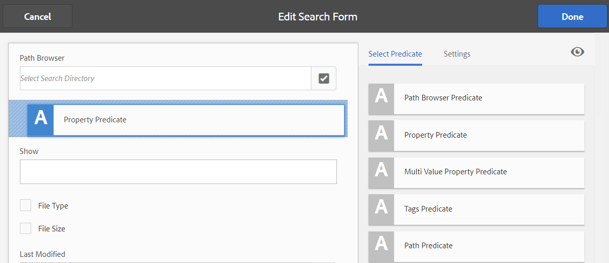

# 搜尋 Facet {#search-facets}

| 版本 | 文章連結 |
| -------- | ---------------------------- |
| AEM as a Cloud Service  | [按一下這裡](https://experienceleague.adobe.com/docs/experience-manager-cloud-service/content/assets/admin/search-facets.html?lang=en) |
| AEM 6.5 | 本文章 |

全企業範圍部署的 [!DNL Adobe Experience Manager Assets] 具有儲存許多資產的容量。 有時候，如果您只使用的一般搜尋功能，尋找正確的資產可能會很困難且耗時， [!DNL Experience Manager].

使用「篩選器」面板中的搜尋Facet為您的搜尋體驗新增更多精細度，並讓搜尋功能更有效率且更通用。 搜尋Facet會新增多個維度（述詞），讓您執行更複雜的搜尋。 「篩選器」面板包含幾個標準Facet。 您也可以新增自訂搜尋多面向。

總而言之，搜尋Facet可讓您以多種方式搜尋資產，而非使用單一、預先決定的分類順序。 您可以輕鬆向下展開至所需的詳細資訊層級，以更集中地搜尋。

例如，如果您要尋找影像，您可以選擇您要點陣圖或向量影像。 您可以指定影像的MIME型別，進一步縮小搜尋範圍。 同樣地，在搜尋檔案時，您可以指定格式，例如PDF或MS Word。

## 新增述詞 {#adding-a-predicate}

顯示在「篩選器」面板中的搜尋Facet是使用述詞定義在基礎搜尋表單中。 若要顯示更多或不同的Facet，您可以將述詞新增至預設表單，或使用包含您所選Facet的自訂表單。

若要進行全文檢索搜尋，請新增 **[!UICONTROL 全文]** 表單的述詞。 使用屬性述詞來搜尋符合您指定之單一屬性的資產。 使用「選項」述詞來搜尋符合特定屬性的一個或多個值的資產。 新增日期範圍述詞，以搜尋在指定日期範圍內建立的資產。

1. 按一下 [!DNL Experience Manager] 標誌，然後前往 **[!UICONTROL 工具]** > **[!UICONTROL 一般]** > **[!UICONTROL 搜尋Forms]**.
1. 從 [!UICONTROL 搜尋Forms] 頁面，選取 **[!UICONTROL 資產管理搜尋邊欄]**，然後按一下 **[!UICONTROL 編輯]** .

   >[!NOTE]
   >
   >若要使用預先設定的資料夾搜尋功能 [!DNL Assets] 從舊版的Admin Search Rail，執行以下步驟：
   >
   >1. 瀏覽至 `/conf/global/settings/dam/search/facets/assets/jcr:content/items` 在CRXDE中。
   >1. 刪除 `type` 節點。
   >1. 從路徑 `/libs/settings/dam/search/facets/assets/jcr:content/items`，複製節點 `asset`， `directory`， `typeor`， `excludepaths`、和 `searchtype` 至步驟1提及的路徑。
   >1. 儲存變更。

1. 在 [!UICONTROL 編輯搜尋Forms] 頁面，從拖曳述詞 **[!UICONTROL 選取述詞]** 標籤移至主窗格。 例如，拖曳 **[!UICONTROL 屬性述詞]**.

   

   *圖：選取並移動述詞以自訂搜尋篩選器。*

1. 在 [!UICONTROL 設定] 標籤，輸入欄位標籤、預留位置文字和述詞說明。 為您要與述詞關聯的中繼資料屬性指定有效的名稱。 中的標題標籤 [!UICONTROL 設定] 索引標籤會識別所選述詞的型別。

1. 在「屬 [!UICONTROL 性名稱] 」欄位中，指定您要與謂語關聯的中繼資料屬性的有效名稱。它是根據其執行搜索的名稱。例如，輸入 `jcr:content/metadata/dc:description` 或 `./jcr:content/metadata/dc:description`。

   您也可以從選取對話方塊中選取現有節點。

   

   在「屬性名稱」欄位中將中繼資料屬性與述詞建立關聯

1. 按一下 **[!UICONTROL 預覽]**  在新增述詞後產生「篩選器」面板的預覽。
1. 在預覽模式中檢閱述詞的版面。

   

   在提交變更之前預覽搜尋表單

1. 若要關閉預覽，請按一下 **[!UICONTROL 關閉]**  在預覽的右上角。
1. 按一下 **[!UICONTROL 完成]** 以儲存設定。
1. 導覽至中的搜尋面板 [!DNL Assets] 使用者介面。 屬性述詞會新增至面板。
1. 在文字方塊中輸入要搜尋之資產的說明。 例如，輸入 `Adobe`. 當您執行搜尋時，資產與說明相符 `Adobe` 會列在搜尋結果中。

## 新增選項述詞 {#adding-an-options-predicate}

選項述詞可讓您在「篩選器」面板中新增多個搜尋選項。 您可以在「篩選器」面板中選取這些選項中的一或多個來搜尋資產。 例如，若要根據檔案型別搜尋資產，請在搜尋表單中設定選項，例如「影像」、「多媒體」、「檔案」和「封存」。 設定這些選項後，當您在「濾鏡」面板中選取「影像」選項時，系統會對GIF、JPEG、PNG等型別的資產執行搜尋。

若要將選項對應至個別屬性，請建立選項的節點結構，並在Options述詞的Property Name屬性中提供父節點的路徑。 父節點應為型別 `sling`： `OrderedFolder`. 選項應為型別 `nt:unstructured`. 選項節點應具有屬性 `jcr:title` 和 `value` 已設定。

此 `jcr:title` 屬性是顯示在「篩選器」面板上之選項的使用者易記名稱。 此 `value` 欄位用於查詢以符合指定的屬性。

選取選項時，會根據 `value` 選項節點及其子節點的屬性（如果有）。 系統會遍歷option節點下的整個樹狀結構， `value` 每個子節點的屬性會使用OR運算來組合，以形成搜尋查詢。

例如，如果您為檔案類型選取「影像」，則會使用OR運算結合屬性來建立資 `value` 產的搜尋查詢。例如，通過組合影像/jpeg *、* image/gif *、* png影像、影像 */jpeg影像、以及使用OR操作對Tiff屬性進行搜索的Joff影像*****`jcr:content/metadata/dc:format` /Tiff影像的匹配結果來構建影像搜索查詢。


檔案型別的Value屬性（如CRXDE中所見）可用來讓搜尋查詢運作

您不必在CRXDE存放庫中手動建立選項的節點結構，而是可以透過指定對應的索引鍵值配對，在JSON檔案中定義選項。 在「屬性名稱」欄位中指定JSON檔 **[!UICONTROL 案的路徑]** 。例如，您可以定義鍵值配對、 `image/bmp`、 `image/gif``image/jpeg`、和 `image/png` 並指定其值，如下列範例JSON檔案中所示。在 **[!UICONTROL 屬性名稱]** 欄位中，您可以指定此檔案的CRXDE路徑。

```json
{
    "options" :
 [
          {"value" : "image/bmp","text" : "BMP"},
          {"value" : "image/gif","text" : "GIF"},
          {"value" : "image/jpeg","text" : "JPEG"},
          {"value" : "image/png","text" : "PNG"}
 ]
}
```

如果要使用現有的節點，請使用選取對話方塊來指定它。

>[!NOTE]
>
>Options述詞是包含屬性述詞的自訂包裝函式，可示範所描述的行為。 目前沒有可用的REST端點可原生支援此功能。

1. 按一下 [!DNL Experience Manager] 標誌，然後前往 **[!UICONTROL 工具]** > **[!UICONTROL 一般]** > **[!UICONTROL 搜尋Forms]**.
1. 從 **[!UICONTROL 搜尋Forms]** 頁面，選取 **[!UICONTROL 資產管理搜尋邊欄]**，然後按一下 **[!UICONTROL 編輯]**.
1. 在「編 **[!UICONTROL 輯搜索表單]** 」頁中，將「選 **[!UICONTROL 項謂詞」從]** 「選擇謂詞 **** 」頁籤拖到主窗格。
1. 在「設 **[!UICONTROL 定]** 」標籤中，輸入屬性的標籤和名稱。例如，若要根據資產的格式來搜尋資產，請為標籤指定好記的名稱，例如 **[!UICONTROL 檔案型別]**. 指定在屬性欄位中根據其執行搜索的屬性，例如, `jcr:content/metadata/dc:format.`
1. 執行下列任一項作業：

   * 在 **[!UICONTROL 屬性名稱]** 欄位，提及JSON檔案的路徑，您可在此定義選項的節點，並指定對應的索引鍵值配對。
   * 按一下 `+` 「選項」欄位旁的符號，指定您要在「濾鏡」面板中提供之選項的顯示文字和值。 若要新增其他選項，請按一下 `+` 符號並重複該步驟。

1. 確保清 **[!UICONTROL 除「單選]** 」，讓使用者一次為檔案類型選取多個選項 (例如影像、檔案、多媒體和封存)。如果您選 **[!UICONTROL 取「單選]**」，使用者一次只能為檔案類型選取一個選項。

   

   選項述詞中的可用欄位

1. 在 **[!UICONTROL 說明]** 欄位，輸入選填的說明，然後按一下 **[!UICONTROL 完成]**.
1. 導覽至「搜尋」面板。 「選項」述詞會新增至 **搜尋** 面板。 的選項 **[!UICONTROL 檔案型別]** 都會顯示成核取方塊。

## 新增多值屬性述詞 {#adding-a-multi-value-property-predicate}

多值屬性述詞可讓您搜尋多個值的資產。 請考量您在中擁有多個產品影像的情況 [!DNL Assets] 且每個影像的中繼資料都包含與產品相關聯的SKU編號。 您可以使用此述詞來根據多個SKU編號搜尋產品影像。

1. 按一下 [!DNL Experience Manager] 標誌，然後前往 **[!UICONTROL 工具]** > **[!UICONTROL 一般]** > **[!UICONTROL 搜尋Forms]**.
1. 在「搜尋Forms」頁面上，選取 **[!UICONTROL 資產管理搜尋邊欄]**，然後按一下 **[!UICONTROL 編輯]** .
1. 在「編輯搜索表單」頁中，將「 **[!UICONTROL Multi Value Property Predicate]** 」從「 **[!UICONTROL Select Predicate]** 」頁籤拖動到主窗格。
1. 在 **[!UICONTROL 設定]** 標籤，輸入述詞的標籤和預留位置文字。 指定在屬性欄位中根據其執行搜尋的屬性名稱，例如， `jcr:content/metadata/dc:value`. 您也可以使用選取對話方塊來選取節點。
1. 請確定已 **[!UICONTROL 選取「分隔字元]** 」支援。在「輸入 **[!UICONTROL 分隔字元]** 」欄位中，指定分隔字元以分隔個別值。依預設，逗號會指定為分隔字元。您可以指定不同的分隔字元。
1. 在 **說明** 欄位，輸入選填的說明，然後按一下 **[!UICONTROL 完成]**.
1. 導覽至「 」中的「篩選器」面板 [!DNL Assets] 使用者介面。 The **[!UICONTROL Multi Value Property]** predicate is added to the panel.
1. 在「多值」欄位中指定多個值（以分隔符號分隔），然後執行搜尋。 述詞會針對您指定的值擷取完全相符的文字。

## 新增標籤述詞 {#adding-a-tags-predicate}

標籤述詞可讓您對資產執行標籤式搜尋。 根據預設， [!DNL Assets] 根據您指定的標籤，在資產中搜尋一或多個相符標籤。 換言之，搜尋查詢會使用指定的標籤執行OR操作。 不過，您可以使用符合所有標籤選項來搜尋包含您所指定之所有標籤的資產。

1. 按一下 [!DNL Experience Manager] 標誌，然後前往 **[!UICONTROL 工具]** > **[!UICONTROL 一般]** > **[!UICONTROL 搜尋Forms]**.
1. 在搜尋Forms頁面中，選取 **[!UICONTROL 資產管理搜尋邊欄]** 然後按一下 **[!UICONTROL 編輯]** .
1. 在「編輯搜尋表單」頁面中，拖曳 **[!UICONTROL 標籤述詞]** 從「選取述詞」標籤移至主窗格。
1. 在「設定」標籤中，輸入述詞的預留位置文字。 指定在屬性欄位中根據其執行搜尋的屬性名稱，例如， *jcr：content/metadata/cq：tags*. 或者，您可以從選取對話方塊中選取CRXDE中的節點。
1. 設定此述詞的根標籤路徑屬性，以填入標籤清單中的各種標籤。
1. 選取 **[!UICONTROL 「顯示符合所有標籤」選項]** ，以搜尋包含您所指定之所有標籤的資產。

1. 在 **[!UICONTROL 說明]** 欄位，輸入選填的說明，然後按一下 **[!UICONTROL 完成]**.
1. 導覽至「搜尋」面板。 此 **[!UICONTROL 標籤]** 述詞會新增至「搜尋」面板。
1. 指定您要依據其搜尋資產的標籤，或從建議清單中選取。

1. 選取 **[!UICONTROL 全部符合]** 以搜尋包含您所指定之所有標籤的相符專案。

## 新增其他述詞 {#adding-other-predicates}

與新增「屬性」述詞或「選項」述詞的方式類似，您可以將下列其他述詞新增至「搜尋」面板：

| 述詞名稱 | 說明 | 屬性 |
|---|---|---|
| [!UICONTROL 全文] | 搜尋述詞，在整個資產節點上執行全文搜尋。 它使用jcr：contains運運算元對應。 如果要在資產節點的特定部分執行全文搜尋，您可以指定相對路徑。 | <ul><li>標籤</li><li>預留位置</li><li>屬性名稱</li><li>說明</li></ul> |
| [!UICONTROL 路徑瀏覽器] | 搜尋述詞，以在預先設定的根路徑搜尋資料夾和子資料夾中的資產 | <ul><li>預留位置</li><li>根路徑</li><li>說明</li></ul> |
| [!UICONTROL 路徑] | 用它來篩選位置結果。 您可以將不同的路徑指定為選項。 | <ul><li>標籤</li><li>路徑</li><li>說明</li></ul> |
| [!UICONTROL 發佈狀態] | 搜尋述詞，以根據資產的發佈狀態進行搜尋 | <ul><li>標籤</li><li>屬性名稱</li><li>說明</li></ul> |
| [!UICONTROL 相對日期] | 搜尋述詞，以根據資產的相對建立日期來搜尋資產。 例如，您可以設定2個月前、3週前等選項。 | <ul><li>標籤</li><li>屬性名稱</li><li>相對日期</li></ul> |
| [!UICONTROL 範圍] | 搜尋述詞，以搜尋指定範圍內的資產。 在「搜尋」面板中，您可以指定範圍的最小值和最大值。 | <ul><li>標籤</li><li>屬性名稱</li><li>說明</li></ul> |
| [!UICONTROL 日期範圍] | 搜尋述詞，針對日期屬性搜尋在指定範圍內建立的資產。 在「搜尋」面板中，您可以使用日期選擇器來指定開始和結束日期。 | <ul><li>標籤</li><li>預留位置</li><li>屬性名稱</li><li>範圍文字（從）</li><li>範圍文字（至）</li><li>說明</li></ul> |
| [!UICONTROL 日期] | 根據日期屬性的資產滑桿式搜尋的搜尋述詞。 | <ul><li>標籤</li><li>屬性名稱</li><li>說明</li></ul> |
| [!UICONTROL 檔案大小] | 搜尋述詞，以根據資產的大小進行搜尋。 這是以滑桿為基礎的述詞，您可以從可設定的節點選取滑桿選項。 預設選項定義於CRXDE存放庫中的/libs/dam/options/predicates/filesize。 檔案大小以位元組為單位。 | <ul><li>標籤</li><li>屬性名稱</li><li>路徑</li><li>說明</li></ul> |
| [!UICONTROL 上次修改的資產] | 搜尋述詞以搜尋最近修改的資產 | <ul><li>屬性名稱</li><li>屬性值</li><li>說明</li></ul> |
| [!UICONTROL 發佈狀態] | 搜尋述詞，以根據資產的發佈狀態來搜尋資產 | <ul><li>標籤</li><li>屬性名稱</li><li>說明</li></ul> |
| [!UICONTROL 評等] | 根據資產的平均評等搜尋述詞 | <ul><li>標籤</li><li>屬性名稱</li><li>選項路徑</li><li>說明</li></ul> |
| [!UICONTROL 到期狀態] | 根據資產的到期狀態搜尋資產的搜尋述詞 | <ul><li>標籤</li><li>屬性名稱</li><li>說明</li></ul> |
| [!UICONTROL 隱藏] | 定義隱藏欄位屬性以搜尋資產的搜尋述詞 | <ul><li>屬性名稱</li><li>屬性值</li><li>說明</li></ul> |

## 還原預設搜尋Facet {#restoring-default-search-facets}

依預設，鎖定圖示  顯示於之前 **[!UICONTROL 資產管理搜尋邊欄]** 在 **[!UICONTROL 搜尋Forms]** 頁面。 「搜尋Forms」頁面上某個選項的鎖定圖示表示，預設設定完整且不會自訂。 圖示  如果將搜尋Facet新增至表單，指出預設表單已修改，則會消失。


若要還原預設的搜尋Facet，請執行下列步驟：

1. 選取 **[!UICONTROL 資產管理搜尋邊欄]** 在 **[!UICONTROL 搜尋Forms]** 頁面。
1. 按一下 **[!UICONTROL 刪除]**  （在工具列中）。
1. 在確認對話方塊中，按一下 **[!UICONTROL 刪除]** 以移除自訂變更。

   刪除搜尋Facet的自訂變更後，鎖定圖示  之前重新出現 **[!UICONTROL 資產管理搜尋邊欄]** 在 **[!UICONTROL 搜尋Forms]** 頁面。

## 使用者許可權 {#user-permissions}

如果您未獲指派管理員角色，以下是您需要用來執行涉及搜尋Facet的編輯、刪除和預覽動作的許可權清單。

| 動作 | 權限 |
| ------------------- | ---------------------------------------------------------------- |
| [!UICONTROL 編輯] | 的讀取和寫入許可權 `/apps` CRXDE中的節點 |
| [!UICONTROL 刪除] | 的讀取、寫入及刪除許可權 `/apps` CRXDE中的節點 |
| [!UICONTROL 預覽] | 的讀取、寫入及刪除許可權 `/var/dam/content` CRXDE中的節點。 此外，的讀取和寫入許可權 `/apps` 節點。 |

>[!MORELIKETHIS]
>
>* [擴充資產搜尋功能](searchx.md)
>* [搜尋資產](search-assets.md)
