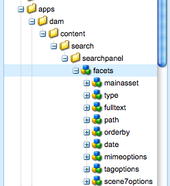

# 擴充資產搜尋 {#extending-assets-search}

您可以擴充 [!DNL Adobe Experience Manager Assets] 搜尋功能。 立即可用， [!DNL Experience Manager Assets] 依字串搜尋資產。

搜尋是透過QueryBuilder介面完成，因此可以使用數個述詞來自訂搜尋。 您可以覆蓋下列目錄中的預設述詞集： `/apps/dam/content/search/searchpanel/facets`.

您也可以新增其他標籤至 [!DNL Assets] 管理面板。

>[!CAUTION]
>
>截至 [!DNL Experience Manager] 6.4，已棄用傳統UI。 Adobe建議使用觸控式UI。 如需自訂資訊，請參閱 [搜尋facet](/help/assets/search-facets.md).

## 覆蓋 {#overlaying}

若要覆蓋預先設定的述詞，請複製 `facets` 節點來源 `/libs/dam/content/search/searchpanel` 至 `/apps/dam/content/search/searchpanel/` 或指定其他 `facetURL` 中的屬性 `searchpanel` 設定(預設為 `/libs/dam/content/search/searchpanel/facets.overlay.infinity.json`)。



>[!NOTE]
>
>依預設，底下的目錄結構 `/apps` 不存在，請建立它。 確保節點型別與以下節點型別相符 `/libs`.

## 新增索引標籤 {#adding-tabs}

您可以透過設定其他搜尋標籤，在 [!DNL Assets] 管理介面。 若要建立其他標籤：

1. 建立檔案夾結構 `/apps/wcm/core/content/damadmin/tabs,`如果尚未存在，請複製 `tabs` 節點來源 `/libs/wcm/core/content/damadmin` 並貼上。
1. 視需要建立並設定第二個索引標籤。

   >[!NOTE]
   >
   >當您建立第二個 `siteadminsearchpanel`，請務必設定 `id` 屬性以防止表單衝突。

## 建立自訂述詞 {#creating-custom-predicates}

[!DNL Assets] 隨附一組預先定義的述詞，可用於自訂「資產共用」頁面。 以這種方式自訂資產共用包含在 [建立和設定資產共用頁面](/help/assets/assets-finder-editor.md#creating-and-configuring-an-asset-share-page).

除了使用現有的述詞之外， [!DNL Experience Manager] 開發人員也可以使用建立自己的述詞 [查詢產生器API](/help/sites-developing/querybuilder-api.md).

建立自訂述詞需要有關 [Widget框架](https://helpx.adobe.com/experience-manager/6-5/sites/developing/using/reference-materials/widgets-api/index.html).

最佳實務是複製並調整現有述詞。 述詞範例位於 **/libs/cq/search/components/predicates**.

### 範例：建立簡單的屬性述詞 {#example-build-a-simple-property-predicate}

若要建置屬性述詞：

1. 在專案目錄中建立元件資料夾，例如 **/apps/weretail/components/titlepredicate**.
1. 新增 **content.xml**：

   ```xml
   <?xml version="1.0" encoding="UTF-8"?>
   <jcr:root xmlns:sling="https://sling.apache.org/jcr/sling/1.0" xmlns:cq="https://www.day.com/jcr/cq/1.0" xmlns:jcr="https://www.jcp.org/jcr/1.0"
       jcr:primaryType="cq:Component"
       jcr:title="Title Predicate"
       sling:resourceSuperType="foundation/components/parbase"
       allowedParents="[*/parsys]"
       componentGroup="Search"/>
   ```

1. 新增 `titlepredicate.jsp`.

   ```java
   <%--
   
     Sample title predicate component
   
   --%><%@ page import="java.util.Calendar" %><%
   %><%@include file="/libs/foundation/global.jsp"%><%
   
       // A unique id is necessary in case this predicate is inserted multiple times on the same page
       String elemId = "cq-predicate-" +  Long.toString(Calendar.getInstance().getTimeInMillis());
   
   %><div class="predicatebox">
   
       <div class="title">Title</div>
   
       <%-- The wrapper for the form elements. All items are appended to this wrapper. --%>
       <div id="<%= elemId %>" class="content"></div>
   
   </div><script type="text/javascript">
   
       CQ.Ext.onLoad(function() {
   
           var predicateName = "property";
           var propertyName = "jcr:content/metadata/dc:title";
           var elemId = "<%= elemId %>";
   
           // Get the page wide available QueryBuilder.
           var qb = CQ.search.Util.getQueryBuilder();
   
           // createId adds a counter to the predicate name - useful in case this predicate
           // is inserted multiple times on the same page.
           var id = qb.createId(predicateName);
   
           // Hidden field that defines the property to search for; in our case this
           // is the "dc:title" metadata. The name "property" (or "1_property", "2_property", and so on.)
           // indicates the server to use the property predicate
           // (com.day.cq.search.eval.JcrPropertyPredicateEvaluator).
           qb.addField({
               "xtype": "hidden",
               "renderTo": elemId,
               "name": id,
               "value": propertyName
           });
   
           // The visible text field. The name has to be like the one of the hidden field above
           // plus the ".value" suffix.
           qb.addField({
               "xtype": "textfield",
               "renderTo": elemId,
               "name": id + ".value"
           });
   
           // Depending on the predicate additional parameters allow to configure the
           // predicate. Here we add an operation parameter to create a "like" query.
           // Again note the name set to the id and a suffix.
           qb.addField({
               "xtype": "hidden",
               "renderTo": elemId,
               "name": id + ".operation",
               "value": "like"
           });
       });
   </script>
   ```

1. 若要讓元件可用，您必須能夠加以編輯。若要讓元件可編輯，請在CRXDE中新增主要類型 **cq:EditConfig的節點cq:editConfig******。為了能夠移除段落，請新增多值屬性 **cq:actions** ，其中單一值 **為DELETE**。
1. 導覽至您的瀏覽器，並在範例頁面上(例如， **press.html**)切換至設計模式，並為述詞段落系統啟用新元件(例如， **左側**)。

1. 在 **編輯** 模式，新元件現在可在sidekick中使用(可在 **搜尋** 群組)。 將元件插入 **述詞** 欄並輸入搜尋字詞，例如， **菱形** 並按一下放大鏡開始搜尋。

   >[!NOTE]
   >
   >搜尋時，請務必正確輸入字詞，包括正確的大小寫。

### 範例：建立簡單的群組述詞 {#example-build-a-simple-group-predicate}

若要建立群組述詞：

1. 在專案目錄中建立元件資料夾，例如 **/apps/weretail/components/picspredicate**.
1. 新增 **content.xml**：

   ```xml
   <?xml version="1.0" encoding="UTF-8"?>
   <jcr:root xmlns:sling="https://sling.apache.org/jcr/sling/1.0" xmlns:cq="https://www.day.com/jcr/cq/1.0" xmlns:jcr="https://www.jcp.org/jcr/1.0"
       jcr:primaryType="cq:Component"
       jcr:title="Image Formats"
       sling:resourceSuperType="foundation/components/parbase"
       allowedParents="[*/parsys]"
       componentGroup="Search"/>
   ```

1. 新增 **titlepredicate.jsp**：

   ```java
   <%--
   
     Sample group predicate component
   
   --%><%@ page import="java.util.Calendar" %><%
   %><%@include file="/libs/foundation/global.jsp"%><%
   
       // A unique id is necessary in case this predicate is inserted multiple times on the same page.
       String elemId = "cq-predicate-" +  Long.toString(Calendar.getInstance().getTimeInMillis());
   
   %><div class="predicatebox">
   
       <div class="title">Image Formats</div>
   
       <%-- The wrapper for the form elements. All items are append to this wrapper. --%>
       <div id="<%= elemId %>" class="content"></div>
   
   </div><script type="text/javascript">
   
       CQ.Ext.onLoad(function() {
   
           var predicateName = "property";
           var propertyName = "jcr:content/metadata/dc:format";
           var elemId = "<%= elemId %>";
   
           // Get the page wide available QueryBuilder.
           var qb = CQ.search.Util.getQueryBuilder();
   
           // Create a unique group ID; will return for example, "1_group".
           var groupId = qb.createGroupId();
   
           // Hidden field that defines the property to search for  - in our case "dc:format" -
           // and declares the group of predicates. "property" in the name ("1_group.property")
           // indicates to the server to use the "property predicate"
           // (com.day.cq.search.eval.JcrPropertyPredicateEvaluator).
           qb.addField({
               "xtype": "hidden",
               "renderTo": "<%= elemId %>",
               "name": groupId + "." + predicateName, // 1_group.property
               "value": propertyName
           });
   
           // Declare to combine the multiple values using OR.
           qb.add(new CQ.Ext.form.Hidden({
               "name": groupId + ".p.or",  // 1_group.p.or
               "value": "true"
           }));
   
           // The options
           var options = [
               { "label":"JPEG", "value":"image/jpeg"},
               { "label":"PNG",  "value":"image/png" },
               { "label":"GIF",  "value":"image/gif" }
           ];
   
           // Build a checkbox for each option.
           for (var i = 0; i < options.length; i++) {
               qb.addField({
                   "xtype": "checkbox",
                   "renderTo": "<%= elemId %>",
                   // 1_group.property.0_value, 1_group.property.1_value, and so on.
                   "name": groupId + "." +  predicateName + "." + i + "_value",
                   "inputValue": options[i].value,
                   "boxLabel": options[i].label,
                   "listeners": {
                       "check": function() {
                           // Submit the search form when checking/unchecking a checkbox.
                           qb.submit();
                       }
                   }
               });
           }
       });
   ```

1. 若要讓元件可用，您必須能夠加以編輯。若要讓元件可編輯，請在CRXDE中新增主要類型 **cq:EditConfig的節點cq:editConfig******。為了能夠移除段落，請新增多值屬性 **cq:actions** ，其中單一值 **為DELETE**。
1. 導覽至您的瀏覽器，並在範例頁面上(例如， **press.html**)切換至設計模式，並為述詞段落系統啟用新元件(例如， **左側**)。
1. 在 **編輯** 模式，新元件現在可在sidekick中使用(可在 **搜尋** 群組)。 將元件插入 **述詞** 欄。

## 已安裝的述詞Widget {#installed-predicate-widgets}

下列述詞可作為預先設定的ExtJS Widget使用。

### 全文述詞 {#fulltextpredicate}

| 屬性 | 類型 | 說明 |
|---|---|---|
| predicatename | 字串 | 述詞的名稱。 預設為 `fulltext` |
| searchCallback | 函數 | 用於觸發事件搜尋的回呼 `keyup`. 預設為 `CQ.wcm.SiteAdmin.doSearch` |

### 屬性述詞 {#propertypredicate}

| 屬性 | 類型 | 說明 |
|---|---|---|
| predicatename | 字串 | 述詞的名稱。 預設為 `property` |
| propertyName | 字串 | JCR屬性的名稱。 預設為 `jcr:title` |
| defaultvalue | 字串 | 預填的預設值。 |

### 路徑述詞 {#pathpredicate}

| 屬性 | 類型 | 說明 |
|---|---|---|
| predicatename | 字串 | 述詞的名稱。 預設為 `path` |
| rootPath | 字串 | 述詞的根路徑。 預設為 `/content/dam` |
| pathFieldPredicateName | 字串 | 預設為 `folder` |
| showFlatOption | 布林值 | 標幟以顯示核取方塊 `search in subfolders`. 預設為true。 |

### DatePredicate {#datepredicate}

| 屬性 | 類型 | 說明 |
|---|---|---|
| predicatename | 字串 | 述詞的名稱。 預設為 `daterange` |
| propertyname | 字串 | JCR屬性的名稱。 預設為 `jcr:content/jcr:lastModified` |
| defaultvalue | 字串 | 預填預設值 |

### 選項述詞 {#optionspredicate}

| 屬性 | 類型 | 說明 |
|---|---|---|
| 標題 | 字串 | 新增其他最上層標題 |
| predicatename | 字串 | 述詞的名稱。 預設為 `daterange` |
| propertyname | 字串 | JCR屬性的名稱。 預設為 `jcr:content/metadata/cq:tags` |
| 收合 | 字串 | 摺疊層級。 預設為 `level1` |
| triggerSearch | 布林值 | 勾選時觸發搜尋的旗標。 預設為false |
| searchCallback | 函數 | 用於觸發搜尋的回呼。 預設為 `CQ.wcm.SiteAdmin.doSearch` |
| searchTimeoutTime | 數字 | 引發searchCallback之前的逾時。 預設為800毫秒 |

## 自訂搜尋結果 {#customizing-search-results}

在「資產共用」頁面上呈現搜尋結果時，會受選取的鏡頭所控制。 [!DNL Experience Manager Assets] 隨附一組預先定義的鏡頭，可用於自訂「資產共用」頁面。 以這種方式自訂資產共用包含在 [建立和設定資產共用頁面](/help/assets/assets-finder-editor.md#creating-and-configuring-an-asset-share-page).

除了使用現有的鏡頭， [!DNL Experience Manager] 開發人員也可以建立自己的鏡頭。
