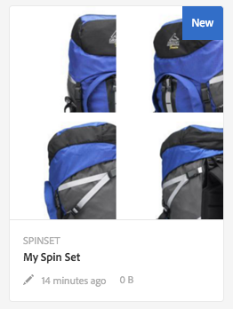
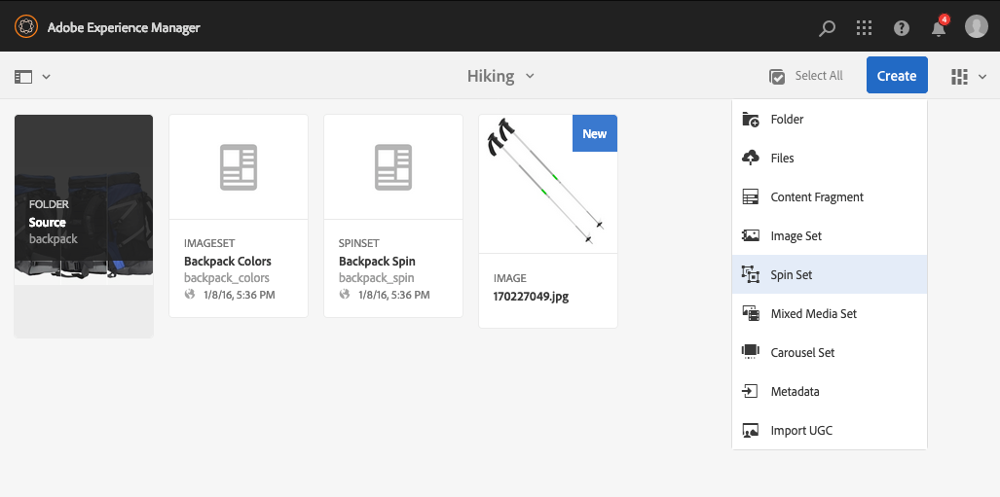
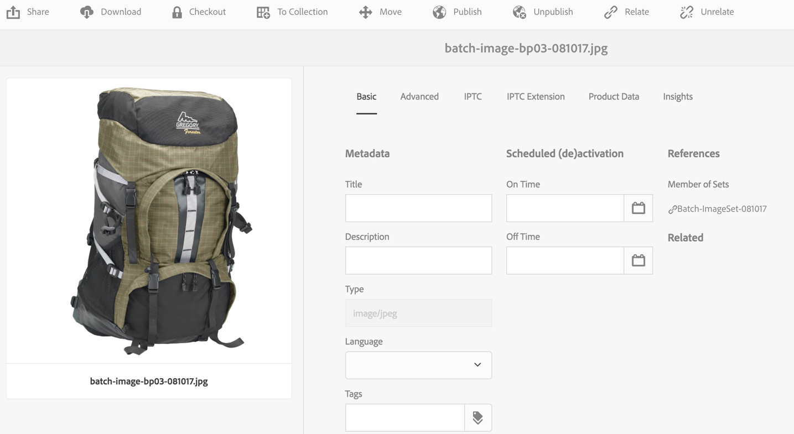
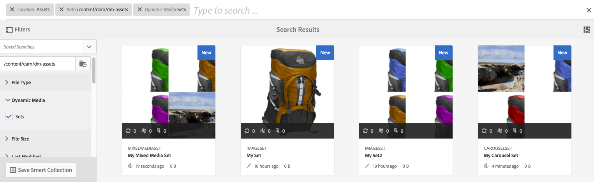

# 迴轉集{#spin-sets}

「迴轉集」會模擬實際動作，即旋轉物件來檢查它。 「迴轉集」可讓您從任何角度檢視專案，從任何角度獲得關鍵的視覺細節。

迴轉集可模擬360度的觀賞體驗。 Dynamic Media提供單軸旋轉集，檢視器可在此旋轉專案。 此外，使用者只要按幾下滑鼠即可隨意縮放及平移任何檢視。 如此一來，使用者可以從特定觀點更密切地檢查專案。

迴轉集由橫幅指定，其字詞為&#x200B;**[!UICONTROL 迴轉集]**。 此外，如果已發佈迴轉集，則會顯示以&#x200B;**[!UICONTROL World]**&#x200B;圖示表示的發佈日期與上次修改日期（以&#x200B;**[!UICONTROL 鉛筆]**&#x200B;圖示表示）在橫幅上。

>[!NOTE]
>
>如需Assets使用者介面的相關資訊，請參閱[管理資產](/help/assets/manage-assets.md)。

當您建立「迴轉集」時，Adobe會建議下列最佳作法並強制執行下列限制：

| 限制型別 | 最佳實務 | 強加的限制 |
| --- | --- | --- |
| 每個2D集的最大列/欄數 | 每組12至18個影像 | 1000 |

另請參閱[Dynamic Media限制](/help/assets/limitations.md)。

## 快速入門：迴轉集 {#quick-start-spin-sets}

若要快速啟動並執行「迴轉集」，請遵循下列步驟：

1. [上傳您多個檢視的影像](#uploading-assets-for-spin-sets)。

   一維「迴轉集」至少需要8-12次專案快照，二維「迴轉集」至少需要16-24次專案快照。 拍攝必須定期進行，以提供專案正在旋轉和翻轉的印象。 例如，如果一維「迴轉集」包含12個鏡頭，則每個鏡頭應將專案旋轉30° (360/12)。

   如需迴轉集支援的格式清單，請參閱[Dynamic Media — 支援的光柵影像格式](/help/assets/assets-formats.md#supported-raster-image-formats-dynamic-media)。

1. [建立迴轉集](#creating-spin-sets)。

   若要建立迴轉集，請選取&#x200B;**[!UICONTROL 建立>迴轉集]**，然後命名迴轉集、選擇資產，然後選擇影像的顯示順序。

   請參閱[使用選取器](/help/assets/working-with-selectors.md)。

   >[!NOTE]
   >
   >您也可以透過批次集預設集自動 [建立回轉集](/help/assets/config-dms7.md#creating-batch-set-presets-to-auto-generate-image-sets-and-spin-sets)。**重要：**&#x200B;批次集由IPS (Image Production System)建立，作為資產擷取的一部分，僅適用於Dynamic Media - Scene7模式。

1. 視需要設定[迴轉集檢視器預設集](/help/assets/managing-viewer-presets.md)。

   管理員可以建立或修改回轉集檢視器預設集。若要檢視含有檢視器預設集的回轉集，請選取該回轉集，然後在左側導軌下拉式選單中選取「檢 **視器**」。

   若要建立或編輯檢視器預設集，請參閱&#x200B;**[!UICONTROL 工具]** > **[!UICONTROL Assets]** > **[!UICONTROL 檢視器預設集]**。

   請參閱[新增及編輯檢視器預設集](/help/assets/managing-viewer-presets.md)。

1. [檢視迴轉集](#viewing-spin-sets)。

   您可以透過三種不同的方式，檢視及存取透過批次集預設集建立的集合。 （使用批次集預設集建立的集合，請&#x200B;*不*&#x200B;出現在使用者介面中。）

1. [預覽迴轉集](/help/assets/previewing-assets.md)。

   選取「迴轉集」並加以預覽。 旋轉迴轉集。 您可以從&#x200B;**[!UICONTROL 檢視器]**&#x200B;功能表（可從左側導軌下拉式功能表取得）中選擇不同的檢視器。

1. [Publish迴轉集](/help/assets/publishing-dynamicmedia-assets.md)。

   發佈迴轉集會啟用URL和內嵌字串。 此外，您必須[發佈檢視器預設集](/help/assets/managing-viewer-presets.md)。

1. [將URL連結至您的網頁應用程式](/help/assets/linking-urls-to-yourwebapplication.md)或[內嵌視訊或影像檢視器](/help/assets/embed-code.md)。

   Adobe Experience Manager Assets會為迴轉集建立URL呼叫，並在您發佈迴轉集後啟用。 您可以在預覽資產時複製這些URL。 或者，您也可以將它們內嵌在您的網站上。

   選取「回轉集」，然後在左側導軌下拉式選單中選取「檢 **[!UICONTROL 視器]**」。

   請參閱[將迴轉集連結至網頁](/help/assets/linking-urls-to-yourwebapplication.md)以及[內嵌視訊或影像檢視器](/help/assets/embed-code.md)。

如有必要，您可以[編輯迴轉集](#editing-spin-sets)。 此外，您可以檢視及修改[迴轉集屬性](/help/assets/manage-assets.md#editing-properties)。

## 上傳迴轉集的資產 {#uploading-assets-for-spin-sets}

一維「迴轉集」至少需要8-12次專案快照，二維「迴轉集」至少需要16-24次專案快照。 拍攝必須定期進行，以提供專案正在旋轉和翻轉的印象。 例如，如果一維「迴轉集」包含12個鏡頭，則每個鏡頭應將專案旋轉30° (360/12)。

您可以像在Experience Manager Assets](/help/assets/manage-assets.md)中[上傳任何其他資產一樣上傳迴轉集的影像。

如需迴轉集支援的格式清單，請參閱[Dynamic Media — 支援的光柵影像格式](/help/assets/assets-formats.md#supported-raster-image-formats-dynamic-media)。

### 擷取迴轉集影像的准則 {#guidelines-for-shooting-spin-set-images}

以下是關於迴轉集影像的一些最佳實務。 一般而言，您在「迴轉集」中的影像越多，影像迴轉效果就越好。 不過，在集合中包含許多影像也會增加影像載入所需的時間。 Experience Manager建議您在拍攝影像以用於「迴轉集」時，遵循下列准則：

* 在一維迴轉集中至少使用8-12個影像，在二維迴轉集中至少使用16-24個影像。 至少需要8個影像才能旋轉360度。 由於建立二維迴轉集需要大量人力，因此一維迴轉集較常見。
* 使用無損格式；建議使用TIFF和PNG。
* 遮罩所有影像，讓專案出現在純白色或其他高對比的背景上。 選擇性地新增陰影。
* 請確定產品詳細資料清晰明瞭，且重點突出。
* 拍攝帶有人體模型或模特的時尚服裝旋轉影像。 通常，人體模型會被遮罩（使用玻璃人體模型），或樣式化的人體模型/服裝模型會顯示在影像中。 您可以定義角度數來建立模型上的迴轉集。 在地板上用膠帶標籤每個角度，這樣您就可以引導模型步進，並檢視每個拍攝的方向。

## 建立迴轉集 {#creating-spin-sets}

本節說明如何在Experience Manager中建立「迴轉集」。

>[!NOTE]
>
>您也可以透過批次集預設集自動 [建立回轉集](/help/assets/config-dms7.md#creating-batch-set-presets-to-auto-generate-image-sets-and-spin-sets)。**重要：**&#x200B;批次集由IPS (Image Production System)建立，作為資產擷取的一部分，僅適用於Dynamic Media - Scene7模式。
>
>請參閱[設定Dynamic Media - Scene7模式](/help/assets/config-dms7.md#creating-batch-set-presets-to-auto-generate-image-sets-and-spin-sets)中的「建立批次集預設集以自動生成影像集和迴轉集」。
>

>[!NOTE]
>
>影像在迴轉集中出現的順序很重要。 請務必加以排序，使旋轉呈現平滑的360度檢視。

當您建立「迴轉集」時，Adobe會建議下列最佳作法並強制執行下列限制：

| 限制型別 | 最佳實務 | 有限強制的 |
| --- | --- | --- |
| 每個2D集的最大列/欄數 | 每組12至18個影像 | 1000 |

另請參閱[Dynamic Media限制](/help/assets/limitations.md)。

**若要建立迴轉集：**

1. 在Assets中，導覽至您要建立迴轉集的位置，選取&#x200B;**[!UICONTROL 建立]**，然後選取&#x200B;**[!UICONTROL 迴轉集]**。 您也可以從包含資產的資料夾內建立資產集。隨即顯示回轉集編輯器。

   

1. 在迴轉集編輯器的&#x200B;**[!UICONTROL 標題]**&#x200B;欄位中，輸入迴轉集的名稱。 名稱會出現在整個迴轉集的橫幅中。 選擇性地輸入說明。

   

   >[!NOTE]
   >
   >建立迴轉集時，您可以變更迴轉集縮圖，或允許Experience Manager根據迴轉集中的資產自動選取縮圖。 若要選取縮圖，請選取&#x200B;**[!UICONTROL 變更縮圖]**&#x200B;並選取任何影像（您也可以導覽至其他資料夾以尋找影像）。 如果您已選取縮圖，然後決定要讓Experience Manager從迴轉集產生縮圖，請選取&#x200B;**[!UICONTROL 切換至自動縮圖]**。

1. 執行下列任一項作業：

   * 在「迴轉集編輯器」頁面的左上角附近，選取&#x200B;**[!UICONTROL 新增資產]**。

   * 在「迴轉集編輯器」頁面中間附近，選取「**[!UICONTROL 選取」以開啟「資產選擇器」]**。

   選取以選取您要納入迴轉集的資產。 選取的資產上面有核取標籤圖示。完成後，在頁面的右上角附近，選取&#x200B;**[!UICONTROL 選取]**。

   使用「資產選擇器」，您可以輸入關鍵字並點選「回報」來搜尋 **[!UICONTROL 資產]**。您也可以套用篩選條件來調整搜尋結果。您可以依路徑、系列、檔案類型和標籤來篩選。選取篩選，然後在工具列上選取&#x200B;**[!UICONTROL 篩選]**&#x200B;圖示。 點選「檢視」圖示並選取「欄檢視」、「卡片檢視」或「清 **[!UICONTROL 單檢視」]**, **[!UICONTROL 以變更]**&#x200B;檢視 ****。

   請參閱[使用選取器](/help/assets/working-with-selectors.md)。

   

1. 將資產新增至集時，資產會自動以字母數字順序新增。 在新增資產後，您可以手動重新排序或排序資產。

   如有必要，請將資產的「重新排序」圖示拖曳至資產檔案名稱的右側，以將影像重新排序至設定清單的上方或下方。

   來重新排序迴轉集中的。

   將影格11拖曳至新位置，以重新排序迴轉集內的影格。

1. （可選）執行下列任一項作業：

   * 若要刪除影像，請選取該影像，然後選取&#x200B;**[!UICONTROL 刪除資產]**。

   * 若要套用預設集，在頁面右上角附近選取「**[!UICONTROL 預設集]**」，然後選取要一次套用至所有資產的預設集。

1. 選取&#x200B;**[!UICONTROL 儲存]**。您新建立的「迴轉集」會顯示在您建立的資料夾中。

## 檢視迴轉集 {#viewing-spin-sets}

您可以在使用者介面中或自動使用[批次集預設集](/help/assets/config-dms7.md#creating-batch-set-presets-to-auto-generate-image-sets-and-spin-sets)來建立迴轉集。 但是，使用批次集預設集建立的集，請&#x200B;*不*&#x200B;出現在使用者介面中。 您可以透過三種不同的方式，存取透過批次集預設集建立的集合。 （即使您已在使用者介面中建立迴轉集，仍可使用這些方法）。

>[!NOTE]
>
>您也可以透過使用者介面檢視迴轉集，如[編輯迴轉集](#editing-spin-sets)中所述。

**檢視迴轉集：**

1. 開啟個別資產的屬性時。 屬性指出選取的資產所屬集合（在&#x200B;**[!UICONTROL 集合成員]**&#x200B;之下）。 選取集合名稱，以便檢視整個集合。

   

1. 來自任何組的成員映像。選取&#x200B;**[!UICONTROL 集合]**&#x200B;功能表以顯示資產所屬的集合。

   

1. 在搜尋中，您可以選取「篩 **[!UICONTROL 選器]**」，然後展開「 **[!UICONTROL 動態媒體]** 」並選 **[!UICONTROL 取「集]**」。

   搜尋會傳回在UI中手動建立，或透過批次集預設集自動建立的相符集。 對於自動化集，搜尋查詢是使用`Starts with`搜尋條件執行的，不同於以使用`Contains`搜尋條件為基礎的Experience Manager搜尋。 將篩選器設定為&#x200B;**[!UICONTROL 集]**&#x200B;是搜尋自動化集的唯一方法。

   

## 編輯迴轉集 {#editing-spin-sets}

您可以在「迴轉集」上執行各種編輯工作，例如：

* 新增影像至迴轉集。
* 重新排序迴轉集中的影像。
* 刪除迴轉集中的資產。
* 套用檢視器預設集。
* 刪除迴轉集。

**若要編輯迴轉集：**

1. 執行下列任一項作業：

   * 將游標暫留在迴轉集資產上，然後選取&#x200B;**[!UICONTROL 編輯]** （鉛筆圖示）。
   * 將滑鼠指標暫留在迴轉集資產上，選取&#x200B;**[!UICONTROL 選取]** （勾選圖示），然後在工具列上選取&#x200B;**[!UICONTROL 編輯]**。

   * 在迴轉集資產上選取，然後在工具列上選取&#x200B;**[!UICONTROL 編輯]** （鉛筆圖示）。

1. 若要編輯「迴轉集」，請執行下列任一項作業：

   * 若要重新排序影像，請將影像拖曳至新位置（選取重新排序圖示以移動專案）。
   * 若要以遞增或遞減順序排序專案，請選取欄標題。
   * 若要新增資產或更新現有資產，請選取&#x200B;**[!UICONTROL 新增資產]**。 導覽至某個資產，選取該資產，然後選取右上角附近的&#x200B;**[!UICONTROL 選取]**。
如果您刪除Experience Manager用於縮圖的影像，改為另一個影像，則仍會顯示原始資產。
   * 若要刪除資產，請選取該資產，然後選取&#x200B;**[!UICONTROL 刪除資產]**。
   * 若要套用預設集，請選取「預設集」圖示並選取預設集。
   * 若要刪除整個迴轉集，請導覽至該迴轉集，選取它，然後選取&#x200B;**[!UICONTROL 刪除]**
   >[!NOTE]
   >
   >您可以導覽至迴轉集編輯影像，選取左側邊欄中的&#x200B;**[!UICONTROL 設定成員]**，然後選取個別資產上的「鉛筆」圖示以開啟編輯視窗。

1. 完成編輯時選取&#x200B;**[!UICONTROL 儲存]**。

## 預覽迴轉集 {#previewing-spin-sets}

請參閱[預覽資產](/help/assets/previewing-assets.md)。

## Publish a迴轉集 {#publishing-spin-sets}

檢視[Publish資產](/help/assets/publishing-dynamicmedia-assets.md)。
