# 整合Dynamic Media檢視器與Adobe Analytics和Experience Platform標籤 {#integrating-dynamic-media-viewers-with-adobe-analytics-and-adobe-launch}

## 什麼是Dynamic Media Viewers與Adobe Analytics和Experience Platform標籤的整合？ {#what-is-dynamic-media-viewers-integration-with-adobe-analytics-and-adobe-launch}

<!-- Leave this hidden path here; it points to the topic source from Sasha https://wiki.corp.adobe.com/pages/viewpage.action?spaceKey=~oufimtse&title=Dynamic+Media+Viewers+integration+with+Adobe+Launch -->

適用於Experience Platform Tags和Dynamic Media Viewers 5.13的&#x200B;*Dynamic Media Viewers*&#x200B;擴充功能可讓Adobe Analytics和Experience Platform Tags客戶使用其Experience Platform Tags設定中專用於Dynamic Media Viewers的事件和資料。

此整合表示您可以使用Adobe Analytics追蹤網站上的Dynamic Media Viewers使用情況。 同時，您也可以將檢視器公開的事件和資料，與任何來自Adobe或協力廠商的其他Experience Platform Tags擴充功能搭配使用。

若要深入瞭解Adobe擴充功能或協力廠商擴充功能，請參閱Experience Platform標籤使用指南中的[Adobe擴充功能](https://experienceleague.adobe.com/en/docs/experience-platform/tags/extensions/overview)。

**本主題適用於下列人員：**&#x200B;網站管理員、Experience Platform開發人員，以及營運人員。

### 整合的限制 {#limitations-of-the-integration}

* 適用於Dynamic Media檢視器的Experience Platform標籤整合無法在Experience Manager作者節點中運作。 在發佈之前，您無法從WCM頁面看到任何追蹤。
* 「快顯視窗」作業模式不支援動態媒體檢視器的Experience Platform Tags整合，此模式是使用資產詳細資訊頁面上的「URL」按鈕取得檢視器URL。
* Experience Platform Tags整合不能與舊版檢視器Analytics整合約時使用（透過`config2=`引數）。
* 視訊追蹤支援僅限於「核心播放」追蹤，如[追蹤概述](https://experienceleague.adobe.com/en/docs/media-analytics/using/tracking/track-core-overview)所述。 特別不支援QoS、廣告、章節/區段或錯誤追蹤。
* 使用&#x200B;*Dynamic Media檢視器*&#x200B;擴充功能的資料元素不支援資料元素的儲存期間設定。 儲存期間必須設定為&#x200B;**[!UICONTROL 無]**。

### 整合的使用案例 {#use-cases-for-the-integration}

與Experience Platform標籤整合的主要使用案例是同時使用Adobe Experience Manager Assets和Adobe Experience Manager Sites的客戶。 在這種情況下，您可以設定Experience Manager製作節點與Experience Platform標籤之間的標準整合，然後將您的Sites例項與Experience Platform標籤屬性建立關聯。 之後，新增至Sites頁面的任何Dynamic Media WCM元件都會追蹤檢視器的資料和事件。

請參閱[在Experience Manager Sites中追蹤Dynamic Media檢視器](#tracking-dynamic-media-viewers-in-aem-sites)。

整合支援的次要使用案例為僅使用Experience Manager Assets或Dynamic Media Classic的客戶。 在這種情況下，您需要取得檢視器的內嵌程式碼，並將其新增至網站頁面。 接著，從Experience Platform Tags取得Experience Platform Tags資料庫生產URL，並手動將其新增至網頁程式碼。

請參閱[使用內嵌程式碼追蹤Dynamic Media檢視器](#tracking-dynamic-media-viewers-using-embed-code)。

<!-- Path on internal wiki [About tracking Dynamic Media viewers using embed code](https://wiki.corp.adobe.com/display/~oufimtse/Dynamic+Media+Viewers+integration+with+Adobe+Launch#DynamicMediaViewersintegrationwithAdobeLaunch-TrackingDynamicMediaViewersusingEmbedcode). -->

## 資料和事件追蹤在整合中的運作方式 {#how-data-and-event-tracking-works-in-the-integration}

此整合利用了兩種獨立且獨立的Dynamic Media檢視器追蹤型別： *Adobe Analytics*&#x200B;和&#x200B;*Adobe Analytics for Audio and Video*。

### 關於使用Adobe Analytics進行追蹤  {#about-tracking-using-adobe-analytics}

Adobe Analytics可讓您追蹤一般使用者在您網站上與Dynamic Media檢視器互動時所執行的動作。 Adobe Analytics也可讓您追蹤檢視器特定資料。 例如，您可以追蹤並記錄檢視載入事件以及資產名稱、任何已發生的縮放動作和視訊播放動作。

在Experience Platform Tags中，*資料元素*&#x200B;和&#x200B;*規則*&#x200B;的概念可共同啟用Adobe Analytics追蹤。

#### 關於Experience Platform標籤中的資料元素 {#about-data-elements-in-adobe-launch}

Experience Platform Tags中的資料元素是已命名的屬性，其值是以靜態方式定義，或根據網頁的狀態或Dynamic Media檢視器資料進行動態計算。

資料元素定義可用的選項取決於Experience Platform標籤屬性中安裝的擴充功能清單。 「核心」擴充功能已預先安裝，並可立即用於任何設定。 此「核心」擴充功能可讓您定義資料元素，其值來自Cookie、JavaScript程式碼、查詢字串和許多其他來源。

如在[擴充功能的安裝及設定](#installing-and-setup-of-extensions)中所述，若要追蹤Adobe Analytics，必須安裝其他數個擴充功能。 Dynamic Media檢視器擴充功能新增定義「資料元素」的功能，資料元素的值為動態檢視器事件的引數。 例如，它可以參照檢視器型別，或檢視器載入時報告的資產名稱、一般使用者縮放時報告的縮放等級等等。

Dynamic Media Viewer擴充功能會自動使其資料元素的值保持最新。

定義資料元素後，您就可以使用資料元素選擇器Widget，將其用於Experience Platform Tags UI的其他位置。 尤其是，為追蹤Dynamic Media檢視器而定義的資料元素，會由「規則」中Adobe Analytics擴充功能的「設定變數」動作參照（請參閱下文）。

請參閱[資料元素](https://experienceleague.adobe.com/en/docs/experience-platform/tags/ui/data-elements)。

#### 關於Experience Platform Tags中的規則 {#about-rules-in-adobe-launch}

Experience Platform Tags中的規則是無法辨識的設定，它定義了構成規則的三個區域： *事件*、*條件*&#x200B;和&#x200B;*動作*：

* *事件* (if)會告知Experience Platform Tags何時觸發規則。
* *條件* (if)會告知Experience Platform Tags在觸發規則時允許或禁止哪些其他限制。
* *動作* （接著）告訴Experience Platform Tags規則觸發時要做什麼。

「事件」、「條件」和「動作」區段中可用的選項取決於安裝在Experience Platform Tags屬性中的擴充功能。 *Core*&#x200B;擴充功能已預先安裝，且在任何組態中都可以立即使用。 擴充功能提供數個事件選項，例如基本瀏覽器層級的動作。 這些動作包括焦點變更、按鍵和表單提交。 此外也包含條件的選項，例如Cookie值、瀏覽器型別等。 針對「動作」，只有「自訂程式碼」選項可用。

針對Adobe Analytics追蹤，必須安裝數個其他擴充功能，如[擴充功能的安裝及設定](#installing-and-setup-of-extensions)中所述。 具體來說：

* Dynamic Media檢視器擴充功能可將支援的事件清單擴充至特定於Dynamic Media檢視器的事件，例如檢視器載入、資產交換、放大和視訊播放。
* Adobe Analytics擴充功能擴充了支援的動作清單，包含傳送資料至追蹤伺服器所需的兩個動作： *設定變數*&#x200B;和&#x200B;*傳送信標*。

若要追蹤Dynamic Media檢視器，您可以使用下列任何型別：

* 來自Dynamic Media檢視器擴充功能、核心擴充功能或任何其他擴充功能的事件。
* 規則定義中的條件。 或者，您也可以將條件區域保持空白。

在「動作」區段中，您必須有&#x200B;*設定變數*&#x200B;動作。 此動作會告訴Adobe Analytics如何使用資料填入追蹤變數。 同時，*設定變數*&#x200B;動作不會傳送任何內容至追蹤伺服器。

*設定變數*&#x200B;動作之後必須是&#x200B;*傳送信標*&#x200B;動作。 *傳送信標*&#x200B;動作會實際將資料傳送至Analytics追蹤伺服器。 這兩個動作&#x200B;*設定變數*&#x200B;和&#x200B;*傳送信標*&#x200B;都來自Adobe Analytics擴充功能。

請參閱[規則](https://experienceleague.adobe.com/en/docs/experience-platform/tags/ui/rules)。

#### 設定範例 {#sample-configuration}

Experience Platform Tags中的下列設定範例示範如何在檢視器載入時追蹤資產名稱。

1. 從&#x200B;**[!UICONTROL 資料元素]**&#x200B;索引標籤，定義參考動態媒體檢視器擴充功能中`LOAD`事件的`asset`引數的資料元素`AssetName`。

   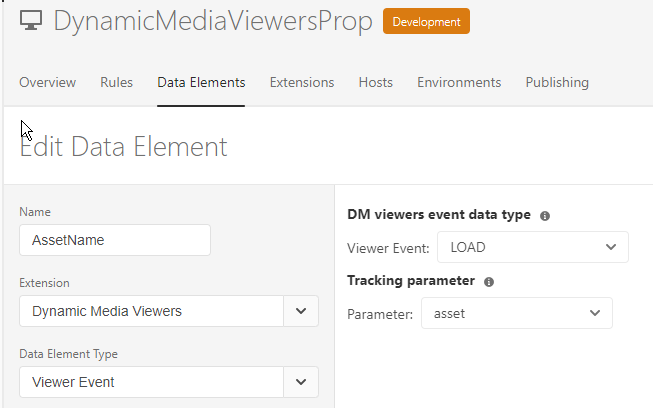

1. 從&#x200B;**[!UICONTROL 規則]**&#x200B;索引標籤，定義規則&#x200B;*TrackAssetOnLoad*。

   In this rule, the **[!UICONTROL Event]** field uses the **[!UICONTROL LOAD]** event from the Dynamic Media Viewers extension.

   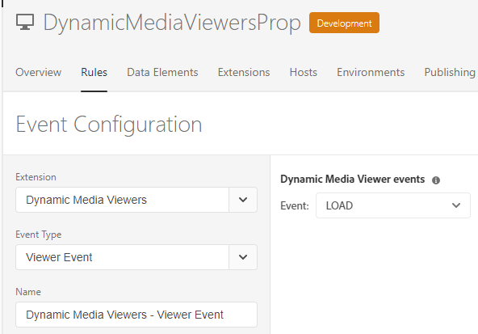

1. The Action configuration has two Action types from the Adobe Analytics extension:

   *Set Variables*, which map an analytics variable of your choice to the value of `AssetName` Data Element.

   *Send Beacon*, which sends tracking information to Adobe Analytics.

   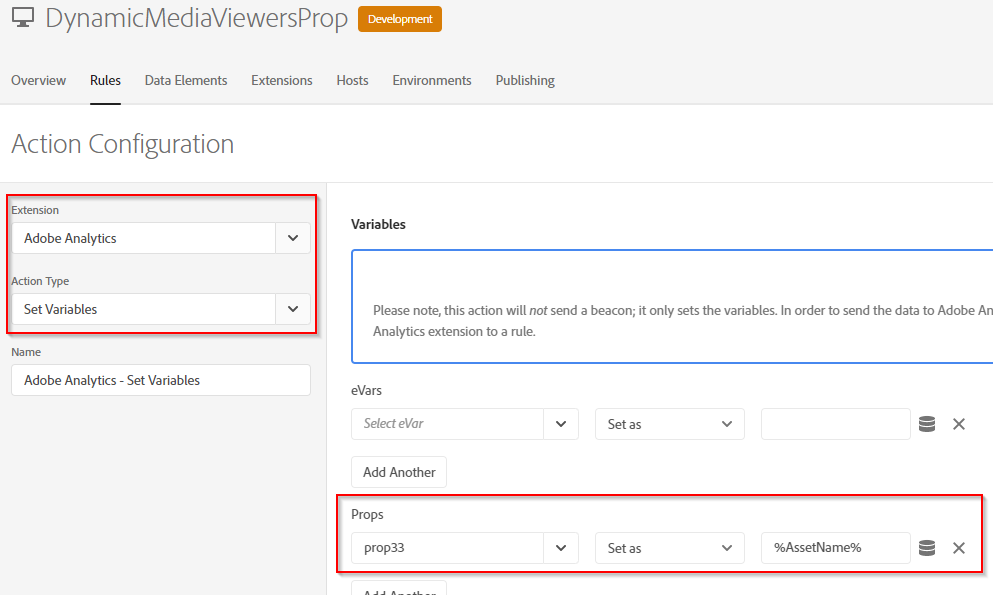

1. The resulting rule configuration looks like the following:

   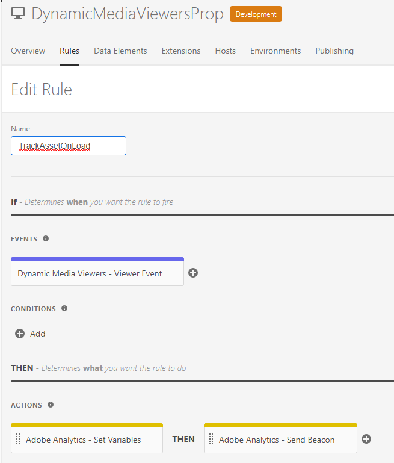

### About Adobe Analytics for Audio and Video {#about-adobe-analytics-for-audio-and-video}

When an Experience Cloud account is subscribed to use Adobe Analytics for Audio and Video, it is enough to enable video tracking in the *Dynamic Media Viewers* extension settings. Video metrics become available in Adobe Analytics. Video tracking depends on the presence of Adobe Media Analytics for Audio and Video extension.

See [Installation and setup of extensions](#installing-and-setup-of-extensions).

Currently, the support for video tracking is limited to &quot;core playback&quot; tracking only, as described in [Tracking overview](https://experienceleague.adobe.com/en/docs/media-analytics/using/tracking/track-core-overview). 特別不支援QoS、廣告、章節/區段或錯誤追蹤。

## Use the Dynamic Media Viewers extension {#using-the-dynamic-media-viewers-extension}

As mentioned in [Use cases for the integration](#use-cases-for-the-integration), it is possible to track Dynamic Media viewers with the new Experience Platform Tags integration in Experience Manager Sites and by using embed code.

### Track Dynamic Media viewers in Experience Manager Sites {#tracking-dynamic-media-viewers-in-aem-sites}

To track Dynamic Media viewers in Experience Manager Sites, all steps listed under the [Configure all the integration pieces](#configuring-all-the-integration-pieces) section must be performed. Specifically, you must create the IMS configuration and the Experience Platform Tags Cloud Configuration.

Following proper configuration, any Dynamic Media viewer that you add to a Sites page, using a WCM component supported by Dynamic Media, automatically tracks data to Adobe Analytics, or Adobe Analytics for Video, or both.

<!--
To be reviewed and updated although this is found live in the Experience ManageraaCS version:
See [Adding Dynamic Media Assets to Pages using Adobe Sites](https://helpx.adobe.com/experience-manager/6-5/help/assets/adding-dynamic-media-assets-to-pages.html).
-->

### Track Dynamic Media viewers using embed code {#tracking-dynamic-media-viewers-using-embed-code}

Customers who do not use Experience Manager Sites, or embed Dynamic Media viewers into web pages outside of Experience Manager Sites, or both, can still use the Experience Platform Tags integration.

Complete the configuration steps from the [Configure Adobe Analytics](#configuring-adobe-analytics-for-the-integration) and [Configure Experience Platform Tags](#configuring-adobe-launch-for-the-integration) sections. However, Experience Manager-related configuration steps are not needed.

Following proper configuration, you can add Experience Platform Tags support to a web page with a Dynamic Media viewer.

See [Add the Experience Platform Tags Embed Code](https://experienceleague.adobe.com/en/docs/platform-learn/implement-in-websites/configure-tags/add-embed-code) to learn more about how to use the Experience Platform Tags library embed code.

<!--
To be reviewed and updated although this is found live in the Experience ManageraaCS version:
See [Embedding the Video or Image Viewer on a Web Page](https://helpx.adobe.com/experience-manager/6-5/help/assets/embed-code.html) to learn more about how to use the embed code feature of Experience Manager Dynamic Media.
-->

**Track Dynamic Media viewers using the embed code:**

1. Have a web page ready for embedding a Dynamic Media viewer.
1. Obtain the embed code for the Experience Platform Tags library by first logging in to Experience Platform Tags (see [Configuring Experience Platform Tags](#configuring-adobe-launch-for-the-integration)).
1. Select **[!UICONTROL Property]**, then select the **[!UICONTROL Environments]** tab.
1. Pick up the Environment level that is relevant to the environment of the web page. Then, in the **[!UICONTROL Install]** column, select the box icon.
1. **[!UICONTROL In the Web Install Instructions]** dialog box, copy the complete Experience Platform Tags library embed code, along with the surrounding `<script/>` tags.

## Reference guide for the Dynamic Media Viewers extension {#reference-guide-for-the-dynamic-media-viewers-extension}

### About the Dynamic Media Viewers configuration {#about-the-dynamic-media-viewers-configuration}

The Dynamic Media Viewer extension automatically integrates with the Experience Platform Tags library if the following conditions below are true:

* Experience Platform Tags library global object ( `_satellite`) is present on the page.
* The Dynamic Media Viewers extension function `_dmviewers_v001()` is defined on `_satellite`.

* `config2=` viewer parameter is not specified, which means that viewer does not use legacy Analytics integration.

Also, there is an option to explicitly disable Experience Platform Tags integration in the viewer by specifying `launch=0` parameter in the viewer&#39;s configuration. The default value of this parameter is `1`.

### Configure the Dynamic Media Viewers extension {#configuring-the-dynamic-media-viewers-extension}

The only configuration option for the Dynamic Media Viewers extension is **[!UICONTROL Enable Adobe Media Analytics for Audio and Video]**.

When you check (enable) this option, and the Adobe Media Analytics for Audio and Video extension is installed and configured, video playback metrics are sent to the Adobe Analytics for Audio and Video solution. Disabling this option turns off video tracking.

If you enable this option *without* having the Adobe Media Analytics for Audio and Video extension installed, the option has no effect.

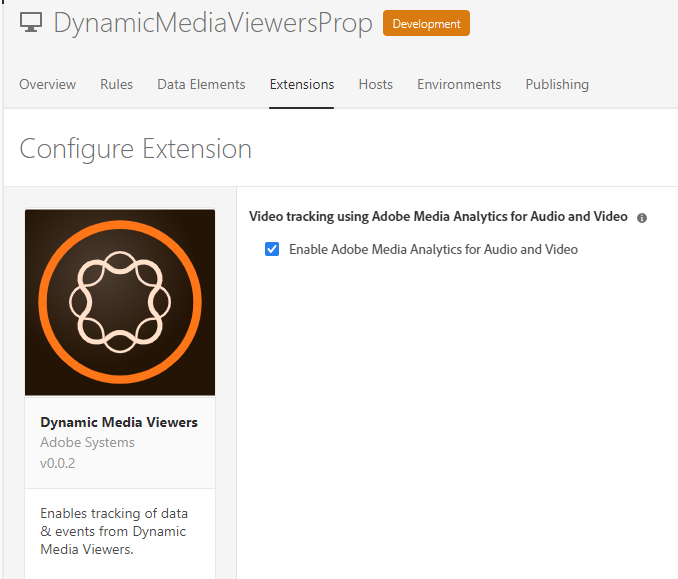

### About Data Elements in the Dynamic Media Viewers extension {#about-data-elements-in-the-dynamic-media-viewers-extension}

「動態媒體檢視器」擴充功能提供的唯一「資料元素」類型是「資 **[!UICONTROL 料元素類型」下拉式清單中的「檢]****** 視器事件」。

When selected, the Data Element editor renders a form with two fields:

* **[!UICONTROL DM檢視器事件資料類型]** -一個下拉式清單，可識別動態媒體檢視器擴充功能支援的所有檢視器事件 (具有引數)，加上特殊的 **[!UICONTROL COMMON]** 項目。 COMMON **** 項目代表檢視器所傳送之所有類型事件的共同事件參數清單。
* **[!UICONTROL 追蹤引數]** — 所選Dynamic Media檢視器事件的引數。

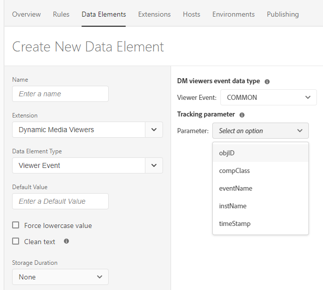

請參閱[Dynamic Media檢視器參考指南](https://experienceleague.adobe.com/en/docs/dynamic-media-developer-resources/library/viewers-aem-assets-dmc/c-html5-s7-aem-asset-viewers#viewers-aem-assets-dmc)，以取得各種檢視器型別支援的事件清單；移至特定檢視器區段，然後選取[支援Adobe Analytics追蹤]子區段。 目前，Dynamic Media檢視器參考指南不會記錄事件引數。

現在，請考慮Dynamic Media檢視器&#x200B;*資料元素*&#x200B;的生命週期。 此資料元素的值會在頁面上發生相對應的Dynamic Media檢視器事件後填入。 例如，假設資料元素指向&#x200B;**[!UICONTROL LOAD]**&#x200B;事件及其「asset」引數。 在這種情況下，檢視器第一次執行&#x200B;**[!UICONTROL LOAD]**&#x200B;事件後，此資料元素的值會收到有效資料。 如果資料元素指向&#x200B;**[!UICONTROL ZOOM]**&#x200B;事件及其「縮放」引數，則此資料元素的值會維持空白，直到檢視器首次傳送&#x200B;**[!UICONTROL ZOOM]**&#x200B;事件為止。

同樣地，當檢視器在頁面上傳送對應事件時，資料元素的值也會自動更新。 即使未在規則設定中指定特定事件，也會進行值更新。 例如，假設資料元素&#x200B;**[!UICONTROL ZoomScale]**&#x200B;已針對ZOOM事件的「縮放」引數定義。 但是，規則組態中唯一存在的規則是由&#x200B;**[!UICONTROL LOAD]**&#x200B;事件觸發。 每次使用者在檢視器內執行縮放時，**[!UICONTROL ZoomScale]**&#x200B;的值仍會更新。

任何動態媒體檢視器在網頁上都有唯一識別碼。 資料元素會追蹤值本身，以及填入值的檢視器。 例如，假設相同頁面上有數個檢視器，以及指向&#x200B;**[!UICONTROL LOAD]**&#x200B;事件及其「asset」引數的&#x200B;**[!UICONTROL AssetName]**&#x200B;資料元素。 **[!UICONTROL AssetName]**&#x200B;資料元素會維護與頁面上載入的每個檢視器相關聯的資產名稱集合。

資料元素傳回的確切值取決於上下文。 若資料元素是在由Dynamic Media檢視器事件觸發的規則中要求，則會為啟動規則的檢視器傳回資料元素值。 此外，資料元素請求使用的規則也是由某個其他Experience Platform標籤擴充功能的事件所觸發。 此時，資料元素的值來自上次更新此資料元素的檢視器。

**請考慮下列範例設定：**

* 具有兩個Dynamic Media縮放檢視器的網頁： *檢視器1*&#x200B;和&#x200B;*檢視器2*。

* **[!UICONTROL ZoomScale]**&#x200B;資料元素指向&#x200B;**[!UICONTROL ZOOM]**&#x200B;事件及其「縮放」引數。
* **[!UICONTROL TrackPan]**&#x200B;規則包含下列專案：

   * 使用Dynamic Media檢視器&#x200B;**[!UICONTROL PAN]**&#x200B;事件作為觸發器。
   * 將&#x200B;**[!UICONTROL ZoomScale]**&#x200B;資料元素的值傳送至Adobe Analytics。

* **[!UICONTROL TrackKey]**&#x200B;規則包含下列專案：

   * 使用核心Experience Platform Tags擴充功能的按鍵事件作為觸發器。
   * 將&#x200B;**[!UICONTROL ZoomScale]**&#x200B;資料元素的值傳送至Adobe Analytics。

現在，假設使用者透過兩個檢視器載入網頁。 在&#x200B;*檢視器1*&#x200B;中，他們放大至50%的縮放比例；然後在&#x200B;*檢視器2*&#x200B;中，他們放大至25%的縮放比例。 在&#x200B;*檢視器1*&#x200B;中，他們移動影像，最後在鍵盤上選取鍵。

一般使用者的活動會導致系統對Adobe Analytics進行以下兩個追蹤呼叫：

* 第一次呼叫發生的原因是&#x200B;**[!UICONTROL TrackPan]**&#x200B;規則是在使用者在&#x200B;*檢視器1*&#x200B;中平移時觸發。 該呼叫會傳送50%作為&#x200B;**[!UICONTROL ZoomScale]** Data Element的值，因為資料元素知道規則是由&#x200B;*檢視器1*&#x200B;觸發，並擷取對應的縮放值；
* 發生第二個呼叫，因為使用者按下鍵盤上的按鍵時，就會觸發&#x200B;**[!UICONTROL TrackKey]**&#x200B;規則。 該呼叫會傳送25%作為&#x200B;**[!UICONTROL ZoomScale]**&#x200B;資料元素的值，因為檢視器未觸發規則。 因此，資料元素會傳回最新值。

上述設定的範例也會影響資料元素值的生命週期。 即使檢視器本身已放置在網頁上，動態媒體檢視器所管理的資料元素值仍會儲存在Experience Platform標籤程式庫程式碼中。 此功能表示如果非Dynamic Media Viewer擴充功能觸發規則，並參考此類資料元素，資料元素會傳回最後一個已知值。 即使檢視器不再出現在網頁上。

無論如何，Dynamic Media檢視器所驅動的資料元素值不會儲存在本機儲存空間或伺服器上，而是只會儲存在使用者端Experience Platform標籤程式庫上。 網頁重新載入時，此資料元素的值會消失。

一般而言，資料元素編輯器支援[儲存期間選擇](https://experienceleague.adobe.com/en/docs/experience-platform/tags/ui/data-elements#create-a-data-element)。 不過，使用Dynamic Media檢視器擴充功能的資料元素僅支援&#x200B;**[!UICONTROL 無]**&#x200B;的儲存持續時間選項。 您可以在使用者介面中設定任何其他值，但在此情況下不會定義資料元素行為。 擴充功能會自行管理「資料元素」的值：「資料元素」會在整個檢視器生命週期中維護檢視器事件引數的值。

### 關於Dynamic Media檢視器擴充功能中的規則 {#about-rules-in-the-dynamic-media-viewers-extension}

在規則編輯器中，擴充功能會為事件編輯器新增設定選項。 此外，編輯器也提供在動作編輯器中手動參考事件引數的選項，作為簡易選項，而不使用預先設定的資料元素。

#### 關於事件編輯器 {#about-the-events-editor}

在事件編輯器中，Dynamic Media檢視器擴充功能新增名為&#x200B;**[!UICONTROL 檢視器事件]**&#x200B;的&#x200B;**[!UICONTROL 事件型別]**。

選取後，事件編輯器會呈現下拉式&#x200B;**[!UICONTROL Dynamic Media檢視器事件]**，列出Dynamic Media檢視器支援的所有可用事件。

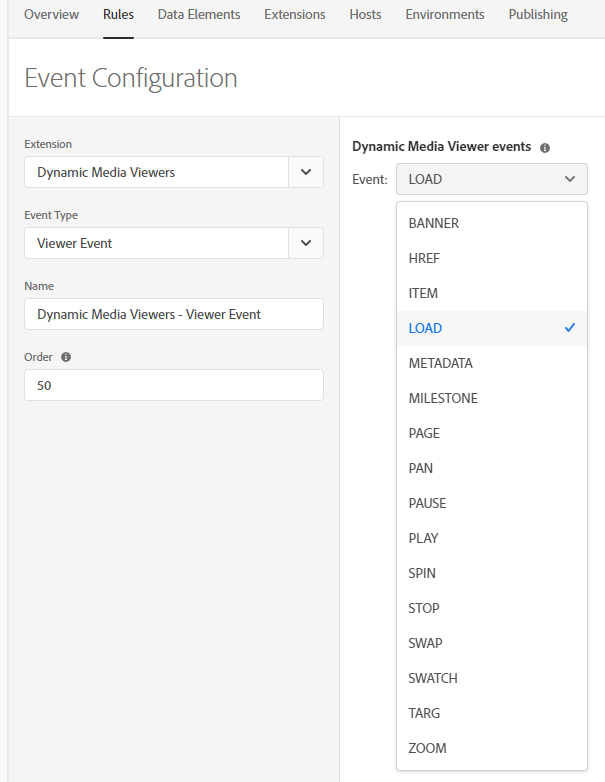

#### 關於動作編輯器 {#about-the-actions-editor}

Dynamic Media檢視器擴充功能可讓您使用Dynamic Media檢視器的事件引數，對應至Adobe Analytics擴充功能的「設定變數」編輯器中的分析變數。

最簡單的方法是完成以下兩個步驟的流程：

* 首先，定義一或多個資料元素，其中每個資料元素代表Dynamic Media檢視器事件的引數。
* 最後，在Adobe Analytics擴充功能的「設定變數」編輯器中，選取&#x200B;**[!UICONTROL 資料元素]**&#x200B;選擇器圖示（三個棧疊的磁碟）以開啟「選取資料元素」對話方塊，然後從其中選取資料元素。

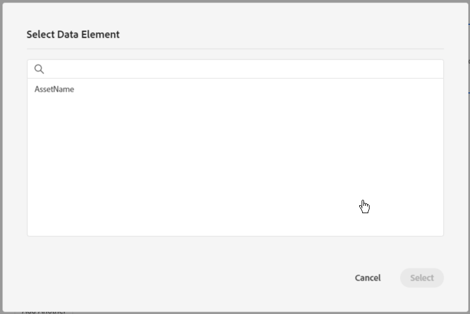

不過，您也可以使用替代方法並略過「資料元素」的建立。 您可以直接參照Dynamic Media檢視器事件的引數。 在Analytics變數指派的&#x200B;**[!UICONTROL 值]**&#x200B;輸入欄位中，輸入事件引數的完整限定名稱。 請務必加上百分比(%)符號。 例如，

`%event.detail.dm.LOAD.asset%`

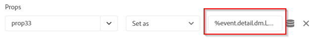

使用資料元素與直接事件引數參考之間有重要的差異。 對於資料元素，哪個事件會觸發「設定變數」動作並不重要。 觸發規則的事件可能與動態檢視器無關。 例如，從核心擴充功能中選取網頁。 但是，使用直接引數參考時，請務必確保觸發規則的事件對應到它參考的事件引數。

例如，如果 `%event.detail.dm.LOAD.asset%` 規則是由動態媒體檢視器擴充功能的 **[!UICONTROL LOAD]** 事件觸發，則參照會傳回正確的資產名稱。 但是，它會傳回任何其他事件的空白值。

下表列出Dynamic Media檢視器事件及其支援的引數：

<table>
 <tbody>
  <tr>
   <td>檢視器事件名稱</td>
   <td>引數參考</td>
  </tr>
  <tr>
   <td><code>COMMON</code></td>
   <td><code>%event.detail.dm.objID%</code></td>
  </tr>
  <tr>
   <td> </td>
   <td><code>%event.detail.dm.compClass%</code></td>
  </tr>
  <tr>
   <td> </td>
   <td><code>%event.detail.dm.instName%</code></td>
  </tr>
  <tr>
   <td> </td>
   <td><code>%event.detail.dm.timeStamp%</code></td>
  </tr>
  <tr>
   <td><code>BANNER</code>  </td>
   <td><code>%event.detail.dm.BANNER.asset%</code></td>
  </tr>
  <tr>
   <td> </td>
   <td><code>%event.detail.dm.BANNER.frame%</code></td>
  </tr>
  <tr>
   <td> </td>
   <td><code>%event.detail.dm.BANNER.label%</code></td>
  </tr>
  <tr>
   <td><code>HREF</code></td>
   <td><code>%event.detail.dm.HREF.rollover%</code></td>
  </tr>
  <tr>
   <td><code>ITEM</code></td>
   <td><code>%event.detail.dm.ITEM.rollover%</code></td>
  </tr>
  <tr>
   <td><code>LOAD</code></td>
   <td><code>%event.detail.dm.LOAD.applicationname%</code></td>
  </tr>
  <tr>
   <td><strong> </strong></td>
   <td><code>%event.detail.dm.LOAD.asset%</code></td>
  </tr>
  <tr>
   <td><strong> </strong></td>
   <td><code>%event.detail.dm.LOAD.company%</code></td>
  </tr>
  <tr>
   <td><strong> </strong></td>
   <td><code>%event.detail.dm.LOAD.sdkversion%</code></td>
  </tr>
  <tr>
   <td><strong> </strong></td>
   <td><code>%event.detail.dm.LOAD.viewertype%</code></td>
  </tr>
  <tr>
   <td><strong> </strong></td>
   <td><code>%event.detail.dm.LOAD.viewerversion%</code></td>
  </tr>
  <tr>
   <td><code>METADATA</code></td>
   <td><code>%event.detail.dm.METADATA.length%</code></td>
  </tr>
  <tr>
   <td> </td>
   <td><code>%event.detail.dm.METADATA.type%</code></td>
  </tr>
  <tr>
   <td><code>MILESTONE</code></td>
   <td><code>%event.detail.dm.MILESTONE.milestone%</code></td>
  </tr>
  <tr>
   <td><code>PAGE</code></td>
   <td><code>%event.detail.dm.PAGE.frame%</code></td>
  </tr>
  <tr>
   <td> </td>
   <td><code>%event.detail.dm.PAGE.label%</code></td>
  </tr>
  <tr>
   <td><code>PAUSE</code></td>
   <td><code>%event.detail.dm.PAUSE.timestamp%</code></td>
  </tr>
  <tr>
   <td><code>PLAY</code></td>
   <td><code>%event.detail.dm.PLAY.timestamp%</code></td>
  </tr>
  <tr>
   <td><code>SPIN</code></td>
   <td><code>%event.detail.dm.SPIN.framenumber%</code></td>
  </tr>
  <tr>
   <td><code>STOP</code></td>
   <td><code>%event.detail.dm.STOP.timestamp%</code></td>
  </tr>
  <tr>
   <td><code>SWAP</code></td>
   <td><code>%event.detail.dm.SWAP.asset%</code></td>
  </tr>
  <tr>
   <td><code>SWATCH</code></td>
   <td><code>%event.detail.dm.SWATCH.frame%</code></td>
  </tr>
  <tr>
   <td> </td>
   <td><code>%event.detail.dm.SWATCH.label%</code></td>
  </tr>
  <tr>
   <td><code>TARG</code></td>
   <td><code>%event.detail.dm.TARG.frame%</code></td>
  </tr>
  <tr>
   <td> </td>
   <td><code>%event.detail.dm.TARG.label%</code></td>
  </tr>
  <tr>
   <td><code>ZOOM</code></td>
   <td><code>%event.detail.dm.ZOOM.scale%</code></td>
  </tr>
 </tbody>
</table>

## 設定所有整合專案 {#configuring-all-the-integration-pieces}

**開始之前**

Adobe建議您詳閱本節之前的所有檔案，以便瞭解完整的整合。

This section explains the configuration steps that are necessary to integrate Dynamic Media viewers with Adobe Analytics and Adobe Analytics for Audio and Video. While use of the Dynamic Media Viewers extension for other purposes in Experience Platform Tags is possible, such scenarios are not covered in this documentation.

You are going to use the following Adobe products to configure your integration:

* Adobe Analytics - used to configure tracking variables and reports.
* Experience Platform Tags - used to define a Property, one or more Rules, and one or more Data Elements to enable viewer tracking.

Also, if this integration solution is used with Experience Manager Sites, the following configuration must also be done:

* [!DNL Adobe Developer Console] - integration is created for Experience Platform Tags.
* Experience Manager author node - IMS configuration and Experience Platform Tags cloud configuration.

As part of the configuration, be sure you have access to a company in Adobe Experience Cloud that has Adobe Analytics and Experience Platform Tags already enabled.

## Configure Adobe Analytics for the integration {#configuring-adobe-analytics-for-the-integration}

After you configure Adobe Analytics, the following is set up for the integration:

* A Report Suite is in place and selected.
* Analytics Variables are available to receive tracking data.
* Reports are available to view collected data from Adobe Analytics.

See also [Analytics Implementation Guide](https://experienceleague.adobe.com/en/docs/analytics/implementation/home).

**To configure Adobe Analytics for the integration:**

1. Start by accessing Adobe Analytics from the Experience Cloud [home page](https://experience.adobe.com/#/home). On the menu bar, select the **[!UICONTROL Solutions]** icon (a three by three table of dots) near the upper-right corner of the page, then selecting **[!UICONTROL Analytics]**.

   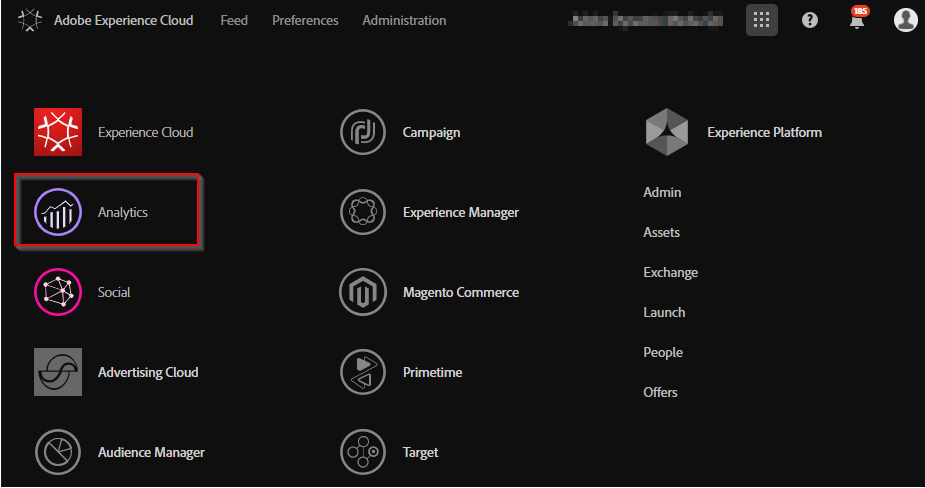

   Now, select a report suite.

### Select a report suite {#selecting-a-report-suite}

1. 在Adobe Analytics頁面的右上角，「搜尋報表」欄位的右側，從下拉式清單中選取正確的報表套裝。**** 如果有多個報表套裝可供使用，而您不確定要使用哪個報表套裝，請連絡您的Adobe Analytics管理員，以協助您選取要使用哪個報表套裝。

   In the screenshot below, a user created a report suite named *DynamicMediaViewersExtensionDoc* and selected it from the drop-down list. The report suite name is an example name only. The name of the report suite you ultimately select is up to you.

   If no report suite is available, you or your Adobe Analytics administrator must create one before you can proceed any further with the configuration.

   See [Reports and Report Suites](https://experienceleague.adobe.com/en/docs/analytics/admin/admin-tools/manage-report-suites/report-suites-admin) and [Create a report suite](https://experienceleague.adobe.com/en/docs/analytics/admin/admin-tools/manage-report-suites/c-new-report-suite/t-create-a-report-suite).

   In Adobe Analytics, report suites are managed under **[!UICONTROL Admin]** > **[!UICONTROL Report Suites]**.

   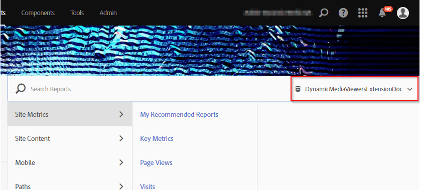

   Now, set up Adobe Analytics variables.

### Set up Adobe Analytics variables {#setting-up-adobe-analytics-variables}

1. Designate one or more Adobe Analytics variables that you want to use to track Dynamic Media Viewers behavior on the web page.

   It is possible to use any type of variable supported by Adobe Analytics. The decision about the variable type (like Custom Traffic [props], Conversion [eVar]) is driven by the specific needs of your Analytics implementation.

   See [Overview of props and eVars](https://experienceleague.adobe.com/en/docs/analytics/implementation/vars/page-vars/evar#vars).

   For the purposes of this documentation, only a Custom Traffic (props) variable is used because they become available in an Analytics Report within a few minutes after an action occurs on a web page.

   To enable a new Custom Traffic variable, in Adobe Analytics, in the toolbar, go to **[!UICONTROL Admin]** > **[!UICONTROL Report Suites]**.

1. On the **[!UICONTROL Report Suite Manager]** page, select the correct report, then in the toolbar, navigate to **[!UICONTROL Edit Settings]** > **[!UICONTROL Traffic]** > **[!UICONTROL Traffic Variables]**.
1. Select a variable that is not used, give it a descriptive name (**[!UICONTROL Viewer asset (prop 30)]**) and change the combo box to &quot;Enabled&quot; in the Enabled column.

   The following screenshot is an example of a Custom Traffic variable ( **[!UICONTROL prop30]**) for tracking an asset name used by the viewer:

   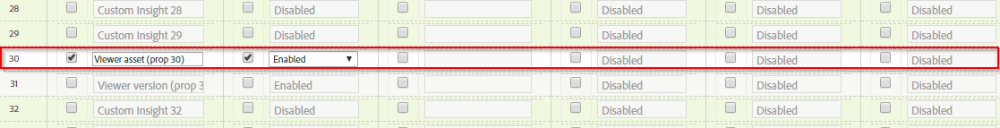

1. At the bottom of the variables list, select **[!UICONTROL Save]**.

### Set up a report {#setting-up-a-report}

1. Generally, setting up a Report in Adobe Analytics is driven by specific project needs. As such, a detailed report setup is beyond the scope for this integration.

   It is, however, enough to know that the Custom Traffic reports become automatically available in Adobe Analytics after you set up Custom Traffic variables in [Setup Adobe Analytics variables](#setting-up-adobe-analytics-variables).

   For example, the report for **[!UICONTROL Viewer asset (prop 30)]** variable is available from the Reports menu under **[!UICONTROL Custom Traffic]** > **[!UICONTROL Custom Traffic 21-30]** > **[!UICONTROL Viewer asset (prop 30)]**.

   在檢視器資產(prop 30)建 **[!UICONTROL 立後立即造訪此報表]** ，不會顯示任何資料；在這個整合階段，就是預期的。

   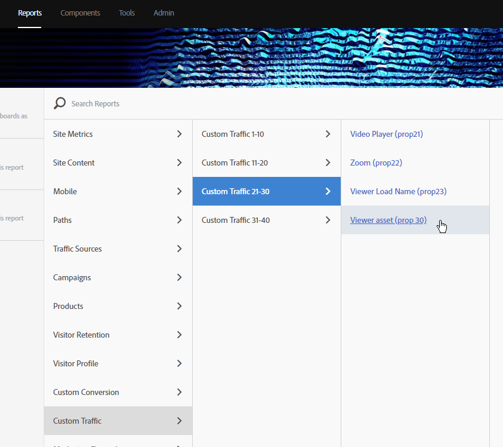

## Configure Experience Platform Tags for the integration {#configuring-adobe-launch-for-the-integration}

After you configure Experience Platform Tags, the following are set up for the integration:

* The creation of a new Property to keep all your configurations together.
* The installation and setup of extensions. The client-side code of all extensions installed in the Property is compiled together into a library. 網頁稍後會使用此資料庫。
* 資料元素和規則的設定。 此設定會定義從Dynamic Media檢視器擷取哪些資料、何時觸發追蹤邏輯，以及在Adobe Analytics中傳送檢視器資料的位置。
* 程式庫的發佈。

**若要設定Experience Platform標籤以進行整合：**

1. 首先，從Experience Cloud [首頁](https://experience.adobe.com/#/home)存取Experience Platform標籤。 在功能表列上，選取頁面右上角附近的&#x200B;**[!UICONTROL 解決方案]**&#x200B;圖示（三乘三點表），然後選取&#x200B;**[!UICONTROL 標籤]**。

   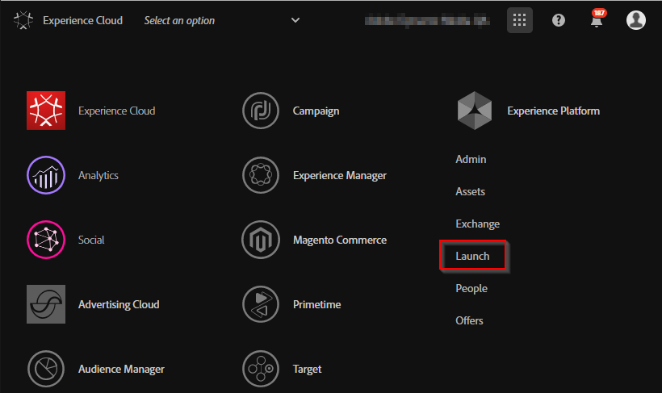

### 在Experience Platform Tags中建立屬性 {#creating-a-property-in-adobe-launch}

Experience Platform Tags中的屬性是具名設定，可讓所有設定保持在一起。 系統會產生一個組態設定程式庫，並發佈至不同的環境層級（開發、測試和生產）。

另請參閱[建立Tags屬性](https://experienceleague.adobe.com/en/docs/platform-learn/implement-mobile-sdk/initial-configuration/configure-tags)。

1. 在Experience Platform標籤中，選取&#x200B;**[!UICONTROL 新增屬性]**。
1. 在「建 **[!UICONTROL 立屬性]** 」對話方塊的「名稱 **** 」欄位中，輸入描述性名稱，例如網站的標題。 例如 `DynamicMediaViewersProp.`
1. 在&#x200B;**[!UICONTROL 網域]**&#x200B;欄位中，輸入您網站的網域。
1. 在&#x200B;**[!UICONTROL 進階選項]**&#x200B;下拉式清單中，啟用&#x200B;**[!UICONTROL 設定擴充功能開發（以後無法修改）]**，以備您要使用的擴充功能（在本例中為&#x200B;*Dynamic Media檢視器*）尚未發行時使用。

   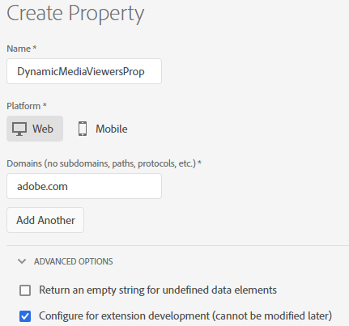

1. 選取「**[!UICONTROL 儲存]**」。

   選取新建立的屬性，然後繼續進行&#x200B;*擴充功能的安裝及設定*。

### 安裝及設定擴充功能 {#installing-and-setup-of-extensions}

Experience Platform標籤中所有可用的擴充功能都會列在&#x200B;**[!UICONTROL 擴充功能]** > **[!UICONTROL 目錄]**&#x200B;下。

若要安裝擴充功能，請選取&#x200B;**[!UICONTROL 安裝]**。 如有需要，請執行一次性擴充功能組態，然後選取&#x200B;**[!UICONTROL 儲存]**。

必要時，必須安裝並設定下列擴充功能：

* （必要） *Experience Cloud ID服務*&#x200B;擴充功能。

無需額外設定，接受任何建議值。 完成時，請務必選取&#x200B;**[!UICONTROL 儲存]**。

請參閱[Adobe Experience Cloud Identity Service擴充功能](https://experienceleague.adobe.com/en/docs/experience-platform/tags/extensions/client/id-service/overview)。

* （必要） *Adobe Analytics*&#x200B;延伸模組

若要設定此擴充功能，您需要Adobe Analytics中&#x200B;**[!UICONTROL 管理員]** > **[!UICONTROL 報表套裝]**&#x200B;下，**[!UICONTROL 報表套裝ID]**&#x200B;欄標題下的報表套裝ID。

(僅供展示之用，**[!UICONTROL DynamicMediaViewersExtensionDoc]**&#x200B;報表套裝的報表套裝ID用於下列熒幕擷取畫面中。 此ID已建立並用於[選取較早的報表套裝](#selecting-a-report-suite)。)

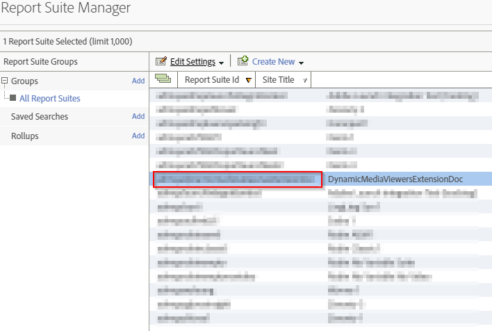

在「安裝擴充功能」頁面的「開發報表套裝」欄位中，輸入「報表套裝ID」。此欄位包括「 **[!UICONTROL 測試報表套裝」欄位和「]** 生產報表套裝 ******** 」欄位。

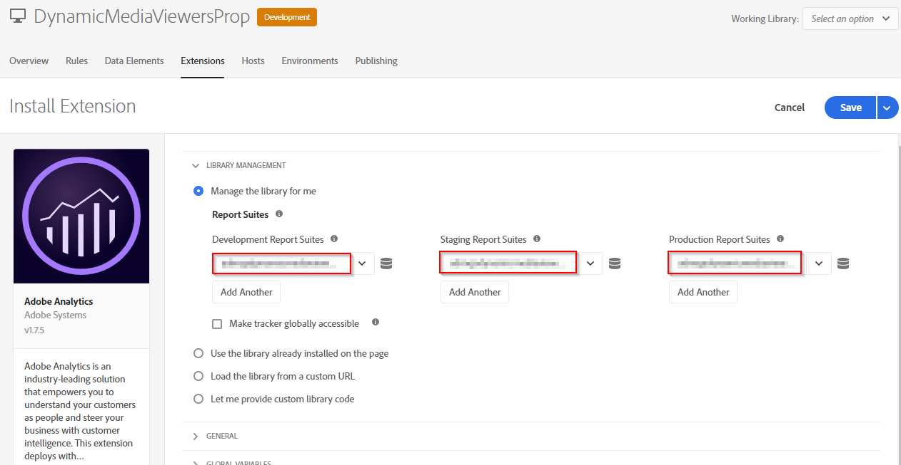

*只有在您打算使用視訊追蹤時，才設定下列專案：*

在&#x200B;**[!UICONTROL 安裝擴充功能]**&#x200B;頁面上，展開&#x200B;**[!UICONTROL 一般]**，然後指定追蹤伺服器。 追蹤伺服器遵循範本`<trackingNamespace>.sc.omtrdc.net`，其中`<trackingNamespace>`是在布建電子郵件中取得的資訊。

選取「**[!UICONTROL 儲存]**」。

請參閱[Adobe Analytics擴充功能](https://experienceleague.adobe.com/en/docs/experience-platform/tags/extensions/client/analytics/overview)。

* （選用；只有在需要視訊追蹤時才需要） *Adobe Media Analytics for Audio and Video*&#x200B;擴充功能

填寫追蹤伺服器欄位。 *Adobe Media Analytics for Audio and Video*&#x200B;擴充功能的追蹤伺服器與Adobe Analytics所使用的追蹤伺服器不同。 它會依循範本`<trackingNamespace>.hb.omtrdc.net`，其中`<trackingNamespace>`是來自布建電子郵件的資訊。

所有其他欄位都是選用的。

請參閱[Adobe Media Analytics for Audio and Video擴充功能](https://experienceleague.adobe.com/en/docs/experience-platform/tags/extensions/client/media-analytics/overview)。

* （必要） *Dynamic Media檢視器*&#x200B;擴充功能

選取 **[!UICONTROL 啟用Adobe Analytics for Video]** ，以啟用 (開啟) 視訊心率追蹤。

截至撰寫之時，*Dynamic Media Viewers*&#x200B;擴充功能僅在建立Experience Platform Tags屬性以進行開發時才能使用。

請參閱[在Experience Platform標籤中建立屬性](#creating-a-property-in-adobe-launch)。

在安裝及設定擴充功能後，「擴充功能>已安裝」區域中至少會列出下列五個擴充功能（如果您未追蹤視訊，則四個）。

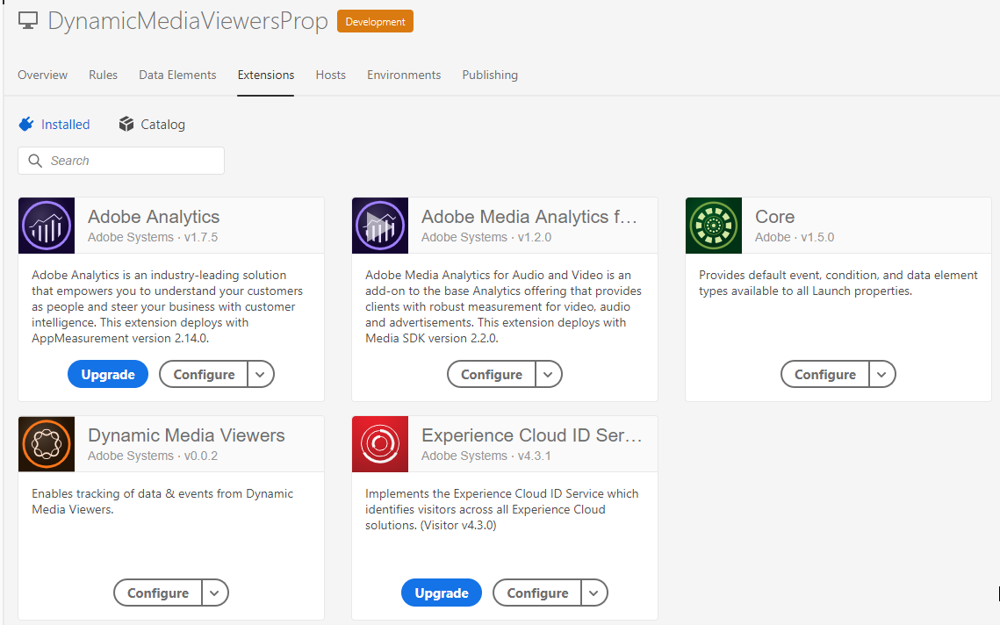

### 設定資料元素和規則 {#setting-up-data-elements-and-rules}

在Experience Platform Tags中，建立追蹤Dynamic Media檢視器所需的資料元素和規則。

如需Experience Platform標籤的追蹤概述，請參閱[整合中的資料和事件追蹤運作方式](#how-data-and-event-tracking-works-in-the-integration)。

請參閱[範例組態](#sample-configuration)，以取得Experience Platform標籤中示範如何在檢視器載入時追蹤資產名稱的範例組態。

如需擴充功能的深入資訊，請參閱[設定Dynamic Media檢視器擴充功能](#configuring-the-dynamic-media-viewers-extension)。

### 發佈程式庫 {#publishing-a-library}

若要變更Experience Platform Tags設定（包括屬性、擴充功能、規則和設定的資料元素），您必須&#x200B;*發佈*&#x200B;這類變更。 Experience Platform標籤中的發佈作業是從「屬性」設定下的「發佈」標籤中執行。

Experience Platform標籤可能具有多個開發環境、一個測試環境及一個生產環境。 根據預設，Experience Manager中的「Experience Platform標籤雲端設定」會將Experience Manager作者節點指向Experience Platform標籤的「預備」環境。 Experience Manager發佈節點指向Experience Platform標籤的生產環境。 這種排列表示在預設Experience Manager設定下，必須將Experience Platform標籤程式庫發佈至測試環境。 如此可讓您在Experience Manager作者中使用它。 然後，您可以將其發佈到生產環境，以便用於Experience Manager發佈。

請參閱[環境](https://experienceleague.adobe.com/en/docs/experience-platform/tags/publish/environments/environments)，以取得Experience Platform標籤環境的詳細資訊。

發佈程式庫需執行下列兩個步驟：

* 將所有必要的變更（新變更和更新）加入程式庫，以新增和建立新程式庫。
* 在不同環境層級（從開發到測試與生產）中向上移動程式庫。

#### 新增及建置新程式庫 {#adding-and-building-a-new-library}

1. 第一次在Experience Platform Tags中開啟Publishing索引標籤時，資料庫清單是空的。

   在左欄中，選取&#x200B;**[!UICONTROL 新增程式庫]**。

   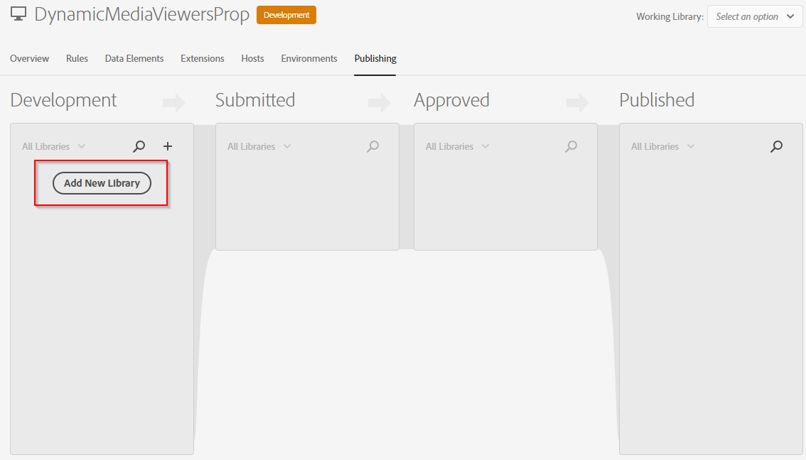

1. 在[建立新程式庫]頁面的&#x200B;**[!UICONTROL 名稱]**&#x200B;欄位中，輸入新程式庫的描述性名稱。 例如，

   *DynamicMediaViewerLib*

   從「環境」下拉式清單中，選擇「環境」層級。 一開始，只有開發層級可供選取。 在頁面的左下角附近，選取&#x200B;**[!UICONTROL 新增所有變更的資源]**。

   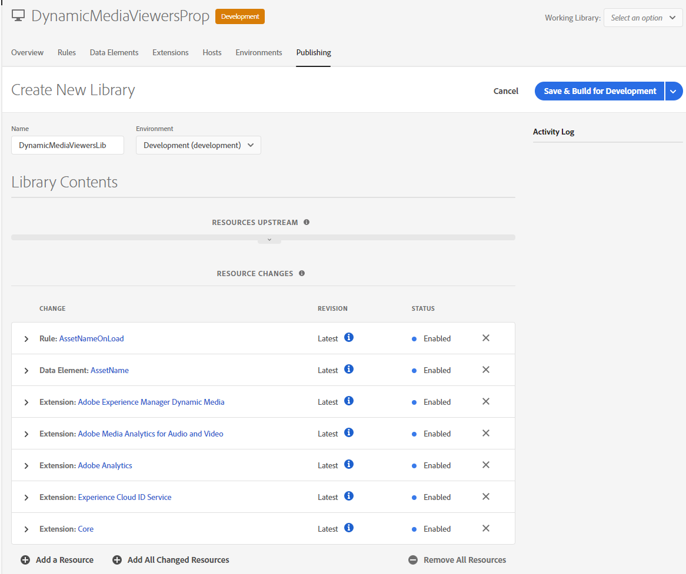

1. 在頁面的右上角附近，選取&#x200B;**[!UICONTROL 儲存並建置以供開發]**。

   幾分鐘後，程式庫就會建立並準備使用。

   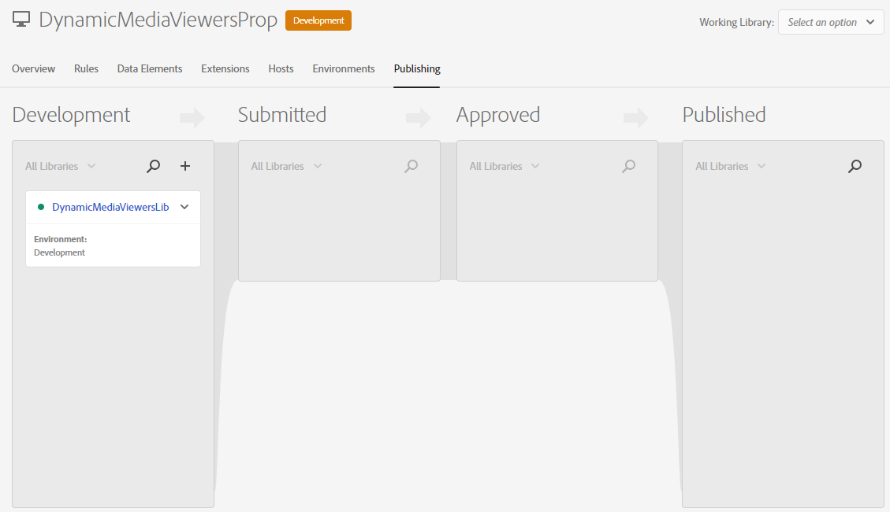

   >[!NOTE]
   >
   >下次變更Experience Platform Tags設定時，請移至&#x200B;**[!UICONTROL 屬性]**&#x200B;設定下的&#x200B;**[!UICONTROL 發佈]**&#x200B;標籤，然後選取您先前建立的資料庫。
   >
   >
   >在程式庫發佈畫面中，選取&#x200B;**[!UICONTROL 新增所有變更的資源]**，然後選取&#x200B;**[!UICONTROL 儲存並建置以供開發]**。

#### 在環境層級中向上移動程式庫 {#moving-a-library-up-through-environment-levels}

1. 新增程式庫後，即可在開發環境中找到該程式庫。 若要將其移至測試環境層級（與「已提交」欄相對應），請從程式庫的下拉式功能表中，選取&#x200B;**[!UICONTROL 提交以供核准]**。

   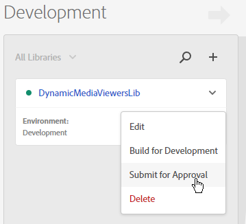

1. 在確認對話方塊中，選取&#x200B;**[!UICONTROL 提交]**。

   程式庫移至「已提交」欄後，從程式庫的下拉式功能表中，選取&#x200B;**[!UICONTROL 為暫存環境建置]**。

   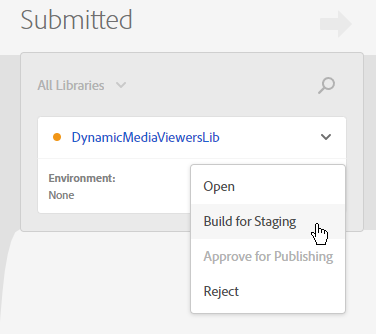

1. 若要將程式庫從測試環境移至生產環境（亦即「已發佈」欄），請遵循類似的程式。

   首先，從下拉式功能表中選取&#x200B;**[!UICONTROL 核准發佈]**。

   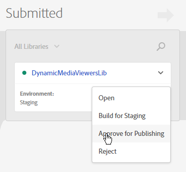

1. 從下拉式功能表中選取&#x200B;**[!UICONTROL 建置並發佈到生產環境]**。

   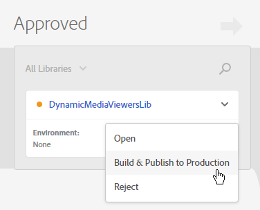

   請參閱[發佈](https://experienceleague.adobe.com/en/docs/experience-platform/tags/publish/overview)，以取得有關Experience Platform標籤中發佈程式的詳細資訊。

## 設定Adobe Experience Manager以進行整合 {#configuring-adobe-experience-manager-for-the-integration}

先決條件：

* Experience Manager會執行作者和發佈例項。
* Experience Manager作者節點設定於Dynamic Media - Scene7執行模式(dynamicmedia_s7)
* Experience Manager Sites已啟用Dynamic Media WCM元件。

Experience Manager設定包含下列兩個主要步驟：

* Experience Manager IMS的設定。
* 設定Experience Platform標籤雲端。

### 設定Experience Manager IMS {#configuring-aem-ims}

1. 在Experience Manager作者中，選取&#x200B;**[!UICONTROL 工具]**&#x200B;圖示（槌子），然後前往&#x200B;**[!UICONTROL 安全性]** > **[!UICONTROL Adobe IMS設定]**。

   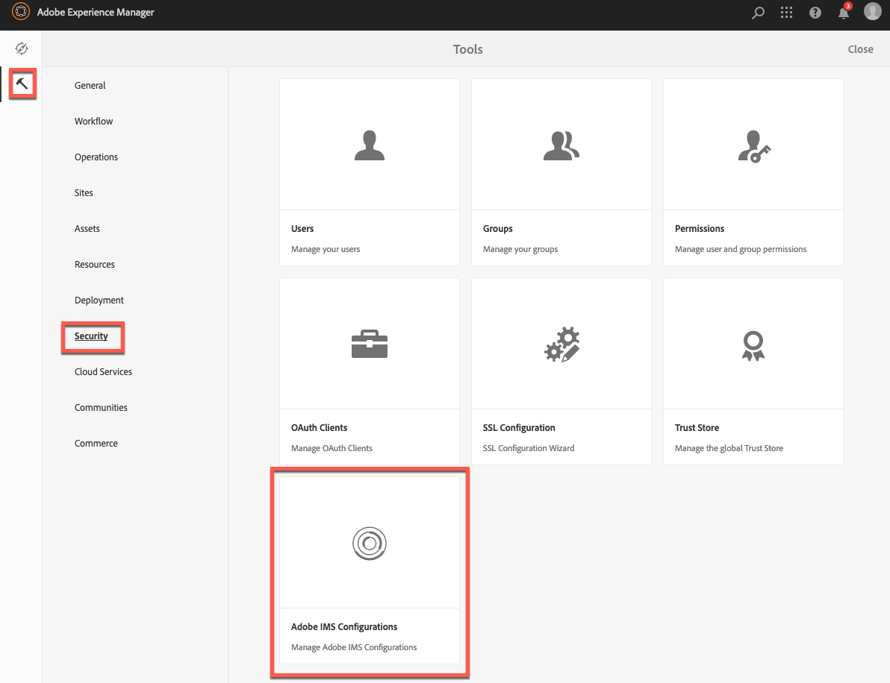

1. 在「Adobe IMC設定」頁面的左上角附近，選取「**[!UICONTROL 建立]**」。
1. 在&#x200B;**[!UICONTROL Adobe IMS技術帳戶設定]**&#x200B;頁面的&#x200B;**[!UICONTROL 雲端解決方案]**&#x200B;下拉式清單中，選取&#x200B;**[!UICONTROL Experience Platform標籤]**。
1. 啟用&#x200B;**[!UICONTROL 建立新憑證]**，然後在文字欄位中，為您的憑證輸入任何有意義的值。 例如，*AdobeLaunchIMSCert*。 選取&#x200B;**[!UICONTROL 建立憑證]**。

   會顯示下列資訊訊息：

   *若要擷取有效的存取Token，新憑證的公開金鑰已新增至Adobe Developer Console上的技術帳戶！*

   若要關閉[資訊]對話方塊，請選取[確定]。****

   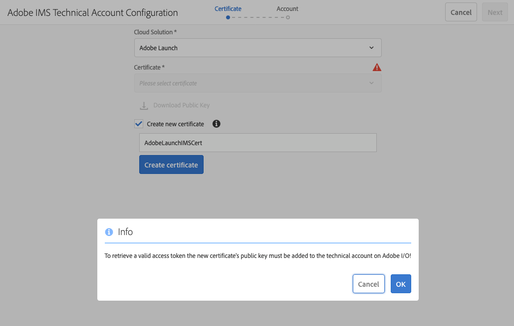

1. 若要將公開金鑰檔(&#42;.crt)下載到您的本機系統，請選取&#x200B;**[!UICONTROL 下載公開金鑰]**。

   >[!NOTE]
   >
   >此時，***保持開啟*** **[!UICONTROL Adobe IMS技術帳戶設定]**&#x200B;頁面；***不***&#x200B;關閉頁面，且&#x200B;***不***&#x200B;選取[下一步]。 您稍後將在步驟中返回此頁面。

   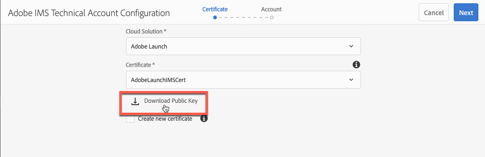

1. 在新的瀏覽器分頁中，導覽至[[!DNL Adobe Developer Console]](https://developer.adobe.com/console/integrations)。

1. 從&#x200B;**[!UICONTROL Adobe Developer Console整合]**&#x200B;頁面，在右上角附近選取&#x200B;**[!UICONTROL 新整合]**。
1. 在&#x200B;**[!UICONTROL 建立新整合]**&#x200B;對話方塊中，確定已選取&#x200B;**[!UICONTROL 存取API]**&#x200B;選項按鈕，然後選取&#x200B;**[!UICONTROL 繼續]**。

   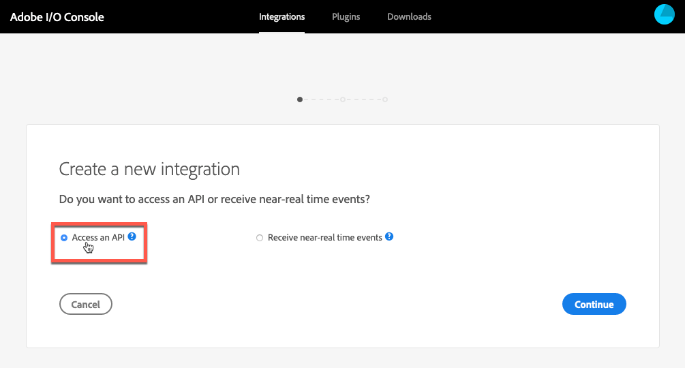

1. 在第二個&#x200B;**[!UICONTROL 建立新整合]**&#x200B;頁面上，啟用（開啟） **[!UICONTROL Experience Platform標籤API]**&#x200B;選項按鈕。 在頁面的右下角，選取&#x200B;**[!UICONTROL 繼續]**。

   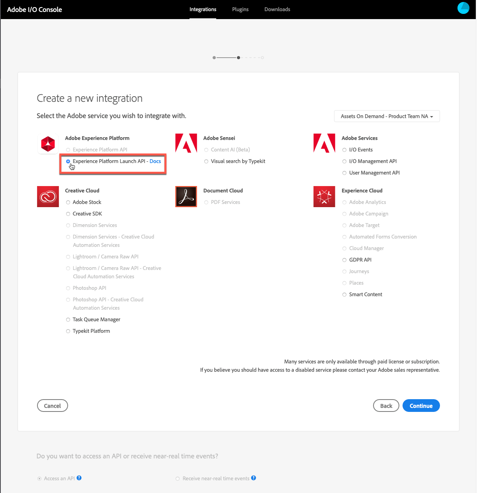

1. 在第三個&#x200B;**[!UICONTROL 建立新整合]**&#x200B;頁面上，執行下列動作：

   * 在&#x200B;**[!UICONTROL 名稱]**&#x200B;欄位中，輸入描述性名稱。 例如，*DynamicMediaViewersIO*。

   * 在&#x200B;**[!UICONTROL 說明]**&#x200B;欄位中，輸入整合的說明。

   * 在&#x200B;**[!UICONTROL 公開金鑰憑證]**&#x200B;區域中，上傳您先前在這些步驟中下載的公開金鑰檔案(&#42;.crt)。

   * 在&#x200B;**[!UICONTROL 選取Experience Platform Tags API]**&#x200B;標題的角色下，選取&#x200B;**[!UICONTROL 管理員]**。

   * 在「**[!UICONTROL 選取Experience Platform標籤API]**&#x200B;的一或多個產品設定檔」標題下，選取名為「**[!UICONTROL 標籤 — &lt;your_company_name>]**」的產品設定檔。

   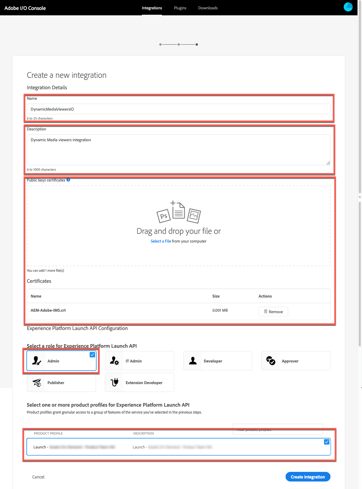

1. 選取&#x200B;**[!UICONTROL 建立整合]**。
1. 在&#x200B;**[!UICONTROL 已建立的整合]**&#x200B;頁面上，選取&#x200B;**[!UICONTROL 繼續前往整合詳細資料]**。

   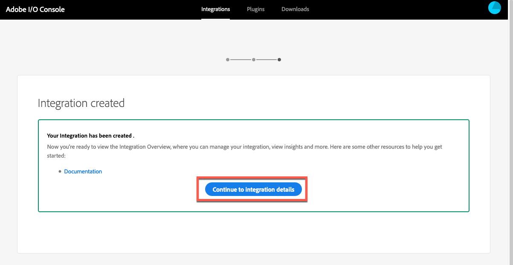

1. 整合詳細資訊頁面隨即顯示，****&#x200B;類似下列內容：

   >[!NOTE]
   >
   >***請離開此「整合詳細資訊」頁面***。 您稍後將需要&#x200B;**[!UICONTROL 概觀]**&#x200B;和&#x200B;**[!UICONTROL JWT]**&#x200B;標籤中的各種資訊。

   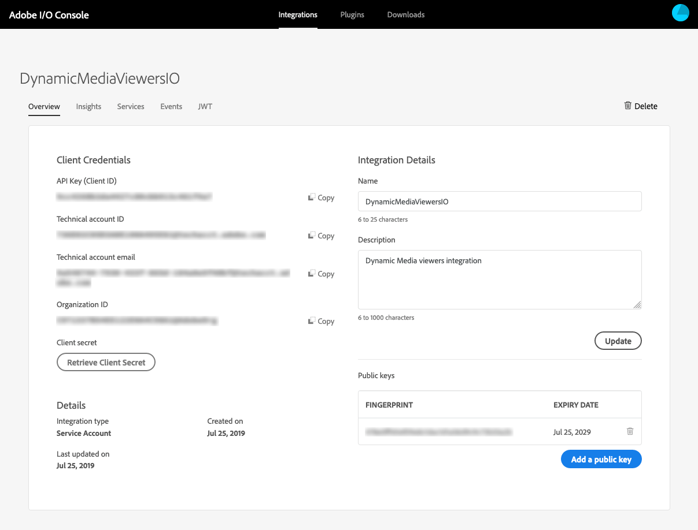

   整合詳細資訊頁面。

1. 返回您先前 **[!UICONTROL 未開啟的「Adobe IMS技術帳戶設定]** 」頁面。 在頁面的右上角，選取「**[!UICONTROL 下一步]**」以在「**[!UICONTROL Adobe IMS技術帳戶設定]**」視窗中開啟「**[!UICONTROL 帳戶]**」頁面。

   (如果您先前關閉頁面，請返回Experience Manager作者，然後導覽至&#x200B;**[!UICONTROL 工具]** > **[!UICONTROL 安全性]** > **[!UICONTROL Adobe IMS設定]**。 選擇 **[!UICONTROL 建立]**。 在&#x200B;**[!UICONTROL 雲端解決方案]**&#x200B;下拉式清單中，選取&#x200B;**[!UICONTROL Experience Platform標籤]**。 在&#x200B;**[!UICONTROL 憑證]**&#x200B;下拉式清單中，選取先前建立的憑證名稱。)

   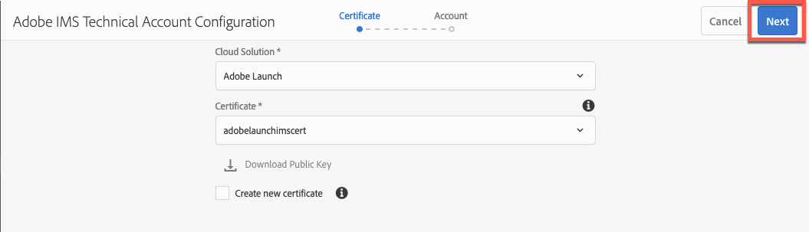

   Adobe IMS技術帳戶設定 — 憑證頁面。

1. **[!UICONTROL 帳戶]**&#x200B;頁面有五個欄位，您必須使用上一步驟整合詳細資料頁面中的資訊來填寫。

   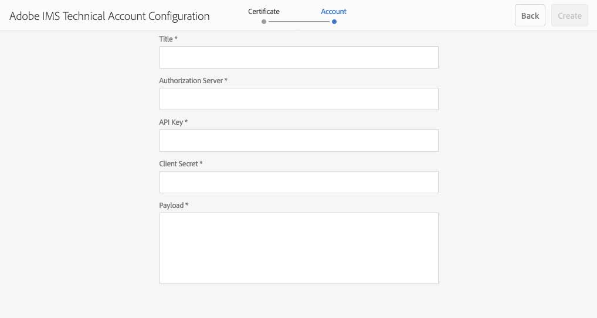

   Adobe IMS技術帳戶設定 — 帳戶頁面。

1. 在&#x200B;**[!UICONTROL 帳戶]**&#x200B;頁面上，填寫下列欄位：

   * **[!UICONTROL 標題]** — 輸入描述性帳戶標題。
   * **[!UICONTROL 授權伺服器]** — 返回您先前開啟的整合詳細資訊頁面。 選取&#x200B;**[!UICONTROL JWT]**&#x200B;索引標籤。 複製伺服器名稱（不含路徑），如下方反白所示。

   返回&#x200B;**[!UICONTROL 帳戶]**頁面，然後將名稱貼到個別欄位。
例如， `https://ims-na1.adobelogin.com/`
（伺服器名稱僅供範例使用）

   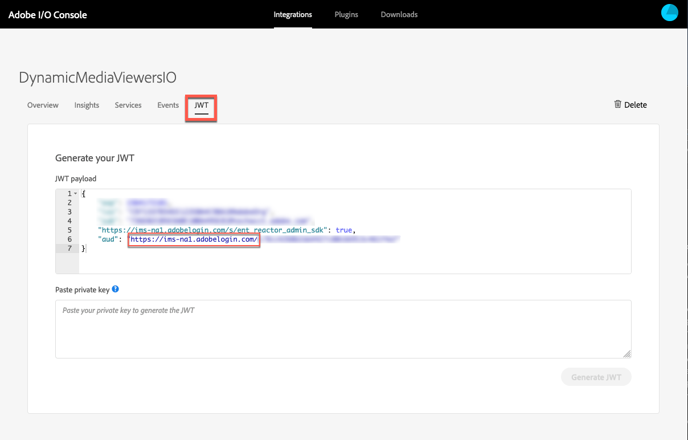

   整合詳細資訊頁面 — JWT索引標籤

1. **[!UICONTROL API金鑰]** -返回「整合詳細資訊」頁面。 選取&#x200B;**[!UICONTROL 概述]**&#x200B;標籤，然後在&#x200B;**[!UICONTROL API金鑰（使用者端識別碼）]**&#x200B;欄位的右側，選取&#x200B;**[!UICONTROL 複製]**。

   返回「帳 **[!UICONTROL 戶]** 」頁面，然後將金鑰貼入個別欄位。

   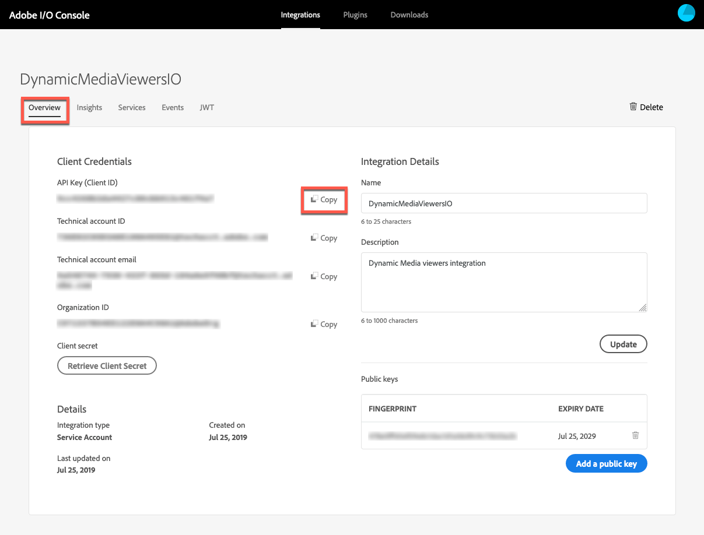

   整合詳細資訊頁面。

1. **[!UICONTROL 使用者端密碼]** — 返回[整合詳細資訊]頁面。 在&#x200B;**[!UICONTROL 總覽]**&#x200B;標籤中，選取&#x200B;**[!UICONTROL 擷取使用者端密碼]**。 在&#x200B;**[!UICONTROL 使用者端密碼]**&#x200B;欄位的右側，選取&#x200B;**[!UICONTROL 複製]**。

   返回「帳 **[!UICONTROL 戶]** 」頁面，然後將金鑰貼入個別欄位。

1. **[!UICONTROL 承載]** — 返回「整合詳細資訊」頁面。 從&#x200B;**[!UICONTROL JWT]**&#x200B;索引標籤的JWT裝載欄位中，複製整個JSON物件程式碼。

   返回「帳 **[!UICONTROL 戶]** 」頁面，然後將程式碼貼至個別欄位。

   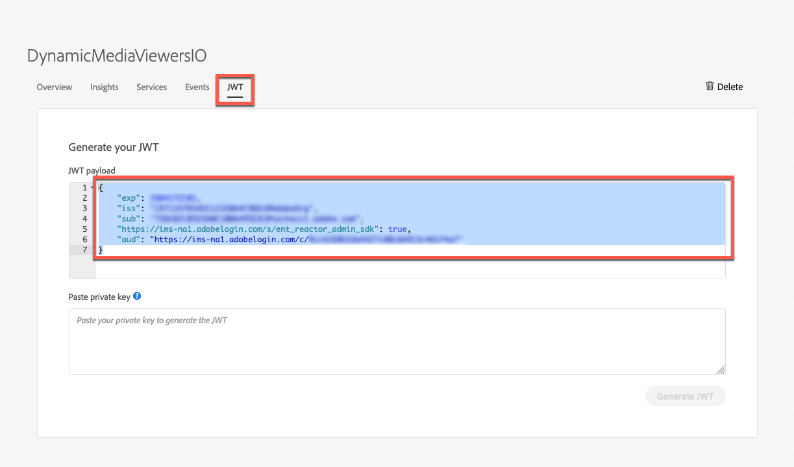

   整合詳細資訊頁面 — JWT索引標籤

   「帳戶」頁面（已填寫所有欄位）看起來類似以下內容：

   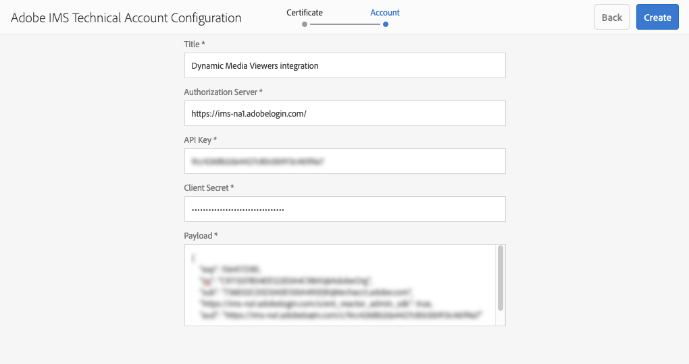

1. 在&#x200B;**[!UICONTROL 帳戶]**&#x200B;頁面的右上角附近，選取&#x200B;**[!UICONTROL 建立]**。

   設定Experience Manager IMS後，您現在會在&#x200B;**[!UICONTROL Adobe IMS設定]**&#x200B;下列出新的IMSAccount。

   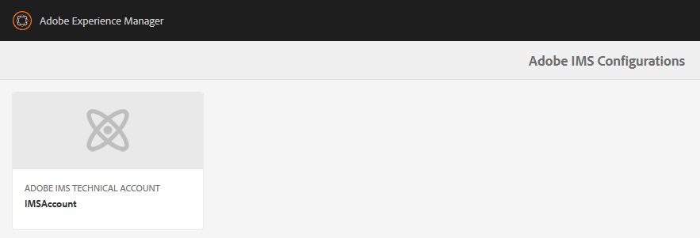

## 設定Experience Platform Tags Cloud以進行整合 {#configuring-adobe-launch-cloud-for-the-integration}

1. 在Experience Manager作者的左上角附近，選取&#x200B;**[!UICONTROL 工具]**&#x200B;圖示（槌子），然後前往&#x200B;**[!UICONTROL 雲端服務]** > **[!UICONTROL Experience Platform標籤設定]**。

   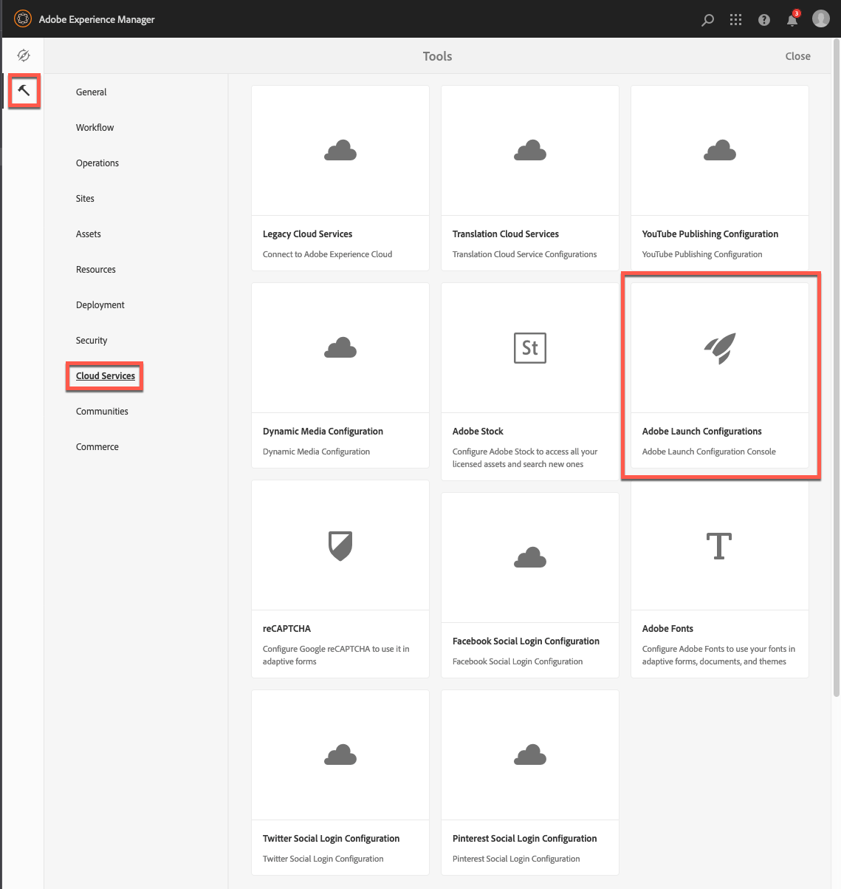

1. 在&#x200B;**[!UICONTROL Experience Platform標籤設定]**&#x200B;頁面的左側面板中，選取您要套用Experience Platform標籤設定的Experience Manager網站。

   僅供範例使用，在下方熒幕擷圖中選擇&#x200B;**`We.Retail`**&#x200B;網站。

   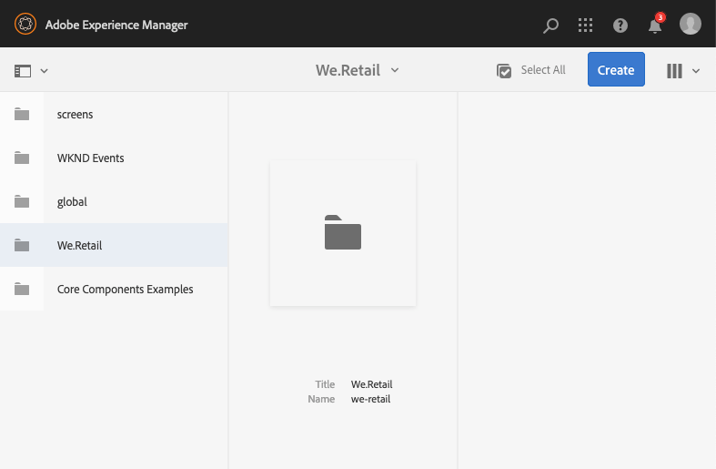

1. 在頁面的左上角附近，選取&#x200B;**[!UICONTROL 建立]**。
1. 在&#x200B;**[!UICONTROL 建立Experience Platform標籤組態]**&#x200B;視窗的&#x200B;**[!UICONTROL 一般]**&#x200B;頁面（1/3頁）上，填寫下列欄位：

   * **[!UICONTROL 標題]** — 輸入描述性設定標題。 例如，`We.Retail Tags cloud configuration`。

   * **[!UICONTROL 關聯的Adobe IMS設定]** — 選取您先前在[設定Experience Manager IMS](#configuring-aem-ims)中建立的IMS設定。

   * **[!UICONTROL 公司]** — 從&#x200B;**[!UICONTROL 公司]**&#x200B;下拉式清單中，選取您的Experience Cloud公司。 清單會自動填入。

   * **[!UICONTROL 屬性]** — 從「屬性」下拉式清單中，選取您先前建立的Experience Platform Tags屬性。 清單會自動填入。

   完成所有欄位後，您的&#x200B;**[!UICONTROL 一般]**&#x200B;頁面將類似於以下內容：

   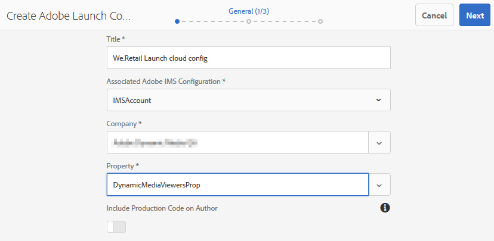

1. 在左上角附近，選取&#x200B;**[!UICONTROL 下一步]**。
1. 在&#x200B;**[!UICONTROL 建立Experience Platform標籤組態]**&#x200B;視窗的&#x200B;**[!UICONTROL 測試]**&#x200B;頁面（2/3頁）上，填寫下列欄位：

   在&#x200B;**[!UICONTROL 資料庫URI]** （統一資源識別碼）欄位中，檢查Experience Platform標籤資料庫測試版本的位置。 Experience Manager會自動填入此欄位。

   此步驟使用部署至Experience Platform CDN的Adobe標籤程式庫，僅供範例使用。

   >[!NOTE]
   >
   >檢查以確定自動填入的資料庫URI （統一資源識別碼）的格式不正確。 如有必要，請修正此錯誤，使URI代表協定相對URI。 也就是說，它會從雙正斜線開始。
   >
   >
   >例如：`//assets.adobetm.com/launch-xxxx`。

   您的&#x200B;**[!UICONTROL 測試]**&#x200B;頁面可能會顯示類似下列內容。 **[!UICONTROL 封存]**&#x200B;和&#x200B;**[!UICONTROL 非同步載入程式庫]**&#x200B;選項是&#x200B;***未***&#x200B;設定：

   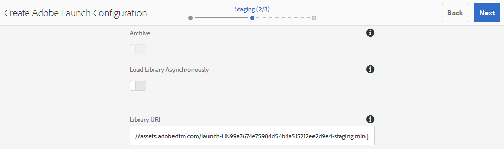

1. 在右上角附近，選取&#x200B;**[!UICONTROL 下一步]**。
1. 在&#x200B;**[!UICONTROL 建立Experience Platform標籤設定]**&#x200B;視窗的&#x200B;**[!UICONTROL 生產]**&#x200B;頁面（3/3頁）上，視需要修正自動填入的生產URI，就像在上一個&#x200B;**[!UICONTROL 測試]**&#x200B;頁面上所做的一樣。
1. 在右上角附近，選取&#x200B;**[!UICONTROL 建立]**。

   您的新Experience Platform標籤雲端設定現已建立，並列於您的網站旁，類似於以下範例：

1. 選取您的新Experience Platform標籤雲端設定（選取時，設定標題左側會出現核取標籤）。 在工具列上，選取&#x200B;**[!UICONTROL 發佈]**。

   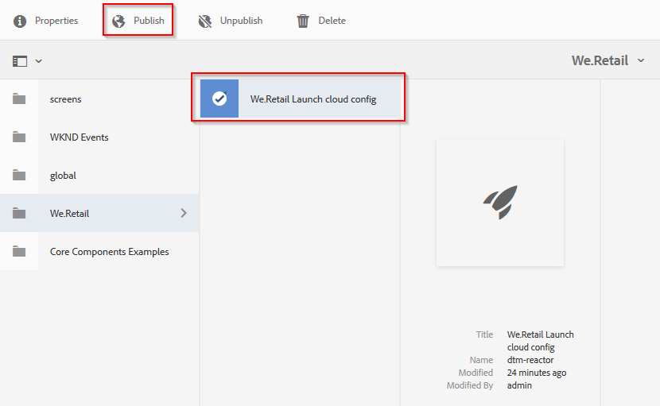

目前，Experience Manager作者不支援將Dynamic Media檢視器與Experience Platform標籤整合。

但是，Experience Manager發佈節點支援此功能。 使用Experience Platform標籤雲端設定的預設設定，Experience Manager發佈節點會使用Experience Platform標籤的生產環境。 因此，每次在測試期間，都必須將Experience Platform標籤程式庫更新從開發推送至生產環境。

您可以繞過此限制。 在上述Experience Manager發佈節點的Experience Platform標籤雲端設定中，指定Platform標籤程式庫的開發或預備URL。 這麼做會讓Experience Manager發佈節點使用Experience Platform標籤程式庫的開發或測試版本。

如需設定Experience Manager標籤雲端設定的詳細資訊，請參閱[透過 [!DNL Adobe Developer Console]將Experience Platform與Experience Platform標籤整合](https://experienceleague.adobe.com/en/docs/experience-manager-learn/sites/integrations/experience-platform-data-collection-tags/overview)。
