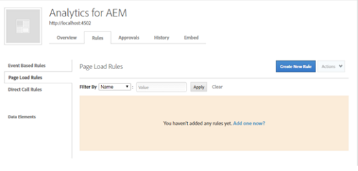
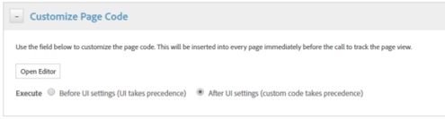

# 透過DTM啟用資產見解 {#enable-asset-insights-through-dtm}

Adobe動態標籤管理是可啟動數位行銷工具的工具。 Adobe Analytics客戶可免費取得。

雖然您可以自訂追蹤代碼，讓協力廠商CMS解決方案能夠使用「資產前瞻分析」，但Adobe建議您使用DTM插入「資產前瞻分析」標籤。

>[!NOTE]
>
>只有影像才支援並提供見解。

執行這些步驟，以透過DTM啟用資產分析。

1. 點選／按一下AEM標誌，並前往「工 **[!UICONTROL 具]** >資 **[!UICONTROL 產]** > **[!UICONTROL 前瞻分析設定]**」。
1. [使用DTM Cloud服務設定AEM例項](/help/sites-administering/dtm.md)

   當您登入https://dtm.adobe.com並從「設定檔」圖示造訪「 [帳戶設定](https://dtm.adobe.com/) 」後， **** API Token就可使用。 從「資產前瞻分析」的角度來看，此步驟不是必要步驟，因為AEM Sites與「資產前瞻分析」的整合仍在進行中。

1. 登入https://dtm.adobe.com [](https://dtm.adobe.com/)，並視需要選取公司。
1. 建立／開啟現有Web屬性

   * 選取「 **[!UICONTROL Web屬性]** 」標籤，然後點選／按一下「 **[!UICONTROL 新增屬性」]**。

   * 視需要更新欄位，然後點選／按一下「 **[!UICONTROL 建立屬性」]**。 請參 [閱檔案](https://helpx.adobe.com/experience-manager/using/dtm.html)。
   

1. 在「規 **[!UICONTROL 則]** 」標籤中，從導覽窗格 **[!UICONTROL 選取「頁面載入規則]** 」，並點選／按一 **[!UICONTROL 下「建立新規則」]**。

   

1. 展開 **[!UICONTROL Javascript /第三方標籤]**。 然後點選／按一 **[!UICONTROL 下「循序HTML]** 」索引標籤中 **** 的「新增指令碼」，以開啟「指令碼」對話方塊。

   

1. 點選／按一下AEM標誌，然後前往「工 **[!UICONTROL 具>資產」]**。
1. 點選／按一 **[!UICONTROL 下前瞻分析頁面追蹤器]**，複製追蹤器程式碼，然後貼到您在步驟6中開啟的指令碼對話方塊中。 儲存變更。

   >[!NOTE]
   >
   > * `AppMeasurement.js` 中。 預計可透過DTM的Adobe Analytics工具取得。
   > * ()的 `assetAnalytics.dispatcher.init`呼叫已移除。 當DTM的Adobe Analytics工具載入完成時，預期會呼叫此函式。
   > * 視資產前瞻分析頁面追蹤器的托管位置（例如AEM、CDN等）而定，指令碼來源的來源可能需要變更。
   > * 對於AEM代管的頁面追蹤器，來源應使用分派程式例項的主機名稱指向發佈例項。


1. 存取 `https://dtm.adobe.com`. 按一 **[!UICONTROL 下Web屬性中的]** 「概述」，然後按一 **[!UICONTROL 下「新增工具]** 」或開啟現有的Adobe Analytics工具。 建立工具時，可將「配置方 **[!UICONTROL 法」(Configuration Method]** )設定 **[!UICONTROL 為「自動」(Automatic)]**。

   

   視需要選取「測試／生產」報表套裝。

1. 展開「 **[!UICONTROL 程式庫管理]**」，並確定「載入程式庫於 **[!UICONTROL 」設為「頁]** 面頂端」 ****。

   

1. 展開「 **[!UICONTROL 自訂頁面代碼]**」，然後按一下或點選「 **[!UICONTROL 開啟編輯器」]**。

   

1. 在視窗中貼上下列程式碼：

   ```Java
   var sObj;
   
   if (arguments.length > 0) {
     sObj = arguments[0];
   } else {
     sObj = _satellite.getToolsByType('sc')[0].getS();
   }
   _satellite.notify('in assetAnalytics customInit');
   (function initializeAssetAnalytics() {
     if ((!!window.assetAnalytics) && (!!assetAnalytics.dispatcher)) {
       _satellite.notify('assetAnalytics ready');
       /** NOTE:
           Copy over the call to 'assetAnalytics.dispatcher.init()' from Assets Pagetracker
           Be mindful about changing the AppMeasurement object as retrieved above.
       */
       assetAnalytics.dispatcher.init(
             "",  /** RSID to send tracking-call to */
             "",  /** Tracking Server to send tracking-call to */
             "",  /** Visitor Namespace to send tracking-call to */
             "",  /** listVar to put comma-separated-list of Asset IDs for Asset Impression Events in tracking-call, e.g. 'listVar1' */
             "",  /** eVar to put Asset ID for Asset Click Events in, e.g. 'eVar3' */
             "",  /** event to include in tracking-calls for Asset Impression Events, e.g. 'event8' */
             "",  /** event to include in tracking-calls for Asset Click Events, e.g. 'event7' */
             sObj  /** [OPTIONAL] if the webpage already has an AppMeasurement object, please include the object here. If unspecified, Pagetracker Core shall create its own AppMeasurement object */
             );
       sObj.usePlugins = true;
       sObj.doPlugins = assetAnalytics.core.updateContextData;
       assetAnalytics.core.optimizedAssetInsights();
     }
     else {
       _satellite.notify('assetAnalytics not available. Consider updating the Custom Page Code', 4);
     }
   })();
   ```

   * DTM中的頁面載入規則僅包含pagetracker.js代碼。 任何 `assetAnalytics` 欄位皆視為預設值的覆寫。 預設不需要這些字元。
   * 在確定 `assetAnalytics.dispatcher.init`()已初始化且 `_satellite.getToolsByType('sc')[0].getS`可用後，程式碼會呼叫 `assetAnalytics,dispatcher.init` ()。 因此，您可以略過在步驟11中加入。
   * 如前瞻分析頁面追蹤器程式碼(「工具>資產>前瞻分析頁面追蹤器&#x200B;**[!UICONTROL 」)中的注釋所示，當頁面追蹤器未建立物件時，前三個引數]**`AppMeasurement` （RSID、追蹤伺服器和訪客命名空間）並不相關。 會改為傳遞空字串以反白標示此值。\
      其餘引數會對應至「前瞻分析設定」頁面(「工具>**[!UICONTROL 資產>前瞻分析設定]**」)中設定的參數。
   * AppMeasurement物件是透過查詢所有可 `satelliteLib` 用的SiteCatalyst引擎來擷取。 如果已設定多個標籤，請適當變更陣列選擇器的索引。 依據DTM介面中可用的SiteCatalyst工具，陣列中的項目排序。

1. 儲存並關閉「程式碼編輯器」視窗，然後儲存「工具」設定中的變更。
1. 在「審 **[!UICONTROL 批]** 」標籤中，審批兩個待審批。 DTM標籤已準備好可插入網頁。 如需如何在網頁中插入DTM標籤的詳細資訊，請參閱「在自訂頁 [面範本中整合DTM」](https://blogs.adobe.com/experiencedelivers/experience-management/integrating-dtm-custom-aem6-page-template/)。
