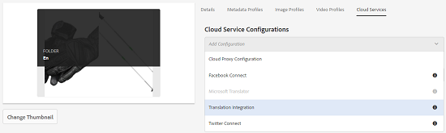

# 將翻譯雲端服務套用至資料夾 {#applying-translation-cloud-services-to-folders}

Adobe Experience Manager(AEM)可讓您從您選擇的翻譯供應商取得雲端翻譯服務，以確保您的資產根據您的需求進行翻譯。

您可以直接將翻譯雲端服務套用至資產資料夾，以便在翻譯工作流程中使用。

## 應用翻譯服務 {#applying-the-translation-services}

將翻譯雲端服務直接套用至您的資產資料夾，不需要在您建立或更新翻譯工作流程時設定翻譯服務。

1. 從「資產」使用者介面中，選取您要套用轉譯服務的檔案夾。
1. 在工具列中，按一下／點選「屬 **[!UICONTROL 性」圖示]** ，以顯示「資 **** 料夾屬性」頁面。

   

1. 導覽至「 **[!UICONTROL 雲端服務]** 」標籤。
1. 從「雲端服務設定」清單中，選擇所要的轉譯提供者。 例如，如果要使用Microsoft的翻譯服務，請選擇 **[!UICONTROL Microsoft Translator]**。

   

1. 選擇翻譯提供器的連接器。

   

1. 在工具列中，按一下／點選「 **[!UICONTROL 儲存]**」，然後按一下「確定 **** 」以關閉對話方塊。轉譯服務會套用至資料夾。

## 套用自訂轉譯連接器 {#applying-custom-translation-connector}

如果要為要用於翻譯工作流的翻譯服務應用自定義連接器。 若要套用自訂連接器，請先從「封裝管理員」安裝連接器。 然後，從雲端服務主控台設定連接器。 在您設定連接器後，「套用轉譯服務」中所述的「雲端服務」標籤中的連接器清 [單中會顯示此連接器](transition-cloud-services.md#applying-the-translation-services)。 在您應用自定義連接器並運行翻譯工作流後，翻譯項目的「 **[!UICONTROL Translation Summary]** 」（翻譯摘要）表徵圖會在heads **[!UICONTROL Provider]** and **[!UICONTROL Method下顯示連接器詳細資訊]**。

1. 從「包管理器」安裝連接器。
1. 按一下／點選AEM標誌，然後導覽至「工 **[!UICONTROL 具>部署>雲端服務」]**。
1. 在「雲端服務」頁面的「 **[!UICONTROL 協力廠商服務]** 」下，找 **[!UICONTROL 出您安裝的連接器]** 。

   

1. 按一下／點選「 **[!UICONTROL 立即設定]** 」連結，以開啟「 **[!UICONTROL 建立設定」對話方塊]** 。

   

1. 指定連接器的標題和名稱，然後按一下／點選「建 **[!UICONTROL 立」]**。 自訂連接器位於「套用轉譯服務」步驟5中所述「 **[!UICONTROL 雲端服務]** 」標籤的連 [接器清單中](#applying-the-translation-services)。
1. 在套用自訂連接器後，執行「 [建立翻譯專案](translation-projects.md) 」中所述的任何翻譯工作流程。 驗證「項目」控制台中翻譯項 **[!UICONTROL 目的「翻譯摘要]** 」表徵圖中連接器的詳 **[!UICONTROL 細資訊]** 。

   
