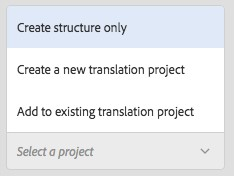
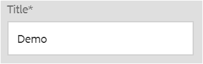
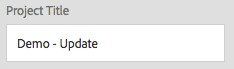
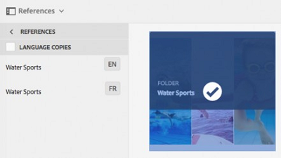
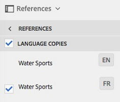
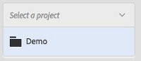

# 建立翻譯專案 {#creating-translation-projects}

若要建立語言副本，請觸發下列任一語言副本工作流程：位於AEM使用者介面的「參考」邊欄下方。

* **建立和翻譯**:在此工作流程中，將要翻譯的資產複製到您要翻譯的語言的語言根目錄。 此外，根據您選擇的選項，系統會在「專案」主控台中為資產建立轉譯專案。 根據設定，翻譯項目可以手動啟動，或者允許在建立翻譯項目後立即自動運行。

* **更新語言副本**:執行此工作流程，以轉譯另一組資產，並將其加入特定地區設定的語言副本中。 在此情況下，已轉換的資產會新增至已包含先前轉換資產的目標資料夾。

>[!NOTE]
>
>只有當翻譯服務提供者支援二進位檔案的翻譯時，才會翻譯資產二進位檔案。

>[!NOTE]
>
>如果您針對複雜資產（例如PDF和InDesign檔案）啟動轉譯工作流程，則不會提交其子資產或轉譯（如果有）以供轉譯。

## 建立和翻譯工作流程 {#create-and-translate-workflow}

您使用建立和翻譯工作流程，第一次針對特定語言產生語言副本。 工作流程提供下列選項：

* 僅建立結構
* 建立新的翻譯專案
* 新增至現有翻譯專案

### 僅建立結構 {#create-structure-only}

使用「 **[!UICONTROL 僅建立結構]** 」選項，在目標語言根目錄中建立目標資料夾層次結構，以匹配源語言根目錄中源資料夾的層次結構。在這種情況下，來源資產會複製到目標資料夾。但是，不會生成任何翻譯項目。

1. 在「資產」UI中，選取您要在目標語言根目錄中建立其結構的來源資料夾。
1. 開啟「參 **[!UICONTROL 考」窗格]** ，然後按一下「復本」下的「語言復本 **[!UICONTROL 」(Language Copies]****[!UICONTROL )]**。

   

1. 按一下／點選 **[!UICONTROL 底部的「建立與翻譯]** 」。

   

1. From the **[!UICONTROL Target Languages]** list, select the language for which you want to create a folder structure.

   

1. 從「專 **[!UICONTROL 案]** 」清單中，選 **[!UICONTROL 擇「僅建立結構」]**。

   

1. 按一下/點選「 **[!UICONTROL 建立]**」。目標語言的新結構列在「語言副本」( **[!UICONTROL Language Copies)下]**。

   

1. 按一下／點選清單中的結構，然後按一下／點選「資產中的 **[!UICONTROL 顯現]** 」，以導覽至目標語言中的資料夾結構。

   

### 建立新的翻譯專案 {#create-a-new-translation-project}

如果您使用此選項，將要翻譯的資產複製到要翻譯的語言的語言根目錄。 根據您選擇的選項，將為「項目」控制台中的資產建立一個翻譯項目。 根據設定，翻譯項目可以手動啟動，或在建立翻譯項目後自動運行。

1. 在「資產」UI中，選取您要建立「語言」復本的來源資料夾。
1. 開啟「參 **[!UICONTROL 考」窗格]** ，然後按一下「復本」下的「語言復本 **[!UICONTROL 」(Language Copies]****[!UICONTROL )]**。

   

1. 按一下／點選 **[!UICONTROL 底部的「建立與翻譯]** 」。

   

1. 從「目 **[!UICONTROL 標語言]** 」清單中，選取您要建立檔案夾結構的語言。

   

1. 從「項 **[!UICONTROL 目]** 」清單中，選 **[!UICONTROL 擇「建立新翻譯項目」]**。

   

1. 在「專 **[!UICONTROL 案標題]** 」欄位中，輸入專案標題。

   

1. 按一下/點選「 **[!UICONTROL 建立]**」。來源資料夾中的資產會複製到您在步驟4中選取的地區設定的目標資料夾。

   

1. 若要導覽至資料夾，請選取語言副本，然後按一下「在資 **[!UICONTROL 產中顯現」]**。

   

1. 導覽至「專案」主控台。 翻譯資料夾將複製到「項目」控制台。

   

1. 開啟資料夾以查看翻譯項目。

   

1. 按一下／點選專案以開啟詳細資訊頁面。

   

1. 要查看翻譯作業的狀態，請按一下「翻譯作業」表徵圖底部的 **[!UICONTROL 省略號]** 。

   

   有關作業狀態的詳細資訊，請 [參閱監視翻譯作業的狀態](/help/sites-administering/tc-manage.md#monitoring-the-status-of-a-translation-job)。

1. 導覽至「資產」UI，並開啟每個已翻譯資產的「屬性」頁面，以檢視已翻譯的中繼資料。

   

   *圖：資產屬性頁面中的翻譯中繼資料*

   >[!NOTE]
   >
   >此功能適用於資產和檔案夾。 當選取資產而非檔案夾時，會複製到語言根目錄的整個檔案夾階層，以建立資產的語言副本。

### 新增至現有翻譯專案 {#add-to-existing-translation-project}

如果您使用此選項，則翻譯工作流程會針對您在執行先前的翻譯工作流程後新增至來源檔案夾的資產執行。 只有新增的資產會複製至包含先前轉換資產的目標資料夾。 在本例中，不會建立新的翻譯項目。

1. 在「資產」使用者介面中，導覽至包含未轉譯資產的來源檔案夾。
1. 選取您要轉換的資產，並開啟「參考」 **[!UICONTROL 窗格]**。「語 **[!UICONTROL 言副本]** 」部分顯示當前可用的翻譯副本數。
1. 按一下/點選「 **[!UICONTROL 復本」下的]** 「語言 **[!UICONTROL 復本」]**。將顯示可用翻譯副本的清單。
1. 按一下／點選 **[!UICONTROL 底部的「建立與翻譯]** 」。

   

1. 從「目 **[!UICONTROL 標語言]** 」清單中，選取您要建立檔案夾結構的語言。

   

1. 從「項 **[!UICONTROL 目]** 」清單中，選擇「 **[!UICONTROL 添加到現有翻譯項目」]** ，以在資料夾中運行翻譯工作流。

   

   >[!NOTE]
   >
   >如果您選擇「 **[!UICONTROL Add to existing translation project]** （添加到現有翻譯項目）」選項，則只有在項目設定與現有項目設定完全匹配時，才會將翻譯項目添加到現有項目。 否則，將建立新項目。

1. 從「現 **[!UICONTROL 有翻譯項目]** 」清單中，選擇要添加要翻譯的資產的項目。

   

1. 按一下/點選「 **[!UICONTROL 建立]**」。要翻譯的資產會新增至目標資料夾。更新的資料夾會列在「語言復 **[!UICONTROL 本」區段下]** 。

   

1. 導覽至「專案」主控台，並開啟您新增至的現有翻譯專案。
1. 按一下／點選翻譯專案檢視專案詳細資訊頁面。

   

1. 按一下／點選「轉譯工作」圖格底 **部的省略號** ，以檢視轉譯工作流程中的資產。 翻譯工作清單還顯示資產元資料和標籤的條目。 這些項目表示資產的中繼資料和標籤也會翻譯。

   >[!NOTE]
   >
   >如果您刪除標籤或中繼資料的項目，則不會翻譯任何資產的標籤或中繼資料。

   >[!NOTE]
   >
   >如果您使用「機器轉譯」，資產二進位檔案將不會轉譯。

   >[!NOTE]
   >
   >如果您添加到翻譯作業的資產包含子資產，請選擇子資產並刪除這些子資產，以便翻譯繼續，而不會出現任何故障。

1. 要啟動資產的翻譯，請按一下／點選「 **[!UICONTROL Translation Job]** （翻譯作業）」表徵圖上的箭頭，然後從列 **[!UICONTROL 表中選擇「Start]** （開始）」。

   

   一條消息通知翻譯作業的開始。

   

1. 要查看翻譯作業的狀態，請按一下／點選「翻譯作業」表徵圖底部的 **[!UICONTROL 省略號]** 。

   

   有關詳細資訊，請 [參閱監視翻譯作業的狀態](/help/sites-administering/tc-manage.md#monitoring-the-status-of-a-translation-job)。

1. 翻譯完成後，狀態將更改為「Ready to Review（準備審核）」。 導覽至「資產」UI，並開啟每個已翻譯資產的「屬性」頁面，以檢視已翻譯的中繼資料。

## 更新語言副本 {#update-language-copies}

執行此工作流程，以轉譯任何其他資產集，並將其納入特定地區設定的語言副本中。 在此情況下，已轉換的資產會新增至已包含先前轉換資產的目標資料夾。 根據選項的選擇，將建立翻譯項目或更新新資產的現有翻譯項目。 「更新語言副本」工作流程包含下列選項：

* 建立新的翻譯專案
* 新增至現有翻譯專案

### 建立新的翻譯專案 {#create-a-new-translation-project-1}

如果您使用此選項，系統會針對您要更新語言副本的一組資產建立翻譯專案。

1. 從「資產」使用者介面中，選取您新增資產的來源資料夾。
1. 開啟「參 **[!UICONTROL 考]** 」窗格，然後按一下/點選「復本」下的「語言復本 ******** 」，以顯示語言復本清單。
1. 選中「語言副本」 **[!UICONTROL 之前的複選框]**，然後選擇與相應地區對應的目標資料夾。

   

1. 按一下／點選 **[!UICONTROL 底部的「更新語言]** 」復本。

   

1. 從「項 **[!UICONTROL 目]** 」清單中，選 **[!UICONTROL 擇「建立新翻譯項目」]**。

   

1. 在「專 **[!UICONTROL 案標題]** 」欄位中，輸入專案標題。

   

1. 按一下/點選「 **[!UICONTROL 開始]**」。
1. 導覽至「專案」主控台。 翻譯資料夾將複製到「項目」控制台。

   

1. 開啟資料夾以查看翻譯項目。

   

1. 按一下／點選專案以開啟詳細資訊頁面。

   

1. 要啟動資產的翻譯，請按一下「翻譯作業」表徵圖上的箭 **[!UICONTROL 頭]** ，然後從列 **[!UICONTROL 表中選擇「開始]** 」。

   

   一條消息通知翻譯作業的開始。

   

1. 要查看翻譯作業的狀態，請按一下／點選「翻譯作業」表徵圖底部的 **[!UICONTROL 省略號]** 。

   

   有關作業狀態的詳細資訊，請 [參閱監視翻譯作業的狀態](../sites-administering/tc-manage.md#monitoring-the-status-of-a-translation-job)。

1. 導覽至「資產」UI，並開啟每個已翻譯資產的「屬性」頁面，以檢視已翻譯的中繼資料。

### 新增至現有翻譯專案 {#add-to-existing-translation-project-1}

如果您使用此選項，資產集會新增至現有的翻譯專案，以更新您所選地區的語言副本。

1. 從「資產」使用者介面中，選取您新增資產檔案夾的來源檔案夾。
1. 開啟「參 **[!UICONTROL 考」窗格]**，然後按一下/點選「復本」下的「語言復本 ******** 」，以顯示語言復本清單。

   

1. 在「語言副本」之前選 **[!UICONTROL 取核取方塊]**，以選取所有語言副本。取消選擇與要翻譯的語言環境相對應的語言副本 (副本) 以外的其他副本。

   

1. 按一下／點選 **[!UICONTROL 底部的「更新語言]** 」復本。

   

1. 從「項 **[!UICONTROL 目]** 」清單中選擇「 **[!UICONTROL 添加到現有翻譯項目」]**。

   

1. 從「現 **[!UICONTROL 有翻譯項目]** 」清單中，選擇要添加要翻譯的資產的項目。

   

1. 按一下/點選「 **[!UICONTROL 開始]**」。
1. 請參閱「添加到現有翻譯 [項目」的步驟](translation-projects.md#add-to-existing-translation-project) 9-14以完成其餘的步驟。

## 建立臨時語言副本 {#creating-temporary-language-copies}

當您執行翻譯工作流程以更新具有原始資產編輯版本的語言副本時，會保留現有的語言副本，直到您核准翻譯的資產為止。 AEM Assets會將新翻譯的資產儲存在臨時位置，並在您明確核准資產後更新現有的語言副本。 如果您拒絕資產，語言副本將保持不變。

1. 按一下/點選「語言副本」下方的「來源根」檔案夾( **[!UICONTROL Language Copies]** )，然後按一下/點選「 **[!UICONTROL Reveal in Assets]** 」 (在資產中顯現) 以開啟「AEM Assets」(AEM Assets)中的檔案夾。

   

1. 從「資產」使用者介面中，選取已翻譯的資產，然後從工具列按一下／點選「編 **[!UICONTROL 輯]** 」圖示，以在編輯模式中開啟資產。
1. 編輯資產，然後儲存變更。
1. 執行「Add to existing translation project(添加到現有翻譯 [項目)」過程的步驟](#add-to-existing-translation-project) 2-14以更新語言副本。
1. 按一下／點選「翻譯作業」表徵圖底部的 **[!UICONTROL 省略號]** 。 從「翻譯作業」頁中的 **[!UICONTROL 資產清單]** ，您可以清楚地查看儲存資產翻譯版本的臨時位置。

   

1. 選取「標題」( **[!UICONTROL Title)旁的核取方塊]**。
1. 在工具列中，按一下/點選「 **[!UICONTROL Accept Translation]** 」 (接受翻譯)，然後在對話方塊中按一下/點選「 **[!UICONTROL Accept]** 」 (接受)，以使用已編輯資產的翻譯版本覆寫目標資料夾中的翻譯資產。

   

   >[!NOTE]
   >
   >若要啟用翻譯工作流程來更新目標資產，請同時接受資產和中繼資料。

   按一下／點 **[!UICONTROL 選「拒絕翻譯]** 」，在目標地區根目錄中保留資產的原始翻譯版本，並拒絕編輯的版本。

   

1. 導覽至「資產」主控台，並開啟每個已轉換資產的「屬性」頁面，以檢視已轉換的中繼資料。

如需如何有效率地轉譯資產中繼資料的秘訣，請參 [閱有效轉譯中繼資料的5個步驟](https://blogs.adobe.com/experiencedelivers/experience-management/translate_aemassets_metadata/)。
