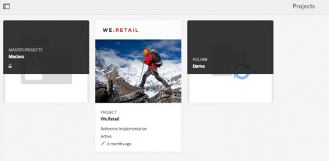
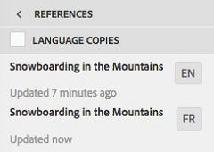

# 建立翻譯專案 {#creating-translation-projects}

若要建立語言副本，請觸發[!DNL Experience Manager]使用者介面中「參考」邊欄下可用的下列語言副本工作流程之一。

* **建立並翻譯**：在此工作流程中，要翻譯的資產會複製到您要翻譯之語言的語言根目錄。 此外，系統會根據您選擇的選項，在「專案」主控台中為資產建立翻譯專案。 根據設定，翻譯專案可以手動啟動，或允許在建立翻譯專案後立即自動執行。

* **更新語言副本**：執行此工作流程以翻譯其他資產群組，並將其納入特定地區設定的語言副本。 在這種情況下，已翻譯的資產會新增至已包含先前已翻譯資產的目標資料夾。

>[!PREREQUISITES]
>
>* 建立翻譯專案的使用者為群組`projects-administrators`的成員。
>* 翻譯服務提供者支援二進位檔的翻譯。

## 建立及翻譯工作流程 {#create-and-translate-workflow}

您可以使用建立和翻譯工作流程，首次產生特定語言的語言副本。 工作流程提供下列選項：

* 僅建立結構。
* 建立翻譯專案。
* 新增至現有翻譯專案。

### 僅建立結構 {#create-structure-only}

使用「 **[!UICONTROL 僅建立結構]** 」選項，在目標語言根目錄中建立目標資料夾層次結構，以匹配源語言根目錄中源資料夾的層次結構。在這種情況下，來源資產會複製到目標資料夾。但是，不會生成任何翻譯項目。

1. 在[!DNL Assets]介面中，選取您要在目標語言根目錄中建立結構的來源資料夾。

1. 開啟&#x200B;**[!UICONTROL 參考]**&#x200B;窗格，然後按一下&#x200B;**[!UICONTROL 復本]**&#x200B;下的&#x200B;**[!UICONTROL 語言復本]**。

   

1. 按一下&#x200B;**[!UICONTROL 建立並翻譯]**。 從&#x200B;**[!UICONTROL 目標語言]**&#x200B;清單中，選取您要建立資料夾結構的語言。

1. 從「專 **[!UICONTROL 案]** 」清單中，選 **[!UICONTROL 擇「僅建立結構」]**。

1. 按一下「**[!UICONTROL 建立]**」。目標語言的新結構列在&#x200B;**[!UICONTROL 語言副本]**&#x200B;下。

   

1. 按一下清單中的結構，然後按一下「在Assets中顯示&#x200B;**[!UICONTROL 」]**，以瀏覽至目標語言中的資料夾結構。

   

### 建立翻譯專案 {#create-a-new-translation-project}

如果您使用此選項，要翻譯的資產會複製到您要翻譯的語言的語言根目錄。 系統會根據您選擇的選項，在「專案」主控台中為資產建立翻譯專案。 根據設定，翻譯專案可以手動啟動，或是在建立翻譯專案後立即自動執行。

1. 在[!DNL Assets]使用者介面中，選取您要建立語言副本的來源資料夾。
1. 開啟&#x200B;**[!UICONTROL 參考]**&#x200B;窗格，然後按一下&#x200B;**[!UICONTROL 復本]**&#x200B;下的&#x200B;**[!UICONTROL 語言復本]**。

   

1. 按一下底部的&#x200B;**[!UICONTROL 建立並翻譯]**。

1. 從&#x200B;**[!UICONTROL 目標語言]**&#x200B;清單中，選取您要建立資料夾結構的語言。

1. 從&#x200B;**[!UICONTROL 專案]**&#x200B;清單中，選取&#x200B;**[!UICONTROL 建立新的翻譯專案]**。

1. 在「專 **[!UICONTROL 案標題]** 」欄位中，輸入專案標題。

1. 按一下「**[!UICONTROL 建立]**」。來源資料夾中的[!DNL Assets]會複製到您在步驟4中所選地區設定的目標資料夾。

   

1. 若要導覽至資料夾，請選取語言副本，然後按一下[在Assets中顯示] ****。

   

1. 導覽至「專案」主控台。 翻譯資料夾會複製到專案主控台。

   

1. 開啟資料夾以檢視翻譯專案。

   

1. 按一下專案以開啟詳細資訊頁面。

   

1. 若要檢視翻譯工作的狀態，請按一下&#x200B;**[!UICONTROL 翻譯工作]**&#x200B;圖磚底部的省略符號。

   

   如需有關工作狀態的詳細資訊，請參閱[監控翻譯工作的狀態](/help/sites-administering/tc-manage.md#monitoring-the-status-of-a-translation-job)。

1. 導覽至[!DNL Assets]使用者介面，並開啟每個已翻譯資產的[!UICONTROL 屬性]頁面，以檢視已翻譯的中繼資料。

   中檢視翻譯的中繼資料

   *圖：在資產屬性頁面中轉譯的中繼資料。*

   >[!NOTE]
   >
   >資產和資料夾皆可使用此功能。 選取資產而非資料夾時，會複製語言根以前資料夾的整個階層，以建立資產的語言副本。

### 新增至現有翻譯專案 {#add-to-existing-translation-project}

如果使用此選項，則翻譯工作流程會針對您在執行先前的翻譯工作流程後新增至來源資料夾的資產執行。 只有新新增的資產會複製到包含先前翻譯的資產的目標資料夾。 在此情況下不會建立新的翻譯專案。

1. 在[!DNL Assets] UI中，導覽至包含未翻譯資產的來源資料夾。
1. 選取您要轉換的資產，並開啟「參考」 **[!UICONTROL 窗格]**。「語 **[!UICONTROL 言副本]** 」部分顯示當前可用的翻譯副本數。
1. 按一下&#x200B;**[!UICONTROL 復本]**&#x200B;下的&#x200B;**[!UICONTROL 語言復本]**。 將顯示可用翻譯副本的清單。
1. 按一下底部的&#x200B;**[!UICONTROL 建立並翻譯]**。

1. 從&#x200B;**[!UICONTROL 目標語言]**&#x200B;清單中，選取您要建立資料夾結構的語言。

1. 從「項 **[!UICONTROL 目]** 」清單中，選擇「 **[!UICONTROL 添加到現有翻譯項目」]** ，以在資料夾中運行翻譯工作流。

   >[!NOTE]
   >
   >如果您選擇&#x200B;**[!UICONTROL 新增至現有翻譯專案]**&#x200B;選項，則只有在您的專案設定完全符合現有專案的設定時，才會將您的翻譯專案新增至現有專案。 否則，將會建立新專案。

1. 從&#x200B;**[!UICONTROL 現有翻譯專案]**&#x200B;清單中，選取要新增要翻譯的資產的專案。

1. 按一下「**[!UICONTROL 建立]**」。要翻譯的資產會新增至目標資料夾。更新的資料夾會列在「語言復 **[!UICONTROL 本」區段下]** 。

   

1. 導覽至「專案」主控台，並開啟您新增的現有翻譯專案。
1. 按一下翻譯專案，即可檢視專案詳細資訊頁面。

   

1. 按一下&#x200B;**翻譯工作**&#x200B;圖磚底部的省略符號，以檢視翻譯工作流程中的資產。 翻譯工作清單也會顯示資產中繼資料和標記項目。這些項目表示資產中繼資料和標記也已翻譯。

   >[!NOTE]
   >
   >如果您刪除標籤或中繼資料的專案，則不會為任何資產翻譯標籤或中繼資料。

   >[!NOTE]
   >
   >如果您新增至翻譯工作的資產包含子資產，請選取子資產並加以移除，翻譯才能順利進行，而不會出現任何問題。

1. 若要開始資產的翻譯，請按一下&#x200B;**[!UICONTROL 翻譯工作]**&#x200B;方塊上的箭頭，然後從清單中選取&#x200B;**[!UICONTROL 開始]**。

   

   訊息會通知開始翻譯工作。

1. 若要檢視翻譯工作的狀態，請按一下&#x200B;**[!UICONTROL 翻譯工作]**&#x200B;圖磚底部的省略符號。

   

   如需詳細資訊，請參閱[監控翻譯工作的狀態](/help/sites-administering/tc-manage.md#monitoring-the-status-of-a-translation-job)。

1. 翻譯完成後，狀態會變更為「準備好檢閱」。 導覽至[!DNL Assets]使用者介面，並開啟每個已翻譯資產的「屬性」頁面，以檢視已翻譯的中繼資料。

## 更新語言副本 {#update-language-copies}

執行此工作流程以翻譯任何其他資產集，並將其納入特定地區設定的語言副本中。 在這種情況下，已翻譯的資產會新增至已包含先前已翻譯資產的目標資料夾。 根據選項選擇，會建立翻譯專案或更新新資產的現有翻譯專案。 更新語言副本工作流程包含以下選項：

* 建立翻譯專案
* 新增至現有翻譯專案

### 建立翻譯專案 {#create-a-new-translation-project-1}

如果您使用此選項，將會為您要更新語言副本的資產集建立翻譯專案。

1. 從[!DNL Assets] UI中，選取您新增資產的來源資料夾。
1. 開啟&#x200B;**[!UICONTROL 參考]**&#x200B;窗格，然後按一下&#x200B;**[!UICONTROL 復本]**&#x200B;下的&#x200B;**[!UICONTROL 語言復本]**，以顯示語言復本清單。
1. 選中「語言副本」 **[!UICONTROL 之前的複選框]**，然後選擇與相應地區對應的目標資料夾。

   

1. 按一下底部的&#x200B;**[!UICONTROL 更新語言副本]**。

1. 從&#x200B;**[!UICONTROL 專案]**&#x200B;清單中選擇&#x200B;**[!UICONTROL 建立新的翻譯專案]**。

1. 在「專 **[!UICONTROL 案標題]** 」欄位中，輸入專案標題。

1. 按一下&#x200B;**[!UICONTROL 開始]**。
1. 導覽至「專案」主控台。 翻譯資料夾會複製到專案主控台。

   

1. 開啟資料夾以檢視翻譯專案。

   

1. 按一下專案以開啟詳細資訊頁面。

   

1. 若要開始資產的翻譯，請按一下&#x200B;**[!UICONTROL 翻譯工作]**&#x200B;方塊上的箭頭，然後從清單中選取&#x200B;**[!UICONTROL 開始]**。

   

   訊息會通知開始翻譯工作。

1. 若要檢視翻譯工作的狀態，請按一下&#x200B;**[!UICONTROL 翻譯工作]**&#x200B;圖磚底部的省略符號。

   

   如需有關工作狀態的詳細資訊，請參閱[監控翻譯工作的狀態](../sites-administering/tc-manage.md#monitoring-the-status-of-a-translation-job)。

1. 導覽至[!DNL Assets]使用者介面，並開啟每個已翻譯資產的「屬性」頁面，以檢視已翻譯的中繼資料。

### 新增至現有翻譯專案 {#add-to-existing-translation-project-1}

如果您使用此選項，資產集將新增到現有翻譯專案中，以更新您選擇地區設定的語言副本。

1. 從[!DNL Assets] UI中，選取您新增資產資料夾的來源資料夾。
1. 開啟&#x200B;**[!UICONTROL 參考窗格]**，然後按一下&#x200B;**[!UICONTROL 復本]**&#x200B;下的&#x200B;**[!UICONTROL 語言復本]**，以顯示語言復本清單。

   

1. 在「語言副本」之前選 **[!UICONTROL 取核取方塊]**，以選取所有語言副本。取消選擇與要翻譯的語言環境相對應的語言副本 (副本) 以外的其他副本。

   

1. 按一下底部的&#x200B;**[!UICONTROL 更新語言副本]**。

1. 從&#x200B;**[!UICONTROL 專案]**&#x200B;清單中，選擇&#x200B;**[!UICONTROL 新增到現有的翻譯專案]**。

1. 從&#x200B;**[!UICONTROL 現有翻譯專案]**&#x200B;清單中，選取要新增要翻譯的資產的專案。

1. 按一下&#x200B;**[!UICONTROL 開始]**。
1. 請參閱[新增至現有翻譯專案](translation-projects.md#add-to-existing-translation-project)的步驟9-14以完成其餘程式。

## 建立暫存語言副本 {#creating-temporary-language-copies}

當您執行翻譯工作流程，以使用原始資產的已編輯版本更新語言副本時，現有的語言副本會保留，直到您核准翻譯資產為止。 [!DNL Adobe Experience Manager Assets]會將新翻譯的資產儲存在暫存位置，並在您明確核准資產後更新現有的語言副本。 如果您拒絕資產，則語言副本會維持不變。

1. 按一下您已為其建立語言副本的&#x200B;**[!UICONTROL 語言副本]**&#x200B;下的來源根資料夾，然後按一下「在Assets中顯示」**[!UICONTROL 以開啟]**&#x200B;中的資料夾。[!DNL Experience Manager Assets]

   

1. 從[!DNL Assets]介面中，選取您已翻譯的資產，然後從工具列按一下&#x200B;**[!UICONTROL 編輯]**，以在編輯模式中開啟資產。
1. 編輯資產，然後儲存變更。
1. 執行[加入至現有翻譯專案](#add-to-existing-translation-project)程式的步驟2至14，以更新語言副本。
1. 按一下&#x200B;**[!UICONTROL 翻譯工作]**&#x200B;圖磚底部的省略符號。 從&#x200B;**[!UICONTROL 翻譯工作]**&#x200B;頁面的資產清單中，您可以清楚檢視儲存翻譯版資產的暫存位置。

   

1. 選取&#x200B;**[!UICONTROL 標題]**&#x200B;旁的核取方塊。
1. 在工具列中按一下&#x200B;**[!UICONTROL 接受翻譯]** ，然後在對話方塊中按一下&#x200B;**[!UICONTROL 接受]**，以已編輯資產的翻譯版本覆寫目標資料夾中的翻譯資產。

   >[!NOTE]
   >
   >若要啟用翻譯工作流程以更新目標資產，請接受資產和中繼資料。

   按一下&#x200B;**[!UICONTROL 拒絕翻譯]** 以保留目標地區設定根目錄中資產的原始翻譯版本，並拒絕已編輯的版本。

1. 若要檢視已翻譯的中繼資料，請導覽至[!DNL Assets]主控台，並開啟每個已翻譯資產的[!UICONTROL 屬性]頁面。

## 提示和限制 {#tips-limitations}

* 如果您啟動複雜資產(例如PDF和[!DNL Adobe InDesign]檔案)的翻譯工作流程，其子資產或轉譯（如果有的話）將不會提交以進行翻譯。
* 如果您使用機器翻譯，則不會翻譯資產二進位檔案。
