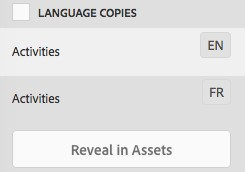
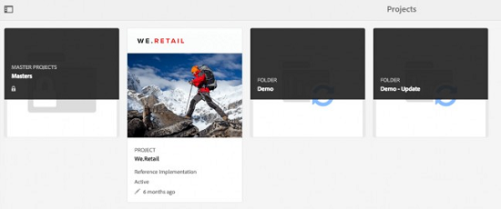

# 建立翻譯項目 {#creating-translation-projects}

要建立語言副本，請觸發以下語言副本工作流之一，該工作流位於的「參考」(References)欄下 [!DNL Experience Manager] 用戶介面。

* **建立和翻譯**:在此工作流中，要翻譯的資產將複製到要翻譯的語言的語言的語言根中。 此外，根據您選擇的選項，將在「項目」控制台中為資產建立一個翻譯項目。 根據設定，可以手動啟動翻譯項目，或允許在建立翻譯項目後立即自動運行。

* **更新語言副本**:運行此工作流以翻譯其他資產組，並將其包含在特定區域設定的語言副本中。 在這種情況下，已轉換的資產將添加到已包含先前轉換的資產的目標資料夾中。

>[!PREREQUISITES]
>
>* 建立翻譯項目的用戶是組的成員 `projects-administrators`。
>* 翻譯服務提供商支援二進位檔案的翻譯。

## 建立和轉換工作流 {#create-and-translate-workflow}

首次使用建立和翻譯工作流為特定語言生成語言副本。 工作流提供以下選項：

* 僅建立結構.
* 建立新的翻譯專案.
* 新增至現有翻譯專案.

### 僅建立結構 {#create-structure-only}

使用「 **[!UICONTROL 僅建立結構]** 」選項，在目標語言根目錄中建立目標資料夾層次結構，以匹配源語言根目錄中源資料夾的層次結構。在這種情況下，來源資產會複製到目標資料夾。但是，不會生成任何翻譯項目。

1. 在 [!DNL Assets] 介面，選擇要在目標語言根目錄中建立結構的源資料夾。

1. 開啟 **[!UICONTROL 引用]** 按一下 **[!UICONTROL 語言副本]** 在 **[!UICONTROL 副本]**。

   

1. 按一下 **[!UICONTROL 建立和翻譯]**。 從 **[!UICONTROL 目標語言]** 清單中，選擇要為其建立資料夾結構的語言。

1. 從「專 **[!UICONTROL 案]** 」清單中，選 **[!UICONTROL 擇「僅建立結構」]**。

1. 按一下&#x200B;**[!UICONTROL 建立]**。目標語言的新結構列於 **[!UICONTROL 語言副本]**。

   

1. 從清單中按一下結構，然後按一下 **[!UICONTROL 在資產中顯示]** 導航到目標語言中的資料夾結構。

   

### 建立新的翻譯專案 {#create-a-new-translation-project}

如果使用此選項，則要翻譯的資產將被複製到要翻譯的語言的語言的語言根中。 根據您選擇的選項，將在「項目」控制台中為資產建立翻譯項目。 根據設定，可以手動啟動翻譯項目，或在建立翻譯項目後立即自動運行翻譯項目。

1. 在 [!DNL Assets] 用戶介面，選擇要為其建立語言副本的源資料夾。
1. 開啟 **[!UICONTROL 引用]** 按一下 **[!UICONTROL 語言副本]** 在 **[!UICONTROL 副本]**。

   

1. 按一下 **[!UICONTROL 建立和翻譯]** 在底部。

1. 從「目 **[!UICONTROL 標語言]** 」清單中，選取您要建立檔案夾結構的語言。

1. 從 **[!UICONTROL 項目]** 清單，選擇 **[!UICONTROL 新建翻譯項目]**。

1. 在「專 **[!UICONTROL 案標題]** 」欄位中，輸入專案標題。

1. 按一下&#x200B;**[!UICONTROL 建立]**。[!DNL Assets] 從源資料夾複製到步驟4中選擇的區域設定的目標資料夾。

   

1. 要導航到資料夾，請選擇語言副本，然後按一下 **[!UICONTROL 在資產中顯示]**。

   

1. 導航到「項目」控制台。 翻譯資料夾會複製到「項目」控制台。

   

1. 開啟資料夾以查看翻譯項目。

   

1. 按一下項目以開啟詳細資訊頁面。

   

1. 要查看翻譯作業的狀態，請按一下 **[!UICONTROL 翻譯作業]** 平鋪。

   

   有關作業狀態的詳細資訊，請參閱 [監視翻譯作業的狀態](/help/sites-administering/tc-manage.md#monitoring-the-status-of-a-translation-job)。

1. 導航到 [!DNL Assets] 用戶介面，並開啟 [!UICONTROL 屬性] 頁，查看已轉換的元資料。

   

   *圖：資產屬性頁中已轉換的元資料。*

   >[!NOTE]
   >
   >此功能可用於資產和資料夾。 當選擇資產而不是資料夾時，將複製直至語言根目錄的整個資料夾層次結構，以便為資產建立語言副本。

### 新增至現有翻譯專案 {#add-to-existing-translation-project}

如果使用此選項，則在運行上一個翻譯工作流後，將為添加到源資料夾的資產運行翻譯工作流。 只有新添加的資產才會複製到包含以前轉換的資產的目標資料夾中。 在這種情況下，未建立新的翻譯項目。

1. 在 [!DNL Assets] UI，導航到包含未轉換資產的源資料夾。
1. 選取您要轉換的資產，並開啟「參考」 **[!UICONTROL 窗格]**。「語 **[!UICONTROL 言副本]** 」部分顯示當前可用的翻譯副本數。
1. 按一下 **[!UICONTROL 語言副本]** 在 **[!UICONTROL 副本]**。 將顯示可用翻譯副本的清單。
1. 按一下 **[!UICONTROL 建立和翻譯]** 在底部。

1. 從「目 **[!UICONTROL 標語言]** 」清單中，選取您要建立檔案夾結構的語言。

1. 從「項 **[!UICONTROL 目]** 」清單中，選擇「 **[!UICONTROL 添加到現有翻譯項目」]** ，以在資料夾中運行翻譯工作流。

   >[!NOTE]
   >
   >如果選擇 **[!UICONTROL 添加到現有翻譯項目]** 選項，只有在項目設定與預先存在的項目的設定完全匹配時，翻譯項目才會添加到預先存在的項目中。 否則，將建立新項目。

1. 從 **[!UICONTROL 現有翻譯項目]** 清單中，選擇要添加資產以進行轉換的項目。

1. 按一下&#x200B;**[!UICONTROL 建立]**。要翻譯的資產會新增至目標資料夾。更新的資料夾會列在「語言復 **[!UICONTROL 本」區段下]** 。

   

1. 導航到「項目」控制台，然後開啟您添加到的現有翻譯項目。
1. 按一下翻譯項目查看項目詳細資訊頁面。

   

1. 按一下 **翻譯作業** 平鋪以在翻譯工作流中查看資產。 翻譯工作清單也會顯示資產中繼資料和標記項目。這些項目表示資產中繼資料和標記也已翻譯。

   >[!NOTE]
   >
   >如果刪除標籤或元資料的條目，則不會為任何資產轉換標籤或元資料。

   >[!NOTE]
   >
   >如果添加到翻譯作業的資產包括子組，請選擇子組並刪除它們，以便翻譯繼續，不出現任何故障。

1. 要開始資產的轉換，請按一下 **[!UICONTROL 翻譯作業]** 平鋪和選擇 **[!UICONTROL 開始]** 清單中。

   

   消息將通知翻譯作業的開始。

1. 要查看翻譯作業的狀態，請按一下 **[!UICONTROL 翻譯作業]** 平鋪。

   

   有關詳細資訊，請參閱 [監視翻譯作業的狀態](/help/sites-administering/tc-manage.md#monitoring-the-status-of-a-translation-job)。

1. 翻譯完成後，狀態將更改為「準備審閱」。 導航到 [!DNL Assets] 介面，並開啟每個已轉換資產的「屬性」頁以查看已轉換的元資料。

## 更新語言副本 {#update-language-copies}

運行此工作流以翻譯任何附加的資產集，並將其包含在特定區域設定的語言副本中。 在這種情況下，已轉換的資產將添加到已包含先前轉換的資產的目標資料夾中。 根據選項的選擇，建立翻譯項目或更新新資產的現有翻譯項目。 「更新語言副本」工作流包括以下選項：

* 建立新的翻譯專案
* 新增至現有翻譯專案

### 建立新的翻譯專案 {#create-a-new-translation-project-1}

如果使用此選項，則會為要更新語言副本的一組資產建立翻譯項目。

1. 從 [!DNL Assets] UI，選擇添加資產的源資料夾。
1. 開啟 **[!UICONTROL 引用]** ，然後按一下 **[!UICONTROL 語言副本]** 在 **[!UICONTROL 副本]** 來顯示語言副本清單。
1. 選中「語言副本」 **[!UICONTROL 之前的複選框]**，然後選擇與相應地區對應的目標資料夾。

   

1. 按一下 **[!UICONTROL 更新語言副本]** 在底部。

1. 從 **[!UICONTROL 項目]** 清單 **[!UICONTROL 新建翻譯項目]**。

1. 在「專 **[!UICONTROL 案標題]** 」欄位中，輸入專案標題。

1. 按一下 **[!UICONTROL 開始]**。
1. 導航到「項目」控制台。 翻譯資料夾會複製到「項目」控制台。

   

1. 開啟資料夾以查看翻譯項目。

   

1. 按一下項目以開啟詳細資訊頁面。

   

1. 要開始資產的轉換，請按一下 **[!UICONTROL 翻譯作業]** 平鋪和選擇 **[!UICONTROL 開始]** 清單中。

   

   消息將通知翻譯作業的開始。

1. 要查看翻譯作業的狀態，請按一下 **[!UICONTROL 翻譯作業]** 平鋪。

   

   有關作業狀態的詳細資訊，請參閱 [監視翻譯作業的狀態](../sites-administering/tc-manage.md#monitoring-the-status-of-a-translation-job)。

1. 導航到 [!DNL Assets] 介面，並開啟每個已轉換資產的「屬性」頁以查看已轉換的元資料。

### 新增至現有翻譯專案 {#add-to-existing-translation-project-1}

如果使用此選項，則資產集將添加到現有翻譯項目中，以更新所選區域設定的語言副本。

1. 從 [!DNL Assets] UI，選擇添加資產資料夾的源資料夾。
1. 開啟 **[!UICONTROL 引用窗格]**，然後按一下 **[!UICONTROL 語言副本]** 在 **[!UICONTROL 副本]** 來顯示語言副本清單。

   

1. 在「語言副本」之前選 **[!UICONTROL 取核取方塊]**，以選取所有語言副本。取消選擇與要翻譯的語言環境相對應的語言副本 (副本) 以外的其他副本。

   

1. 按一下 **[!UICONTROL 更新語言副本]** 在底部。

1. 從 **[!UICONTROL 項目]** 清單 **[!UICONTROL 添加到現有翻譯項目]**。

1. 從 **[!UICONTROL 現有翻譯項目]** 清單中，選擇要添加資產以進行轉換的項目。

1. 按一下 **[!UICONTROL 開始]**。
1. 請參閱第9-14步 [添加到現有翻譯項目](translation-projects.md#add-to-existing-translation-project) 完成其餘的程式。

## 建立臨時語言副本 {#creating-temporary-language-copies}

運行翻譯工作流以使用已編輯的原始資產版本更新語言副本時，現有語言副本將保留，直到您批准已翻譯的資產。 [!DNL Adobe Experience Manager Assets] 將新翻譯的資產儲存在臨時位置，並在明確批准資產後更新現有語言副本。 如果拒絕資產，則語言副本將保持不變。

1. 按一下下面的源根資料夾 **[!UICONTROL 語言副本]** 已為其建立語言副本，然後按一下 **[!UICONTROL 在資產中顯示]** 開啟資料夾 [!DNL Experience Manager Assets]。

   

1. 從 [!DNL Assets] 介面，選擇已翻譯的資產，然後按一下 **[!UICONTROL 編輯]** 的子菜單。
1. 編輯資產，然後保存更改。
1. 執行第2-14步 [添加到現有翻譯項目](#add-to-existing-translation-project) 更新語言副本的過程。
1. 按一下 **[!UICONTROL 翻譯作業]** 平鋪。 從 **[!UICONTROL 翻譯作業]** 頁面中，您可以清楚地查看儲存已轉換的資產版本的臨時位置。

   

1. 選中旁邊的複選框 **[!UICONTROL 標題]**。
1. 在工具欄中，按一下 **[!UICONTROL 接受翻譯]**  然後按一下 **[!UICONTROL 接受]** 對話框中，使用已編輯資產的已轉換版本覆蓋目標資料夾中已轉換的資產。

   >[!NOTE]
   >
   >要啟用翻譯工作流來更新目標資產，請同時接受資產和元資料。

   按一下 **[!UICONTROL 拒絕翻譯]**  以在目標區域設定根目錄中保留資產的最初翻譯版本並拒絕編輯的版本。

1. 要查看已轉換的元資料，請導航至 [!DNL Assets] 並開啟 [!UICONTROL 屬性] 頁)。

## 提示和限制 {#tips-limitations}

* 如果您為複雜資產啟動翻譯工作流，例如PDF和 [!DNL Adobe InDesign] 檔案、其子元件或格式副本（如果有）不會提交以供翻譯。
* 如果使用機器翻譯，則資產二進位檔案不會被翻譯。
