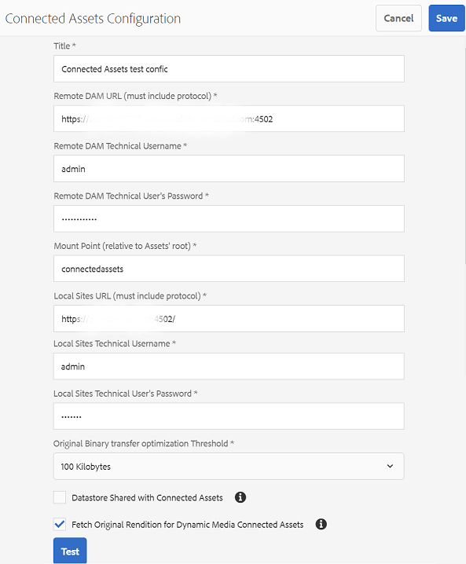

# 使用「連線資產」在 中共用 DAM 資產 [!DNL Experience Manager Sites] {#use-connected-assets-to-share-dam-assets-in-aem-sites}

| 版本 | 文章連結 |
| -------- | ---------------------------- |
| AEM as a Cloud Service  | [按一下這裡](https://experienceleague.adobe.com/docs/experience-manager-cloud-service/content/assets/admin/use-assets-across-connected-assets-instances.html?lang=en) |
| AEM 6.5 | 本文 |

大型企業中，建立網站所需的基礎架構可能很分散。有時候，建立這些網站的網站建立功能和數位資產可能會存放在不同的部署中。一個原因是，現有部署在地理上分散，需要協同工作。 另一個原因可能是收購導致異構基礎架構，包括不同 [!DNL Experience Manager] 版本，而母公司希望共同使用。

Connected Assets功能通過整合支援上述使用案例 [!DNL Experience Manager Sites] 和 [!DNL Experience Manager Assets]。 用戶可以在 [!DNL Sites] 將數字資產 [!DNL Assets] 部署。

>[!NOTE]
>
>僅當您需要使用遠程DAM部署上可用的資產（在單獨的站點部署上）來創作網頁時，才配置連接的資產。

## 連線資產概觀 {#overview-of-connected-assets}

在中編輯頁面時 [!UICONTROL 頁面編輯器] 作為目標目標，作者可以無縫搜索、瀏覽和嵌入來自其他目標的資產 [!DNL Assets] 作為資產來源的部署。 管理員建立部署的一次性整合 [!DNL Experience Manager] 與 [!DNL Sites] 與另一部署的功能 [!DNL Experience Manager] 與 [!DNL Assets] 功能。 網站作者還可以通過Connected Assets在其網站的網頁中使用Dynamic Media影像，並利用Dynamic Media的功能，如智慧裁剪和影像預設。

對於 [!DNL Sites] 作者稱，遠程資產可用作只讀本地資產。 此功能支援在站點編輯器上無縫搜索和訪問遠程資產。 對於可能需要在站點上提供完整資產語料庫的任何其他使用情形，請考慮批量遷移資產，而不是利用連接資產。 請參閱 [Experience Manager Assets遷移指南](/help/assets/assets-migration-guide.md)。

### 先決條件和支援的部署 {#prerequisites}

使用或設定此功能之前，請先確定下列事項：

* 用戶是每個部署上相應用戶組的一部分。
* 對於 [!DNL Adobe Experience Manager] 部署類型，滿足支援的條件之一。 [!DNL Experience Manager] 6.5 [!DNL Assets] 工作 [!DNL Experience Manager] as a Cloud Service。 有關此功能如何工作的詳細資訊 [!DNL Experience Manager] 作為 [!DNL Cloud Service]，請參閱 [Experience Manageras a Cloud Service中的關連資產](https://experienceleague.adobe.com/docs/experience-manager-cloud-service/assets/admin/use-assets-across-connected-assets-instances.html)。

   |  | [!DNL Sites] as a [!DNL Cloud Service] | [!DNL Experience Manager] 6.5 [!DNL Sites] 在AMS上。 | [!DNL Experience Manager] 6.5 [!DNL Sites] 現場 |
   |---|---|---|---|
   | **[!DNL Experience Manager Assets]作為[!DNL Cloud Service]** | 支援 | 支援 | 支援 |
   | **[!DNL Experience Manager]6.5 [!DNL Assets] 在AMS上。** | 支援 | 支援 | 支援 |
   | **[!DNL Experience Manager]6.5 [!DNL Assets] 現場** | 不支援 | 不支援 | 不支援 |

### 支援的檔案格式 {#mimetypes}

作者在Content Finder中搜索影像和以下類型的文檔，並在頁面編輯器中拖動搜索到的資產。 文檔將添加到 `Download` 元件和影像 `Image` 元件。 作者還可以在任何自定義中添加遠程資產 [!DNL Experience Manager] 擴展預設值的元件 `Download` 或 `Image` 元件。 支援的格式包括：

* **影像格式**:格式 [影像元件](assets-formats.md#supported-raster-image-formats) 支援。
* **文檔格式**:查看 [支援的文檔格式](assets-formats.md#supported-document-formats)。

### 相關使用者和群組 {#users-and-groups-involved}

以下說明設定及使用功能以及其相對應的使用者群組時，相關的各種角色。本地範圍用於作者建立網頁的使用案例。 遠端範圍適用於託管所需資產的 DAM 部署。的 [!DNL Sites] 作者獲取這些遠程資產。

| 角色 | 範圍 | 使用者群組 | 逐步說明中的使用者名稱 | 說明 |
|---|---|---|---|---|
| [!DNL Sites] 管理員 | 本機 | [!DNL Experience Manager] `administrators` | `admin` | 設定 [!DNL Experience Manager] 並配置與遠程設備的整合 [!DNL Assets] 部署。 |
| DAM 使用者 | 本機 | `Authors` | `ksaner` | 用於檢視及複製 `/content/DAM/connectedassets/` 中擷取的資產。 |
| [!DNL Sites] 作者 | 本機 | <ul><li>`Authors` (對遠程DAM具有讀訪問權限，對本地 [!DNL Sites]) </li> <li>`dam-users` 本地 [!DNL Sites]</li></ul> | `ksaner` | 最終用戶是 [!DNL Sites] 使用此整合來提高內容速度的作者。 在遠程DAM中，作者使用Web C++語言搜索和瀏覽資產 [!UICONTROL 內容查找器] 並在本地網頁中使用所需的影像。 已採用 `ksaner` DAM 使用者的認證。 |
| [!DNL Assets] 管理員 | 遠端 | [!DNL Experience Manager] `administrators` | `admin` 遠程 [!DNL Experience Manager] | 設定跨原始資源共用 (CORS)。 |
| DAM 使用者 | 遠端 | `Authors` | `ksaner` 遠程 [!DNL Experience Manager] | 在遠程上的作者角色 [!DNL Experience Manager] 部署。 使用 [!UICONTROL 內容查找器]。 |
| DAM 經銷商 (技術使用者) | 遠端 | [!DNL Sites] `Authors` | `ksaner` 遠程 [!DNL Experience Manager] | 遠程部署上的此用戶由 [!DNL Experience Manager] 本地伺服器(不是 [!DNL Sites] 作者角色)，以代表 [!DNL Sites] 作者。 此角色與上述的兩個 `ksaner` 角色不一樣，而且屬於不同的使用者群組。 |

### 連接資產體系結構 {#connected-assets-architecture}

Experience Manager允許您將遠程DAM部署作為源連接到多個Experience Manager [!DNL Sites] 部署。 最多可連接4個 [!DNL Sites] 部署到源遠程DAM。 但是，您可以 [!DNL Sites] 只部署一個遠程DAM。

下圖說明了支援的方案：

下圖說明了不受支援的方案：

## 配置之間的連接 [!DNL Sites] 和 [!DNL Assets] 部署 {#configure-a-connection-between-sites-and-assets-deployments}

安 [!DNL Experience Manager] 管理員可以建立此整合。 建立後，需要通過用戶組建立使用該權限的權限。 用戶組在 [!DNL Sites] 部署和部署DAM。

配置連接的資產和本地 [!DNL Sites] 連接，請執行以下步驟：

1. 訪問現有 [!DNL Sites] 使用以下命令部署或建立部署：

   1. 在JAR檔案的資料夾中，在終端上執行以下命令以建立每個 [!DNL Experience Manager] 伺服器。
      `java -XX:MaxPermSize=768m -Xmx4096m -jar <quickstart jar filepath> -r samplecontent -p 4502 -nofork -gui -nointeractive &`

   1. 幾分鐘後， [!DNL Experience Manager] 伺服器成功啟動。 考慮一下 [!DNL Sites] 部署為本地電腦進行網頁創作，例如， `https://[local_sites]:4502`。

1. 確保上存在具有適當範圍的用戶和角色 [!DNL Sites] 部署和 [!DNL Assets] 在AMS上部署。 建立技術用戶 [!DNL Assets] 部署並添加到中提到的用戶組 [涉及的用戶和組](/help/assets/use-assets-across-connected-assets-instances.md#users-and-groups-involved)。

1. 訪問本地 [!DNL Sites] 部署 `https://[local_sites]:4502`。 按一下&#x200B;**[!UICONTROL 「工具]** > **[!UICONTROL 資產]** > **[!UICONTROL 連線資產設定」]**，並提供下列各值：

   1. A **[!UICONTROL 標題]** 的下界。
   1. **[!UICONTROL 遠程DAM URL]** 是 [!DNL Assets] 的 `https://[assets_servername]:[port]`。
   1. DAM 經銷商 (技術使用者) 的認證。
   1. 在 **[!UICONTROL 山角]** 欄位，輸入本地 [!DNL Experience Manager] 路徑 [!DNL Experience Manager] 讀取資產。 例如，`remoteassets` 資料夾。從DAM提取的資產儲存在 [!DNL Sites] 部署。
   1. **[!UICONTROL 本地站點URL]** 是 [!DNL Sites] 部署。 [!DNL Assets] 部署使用此值來維護對此獲取的數字資產的引用 [!DNL Sites] 部署。
   1. 憑據 [!DNL Sites] 技術用戶。
   1. 值 **[!UICONTROL 原始二進位傳輸優化閾值]** 欄位指定原始資產（包括格式副本）是否同步轉移。 可以輕鬆讀取檔案大小較小的資產，而檔案大小相對較大的資產最好非同步同步。 該值取決於您的網路功能。
   1. 選擇 **[!UICONTROL 與連接的資產共用的資料儲存]**，如果您使用資料儲存來儲存資產，並且資料儲存在兩個部署之間共用。 在這種情況下，閾值限制並不重要，因為實際資產二進位檔案在資料儲存上可用，並且不會傳輸。

   

   *圖：Connected Assets功能的典型配置。*

1. 現有數字資產 [!DNL Assets] 已處理部署並生成格式副本。 這些格式副本是使用此功能獲取的，因此不需要重新生成格式副本。 禁用工作流啟動程式以阻止格式副本的再生。 在([!DNL Sites])要排除的部署 `connectedassets` 資料夾（將在此資料夾中提取資產）。

   1. 開 [!DNL Sites] 部署，按一下 **[!UICONTROL 工具]** > **[!UICONTROL 工作流]** > **[!UICONTROL 發射器]**。

   1. 搜尋將 **[!UICONTROL DAM 更新資產]**&#x200B;和 **[!UICONTROL DAM 中繼資料回寫]**&#x200B;設為工作流程的啟動器。

   1. 選取工作流程啟動器，然後按一下動作列上的&#x200B;**[!UICONTROL 「屬性」]**。

   1. 在 [!UICONTROL 屬性] 嚮導，更改 **[!UICONTROL 路徑]** 欄位，作為以下映射以更新其規則運算式以排除裝載點 **[!UICONTROL 關連資產]**。

   | 變更前 | 變更後 |
   |---|---|
   | `/content/dam(/((?!/subassets).)*/)renditions/original` | `/content/dam(/((?!/subassets)(?!connectedassets).)*/)renditions/original` |
   | `/content/dam(/.*/)renditions/original` | `/content/dam(/((?!connectedassets).)*/)renditions/original` |
   | `/content/dam(/.*)/jcr:content/metadata` | `/content/dam(/((?!connectedassets).)*/)jcr:content/metadata` |

   >[!NOTE]
   >
   >作者擷取資產時，會擷取遠端 部署上可用的所有轉譯項目。若要針對所擷取的資產建立更多轉譯項目，請略過此設定步驟。的 [!UICONTROL DAM更新資產] 將觸發工作流並建立更多格式副本。 這些格式副本僅在本地 [!DNL Sites] 部署，而不是遠程DAM部署。

1. 添加 [!DNL Sites] 部署為CORS配置中允許的源 [!DNL Assets] 部署。 有關詳細資訊，請參見 [瞭解CORS](https://experienceleague.adobe.com/docs/experience-manager-learn/foundation/security/understand-cross-origin-resource-sharing.html)。

1. 配置 [相同站點cookie支援](/help/sites-administering/same-site-cookie-support.md)。

您可以檢查已配置 [!DNL Sites] 部署和 [!DNL Assets] 部署。

![已配置連接資產的連接test [!DNL Sites]](assets/connected-assets-multiple-config.png)
*圖：已配置連接資產的連接test [!DNL Sites]。*

## 使用Dynamic Media資產 {#dynamic-media-assets}

使用連接的資產，您可以使用由 [!DNL Dynamic Media] 從「站點」頁面上的遠程DAM部署，並利用Dynamic Media功能，如智慧裁剪和影像預設。

要使用 [!DNL Dynamic Media] 連接資產：

1. 配置 [!DNL Dynamic Media] 在已啟用同步模式的遠程DAM部署上。
1. 配置 [已連接資產](#configure-a-connection-between-sites-and-assets-deployments)。
1. 配置 [!DNL Dynamic Media] 與遠程DAM上配置的公司名稱相同的站點實例上。 站點部署必須具有對Dynamic Media帳戶的只讀訪問權限，才能處理連接的資產。 因此，請確保在站點實例上禁用Dynamic Media配置中的同步模式。

>[!CAUTION]
>
>具有關連資產和 [!DNL Dynamic Media] 配置，不能使用 [!DNL Dynamic Media] 處理上可用的本地資產 [!DNL Sites] 部署。

## 設定 [!DNL Dynamic Media] {#configure-dynamic-media}

配置 [!DNL Dynamic Media] 上 [!DNL Assets] 和 [!DNL Sites] 部署：

1. 啟用和配置 [!DNL Dynamic Media] 作為遠程全局配置 [!DNL Assets] 作者部署。 要配置Dynamic Media，請參見 [配置Dynamic Media](/help/assets/config-dynamic.md#configuring-dynamic-media-cloud-services)。 
在遠程 [!DNL Assets] 部署，在 [!UICONTROL Dynamic Media同步模式]選中 **[!UICONTROL 預設啟用]**。

1. 按中所述建立連接的資產配置 [配置站點和資產部署之間的連接](#configure-a-connection-between-sites-and-assets-deployments)。 另外，選擇 **[!UICONTROL 獲取Dynamic Media連接資產的原始格式副本]** 的雙曲餘切值。

1. 配置 [!DNL Dynamic Media] 本地 [!DNL Sites] 遠程 [!DNL Assets] 部署。 按照說明 [配置 [!DNL Dynamic Media]](/help/assets/config-dynamic.md#configuring-dynamic-media-cloud-services)。

   * 在所有配置中使用相同的公司名稱。
   * 論本地 [!DNL Sites], [!UICONTROL Dynamic Media同步模式]選中 **[!UICONTROL 預設禁用]**。 的 [!DNL Sites] 部署必須具有對 [!DNL Dynamic Media] 帳戶。
   * 論本地 [!DNL Sites]，也請參見Wiki頁。 **[!UICONTROL 發佈資產]** 選項，選擇 **[!UICONTROL 選擇性發佈]**。 不選擇 **[!UICONTROL 同步所有內容]**。

1. 啟用 [[!DNL Dynamic Media] 影像核心元件中的支援](https://experienceleague.adobe.com/docs/experience-manager-core-components/using/components/image.html#dynamic-media)。 此功能啟用預設 [影像元件](https://www.aemcomponents.dev/content/core-components-examples/library/page-authoring/image.html) 顯示 [!DNL Dynamic Media] 影像 [!DNL Dynamic Media] 影像由作者在本地網頁中使用 [!DNL Sites] 部署。

## 使用遠端資產 {#use-remote-assets}

網站作者使用Content Finder連接到DAM部署。 作者可以瀏覽、搜尋和拖曳元件中的遠端資產。要向遠程DAM進行身份驗證，請保持管理員提供的憑據（如果有）便於使用。

作者可以在單個網頁中使用本地DAM和遠程DAM部署上的可用資產。 使用「內容尋找器」，以便在搜尋本機 DAM 和搜尋遠端 DAM 之間切換。

只提取遠程資產的那些標籤，這些標籤具有與同一分類層次結構完全相同的對應標籤，可在本地 [!DNL Sites] 部署。 其他所有標籤會一概捨棄。作者可以使用遠程上存在的所有標籤搜索遠程資產 [!DNL Experience Manager] 部署，因為它提供全文搜索。

### 逐步使用說明 {#walk-through-of-usage}

不妨使用上述設定試著編寫體驗，以了解功能的運作方式。在遠端 DAM 部署中使用您所選擇的文件或影像。

1. 導航到 [!DNL Assets] 通過訪問 **[!UICONTROL 資產]** > **[!UICONTROL 檔案]** 從 [!DNL Experience Manager] 工作區。 或者，您也可以在瀏覽器中存取 `https://[assets_servername_ams]:[port]/assets.html/content/dam`。上傳您選擇的資產。
1. 在 [!DNL Sites] 部署，在右上角的profile激活器中，按一下 **[!UICONTROL 模擬為]**。 輸入 `ksaner` 作為使用者名稱，選取畫面上提供的選項，然後按一下&#x200B;**[!UICONTROL 「確定」]**。
1. 在&#x200B;**[!UICONTROL 「Sites]** > **[!UICONTROL We.Retail]** > **[!UICONTROL tw]** > **[!UICONTROL zh」]**&#x200B;開啟「We.Retail」網頁。編輯頁面。或者，您也可以在瀏覽器中存取 `https://[aem_server]:[port]/editor.html/content/we-retail/us/en/men.html`，進而編輯頁面。

   按一下頁面左上角的&#x200B;**[!UICONTROL 「切換側面板」]**。

1. 開啟 [!UICONTROL 資產] 頁籤（遠程內容查找器），然後按一下 **[!UICONTROL 登錄到已連接的資產]**。
1. 提供憑證 `ksaner` 作為使用者名稱，且以 `password` 作為密碼。此用戶對 [!DNL Experience Manager] 部署。
1. 搜尋您新增至 DAM 的資產。遠端資產會顯示於左側面板。篩選影像或文件，並進一步篩選支援的文件類型。拖曳 `Image` 元件上的影像和 `Download` 元件上的文件。

   本地上讀取的資產為只讀 [!DNL Sites] 部署。 您仍然可以使用 [!DNL Sites] 元件，以編輯提取的資產。 由元件進行編輯屬於非破壞性動作。

   

   *圖：在遠端 DAM 上搜尋資產時，篩選文件類型和影像的選項.*

1. 如果非同步讀取資產的原始檔案，並且任何讀取任務失敗，則會通知站點作者。 在創作時，甚至在創作後，作者都可以在 [非同步作業](/help/sites-administering/asynchronous-jobs.md) 用戶介面。

   

   *圖：背景中非同步擷取資產作業的相關通知。*

1. 發佈頁面時， [!DNL Experience Manager] 顯示頁面上使用的資產的完整清單。 請確認發佈時，系統已成功擷取遠端資產。要檢查每個提取的資產的狀態，請參閱 [非同步作業](/help/sites-administering/asynchronous-jobs.md) 用戶介面。

   >[!NOTE]
   >
   >即使未完全提取一個或多個遠程資產，也會發佈該頁面。 的 [!DNL Experience Manager] 「通知」區域顯示非同步作業頁中顯示的錯誤通知。

>[!CAUTION]
>
>一旦在網頁中使用，所獲取的遠程資產可被具有訪問本地資料夾權限的任何人搜索和使用。 提取的資產儲存在本地資料夾中(`connectedassets` 上面的「Adive Inver」(C.)。 這些資產也可供搜尋，並可透過[!UICONTROL 「內容尋找器」]顯示於本機存放庫。

擷取的資產可設為其他任何本機資產以供使用，只是相關聯的中繼資料無法編輯。

### 檢查跨網頁的資產使用 {#asset-usage-references}

[!DNL Experience Manager] 允許DAM用戶檢查對資產的所有引用。 它有助於理解和管理資產在遠程環境中的使用 [!DNL Sites] 和複合資產。 上的網頁的許多作者 [!DNL Experience Manager Sites] 部署可以在遠程 [!DNL Assets] 頁。 為簡化資產管理，不致導致引用損壞，DAM用戶必須檢查跨本地和遠程網頁的資產使用情況。 的 [!UICONTROL 引用] 頁籤 [!UICONTROL 屬性] 頁面列出資產的本地和遠程引用。

查看和管理 [!DNL Assets] 部署，請執行以下步驟：

1. 在中選擇資產 [!DNL Assets] 控制台並按一下 **[!UICONTROL 屬性]** 的子菜單。
1. 按一下 **[!UICONTROL 引用]** 頁籤。 請參閱 **[!UICONTROL 本地引用]** 資產用途 [!DNL Assets] 部署。 參見**[!UICONTROL 遠程引用] 用於 [!DNL Sites] 部署，其中使用「已連接資產」功能獲取資產。

   

1. 的引用 [!DNL Sites] 頁面顯示每個本地引用的總計數 [!DNL Sites]。 查找所有參照並顯示參照總數可能需要一些時間。
1. 引用清單是互動式的，DAM用戶可以按一下某個引用以開啟引用頁。 如果由於某種原因無法提取遠程引用，則顯示通知，通知用戶故障。
1. 用戶可以移動或刪除資產。 移動或刪除資產時，所有選定資產/資料夾的引用總數將顯示在警告對話框中。 刪除尚未檢索引用的資產時，將顯示警告對話框。

   

### 管理遠程DAM中資產的更新 {#manage-updates-in-remote-dam}

之後 [配置連接](#configure-a-connection-between-sites-and-assets-deployments) 在遠程DAM和 [!DNL Sites] 部署時，遠程DAM上的資產可在 [!DNL Sites] 部署。 然後，可以對遠程DAM資產或資料夾執行更新、刪除、更名和移動操作。 更新（有延遲）在 [!DNL Sites] 部署。 此外，如果遠程DAM上的資產在本地 [!DNL Experience Manager Sites] 頁中，遠程DAM上資產的更新顯示在 [!DNL Sites] 的子菜單。

將資產從一個位置移動到另一個位置時，請確保 [調整參照](/help/assets/manage-assets.md) 使資產在 [!DNL Sites] 的子菜單。 如果將資產移動到本地無法訪問的位置 [!DNL Sites] 部署時，該資產無法顯示在站點部署中。

您還可以更新遠程DAM上資產的元資料屬性，並且更改可在本地 [!DNL Sites] 部署。

[!DNL Sites] 作者可以預覽 [!DNL Sites] 部署，然後重新發佈更改，使其在 [!DNL Experience Manager] 發佈實例。

[!DNL Experience Manager] 顯示中資產的過期狀態可視指示器 `Remote Assets Content Finder` 阻止站點作者在 [!DNL Sites] 的子菜單。 如果您使用的資產的狀態為 [!DNL Sites] 頁面，資產無法顯示在 [!DNL Experience Manager] 發佈實例。

>[!NOTE]
>
>將遠程DAM中資產的更新提供給 [!DNL Sites] 僅在遠程DAM和 [!DNL Sites] 部署已啟動 [!DNL Experience Manager]。

## 常見問答 {#frequently-asked-questions}

+++**如果需要使用上的可用資產，是否應配置已連接資產 [!DNL Sites] 部署？**

在這種情況下，無需配置連接的資產。 您可以使用 [!DNL Sites] 部署。

+++

+++**您何時需要配置「已連接資產」功能？**

僅當需要使用遠程DAM部署上的可用資產時，才配置「已連接資產」功能 [!DNL Sites] 部署。

+++

+++**多少 [!DNL Sites] 部署配置連接的資產後，您能否連接到遠程DAM部署？**

最多可連接4個 [!DNL Sites] 在配置連接的資產後部署到遠程DAM部署。 有關詳細資訊，請參見 [連接資產體系結構](#connected-assets-architecture)。

+++

+++**您可以連接到 [!DNL Sites] 配置連接的資產後部署？**

您可以將一個遠程DAM部署連接到 [!DNL Sites] 配置連接的資產後進行部署。 有關詳細資訊，請參見 [連接資產體系結構](#connected-assets-architecture)。

+++

+++**你能用Dynamic Media的資產 [!DNL Sites] 配置連接的資產後部署？**

配置連接的資產後， [!DNL Dynamic Media] 資產於 [!DNL Sites] 以只讀模式部署。 因此，您不能使用 [!DNL Dynamic Media] 處理 [!DNL Sites] 部署。 有關詳細資訊，請參見 [配置站點和Dynamic Media部署之間的連接](#dynamic-media-assets)。

+++

+++**您能否使用上遠程DAM部署中的「映像」和「文檔」格式類型的資產 [!DNL Sites] 配置連接的資產後部署？**

是，您可以使用上的遠程DAM部署中的「映像」和「文檔」格式類型的資產 [!DNL Sites] 配置連接的資產後進行部署。

+++

+++**您能否使用上遠程DAM部署的內容片段和視頻資產 [!DNL Sites] 配置連接的資產後部署？**

否，您不能使用上遠程DAM部署中的內容片段和視頻資產 [!DNL Sites] 配置連接的資產後進行部署。

+++

+++**是否使用上遠程DAM部署的Dynamic Media資產 [!DNL Sites] 配置連接的資產後部署？**

是，您可以配置和使用Dynamic Media映像資產，這些資產來自 [!DNL Sites] 配置連接的資產後進行部署。 有關詳細資訊，請參見 [配置站點和Dynamic Media部署之間的連接](#dynamic-media-assets)。

+++

+++**配置連接的資產後，您能否對遠程DAM資產或資料夾執行更新、刪除、更名和移動操作？**

是的，在配置連接的資產後，您可以對遠程DAM資產或資料夾執行更新、刪除、更名和移動操作。 這些更新在站點部署中自動可用，但有一些延遲。 有關詳細資訊，請參見 [管理遠程DAM中資產的更新](#handling-updates-to-remote-assets)。

+++

+++**配置連接的資產後，可以在 [!DNL Sites] 部署並使其在遠程DAM部署中可用？**

可以將資產添加到 [!DNL Sites] 但是，這些資產無法用於遠程DAM部署。

+++

## 限制和最佳做法 {#tip-and-limitations}

* 要獲得有關資產使用情況的見解，請配置 [資產洞察](/help/assets/asset-insights.md) 功能 [!DNL Sites] 實例。

### 權限和資產管理 {#permissions-and-managing-assets}

* 本機資產為唯讀副本。[!DNL Experience Manager] 元件會對資產執行非破壞性的編輯作業。不允許執行其他編輯作業。
* 本機擷取的資產僅適用於編寫用途。無法套用資產更新工作流程，也無法編輯中繼資料。
* 僅支援影像和列出的文件格式。[!DNL Content Fragments] 和 [!DNL Experience Fragments] 不支援。
* [!DNL Experience Manager] 不提取元資料架構。 這意味著可能不顯示所有讀取的元資料。 如果在 [!DNL Sites] 部署後，將顯示所有元資料屬性。
* 全部 [!DNL Sites] 作者對讀取的副本具有讀取權限，即使作者無法訪問遠程DAM部署。
* 不提供 API 以支援自訂整合。
* 此功能可支援順暢的搜尋作業及使用遠端資產。若要在本機部署中一次提供多個遠端資產，不妨考慮移轉資產。請參閱[資產移轉指南](assets-migration-guide.md)。
* 無法將遠程資產用作上的頁面縮略圖 [!UICONTROL 頁面屬性] 用戶介面。 可以在中設定網頁的縮略圖 [!UICONTROL 頁面屬性] 用戶介面 [!UICONTROL 縮略圖] 按一下 [!UICONTROL 選擇影像]。

### 設定和授權 {#setup-licensing}

* [!DNL Assets] 部署 [!DNL Adobe Managed Services] 支援。
* [!DNL Sites] 可以連接到單個 [!DNL Assets] 一次部署。
* 許可證 [!DNL Assets] 需要遠程儲存庫。
* 一個或多個許可證 [!DNL Sites] 作為本地創作部署工作是必需的。

### 使用狀況 {#usage}

* 用戶可以在創作時搜索遠程資產，並將這些資產拖到本地頁上。 不支援其他功能。
* 擷取作業會於 5 秒後逾時。如果有網路或其他方面的問題，作者擷取資產時就可能遇到問題。作者可以通過從中拖動遠程資產來重新嘗試 [!UICONTROL 內容查找器] 至 [!UICONTROL 頁面編輯器]。
* 您可以對擷取的資產執行非破壞性的簡單編輯作業，也能執行透過 `Image` 元件支援的編輯工作。資產僅供唯讀。
* 重新提取資產的唯一方法是將其拖動到頁面上。 沒有API支援或其他方法來重新獲取資產以更新它。
* 如果資產從水壩中除役，則這些資產將繼續使用 [!DNL Sites] 頁。
* 非同步讀取資產的遠程引用條目。 引用和總計數不是即時的，如果站點作者在DAM用戶查看引用時使用該資產，則可能會有一些差異。 DAM用戶可以刷新頁面，並在幾分鐘後重試以獲取總計數。

## 疑難排解問題 {#troubleshoot}

要排除常見錯誤，請執行以下步驟：

* 如果無法從 [!UICONTROL 內容查找器]，然後確保所需的角色和權限已到位。

* 從遠程DAM獲取的資產由於一個或多個原因不能發佈在網頁上。 遠程伺服器上不存在它，缺少獲取它的適當權限，或網路故障可能是原因。 確保資產未從遠程DAM中刪除。 確保具有適當的權限，並滿足先決條件。 請重新將資產添加到頁面並重新發佈。 檢查[非同步工作清單](/help/sites-administering/asynchronous-jobs.md)，找出資產擷取作業的錯誤。

* 如果無法從本地訪問遠程DAM部署 [!DNL Sites] 部署，確保允許跨站點Cookie, [相同站點cookie支援](/help/sites-administering/same-site-cookie-support.md) 已配置。 如果阻止跨站點Cookie的部署 [!DNL Experience Manager] 無法驗證。 比如說， [!DNL Google Chrome] 在Incognito模式下，可能會阻止第三方Cookie。 允許Cookie進入 [!DNL Chrome] 瀏覽器，按一下地址欄中的「eye」表徵圖，導航到 **站點不工作** > **已阻止**，選擇遠程DAM URL，並允許登錄令牌cookie。 或者，請參見 [如何啟用第三方cookie](https://support.google.com/chrome/answer/95647)。

   

* 如果未檢索遠程引用並導致錯誤消息，請檢查是否 [!DNL Sites] 部署可用並檢查網路連接問題。 請稍後重試以檢查。 [!DNL Assets] 部署嘗試兩次建立連接 [!DNL Sites] 然後報告失敗。

   

