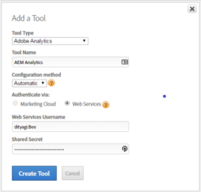

# 透過DTM啟用Assets Insights {#enable-asset-insights-through-dtm}

Adobe動態標籤管理是啟用數位行銷工具的工具。 此服務免費提供給Adobe Analytics客戶。 您可以自訂追蹤代碼，讓協力廠商CMS解決方案能使用Assets Insights，或使用DTM插入Assets Insights標籤。 僅支援並提供影像見解。

>[!CAUTION]
>
>AdobeDTM已過時，改用[!DNL Adobe Experience Platform]，很快將到達[生命週期結束](https://medium.com/launch-by-adobe/dtm-plans-for-a-sunset-3c6aab003a6f)。 Adobe建議您[對於資產前瞻分析](https://experienceleague.adobe.com/docs/experience-manager-learn/assets/advanced/asset-insights-launch-tutorial.html)使用 [!DNL Adobe Experience Platform] 。

執行這些步驟以透過DTM啟用Assets Insights。

1. 按一下Experience Manager標誌，然後前往&#x200B;**[!UICONTROL 工具]** > **[!UICONTROL 資產]** > **[!UICONTROL 前瞻分析設定]**。
1. [使用DTMExperience Manager配置Cloud Service](/help/sites-administering/dtm.md)

   一旦您登入[https://dtm.adobe.com](https://dtm.adobe.com/)，並造訪使用者設定檔中的&#x200B;**[!UICONTROL 帳戶設定]**,API代號就應該可供使用。 從資產分析的角度來看，此步驟並非必要步驟，因為Experience Manager網站與資產分析的整合仍在進行中。

1. 登入[https://dtm.adobe.com](https://dtm.adobe.com/)，並視情況選取公司。
1. 建立或開啟現有Web屬性

   * 選擇&#x200B;**[!UICONTROL Web屬性]**&#x200B;頁簽，然後按一下&#x200B;**[!UICONTROL 添加屬性]**。

   * 視需要更新欄位，然後按一下&#x200B;**[!UICONTROL 建立屬性]**。 請參閱[檔案](https://experienceleague.adobe.com/docs/experience-manager-learn/getting-started-wknd-tutorial-develop/overview.html)。

   

1. 在&#x200B;**[!UICONTROL Rules]**&#x200B;頁簽中，從導航窗格中選擇&#x200B;**[!UICONTROL Page Load Rules]**，然後按一下&#x200B;**[!UICONTROL Create New Rule]**。

   

1. 展開&#x200B;**[!UICONTROL JavaScript /第三方標籤]**。 然後，在&#x200B;**[!UICONTROL 循序HTML]**&#x200B;標籤中按一下&#x200B;**[!UICONTROL 新增指令碼]**&#x200B;以開啟「指令碼」對話方塊。

   

1. 按一下Experience Manager標誌，然後前往&#x200B;**[!UICONTROL Tools]** > **[!UICONTROL Assets]**。
1. 按一下&#x200B;**[!UICONTROL 前瞻分析頁面追蹤器]**，複製追蹤器程式碼，然後貼到您在步驟6中開啟的指令碼對話方塊中。 儲存變更。

   >[!NOTE]
   >
   >* `AppMeasurement.js` 已移除。預期可透過DTM的Adobe Analytics工具取得。
   >* 已移除對`assetAnalytics.dispatcher.init()`的呼叫。 當DTM的Adobe Analytics工具完成載入時，即應呼叫函式。
   >* 視Assets Insights頁面追蹤器的托管位置(例如Experience Manager、CDN等)而定，指令碼來源的來源可能需要變更。
   >* 對於Experience Manager托管的頁面追蹤器，來源應使用Dispatcher例項的主機名稱指向發佈例項。


1. 存取 `https://dtm.adobe.com`. 在Web屬性中按一下&#x200B;**[!UICONTROL 概述]**，然後按一下&#x200B;**[!UICONTROL 新增工具]**&#x200B;或開啟現有的Adobe Analytics工具。 建立工具時，可以將&#x200B;**[!UICONTROL 配置方法]**&#x200B;設定為&#x200B;**[!UICONTROL 自動]**。

   

   視情況選取測試/生產報表套裝。

1. 展開&#x200B;**[!UICONTROL 程式庫管理]**，並確定&#x200B;**[!UICONTROL 在]**&#x200B;載入程式庫已設為&#x200B;**[!UICONTROL 頁面頂端]**。

   

1. 展開&#x200B;**[!UICONTROL 自訂頁面代碼]**，然後按一下&#x200B;**[!UICONTROL 開啟編輯器]**。

   

1. 將下列程式碼貼入視窗中：

   ```Java
   var sObj;
   
   if (arguments.length > 0) {
     sObj = arguments[0];
   } else {
     sObj = _satellite.getToolsByType('sc')[0].getS();
   }
   _satellite.notify('in assetAnalytics customInit');
   (function initializeAssetAnalytics() {
     if ((!!window.assetAnalytics) && (!!assetAnalytics.dispatcher)) {
       _satellite.notify('assetAnalytics ready');
       /** NOTE:
           Copy over the call to 'assetAnalytics.dispatcher.init()' from Assets Pagetracker
           Be mindful about changing the AppMeasurement object as retrieved above.
       */
       assetAnalytics.dispatcher.init(
             "",  /** RSID to send tracking-call to */
             "",  /** Tracking Server to send tracking-call to */
             "",  /** Visitor Namespace to send tracking-call to */
             "",  /** listVar to put comma-separated-list of Asset IDs for Asset Impression Events in tracking-call, e.g. 'listVar1' */
             "",  /** eVar to put Asset ID for Asset Click Events in, e.g. 'eVar3' */
             "",  /** event to include in tracking-calls for Asset Impression Events, e.g. 'event8' */
             "",  /** event to include in tracking-calls for Asset Click Events, e.g. 'event7' */
             sObj  /** [OPTIONAL] if the webpage already has an AppMeasurement object, include the object here. If unspecified, Pagetracker Core shall create its own AppMeasurement object */
             );
       sObj.usePlugins = true;
       sObj.doPlugins = assetAnalytics.core.updateContextData;
       assetAnalytics.core.optimizedAssetInsights();
     }
     else {
       _satellite.notify('assetAnalytics not available. Consider updating the Custom Page Code', 4);
     }
   })();
   ```

   * DTM中的頁面載入規則只包含`pagetracker.js`程式碼。 任何`assetAnalytics`欄位都被視為預設值的覆寫。 預設不是必要項目。
   * 在確定`_satellite.getToolsByType('sc')[0].getS()`已初始化且`assetAnalytics,dispatcher.init`可用後，程式碼會呼叫`assetAnalytics.dispatcher.init()`。 因此，您可以略過在步驟11中新增。
   * 如前瞻分析頁面追蹤器程式碼（**[!UICONTROL 工具>資產>前瞻分析頁面追蹤器]**）內的註解所示，當頁面追蹤器未建立`AppMeasurement`物件時，前三個引數（RSID、追蹤伺服器和訪客命名空間）則無關。 會傳遞空字串，以反白標示此項目。\
      其餘引數對應至前瞻分析設定頁面（**[!UICONTROL 工具>資產>前瞻分析設定]**）中設定的項目。
   * AppMeasurement物件是透過查詢所有可用SiteCatalyst引擎的`satelliteLib`來擷取。 如果已配置多個標籤，請適當更改陣列選擇器的索引。 陣列中的項目會依DTM介面中可用的SiteCatalyst工具排序。

1. 儲存並關閉「代碼編輯器」視窗，然後在「工具」設定中儲存變更。
1. 在&#x200B;**[!UICONTROL Approvals]**&#x200B;標籤中，批准兩個待審批。 DTM標籤已準備好插入網頁。
