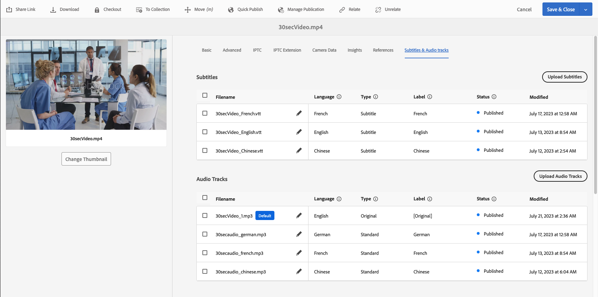
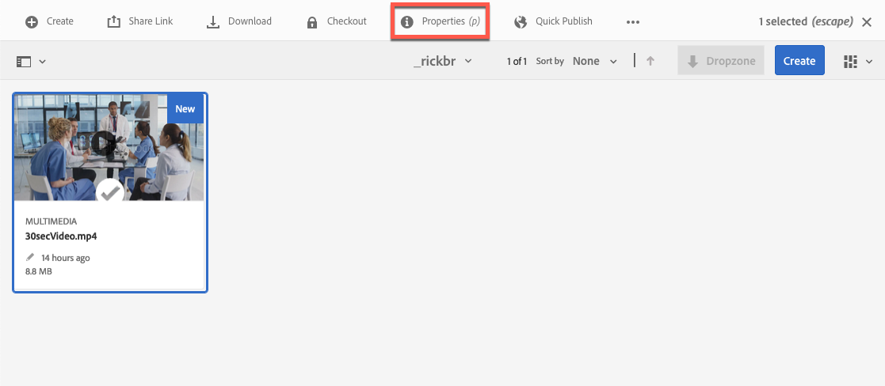
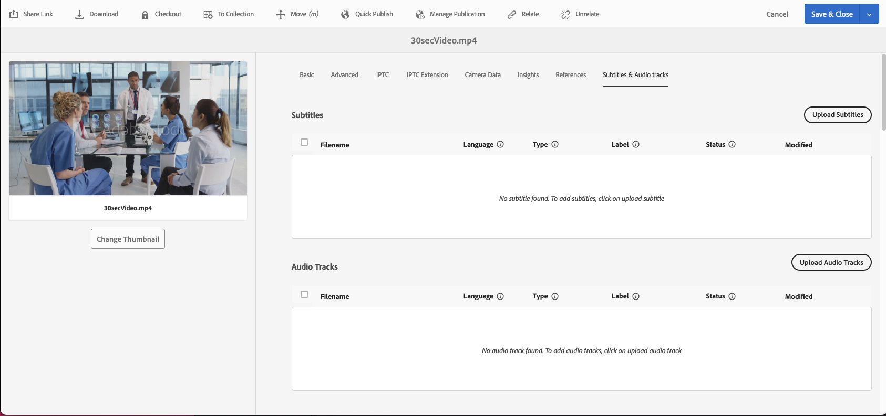
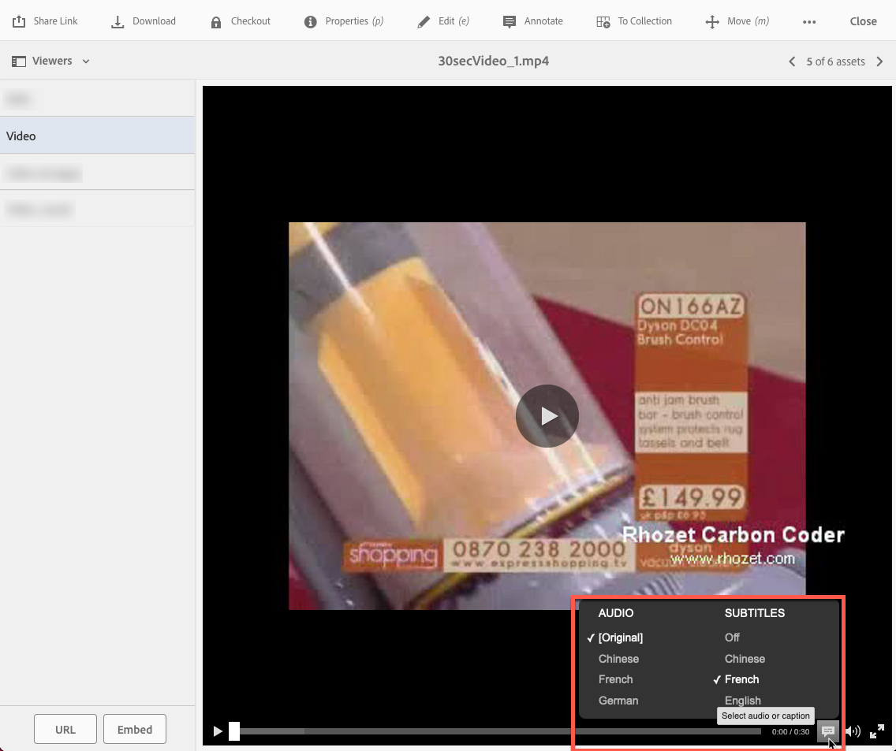

# Dynamic Media 中的視訊 {#video}

本節說明如何在Dynamic Media中使用視訊。

## 快速入門：影片 {#quick-start-videos}

下列逐步工作流程說明可協助您快速上手並執行Dynamic Media中的最適化視訊集。 每個步驟之後，都有主題標題的互動參照，您可以在其中找到更多資訊。

>[!IMPORTANT]
>
>在Dynamic Media中使用視訊之前，請確定Adobe Experience Manager管理員已在Dynamic Media - Scene7模式或Dynamic Media — 混合模式中啟用並設定Dynamic MediaCloud Service。
>
>* 另請參閱 [設定Dynamic MediaCloud Service](/help/assets/config-dms7.md#configuring-dynamic-media-cloud-services) 在設定Dynamic Media - Scene7模式和 [疑難排解Dynamic Media - Scene7模式](/help/assets/troubleshoot-dms7.md).
>
>* 另請參閱 [設定Dynamic MediaCloud Service](/help/assets/config-dynamic.md#configuring-dynamic-media-cloud-services) 設定Dynamic Media — 混合模式。
>
>Dynamic Media中目前已知的視訊播放問題 *僅適用於Experience Manager6.5.9.0*：
>
>* 如果發佈的視訊已更新，則必須再次發佈以反映傳送上的變更。
>

1. **上傳您的Dynamic Media影片** 方法是執行下列動作：

   * 建立您自己的視訊編碼設定檔。 或者，您只需使用預先定義的 _自我調整視訊編碼_ Dynamic Media隨附的設定檔。

      * [建立視訊編碼設定檔](/help/assets/video-profiles.md#creating-a-video-encoding-profile-for-adaptive-streaming).
      * 進一步瞭解 [視訊編碼最佳作法](#best-practices-for-encoding-videos).

   * 將視訊處理設定檔與您要上傳主要來源視訊的一或多個資料夾建立關聯。

      * [將視訊設定檔套用至資料夾](/help/assets/video-profiles.md#applying-a-video-profile-to-folders).
      * 進一步瞭解 [組織數位資產以使用處理設定檔的最佳實務](/help/assets/organize-assets.md).
      * 進一步瞭解 [組織數位資產](/help/assets/organize-assets.md).

   * 將您的主要來源視訊上傳至資料夾。 將視訊新增至資料夾時，會根據您指派至資料夾的視訊處理設定檔進行編碼。

      * Dynamic Media主要支援長度上限為30分鐘，最小解析度大於25 x 25的短片影片。
      * 您可以上傳每個大小最多15 GB的視訊檔案。
      * [上傳您的視訊](/help/assets/managing-video-assets.md#upload-and-preview-video-assets).
      * 進一步瞭解 [支援的輸入檔案格式](/help/assets/assets-formats.md#supported-multimedia-formats).

   * 監視方式 [視訊編碼正在進行](#monitoring-video-encoding-and-youtube-publishing-progress) 從資產或工作流程檢視。

1. **管理您的Dynamic Media影片** 藉由執行下列任一項作業：

   * 組織、瀏覽和搜尋視訊資產

      * [組織數位資產](/help/assets/organize-assets.md)
進一步瞭解 [組織數位資產以使用處理設定檔的最佳實務](organize-assets.md)

      * [搜尋視訊資產](search-assets.md#custompredicates) 或 [搜尋資產](/help/assets/search-assets.md)

   * 預覽和發佈視訊資產

      * 檢視視訊的來源視訊和編碼轉譯及其相關縮圖：
        [預覽影片](managing-video-assets.md#upload-and-preview-video-assets) 或 [預覽資產](previewing-assets.md)
        [檢視視訊轉譯](video-renditions.md)
        [管理視訊轉譯](manage-assets.md#managing-renditions)

      * [管理檢視器預設集](managing-viewer-presets.md)
      * [發佈資產](publishing-dynamicmedia-assets.md)

   * 使用視訊中繼資料

      * 檢視已編碼視訊轉譯的屬性，例如影格速率、音訊和視訊位元速率以及轉碼器：
        [檢視視訊轉譯屬性](video-renditions.md)

      * 編輯視訊的屬性，例如標題、說明和標籤、自訂中繼資料欄位：
        [編輯視訊屬性](manage-assets.md#editing-properties)

      * [管理數位資產的中繼資料](metadata.md)
      * [中繼資料結構描述](metadata-schemas.md)

   * 檢閱、核准和註釋視訊，並維持完整的版本控制

      * [為影片加上註釋](managing-video-assets.md#annotate-video-assets) 或 [為資產加上註釋](manage-assets.md#annotating)

      * [建立版本](manage-assets.md#asset-versioning)
      * [將工作流程套用至資產](assets-workflow.md) 或參閱 [在資產上開始工作流程](manage-assets.md#starting-a-workflow-on-an-asset)

      * [檢閱資料夾資產](bulk-approval.md)
      * [專案](../sites-authoring/projects.md)

1. **發佈您的Dynamic Media影片** 藉由執行下列任一項作業：

   * 如果您使用Adobe Experience Manager做為網站內容管理系統，可以直接新增影片至您的網頁。

      * [新增視訊至您的網頁](adding-dynamic-media-assets-to-pages.md).

   * 如果您使用協力廠商網站內容管理系統，您可以將影片連結或內嵌至網頁。

      * 使用URL整合視訊：
        [將 URL 連結至您的網頁應用程式](linking-urls-to-yourwebapplication.md).

      * 使用網頁上的內嵌程式碼整合影片：
        [將視訊檢視器內嵌在網頁上](embed-code.md).

   * [產生視訊報表](#viewing-video-reports).

   * [新增註解至視訊](#adding-captions-to-video).

## 在Dynamic Media中處理視訊 {#working-with-video-in-dynamic-media}

Dynamic Media中的視訊是端對端解決方案，可讓您輕鬆發佈高品質的最適化視訊，以便在多個熒幕(包括桌上型電腦、iOS、Android™、BlackBerry®和Windows行動裝置)上串流。 「最適化視訊集」會將使用不同位元速率和格式（例如400 kbps、800 kbps和1000 kbps）編碼的相同視訊版本分組。 桌上型電腦或行動裝置會偵測可用的頻寬。

例如，在iOS行動裝置上，它會偵測3G、4G或Wi-Fi等頻寬。 之後，它會從「自我調整視訊集」中的各種視訊位元速率中，自動選取正確的編碼視訊。 影片會串流至桌上型電腦、行動裝置或平板電腦。

此外，如果桌上型電腦或行動裝置上的網路狀況改變，視訊品質會自動動態切換。 此外，如果客戶在桌上型電腦上進入全熒幕模式，Adaptive Video Set會使用更好的解析度來回應，進而改善客戶的觀看體驗。 使用自我調整視訊集可以為客戶在多個熒幕和裝置上播放Dynamic Media視訊提供最佳播放方式。

視訊播放器用來決定要播放或播放期間要選取已編碼視訊的邏輯，是根據下列演演算法：

1. 視訊播放器會根據位元速率（最接近在播放器本身中為「初始位元速率」設定的值）載入初始視訊片段。
1. 視訊播放器會根據使用下列條件的頻寬速度變更進行切換：

   1. 播放器會挑選低於或等於預估頻寬的最高頻寬資料流。
   1. 播放器只考慮80%的可用頻寬。 不過，如果調高了，則比較保守的是只有70%，以避免高估並立即調回。

如需演演算法的詳細技術資訊，請參閱 [https://android.googlesource.com/platform/frameworks/av/+/master/media/libstagefright/httplive/LiveSession.cpp](https://android.googlesource.com/platform/frameworks/av/+/master/media/libstagefright/httplive/LiveSession.cpp)

對於管理單一視訊和自我調整視訊集，支援下列專案：

* 以多種支援的視訊格式和音訊格式上傳視訊，並將視訊編碼為MP4 H.264格式，以便跨多個熒幕播放。 您可以使用預先定義的自我調整視訊預設集、單一視訊編碼預設集，或自訂自己的編碼來控制視訊的品質和大小。

   * 產生最適化視訊集時，其中會包含MP4視訊。
   * **注意**：主要/來源視訊未新增至最適化視訊集。

* 所有HTML5視訊檢視器中的視訊字幕。
* 使用完整中繼資料支援來組織、瀏覽和搜尋視訊，以有效管理視訊資產。
* 將最適化視訊集傳送至網路、桌上型電腦和行動裝置，包括iPhone、iPad、Android™、BlackBerry®和Windows Phone。

各種iOS平台均支援最適化視訊串流。 另請參閱 [Dynamic Media檢視器參考指南](https://experienceleague.adobe.com/docs/dynamic-media-developer-resources/library/viewers-aem-assets-dmc/video/c-html5-video-reference.html#video).

Dynamic Media支援MP4 H.264視訊的行動視訊播放。 您可以在下列位置找到支援此視訊格式的BlackBerry®裝置： [BlackBerry®支援的視訊格式](https://support.blackberry.com/kb/articleDetail?ArticleNumber=000005482).

您可以在下列位置找到支援此視訊格式的Windows裝置： [Windows Phone 8支援的媒體轉碼器](https://learn.microsoft.com/en-us/windows/uwp/audio-video-camera/supported-codecs)

* 使用Dynamic Media視訊檢視器預設集播放視訊，包括下列專案：

   * 單一視訊檢視器。
   * 結合視訊和影像內容的混合媒體檢視器。

* 設定視訊播放器以符合您的品牌需求。
* 使用簡單的URL或內嵌程式碼將視訊整合至您的網站、行動網站或行動應用程式。

<!-- See [Dynamic video playback](https://s7d9.scene7.com/s7/uvideo.jsp?asset=GeoRetail/Mop_AVS&config=GeoRetail/Universal_Video1&stageSize=640,480) sample. -->

另請參閱 [Experience Manager Assets和Dynamic Media Classic的檢視器](https://experienceleague.adobe.com/docs/dynamic-media-developer-resources/library/viewers-aem-assets-dmc/c-html5-s7-aem-asset-viewers.html#viewers-aem-assets-dmc) 和 [僅適用於Experience Manager資產的檢視器](https://experienceleague.adobe.com/docs/dynamic-media-developer-resources/library/viewers-for-aem-assets-only/c-html5-aem-asset-viewers.html#viewers-for-aem-assets-only).

## 最佳實務：使用HTML5視訊檢視器 {#best-practice-using-the-html-video-viewer}

Dynamic Media HTML5視訊檢視器預設集是強大的視訊播放器。 您可以使用它們來避免許多與HTML5視訊播放相關的常見問題。 此外，行動裝置也會發生問題，例如缺乏最適化位元速率串流傳送，以及桌上型電腦瀏覽器觸及範圍有限。

在播放器的設計方面，您可以使用標準Web開發工具來設計視訊播放器的功能。 例如，您可以使用HTML5和CSS來設計按鈕、控制項和自訂海報影像背景，協助您以自訂外觀觸及客戶。

在檢視器的播放端，會自動偵測瀏覽器的視訊功能。 接著，影片會使用HLS （HTTP即時資料流）或DASH （透過HTTP的動態自我調整資料流） （也稱為自我調整位元速率資料流）提供視訊。 或者，如果這些傳送方法不存在，則改用HTML5 progressive。

將下列專案結合至單一播放器：

* 能夠使用HTML5和CSS設計播放元件
* 具有內嵌式播放
* 根據瀏覽器的功能使用最適化和漸進式串流

您可以將多媒體內容觸及的範圍延伸至桌上型電腦和行動使用者，並確保簡化的視訊體驗。

另請參閱 [關於HTML5檢視器](https://experienceleague.adobe.com/docs/dynamic-media-developer-resources/library/viewers-for-aem-assets-only/c-html5-aem-asset-viewers.html#viewers-for-aem-assets-only).

### 使用HTML5視訊檢視器在桌上型電腦和行動裝置上播放視訊 {#playback-of-video-on-desktop-computers-and-mobile-devices-using-the-html-video-viewer}

就桌上型電腦和行動最適化視訊串流而言，用於位元速率切換的視訊均以最適化視訊集中的所有MP4視訊為基礎。

使用DASH或HLS或漸進式視訊下載進行視訊播放。 在舊版Experience Manager （例如6.0、6.1和6.2）中，影片會透過HTTP進行串流處理。

在Experience Manager6.3及更新版本中，視訊現在會透過HTTPS （亦即DASH或HLS）進行串流，因為DM閘道服務URL也一律使用HTTPS。 此預設行為不會影響客戶。 也就是說，除非瀏覽器不支援，否則視訊串流一律會透過HTTPS進行。 （請參閱下表）。 因此，

* 如果您的HTTPS網站採用HTTPS視訊串流，則串流沒有問題。
* 如果您的HTTP網站具有HTTPS視訊串流，串流就不會有問題，而且網頁瀏覽器也不會出現混合內容問題。

DASH是國際標準，HLS是Apple標準。 兩者都用於自我調整視訊串流。 而且，這兩種技術都會根據網路頻寬容量自動調整播放。 它也能讓客戶「搜尋」視訊中的任何位置，而不需要等候視訊的其餘部分下載。

漸進式視訊的傳送方式，是將視訊下載並儲存在使用者的案頭系統或行動裝置上。

下表說明使用Dynamic Media Video Viewer在桌上型電腦和行動裝置上播放視訊的裝置、瀏覽器和方法。

<table>
 <tbody>
  <tr>
   <td><strong>裝置</strong></td>
   <td><strong>瀏覽器</strong></td>
   <td><strong>視訊播放模式</strong></td>
  </tr>
  <tr>
   <td>桌面</td>
   <td>Internet Explorer 9和10</td>
   <td>漸進式下載。</td>
  </tr>
  <tr>
   <td>桌面</td>
   <td>Internet Explorer 11+</td>
   <td>在Windows 8和Windows 10上 — 只要要求DASH*或HLS，就強制使用HTTPS。 已知限制：DASH*或HLS上的HTTP在此瀏覽器/作業系統組合中無法運作<br /> <br /> Windows 7上 — 漸進式下載。 使用標準邏輯來選取HTTP與HTTPS通訊協定。</td>
  </tr>
  <tr>
   <td>桌面</td>
   <td>Firefox 23-44</td>
   <td>漸進式下載。</td>
  </tr>
  <tr>
   <td>桌面</td>
   <td>Firefox 45或更新版本</td>
   <td>DASH*或HLS最適化位元速率串流。</td>
  </tr>
  <tr>
   <td>桌面</td>
   <td>鉻黃</td>
   <td>DASH*或HLS最適化位元速率串流。</td>
  </tr>
  <tr>
   <td>桌面</td>
   <td>Safari (Mac)</td>
   <td>HLS最適化位元速率串流。</td>
  </tr>
  <tr>
   <td>行動</td>
   <td>Chrome (Android™ 6或更舊版本)</td>
   <td>漸進式下載。</td>
  </tr>
  <tr>
   <td>行動</td>
   <td>Chrome (Android™ 7或更新版本)</td>
   <td>DASH*或HLS最適化位元速率串流。</td>
  </tr>
  <tr>
   <td>行動</td>
   <td>Android™ （預設瀏覽器）</td>
   <td>漸進式下載。</td>
  </tr>
  <tr>
   <td>行動</td>
   <td>Safari (iOS)</td>
   <td>HLS最適化位元速率串流。</td>
  </tr>
  <tr>
   <td>行動</td>
   <td>Chrome (iOS)</td>
   <td>HLS最適化位元速率串流。</td>
  </tr>
  <tr>
   <td>行動</td>
   <td>BlackBerry®</td>
   <td>DASH*或HLS最適化位元速率串流。/td&gt;
  </tr>
 </tbody>
</table>

>[!IMPORTANT]
>
>*若要在視訊中使用DASH，必須先由帳戶上的Adobe技術支援啟用。 另請參閱 [在您的Dynamic Media帳戶上啟用DASH](#enable-dash).

## Dynamic Media視訊解決方案的架構 {#architecture-of-dynamic-media-video-solution}

下圖顯示透過DMGateway (在Dynamic Media混合模式中)上傳及編碼，並可供公眾使用的視訊整體製作工作流程。


## 視訊的混合式發佈架構 {#hybrid-publishing-architecture-for-videos}


## 視訊編碼最佳作法 {#best-practices-for-encoding-videos}

此 **Dynamic Media編碼影片** 如果您已啟用Dynamic Media並設定視訊雲端服務，工作流程會對視訊進行編碼。 此工作流程會擷取工作流程處理歷程記錄和失敗資訊。如果您已啟用Dynamic Media並設定視訊雲端服務， **[!UICONTROL Dynamic Media編碼影片]** 上傳視訊時，工作流程會自動生效。 (如果您沒有使用Dynamic Media，請 **[!UICONTROL DAM更新資產]** 工作流程會生效。)

<!-- DEAD The following are best-practice tips for encoding source video files.

For advice about video encoding, see [Video Encoding Basics](https://www.adobe.com/go/learn_s7_encoding_en).

* [Streaming 101: The Basics — Codecs, Bandwidth, Data Rate, and Resolution](https://www.adobe.com/go/learn_s7_streaming101_en). -->

### 來源視訊檔案 {#source-video-files}

編碼視訊檔案時，請使用最高品質的來源視訊檔案。 避免使用先前編碼的視訊檔案，因為這些檔案已經過壓縮，進一步編碼會產生品質不佳的視訊。

* Dynamic Media主要支援長度上限為30分鐘，最小解析度大於25 x 25的短片影片。
* 您可以上傳每個大小最高達15 GB的主要來源視訊檔案。

下表說明編碼來源視訊檔案前，其建議的大小、外觀比例和最低位元速率等資訊：

| 大小 | 外觀比例 | 最小位元速率 |
|--- |--- |--- |
| 1024 X 768 | 4:3 | 大部分的視訊為4500 kbps。 |
| 1280 X 720 | 16:9 | 3000 - 6000 kbps （視視訊中的移動量而定）。 |
| 1920 X 1080 | 16:9 | 6000 - 8000 kbps （視視訊中的移動量而定）。 |

### 取得檔案的中繼資料 {#obtaining-a-file-s-metadata}

您可以使用視訊編輯工具檢視檔案的中繼資料，或使用專為取得中繼資料而設計的應用程式，來取得檔案的中繼資料。 以下是使用MediaInfo （協力廠商應用程式）來取得視訊檔案中繼資料的指示：

1. 前往 [MediaInfo下載](https://mediaarea.net/en/MediaInfo/Download).
1. 選取並下載GUI版本的安裝程式，然後依照安裝指示操作。
1. 安裝之後，請以滑鼠右鍵按一下視訊檔案（僅限Windows）並選取MediaInfo，或開啟MediaInfo並將視訊檔案拖曳到應用程式中。 您會看到與視訊檔案相關的所有中繼資料，包括其寬度、高度和fps。

### 外觀比例 {#aspect-ratio}

當您選擇或建立主要來源視訊檔案的視訊編碼預設集時，請確定預設集具有與主要來源視訊檔案相同的外觀比例。 外觀比例是視訊的寬度與高度的比例。

若要判斷視訊檔案的外觀比例，請取得檔案的中繼資料，並注意檔案的寬度和高度（請參閱上述取得檔案的中繼資料）。 然後使用此公式來決定外觀比例：

寬度/高度=外觀比例

下表說明公式結果如何轉換成常見的外觀比例選擇：

| 公式結果 | 外觀比例 |
|--- |--- |
| 1.33 | 4:3 |
| 0.75 | 3:4 |
| 1.78 | 16:9 |
| 0.56 | 9:16 |

例如，視訊的寬度為1440 x高度為1080，其外觀比例為1440/1080，即1.33。在這種情況下，您可以選擇外觀比例為4:3的視訊編碼預設集來編碼視訊檔案。

### 位元速率 {#bitrate}

Bitrate是經過編碼而構成視訊播放一秒的資料量。 位元速率是以每秒千位元(Kbps)來測量。

>[!NOTE]
>
>由於所有轉碼器都使用有失真壓縮，因此位元速率是視訊品質中最重要的因素。 使用有失真壓縮時，您壓縮視訊檔案的次數越多，品質就越會降低。 因此，其他所有特性相等（解析度、影格速率和轉碼器），位元速率越低，壓縮檔案的品質就越低。

選取位元速率編碼時，您可以選擇兩種型別：

* **[!UICONTROL 固定位元速率編碼]** (CBR) — 在CBR編碼期間，位元速率或每秒位元數在整個編碼過程中都會保持相同。 CBR編碼會在整個視訊中，將設定的資料速率儲存至您的設定。 此外，CBR編碼無法最佳化媒體檔案的品質，但會節省儲存空間。
如果您的視訊在整個視訊中包含類似的動作層級，請使用CBR。 CBR最常用於串流視訊內容。 另請參閱 [使用自訂新增的視訊編碼引數](/help/assets/video-profiles.md#using-custom-added-video-encoding-parameters).

* **[!UICONTROL 可變位元速率編碼]** (VBR) - VBR編碼會根據壓縮器所需的資料，將資料速率向下調整並調整至您設定的上限。 此功能表示在VBR編碼程式期間，媒體檔案的位元速率會根據媒體檔案位元速率需求動態增加或減少。
VBR需要更長的時間來編碼，但會產生最有利的結果；媒體檔案的品質優異。 VBR最常用於http漸進式傳送視訊內容。

何時使用VBR或CRB？
在選取VBR與CBR時，幾乎總是建議您將VBR用於媒體檔案。 VBR以具競爭力的位元速率提供更高品質的檔案。 使用VBR時，請務必使用兩階段編碼，並將最大位元速率設定為目標視訊位元速率的1.5倍。

選擇視訊編碼預設集時，請記住目標使用者的連線速度。 選擇資料速率為該速度80%的預設集。 例如，如果目標使用者的連線速度是1000 Kbps，則最佳預設集是視訊資料速率為800 Kbps的預設集。

此表格說明一般連線速度的資料速率。

| 速度(Kbps) | 連線型別 |
|--- |--- |
| 256 | 撥號連線。 |
| 800 | 一般行動連線。 針對此連線，針對3G體驗將資料速率目標定在400到最高800之間。 |
| 2000 | 典型的寬頻案頭連線。 針對此連線，將資料速率目標設定在800至2000 Kbps範圍內，大部分目標平均為1200至1500 Kbps。 |
| 5000 | 典型的高寬頻連線。 不建議在此上限範圍內進行編碼，因為大多數消費者無法使用此速度的視訊傳送。 |

### 解析度 {#resolution}

**解析度** 說明視訊檔案的高度和寬度（畫素）。 大部分的來源視訊都是以高解析度儲存（例如1920 x 1080）。 為了串流目的，來源視訊會壓縮成較小的解析度（640 x 480或更小）。

解析度和資料速率是決定視訊品質的兩個整合因素。 若要維持相同的視訊品質，視訊檔案中的畫素數越高（解析度越高），資料速率就必須越高。 例如，假設在320 x 240解析度和640 x 480解析度視訊檔案中，每個影格的畫素數：

| 解析度 | 每個影格的畫素 |
|--- |--- |
| 320 x 240 | 76,800 |
| 640 x 480 | 307,200 |

640 x 480檔案的每個影格畫素會增加4倍。 若要讓這兩個範例解析度達到相同的資料速率，您可以對640 x 480檔案套用四倍的壓縮，這會降低視訊的品質。 因此，250 Kbps的視訊資料速率可以以320 x 240的解析度提供高品質的觀賞效果，但無法以640 x 480的解析度提供。

一般而言，您使用的資料速率越高，視訊外觀就越好，而且您使用的解析度越高，您必須維持的檢視品質資料速率就越高（相較於解析度較低的情形）。

由於解析度和資料速率是相互關聯的，在編碼視訊時，您有兩個選項：

* 選擇資料速率，然後以最高解析度編碼，以符合您選擇的資料速率。
* 選擇解析度，然後以您選擇的解析度進行必要的資料速率編碼，以取得高品質的視訊。

當您選擇（或建立）主要來源視訊檔案的視訊編碼預設集時，請使用此表格來鎖定正確的解析度：

| 解析度 | 高度 (像素) | 熒幕大小 |
|--- |--- |--- |
| 240p | 240 | 超小熒幕 |
| 300p | 300 | 通常適用於行動裝置的小熒幕 |
| 360p | 360 | 小熒幕 |
| 480p | 480 | 中熒幕 |
| 720p | 720 | 大熒幕 |
| 1080p | 1080 | 高解析度大熒幕 |

### Fps （每秒影格數） {#fps-frames-per-second}

在美國和日本，大部分的視訊是以每秒29.97幀(fps)的速率拍攝；在歐洲，大部分的視訊是以每秒25幀(fps)的速率拍攝。 電影的拍攝速度為24 fps。

選擇符合主要來源視訊檔案的fps速率的視訊編碼預設集。 例如，如果您的主要來源視訊是25 fps，請選擇具有25 fps的編碼預設集。 依預設，所有自訂編碼都會使用主要來源視訊檔案的fps。 因此，當您建立視訊編碼預設集時，不需要明確指定fps設定。

### 視訊編碼維度 {#video-encoding-dimensions}

為獲得最佳結果，請選取編碼維度，好讓來源視訊是所有已編碼視訊的整數倍。

若要計算此比率，請將來源寬度除以編碼寬度來得出寬度比率。 接著，將來源高度除以編碼後的高度，得出高度比率。

如果產生的比例是整數，表示影片會以最佳方式縮放。 如果產生的比率不是整數，則會影響視訊品質，在顯示區留下多餘的畫素不自然感。 當視訊中含有文字時，此效果最為明顯。

例如，假設您的來源視訊是1920 x 1080。 在下表中，三個已編碼的視訊提供要使用的最佳編碼設定。

| 視訊型別 | 寬x高 | 寬度比例 | 高度比例 |
|--- |--- |--- |--- |
| 來源 | 1920x1080 | 1 | 1 |
| 已編碼 | 960 x 540 | 2 | 2 |
| 已編碼 | 640 x 360 | 3 | 3 |
| 已編碼 | 480 x 270 | 4 | 4 |

### 已編碼的視訊檔案格式 {#encoded-video-file-format}

Dynamic Media建議使用MP4 H.264視訊編碼預設集。 由於MP4檔案使用H.264視訊轉碼器，因此可提供高品質的視訊，但檔案大小必須經過壓縮。

### 在您的Dynamic Media帳戶上啟用DASH、多字幕和多音訊曲目支援 {#enable-dash}

**關於在您的帳戶上啟用DASH**
DASH (Digital Adaptive Streaming over HTTP)是視訊串流的國際標準，被廣泛採用於不同的視訊檢視器中。 當您的帳戶啟用DASH時，您可以選擇使用DASH或HLS進行最適化視訊串流。 或者，您也可以選擇同時使用這兩種方法，在播放器之間自動切換 **[!UICONTROL 自動]** 即會選取作為檢視器預設集中的播放型別。

在您的帳戶上啟用DASH的一些主要優點包括：

* 封裝DASH串流視訊，以進行最適化位元速率串流。 此方法可提高傳遞效率。 最適化串流可確保為客戶提供最佳檢視體驗。
* 使用Dynamic Media播放器最佳化的瀏覽器串流可在HLS和DASH串流之間切換，以確保最佳服務品質。 使用Safari瀏覽器時，視訊播放器會自動切換至HLS。
* 您可以編輯視訊檢視器預設集，以設定您偏好的串流方法（HLS或DASH）。
* 最佳化的視訊編碼可確保啟用DASH功能時不會使用額外的儲存空間。 會針對HLS和DASH建立單一視訊編碼集，以最佳化視訊儲存成本。
* 協助讓客戶更容易存取視訊傳送。
* 也透過API取得串流URL。

在您的帳戶上啟用DASH需要兩個步驟：

* 將Dynamic Media設定為使用DASH，方便您自行操作。
* 將Experience Manager 6.5設定為使用DASH，這是透過您建立和提交的Adobe客戶支援案例完成的。

**關於在您的帳戶上啟用多重字幕與多重音訊曲目支援**

在您建立Adobe支援案例以在帳戶上啟用DASH的同時，自動啟用多字幕和多音訊曲目支援也會讓您受益。 啟用後，您上傳的所有後續視訊都會以新的後端架構處理，包括支援在視訊中新增多字幕和多音訊曲目。

>[!IMPORTANT]
>
>您上傳的任何影片 *先前* 若要在您的Dynamic Media帳戶上啟用多重字幕與多重音訊曲目支援， [必須重新處理](/help/assets/processing-profiles.md##reprocessing-assets). 這個視訊重新處理步驟是必要的，因此使用者可以使用多字幕和多音訊曲目功能。 重新處理之後，視訊URL仍可繼續如常運作和播放。

**若要在您的Dynamic Media帳戶上啟用DASH、多字幕和多音訊曲目支援：**

<!-- 1. **Configure Dynamic Media for DASH** - In Dynamic Media on Experience Manager 6.5, navigate to [https://localhost:4502/system/console/configMgr](https://localhost:4502/system/console/configMgr).

1. Search for **AEM Assets Dynamic Media Video Advanced Streaming** feature flag.
1. To enable (turn on) DASH, select the checkbox. -->
1. 開始於 **為DASH設定Dynamic Media**  — 從Experience Manager導覽至 **[!UICONTROL 工具]** > **[!UICONTROL 作業]** > **[!UICONTROL 網頁主控台]**.

1. 從 **[!UICONTROL Adobe Experience Manager Web主控台設定]** 頁面，捲動至名稱 *AEM Assets Dynamic Media視訊進階資料流功能標幟*.

1. 在名稱左側，選取核取方塊以啟用（開啟） DASH。

1. 選取&#x200B;**[!UICONTROL 儲存]**。

1. 現在 [使用Admin Console開始建立新的支援案例](https://helpx.adobe.com/tw/enterprise/using/support-for-experience-cloud.html).
1. 若要建立支援案例，請遵循指示，同時確保您提供下列資訊：

   * 主要連絡人姓名、電子郵件、電話。
   * 您的Dynamic Media帳戶名稱。
   * 指定您想在Dynamic Media帳戶上，於Experience Manager6.5啟用DASH、多字幕和多音訊曲目支援。

1. 「Adobe客戶支援」會根據提交請求的順序，將您新增至「客戶等候清單」。
1. 當Adobe準備好處理您的請求時，客戶支援聯絡您以協調並設定啟用的目標日期。
1. 客戶支援會在完成後通知您。
1. 現在您可以執行下列任一項作業：

   * 建立您的 [視訊檢視器預設集](/help/assets/managing-viewer-presets.md#creating-a-new-viewer-preset) 一如既往。
   * [新增多字幕和多音軌](#add-msma) 到您的視訊。

## 檢視視訊報表 {#viewing-video-reports}

>[!NOTE]
>
>視訊報表僅適用於執行Dynamic Media — 混合模式時。

視訊報表會顯示指定時間內的數個彙總量度，協助您監控 *已發佈* 個別和彙總影片如預期般執行。 系統會針對您整個網站的所有已發佈影片，彙總下列排名在前的量度資料：

* 視訊開始
* 完成率
* 視訊平均逗留時間
* 影片花費的總時間
* 每次造訪的視訊數

全部的表格 *已發佈* 也會列出視訊，以便您根據視訊開始總次數，追蹤網站上檢視次數最多的視訊。

點選清單中的影片名稱時，會以折線圖的形式顯示影片的「對象保留率（流失）」報表。 此圖表顯示視訊播放期間任何指定時間的檢視次數。 當您播放視訊時，垂直列會與播放器中的時間指示器同步追蹤。 折線圖資料中的下降會指出您的對象從哪裡開始不感興趣。

如果影片是在Adobe Experience Manager Dynamic Media之外編碼，則無法使用表格中的對象保留率（流失）圖表和播放百分比資料。

另請參閱 [設定Dynamic MediaCloud Service](/help/assets/config-dynamic.md).

>[!NOTE]
>
>追蹤和報表資料僅以Dynamic Media自己的視訊播放器及相關聯的視訊播放器預設集的使用為基礎。 因此，您無法追蹤和報告透過其他視訊播放器播放的視訊。

根據預設，您首次輸入「視訊報表」時，報表會顯示從當月第一個日期開始，到當月日期結束的視訊資料。 不過，您可以指定自己的日期範圍來覆寫預設日期範圍。 下次輸入視訊報表時，將會使用您指定的日期範圍。

為了讓視訊報表正常運作，設定Dynamic MediaCloud Service時會自動建立報表套裝ID。 同時，報表套裝ID會推送至發佈伺服器，以便您在預覽資產時可用於複製URL功能。 不過，若要使用此功能，發佈伺服器必須已設定。 如果發佈伺服器未設定，您仍可發佈以檢視視訊報表。 不過，您必須返回「Dynamic Media雲端設定」並點選 **[!UICONTROL 確定]**.

**若要檢視視訊報表：**

1. 在Experience Manager的左上角，點選Experience Manager標誌，然後在左側導軌中，點選 **[!UICONTROL 工具]** （槌子圖示） > **[!UICONTROL 資產]** > **[!UICONTROL 視訊報表]**.
1. 在「視訊報表」頁面上，執行下列任一項作業：

   * 在右上角附近，點選 **重新整理視訊報表** 圖示。
只有在報表的結束日期為當天時，才使用重新整理。 這麼做可確保您看到自上次執行報表以來發生的視訊追蹤。

   * 在右上角附近，點選 **日期選取器** 圖示。
指定您要視訊資料的開始和結束日期範圍，然後點選 **[!UICONTROL 執行報告]**.

   「排名在前的量度」群組方塊可識別所有量度的各種彙總測量 *已發佈* 您網站上的影片。

1. 在列出熱門發佈影片的表格中，點選影片名稱以播放影片，並參閱影片的「對象保留率（流失）」報表。

### 根據您使用Dynamic Media HTML5檢視器SDK建立的視訊檢視器檢視視訊報表 {#viewing-video-reports-based-on-a-video-viewer-that-you-created-using-the-scene-hmtl-viewer-sdk}

如果您使用Dynamic Media提供的現成視訊檢視器，或您根據現成視訊檢視器建立自訂檢視器預設集，則檢視視訊報表不需要其他步驟。 不過，如果您已根據HTML5 Viewer SDK API建立自己的視訊檢視器，則請使用下列步驟來確保視訊檢視器會傳送追蹤事件至Dynamic Media視訊報表。

使用 [Adobe Dynamic Media檢視器參考指南](https://experienceleague.adobe.com/docs/dynamic-media-developer-resources.html) 和 [HTML5檢視器SDK API](https://s7d1.scene7.com/s7sdk/3.10/docs/jsdoc/index.html) 以建立自己的視訊檢視器。

**若要根據您使用Dynamic Media HTML5檢視器SDK建立的視訊檢視器檢視視訊報表：**

1. 導覽至任何已發佈的視訊資產。
1. 在資產頁面的左上角附近，從下拉式清單中選取「檢 **[!UICONTROL 視器]**」。
1. 選取任何視訊檢視器預設集，並複製內嵌程式碼。
1. 在內嵌程式碼中，找到包含下列專案的行：

   `videoViewer.setParam("config2", "<value>");`

   此 `config2` 引數會在HTML5檢視器中啟用追蹤。 此預設集也是公司專屬的預設集，其中包含視訊報表的設定資訊，以及用於客戶專屬的Adobe Analytics設定。

   config2參數的正確值可在 **[!UICONTROL Embed Code]**  (內嵌代碼) 和copy **[!UICONTROL URL (複製UICONTROL URL) 函式]** 中找到。在複製 **[!UICONTROL URL命令的URL中]** ，要尋找的參數為 `&config2=<value>` 。值幾乎總是 `companypreset`會出現，但在某些情況下 `companypreset-1`, `companypreset-2`它也可以是、等等。

1. 在您的自訂視訊檢視器程式碼中，執行下列操作，將AppMeasurementBridge .jsp新增至檢視器頁面：

   * 首先，判斷您是否需要 `&preset` 引數。

     如果 `config2` 引數為 `companypreset`，您有 *非* 需要 `&preset=parameter`.

     如果 `config2` 若為其他任何專案，請將preset引數設定為與 `config2` 引數。 例如，如果 `config2=companypreset-2`，新增 `&param2=companypreset-2` 至AppMeasurementBridge.jsp URL。

   * 接著，新增AppMeasurementBridge.jsp指令碼：

     `<script language="javascript" type="text/javascript" src="https://s7d1.scene7.com/s7viewers/AppMeasurementBridge.jsp?company=robindallas&preset=companypreset-2"></script>`

1. 執行下列動作以建立TrackingManager元件：

   * 在您呼叫之後 `s7sdk.Util.init();`，新增下列內容以建立TrackingManager例項來追蹤事件：

     `var trackingManager = new s7sdk.TrackingManager();`

   * 執行下列操作將元件連結至TrackingManager：

     在 `s7sdk.Event.SDK_READY` 事件處理常式，將您要追蹤的元件附加至TrackingManager。

     例如，如果元件為 `videoPlayer`，新增

     `trackingManager.attach(videoPlayer);`

     將元件附加至trackingManager。 若要追蹤頁面上的多個檢視器，請使用多個追蹤管理員元件。

   * 新增下列內容以建立AppMeasurementBridge物件：

     ```
     var appMeasurementBridge = new AppMeasurementBridge(); appMeasurementBridge.setVideoPlayer(videoPlayer);
     ```

   * 新增下列內容以新增追蹤函式：

     ```
     trackingManager.setCallback(appMeasurementBridge.track, 
      appMeasurementBridge);
     ```

   appMeasurementBridge物件有內建的追蹤函式。 不過，您可以自行提供支援，以支援多個追蹤系統或其他功能。

<!--    For more information, see *Using the TrackingManager Component* in the *Scene7 HTML5 Viewer SDK User Guide* available for download from [Adobe Developer Connection](https://help.adobe.com/en_US/scene7/using/WSef8d5860223939e2-43dedf7012b792fc1d5-8000.html). -->


## 關於Dynamic Media中視訊的多字幕與多音訊曲目支援{#about-msma}

透過Dynamic Media的多重字幕與多重音訊曲目功能，您可以輕鬆將多重字幕與音訊曲目新增至主要視訊。 此功能表示您的視訊可在全球對象中存取。 您可以透過多種語言，為全球觀眾自訂單一已發佈的主要影片，並遵守不同地理區域的協助工具准則。 作者也可以從使用者介面的單一標籤管理字幕和音軌。



在主要影片中新增多字幕和多音訊曲目時應考慮的一些使用案例包括：

| 類型 | 使用案例 |
|--- |--- |
| **字幕** | 多語言支援 |
|  | 協助工具的描述性文字 |
| **音訊曲目** | 多語言支援 |
|  | 立體聲與多聲道（環繞音效） |
|  | 註解追蹤 |
|  | 描述性音訊 |

全部 [Dynamic Media支援的視訊格式](/help/assets/assets-formats.md) 和所有Dynamic Media視訊檢視器(Dynamic Media除外) *Video_360* 檢視器 — 支援與多字幕和多音軌搭配使用。

您的Dynamic Media帳戶可使用多字幕和多音訊追蹤功能，其方式為必須由Adobe客戶支援啟用（開啟）的功能切換。

### 在視訊中新增多字幕與多音效曲目 {#add-msma}

在您將多字幕和多音訊曲目新增到視訊之前，請確定您已經具備下列內容：

* Dynamic Media是在AEM環境中設定的。
* A [Dynamic Media視訊設定檔已套用至您擷取視訊的資料夾](/help/assets/video-profiles.md#applying-a-video-profile-to-folders).
* [已在您的Dynamic Media帳戶中啟用多字幕和多音訊曲目](#enable-dash).

WebVTT和Adobe VTT格式支援新增的字幕和註解。 此外，新增的音訊軌跡檔案也支援MP3格式。

>[!IMPORTANT]
>
>您上傳的任何影片 *先前* 若要在您的Dynamic Media帳戶上啟用多重字幕與多重音訊曲目支援， [必須重新處理](/help/assets/processing-profiles.md##reprocessing-assets). 這個視訊重新處理步驟是必要的，因此使用者可以使用多字幕和多音訊曲目功能。 重新處理之後，視訊URL仍可繼續如常運作和播放。

**若要在視訊中加入多字幕和多音軌：**

1. [將主要視訊上傳至資料夾](/help/assets/managing-video-assets.md#upload-and-preview-video-assets) 已為其指派視訊設定檔。
1. 導覽至您要新增多字幕與多音訊曲目的上傳視訊資產。
1. 在資產選取模式中，從「清單檢視」或「卡片檢視」中選取視訊資產。
1. 在工具列上，選取「屬性」圖示（內有「i」的圓形）。
   *在卡片檢視中選取的視訊資產。*
1. 在視訊的「屬性」頁面上，選取 **[!UICONTROL 字幕與音軌]** 標籤。

   >[!TIP]
   >如果您沒有看到 **[!UICONTROL 字幕與音軌]** 索引標籤，表示所選視訊所在的資料夾未獲指派視訊設定檔。 [將視訊設定檔套用至資料夾](/help/assets/video-profiles.md#applying-video-profiles-to-specific-folders)，然後返回這些步驟。

   *影片屬性頁面上的字幕和音訊曲目索引標籤。 請注意，沒有原始音軌與視訊相關聯，如空白的「音軌」清單方塊所示。 當視訊處理完成時，畫面會顯示追蹤。*

1. （可選）若要新增一或多個字幕（或標題）檔案至視訊，請執行下列動作：
   * 選取 **[!UICONTROL 上傳字幕]**.
   * 導覽至一或多個.vtt （視訊文字軌）檔案，並加以開啟。
   * 若要在媒體播放器上顯示字幕，請 *必須* 新增必要的詳細資訊（中繼資料）關於 *每個* 您上傳的字幕檔案。 選取字幕檔案名稱右側的鉛筆圖示。 在 **編輯子標題** 對話方塊中，輸入檔案的下列必要詳細資訊，然後選取 **[!UICONTROL 儲存]**. 對您上傳的每個字幕檔案重複此程式：

     | 子標題中繼資料 | 說明 |
     |--- |--- |
     | 檔案名稱 | 預設檔案名稱衍生自原始檔案名稱。 檔案名稱只能在上傳時變更，以後無法變更。 檔案名稱字元需求與AEM Assets相同。<br>其他字幕檔案和音訊曲目檔案不能使用相同的檔案名稱。 |
     | 語言 | 選取副標題的語言。 |
     | 類型 | 選取您正在使用的副標題型別。<br>**子標題**  — 與翻譯或轉譯對話方塊的視訊一起顯示的字幕文字。<br>**註解**  — 註解文字也包含背景噪音、演講者辨別與其他相關資訊，以及對話的翻譯或轉錄，讓耳聾或聽力缺佳的人更容易存取內容。 |
     | 標籤 | 在中針對副標題名稱顯示的文字 **[!UICONTROL 選取音訊或標題]** 媒體播放器中的快顯清單。 客戶看到的標籤與副標題或標題追蹤相對應。 例如，`English (CC)`。 |

     如有需要，您可以稍後變更或編輯子標題中繼資料。 發佈影片時，這些詳細資料會反映在已發佈影片中的公開URL上。

1. （選用）若要將一或多個音軌新增至視訊，請執行下列動作：
   * 選取 **[!UICONTROL 上傳音軌]**.
   * 導覽至一或多個.mp3檔案並加以選取，然後開啟。
   * 若要讓音訊曲目顯示在 **[!UICONTROL 選取音訊或標題]** 媒體播放器上的快顯清單 *必須* 新增以下專案的必要詳細資料： *每個* 您新增的音訊曲目檔案。 選取音軌檔案名稱右側的鉛筆圖示。 在 **編輯音訊曲目** 對話方塊中，輸入下列必要的詳細資訊，然後選取 **[!UICONTROL 儲存]**. 為您上傳的每個音訊曲目檔案重複此程式。

     | 音訊曲目中繼資料 | 說明 |
     |--- |--- |
     | 檔案名稱 | 預設檔案名稱衍生自原始檔案名稱。 檔案名稱只能在上傳時變更，以後無法變更。 檔案名稱字元需求與AEM Assets相同。<br>其他音訊曲目檔案或字幕檔案不能使用相同的檔案名稱。 |
     | 語言 | 選取音訊曲目的語言。 |
     | 類型 | 選取您正在使用的音軌型別。<br>**原始**  — 原本附加至視訊的音軌，表示為 `[Original]` 在標籤中帶有 `English` 預設選取的語言。 當 **[!UICONTROL 標籤]** 和 **[!UICONTROL 語言]** 可以在以下位置變更： **[!UICONTROL 編輯音訊曲目]** 對話方塊中，如果重新處理主要視訊，則預設為原始值。<br>**標準**  — 非原始語言的附加音軌。<br>**音訊說明**  — 音訊曲軌也包含視訊中非語言動作和手勢的描述性旁白，讓視障人士更容易存取內容。 |
     | 標籤 | 在中顯示為音軌名稱的文字 **[!UICONTROL 選取音訊或標題]** 媒體播放器中的快顯清單。 客戶看到的標籤與音訊軌相對應。 例如 `English [Original]`。附加至視訊的音訊標籤已設為 `[Original|` 依預設。 |

     如有需要，您可以稍後變更或編輯此音訊曲目中繼資料。 發佈影片時，這些詳細資料會反映在已發佈影片中的公開URL上。

1. 在頁面的右上角，從 **[!UICONTROL 儲存並關閉]** 下拉式清單，選取 **[!UICONTROL 儲存]**. 檔案已上傳，中繼資料處理開始，如所示 **狀態** 欄中指定給訪客。

   >[!NOTE]
   >
   >根據您執行個體的快取設定，中繼資料處理可能需要幾分鐘時間，才會反映在預覽和已發佈的URL中。

1. （選擇性）若您選取 **[!UICONTROL 儲存並關閉]** ，而不是選取 **[!UICONTROL 儲存]**，您仍可檢視已上傳檔案的處理狀態。 另請參閱 [檢視已上傳字幕和音訊曲目檔案的生命週期狀態](#lifecycle-status-video).
1. （選用）發佈前先預覽視訊，確保字幕和音訊如預期般運作。 另請參閱 [預覽具有多個字幕和音訊曲目的視訊](#preview-video-audio-subtitle)
1. 發佈視訊。 另請參閱 [發佈資產](publishing-dynamicmedia-assets.md).

#### 關於將字幕和音訊曲目檔案新增至已發佈的視訊

當您上傳其他字幕檔案或音訊曲目檔案至已發佈的視訊時，這表示這些檔案將會 `Processed` 狀態（在上傳後）。 此時，您可以在Dynamic Media中預覽視訊，以檢視或聆聽新上傳的檔案。

不過，在預覽後，您必須 *發佈* 再次播放視訊，以便發佈新加入的字幕或音訊曲目檔案。 發佈後，字幕或音訊會隨公用Dynamic Media URL提供。

>[!NOTE]
>
>根據您執行個體的快取設定，中繼資料更新可能需要幾分鐘的時間才會反映在預覽和已發佈的URL中。

在您已設定Dynamic Media立即發佈的案例中，上傳其他字幕或音訊檔案會立即觸發上傳字幕或音訊檔案後視訊的發佈。

>[!CAUTION]
>
>將字幕檔案或音訊檔案上傳至已發佈的視訊時，如果您選擇上傳或上傳字幕檔案， [*重新處理*](/help/assets/processing-profiles.md##reprocessing-assets) 影片。 只有視訊的原始音訊會維持不變。 在這種情況下，您必須再次將字幕檔案和音訊曲目檔案重新上傳到視訊。

#### 在具有現有URL和註解修飾元的視訊中新增多個註解

Dynamic Media支援透過URL修飾元在視訊中新增單一標題(請參閱 [註解](https://experienceleague.adobe.com/docs/dynamic-media-developer-resources/library/viewers-aem-assets-dmc/video/command-reference-url-video/r-html5-video-viewer-url-caption.html?lang=en))。

<!-- IS THE CORRECT LINK THE ONE ABOVE OR IS IT THE LINK BELOW???? -->

另請參閱 [提供靜態（非影像）內容](https://experienceleague.adobe.com/docs/dynamic-media-developer-resources/image-serving-api/image-serving-api/c-serving-static-nonimage-contents.html#image-serving-api) 在 *Dynamic Media影像提供與轉譯API說明* 以取得在URL中使用JSON函式的詳細資訊。

多個註解變更的優先順序高於透過已發佈視訊URL修飾元新增的註解。

**若要將多個註解新增至具有現有URL且使用註解修飾元的視訊：**

1. 上傳已新增為視訊修飾元的註解檔案，以便您明確管理檔案。
1. 視需要上傳任何其他字幕/註解檔案。
1. 照常發佈視訊。
具有註解修飾元的現有URL現在可以載入多個註解。

### 檢視已上傳字幕和音訊曲目檔案的生命週期狀態{#lifecycle-status-video}

您可以觀察上傳至主要視訊的任何字幕或音訊曲目檔案的生命週期狀態，從 **字幕與音軌** 標籤之 **屬性**.

**若要檢視視訊的生命週期狀態：**

1. 導覽至您要檢視其生命週期狀態的視訊資產。
1. 在資產選取模式中，從「清單檢視」或「卡片檢視」中選取視訊資產。
1. 在工具列上，選取「屬性」圖示（內有「i」的圓形）。
1. 在「屬性」頁面上，選取 **[!UICONTROL 字幕與音軌]** 標籤。 在「狀態」欄中，記下每個字幕或音訊檔案的狀態。

| 字幕或音軌狀態 | 說明 |
| --- | --- |
| 處理中 | 處理作業仍在進行中。 |
| 已處理 | 處理完成。 |
| 已發佈 | 已發佈至 Dynamic Media. |
| 已失敗 | 處理未完成。 請刪除檔案，然後嘗試重新上傳。 |
| 已取消發佈 | 正在處理中，但尚未發佈至Dynamic Media。 |

*每個已上傳子標題和音訊曲目檔案的生命週期狀態。*

### 為具有多個音軌的視訊設定預設音訊

依預設，視訊的原始音訊會設定為要播放的預設音訊。

不過，任何上傳的音訊曲目檔案都可以設定為預設音訊，以便在視訊載入檢視器後播放。 在「屬性」使用者介面中的 **字幕與音軌** 標籤， `Default` 標籤會套用至音訊軌跡檔案的右側，以播放視訊。

>[!NOTE]
>
>預設音訊的播放也取決於下列瀏覽器中的設定：
>
>* Chrome — 播放視訊中設定的預設音訊。
* Safari — 如果在Safari中設定了預設語言，則會以設定的預設語言播放音訊（如果視訊資訊清單中有的話）。 否則，會播放設定為視訊屬性一部分的預設音訊。

**若要為具有多個音軌的視訊設定預設音訊：**

1. 導覽至您要設定其預設音訊曲目的視訊資產。
1. 在資產選取模式中，從「清單檢視」或「卡片檢視」中選取視訊資產。
1. 在工具列上，選取「屬性」圖示（內有「i」的圓形）。
1. 在「屬性」頁面上，選取 **[!UICONTROL 字幕與音軌]** 標籤。
1. 在 **音訊曲目** 標題中，選取您要設為視訊預設的音訊曲目檔案。
1. 選取 **[!UICONTROL 設定為預設]**.
在 **設定為預設** 對話方塊，選取 **[!UICONTROL 取代]**.

   *設定視訊的預設音軌。*

1. 在右上角，選取 **[!UICONTROL 儲存並關閉]**.
1. 發佈視訊。 另請參閱 [發佈資產](publishing-dynamicmedia-assets.md).

### 預覽具有多個字幕和音訊曲目的視訊{#preview-video-audio-subtitle}

將字幕檔案和音訊曲目檔案上傳到視訊並進行處理後，您可以使用Dynamic Media視訊檢視器來預覽所有不同的曲目。 這麼做可協助您檢視客戶所看到的視訊外觀和聲音，並確保影片如預期般運作。

當您對影片感到滿意時，可以 [發佈](publishing-dynamicmedia-assets.md) 使用下列任一方法。

另請參閱 [將視訊或影像檢視器內嵌在網頁上](/help/assets/embed-code.md).
另請參閱 [將URL連結至您的網頁應用程式](/help/assets/linking-urls-to-yourwebapplication.md). 如果您的互動式內容有具有相對URL的連結，尤其是指向Experience Manager Sites頁面的連結，則無法採用URL型連結方法。
另請參閱 [將Dynamic Media資產新增至頁面](/help/assets/adding-dynamic-media-assets-to-pages.md).

>[!NOTE]
>
預設Experience Manager預覽索引標籤不會顯示多個字幕和音軌。 原因是這些曲目與Dynamic Media相關聯，而且只能使用Dynamic Media檢視器預覽來檢視。

**若要預覽具有多個字幕和音訊曲目的視訊：**

1. 在 **[!UICONTROL 資產]**，導覽至您新增了多個字幕和音軌的現有影片。
1. 按一下視訊資產，以便您可以在預覽模式中將其開啟。
1. 在預覽頁面，在頁面的左上角附近，選取下拉式清單，然後選取 **[!UICONTROL 檢視者]**.

   

1. 從「檢視器」清單中選取 **[!UICONTROL 視訊]**.

   

1. 在右下角附近，在音量圖示的左側，選取語音泡泡圖示，然後選取您想要聽到、看到、或兩者皆要聽到的音訊或字幕。 如有需要，您可以在「字幕」底下選取 **[!UICONTROL 關閉]** 不顯示任何字幕或註解。

   *模擬使用者選取音訊和子標題以進行視訊播放。*

1. 選取視訊的 **[!UICONTROL 播放]** 按鈕以開始播放。
請注意 **[!UICONTROL URL]** 和 **[!UICONTROL 內嵌]** 按鈕。 使用這些按鈕可以 [將影片的URL連結至您的網頁應用程式](/help/assets/linking-urls-to-yourwebapplication.md) 或至 [將影片內嵌在網頁上](/help/assets/embed-code.md)，依序輸入。
1. 在預覽頁面的右上角附近，選取 **[!UICONTROL 關閉]**.

### 從視訊中刪除字幕或音訊曲目檔案

您可以從視訊中刪除字幕或音訊曲目檔案。 刪除已發佈的字幕或音訊曲目檔案會自動反映在視訊的已發佈URL中。

無法刪除從主要視訊擷取的原始音軌。

**若要從視訊中刪除字幕或音訊曲目檔案：**

1. 導覽至您要設定其預設音訊曲目的視訊資產。
1. 在資產選取模式中，從「清單檢視」或「卡片檢視」中選取視訊資產。
1. 在工具列上，選取「屬性」圖示（內有「i」的圓形）。
1. 在「屬性」頁面上，選取 **[!UICONTROL 字幕與音軌]** 標籤。
1. 執行下列任一項作業：

   * 字幕 — 在 **字幕** 標題，選取一或多個要從視訊中刪除的字幕檔案，然後選取 **[!UICONTROL 刪除]**.
   * 音軌 — 在 **音訊曲目** 標題，選取一或多個要從視訊中刪除的音訊曲目檔案，然後選取 **[!UICONTROL 刪除]**.

1. 在「刪除」對話方塊中，選取 **[!UICONTROL 確定]**.
1. 發佈視訊。

### 下載已上傳至視訊的字幕或音訊曲目檔案

您可以下載一或多個您上傳以用於視訊的子標題或音訊曲目檔案。 您可以選擇以.zip格式下載所有選取的檔案，或為每個檔案建立個別的下載資料夾。

無法下載從主要檔案擷取的原始音軌。

**若要從視訊下載字幕或音訊曲目檔案：**

1. 導覽至您要設定其預設音訊曲目的視訊資產。
1. 在資產選取模式中，從「清單檢視」或「卡片檢視」中選取視訊資產。
1. 在工具列上，選取「屬性」圖示（內有「i」的圓形）。
1. 在「屬性」頁面上，選取 **[!UICONTROL 字幕與音軌]** 標籤。
1. 執行下列任一項作業：

   * 字幕 — 在 **字幕** 標題，選取您要從視訊下載的一或多個字幕檔案，然後選取 **[!UICONTROL 下載]**.
   * 音軌 — 在 **音訊曲目** 標題中，選取一或多個您要從視訊下載的音訊曲目檔案，然後選取 **[!UICONTROL 下載]**.

1. 在「下載」對話方塊中，設定下列選項：

   | 選項 | 說明 |
   |--- |--- |
   | 另存新檔 | 使用「另存新檔」文字欄位中指定的預設檔案名稱，或指定您自己的名稱。 |
   | 為每個資產建立個別的資料夾 | 為您選取要下載的每個字幕檔或音訊曲目檔建立一個資料夾。 |
   | 電子郵件 | 使用您的預設電子郵件程式，將.zip檔案傳送至指定的電子郵件地址。 |
   | Assets | 指定正在下載的檔案數以及所有選取檔案的組合總大小。 取消選取此選項會變暗（關閉） **[!UICONTROL 下載]** 按鈕，防止您下載任何檔案。 |
1. 選取 **[!UICONTROL 下載]**.
1. 發佈視訊。 另請參閱 [發佈資產](publishing-dynamicmedia-assets.md).


## 在視訊中新增隱藏式字幕或字幕 {#adding-captions-to-video}

>[!IMPORTANT]
>
我們已停止積極維護此主題。 Dynamic Media的舊版使用者可依原樣提供。 Adobe建議您 [啟用多重字幕與多重音訊追蹤功能](#enable-dash) (在您的Dynamic Media帳戶上)。 如此一來，您便可運用最新的Dynamic Media後端架構和簡化的工作流程，在視訊中新增標題、字幕和音訊曲目。

您可以將隱藏式字幕新增至單一視訊或最適化視訊集，以將視訊觸及全球市場。 透過新增隱藏式字幕，您就不需要對音訊進行配音，或是使用母語者重新錄製每種語言的音訊。 視訊會以錄製的語言播放。 出現外語字幕，讓不同語言的人仍然可以瞭解音訊部分。

隱藏式字幕還能讓耳聾或聽力缺佳的人有更出色的協助工具。

>[!NOTE]
>
您使用的視訊播放器必須支援顯示註解。

另請參閱 [Dynamic Media中的協助工具](/help/assets/accessibility-dm.md).

Dynamic Media會將註解檔案轉換為JSON （JavaScript物件標籤法）格式。 此轉換表示您可以將JSON文字內嵌至網頁，做為影片隱藏但完整的文字記錄。 搜尋引擎接著可以編目和索引內容，讓影片更容易找到，並為客戶提供更多有關影片內容的詳細資料。

另請參閱 [提供靜態（非影像）內容](https://experienceleague.adobe.com/docs/dynamic-media-developer-resources/image-serving-api/image-serving-api/c-serving-static-nonimage-contents.html#image-serving-api) 在 *Dynamic Media影像提供與轉譯API說明* 以取得在URL中使用JSON函式的詳細資訊。

**若要在視訊中新增隱藏式字幕或字幕：**

1. 使用協力廠商應用程式或服務來建立您的視訊標題/字幕檔案。

   確認您建立的檔案符合WebVTT （網頁視訊文字追蹤）標準。 字幕副檔名為.vtt。 您可以進一步瞭解WebVTT字幕標準。

   另請參閱 [WebVTT：網頁視訊文字追蹤格式](https://w3c.github.io/webvtt/).

   您可以利用免費和付費的工具與服務，在Dynamic Media外部撰寫註解/字幕檔案。 例如，若要建立不含樣式的簡單視訊註解檔案，您可以使用下列免費線上註解製作與編輯工具：

   [WebVTT標題製作器](https://testdrive-archive.azurewebsites.net/Graphics/CaptionMaker/Default.html)

   為達到最佳效果，請在Internet Explorer 9或更新版本、Google Chrome或Safari中使用工具。

   在工具中，在 **[!UICONTROL 輸入視訊檔案的URL]** 欄位，貼上視訊檔案的複製URL，然後按一下 **[!UICONTROL 載入]**. 另請參閱 [取得資產的URL](/help/assets/linking-urls-to-yourwebapplication.md#obtaining-a-url-for-an-asset) 以取得視訊檔案本身的URL，然後您可將它貼入 **[!UICONTROL 輸入視訊檔案欄位的URL]**. 然後，Internet Explorer、Chrome或Safari就可以原生播放視訊。

   現在，請依照網站上的熒幕指示來編寫和儲存您的WebVTT檔案。 完成後，複製註解檔案內容並貼到純文字編輯器中，然後儲存為 `.vtt` 副檔名。

   >[!NOTE]
   >
   為了在全球支援多種語言的視訊字幕，WebVTT標準要求您建立個別的.vtt檔案，並針對您想要支援的每種語言呼叫。

   一般來說，您會想要將註解VTT檔案的名稱與視訊檔案的名稱相同，並附加語言地區設定，例如 — EN、-FR或 — DE。 如此一來，即可協助您使用現有的網頁內容管理系統，自動化視訊URL的產生作業。

1. 在Experience Manager中，將您的WebVTT標題檔案上傳至DAM。
1. 導覽至 *已發佈* 您想要與您上傳的註解檔案相關聯的視訊資產。

   請記住，URL僅可在您首次發 *布資產* 後 *複製* 。

   另請參閱 [發佈資產](/help/assets/publishing-dynamicmedia-assets.md).

1. 執行下列任一項作業：

   * 若要取得快顯視訊檢視器體驗，請點選「 」 **[!UICONTROL URL]**. 在URL對話方塊中，選取URL並複製到剪貼簿，然後將URL通過簡單文字編輯器。 請使用下列語法附加複製的視訊URL：

     `&caption=<server_path>/is/content/<path_to_caption.vtt_file,1>`

     請注意 `,1` 標題路徑結尾處。 緊接在 `.vtt` 路徑中的副檔名，您可以選擇啟用（開啟）或停用（關閉）視訊播放器列上的隱藏式字幕按鈕，方法是將設為 `,1` 或 `,0`，依序輸入。

   * 若要取得內嵌視訊檢視器體驗，請點選「 」 **[!UICONTROL 內嵌程式碼]**. 在「內嵌程式碼」對話方塊中，選取「 」，並將內嵌程式碼複製到剪貼簿，然後將程式碼貼到簡單的文字編輯器中。 請使用下列語法附加複製的內嵌程式碼：

     `videoViewer.setParam("caption","<path_to_caption.vtt_file,1>");`

     請注意 `,1` 標題路徑結尾處。 緊接在 `.vtt` 路徑中的副檔名，您可以選擇啟用（開啟）或停用（關閉）視訊播放器列上的隱藏式字幕按鈕，方法是將設為 `,1` 或 `,0`，依序輸入。

## 將章節標籤新增至視訊 {#adding-chapter-markers-to-video}

>[!IMPORTANT]
>
我們已停止積極維護此主題。 Dynamic Media的舊版使用者可依原樣提供。 Adobe建議您 [啟用多重字幕與多重音訊追蹤功能](#enable-dash) (在您的Dynamic Media帳戶上)。 如此一來，您便可運用最新的Dynamic Media後端架構和簡化的工作流程，在視訊中新增標題、字幕和音訊曲目。

您可以將章節標籤新增至單一視訊或「最適化視訊集」，讓長格式視訊更易於觀看和導覽。 當使用者播放視訊時，他們可以按一下視訊時間軸上的章節標籤（也稱為視訊筆畫壓感），輕鬆導覽至其興趣點。 或者，他們可以立即跳至新內容、示範和教學課程。

>[!NOTE]
>
使用的視訊播放器必須支援使用章節標籤。 Dynamic Media影片播放器不支援章節標籤，但使用協力廠商影片播放器可能不支援。

如有需要，您可以用章節來建立自訂視訊檢視器，並將其品牌化，而不使用視訊檢視器預設集。 如需使用章節導覽建立您自己的HTML5檢視器的指示，請在Adobe HTML5檢視器SDK API中，參考類別底下的「使用修飾元自訂行為」標題 `s7sdk.video.VideoPlayer` 和 `s7sdk.video.VideoScrubber`. 請參閱 [HTML5檢視器SDK API](https://s7d1.scene7.com/s7sdk/3.10/docs/jsdoc/index.html) 檔案。

<!-- If desired, you can create and brand your own custom video viewer with chapters instead of using a video viewer preset. For instructions on creating your own HTML5 viewer with chapter navigation, in the Adobe Scene7 Viewer SDK for HTML5 guide, reference the heading "Customizing Behavior Using Modifiers" under the classes `s7sdk.video.VideoPlayer` and `s7sdk.video.VideoScrubber`. The Adobe Scene7 Viewer SDK is available as a download from [Adobe Developer Connection](https://help.adobe.com/en_US/scene7/using/WSef8d5860223939e2-43dedf7012b792fc1d5-8000.html). -->

您可以使用與建立註解相同的方式來建立視訊的章節清單。 也就是說，您會建立WebVTT檔案。 但是請注意，此檔案必須與您同時使用的任何WebVTT註解檔案分開；您無法將註解和章節合併到一個WebVTT檔案中。

您可以使用以下範例作為建立具有章節導覽的WebVTT檔案所使用的格式範例：

### 含有視訊章節導覽的WebVTT檔案 {#webvtt-file-with-video-chapter-navigation}

```xml
WEBVTT
Chapter 1
00:00.000 --> 01:04.364
The bicycle store behind it all.
Chapter 2
01:04.364 --> 02:00.944
Creative Cloud.
Chapter 3
02:00.944 --> 03:02.937
Ease of management for a working solution.
Chapter 4
03:02.937 --> 03:35.000
Cost-efficient access to rapidly evolving technology.
```

在上述範例中， `Chapter 1` 是提示識別碼，且為選用。 的提示時間 `00:00:000 --> 01:04:364` 指定章節的開始時間和結束時間，單位為 `00:00:000` 格式。 最後三位數為毫秒，可保留為 `000`，若偏好使用。 的章節標題 `The bicycle store behind it all` 是章節內容的實際說明。 當使用者將其滑鼠指標停留在視訊時間軸中的視覺提示點上時，提示識別碼、開始提示時間和章節標題都會顯示在視訊播放器快顯視窗中。

由於您使用HTML5視訊檢視器，請確定您建立的章節檔案遵循WebVTT （Web視訊文字追蹤）標準。 章節副檔名為 `.vtt`. 您可以進一步瞭解WebVTT字幕標準。

另請參閱 [WebVTT：網頁視訊文字追蹤格式](https://w3c.github.io/webvtt/)

**若要新增視訊章節導覽：**

1. 儲存 `.vtt` UTF8編碼的檔案，這樣就能避免章節標題文字中的字元轉譯發生問題。

   通常，您會想要將章節VTT檔案命名為與視訊檔案相同的名稱，並附加章節。 如此一來，即可協助您使用現有的網頁內容管理系統，自動化視訊URL的產生作業。
1. 在Experience Manager中，上傳您的WebVTT章節檔案。

   另請參閱 [正在上傳資產](/help/assets/manage-assets.md#uploading-assets).

1. 執行下列任一項作業：

   <table>
     <tbody>
      <tr>
       <td>適用於快顯視訊檢視器體驗</td>
       <td>
       <ol>
       <li>導覽至 <i>已發佈 </i>您要與上傳之章節檔案相關聯的視訊資產。 請記住，URL僅可在您首次發 <i>布資產</i> 後 <i>複製</i> 。另請參閱 <a href="/help/assets/publishing-dynamicmedia-assets.md">正在發佈資產。</a></li>
       <li>從下拉式功能表，然後按一下或點選 <strong>檢視者</strong>.</li>
       <li>在左側導軌中，點選或按一下視訊檢視器預設集名稱。 視訊的預覽會在另一個頁面中開啟。</li>
       <li>在左側欄的底部，按一下 <strong>URL</strong>.</li>
       <li>在URL對話方塊中，選取URL並複製到剪貼簿，然後將URL通過簡單文字編輯器。</li>
       <li>使用以下語法附加複製的視訊URL，以便將其與複製的章節檔案URL建立關聯：<br /> <br /> <code>&navigation=<<i>full_copied_URL_path_to_chapter_file</i>.vtt></code><br /> </li>
       </ol> </td>
      </tr>
      <tr>
       <td>適用於內嵌視訊檢視器體驗<br /> </td>
       <td>
       <ol>
       <li>導覽至 <i>已發佈 </i>您要與上傳之章節檔案相關聯的視訊資產。 請記住，URL僅可在您首次發 <i>布資產</i> 後 <i>複製</i> 。另請參閱 <a href="/help/assets/publishing-dynamicmedia-assets.md">正在發佈資產。</a></li>
       <li>從下拉式功能表，然後按一下或點選 <strong>檢視者</strong>.</li>
       <li>在左側導軌中，點選或按一下視訊檢視器預設集名稱。 視訊的預覽會在另一個頁面中開啟。</li>
       <li>在左側欄的底部，按一下 <strong>內嵌</strong>.</li>
       <li>在「內嵌程式碼」對話方塊中，選取「 」，並將整個程式碼複製到剪貼簿，然後貼到簡單的文字編輯器中。</li>
       <li>使用下列語法附加視訊的內嵌程式碼，以便將其與複製的URL關聯至您的章節檔案：<br /> <br /> <code>videoViewer.setParam("navigation","&lt;<i>full_copied_URL_path_to_chapter_file</i>.vtt&gt;"</code></li>
       </ol> </td>
      </tr>
     </tbody>
   </table>

## 關於Dynamic Media - Scene7模式中的視訊縮圖 {#about-video-thumbnails-in-dynamic-media-scene-mode}

視訊縮圖是視訊影格的縮小版本，或是向客戶表示視訊的影像資產。 縮圖可鼓勵客戶選取影片。

Experience Manager中的所有視訊都必須有關聯的縮圖；您必須取代縮圖才能刪除縮圖。 根據預設，上傳視訊至Experience Manager時，會使用第一個影格作為縮圖。 不過，您可以自訂縮圖，以利品牌化或視覺化搜尋，例如。 自訂視訊縮圖時，您可以播放視訊並在要使用的影格上暫停。 或者，您可以選取已上傳的影像資產，並 *已發佈* （在您的數位資產管理器中）。

您從視訊中選取的自訂視訊縮圖影像，不會擷取並儲存在DAM中，作為獨立且不同的資產。 不過，您從現有影像資產中選取的自訂視訊縮圖會儲存至JCR。 選取資產的路徑會儲存在視訊資產的節點下，如下列範例路徑所示：

`/content/dam/*<folder_name*>/<*video_name*>/jcr:content/manualThumbnail`

只有在您將視訊設定檔套用至視訊所在的資料夾後，才能使用自訂視訊縮圖的功能。

另請參閱 [關於Dynamic Media — 混合模式中的視訊縮圖](#about-video-thumbnails-in-dynamic-media-hybrid-mode).

### 新增自訂視訊縮圖 {#adding-a-custom-video-thumbnail}

這些步驟僅適用於以「Dynamicmedia_Scene7」模式執行的Dynamic Media。

**若要新增自訂視訊縮圖：**

1. 請確定您已完成下列操作：

   * 已建立視訊資產的資料夾。
   * [將視訊設定檔套用至資料夾](/help/assets/video-profiles.md#applying-a-video-profile-to-folders).

   * [已將您的視訊上傳至資料夾](/help/assets/managing-video-assets.md#upload-and-preview-video-assets).

1. 導覽至您要變更其縮圖影像的上傳視訊資產。
1. 在資產選取模式中，從 **[!UICONTROL 清單檢視]** 或 **[!UICONTROL 卡片檢視]**，點選視訊資產。
1. 在工具列上，點選 **[!UICONTROL 屬性]** 圖示（內有「i」的圓形）。
1. 在視訊的「屬性」頁面上，點選 **[!UICONTROL 變更縮圖]**.
1. 在「變更縮圖」頁面上，執行下列任一項作業：

   * 若要使用視訊中的影格做為新的縮圖：

      * 在工具列上，點選 **[!UICONTROL 從視訊選取影格]**.
      * 點選「播放」按鈕，然後點選「暫停」按鈕（在您要擷取的影格上）作為視訊的新縮圖。

   * 若要將影像資產作為新縮圖：

      * 在工具列上，點選 **[!UICONTROL 從「資產」選取縮圖]**.
      * 點選 **[!UICONTROL 選取縮圖]**.
      * 導覽至您想要使用的先前上傳和發佈影像資產。 資產會自動調整大小，以作為視訊的縮圖影像。
      * 選取影像資產，然後點選 **[!UICONTROL 選取]**.

1. 在變更縮圖頁面，點選 **[!UICONTROL 儲存變更]**.
1. 在視訊的「屬性」頁面右上角，點選「 」 **[!UICONTROL 儲存並關閉]**.

## 關於Dynamic Media — 混合模式中的視訊縮圖 {#about-video-thumbnails-in-dynamic-media-hybrid-mode}

您可以從Dynamic Media自動產生的十個縮圖影像中選擇一個，以新增至您的視訊。 當視訊資產在Experience Manager Sites、Experience Manager Mobile或Experience Manager Screens的製作環境中與Dynamic Media元件搭配使用時，視訊播放器會顯示您選取的縮圖。 縮圖可以做為靜態圖片，最能呈現您整個視訊的內容，並進一步鼓勵使用者按一下「播放」按鈕。

Dynamic Media會根據視訊的總時間擷取10個（預設）縮圖影像。 影像的擷取百分比分別為1%、11%、21%、31%、41%、51%、61%、71%、81%和91%。 這10個縮圖持續存在，這表示如果您稍後決定選擇不同的縮圖，則不需要重新產生系列。 您可以預覽10個縮圖影像，然後選取您要用於視訊的影像。 如果您想要變更為預設值，可以使用CRXDE Lite來設定產生縮圖影像的時間間隔。 例如，如果您只想從視訊產生一系列四個均勻間隔的縮圖影像，您可以將間隔時間設定為24%、49%、74%和99%。

理想情況下，上傳視訊後、在網站上發佈視訊之前，隨時都可以新增視訊縮圖。

您也可以選擇上傳自訂縮圖來代表視訊，而不使用Dynamic Media產生的縮圖。 例如，您可以建立具有視訊標題的自訂縮圖影像、吸引目光的開頭影像，或從視訊擷取的特定影像。 您上傳的自訂視訊縮圖影像的最大解析度必須是1280 x 720畫素（最小寬度為640畫素），並且不得大於2 MB。

另請參閱 [關於Dynamic Media - Scene7模式中的視訊縮圖](/help/assets/video.md#about-video-thumbnails-in-dynamic-media-scene-mode).

### 新增視訊縮圖 {#adding-a-video-thumbnail}

這些步驟僅適用於以混合模式執行的Dynamic Media。

**若要新增視訊縮圖：**

1. 導覽至您要新增視訊縮圖的已上傳視訊資產。
1. 在資產選取模式中（從「清單檢視」或「卡片檢視」），點選視訊資產。
1. 在工具列上，點選 **[!UICONTROL 檢視屬性]** 圖示（內有「i」的圓形）。
1. 在視訊的「屬性」頁面上，點選 **[!UICONTROL 變更縮圖]**.
1. 在「變更縮圖」頁面的工具列上，點選 **[!UICONTROL 選取影格]**.

   Dynamic Media會根據您自訂的預設時間間隔或時間間隔，從您的視訊產生一系列縮圖影像。

1. 預覽產生的縮圖影像，然後選取要新增至視訊的影像。
1. 點選 **[!UICONTROL 儲存變更]**.

   視訊的縮圖影像會更新，以使用您選取的縮圖。 如果您稍後決定變更縮圖影像，您可以返回 **[!UICONTROL 變更縮圖]** 並選取新的頁面。

   如果您已設定新的預設時間間隔，或已上傳新視訊來取代現有視訊，請Dynamic Media重新產生縮圖。

   另請參閱 [設定產生視訊縮圖的預設時間間隔](#configuring-the-default-time-interval-that-video-thumbnails-are-generated).

#### 設定產生視訊縮圖的預設時間間隔 {#configuring-the-default-time-interval-that-video-thumbnails-are-generated}

當您設定並儲存新的預設時間間隔時，您的變更只會自動套用至您未來上傳的視訊。 不會自動將新的預設套用至您先前上傳的影片。 針對現有視訊，您必須重新產生縮圖。

另請參閱 [新增視訊縮圖](#adding-a-video-thumbnail).

**若要設定產生視訊縮圖的預設時間間隔：**

1. 在Experience Manager中，點選 **[!UICONTROL 工具]** > **[!UICONTROL 一般]** > **[!UICONTROL CRXDE Lite]**.

1. 在CRXDE Lite頁面的左側目錄面板中，導覽至 `o etc/dam/imageserver/configuration/jcr:content/settings.`

   如果看不到「目錄」面板，請點選「首頁」標籤左側的>>圖示。

1. 在右下方面板的「屬性」標籤中，點兩下 `thumbnailtime`.
1. 在 **[!UICONTROL 編輯縮圖時間]** 對話方塊中，使用文字欄位，以百分比輸入間隔值。

   * 如果您要新增一或多個間隔值欄位，請點選加號(+)圖示。 如有必要，請捲動至對話方塊底部以檢視圖示。
   * 如果要從清單中刪除間隔值欄位，請點選其右邊的減號(-)圖示。
   * 如果您要重新排序間隔值，請點選向上箭頭圖示和向下箭頭圖示。

1. 點選 **[!UICONTROL 確定]** 並返回「屬性」標籤。
1. 在CRXDE Lite頁面的左上角附近，點選 **[!UICONTROL 全部儲存]**，然後點選左上角的「返回首頁」圖示以返回Experience Manager。

   另請參閱 [新增視訊縮圖](#adding-a-video-thumbnail).

### 新增自訂視訊縮圖 {#adding-a-custom-video-thumbnail-1}

這些步驟僅適用於以混合模式執行的Dynamic Media。

**若要新增自訂視訊縮圖：**

1. 導覽至您要新增自訂視訊縮圖的已上傳視訊資產。
1. 在資產選取模式中（從「清單檢視」或「卡片檢視」），點選視訊資產。
1. 在工具列上，點選 **[!UICONTROL 檢視屬性]** 圖示（內有「i」的圓形）。
1. 在視訊的「屬性」頁面上，點選 **[!UICONTROL 變更縮圖]**.
1. 在「變更縮圖」頁面的工具列上，點選 **[!UICONTROL 上傳新的縮圖]**.
1. 導覽至您要使用的縮圖影像，選取該影像，然後點選 **[!UICONTROL 開啟]** 以開始將影像上傳至Experience Manager。 上傳後，請務必發佈影像。
1. 在您成功上傳和發佈影像後，在「變更縮圖」頁面中，點選「 」 **[!UICONTROL 儲存變更]**.

   自訂縮圖會新增至您的視訊。

## 變更Dynamic Media資產的Dynamic Media URL {#manifest-urls}

處理至Dynamic Media的視訊可以透過現成可用的檢視器使用，也可以直接存取資訊清單URL並透過您自己的自訂檢視器播放。 以下是為影片擷取資訊清單URL的API。

### 關於getVideoManifestURI API

此 `getVideoManifestURI`API透過c公開`q-scene7-api:com.day.cq.dam.scene7.api` 和可用來產生下列資訊清單URL：

```java
/**   
* Returns the manifest url for videos 
* @param resource video resource 
* @param manifestType type of video streaming manifest being requested 
* @param onlyIfPublished return a manifest only if the video is published 
* @return the manifest url for videos 
* 
* @throws Exception 
*/
@Nullable 
String getVideoManifestURI(Resource resource, ManifestType manifestType, boolean onlyIfPublished) throws Exception;
```

#### getVideoManifestURI API引數

此API會採用下列三個引數：

| 參數 | 說明 |
| --- | --- |
| `resource` | 與Dynamic Media已擷取的視訊對應的資源。 |
| `manifestType` | 可以是 `ManifestType.DASH` 或 `ManifestType.HLS` |
| `onlyIfPublished` | 如果資訊清單URI只有在發佈後才能在傳遞層級上使用，則設為true。 |

若要使用上述方法擷取視訊的資訊清單URL，請新增 [視訊編碼設定檔](/help/assets/video-profiles.md#creating-a-video-encoding-profile-for-adaptive-streaming) 移至「上傳視訊」資料夾。 Dynamic Media會根據指派給資料夾之視訊編碼檔案中的編碼，來處理這些視訊。 現在您可以叫用上述API，以擷取已上傳視訊的資訊清單URL。

### 錯誤案例

如果發生錯誤，API會傳回null。 例外狀況會記錄在Experience Manager錯誤記錄檔中。 所有此類記錄錯誤的開頭為 `Could not generate Video Manifest URI`. 下列情況可能會導致此類錯誤：

* 一個 `IllegalArgumentException` 會記錄下列任一專案：

   * 此 `resource` 傳遞的引數為null。
   * 此 `resource` 傳遞的引數不是影片。
   * 此 `manifestType` 傳遞的引數為null。
   * 此 `onlyIfPublished` 引數會傳遞為true，但視訊不會發佈。
   * 未使用Dynamic Media中的自我調整視訊集擷取視訊。

* `IOException` 連線至Dynamic Media時發生問題時會被記錄。
* `UnsupportedOperationException` 於以下情況時記錄： `manifestType` 傳遞的引數為 `ManifestType.DASH`，而視訊尚未使用DASH格式處理。

以下範例為上述API使用中撰寫的servlet *HTTPWhiteBoard* 規格。 選取每個索引標籤以取得程式碼語法。

>[!BEGINTABS]

>[!TAB 在pom.xml中新增相依性]

+++**在pom.xml中新增相依性**

```java
dependency> 
     <groupId>com.day.cq.dam</groupId> 
     <artifactId>cq-scene7-api</artifactId> 
     <version>5.12.64</version> 
     <scope>provided</scope> 
</dependency> 
```

+++

>[!TAB 範例servlet]

+++**範例servlet**

```java
@Component
        service = Servlet.class 
) 
@HttpWhiteboardServletPattern(value = ManifestServlet.SERVLET_PATTERN) 
@HttpWhiteboardContextSelect(value = Constants.SERVLET_CONTEXT_SELECTOR) 
public class ManifestServlet extends HttpServlet { 

   private static final Logger LOGGER = LoggerFactory.getLogger(ManifestServlet.class); 

   private final ObjectMapper objectMapper; 

    @Reference 
    private Scene7Service scene7Service; 

   public static final String SERVLET_PATTERN = Constants.VIDEO_API_PREFIX + "/manifestUrl"; 

   public ManifestServlet() {
         this.objectMapper = new ObjectMapper(); 
         objectMapper.setSerializationInclusion(JsonInclude.Include.NON_NULL); 
   }

   @Override 

   protected void doGet(HttpServletRequest request, HttpServletResponse response) throws IOException {
        final ResourceResolver resolver = getResourceResolver(request); 
        String assetPath = request.getParameter("assetPath"); 
        String manifest = request.getParameter("manifestType"); 
        String onlyIfPublished = request.getParameter("onlyIfPublished"); 
        Resource resource = resolver.getResource(assetPath); 
        response.setCharacterEncoding(StandardCharsets.UTF_8.toString()); 
        response.setContentType("application/json"); 
        if(resource == null) { 
            LOGGER.info("could not retrieve the resource from JCR"); 
            error("could not retrieve the resource from JCR", response); 
            return; 
        }

        String manifestUri = null; 

        try{ 
            ManifestType manifestType =  ManifestType.DASH; 
            if(manifest != null) { 
                manifestType = ManifestType.valueOf(manifest); 
            } 
            manifestUri = scene7Service.getVideoManifestURI(resource, manifestType, onlyIfPublished != null); 
            objectMapper.writeValue(response.getWriter(), new ManifestUrl(manifestUri)); 
            response.setContentType("application/json"); 
        } catch (Exception e) { 
            LOGGER.error(e.getMessage(), e); 
            error(String.format("Unable to get the manifest url for %s. %s", assetPath, e.getMessage()), response); 
        } 
    } 

    private ResourceResolver getResourceResolver(HttpServletRequest request) { 
        Object rr = request.getAttribute(AuthenticationSupport.REQUEST_ATTRIBUTE_RESOLVER); 
        if (!(rr instanceof ResourceResolver)) { 
            throw new IllegalStateException( 
                    "The request does not seem to have been created via Apache Sling's authentication mechanism."); 
        } else { 
            return (ResourceResolver) rr; 
        } 
    } 

    private void error(String errorMessage, HttpServletResponse response) throws IOException { 
        ManifestUrl errorManifest = new ManifestUrl(null); 
        errorManifest.setErrorMessage(errorMessage); 
        response.setStatus(HttpServletResponse.SC_INTERNAL_SERVER_ERROR); 
        objectMapper.writeValue(response.getWriter(), errorManifest); 
    } 
} 
```

+++

>[!TAB servlet的回應類別]

+++**servlet的回應類別**

```java
public class ManifestUrl extends VideoResponse { 
     String manifestUrl; 
     public ManifestUrl(String manifestUrl) { 
         this.manifestUrl = manifestUrl; 
     } 
     public String getManifestUrl() { 
         return manifestUrl; 
     } 
} 

public abstract class VideoResponse { 
     String errorString; 

     public String getErrorString() { 
         return errorString; 
     } 

     public void setErrorMessage(String errorString) { 
         this.errorString = errorString; 
     } 
} 
```

+++

>[!TAB servlet中參照的常數檔案]

+++**servlet中參照的常數檔案**

```java
public final class Constants { 

     private Constants() { 
     } 

     public static final String VIDEO_API_PREFIX = "/dynamicmedia/video"; 
     public static final String SERVLET_CONTEXT_SELECTOR = "(" + HttpWhiteboardConstants.HTTP_WHITEBOARD_CONTEXT_NAME + "=" + 
             DMSampleApiHttpContext.CONTEXT_NAME + ")"; 

 } 
```

+++

>[!TAB ServletContext]

+++**ServletContext**

使用掛載上述servlet `servletContext`. 以下範例為 `servletContext`.

```java
public class DMSampleApiHttpContext extends ServletContextHelper { 

 public static final String CONTEXT_NAME = "com.adobe.dmSample"; 
 public static final String CONTEXT_PATH = "/dmSample"; 

 private final MimeTypeService mimeTypeService; 

 private final AuthenticationSupport authenticationSupport; 

 /** 
  * Constructs a new context that will use the given dependencies. 
  * 
  * @param mimeTypeService Used when providing mime type of requests. 
  * @param authenticationSupport Used to authenticate requests with sling. 
  */ 
 @Activate 
 public DMSampleApiHttpContext(@Reference final MimeTypeService mimeTypeService, 
                               @Reference final AuthenticationSupport authenticationSupport) { 
     this.mimeTypeService = mimeTypeService; 
     this.authenticationSupport = authenticationSupport; 
 } 

 // ---------- HttpContext interface ---------------------------------------- 
 /** 
  * Returns the MIME type as resolved by the <code>MimeTypeService</code> or 
  * <code>null</code> if the service is not available. 
  */ 
 @Override 
 public String getMimeType(String name) { 
     MimeTypeService mtservice = mimeTypeService; 
     if (mtservice != null) { 
         return mtservice.getMimeType(name); 
     } 
     return null; 
 } 

 /** 
  * Returns the real context path that is used to mount this context. 
  * @param req servlet request 
  * @return the context path 
  */ 
 public static String getRealContextPath(HttpServletRequest req) { 
     final String path = req.getContextPath(); 
     if (path.equals(CONTEXT_PATH)) { 
         return ""; 
     } 
     return path.substring(CONTEXT_PATH.length()); 
 } 

 /** 
  * Returns a request wrapper that transforms the context path back to the original one 
  * @param req request 
  * @return the request wrapper 
  */ 
 public static HttpServletRequest createContextPathAdapterRequest(HttpServletRequest req) { 
     return new HttpServletRequestWrapper(req) { 

         @Override 
         public String getContextPath() { 
             return getRealContextPath((HttpServletRequest) getRequest()); 
         } 

     }; 

 } 

 /** 
  * Always returns <code>null</code> because resources are all provided 
  * through individual endpoint implementations. 
  */ 
 @Override 
 public URL getResource(String name) { 
     return null; 
 } 

 /** 
  * Tries to authenticate the request using the 
  * <code>SlingAuthenticator</code>. If the authenticator or the Repository 
  * is missing this method returns <code>false</code> and sends a 503/SERVICE 
  * UNAVAILABLE status back to the client. 
  */ 
 @Override 
 public boolean handleSecurity(HttpServletRequest request, 
                               HttpServletResponse response) throws IOException { 

     final AuthenticationSupport authenticator = this.authenticationSupport; 
     if (authenticator != null) { 
         return authenticator.handleSecurity(createContextPathAdapterRequest(request), response); 
     } 

     // send 503/SERVICE UNAVAILABLE, flush to ensure delivery 
     response.sendError(HttpServletResponse.SC_SERVICE_UNAVAILABLE, 
             "AuthenticationSupport service missing. Cannot authenticate request."); 
     response.flushBuffer(); 

     // terminate this request now 
     return false; 
 } 
}
```

+++

>[!ENDTABS]

### 使用範例servlet

您可以透過執行 `GET` 作業位置 `/dmSample/dynamicmedia/video/manifestUrl`. 傳遞的查詢引數如下：

| 查詢引數 | 說明 |
| --- | --- |
| `assetPath` | 必要. 視訊的路徑，針對 `manifestUrl` 「 」已產生。 |
| `manifestType` | 選用. 引數可以是DASH或HLS。 如果未傳遞，則預設為DASH。 |
| `onlyIfPublished` | 選用. 如果通過， `manifestUrl` 視訊發佈後才會傳回。 |

在此範例中，我們假設進行下列設定：

* 公司是 `samplecompany`.
* 編寫執行個體為 `http://sample-aem-author.com`.
* 資料夾 `/content/dam/video-example` 已套用視訊編碼設定檔。
* 影片 `scenery.mp4` 已上傳至資料夾 `/content/dam/video-example`.

您可以透過下列方式叫用servlet：

| 類型 | 說明 |
| :--- | --- |
| HLS | `http://sample-aem-author.com/dmSample/dynamicmedia/video/manifestUrl?manifestType=HLS&assetPath=/content/dam/video-example/scenery.mp4`<br><br>如果啟用DASH傳遞：<br>`{"manifestUrl":"https://s7d1.scene7.com/is/content/samplecompany/scenery-AVS.m3u8?packagedStreaming=true"}`<br><br>如果停用DASH傳遞：<br>`{"manifestUrl":"https://s7d1.scene7.com/is/content/samplecompany/scenery-AVS.m3u8"}` |
| 虛線 | `http://sample-aem-author.com/dmSample/dynamicmedia/video/manifestUrl?manifestType=DASH&assetPath=/content/dam/video-example/scenery.mp4`<br><br>如果啟用DASH傳遞：<br>`{"manifestUrl":"https://s7d1.scene7.com/is/content/samplecompany/scenery-AVS.mpd"}`<br><br>如果停用DASH傳遞：<br>`{}` |
| 錯誤：資產路徑錯誤 | `http://sample-aem-author.com/dmSample/dynamicmedia/video/manifestUrl?manifestType=DASH&assetPath=/content/dam/video-example/scennnnnnery.mp4`<br><br>`{"errorString":"could not retrieve the resource from JCR"}` |


