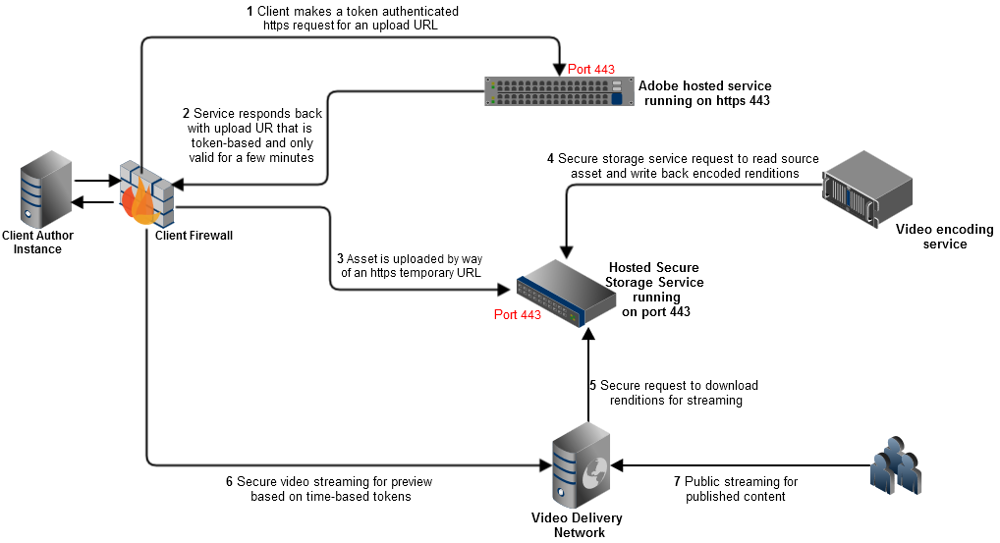

# Dynamic Media 中的視訊 {#video}

本節說明如何在Dynamic Media中使用影片。

## 快速入門：影片 {#quick-start-videos}

下列逐步工作流程說明旨在協助您透過Dynamic Media中的最適化視訊集快速上手並執行。 在每個步驟之後，都會有主題標題的交叉參考，您可在其中找到詳細資訊。

>[!IMPORTANT]
>
>在Dynamic Media中處理視訊之前，請確定您的Adobe Experience Manager管理員已在Dynamic Media - Scene7模式或Dynamic Media — 混合模式中啟用並設定Dynamic MediaCloud Services。
>
>* 請參閱 [設定Dynamic MediaCloud Services](/help/assets/config-dms7.md#configuring-dynamic-media-cloud-services) 在設定Dynamic Media - Scene7模式和 [疑難排解Dynamic Media - Scene7模式](/help/assets/troubleshoot-dms7.md).
>
>* 請參閱 [設定Dynamic MediaCloud Services](/help/assets/config-dynamic.md#configuring-dynamic-media-cloud-services) 在設定Dynamic Media — 混合模式中。
>
>Dynamic Media中目前已知的視訊播放問題 *僅Experience Manager6.5.9.0*:
>
>* 如果已發佈的視訊已更新，則必須再次發佈，以反映傳送時的變更。
>


1. **上傳您的Dynamic Media影片** 執行下列操作：

   * 建立您自己的視訊編碼設定檔。 或者，您只需使用預先定義的 _最適化視訊編碼_ 隨附的設定檔Dynamic Media。

      * [建立視訊編碼設定檔](/help/assets/video-profiles.md#creating-a-video-encoding-profile-for-adaptive-streaming).
      * 深入了解 [視訊編碼最佳作法](#best-practices-for-encoding-videos).
   * 將視訊處理設定檔關聯至您要上傳主要來源視訊的一或多個資料夾。

      * [將視訊描述檔套用至資料夾](/help/assets/video-profiles.md#applying-a-video-profile-to-folders).
      * 深入了解 [組織數位資產以使用處理設定檔的最佳作法](/help/assets/organize-assets.md).
      * 深入了解 [組織數位資產](/help/assets/organize-assets.md).
   * 將您的主要來源影片上傳至資料夾。 將視訊新增至資料夾時，會根據您指派給資料夾的視訊處理設定檔進行編碼。

      * Dynamic Media主要支援長度上限30分鐘、解析度大於25 x 25的短片影片。
      * 您可以上傳每個高達15 GB的視訊檔案。
      * [上傳您的影片](/help/assets/managing-video-assets.md#upload-and-preview-video-assets).
      * 深入了解 [支援的輸入檔案格式](/help/assets/assets-formats.md#supported-multimedia-formats).
   * 監視方式 [視頻編碼正在進行](#monitoring-video-encoding-and-youtube-publishing-progress) 從資產或工作流程檢視。


1. **管理您的Dynamic Media影片** 執行下列任一操作：

   * 組織、瀏覽及搜尋影片資產

      * [組織數位資產](/help/assets/organize-assets.md)
深入了解 [組織數位資產以使用處理設定檔的最佳作法](organize-assets.md)

      * [搜尋視訊資產](search-assets.md#custompredicates) 或 [搜尋資產](/help/assets/search-assets.md)
   * 預覽和發佈視訊資產

      * 檢視來源視訊和編碼的視訊轉譯及其相關縮圖：
         [預覽影片](managing-video-assets.md#upload-and-preview-video-assets) 或 [預覽資產](previewing-assets.md)
         [檢視視訊轉譯](video-renditions.md)
         [管理視訊轉譯](manage-assets.md#managing-renditions)

      * [管理檢視器預設集](managing-viewer-presets.md)
      * [發佈資產](publishing-dynamicmedia-assets.md)
   * 使用視訊中繼資料

      * 檢視編碼視訊轉譯的屬性，例如影格速率、音訊和視訊位元速率，以及轉碼器：
         [檢視視訊轉譯屬性](video-renditions.md)

      * 編輯視訊的屬性，例如標題、說明和標籤、自訂中繼資料欄位：
         [編輯視訊屬性](manage-assets.md#editing-properties)

      * [管理數位資產的中繼資料](metadata.md)
      * [中繼資料結構](metadata-schemas.md)
   * 檢閱、核准及註解影片，並維護完整版本控制

      * [為影片加上注釋](managing-video-assets.md#annotate-video-assets) 或 [為資產加上注釋](manage-assets.md#annotating)

      * [建立版本](manage-assets.md#asset-versioning)
      * [將工作流程套用至資產](assets-workflow.md) 或查看 [啟動資產的工作流程](manage-assets.md#starting-a-workflow-on-an-asset)

      * [檢閱資料夾資產](bulk-approval.md)
      * [專案](../sites-authoring/projects.md)


1. **發佈您的Dynamic Media影片** 執行下列其中一項操作：

   * 如果您使用Adobe Experience Manager作為網頁內容管理系統，則可以直接將視訊新增至網頁。

      * [將視訊新增至您的網頁](adding-dynamic-media-assets-to-pages.md).
   * 如果您使用協力廠商網頁內容管理系統，您可以將視訊連結或內嵌至您的網頁。

      * 使用URL整合視訊：
         [將 URL 連結至您的網頁應用程式](linking-urls-to-yourwebapplication.md).

      * 使用網頁上的內嵌程式碼整合視訊：
         [將視訊檢視器內嵌在網頁上](embed-code.md).
   * [產生視訊報表](#viewing-video-reports).

   * [向視頻添加字幕](#adding-captions-to-video).


## 在Dynamic Media中使用影片 {#working-with-video-in-dynamic-media}

Dynamic Media中的視訊是端對端解決方案，可讓您輕鬆發佈高品質的最適化視訊，以在多個畫面間串流，包括桌上型電腦、iOS、Android™、BlackBerry®和Windows行動裝置。 適用性視訊集將以不同位速率和格式（如400 kbps、800 kbps和1000 kbps）編碼的相同視訊的版本分組。 台式電腦或行動裝置會偵測可用頻寬。

例如，在iOS行動裝置上，會偵測頻寬，例如3G、4G或Wi-Fi。 然後，它自動從自適應視訊集內的各種視訊位速率中選取正確編碼的視訊。 視訊會串流至桌上型電腦、行動裝置或平板電腦。

此外，如果案頭或行動裝置上的網路條件改變，視訊品質會自動動態切換。 此外，如果客戶在桌上型電腦上進入全螢幕模式，適用性視訊集會使用更佳的解析度來回應，改善客戶的觀看體驗。 使用最適化視訊集，可讓客戶在多個畫面和裝置上播放Dynamic Media視訊，獲得最佳的播放效果。

視訊播放器用來判斷播放或播放期間要選取的編碼視訊的邏輯，是根據下列演算法：

1. 視訊播放器會根據最接近播放器本身中為「初始位元速率」所設定的值的位元速率，載入初始視訊片段。
1. 視訊播放器會根據頻寬速度的變更，使用下列條件進行切換：

   1. 播放器會選擇低於或等於估計頻寬的最高頻寬流。
   1. 播放器僅考慮可用頻寬的80%。 然而，如果它在轉換，則只有70%會更為保守，以避免高估，並立即重新轉換。

如需演算法的詳細技術資訊，請參閱 [https://android.googlesource.com/platform/frameworks/av/+/master/media/libstagefright/httplive/LiveSession.cpp](https://android.googlesource.com/platform/frameworks/av/+/master/media/libstagefright/httplive/LiveSession.cpp)

若要管理單一視訊和最適化視訊集，支援下列項目：

* 從多種支援的視訊格式和音訊格式上傳視訊，並將視訊編碼為MP4 H.264格式，以便在多個畫面間播放。 您可以使用預先定義的最適化視訊預設集、單一視訊編碼預設集，或自訂自己的編碼以控制視訊的品質和大小。

   * 產生最適化視訊集時，會包含MP4視訊。
   * **附註**:主視訊/來源視訊不會新增至最適化視訊集。

* 所有HTML5個視訊檢視器中的視訊字幕。
* 透過完整的中繼資料支援，組織、瀏覽和搜尋視訊，以有效管理視訊資產。
* 將最適化視訊集傳送至Web和桌上型電腦，以及行動裝置，包括iPhone、iPad、Android™、BlackBerry®和Windows電話。

各種iOS平台均支援最適化視訊串流。 請參閱 [Dynamic Media檢視器參考指南](https://experienceleague.adobe.com/docs/dynamic-media-developer-resources/library/viewers-aem-assets-dmc/video/c-html5-video-reference.html#video).

Dynamic Media支援MP4 H.264視訊的行動視訊播放。 您可以在以下位置找到支援此視頻格式的BlackBerry®設備： [BlackBerry®上支援的視頻格式](https://support.blackberry.com/kb/articleDetail?ArticleNumber=000005482).

您可以在以下位置找到支援此視頻格式的Windows設備： [Windows Phone 8支援的媒體轉碼器](https://learn.microsoft.com/en-us/windows/uwp/audio-video-camera/supported-codecs)


* 使用Dynamic Media視訊檢視器預設集播放視訊，包括下列內容：

   * 單一影片檢視器。
   * 混合媒體檢視器，可結合視訊和影像內容。

* 設定視訊播放器以符合您的品牌需求。
* 將視訊與您的網站、行動網站或行動應用程式整合，並使用簡單的URL或內嵌程式碼。

<!-- See [Dynamic video playback](https://s7d9.scene7.com/s7/uvideo.jsp?asset=GeoRetail/Mop_AVS&config=GeoRetail/Universal_Video1&stageSize=640,480) sample. -->

另請參閱 [Experience Manager Assets和Dynamic Media Classic的檢視器](https://experienceleague.adobe.com/docs/dynamic-media-developer-resources/library/viewers-aem-assets-dmc/c-html5-s7-aem-asset-viewers.html#viewers-aem-assets-dmc) 和 [僅限Experience Manager資產的檢視器](https://experienceleague.adobe.com/docs/dynamic-media-developer-resources/library/viewers-for-aem-assets-only/c-html5-aem-asset-viewers.html#viewers-for-aem-assets-only).

## 最佳實務：使用HTML5視訊檢視器 {#best-practice-using-the-html-video-viewer}

Dynamic Media HTML5視訊檢視器預設集是強大的視訊播放器。 您可以使用它們來避免許多與HTML5視訊播放相關的常見問題。 此外，行動裝置相關的問題，例如缺乏最適化位元速率串流傳送，以及案頭瀏覽器觸及範圍有限。

在播放器的設計端，您可以使用標準網頁開發工具來設計視訊播放器的功能。 例如，您可以使用HTML5和CSS來設計按鈕、控制項和自訂海報影像背景，以協助您以自訂外觀觸及客戶。

在檢視器的播放端，會自動偵測瀏覽器的視訊功能。 接著，它會使用HLS（HTTP即時串流）或DASH（透過HTTP的動態最適化串流）（也稱為適用位元速率串流）來提供視訊。 或者，如果這些傳送方法不存在，則會改用HTML5漸進式。

合併為單一播放器，可執行下列動作：

* 使用HTML5和CSS設計播放元件的功能
* 具有內嵌播放
* 根據瀏覽器功能使用最適化和漸進式串流

您可以將多媒體內容的觸及範圍擴展至案頭和行動使用者，並確保簡化的視訊體驗。

另請參閱 [關於HTML5檢視器](https://experienceleague.adobe.com/docs/dynamic-media-developer-resources/library/viewers-for-aem-assets-only/c-html5-aem-asset-viewers.html#viewers-for-aem-assets-only).

### 使用HTML5視訊檢視器在桌上型電腦和行動裝置上播放視訊 {#playback-of-video-on-desktop-computers-and-mobile-devices-using-the-html-video-viewer}

針對案頭和行動最適化視訊串流，用於位元速率切換的視訊是以最適化視訊集中的所有MP4視訊為基礎。

使用DASH或HLS或漸進式視訊下載時，會發生視訊播放。 在舊版Experience Manager（例如6.0、6.1和6.2）中，視訊是透過HTTP串流。

在Experience Manager6.3及更新版本中，視訊現在會透過HTTPS（即DASH或HLS）串流，因為DM閘道服務URL一律使用HTTPS。 此預設行為不會有客戶影響。 也就是說，除非瀏覽器不支援，否則視訊串流一律會透過HTTPS進行。 （請參閱下表）。 因此，

* 如果您的HTTPS網站採用HTTPS視訊串流，則串流沒問題。
* 如果您的HTTP網站採用HTTPS視訊串流，串流沒問題，且網頁瀏覽器沒有混合的內容問題。

DASH是國際標準，HLS是Apple標準。 兩者皆用於最適化視訊串流。 而且，這兩種技術都會根據網路頻寬容量自動調整播放。 它也可讓客戶「搜尋」視訊中的任何點，而不需等待視訊的其餘部分下載。

通過在用戶的案頭系統或移動設備上本地下載和儲存視頻來傳送漸進式視頻。

下表說明使用Dynamic Media視訊檢視器在桌上型電腦和行動裝置上播放視訊的裝置、瀏覽器和播放方法。

<table>
 <tbody>
  <tr>
   <td><strong>裝置</strong></td>
   <td><strong>瀏覽器</strong></td>
   <td><strong>視訊播放模式</strong></td>
  </tr>
  <tr>
   <td>桌面</td>
   <td>Internet Explorer 9和10</td>
   <td>漸進式下載。</td>
  </tr>
  <tr>
   <td>桌面</td>
   <td>Internet Explorer 11+</td>
   <td>在Windows 8和Windows 10上 — 每當請求DASH*或HLS時，強制使用HTTPS。 已知限制：此瀏覽器/作業系統組合中HTTP on DASH*或HLS無法運作<br /> <br /> 在Windows 7上 — 漸進式下載。 使用標準邏輯來選取HTTP與HTTPS通訊協定。</td>
  </tr>
  <tr>
   <td>桌面</td>
   <td>Firefox 23-44</td>
   <td>漸進式下載。</td>
  </tr>
  <tr>
   <td>桌面</td>
   <td>Firefox 45或更新版本</td>
   <td>DASH*或HLS適用位元速率串流。</td>
  </tr>
  <tr>
   <td>桌面</td>
   <td>鉻黃</td>
   <td>DASH*或HLS適用位元速率串流。</td>
  </tr>
  <tr>
   <td>桌面</td>
   <td>Safari(Mac)</td>
   <td>HLS適用位元速率串流。</td>
  </tr>
  <tr>
   <td>行動</td>
   <td>Chrome(Android™ 6或更舊版本)</td>
   <td>漸進式下載。</td>
  </tr>
  <tr>
   <td>行動</td>
   <td>Chrome(Android™ 7或更新版本)</td>
   <td>DASH*或HLS適用位元速率串流。</td>
  </tr>
  <tr>
   <td>行動</td>
   <td>Android™（預設瀏覽器）</td>
   <td>漸進式下載。</td>
  </tr>
  <tr>
   <td>行動</td>
   <td>Safari(iOS)</td>
   <td>HLS適用位元速率串流。</td>
  </tr>
  <tr>
   <td>行動</td>
   <td>Chrome(iOS)</td>
   <td>HLS適用位元速率串流。</td>
  </tr>
  <tr>
   <td>行動</td>
   <td>BlackBerry®</td>
   <td>DASH*或HLS適用位元速率串流。/td&gt;
  </tr>
 </tbody>
</table>

>[!IMPORTANT]
>
>*若要使用視訊的DASH，必須先由您的帳戶上的Adobe技術支援啟用。 請參閱 [在您的帳戶上啟用DASH](#enable-dash).

## Dynamic Media視訊解決方案架構 {#architecture-of-dynamic-media-video-solution}

下圖顯示影片的整體製作工作流程，這些影片會透過DMGateway上傳和編碼(在Dynamic Media混合模式中)，並可供公眾使用。



## 影片的混合發佈架構 {#hybrid-publishing-architecture-for-videos}


## 編碼視訊的最佳作法 {#best-practices-for-encoding-videos}

此 **Dynamic Media編碼視訊** 如果您已啟用Dynamic Media並設定視訊雲端服務，工作流程會對視訊進行編碼。 此工作流程會擷取工作流程處理歷程記錄和失敗資訊。如果您已啟用Dynamic Media並設定視訊雲端服務，則 **[!UICONTROL Dynamic Media編碼視訊]** 上傳視訊時，工作流程會自動生效。 (如果您未使用Dynamic Media, **[!UICONTROL DAM更新資產]** 工作流程生效。)

<!-- DEAD The following are best-practice tips for encoding source video files.

For advice about video encoding, see [Video Encoding Basics](https://www.adobe.com/go/learn_s7_encoding_en).

* [Streaming 101: The Basics — Codecs, Bandwidth, Data Rate, and Resolution](https://www.adobe.com/go/learn_s7_streaming101_en). -->

### 源視頻檔案 {#source-video-files}

為視訊檔案編碼時，請使用盡可能高品質的來源視訊檔案。 請避免使用先前編碼的視訊檔案，因為這些檔案已經壓縮，而進一步編碼會造成品質欠佳的視訊。

* Dynamic Media主要支援長度上限30分鐘、解析度大於25 x 25的短片影片。
* 您可以上傳最多15 GB的主要來源視訊檔案。

下表說明了源視頻檔案編碼前必須具有的建議大小、外觀比例和最小比特率：

| 大小 | 外觀比例 | 最小比特率 |
|--- |--- |--- |
| 1024 X 768 | 4:3 | 大部分視訊為4500 kbps。 |
| 1280 X 720 | 16:9 | 3000 - 6000 kbps，視訊中的運動量而定。 |
| 1920 X 1080 | 16:9 | 6000 - 8000 kbps，視訊中的運動量而定。 |

### 取得檔案的中繼資料 {#obtaining-a-file-s-metadata}

您可以使用視訊編輯工具檢視其中繼資料，或使用專為取得中繼資料而設計的應用程式，以取得檔案的中繼資料。 以下是使用協力廠商應用程式MediaInfo來取得視訊檔案中繼資料的指示：

1. 前往 [MediaInfo下載](https://mediaarea.net/en/MediaInfo/Download).
1. 選擇並下載GUI版本的安裝程式，並按照安裝說明操作。
1. 安裝後，按一下右鍵視頻檔案（僅限Windows）並選擇MediaInfo，或開啟MediaInfo並將視頻檔案拖入應用程式。 您會看到與視訊檔案相關聯的所有中繼資料，包括其寬度、高度和fps。

### 外觀比例 {#aspect-ratio}

當您選擇或建立主要來源視訊檔案的視訊編碼預設集時，請確定預設集與主要來源視訊檔案的外觀比例相同。 長寬比是視訊寬度與高度的比率。

若要確定視訊檔案的長寬比，請取得檔案的中繼資料，並記下檔案的寬度和高度（請參閱上方取得檔案的中繼資料）。 然後使用此公式來確定外觀比例：

寬/高=長寬比

下表說明公式結果如何轉換為通用外觀比例選擇：

| 公式結果 | 外觀比例 |
|--- |--- |
| 1.33 | 4:3 |
| 0.75 | 3:4 |
| 1.78 | 16:9 |
| 0.56 | 9:16 |

例如，寬度為1440 x 1080的視頻的長寬比為1440/1080，即1.33。在這種情況下，選擇寬寬比為4:3的視頻編碼預設集來編碼視頻檔案。

### 位元速率 {#bitrate}

位元速率是經過編碼，組成視訊播放一秒的資料量。 位元速率以千比特/秒（每秒位元組數）測量。

>[!NOTE]
>
>因為所有轉碼器都使用有損壓縮，所以位元速率是視訊品質中最重要的因素。 有損壓縮越是壓縮視頻檔案，質量就越降低。 因此，所有其他特性相等（解析度、幀速率和編解碼器），位元速率越低，壓縮檔案的質量就越低。

選取位元速率編碼時，可以選擇兩種類型：

* **[!UICONTROL 常數位元速率編碼]** (CBR) — 在CBR編碼期間，位元速率或每秒位數在整個編碼過程中保持不變。 CBR編碼在整個視頻中將設定的資料速率保存為設定。 此外，CBR編碼不會為質量優化介質檔案，但會節省儲存空間。
如果視頻在整個視頻中包含類似的運動級別，則使用CBR。 CBR最常用於流式視頻內容。 另請參閱 [使用自訂新增的視訊編碼參數](/help/assets/video-profiles.md#using-custom-added-video-encoding-parameters).

* **[!UICONTROL 變數位元速率編碼]** (VBR)- VBR編碼會根據壓縮程式所需的資料，將資料速率調低至您設定的上限。 此功能表示在VBR編碼過程中，媒體檔案的位元速率會根據媒體檔案的位元速率需求，以動態方式增加或減少。
VBR編碼需要較長的時間，但會產生最有利的結果；媒體檔案的品質優越。 VBR最常用於http漸進式傳送視訊內容。

何時使用VBR或CRB?
選擇VBR或CBR時，幾乎總是建議您將VBR用於介質檔案。 VBR以競爭性位元速率提供高品質的檔案。 使用VBR時，請務必使用兩遍編碼，並將最大位元速率設為目標視訊位元速率的1.5倍。

選擇視頻編碼預設集時，請記住目標最終用戶的連接速度。 選擇資料速率為該速度80%的預設集。 例如，如果目標最終用戶的連接速度為1000 Kbps，則最佳預設是視頻資料速率為800 Kbps的預設。

此表描述了典型連接速度的資料速率。

| 速度(Kbps) | 連線類型 |
|--- |--- |
| 256 | 撥號連接。 |
| 800 | 典型的行動連線。 對於此連線，若為3G體驗，將資料速率定位在400到最大800的範圍內。 |
| 2000 | 典型的寬頻案頭連接。 對於此連接，目標資料速率為800-2000 Kbps，大多數目標平均為1200-1500 Kbps。 |
| 5000 | 典型的高寬頻連接。 不建議使用此上限的編碼，因為大多數消費者無法使用此速度的視訊傳送。 |

### 解析度 {#resolution}

**解析度** 以像素說明視訊檔案的高度和寬度。 大部分的源視頻都以高解析度儲存（例如1920 x 1080）。 為了串流目的，來源視訊會壓縮為較小的解析度（640 x 480或更小）。

解析度和資料速率是決定視訊品質的兩個整體連結因素。 若要維持相同的視訊品質，視訊檔案中的像素數目越多（解析度越高），資料速率就必須越高。 例如，請考慮解析度為320 x 240和解析度為640 x 480的視頻檔案中每幀的像素數：

| 解析度 | 每幀像素 |
|--- |--- |
| 320 x 240 | 76,800 |
| 640 x 480 | 307,200 |

640 x 480檔案的像素是每幀的4倍。 若要針對這兩個範例解析度取得相同的資料速率，您可對640 x 480檔案套用4倍的壓縮，以降低視訊品質。 因此，250 Kbps的視頻資料速率以320 x 240解析度產生高質量的觀看，而不是以640 x 480解析度產生。

一般而言，您使用的資料速率越高，視訊的外觀越好，使用的解析度越高，您必須維持檢視品質的資料速率就越高（與解析度較低相比）。

由於解析度和資料速率是連結的，因此在對視訊進行編碼時有兩個選項：

* 選擇資料速率，然後以最高解析度編碼，且以您選擇的資料速率看起來不錯。
* 選擇解析度，然後按照所需的資料速率進行編碼，以按您選擇的解析度實現高質量視頻。

當您為主要來源視訊檔案選擇（或建立）視訊編碼預設集時，請使用下表來鎖定正確的解析度：

| 解析度 | 高度 (像素) | 螢幕大小 |
|--- |--- |--- |
| 240p | 240 | 小螢幕 |
| 300p | 300 | 小螢幕，通常用於行動裝置 |
| 360p | 360 | 小螢幕 |
| 480p | 480 | 中螢幕 |
| 720p | 720 | 大螢幕 |
| 1080p | 1080 | 高清大螢幕 |

### Fps（每秒幀數） {#fps-frames-per-second}

在美國和日本，大多數視頻以每秒29.97幀(fps)拍攝；在歐洲，大多數視頻以25幀/秒的速度拍攝。 以24 fps拍攝。

選擇符合主要來源視訊檔案之fps速率的視訊編碼預設集。 例如，如果您的主要來源視訊為25 fps，請選擇編碼預設集(25 fps)。 依預設，所有自訂編碼都使用主要來源視訊檔案的fps。 因此，建立視訊編碼預設集時，您不需要明確指定fps設定。

### 視訊編碼維度 {#video-encoding-dimensions}

為獲得最佳結果，請選取編碼維度，使來源視訊是所有已編碼視訊的整數倍。

要計算此比率，可將源寬度除以編碼寬度以獲得寬比。 然後，將源高度除以編碼高度以得到高度比。

如果產生的比率是整數，則表示視訊已最佳縮放。 如果產生的比率不是整數，它會在顯示器上保留剩餘的像素偽影，以影響視訊品質。 當視訊有文字時，此效果最顯著。

例如，假設您的來源視訊為1920 x 1080。 在下表中，三個已編碼的視訊可提供要使用的最佳編碼設定。

| 視訊類型 | 寬x高 | 寬度比例 | 高度比 |
|--- |--- |--- |--- |
| 來源 | 1920x1080 | 1 | 1 |
| 編碼 | 960 x 540 | 2 | 2 |
| 編碼 | 640 x 360 | 3 | 3 |
| 編碼 | 480 x 270 | 4 | 4 |

### 編碼視訊檔案格式 {#encoded-video-file-format}

Dynamic Media建議使用MP4 H.264視訊編碼預設集。 由於MP4檔案使用H.264視訊轉碼器，因此可提供高品質的視訊，但檔案大小壓縮。

### 在您的帳戶上啟用DASH {#enable-dash}

DASH(Digital Adaptive Streaming over HTTP)是視訊串流的國際標準，在不同的視訊觀看者中廣泛採用。 在帳戶上啟用「破折號」時，您可以選擇使用「破折號」或HLS進行最適化視訊串流。 或者，您可以選擇兩者，並在 **[!UICONTROL 自動]** 在檢視器預設集中，已選取為播放類型。

在您的帳戶上啟用DASH的一些主要優點包括：

* 封裝DASH串流視訊，以進行最適化位元速率串流。 此方法可提高傳送效率。 最適化串流可確保為客戶提供最佳的檢視體驗。
* 使用Dynamic Media播放器在HLS和DASH串流之間切換，以最佳化服務品質，進行瀏覽器最佳化串流。 使用Safari瀏覽器時，視訊播放器會自動切換至HLS。
* 您可以編輯視訊檢視器預設集，以設定您偏好的串流方法（HLS或DASH）。
* 最佳化的視訊編碼可確保在啟用DASH功能時不會使用其他儲存空間。 為HLS和DASH建立一組視訊編碼，以最佳化視訊儲存成本。
* 有助於讓客戶更容易存取視訊傳送。
* 也可透過API取得串流URL。

   >[!IMPORTANT]
   >
   >目前僅亞太地區和北美提供您帳戶的啟用DASH;即將在歐洲 — 中東 — 非洲推出。

在您的帳戶上啟用DASH需要兩個步驟：

* 將Dynamic Media設為使用DASH，讓您輕鬆自在。
* 將Experience Manager6.5設定為使用DASH，這是透過您建立和提交的Adobe客戶支援案例來完成。

**要啟用帳戶上的DASH，請執行以下操作：**

1. **設定Dynamic Media**  — 在Dynamic Media的Experience Manager6.5中，導覽至 [https://localhost:4502/system/console/configMgr](https://localhost:4502/system/console/configMgr).
1. 搜尋 **AEM Assets Dynamic Media視訊進階串流** 功能標幟。
1. 選中複選框以啟用（開啟）破折號。
1. 選取&#x200B;**[!UICONTROL 儲存]**。
1. **配置Experience Manager6.5** - [使用Admin Console開始建立新的支援案例](https://helpx.adobe.com/tw/enterprise/using/support-for-experience-cloud.html).
1. 請依照指示建立支援案例，同時確保您提供下列資訊：

   * 主要聯繫人姓名、電子郵件、電話。
   * 您的Dynamic Media帳戶名稱。
   * 指定要在Experience Manager6.5上啟用DASH。

1. Adobe客戶支援會根據提交請求的順序將您新增至DASH客戶等待清單。
1. 當Adobe準備好處理您的請求時，客戶支援會聯絡您，協調並設定啟用破折號的目標日期。
1. 客戶支援在完成後通知您。
1. 建立 [視訊檢視器預設集](/help/assets/managing-viewer-presets.md#creating-a-new-viewer-preset) 照常。

## 檢視視訊報表 {#viewing-video-reports}

>[!NOTE]
>
>只有在執行Dynamic Media — 混合模式時，才可使用視訊報表。

視訊報表會在指定時間內顯示數個匯總量度，以協助您監控 *已發佈* 個別和匯總影片如預期般執行。 系統會針對整個網站上所有發佈的視訊匯總下列排名在前的量度資料：

* 視訊開始
* 完成率
* 視訊平均逗留時間
* 視訊總逗留時間
* 每次造訪的影片

全部表格 *已發佈* 也會列出影片，讓您能夠根據總影片開始次數追蹤網站上最常觀看的影片。

當您點選清單中的影片名稱時，它會以折線圖的形式顯示影片的對象保留率（下拉式清單）報表。 圖表會顯示視訊播放期間任何指定時刻的檢視次數。 當您播放視訊時，垂直條會與播放器中的時間指示器同步追蹤。 折線圖資料中斷，指出您的受眾從不感興趣的位置下降。

如果視訊在Adobe Experience Manager Dynamic Media外部編碼，就無法使用對象保留率（下拉式清單）圖表和表格中的播放百分比資料。

另請參閱 [設定Dynamic MediaCloud Services](/help/assets/config-dynamic.md).

>[!NOTE]
>
>追蹤和報表資料僅以使用Dynamic Media自己的視訊播放器和相關的視訊播放器預設集為基礎。 因此，您無法追蹤並報告透過其他視訊播放器播放的視訊。

依預設，當您首次輸入視訊報表時，報表會顯示從當月的第一個開始，到當月的日期結束的視訊資料。 不過，您可以指定自己的日期範圍來覆寫預設日期範圍。 下次輸入視訊報表時，會使用您指定的日期範圍。

為了讓視訊報表正常運作，設定Dynamic MediaCloud Services時，會自動建立報表套裝ID。 同時，報表套裝ID會推送至發佈伺服器，以便您在預覽資產時能使用「複製URL」功能。 不過，此功能需要已設定發佈伺服器。 如果未設定發佈伺服器，您仍可以發佈以查看視訊報表。 不過，您必須返回「Dynamic Media雲端設定」並點選 **[!UICONTROL 確定]**.

**若要檢視視訊報表：**

1. 在Experience Manager的左上角，點選Experience Manager標誌，然後在左側導軌中，點選 **[!UICONTROL 工具]** （錘子表徵圖）> **[!UICONTROL 資產]** > **[!UICONTROL 視訊報表]**.
1. 在視訊報表頁面上，執行下列其中一項作業：

   * 在右上角附近，點選 **重新整理視訊報表** 表徵圖。
只有在報表的結束日期為當天時，才使用「重新整理」。 這麼做可確保您看見自您上次執行報表以來所發生的視訊追蹤。

   * 在右上角附近，點選 **日期選擇器** 表徵圖。
指定您要視訊資料的開始和結束日期範圍，然後點選 **[!UICONTROL 執行報表]**.

   「排名在前的量度」群組方塊會識別所有 *已發佈* 視訊。

1. 在列出最常發佈影片的表格中，點選影片名稱以播放影片，並查看影片的對象保留率（下拉式清單）報表。

### 根據您使用Dynamic Media HTML5檢視器SDK建立的視訊檢視器檢視視訊報表 {#viewing-video-reports-based-on-a-video-viewer-that-you-created-using-the-scene-hmtl-viewer-sdk}

如果您使用Dynamic Media提供的現成視訊檢視器，或如果您根據現成視訊檢視器建立自訂檢視器預設集，則不需要其他步驟即可檢視視訊報表。 不過，如果您已根據HTML5檢視器SDK API建立自己的視訊檢視器，則請使用下列步驟，確保您的視訊檢視器將追蹤事件傳送至Dynamic Media視訊報表。

使用 [AdobeDynamic Media檢視器參考指南](https://experienceleague.adobe.com/docs/dynamic-media-developer-resources.html) 和 [HTML5檢視器SDK API](https://s7d1.scene7.com/s7sdk/3.10/docs/jsdoc/index.html) 來建立自己的影片檢視器。

**若要根據您使用Dynamic Media HTML5檢視器SDK建立的視訊檢視器來檢視視訊報表：**

1. 導覽至任何已發佈的視訊資產。
1. 在資產頁面的左上角附近，從下拉式清單中選取「檢 **[!UICONTROL 視器]**」。
1. 選取任何視訊檢視器預設集並複製內嵌程式碼。
1. 在內嵌程式碼中，尋找包含下列項目的行：

   `videoViewer.setParam("config2", "<value>");`

   此 `config2` 參數會在「HTML5檢視器」中啟用追蹤。 也是公司專屬的預設集，其中包含視訊報表和客戶專屬Adobe Analytics設定的設定資訊。

   config2參數的正確值可在 **[!UICONTROL Embed Code]**  (內嵌代碼) 和copy **[!UICONTROL URL (複製UICONTROL URL) 函式]** 中找到。在複製 **[!UICONTROL URL命令的URL中]** ，要尋找的參數為 `&config2=<value>` 。值幾乎總是 `companypreset`會出現，但在某些情況下 `companypreset-1`, `companypreset-2`它也可以是、等等。

1. 在自訂視訊檢視器程式碼中，執行下列動作，將AppMeasurementBridge .jsp新增至檢視器頁面：

   * 首先，判斷您是否需要 `&preset` 參數。

      若 `config2` 參數 `companypreset`, *not* 需要 `&preset=parameter`.

      若 `config2` 是其他任何值，請將預設參數設為與 `config2` 參數。 例如，若 `config2=companypreset-2`，新增 `&param2=companypreset-2` 至AppMeasurementBridge.jsp URL。

   * 然後，新增AppMeasurementBridge.jsp指令碼：

      `<script language="javascript" type="text/javascript" src="https://s7d1.scene7.com/s7viewers/AppMeasurementBridge.jsp?company=robindallas&preset=companypreset-2"></script>`

1. 執行下列動作，建立TrackingManager元件：

   * 呼叫後 `s7sdk.Util.init();`，請建立追蹤事件的TrackingManager例項，方法是新增下列項目：

      `var trackingManager = new s7sdk.TrackingManager();`

   * 執行下列操作，將元件連線至TrackingManager:

      在 `s7sdk.Event.SDK_READY` 事件處理常式，將您要追蹤的元件附加至TrackingManager。

      例如，如果元件為 `videoPlayer`，新增

      `trackingManager.attach(videoPlayer);`

      將元件附加至trackingManager。 若要在頁面上追蹤多個檢視器，請使用多個追蹤管理器元件。

   * 新增下列項目，以建立AppMeasurementBridge物件：

      ```
      var appMeasurementBridge = new AppMeasurementBridge(); appMeasurementBridge.setVideoPlayer(videoPlayer);
      ```

   * 新增下列項目，以新增追蹤函式：

      ```
      trackingManager.setCallback(appMeasurementBridge.track, 
       appMeasurementBridge);
      ```
   appMeasurementBridge物件具有內建追蹤函式。 不過，您也可以提供自己的功能來支援多個追蹤系統或其他功能。

<!--    For more information, see *Using the TrackingManager Component* in the *Scene7 HTML5 Viewer SDK User Guide* available for download from [Adobe Developer Connection](https://help.adobe.com/en_US/scene7/using/WSef8d5860223939e2-43dedf7012b792fc1d5-8000.html). -->

## 在視頻中添加隱藏字幕或字幕 {#adding-captions-to-video}

您可以將隱藏式字幕新增至單一影片或最適化影片集，將影片觸及範圍擴展至全球市場。 通過添加隱藏式字幕，您可以避免對音頻進行重複播放，或者使用母語者為每種語言重新錄制音頻。 影片以錄制的語言播放。 外語字幕出現，使不同語言的人仍然能夠理解音頻部分。

隱藏式字幕也讓聾人或聽力障礙人士更容易存取。

>[!NOTE]
>
>您使用的視訊播放器必須支援字幕的顯示。

另請參閱 [Dynamic Media中的協助工具](/help/assets/accessibility-dm.md).

Dynamic Media會將註解檔案轉換為JSON（JavaScript物件標籤法）格式。 這種轉換表示您可以將JSON文字內嵌至網頁，作為視訊的隱藏但完整的記錄。 然後，搜尋引擎可對內容進行編目並建立索引，讓您更容易找到影片，並提供客戶關於影片內容的其他詳細資訊。

請參閱 [提供靜態（非影像）內容](https://experienceleague.adobe.com/docs/dynamic-media-developer-resources/image-serving-api/image-serving-api/c-serving-static-nonimage-contents.html#image-serving-api) 在 *Dynamic Media影像提供與轉譯API說明* 如需在URL中使用JSON函式的詳細資訊。

**向視頻添加字幕或字幕：**

1. 使用第三方應用程式或服務建立視頻字幕/字幕檔案。

   請確定您建立的檔案符合WebVTT（Web視訊文字追蹤）標準。 字幕副檔名為.vtt。 您可以了解有關WebVTT字幕標準的更多資訊。

   請參閱 [WebVTT:網路視訊文字追蹤格式](https://w3c.github.io/webvtt/).

   您可以使用免費和優質的工具和服務，在Dynamic Media之外製作字幕/字幕檔案。 例如，要建立不帶樣式的簡單視頻字幕檔案，可以使用以下免費線上字幕創作和編輯工具：

   [WebVTT字幕製作器](https://testdrive-archive.azurewebsites.net/Graphics/CaptionMaker/Default.html)

   為獲得最佳結果，請使用Internet Explorer 9或更新版本、Google Chrome或Safari中的工具。

   在工具中， **[!UICONTROL 輸入視訊檔案的URL]** 欄位，貼上視訊檔案的複製URL，然後按一下 **[!UICONTROL 載入]**. 請參閱 [取得資產的URL](/help/assets/linking-urls-to-yourwebapplication.md#obtaining-a-url-for-an-asset) 以取得視訊檔案本身的URL，然後您可將其貼入 **[!UICONTROL 輸入視訊檔案欄位的URL]**. 然後，Internet Explorer、Chrome或Safari就可以原生播放視訊。

   現在請依照網站的螢幕指示製作和儲存您的WebVTT檔案。 完成後，複製註解檔案內容並貼到純文字編輯器中，然後使用 `.vtt` 副檔名為。

   >[!NOTE]
   >
   >為全球支援多種語言的視頻字幕，WebVTT標準要求您為要支援的每種語言分別建立.vtt檔案和調用。

   通常，您想將字幕VTT檔案命名為與視頻檔案相同的名稱，並將其附加到語言區域設定，如 — EN、-FR或 — DE。 如此一來，您就能透過現有的網頁內容管理系統，協助您自動產生視訊URL。

1. 在Experience Manager中，將WebVTT註解檔案上傳至DAM。
1. 導覽至 *已發佈* 您要與上傳的標題檔案相關聯的視訊資產。

   請記住，URL僅可在您首次發 *布資產* 後 *複製* 。

   請參閱 [發佈資產](/help/assets/publishing-dynamicmedia-assets.md).

1. 執行下列任一項作業：

   * 如需快顯視訊檢視器體驗，請點選 **[!UICONTROL URL]**. 在「URL」對話方塊中，選取URL並將其複製到剪貼簿，然後將URL移至簡單文字編輯器中。 使用下列語法附加視訊的複製URL:

      `&caption=<server_path>/is/content/<path_to_caption.vtt_file,1>`

      請注意 `,1` 標題路徑的結尾。 緊接在 `.vtt` 路徑中的檔案名副檔名，您可以選擇啟用（開啟）或停用（關閉）視訊播放器列上的隱藏式字幕按鈕，方法是將設為 `,1` 或 `,0`，分別為。

   * 如需內嵌的視訊檢視器體驗，請點選 **[!UICONTROL 內嵌程式碼]**. 在「內嵌程式碼」對話方塊中，選取內嵌程式碼，並將其複製到剪貼簿，然後將程式碼貼到簡單的文字編輯器中。 使用下列語法附加複製的內嵌程式碼：

      `videoViewer.setParam("caption","<path_to_caption.vtt_file,1>");`

      請注意 `,1` 標題路徑的結尾。 緊接在 `.vtt` 路徑中的檔案名副檔名，您可以選擇啟用（開啟）或停用（關閉）視訊播放器列上的隱藏式字幕按鈕，方法是將設為 `,1` 或 `,0`，分別為。

## 新增章節標籤至視訊 {#adding-chapter-markers-to-video}

您可以將章節標籤新增至單一視訊或最適化視訊集，讓您更輕鬆觀看和導覽長型視訊。 當使用者播放視訊時，可以按一下視訊時間軸上的章節標籤（也稱為視訊清除程式），輕鬆導覽至其興趣點。 或者，他們可以立即跳至新內容、示範和教學課程。

>[!NOTE]
>
>使用的視訊播放器必須支援使用章節標籤。 Dynamic Media視訊播放器確實支援章節標籤，但使用協力廠商視訊播放器則否。

如有需要，您可以使用章節建立並品牌化您自己的自訂視訊檢視器，而不是使用視訊檢視器預設集。 如需使用章節導覽建立您自己的HTML5檢視器的指示，請在AdobeHTML5檢視器SDK API中，參考類別下方的「使用修飾元自訂行為」標題 `s7sdk.video.VideoPlayer` 和 `s7sdk.video.VideoScrubber`. 請參閱 [HTML5檢視器SDK API](https://s7d1.scene7.com/s7sdk/3.10/docs/jsdoc/index.html) 檔案。

<!-- If desired, you can create and brand your own custom video viewer with chapters instead of using a video viewer preset. For instructions on creating your own HTML5 viewer with chapter navigation, in the Adobe Scene7 Viewer SDK for HTML5 guide, reference the heading "Customizing Behavior Using Modifiers" under the classes `s7sdk.video.VideoPlayer` and `s7sdk.video.VideoScrubber`. The Adobe Scene7 Viewer SDK is available as a download from [Adobe Developer Connection](https://help.adobe.com/en_US/scene7/using/WSef8d5860223939e2-43dedf7012b792fc1d5-8000.html). -->

您為視訊建立章節清單的方式與建立字幕的方式大致相同。 即，建立WebVTT檔案。 但請注意，此檔案必須與您也使用的任何WebVTT標題檔案分開；不能將字幕和章節合併為一個WebVTT檔案。

您可以使用下列範例，作為建立具有章節導覽的WebVTT檔案時所使用格式的範例：

### 具有視訊章節導覽的WebVTT檔案 {#webvtt-file-with-video-chapter-navigation}

```xml
WEBVTT
Chapter 1
00:00.000 --> 01:04.364
The bicycle store behind it all.
Chapter 2
01:04.364 --> 02:00.944
Creative Cloud.
Chapter 3
02:00.944 --> 03:02.937
Ease of management for a working solution.
Chapter 4
03:02.937 --> 03:35.000
Cost-efficient access to rapidly evolving technology.
```

在上述範例中， `Chapter 1` 是提示識別碼，且為選用。 提示時間 `00:00:000 --> 01:04:364` 指定章節的開始時間和結束時間，位於 `00:00:000` 格式。 最後三位數是毫秒，可以保留為 `000`，如果偏好。 的章節標題 `The bicycle store behind it all` 是章節內容的實際說明。 當使用者將滑鼠指標暫留在影片時間軸的視覺提示點上時，提示識別碼、開始提示時間和章節標題都會顯示在影片播放器快顯視窗中。

因為您使用的是HTML5視訊檢視器，請確定您建立的章節檔案遵循WebVTT（Web視訊文字追蹤）標準。 章節檔案名副檔名為 `.vtt`. 您可以了解有關WebVTT字幕標準的更多資訊。

請參閱 [WebVTT:網路視訊文字追蹤格式](https://w3c.github.io/webvtt/)

**若要新增視訊章節導覽：**

1. 儲存 `.vtt` 檔案（以UTF8編碼），以避免章節標題文字的字元轉譯問題。

   一般來說，您會想要將章節VTT檔案命名為與視訊檔案相同的名稱，並附加章節。 如此一來，您就能透過現有的網頁內容管理系統，協助您自動產生視訊URL。
1. 在Experience Manager中，上傳您的WebVTT章節檔案。

   請參閱 [上傳資產](/help/assets/manage-assets.md#uploading-assets).

1. 執行下列任一項作業：

   <table>
     <tbody>
      <tr>
       <td>快顯視訊檢視器體驗</td>
       <td>
       <ol>
       <li>導覽至 <i>已發佈 </i>您要與您上傳之章節檔案建立關聯的視訊資產。 請記住，URL僅可在您首次發 <i>布資產</i> 後 <i>複製</i> 。請參閱 <a href="/help/assets/publishing-dynamicmedia-assets.md">發佈資產。</a></li>
       <li>從下拉式選單中，按一下或點選 <strong>檢視器</strong>.</li>
       <li>在左側導軌中，點選或按一下視訊檢視器預設集名稱。 視訊的預覽會在個別頁面中開啟。</li>
       <li>在左側邊欄中，在底部按一下 <strong>URL</strong>.</li>
       <li>在「URL」對話方塊中，選取URL並將其複製到剪貼簿，然後將URL移至簡單文字編輯器中。</li>
       <li>使用下列語法附加視訊的複製URL，以便將其與複製的URL關聯至您的章節檔案：<br /> <br /> <code>&navigation=<<i>full_copied_URL_path_to_chapter_file</i>.vtt></code><br /> </li>
       </ol> </td>
      </tr>
      <tr>
       <td>針對內嵌的視訊檢視器體驗<br /> </td>
       <td>
       <ol>
       <li>導覽至 <i>已發佈 </i>您要與您上傳之章節檔案建立關聯的視訊資產。 請記住，URL僅可在您首次發 <i>布資產</i> 後 <i>複製</i> 。請參閱 <a href="/help/assets/publishing-dynamicmedia-assets.md">發佈資產。</a></li>
       <li>從下拉式選單中，按一下或點選 <strong>檢視器</strong>.</li>
       <li>在左側導軌中，點選或按一下視訊檢視器預設集名稱。 視訊的預覽會在個別頁面中開啟。</li>
       <li>在左側邊欄中，在底部按一下 <strong>內嵌</strong>.</li>
       <li>在「內嵌程式碼」對話方塊中，選取整個程式碼，並複製到剪貼簿，然後貼到簡單的文字編輯器中。</li>
       <li>使用下列語法附加視訊的內嵌程式碼，以便將它與複製的URL建立關聯至章節檔案：<br /> <br /> <code>videoViewer.setParam("navigation","&lt;<i>full_copied_URL_path_to_chapter_file</i>.vtt&gt;"</code></li>
       </ol> </td>
      </tr>
     </tbody>
   </table>

## 關於Dynamic Media - Scene7模式中的影片縮圖 {#about-video-thumbnails-in-dynamic-media-scene-mode}

視訊縮圖是視訊影格的縮小版本，或代表視訊給客戶的影像資產。 縮圖可鼓勵客戶點按影片。

Experience Manager中的所有視訊都必須有相關聯的縮圖；不替換縮圖，就不能刪除縮圖。 依預設，當您上傳視訊至Experience Manager時，會使用第一個影格作為縮圖。 不過，您也可以自訂縮圖以用於品牌推廣或視覺搜尋。 當您自訂視訊縮圖時，可以播放視訊並暫停您要使用的影格。 或者，您可以選取已上傳且 *已發佈* 在您的數位資產管理員。

您從視訊中選取的自訂視訊縮圖影像不會擷取，並儲存在DAM中作為個別且不重複的資產。 不過，您從現有影像資產中選取的自訂視訊縮圖會儲存至JCR。 選取資產的路徑會儲存在視訊資產的節點下，如下列範例路徑所示：

`/content/dam/*<folder_name*>/<*video_name*>/jcr:content/manualThumbnail`

自訂視訊縮圖的功能，必須先將視訊設定檔套用至視訊所在的資料夾，才可使用。

另請參閱 [關於Dynamic Media — 混合模式中的視訊縮圖](#about-video-thumbnails-in-dynamic-media-hybrid-mode).

### 新增自訂視訊縮圖 {#adding-a-custom-video-thumbnail}

這些步驟僅適用於以「Dynamicmedia_Scene7」模式執行的Dynamic Media。

**若要新增自訂視訊縮圖：**

1. 請確定您已執行下列作業：

   * 為視訊資產建立資料夾。
   * [將視訊描述檔套用至資料夾](/help/assets/video-profiles.md#applying-a-video-profile-to-folders).

   * [已將您的影片上傳至資料夾](/help/assets/managing-video-assets.md#upload-and-preview-video-assets).

1. 導覽至您要變更其縮圖影像的已上傳視訊資產。
1. 在資產選擇模式中，可從 **[!UICONTROL 清單檢視]** 或 **[!UICONTROL 卡片檢視]**，點選視訊資產。
1. 在工具列上，點選 **[!UICONTROL 屬性]** 圖示（其中包含「i」的圓圈）。
1. 在影片的「屬性」頁面上，點選 **[!UICONTROL 變更縮圖]**.
1. 在「更改縮圖」頁上，執行下列操作之一：

   * 若要使用視訊的影格作為新縮圖：

      * 在工具列上，點選 **[!UICONTROL 從視頻中選擇幀]**.
      * 點選「播放」按鈕，然後點選您要擷取的影格上的「暫停」按鈕，作為視訊的新縮圖。
   * 若要使用影像資產作為新縮圖：

      * 在工具列上，點選 **[!UICONTROL 從資產中選取縮圖]**.
      * 點選 **[!UICONTROL 選取縮圖]**.
      * 導覽至您要使用的先前上傳和發佈的影像資產。 資產會自動調整大小，作為視訊的縮圖影像。
      * 選取影像資產，然後點選 **[!UICONTROL 選擇]**.


1. 在「變更縮圖」頁面上，點選 **[!UICONTROL 儲存變更]**.
1. 在影片的「屬性」頁面的右上角，點選 **[!UICONTROL 儲存並關閉]**.

## 關於Dynamic Media — 混合模式中的視訊縮圖 {#about-video-thumbnails-in-dynamic-media-hybrid-mode}

您可以從Dynamic Media自動產生的十個縮圖影像中選擇其一，以新增至您的影片。 在Experience Manager Sites、Dynamic Media Mobile或Experience Manager Screens的製作環境中，將視訊資產與Experience Manager元件搭配使用時，視訊播放器會顯示您選取的縮圖。 縮圖可當成靜態圖片，最能代表整個視訊的內容，進一步鼓勵使用者按一下「播放」按鈕。

Dynamic Media會根據視訊的總時間擷取十個（預設）縮圖影像。 影像在影片中以1%、11%、21%、31%、41%、51%、61%、71%、81%和91%的比例擷取。 十個縮圖會持續存在，這表示如果您稍後決定選擇不同的縮圖，則不需要重新產生系列。 您可以預覽10個縮圖影像，然後選取您要用於影片的影像。 如果您想要變更為預設值，可以使用CRXDE Lite來設定產生縮圖影像的時間間隔。 例如，如果您只想從視訊產生四張均勻間隔的縮圖影像系列，您可以設定24%、49%、74%和99%的間隔時間。

理想情況下，您可以在上傳視訊後、在網站上發佈視訊之前，隨時新增視訊縮圖。

您可以選擇上傳自訂縮圖以呈現您的視訊，而非使用Dynamic Media產生的縮圖。 例如，您可以建立自訂縮圖影像，其標題為影片、吸引眼球的開頭影像，或從影片擷取的特定影像。 上傳的自訂視訊縮圖影像的解析度上限為1280 x 720像素（最小寬度為640像素）且不得大於2 MB。

另請參閱 [關於Dynamic Media - Scene7模式中的影片縮圖](/help/assets/video.md#about-video-thumbnails-in-dynamic-media-scene-mode).

### 新增影片縮圖 {#adding-a-video-thumbnail}

這些步驟僅適用於以混合模式執行的Dynamic Media。

**若要新增影片縮圖：**

1. 導覽至您要新增視訊縮圖的已上傳視訊資產。
1. 在「清單檢視」或「卡片檢視」的資產選取模式中，點選視訊資產。
1. 在工具列上，點選 **[!UICONTROL 檢視屬性]** 圖示（其中包含「i」的圓圈）。
1. 在影片的「屬性」頁面上，點選 **[!UICONTROL 變更縮圖]**.
1. 在「變更縮圖」頁面上，在工具列上點選 **[!UICONTROL 選擇幀]**.

   Dynamic Media會根據您自訂的預設時間間隔或時間間隔，從您的視訊產生一系列縮圖影像。

1. 預覽產生的縮圖影像，然後選取您要新增至影片的影像。
1. 點選 **[!UICONTROL 儲存變更]**.

   視訊的縮圖影像會更新，以使用您選取的縮圖。 如果您稍後決定變更縮圖影像，可以返回 **[!UICONTROL 變更縮圖]** 頁面並選取新頁面。

   如果您已設定新的預設時間間隔，或上傳了新視訊以取代現有視訊，請讓Dynamic Media重新產生縮圖。

   請參閱 [設定產生視訊縮圖的預設時間間隔](#configuring-the-default-time-interval-that-video-thumbnails-are-generated).

#### 設定產生視訊縮圖的預設時間間隔 {#configuring-the-default-time-interval-that-video-thumbnails-are-generated}

當您設定並儲存新的預設時間間隔時，您的變更會自動僅套用至您未來上傳的視訊。 它不會自動將新預設值套用至您先前上傳的影片。 對於現有視頻，必須重新生成縮略圖。

請參閱 [新增影片縮圖](#adding-a-video-thumbnail).

**設定產生視訊縮圖的預設時間間隔：**

1. 在Experience Manager中，點選 **[!UICONTROL 工具]** > **[!UICONTROL 一般]** > **[!UICONTROL CRXDE Lite]**.

1. 在「CRXDE Lite」頁面中，在左側的目錄面板中，導覽至 `o etc/dam/imageserver/configuration/jcr:content/settings.`

   如果看不到「目錄」面板，請點選「首頁」標籤左側的>>圖示。

1. 在右下方的面板中，在「屬性」標籤中，點選兩下 `thumbnailtime`.
1. 在 **[!UICONTROL 編輯縮圖時間]** 對話框，使用文本欄位以百分比輸入間隔值。

   * 如果要新增一或多個間隔值欄位，請點選加號(+)圖示。 如有必要，請捲動至對話方塊底部以查看圖示。
   * 如果要從清單中刪除區間值欄位，請點選區間值欄位右側的減號(-)圖示。
   * 如果要重新排序間隔值，請點選上箭頭圖示和下箭頭圖示。

1. 點選 **[!UICONTROL 確定]** 並返回「屬性」頁簽。
1. 在CRXDE Lite頁面的左上角附近，點選 **[!UICONTROL 全部儲存]**，然後點選左上角的「返回首頁」圖示以返回Experience Manager。

   請參閱 [新增影片縮圖](#adding-a-video-thumbnail).

### 新增自訂視訊縮圖 {#adding-a-custom-video-thumbnail-1}

這些步驟僅適用於以混合模式執行的Dynamic Media。

**若要新增自訂視訊縮圖：**

1. 導覽至您要新增自訂視訊縮圖的已上傳視訊資產。
1. 在「清單檢視」或「卡片檢視」的資產選取模式中，點選視訊資產。
1. 在工具列上，點選 **[!UICONTROL 檢視屬性]** 圖示（其中包含「i」的圓圈）。
1. 在影片的「屬性」頁面上，點選 **[!UICONTROL 變更縮圖]**.
1. 在「變更縮圖」頁面上，在工具列上點選 **[!UICONTROL 上傳新縮圖]**.
1. 導覽至您要使用的縮圖影像，選取它，然後點選 **[!UICONTROL 開啟]** 開始將影像上傳至Experience Manager。 上傳後，請務必發佈影像。
1. 成功上傳並發佈影像後，請在「變更縮圖」頁面中，點選 **[!UICONTROL 儲存變更]**.

   自訂縮圖會新增至您的影片。

## 變更Dynamic Media資產的Dynamic Media URL {#manifest-urls}

處理至Dynamic Media的影片可透過現成可用的檢視器，以及直接存取資訊清單URL，並透過您自己的自訂檢視器播放。 以下是擷取視訊資訊清單URL的API。

### 關於getVideoManifestURI API

此 `getVideoManifestURI`API透過c公開`q-scene7-api:com.day.cq.dam.scene7.api` 和可用來產生下列資訊清單URL:

```java
/**   
* Returns the manifest url for videos 
* @param resource video resource 
* @param manifestType type of video streaming manifest being requested 
* @param onlyIfPublished return a manifest only if the video is published 
* @return the manifest url for videos 
* 
* @throws Exception 
*/
@Nullable 
String getVideoManifestURI(Resource resource, ManifestType manifestType, boolean onlyIfPublished) throws Exception;
```

#### getVideoManifestURI API參數

此API會採用下列三個參數：

| 參數 | 說明 |
| --- | --- |
| `resource` | 與Dynamic Media已擷取的視訊相對應的資源。 |
| `manifestType` | 可以是 `ManifestType.DASH` 或 `ManifestType.HLS` |
| `onlyIfPublished` | 若資訊清單uri僅在已發佈且可在傳送層級上使用時，才產生，則設為true。 |

若要使用上述方法擷取影片的資訊清單URL，請新增 [視訊編碼設定檔](/help/assets/video-profiles.md#creating-a-video-encoding-profile-for-adaptive-streaming) 上傳影片資料夾。 Dynamic Media會根據指派給資料夾的視訊編碼檔案中的編碼來處理這些視訊。 現在您可以叫用上述API，擷取已上傳影片的資訊清單URL。

### 錯誤情況

如果有錯誤，API會傳回null。 Experience Manager錯誤記錄中記錄異常。 所有此類記錄錯誤的開頭皆為 `Could not generate Video Manifest URI`. 在下列情況下，可能會發生此類錯誤：

* 安 `IllegalArgumentException` 會針對下列任一項目進行記錄：

   * 此 `resource` 傳遞的參數為null。
   * 此 `resource` 傳遞的參數不是視訊。
   * 此 `manifestType` 傳遞的參數為null。
   * 此 `onlyIfPublished` 參數會以true傳遞，但視訊不會發佈。
   * 未使用Dynamic Media的最適化視訊集擷取視訊。

* `IOException` 當連線至Dynamic Media時發生問題時會被記錄。
* `UnsupportedOperationException` 在 `manifestType` 傳遞的參數 `ManifestType.DASH`，而未使用DASH格式處理視訊。

以下是上述API使用中寫入之servlet的範例 *HTTPWhiteBoard* 規範。 選取每個索引標籤以取得程式碼語法。

>[!BEGINTABS]

>[!TAB 在pom.xml中新增相依性]

+++**在pom.xml中新增相依性**

```java
dependency> 
     <groupId>com.day.cq.dam</groupId> 
     <artifactId>cq-scene7-api</artifactId> 
     <version>5.12.64</version> 
     <scope>provided</scope> 
</dependency> 
```

+++

>[!TAB Servlet範例]

+++**Servlet範例**

```java
@Component
        service = Servlet.class 
) 
@HttpWhiteboardServletPattern(value = ManifestServlet.SERVLET_PATTERN) 
@HttpWhiteboardContextSelect(value = Constants.SERVLET_CONTEXT_SELECTOR) 
public class ManifestServlet extends HttpServlet { 

   private static final Logger LOGGER = LoggerFactory.getLogger(ManifestServlet.class); 

   private final ObjectMapper objectMapper; 

    @Reference 
    private Scene7Service scene7Service; 

   public static final String SERVLET_PATTERN = Constants.VIDEO_API_PREFIX + "/manifestUrl"; 

   public ManifestServlet() {
         this.objectMapper = new ObjectMapper(); 
         objectMapper.setSerializationInclusion(JsonInclude.Include.NON_NULL); 
   }

   @Override 

   protected void doGet(HttpServletRequest request, HttpServletResponse response) throws IOException {
        final ResourceResolver resolver = getResourceResolver(request); 
        String assetPath = request.getParameter("assetPath"); 
        String manifest = request.getParameter("manifestType"); 
        String onlyIfPublished = request.getParameter("onlyIfPublished"); 
        Resource resource = resolver.getResource(assetPath); 
        response.setCharacterEncoding(StandardCharsets.UTF_8.toString()); 
        response.setContentType("application/json"); 
        if(resource == null) { 
            LOGGER.info("could not retrieve the resource from JCR"); 
            error("could not retrieve the resource from JCR", response); 
            return; 
        }

        String manifestUri = null; 

        try{ 
            ManifestType manifestType =  ManifestType.DASH; 
            if(manifest != null) { 
                manifestType = ManifestType.valueOf(manifest); 
            } 
            manifestUri = scene7Service.getVideoManifestURI(resource, manifestType, onlyIfPublished != null); 
            objectMapper.writeValue(response.getWriter(), new ManifestUrl(manifestUri)); 
            response.setContentType("application/json"); 
        } catch (Exception e) { 
            LOGGER.error(e.getMessage(), e); 
            error(String.format("Unable to get the manifest url for %s. %s", assetPath, e.getMessage()), response); 
        } 
    } 

    private ResourceResolver getResourceResolver(HttpServletRequest request) { 
        Object rr = request.getAttribute(AuthenticationSupport.REQUEST_ATTRIBUTE_RESOLVER); 
        if (!(rr instanceof ResourceResolver)) { 
            throw new IllegalStateException( 
                    "The request does not seem to have been created via Apache Sling's authentication mechanism."); 
        } else { 
            return (ResourceResolver) rr; 
        } 
    } 

    private void error(String errorMessage, HttpServletResponse response) throws IOException { 
        ManifestUrl errorManifest = new ManifestUrl(null); 
        errorManifest.setErrorMessage(errorMessage); 
        response.setStatus(HttpServletResponse.SC_INTERNAL_SERVER_ERROR); 
        objectMapper.writeValue(response.getWriter(), errorManifest); 
    } 
} 
```

+++

>[!TAB Servlet的響應類]

+++**Servlet的響應類**

```java
public class ManifestUrl extends VideoResponse { 
     String manifestUrl; 
     public ManifestUrl(String manifestUrl) { 
         this.manifestUrl = manifestUrl; 
     } 
     public String getManifestUrl() { 
         return manifestUrl; 
     } 
} 

public abstract class VideoResponse { 
     String errorString; 

     public String getErrorString() { 
         return errorString; 
     } 

     public void setErrorMessage(String errorString) { 
         this.errorString = errorString; 
     } 
} 
```

+++

>[!TAB Servlet中引用的常數檔案]

+++**Servlet中引用的常數檔案**

```java
public final class Constants { 

     private Constants() { 
     } 

     public static final String VIDEO_API_PREFIX = "/dynamicmedia/video"; 
     public static final String SERVLET_CONTEXT_SELECTOR = "(" + HttpWhiteboardConstants.HTTP_WHITEBOARD_CONTEXT_NAME + "=" + 
             DMSampleApiHttpContext.CONTEXT_NAME + ")"; 

 } 
```

+++

>[!TAB ServletContext]

+++**ServletContext**

使用 `servletContext`. 以下是的範例 `servletContext`.

```java
public class DMSampleApiHttpContext extends ServletContextHelper { 

 public static final String CONTEXT_NAME = "com.adobe.dmSample"; 
 public static final String CONTEXT_PATH = "/dmSample"; 

 private final MimeTypeService mimeTypeService; 

 private final AuthenticationSupport authenticationSupport; 

 /** 
  * Constructs a new context that will use the given dependencies. 
  * 
  * @param mimeTypeService Used when providing mime type of requests. 
  * @param authenticationSupport Used to authenticate requests with sling. 
  */ 
 @Activate 
 public DMSampleApiHttpContext(@Reference final MimeTypeService mimeTypeService, 
                               @Reference final AuthenticationSupport authenticationSupport) { 
     this.mimeTypeService = mimeTypeService; 
     this.authenticationSupport = authenticationSupport; 
 } 

 // ---------- HttpContext interface ---------------------------------------- 
 /** 
  * Returns the MIME type as resolved by the <code>MimeTypeService</code> or 
  * <code>null</code> if the service is not available. 
  */ 
 @Override 
 public String getMimeType(String name) { 
     MimeTypeService mtservice = mimeTypeService; 
     if (mtservice != null) { 
         return mtservice.getMimeType(name); 
     } 
     return null; 
 } 

 /** 
  * Returns the real context path that is used to mount this context. 
  * @param req servlet request 
  * @return the context path 
  */ 
 public static String getRealContextPath(HttpServletRequest req) { 
     final String path = req.getContextPath(); 
     if (path.equals(CONTEXT_PATH)) { 
         return ""; 
     } 
     return path.substring(CONTEXT_PATH.length()); 
 } 

 /** 
  * Returns a request wrapper that transforms the context path back to the original one 
  * @param req request 
  * @return the request wrapper 
  */ 
 public static HttpServletRequest createContextPathAdapterRequest(HttpServletRequest req) { 
     return new HttpServletRequestWrapper(req) { 

         @Override 
         public String getContextPath() { 
             return getRealContextPath((HttpServletRequest) getRequest()); 
         } 

     }; 

 } 

 /** 
  * Always returns <code>null</code> because resources are all provided 
  * through individual endpoint implementations. 
  */ 
 @Override 
 public URL getResource(String name) { 
     return null; 
 } 

 /** 
  * Tries to authenticate the request using the 
  * <code>SlingAuthenticator</code>. If the authenticator or the Repository 
  * is missing this method returns <code>false</code> and sends a 503/SERVICE 
  * UNAVAILABLE status back to the client. 
  */ 
 @Override 
 public boolean handleSecurity(HttpServletRequest request, 
                               HttpServletResponse response) throws IOException { 

     final AuthenticationSupport authenticator = this.authenticationSupport; 
     if (authenticator != null) { 
         return authenticator.handleSecurity(createContextPathAdapterRequest(request), response); 
     } 

     // send 503/SERVICE UNAVAILABLE, flush to ensure delivery 
     response.sendError(HttpServletResponse.SC_SERVICE_UNAVAILABLE, 
             "AuthenticationSupport service missing. Cannot authenticate request."); 
     response.flushBuffer(); 

     // terminate this request now 
     return false; 
 } 
}
```

+++

>[!ENDTABS]

### 使用範例servlet

您可借由執行 `GET` 操作 `/dmSample/dynamicmedia/video/manifestUrl`. 會傳遞下列查詢參數：

| 查詢參數 | 說明 |
| --- | --- |
| `assetPath` | 必要. 視訊的路徑，其 `manifestUrl` 的URL。 |
| `manifestType` | 選用. 參數可以是虛線或HLS。 如果未傳遞，則預設為DASH。 |
| `onlyIfPublished` | 選用. 若通過， `manifestUrl` 只有在已發佈視訊時才會傳回。 |

在此範例中，我們假設下列設定：

* 公司 `samplecompany`.
* 製作例項為 `http://sample-aem-author.com`.
* 資料夾 `/content/dam/video-example` 已套用視訊編碼設定檔。
* 影片 `scenery.mp4` 已上傳至資料夾 `/content/dam/video-example`.

您可以透過下列方式叫用servlet:

| 類型 | 說明 |
| :--- | --- |
| HLS | `http://sample-aem-author.com/dmSample/dynamicmedia/video/manifestUrl?manifestType=HLS&assetPath=/content/dam/video-example/scenery.mp4`<br><br>若已啟用DASH傳送：<br>`{"manifestUrl":"https://s7d1.scene7.com/is/content/samplecompany/scenery-AVS.m3u8?packagedStreaming=true"}`<br><br>如果停用DASH傳送：<br>`{"manifestUrl":"https://s7d1.scene7.com/is/content/samplecompany/scenery-AVS.m3u8"}` |
| 破折號 | `http://sample-aem-author.com/dmSample/dynamicmedia/video/manifestUrl?manifestType=DASH&assetPath=/content/dam/video-example/scenery.mp4`<br><br>若已啟用DASH傳送：<br>`{"manifestUrl":"https://s7d1.scene7.com/is/content/samplecompany/scenery-AVS.mpd"}`<br><br>如果停用DASH傳送：<br>`{}` |
| 錯誤：資產路徑錯誤 | `http://sample-aem-author.com/dmSample/dynamicmedia/video/manifestUrl?manifestType=DASH&assetPath=/content/dam/video-example/scennnnnnery.mp4`<br><br>`{"errorString":"could not retrieve the resource from JCR"}` |


