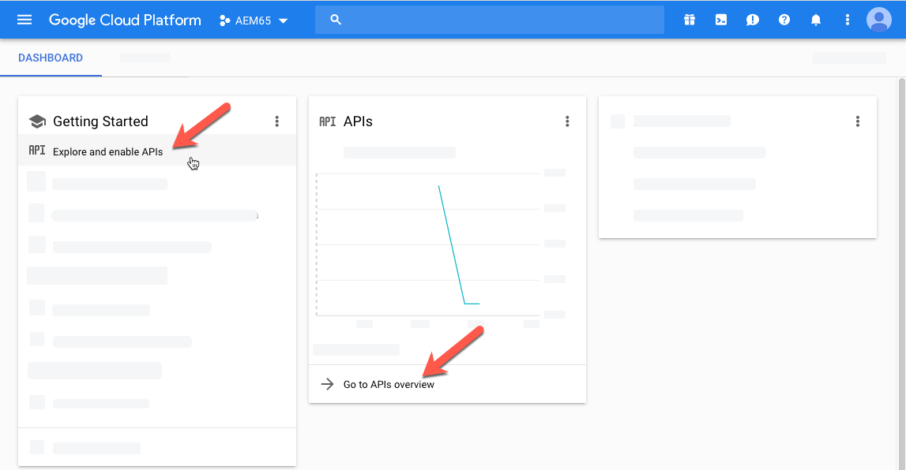

# Dynamic Media視頻 {#video}

本節介紹在Dynamic Media使用視頻。

## 快速啟動：視頻 {#quick-start-videos}

下面的逐步工作流描述旨在幫助您快速啟動並運行Dynamic Media的自適應視頻集。 在每個步驟之後，都會交叉引用主題標題，您可以在其中查找詳細資訊。

>[!IMPORTANT]
>
>在Dynamic Media處理視頻之前，請確保您的Adobe Experience Manager管理員已在Dynamic Media-Scene7模式或Dynamic Media — 混合模式下啟用並配置了Dynamic MediaCloud Services。
>
>* 請參閱 [配置Dynamic MediaCloud Services](/help/assets/config-dms7.md#configuring-dynamic-media-cloud-services) 配置Dynamic Media-Scene7模式和 [診斷Dynamic Media-Scene7模式](/help/assets/troubleshoot-dms7.md)。
>
>* 請參閱 [配置Dynamic MediaCloud Services](/help/assets/config-dynamic.md#configuring-dynamic-media-cloud-services) 配置Dynamic Media — 混合模式。
>
>Dynamic Media當前已知的視頻播放問題 *僅Experience Manager6.5.9.0*:
>
>* 如果已發佈的視頻已更新，則必須再次發佈該視頻以反映交付時的更改。
>


1. **上傳你的Dynamic Media視頻** 執行以下操作：

   * 建立您自己的視頻編碼配置檔案。 或者，您只需使用預定義的 _自適應視頻編碼_ Dynamic Media的檔案。

      * [建立視頻編碼配置檔案](/help/assets/video-profiles.md#creating-a-video-encoding-profile-for-adaptive-streaming)。
      * 瞭解有關 [視頻編碼的最佳做法](#best-practices-for-encoding-videos)。
   * 將視頻處理配置檔案關聯到一個或多個資料夾，以上載主源視頻。

      * [將視頻配置檔案應用於資料夾](/help/assets/video-profiles.md#applying-a-video-profile-to-folders)。
      * 瞭解有關 [組織數字資產以使用處理配置檔案的最佳做法](/help/assets/organize-assets.md)。
      * 瞭解有關 [組織數字資產](/help/assets/organize-assets.md)。
   * 將主源視頻上載到資料夾。 將視頻添加到資料夾時，會根據分配給資料夾的視頻處理配置檔案對它們進行編碼。

      * Dynamic Media主要支援長度最長為30分鐘、解析度最低大於25 x 25的短格式視頻。
      * 您可以上傳每個高達15 GB的視頻檔案。
      * [上傳視頻](/help/assets/managing-video-assets.md#upload-and-preview-video-assets)。
      * 瞭解有關 [支援的輸入檔案格式](/help/assets/assets-formats.md#supported-multimedia-formats)。
   * 監視方式 [視頻編碼正在進行](#monitoring-video-encoding-and-youtube-publishing-progress) 從資產或工作流視圖。


1. **管理您的Dynamic Media視頻** 執行下列任一操作：

   * 組織、瀏覽和搜索視頻資產

      * [組織數字資產](/help/assets/organize-assets.md)
瞭解有關 [組織數字資產以使用處理配置檔案的最佳做法](organize-assets.md)

      * [搜索視頻資產](search-assets.md#custompredicates) 或 [搜索資產](/help/assets/search-assets.md)
   * 預覽和發佈視頻資產

      * 查看視頻的源視頻和編碼格式副本及其關聯的縮略圖：
         [預覽視頻](managing-video-assets.md#upload-and-preview-video-assets) 或 [預覽資產](previewing-assets.md)
         [查看視頻格式副本](video-renditions.md)
         [管理視頻格式副本](manage-assets.md#managing-renditions)

      * [管理查看器預設](managing-viewer-presets.md)
      * [發佈資產](publishing-dynamicmedia-assets.md)
   * 使用視頻元資料

      * 查看編碼視頻格式副本的屬性，如幀速率、音頻和視頻比特率以及編解碼器：
         [查看視頻格式副本屬性](video-renditions.md)

      * 編輯視頻的屬性，如標題、說明和標籤、自定義元資料欄位：
         [編輯視頻屬性](manage-assets.md#editing-properties)

      * [管理數字資產的元資料](metadata.md)
      * [元資料架構](metadata-schemas.md)
   * 查看、批准和注釋視頻，並維護完整的版本控制

      * [為視頻添加批注](managing-video-assets.md#annotate-video-assets) 或 [注釋資產](manage-assets.md#annotating)

      * [建立版本](manage-assets.md#asset-versioning)
      * [將工作流應用於資產](assets-workflow.md) 查看 [啟動資產的工作流](manage-assets.md#starting-a-workflow-on-an-asset)

      * [審閱資料夾資產](bulk-approval.md)
      * [專案](../sites-authoring/projects.md)


1. **發佈你的Dynamic Media視頻** 執行下列操作之一：

   * 如果將Adobe Experience Manager用作Web內容管理系統，則可以直接將視頻添加到網頁。

      * [將視頻添加到網頁](adding-dynamic-media-assets-to-pages.md)。
   * 如果您使用第三方Web內容管理系統，則可以將視頻連結或嵌入到您的網頁。

      * 使用URL整合視頻：
         [將URL連結到Web應用程式](linking-urls-to-yourwebapplication.md)。

      * 使用網頁上的嵌入代碼整合視頻：
         [將視頻查看器嵌入網頁](embed-code.md)。
   * [將視頻發佈到YouTube](#publishing-videos-to-youtube)。
   * [生成視頻報告](#viewing-video-reports)。

   * [將字幕添加到視頻](#adding-captions-to-video)。


## 在Dynamic Media使用視頻 {#working-with-video-in-dynamic-media}

Dynamic Media的視頻是一種端到端解決方案，它使發佈高質量的自適應視頻在多個螢幕(包括案頭、iOS、Android™、BlackBerry®和Windows移動設備)上流傳輸變得輕鬆。 自適應視頻集將以不同比特率和格式（如400 kbps、800 kbps和1000 kbps）編碼的同一視頻的版本分組。 台式電腦或移動設備檢測可用頻寬。

例如，在iOS移動設備上，它檢測3G、4G或Wi-Fi等頻寬。 然後，自動從自適應視頻集內的各種視頻比特率中選擇正確編碼的視頻。 視頻被流式傳輸到台式機、移動設備或平板電腦。

此外，如果案頭或移動設備上的網路狀況發生變化，則自動切換視頻質量。 此外，如果客戶在案頭上進入全屏模式，自適應視頻集會通過使用更好的解析度來響應，從而改善客戶的觀看體驗。 使用自適應視頻集為客戶在多個螢幕和設備上播放Dynamic Media視頻提供了最佳的可回放。

視頻播放器用於確定在回放期間播放或選擇哪些編碼視頻的邏輯基於以下算法：

1. 視頻播放器基於與在播放器本身中為「初始比特率」設定的值最接近的比特率來載入初始視頻片段。
1. 視頻播放器根據頻寬速度的更改使用以下標準進行切換：

   1. 播放器選擇低於或等於估計頻寬的最高頻寬流。
   1. 玩家只考慮80%的可用頻寬。 但是，如果換了，就比較保守，只有70%，避免高估，立即換回。

有關算法的詳細技術資訊，請參見 [https://android.googlesource.com/platform/frameworks/av/+/master/media/libstagefright/httplive/LiveSession.cpp](https://android.googlesource.com/platform/frameworks/av/+/master/media/libstagefright/httplive/LiveSession.cpp)

對於管理單個視頻和自適應視頻集，支援以下操作：

* 從多種支援的視頻格式和音頻格式上傳視頻，並將視頻編碼為MP4 H.264格式，以便在多個螢幕上播放。 可以使用預定義的自適應視頻預設、單個視頻編碼預設或自定義自己的編碼來控制視頻的質量和大小。

   * 當生成自適應視頻集時，它包括MP4視頻。
   * **注釋**:主視頻/源視頻未添加到自適應視頻集。

* 所有HTML5個視頻查看器中的視頻字幕。
* 利用完整的元資料支援組織、瀏覽和搜索視頻，以有效管理視頻資產。
* 將自適應視頻集傳送到Web和台式機以及移動設備，包括iPhone、iPad、Android™、BlackBerry®和Windows電話。

各種iOS平台支援自適應視頻流。 請參閱 [Dynamic Media觀眾參考指南](https://experienceleague.adobe.com/docs/dynamic-media-developer-resources/library/viewers-aem-assets-dmc/video/c-html5-video-reference.html#video)。

Dynamic Media支援MP4 H.264視頻的移動視頻播放。 您可以在以下位置找到支援此視頻格式的BlackBerry®設備： [BlackBerry®上支援的視頻格式](https://support.blackberry.com/kb/articleDetail?ArticleNumber=000005482)。

您可以在以下位置找到支援此視頻格式的Windows設備： [支援的Windows Phone 8媒體編解碼器](https://docs.microsoft.com/en-us/windows/uwp/audio-video-camera/supported-codecs)

* 使用Dynamic Media視頻查看器預設回放視頻，包括：

   * 單個視頻觀看器。
   * 將視頻和影像內容組合在一起的混合媒體查看器。

* 配置視頻播放器以滿足您的品牌推廣需求。
* 將視頻與您的網站、移動站點或移動應用程式整合，並使用簡單的URL或嵌入代碼。

<!-- See [Dynamic video playback](https://s7d9.scene7.com/s7/uvideo.jsp?asset=GeoRetail/Mop_AVS&config=GeoRetail/Universal_Video1&stageSize=640,480) sample. -->

另請參閱 [Experience Manager Assets和Dynamic Media Classic觀眾](https://experienceleague.adobe.com/docs/dynamic-media-developer-resources/library/viewers-aem-assets-dmc/c-html5-s7-aem-asset-viewers.html#viewers-aem-assets-dmc) 和 [僅查看Experience Manager資產](https://experienceleague.adobe.com/docs/dynamic-media-developer-resources/library/viewers-for-aem-assets-only/c-html5-aem-asset-viewers.html#viewers-for-aem-assets-only)。

## 最佳做法：使用HTML5視頻查看器 {#best-practice-using-the-html-video-viewer}

Dynamic MediaHTML5視頻查看器預設是強大的視頻播放器。 您可以使用它們來避免與HTML5視頻播放相關的許多常見問題。 此外，與移動設備相關的問題，如缺乏自適應流傳輸和案頭瀏覽器訪問限制。

在播放器的設計端，您可以使用標準Web開發工具設計視頻播放器的功能。 例如，您可以使用HTML5和CSS設計按鈕、控制項和自定義海報影像背景，以幫助您以自定義外觀接觸客戶。

在查看器的播放端，它自動檢測瀏覽器的視頻功能。 然後，它使用HLS(HTTP Live Streaming)（也稱為自適應視頻流）來提供視頻服務。 或者，如果這些傳遞方法不存在，則改用HTML5累進。

通過組合成單個玩家，可以執行以下操作：

* 使用HTML5和CSS設計回放元件的能力
* 具有嵌入式播放
* 根據瀏覽器的功能使用自適應和漸進式流

您可以將富媒體內容擴展到案頭用戶和移動用戶，並確保獲得簡化的視頻體驗。

另請參閱 [關於HTML5查看器](https://experienceleague.adobe.com/docs/dynamic-media-developer-resources/library/viewers-for-aem-assets-only/c-html5-aem-asset-viewers.html#viewers-for-aem-assets-only)。

### 使用HTML5視頻查看器在台式電腦和移動設備上回放視頻 {#playback-of-video-on-desktop-computers-and-mobile-devices-using-the-html-video-viewer}

對於案頭和移動自適應視頻流，用於比特率切換的視頻基於自適應視頻集中的所有MP4視頻。

使用HLS或漸進式視頻下載進行視頻回放。 在以前的Experience Manager版本中，如6.0、6.1和6.2，視頻通過HTTP流式傳輸。

但是，在Experience Manager6.3和上，視頻現在通過HTTPS（即HLS）流式傳輸，因為DM網關服務URL始終也使用HTTPS。 此預設行為不會對客戶產生影響。 即，除非瀏覽器不支援HTTPS，否則視頻流始終會通過HTTPS進行。 （見下表）。 所以，

* 如果您有一個HTTPS網站，其中包含HTTPS視頻流，則流處理是正常的。
* 如果HTTP網站具有HTTPS視頻流，則流處理是正常的，並且Web瀏覽器中不存在混合內容問題。

HLS是Apple的自適應視頻流標準，可根據網路頻寬容量自動調整回放。 它還讓客戶可以「查找」到視頻中的任何點，而無需等待視頻的其餘部分下載。

通過在用戶的案頭系統或移動設備上本地下載和儲存視頻來傳送漸進視頻。

下表介紹了使用Dynamic Media視頻查看器在台式電腦和移動設備上播放視頻的設備、瀏覽器和播放方法。

<table>
 <tbody>
  <tr>
   <td><strong>裝置</strong></td>
   <td><strong>瀏覽器</strong></td>
   <td><strong>視頻播放模式</strong></td>
  </tr>
  <tr>
   <td>桌面</td>
   <td>Internet Explorer 9和10</td>
   <td>逐步下載。</td>
  </tr>
  <tr>
   <td>桌面</td>
   <td>Internet Explorer 11+</td>
   <td>在Windows 8和Windows 10上 — 只要請求HLS，就強制使用HTTPS。 已知限制：HLS上的HTTP在此瀏覽器/作業系統組合中不工作<br /> <br /> 在Windows 7上 — 漸進式下載。 使用標準邏輯選擇HTTP與HTTPS協定。</td>
  </tr>
  <tr>
   <td>桌面</td>
   <td>火狐23-44</td>
   <td>逐步下載。</td>
  </tr>
  <tr>
   <td>桌面</td>
   <td>Firefox 45或更高版本</td>
   <td>合肥光源</td>
  </tr>
  <tr>
   <td>桌面</td>
   <td>鉻</td>
   <td>合肥光源</td>
  </tr>
  <tr>
   <td>桌面</td>
   <td>薩法里(Mac)</td>
   <td>合肥光源</td>
  </tr>
  <tr>
   <td>行動</td>
   <td>Chrome（Android™ 6或更早版本）</td>
   <td>逐步下載。</td>
  </tr>
  <tr>
   <td>行動</td>
   <td>Chrome（Android™ 7或更高版本）</td>
   <td>合肥光源</td>
  </tr>
  <tr>
   <td>行動</td>
   <td>Android™（預設瀏覽器）</td>
   <td>逐步下載。</td>
  </tr>
  <tr>
   <td>行動</td>
   <td>薩法里(iOS)</td>
   <td>合肥光源</td>
  </tr>
  <tr>
   <td>行動</td>
   <td>克羅姆語(iOS)</td>
   <td>合肥光源</td>
  </tr>
  <tr>
   <td>行動</td>
   <td>BlackBerry®</td>
   <td>合肥光源</td>
  </tr>
 </tbody>
</table>

## Dynamic Media視頻解決方案的體系結構 {#architecture-of-dynamic-media-video-solution}

下圖顯示了通過DMGateway(在Dynamic Media混合模式下)上傳和編碼並供公眾使用的視頻的總體創作工作流程。


## 用於視頻的混合發佈體系結構 {#hybrid-publishing-architecture-for-videos}


## 編碼視頻的最佳做法 {#best-practices-for-encoding-videos}

的 **Dynamic Media編碼視頻** 如果您啟用了Dynamic Media並設定了視頻雲服務，則工作流會對視頻進行編碼。 此工作流程會擷取工作流程處理歷程記錄和失敗資訊。請參閱 [監視視頻編碼和YouTube發佈進度](#monitoring-video-encoding-and-youtube-publishing-progress)。 如果您已啟用Dynamic Media並設定視頻雲服務， **[!UICONTROL Dynamic Media編碼視頻]** 當您上載視頻時，工作流將自動生效。 (如果你不用Dynamic Media, **[!UICONTROL DAM更新資產]** 工作流生效。)

<!-- DEAD The following are best-practice tips for encoding source video files.

For advice about video encoding, see [Video Encoding Basics](https://www.adobe.com/go/learn_s7_encoding_en).

* [Streaming 101: The Basics — Codecs, Bandwidth, Data Rate, and Resolution](https://www.adobe.com/go/learn_s7_streaming101_en). -->

### 源視頻檔案 {#source-video-files}

對視頻檔案進行編碼時，請使用盡可能高質量的源視頻檔案。 避免使用以前編碼的視頻檔案，因為這些檔案已經壓縮，而進一步編碼會造成質量欠佳的視頻。

* Dynamic Media主要支援長度最長為30分鐘、解析度最低大於25 x 25的短格式視頻。
* 您可以上載每個高達15 GB的主源視頻檔案。

下表介紹了在對源視頻檔案進行編碼之前必須具有的建議大小、長寬比和最小比特率：

| 大小 | 外觀比例 | 最小比特率 |
|--- |--- |--- |
| 1024 X 768 | 4:3 | 4500 kbps，用於大多數視頻。 |
| 1280 X 720 | 16:9 | 3000 - 6000 kbps，具體取決於視頻中的運動量。 |
| 1920 X 1080 | 16:9 | 6000 - 8000 kbps，具體取決於視頻中的運動量。 |

### 獲取檔案的元資料 {#obtaining-a-file-s-metadata}

您可以通過使用視頻編輯工具查看檔案的元資料，或使用設計用於獲取元資料的應用程式來獲取檔案的元資料。 以下是使用第三方應用程式MediaInfo獲取視頻檔案元資料的說明：

1. 轉到 [MediaInfo下載](https://mediaarea.net/en/MediaInfo/Download)。
1. 選擇並下載GUI版本的安裝程式，並按照安裝說明進行操作。
1. 安裝後，按一下右鍵視頻檔案（僅限Windows）並選擇「MediaInfo」，或開啟MediaInfo並將視頻檔案拖到應用程式中。 您可以看到與視頻檔案關聯的所有元資料，包括其寬度、高度和fps。

### 外觀比例 {#aspect-ratio}

選擇或為主源視頻檔案建立視頻編碼預設時，請確保預設具有與主源視頻檔案相同的長寬比。 縱橫比是視頻寬度與高度的比值。

要確定視頻檔案的長寬比，請獲取檔案的元資料並記錄檔案的寬度和高度（請參閱上面的獲取檔案的元資料）。 然後使用此公式確定縱橫比：

寬高=寬高比

下表說明公式結果如何轉換為通用縱橫比選擇：

| 公式結果 | 外觀比例 |
|--- |--- |
| 1.33 | 4:3 |
| 零點七五 | 3:4 |
| 一點七八 | 16:9 |
| 0.56 | 9時16分 |

例如，寬度為1440 x 1080的視頻的寬高比為1440/1080或1.33。在這種情況下，您選擇具有4:3長寬比的視頻編碼預設來編碼視頻檔案。

### 位元速率 {#bitrate}

比特率是編碼的資料量，它構成視頻回放的一秒鐘。 比特率以千位每秒(Kbps)為單位。

>[!NOTE]
>
>由於所有編解碼器都使用有損壓縮，因此比特率是視頻質量中最重要的因素。 在有損壓縮中，對視頻檔案的壓縮越多，質量就越降低。 因此，所有其它特性（解析度、幀速率和編解碼器）相等，比特率越低，壓縮檔案的質量越低。

選擇比特率編碼時，可以選擇兩種類型：

* **[!UICONTROL 恆定比特率編碼]** (CBR) — 在CBR編碼期間，比特率或每秒的比特數在整個編碼過程中保持相同。 CBR編碼在整個視頻上將設定的資料速率保留為您的設定。 此外，CBR編碼不會為質量優化媒體檔案，而會節省儲存空間。
如果視頻在整個視頻中包含類似的運動級別，則使用CBR。 CBR是流視頻內容最常用的算法。 另請參閱 [使用自定義添加的視頻編碼參數](/help/assets/video-profiles.md#using-custom-added-video-encoding-parameters)。

* **[!UICONTROL 可變比特率編碼]** (VBR)- VBR編碼根據壓縮器所需的資料，將資料速率調低並調整到您設定的上限。 此功能意味著在VBR編碼過程中，媒體檔案的比特率會根據媒體檔案的比特率需求動態地增加或減少。
VBR編碼時間較長，但效果最好；媒體檔案的質量優越。 VBR最常用於視頻內容的http漸進傳送。

您何時使用VBR與CRB?
選擇VBR與CBR時，幾乎總是建議您將VBR用於媒體檔案。 VBR以競爭比特率提供更高質量的檔案。 使用VBR時，請確保使用兩遍編碼，並將最大比特率設定為目標視頻比特率的1.5倍。

選擇視頻編碼預設時，請記住目標最終用戶的連接速度。 選擇資料速率為該速度80%的預設。 例如，如果目標最終用戶的連接速度是1000 Kbps，則最佳預設值是視頻資料速率為800 Kbps。

此表介紹了典型連接速度的資料速率。

| 速度(Kbps) | 連接類型 |
|--- |--- |
| 256 | 撥號連接。 |
| 800 | 典型的移動連接。 對於此連接，針對3G體驗，將資料速率定為400到最大800。 |
| 2000 | 典型寬頻案頭連接。 對於此連接，以800-2000 Kbps範圍內的資料速率為目標，大多數目標的平均速率為1200-1500 Kbps。 |
| 5000 | 典型的高寬頻連接。 建議不要在此上限範圍內進行編碼，因為大多數消費者無法以此速度進行視頻傳輸。 |

### 解析度 {#resolution}

**解決** 描述視頻檔案的高度和寬度（以像素為單位）。 大多數源視頻都以高解析度儲存（例如，1920 x 1080）。 為了流式傳輸，源視頻被壓縮到更小的解析度（640 x 480或更小）。

解析度和資料速率是決定視頻質量的兩個整體聯繫的因素。 要保持相同的視頻質量，視頻檔案中的像素數越多（解析度越高），資料速率就越高。 例如，請考慮320 x 240解析度和640 x 480解析度視頻檔案中每幀的像素數：

| 解析度 | 每幀像素 |
|--- |--- |
| 320 x 240 | 7萬6千8百 |
| 640 x 480 | 30.72萬 |

640 x 480檔案每幀的像素數是原來的四倍。 為了對這兩個示例解析度實現相同的資料速率，對640 x 480檔案應用四倍的壓縮，這會降低視頻質量。 因此，250 Kbps的視頻資料速率可以以320 x 240的解析度而不是以640 x 480的解析度來提供高質量的觀看。

通常，您使用的資料速率越高，視頻外觀越好，解析度越高，您必須保持查看質量的資料速率越高（與解析度較低相比）。

由於解析度和資料速率是連結的，因此在編碼視頻時有兩個選項：

* 選擇資料速率，然後以最高解析度進行編碼，該解析度在您選擇的資料速率上看起來良好。
* 選擇解析度，然後按所需的資料速率進行編碼，以便以您選擇的解析度獲得高質量視頻。

為主源視頻檔案選擇（或建立）視頻編碼預設時，請使用此表以正確的解析度為目標：

| 解析度 | 高度 (像素) | 螢幕大小 |
|--- |--- |--- |
| 240p | 240 | 小螢幕 |
| 300p | 300 | 通常用於移動設備的小螢幕 |
| 360p | 360 | 小螢幕 |
| 480p | 480 | 中屏 |
| 720p | 720 | 大螢幕 |
| 1080p | 1080 | 高清大螢幕 |

### Fps（每秒幀數） {#fps-frames-per-second}

在美國和日本，大多數視頻的拍攝速度是每秒29.97幀(fps);在歐洲，大多數視頻的拍攝速度是25 fps。 影片以24幀/秒的速度拍攝。

選擇與主源視頻檔案的fps速率匹配的視頻編碼預設。 例如，如果主源視頻為25 fps，請選擇一個25 fps的編碼預設。 預設情況下，所有自定義編碼都使用主源視頻檔案的fps。 因此，建立視頻編碼預設時不需要顯式指定fps設定。

### 視頻編碼維度 {#video-encoding-dimensions}

為獲得最佳結果，請選擇編碼尺寸，使源視頻是所有編碼視頻的整倍。

要計算此比率，請將源寬度除以編碼寬度，以獲得寬度比。 然後，將源高度除以編碼高度，得到高度比。

如果得到的比率是整整數，則表示視頻被最優縮放。 如果結果比率不是整數，則它會通過將剩餘像素偽像留在顯示器上而影響視頻質量。 當視頻有文本時，此效果最為明顯。

例如，假設源視頻為1920 x 1080。 在下表中，三個編碼視頻提供了要使用的最佳編碼設定。

| 視頻類型 | 寬x高 | 寬度比例 | 高度比 |
|--- |--- |--- |--- |
| 來源 | 1920x1080 | 1 | 1 |
| 編碼 | 960 x 540 | 2 | 2 |
| 編碼 | 640 x 360 | 3 | 3 |
| 編碼 | 480 x 270 | 4 | 4 |

### 編碼視頻檔案格式 {#encoded-video-file-format}

Dynamic Media建議使用MP4 H.264視頻編碼預設。 由於MP4檔案使用H.264視頻編解碼器，因此它提供高質量的視頻，但檔案大小是壓縮的。

## 將視頻發佈到YouTube {#publishing-videos-to-youtube}

您可以直接將內部Experience Manager視頻資產發佈到以前建立的YouTube渠道。

要向YouTube發佈視頻資產，請設定帶標籤的Experience Manager Assets。 將這些標籤與YouTube頻道關聯。 如果視頻資產的標籤與YouTube頻道的標籤匹配，則視頻將發佈到YouTube。 只要使用關聯的標籤，發佈到YouTube就會與視頻的正常發佈一起發生。

YouTube自己編碼。 因此，上傳到Experience Manager的原始視頻檔案將發佈到YouTube，而不是Dynamic Media編碼建立的任何視頻格式副本。 雖然不需要使用Dynamic Media處理視頻，但在播放時需要觀眾預設時，應該會這樣做。

當您繞過視頻處理配置檔案並直接發佈到YouTube時，這僅僅意味著您的Experience Manager資產中的視頻資產無法獲得可查看的縮略圖。 這也意味著如果你跑進去 `dynamicmedia` 或 `dynamicmedia_scene7` 運行模式，未編碼的視頻不適用於任何Dynamic Media資產類型。

向YouTube伺服器發佈視頻資產涉及完成以下任務，以確保與YouTube進行安全、安全的伺服器對伺服器身份驗證：

1. [配置Google雲設定](#configuring-google-cloud-settings)
1. [建立YouTube頻道](#creating-a-youtube-channel)
1. [添加用於發佈的標籤](#adding-tags-for-publishing)
1. [啟用YouTube發佈複製代理](#enabling-the-youtube-publish-replication-agent)
1. [設定YouTubeExperience Manager](#setting-up-youtube-in-aem)
1. [（可選）自動設定上載視頻的預設YouTube屬性](#optional-automating-the-setting-of-default-youtube-properties-for-your-uploaded-videos)
1. [將視頻發佈到您的YouTube頻道](#publishing-videos-to-your-youtube-channel)
1. [（可選）驗證YouTube上發佈的視頻](/help/assets/video.md#optional-verifying-the-published-video-on-youtube)
1. [將YouTubeURL連結到Web應用程式](#linking-youtube-urls-to-your-web-application)

您也可以 [取消發佈視頻，從YouTube](#unpublishing-videos-to-remove-them-from-youtube)。

### 配置Google雲設定 {#configuring-google-cloud-settings}

要發佈到YouTube，你需要一個Google帳戶。 如果你有GMAIL賬戶，那麼你已經有Google賬戶了；如果您沒有Google帳戶，則可以輕鬆建立一個帳戶。 您需要該帳戶，因為您需要憑據將視頻資產發佈到YouTube。 如果已建立帳戶，則跳過此任務並直接轉到 [建立YouTube頻道](#creating-a-youtube-channel)。

與Google雲使用的帳戶和用於YouTube的Google帳戶不必相同。

Google定期更改其用戶介面。 因此，向YouTube發佈視頻的步驟與下面記錄的步驟稍有不同。 當您嘗試檢查視頻是否上傳到YouTube時，此警告也適用。

>[!NOTE]
>
>在編寫本文時，以下步驟是準確的。 不過，Google會不經通知就定期更新網站。 因此，這些步驟可能略有不同。

配置Google雲設定：

1. 建立Google帳戶。
   [https://accounts.google.com/SignUp?service=mail](https://accounts.google.com/SignUp?service=mail)

   如果您已擁有Google帳戶，請跳至下一步。

1. 轉到 [https://cloud.google.com/](https://cloud.google.com/)。
1. 在Google cloud頁面的右上角，按一下「主控台」 ****。

   如有必要， **[!UICONTROL 登錄]** 使用你的Google帳戶憑據查看 **[!UICONTROL 控制台]** 的雙曲餘切值。

1. 在儀表板頁面的右側 **[!UICONTROL Google雲平台]**，按一下「項目」(Project)下拉清單以開啟「選擇項目」(Select a Project)對話框。
1. 在「選擇項目」對話框中，按一下 **[!UICONTROL 新建項目]**。

   

1. 在「新建項目」對話框的「項目名稱」欄位中，鍵入新項目的名稱。

   您的項目ID基於您的項目名稱。 因此，仔細選擇項目名稱；建立後無法更改。 此外，以後在Experience Manager中設定YouTube時，必須再次輸入相同的項目ID;考慮寫下來。

1. 按一下&#x200B;**[!UICONTROL 建立]**。

1. 執行下列任一操作：

   * 在項目的儀表板上，在「入門」卡中，點擊 **[!UICONTROL 瀏覽和啟用API]**。
   * 在項目的儀表板上，在API卡中，點擊 **[!UICONTROL 轉到API概述]**。

   

1. 在「APIs &amp; Services（API和服務）」頁面頂部附近，點擊 **[!UICONTROL 啟用API和服務]**。
1. 在「API庫」頁的左側，在 **[!UICONTROL 類別]**&#x200B;按一下 **[!UICONTROL YouTube]**。 在頁面的右側，點擊 **[!UICONTROL YouTube資料API]**。
1. 在「YouTube資料API v3」頁上，點擊 **[!UICONTROL 啟用]**。

   

1. 要使用API，需要憑據。 如有必要，按一下 **[!UICONTROL 建立憑據]**。

   

1. 在 **[!UICONTROL 向項目添加憑據]** 頁面，步驟1，執行以下操作：

   * 從 **[!UICONTROL 您正在使用哪個API?]** 下拉清單，選擇 **[!UICONTROL YouTube資料API v3]**。

   * 從 **[!UICONTROL 您從何處調用API?]** 下拉清單，選擇 **[!UICONTROL Web伺服器（例如，node.js、Tomcat）]**

   * 從 **[!UICONTROL 您正在訪問哪些資料？]** 下拉清單，點擊 **[!UICONTROL 用戶資料]**。

   

1. 點擊 **[!UICONTROL 我需要什麼憑證？]**
1. 在「 **[!UICONTROL 新增認證至您的專案]** 」頁面的「建立OAuth 2.0用戶端ID **** 」標題下，視需要在「名稱」欄位中輸入唯一名稱。或者，您可以使用Google指定的預設名稱。
1. 在 **[!UICONTROL 已授權的JavaScript源]** 標題，在文本欄位中，輸入以下路徑，替換路徑中的域和埠號，然後按 **[!UICONTROL 輸入]** 將路徑添加到清單：

   `https://<servername.domain>:<port_number>`

   例如， `https://1a2b3c.mycompany.com:4321`

   **注釋**:上面的路徑示例僅供演示之用。

   

1. 在 **[!UICONTROL 授權重定向URI]** 標題，在文本欄位中，輸入以下路徑，替換路徑中的域和埠號，然後按 **[!UICONTROL 輸入]** 將路徑添加到清單：

   `https://<servername.domain>:<port_number>/etc/cloudservices/youtube.youtubecredentialcallback.json`

   例如， `https://1a2b3c.mycompany.com:4321/etc/cloudservices/youtube.youtubecredentialcallback.json`

   **注釋**:上面的路徑示例僅供演示之用。

1. 按一下 **[!UICONTROL 建立OAuth客戶端ID]**。
1. 在「 **[!UICONTROL 新增認證至您的專案]****** 」頁面的「設定OAuth 2.0同意書」畫面標題下方，選取您目前使用的Gmail電子郵件地址。

   

1. 在 **[!UICONTROL 顯示給用戶的產品名稱]** 標題，在文本欄位中，輸入要在同意螢幕上顯示的內容。

   當Experience Manager管理員向YouTube進行身份驗證時，會向其顯示同意螢幕；Experience Manager聯繫YouTube請其允許。

1. 按一下 **[!UICONTROL 繼續]**。
1. 在「新增認證至您的專案」頁面的「下載認證」標題下，點選「 **[!UICONTROL 下載]** 」 **[!UICONTROL 步驟4]**。

   

1. 保存 `client_id.json` 的子菜單。

   稍後在Adobe Experience Manager設定YouTube時，您需要此下載的json檔案。

1. 按一下 **[!UICONTROL 完成]**。

   註銷你的Google帳戶。 現在建立一個YouTube頻道。

### 建立YouTube頻道 {#creating-a-youtube-channel}

向YouTube發佈視頻需要您有一個或多個渠道。 如果已建立YouTube頻道，則可以跳過此任務並轉到 [添加用於發佈的標籤](/help/assets/video.md#adding-tags-for-publishing)。

>[!WARNING]
>
>確保已在YouTube設定一個或多個頻道 *先* 在Experience Manager中的YouTube設定下添加頻道(請參閱 [設定YouTubeExperience Manager](#setting-up-youtube-in-aem) )。 如果您未能設定一個或多個頻道，則系統不會警告您不存在頻道。 但是，添加頻道時仍會進行Google驗證，但無法選擇發送視頻的頻道。

**要建立YouTube頻道：**

1. 轉到 [https://www.youtube.com](https://www.youtube.com/) 並使用你的Google帳戶憑據登錄。
1. 在YouTube頁面的右上角，按一下您的配置檔案圖片（也可以顯示為實心彩色圓圈中的字母），然後按一下 **[!UICONTROL YouTube設定]** （圓齒輪表徵圖）。
1. 在「概述」(Overview)頁面的「附加功能」(Additional Features)標題下，按一下 **[!UICONTROL 查看我的所有頻道或建立頻道]**。
1. 在「通道」頁面上，按一下 **[!UICONTROL 建立新渠道]**。
1. 在「品牌帳戶」頁面的「品牌帳戶名稱」欄位中，輸入您選擇的發佈視頻資產的位置的企業名稱或任何其他渠道名稱，然後按一下 **[!UICONTROL 建立]**。

   記住在此處輸入的名稱，因為在Experience Manager中設定YouTube時必須再次輸入該名稱。

1. （可選）如有必要，請添加更多通道。

   現在添加用於發佈的標籤。

### 添加用於發佈的標籤 {#adding-tags-for-publishing}

要發佈到您的視頻到YouTube,Experience Manager會將標籤關聯到一個或多個YouTube頻道。 要添加用於發佈的標籤，請參見 [管理標籤](/help/sites-administering/tags.md)。

或者，如果要在Experience Manager中使用預設標籤，可以跳過此任務並轉到 [啟用YouTube發佈複製代理](#enabling-the-youtube-publish-replication-agent)。

### 啟用YouTube發佈複製代理 {#enabling-the-youtube-publish-replication-agent}

啟用YouTube發佈複製代理後，如果要test到Google雲帳戶的連接，請點擊 **[!UICONTROL Test連接]**。 瀏覽器頁籤顯示連接結果。 如果已添加「YouTube頻道」，則清單將作為test的一部分顯示。

1. 在Experience Manager的左上角，按一下Experience Manager徽標，然後在左滑軌中按一下 **[!UICONTROL 工具]** > **[!UICONTROL 部署]** > **[!UICONTROL 複製]** > **[!UICONTROL 作者代理]**。
1. 在「作者代理」頁上，按一下 **[!UICONTROL YouTube出版]**。
1. 在工具欄上，按一下「設定」(Settings)右側的 **[!UICONTROL 編輯]**。
1. 選擇 **[!UICONTROL 已啟用]** 複選框，以便您可以開啟複製代理。
1. 按一下&#x200B;**[!UICONTROL 「確定」]**。

   現在在YouTube設Experience Manager。

### 設定YouTubeExperience Manager {#setting-up-youtube-in-aem}

從Experience Manager6.4開始，介紹了一種新的觸摸式用戶介面方法，用於Experience Manager建立YouTube出版。 根據您正在使用的Experience Manager的已安裝實例，執行以下操作之一：

* 要在6.4之前的Experience Manager中配置YouTube，請參見 [在6.4之前在Experience Manager建立YouTube](/help/assets/video.md#setting-up-youtube-in-aem-before)。
* 要在Experience Manager6.4或更高版本中配置YouTube，請參見 [在Experience Manager6.4及更高版本中設定YouTube](#setting-up-youtube-in-aem-and-later)。

#### 在Experience Manager6.4及更高版本中設定YouTube {#setting-up-youtube-in-aem-and-later}

1. 確保以管理員身份登錄到Dynamic Media實例。
1. 在左上角，點擊Experience Manager徽標，然後在左滑軌中點擊 **[!UICONTROL 工具]**（錘子表徵圖）> **[!UICONTROL Cloud Services]** > **[!UICONTROL YouTube發佈配置]**。
1. 點擊 **[!UICONTROL 全球]** （不選）。

1. 在全局頁面的右上角，點擊 **[!UICONTROL 建立]**。
1. 在「建立YouTube設定」頁面的「Google cloud 平台設定」下方的「應用程式名稱」欄位 **[!UICONTROL 中]** ，輸入Google專案ID。

   您最初在較早配置Google雲設定時指定了項目ID。
保持「建立YouTube配置」頁面開啟；過一會，你就會回到它。

   

1. 使用純文字檔案編輯器，開啟您在任務早期下載並保存的JSON檔案 [配置Google雲設定](/help/assets/video.md#configuring-google-cloud-settings)。
1. 選擇並複製整個JSON文本。
1. 返回YouTube帳戶設定對話方塊。在「 **[!UICONTROL JSON設定」欄位中]** ，貼上JSON文字。
1. 在頁面的右上角，點擊 **[!UICONTROL 保存]**。

   現在在YouTube開設Experience Manager頻道。

1. 點擊 **[!UICONTROL 添加通道]**。
1. 在「渠道名稱」欄位中，輸入您在任務中建立的渠道的名稱 **[!UICONTROL 向YouTube添加一個或多個頻道]** 早些。

   如果需要，您可以根據需要添加說明。

1. 點擊 **[!UICONTROL 添加]**。
1. 顯示YouTube/Google驗證。 如果您尚未登錄Google雲帳戶，則跳過此步驟。

   * 輸入與上面的Google項目ID和JSON文本關聯的Google用戶名和密碼。
   * 根據您的帳戶有多少個渠道，您可以看到兩個或多個項目。 選擇一個頻道。 不要選擇電子郵件地址；不是頻道。
   * 在下一頁，點擊 **[!UICONTROL 接受]** 允許訪問此頻道。

1. 點擊 **[!UICONTROL 允許]**。

   現在設定發佈標籤。

1. **[!UICONTROL 設定發佈標籤]**  — 在「Cloud Services」>「YouTube」頁面上，按一下鉛筆表徵圖以編輯要使用的標籤清單。
1. 按一下下拉清單表徵圖（倒置插入符號），以便在Experience Manager中顯示可用標籤的清單。
1. 點擊一個或多個標籤，以便添加標籤。

   要刪除已添加的標籤，請選擇該標籤，然後點擊 **[!UICONTROL X]**。

1. 添加完所需標籤後，點擊 **[!UICONTROL 保存]**。

   現在你將視頻發佈到你的YouTube頻道。

#### 在6.4之前在Experience Manager建立YouTube {#setting-up-youtube-in-aem-before}

1. 確保以管理員身份登錄到Dynamic Media實例。

1. 在左上角，點擊Experience Manager徽標，然後在左滑軌中點擊 **[!UICONTROL 工具]** （錘子表徵圖）> **[!UICONTROL 部署]** > **[!UICONTROL Cloud Services]**。
1. 在第三方服務標題下，在YouTube下，點擊 **[!UICONTROL 立即配置]**。
1. 在「建立配置」對話框中，在相應欄位中輸入標題（必需）和名稱（可選）。
1. 點擊 **[!UICONTROL 建立]**。
1. 在「YouTube帳戶設定」對話方塊的「應用程式名 **[!UICONTROL 稱」欄位中]** ，輸入Google專案ID。

   最初指定項目ID時 [已配置Google雲設定](/help/assets/video.md#configuring-google-cloud-settings) 早些。
保持「YouTube帳戶設定」對話框開啟；你馬上就會回到這裡。

1. 使用純文字檔案編輯器，開啟在「配置Google雲」設定任務中先前下載並保存的JSON檔案。
1. 選擇並複製整個JSON文本。
1. 返回YouTube帳戶設定對話方塊。在「 **[!UICONTROL JSON設定」欄位中]** ，貼上JSON文字。
1. 點擊 **[!UICONTROL 確定]**。

   現在在YouTube開設Experience Manager頻道。

1. 在「可用頻道」 **[!UICONTROL 的右側]**，點 **選+**  (加號圖示)。
1. 在「YouTube頻道設定」對話方塊的「標題」欄位中，輸入您在「先前新增一或多個頻道至YouTube」工作中建立的頻道名稱 **** 。

   如果需要，您可以根據需要添加說明。

1. 點擊 **[!UICONTROL 確定]**。
1. 顯示YouTube/Google驗證。 如果您尚未登錄Google雲帳戶，則跳過此步驟。

   * 輸入與上面的Google項目ID和JSON文本關聯的Google用戶名和密碼。
   * 根據您的帳戶有多少個渠道，您可以看到兩個或多個項目。 選擇一個頻道。 不要選擇電子郵件地址；不是頻道。
   * 在下一頁，點擊 **[!UICONTROL 接受]** 允許訪問此頻道。

1. 點擊 **[!UICONTROL 允許]**。

   現在設定發佈標籤。

1. **[!UICONTROL 設定發佈標籤]**  — 在「Cloud Services」>「YouTube」頁面上，按一下鉛筆表徵圖以編輯要使用的標籤清單。
1. 按一下下拉清單表徵圖（倒置插入符號），以便在Experience Manager中顯示可用標籤的清單。
1. 點擊一個或多個標籤，以便添加標籤。

   要刪除已添加的標籤，請選擇該標籤，然後點擊 **X**。

1. 添加完所需標籤後，點擊 **[!UICONTROL 確定]**。

   現在你將視頻發佈到你的YouTube頻道。

### （可選）自動設定上載視頻的預設YouTube屬性 {#optional-automating-the-setting-of-default-youtube-properties-for-your-uploaded-videos}

通過在Experience Manager中建立元資料處理配置檔案，您可以選擇在上傳視頻時自動設定YouTube屬性。

若要建立中繼資料處理設定檔，您必須先從「欄位標籤 **[!UICONTROL 」、「對應至屬性]********** 」和「選擇」欄位複製值，這些全都可在視訊的中繼資料結構中找到。然後，通過將這些值添加到您的YouTube視頻元資料處理配置檔案中來構建這些值。

要自動設定上載視頻的預設YouTube屬性，請執行以下操作：

1. 在左上角，點擊Experience Manager徽標，然後在左滑軌中按一下 **[!UICONTROL 工具]** （錘子表徵圖）> **[!UICONTROL 資產]** > **[!UICONTROL 元資料架構]**。
1. 按一下 **[!UICONTROL 預設]**。 （不要在「default」左側的選擇框中添加複選標籤。）
1. 在 **[!UICONTROL 預設]** 頁面，選中 **[!UICONTROL 視頻]**，然後按一下 **[!UICONTROL 編輯]**。
1. 在「元資料架構編輯器」頁上，按一下 **[!UICONTROL 高級]** 頁籤。
1. 在「YouTube發佈」標題下，按一下「 **[!UICONTROL YouTube類別」]**。
1. 在頁面的右側，在 **[!UICONTROL 設定]** 頁籤中，執行以下操作：

   * 在 **[!UICONTROL 映射到屬性]** 文本欄位，選擇並複製值。
將複製的值貼上到開啟的文本編輯器中。 以後建立元資料處理配置檔案時，您將需要此值。 保持文本編輯器開啟。

   * 下 **[!UICONTROL 選擇]**，選擇並複製您要使用的預設值（如「人員和部落格」或「科學與技術」）。
將複製的值貼上到開啟的文本編輯器中。 以後建立元資料處理配置檔案時，您將需要此值。 保持文本編輯器開啟。

1. 在「YouTube出版」標題下，點擊 **[!UICONTROL YouTube隱私]**。
1. 在頁面的右側，在 **[!UICONTROL 設定]** 頁籤中，執行以下操作：

   * 在 **[!UICONTROL 映射到屬性]** 文本欄位，選擇並複製值。
將複製的值貼上到開啟的文本編輯器中。 以後建立元資料處理配置檔案時，您將需要此值。 保持文本編輯器開啟。

   * 下 **[!UICONTROL 選擇]**，選擇並複製要使用的預設值。 請注意，「選項」(Choices)分成兩對。 對中的底部欄位是要複製的預設值，如公共、未列出或私有。
將複製的值貼上到開啟的文本編輯器中。 以後建立元資料處理配置檔案時，您將需要此值。 保持文本編輯器開啟。

1. 在「元資料架構編輯器」頁的右上角，按一下 **[!UICONTROL 取消]**。
1. 在Experience Manager的左上角，按一下Experience Manager徽標，然後在左滑軌中按一下 **[!UICONTROL 工具]** （錘子表徵圖）> **[!UICONTROL 資產]** > **[!UICONTROL 元資料配置檔案]**。

1. 在「元資料概要檔案」頁面的右上角附近，按一下 **[!UICONTROL 建立]**。
1. 在「新增中繼資料描述檔」對話方塊的「描述檔標題 **[!UICONTROL 」文字欄位中，輸入名稱，]** 然後按一下「 `YouTube Video` 建立 ****」。
1. 在「元資料配置檔案編輯器」頁上，按一下 **[!UICONTROL 先進]** 頁籤。
1. 通過執行以下操作將複製的YouTube發佈值添加到配置檔案：

   * 在頁面的右側，按一下 **[!UICONTROL 生成窗體]** 頁籤。
   * （可選）拖動標有 **[!UICONTROL 節標題]** 左邊，然後放到窗體區域。
   * （可選）按一下 **[!UICONTROL 欄位標籤]** 的子菜單。
   * （可選）在頁面右側的「設定」頁籤下的「欄位標籤」文本欄位中，輸入 `YouTube Publishing`。
   * 按一下 **[!UICONTROL 生成窗體]** 頁籤，然後拖動標籤為 **[!UICONTROL 多值文本]** 放在下面 **[!UICONTROL YouTube出版]** 建立的標題。

   * 按一下 **[!UICONTROL 欄位標籤]** 這樣，元件即被選中。
   * 在頁面右側的「設定」頁籤下，將先前複製的YouTube發佈值（欄位標籤值和映射到屬性值）貼上到窗體中的相應欄位中。 將「選擇」值貼上到「預設值」欄位。

1. 通過執行以下操作將複製的YouTube隱私值添加到配置檔案：

   * 在頁面的右側，按一下 **[!UICONTROL 生成窗體]** 頁籤。
   * （可選）拖動標有 **[!UICONTROL 節標題]** 左邊，然後放到窗體區域。
   * （可選）按一下 **[!UICONTROL 欄位標籤]** 的子菜單。
   * （可選）在頁面右側的「設定」頁籤下的「欄位標籤」文本欄位中，輸入 `YouTube Privacy`。
   * 按一下 **[!UICONTROL 生成窗體]** 頁籤，然後拖動標籤為 **[!UICONTROL 多值文本]** 放在下面 **[!UICONTROL YouTube隱私]** 的子菜單。

   * 按一下 **[!UICONTROL 欄位標籤]** 這樣，元件即被選中。
   * 在頁面右側的「設定」頁籤下，將先前複製的YouTube發佈值（欄位標籤值和映射到屬性值）貼上到窗體中的相應欄位中。 將「選擇」值貼上到「預設值」欄位。

1. 在頁面的右上角附近，按一下「儲 **[!UICONTROL 存」]**。
1. 將YouTube發佈元資料配置檔案應用到要上載視頻的資料夾。 必須同時設定元資料配置檔案和視頻配置檔案。

   請參 [閱中繼資料](/help/assets/metadata-config.md#metadata-profiles)[描述檔和視訊描述檔](/help/assets/video-profiles.md)。

### 將視頻發佈到您的YouTube頻道 {#publishing-videos-to-your-youtube-channel}

現在，您將先前添加的標籤與視頻資產相關聯。 此過程使Experience Manager知道要發佈到您的YouTube渠道的資產。

>[!NOTE]
>
>在Dynamic Media-Scene7模式下運行時，立即發佈不會自動發佈到YouTube。 設定Dynamic Media-Scene7模式時，有兩個發佈選項可供選擇： **[!UICONTROL 立即]** 或 **[!UICONTROL 激活後]**。
>
>**[!UICONTROL 立即發佈]** 表示上載的資產在與IPS同步後自動發佈到傳遞系統。 雖然Dynamic Media是如此，但YouTube並非如此。 要發表到YouTube，必須以Experience Manager作者的方式發表。

>[!NOTE]
>
>要從YouTube發佈內容，Experience Manager使用 **[!UICONTROL 發佈到YouTube]** 工作流，它允許您監視進度並查看任何故障資訊。
>
>請參閱 [監視視頻編碼和YouTube發佈進度](#monitoring-video-encoding-and-youtube-publishing-progress)。
>
>有關更詳細的進度資訊，您可以監視複製下的YouTube日誌。 但是，請注意，此類監視需要管理員訪問權限。

**要將視頻發佈到您的YouTube頻道：**

1. 在Experience Manager中，導航到要發佈到YouTube頻道的視頻資產。
1. 選擇視頻資產（自適應視頻集）。
1. 在工具欄上，按一下 **[!UICONTROL 屬性]**。
1. 在「基本」頁籤的「元資料」標題下，按一下 **[!UICONTROL 開啟選擇對話框]** 的子菜單。
1. 在「選擇標籤」頁上，導航到要使用的標籤，然後選擇一個或多個標籤。

   請記住，標籤必須與YouTube頻道關聯。

1. 在頁面的右上角，按一下 **[!UICONTROL 選擇]**。
1. 在視頻的屬性頁面的右上角，按一下 **[!UICONTROL 保存並關閉]**。
1. 在工具欄上，按一下 **[!UICONTROL 快速發佈]**。

   另請參閱 [將出版管理與Experience Manager Sites](https://experienceleague.adobe.com/docs/experience-manager-learn/sites/page-authoring/publication-management-feature-video-use.html)。

   您可以選擇驗證您的YouTube頻道上發佈的視頻。

### （可選）驗證YouTube上發佈的視頻 {#optional-verifying-the-published-video-on-youtube}

您可以選擇監視YouTube發佈（或取消發佈）的進度。

請參閱 [監視視頻編碼和YouTube發佈進度](#monitoring-video-encoding-and-youtube-publishing-progress)。

發佈時間可能會有很大差異，具體取決於包括主源視頻格式、檔案大小和上載通信量在內的眾多因素。 發佈過程可能需要幾分鐘到幾個小時。 此外，解析度更高的格式的渲染速度要慢得多。 例如，720p和1080p的顯示時間要長於480p。

八小時後，如果您仍然看到狀態消息， **[!UICONTROL 已上載（正在處理，請稍候）]**，嘗試從Adobe的站點刪除視頻並重新上傳。

### 將YouTubeURL連結到Web應用程式 {#linking-youtube-urls-to-your-web-application}

您可以獲取在發佈視頻後由Dynamic Media生成的YouTubeURL字串。 複製YouTubeURL時，它會降落到剪貼簿上，以便您可以根據需要貼上到網站或應用程式中的頁面。

>[!NOTE]
>
>在您將視頻資產發佈到YouTube之前，YouTubeURL不可複製。

**要將YouTubeURL連結到Web應用程式：**

1. 導航到 *YouTube* 要複製其URL的視頻資產，然後選擇它。

   請記住，YouTubeURL僅可複製 *後* 你先 *出版* 視頻資產給YouTube。

1. 在工具欄上，按一下 **[!UICONTROL 屬性]**。
1. 按一下 **[!UICONTROL 高級]** 頁籤。
1. 在「YouTube發佈」標題下的「YouTubeURL清單」中，選擇URL文本並將其複製到Web瀏覽器以預覽資產或添加到Web內容頁面。

### 取消發佈視頻，以便從YouTube刪除 {#unpublishing-videos-to-remove-them-from-youtube}

在Experience Manager中取消發佈視頻資產時，該視頻將從YouTube刪除。

>[!CAUTION]
>
>如果直接從YouTube內刪除視頻，Experience Manager不會察覺，並繼續表現得好像該視頻仍然發佈到YouTube。 總是通過Experience Manager取消發佈來自YouTube的視頻資產。

>[!NOTE]
>
>要從YouTube刪除內容，Experience Manager使用 **[!UICONTROL 從YouTube取消出版]** 工作流，它允許您監視進度並查看任何故障資訊。
>
>請參閱 [監視視頻編碼和YouTube發佈進度](#monitoring-video-encoding-and-youtube-publishing-progress)。

**要取消發佈視頻以從YouTube刪除視頻，請：**

1. 導航到要從您的YouTube頻道取消發佈的視頻資產。
1. 在資產選擇模式中，選擇一個或多個已發佈視頻資產。
1. 在工具欄上，按一下 **[!UICONTROL 管理發布]**。 點擊三點表徵圖(.。。) 工具欄上 **[!UICONTROL 管理發布]** 的上界。
1. 在「管理發布」頁上，按一下 **[!UICONTROL 取消發佈]**。
1. 在頁面的右上角，點擊 **[!UICONTROL 下一個]**。
1. 在頁面的右上角，點擊 **[!UICONTROL 取消發佈]**。

## 監視視頻編碼和YouTube發佈進度 {#monitoring-video-encoding-and-youtube-publishing-progress}

當您將新視頻上載到應用了視頻編碼的資料夾，或將視頻發佈到YouTube時，您可以監視視頻編碼/Youtube發佈的進展情況。 實際的YouTube發佈進度僅通過日誌提供。 但是，其失敗或成功將以下步驟中描述的其他方式列出。 此外，當YouTube發佈工作流或視頻編碼完成或中斷時，您會收到電子郵件通知。

### 監視進度 {#monitoring-progress}

1. 查看資產資料夾中的視頻編碼進度：

   * 在卡視圖中，按百分比顯示資產的視頻編碼進度。 如果出現錯誤，此資訊也會顯示在資產上。

   

   * 在清單視圖中，視頻編碼進度顯示在 **[!UICONTROL 處理狀態]** 的雙曲餘切值。 如果出現錯誤，則該欄會顯示此訊息。

   

   預設不會顯示此欄。若要啟用欄，請從檢視下拉 **[!UICONTROL 式選單中選取「檢視設定]** 」，然後新增「處理狀態」欄，然後點選或按一下「更新」 ********。

   

1. 查看資產詳細資訊中的進度。 點擊或按一下資產時，開啟下拉菜單並選擇 **[!UICONTROL 時間軸]**。 要將其縮小到工作流活動(如編碼或YouTube發佈)，請選擇 **[!UICONTROL 工作流]**。

   

   任何工作流資訊（如編碼）都顯示在時間軸中。 對於YouTube發佈，工作流時間線還包括YouTube頻道和YouTube視頻URL的名稱。 此外，在發佈完成後，在工作流時間線中可以看到任何失敗通知。

   >[!NOTE]
   >
   >由於上的多個工作流配置，最終記錄失敗/錯誤消息可能需要很長時間 **[!UICONTROL 重試]**。 **[!UICONTROL 重試延遲]**, **[!UICONTROL 超時]** 從 [https://localhost:4502/system/console/configMgr](https://localhost:4502/system/console/configMgr)，例如：
   >
   >    * Apache Sling作業隊列配置
   >    * Adobe花崗岩工作流外部進程作業處理程式
   >    * 花崗岩工作流超時隊列

   >
   >您可以調整 **[!UICONTROL 重試]**。 **[!UICONTROL 重試延遲]**, **[!UICONTROL 超時]** 屬性。

1. 如需進行中的工作流程，請參閱「工具 **[!UICONTROL >工作流程]** >例項」中的「工作流程例 **[!UICONTROL 項」]******。

   >[!NOTE]
   >
   >您需要管理權限才能訪問 **[!UICONTROL 工具]** 的子菜單。

   

   選擇實例並點擊 **[!UICONTROL 開啟歷史記錄]**。

   

   在「工作流實例」(Workflow Instances)區域中，您還可以掛起、終止或更名工作流。 請參閱 [管理工作流](/help/sites-administering/workflows-administering.md) 的子菜單。

1. 有關失敗的作業，請參閱「工具」>「工作流 **[!UICONTROL 程」]** > 「失敗 **[!UICONTROL 」中的「工]** 作流失敗 ****」。「工作 **[!UICONTROL 流失敗]** 」(Workflow Failure)列出所有失敗的工作流活動。

   >[!NOTE]
   >
   >您需要管理權限才能訪問 **[!UICONTROL 工具]** 的子菜單。

   

   >[!NOTE]
   >
   >由於上的多個工作流配置，最終記錄錯誤消息可能需要很長時間 **[!UICONTROL 重試]**。 **[!UICONTROL 重試延遲]**, **[!UICONTROL 超時]** 從 [https://localhost:4502/system/console/configMgr](https://localhost:4502/system/console/configMgr)，例如：
   >
   >
   >
   >    * Apache Sling作業隊列配置
   >    * Adobe花崗岩工作流外部進程作業處理程式
   >    * 花崗岩工作流超時隊列

   >
   >
   >您可以調整 **[!UICONTROL 重試]**。 **[!UICONTROL 重試延遲]**, **[!UICONTROL 超時]** 屬性。

1. 如需完成的工作流程，請參閱「工具 **[!UICONTROL >工作流程]** >封存 **[!UICONTROL 」中的「工作流程封存]******」。「工作 **[!UICONTROL 流程存檔]** 」會列出所有已完成的工作流活動。

   >[!NOTE]
   >
   >您需要管理權限才能訪問 **[!UICONTROL 工具]** 的子菜單。

   

1. 您會收到有關已中止或失敗的工作流作業的電子郵件通知。 管理員可配置這些電子郵件通知。 請參閱 [配置電子郵件通知](#configuring-e-mail-notifications)。

#### 配置電子郵件通知 {#configuring-e-mail-notifications}

>[!NOTE]
>
>您需要管理權限才能訪問 **[!UICONTROL 工具]** 的子菜單。

如何配置通知取決於您是希望通知編碼作業還是YouTube發佈作業：

* 對於編碼作業，您可以訪問以下位置的所有Experience Manager工作流電子郵件通知的配置頁： **[!UICONTROL 工具]** > **[!UICONTROL 操作]** > **[!UICONTROL Web控制台]** 通過搜索 **[!UICONTROL 第CQ天工作流電子郵件通知服務]**。 請參閱 [在Experience Manager中配置電子郵件通知](/help/sites-administering/notification.md)。 可以選中或清除 **[!UICONTROL 中止時通知]** 或 **[!UICONTROL 完成時通知]** 因此。

* 對於YouTube發佈作業，請執行以下操作：

1. 在Experience Manager中，點擊 **[!UICONTROL 工具]** > **[!UICONTROL 工作流]** > **[!UICONTROL 模型]**。
1. 在「工作流模型」頁面上，選擇 **[!UICONTROL 發佈到YouTube]**，然後按一下 **[!UICONTROL 編輯]** 的上界。
1. 在「發佈到YouTube」工作流頁面的右上角，點擊 **[!UICONTROL 編輯]**。
1. 將滑鼠指針懸停在「YouTube上載」元件上，然後點擊一次以顯示內嵌工具欄。

   

1. 在內聯工具欄上，按一下「配置」表徵圖（扳手）。 按一下 **[!UICONTROL 參數]** 頁籤。

   

1. 在「YouTube上載進程 — 步驟屬性」對話框中，按一下 **[!UICONTROL 參數]** 頁籤。

   

1. 可以選中或清除以下複選框：

   * 發佈開始
   * 發佈失敗
   * 發佈完成 — 包括有關渠道和URL的資訊

   清除複選框表示您未從「YouTube發佈」工作流接收指定的電子郵件通知。

   >[!NOTE]
   >
   >這些電子郵件是特定於YouTube的，並且是通用工作流電子郵件通知的附加。 因此，您可以接收兩組電子郵件通知 — 通用通知 **[!UICONTROL 第CQ天工作流電子郵件通知服務]** 和特定於YouTube的配置，具體取決於您的配置設定。

1. 完成後，在對話框的右上角附近按一下 **[!UICONTROL 完成]** 表徵圖（複選標籤）。
1. 在「發佈到YouTube」工作流頁面的右上角附近，點擊 **[!UICONTROL 同步]**。

## 查看視頻報告 {#viewing-video-reports}

>[!NOTE]
>
>視頻報告僅在您運行Dynamic Media — 混合模式時可用。

視頻報告在指定的時間內顯示多個聚合度量，以幫助您監控*已發佈*個別和聚合視頻是否按預期方式運行。 以下頂級度量資料將聚合到整個網站中所有已發佈的視頻：

* 視訊開始
* 完成率
* 視頻上的平均時間
* 視頻總時間
* 每次訪問的視頻

全部表 *出版* 還列出視頻，以便您可以根據總視頻開始時間跟蹤網站上最熱門的已查看視頻。

點擊清單中的視頻名稱時，它將以折線圖的形式顯示視頻的觀眾保留（下拉）報告。 該圖表顯示視頻回放期間任意給定時間刻度的視圖數。 播放視頻時，竪條與播放器中的時間指示器同步跟蹤。 在折線圖資料中出現，表示您的受眾從不感興趣的位置。

如果視頻是在Adobe Experience ManagerDynamic Media之外編碼的，則表中的觀眾保留（下拉）圖和播放百分比資料不可用。

另請參閱 [配置Dynamic MediaCloud Services](/help/assets/config-dynamic.md)。

>[!NOTE]
>
>跟蹤和報告資料完全基於使用動態媒體自己的視頻播放器和相關的視頻播放器預設。 因此，您無法跟蹤和報告通過其他視頻播放器播放的視頻。

預設情況下，在您首次輸入視頻報告時，該報告將顯示從當月的第一個開始到當月日期結束的視頻資料。 但是，您可以通過指定自己的日期範圍來覆蓋預設日期範圍。 下次輸入視頻報表時，將使用指定的日期範圍。

為使視頻報告正常工作，在配置Dynamic MediaCloud Services時會自動建立報表套件ID。 同時，將「報告套件ID」推送到「發佈」伺服器，以便在預覽資產時可以使用「複製URL」功能。 但是，此功能要求已設定發佈伺服器。 如果未設定「發佈」伺服器，您仍可以發佈以查看視頻報告。 但是，您必須返回Dynamic Media雲配置並點擊 **[!UICONTROL 確定]**。

**要查看視頻報告：**

1. 在Experience Manager的左上角，點擊Experience Manager徽標，然後在左滑軌中點擊 **[!UICONTROL 工具]** （錘子表徵圖）> **[!UICONTROL 資產]** > **[!UICONTROL 視頻報告]**。
1. 在「視頻報告」頁上，執行下列操作之一：

   * 靠近右上角，點擊 **刷新視頻報告** 表徵圖
僅當報告的結束日期為當前日期時才使用刷新。 這樣做可確保您看到自上次運行報告以來發生的視頻跟蹤。

   * 靠近右上角，點擊 **日期選取器** 表徵圖
指定要獲取視頻資料的開始和結束日期範圍，然後點擊 **[!UICONTROL 運行報告]**。

   「頂級度量」組框標識所有的各種聚合度量 *出版* 視頻。

1. 在列出頂級發佈視頻的表中，點擊視頻名稱播放視頻，並查看視頻的觀眾保留（下拉）報告。

### 基於您使用Dynamic MediaHTML5查看器SDK建立的視頻查看器查看視頻報告 {#viewing-video-reports-based-on-a-video-viewer-that-you-created-using-the-scene-hmtl-viewer-sdk}

如果您使用Dynamic Media提供的現成視頻查看器，或者如果您基於現成視頻查看器建立自定義查看器預設，則無需執行其他步驟即可查看視頻報告。 但是，如果您已基於HTML5查看器SDK API建立了自己的視頻查看器，則使用以下步驟確保視頻查看器正在將跟蹤事件發送到Dynamic Media視頻報告。

使用 [AdobeDynamic Media觀眾參考指南](https://experienceleague.adobe.com/docs/dynamic-media-developer-resources.html) 和 [HTML5查看器SDK API](https://s7d1.scene7.com/s7sdk/3.10/docs/jsdoc/index.html) 建立您自己的視頻查看器。

**要基於您使用Dynamic MediaHTML5查看器SDK建立的視頻查看器查看視頻報告：**

1. 導航到任何已發佈的視頻資產。
1. 在資產頁面的左上角附近，從下拉式清單中選取「檢 **[!UICONTROL 視器]**」。
1. 選擇任何視頻查看器預設並複製嵌入代碼。
1. 在嵌入代碼中，查找具有以下內容的行：

   `videoViewer.setParam("config2", "<value>");`

   的 `config2` 參數啟用HTML5查看器中的跟蹤。 它還是特定於公司的預設，包含視頻報告和特定於客戶的Adobe Analytics配置的配置資訊。

   config2參數的正確值可在 **[!UICONTROL Embed Code]**  (內嵌代碼) 和copy **[!UICONTROL URL (複製UICONTROL URL) 函式]** 中找到。在複製 **[!UICONTROL URL命令的URL中]** ，要尋找的參數為 `&config2=<value>` 。值幾乎總是 `companypreset`會出現，但在某些情況下 `companypreset-1`, `companypreset-2`它也可以是、等等。

1. 在自定義視頻查看器代碼中，通過執行以下操作將AppMeasurementBridge .jsp添加到查看器頁：

   * 首先，確定您是否需要 `&preset` 的下界。

      如果 `config2` 參數 `companypreset`, *不* 需要 `&preset=parameter`。

      如果 `config2` 是其它任何內容，將預設參數設定為與 `config2` 的下界。 例如，如果 `config2=companypreset-2`添加 `&param2=companypreset-2` 到AppMeascumentBridge.jsp URL。

   * 然後，添加AppMeasurementBridge.jsp指令碼：

      `<script language="javascript" type="text/javascript" src="https://s7d1.scene7.com/s7viewers/AppMeasurementBridge.jsp?company=robindallas&preset=companypreset-2"></script>`

1. 通過執行以下操作建立TrackingManager元件：

   * 打電話後 `s7sdk.Util.init();`，通過添加以下內容建立跟蹤事件的TrackingManager實例：

      `var trackingManager = new s7sdk.TrackingManager();`

   * 通過執行以下操作將元件連接到TrackingManager:

      在 `s7sdk.Event.SDK_READY` 事件處理程式，將要跟蹤的元件附加到TrackingManager。

      例如，如果元件是 `videoPlayer`添加

      `trackingManager.attach(videoPlayer);`

      將元件附加到trackingManager。 要跟蹤頁面上的多個查看器，請使用多個跟蹤管理器元件。

   * 通過添加以下內容建立AppMeasurementBridge對象：

      ```
      var appMeasurementBridge = new AppMeasurementBridge(); appMeasurementBridge.setVideoPlayer(videoPlayer);
      ```

   * 通過添加以下內容添加跟蹤功能：

      ```
      trackingManager.setCallback(appMeasurementBridge.track, 
       appMeasurementBridge);
      ```
   appMeasurementBridge對象具有內置跟蹤功能。 但是，您可以提供自己的功能來支援多個跟蹤系統或其他功能。

<!--    For more information, see *Using the TrackingManager Component* in the *Scene7 HTML5 Viewer SDK User Guide* available for download from [Adobe Developer Connection](https://help.adobe.com/en_US/scene7/using/WSef8d5860223939e2-43dedf7012b792fc1d5-8000.html). -->

## 將隱藏字幕或字幕添加到視頻 {#adding-captions-to-video}

通過將隱藏字幕添加到單個視頻或自適應視頻集，您可以將視頻的觸角擴展到全球市場。 通過添加隱藏式字幕，您不必對音頻進行調音，也不必使用母語人士為每種不同的語言重新錄制音頻。 視頻以錄制的語言播放。 外文字幕出現，使不同語言的人仍然能夠理解音頻部分。

閉式字幕還允許聾人或聽力障礙者更方便地使用。

>[!NOTE]
>
>您使用的視頻播放器必須支援字幕的顯示。

另請參閱 [Dynamic Media無障礙](/help/assets/accessibility-dm.md)。

Dynamic Media將字幕檔案轉換為JSON（JavaScript對象表示法）格式。 此轉換意味著您可以將JSON文本嵌入到網頁中，作為視頻的隱藏但完整的記錄。 然後，搜索引擎可以對內容進行爬網和索引，使視頻更容易被發現，並為客戶提供有關視頻內容的更多詳細資訊。

請參閱 [提供靜態（非影像）內容](https://experienceleague.adobe.com/docs/dynamic-media-developer-resources/image-serving-api/image-serving-api/c-serving-static-nonimage-contents.html#image-serving-api) 的 *Dynamic Media影像服務和呈現API幫助* 的子菜單。

**向視頻添加字幕或字幕：**

1. 使用第三方應用程式或服務建立視頻字幕/副標題檔案。

   確保您建立的檔案遵循WebVTT（Web視頻文本軌道）標準。 字幕檔案名副檔名為.vtt。 您可以瞭解有關WebVTT字幕標準的更多資訊。

   請參閱 [WebVTT:Web視頻字幕資訊格式](https://w3c.github.io/webvtt/)。

   您可以使用免費和高級工具和服務來製作Dynamic Media以外的字幕/字幕檔案。 例如，要建立沒有樣式的簡單視頻標題檔案，可以使用以下免費聯機標題創作和編輯工具：

   [WebVTT字幕製作](https://testdrive-archive.azurewebsites.net/Graphics/CaptionMaker/Default.html)

   為獲得最佳結果，請在Internet Explorer 9或更高版本、GoogleChrome或Safari中使用該工具。

   在工具中，在 **[!UICONTROL 輸入視頻檔案的URL]** 欄位，貼上視頻檔案的複製URL，然後按一下 **[!UICONTROL 載入]**。 請參閱 [獲取資產的URL](/help/assets/linking-urls-to-yourwebapplication.md#obtaining-a-url-for-an-asset) 獲取視頻檔案本身的URL，然後可以貼上到 **[!UICONTROL 輸入視頻檔案欄位的URL]**。 然後，Internet Explorer、Chrome或Safari就可以原生播放視訊。

   現在，請按照網站的螢幕說明編寫並保存WebVTT檔案。 完成後，複製標題檔案內容並將其貼上到純文字檔案編輯器中，並使用 `.vtt` 檔案副檔名。

   >[!NOTE]
   >
   >為全局支援多語言視頻字幕，WebVTT標準要求您為要支援的每種語言建立單獨的.vtt檔案和調用。

   通常，您希望將標題VTT檔案命名為與視頻檔案同名，並使用語言區域設定（如 — EN、-FR或 — DE）附加它。 通過這樣做，它可以幫助您使用現有的Web內容管理系統自動生成視頻URL。

1. 在Experience Manager中，將WebVTT標題檔案上載到DAM。
1. 導航到 *出版* 要與上載的標題檔案關聯的視頻資產。

   請記住，URL僅可在您首次發 *布資產* 後 *複製* 。

   請參閱 [發佈資產](/help/assets/publishing-dynamicmedia-assets.md)。

1. 執行下列任一項作業：

   * 要獲得彈出式視頻查看器體驗，請點擊 **[!UICONTROL URL]**。 在「URL」對話框中，選擇URL並將其複製到剪貼簿，然後將URL傳到簡單文本編輯器中。 使用以下語法追加視頻的複製URL:

      `&caption=<server_path>/is/content/<path_to_caption.vtt_file,1>`

      注意 `,1` 標題路徑的末尾。 緊隨 `.vtt` 路徑中的檔案名副檔名，通過將設定為 `,1` 或 `,0`的下界。

   * 要獲得嵌入式視頻查看器體驗，請點擊 **[!UICONTROL 嵌入代碼]**。 在「嵌入代碼」對話框中，選擇嵌入代碼並將其複製到剪貼簿，然後將代碼貼上到簡單的文本編輯器中。 使用以下語法追加複製的嵌入代碼：

      `videoViewer.setParam("caption","<path_to_caption.vtt_file,1>");`

      注意 `,1` 標題路徑的末尾。 緊隨 `.vtt` 路徑中的檔案名副檔名，通過將設定為 `,1` 或 `,0`的下界。

## 將章節標籤添加到視頻 {#adding-chapter-markers-to-video}

通過向單個視頻或自適應視頻集添加章節標籤，您可以更輕鬆地觀看和導航長格式視頻。 當用戶播放視頻時，他們可以按一下視頻時間軸上的章節標籤（也稱為視頻掃描器），以便輕鬆導航到其感興趣的點。 或者，他們可以立即跳到新內容、演示和教程。

>[!NOTE]
>
>使用的視頻播放器必須支援使用章節標籤。 Dynamic Media視頻播放器確實支援章節標籤，但使用第三方視頻播放器可能不支援。

如果需要，您可以使用章節建立並標籤您自己的自定義視頻查看器，而不是使用視頻查看器預設。 有關使用章節導航建立您自己的HTML5查看器的說明，請在AdobeHTML5查看器SDK API中，參考類下的標題「使用修飾符自定義行為」 `s7sdk.video.VideoPlayer` 和 `s7sdk.video.VideoScrubber`。 查看 [HTML5查看器SDK API](https://s7d1.scene7.com/s7sdk/3.10/docs/jsdoc/index.html) 文檔。

<!-- If desired, you can create and brand your own custom video viewer with chapters instead of using a video viewer preset. For instructions on creating your own HTML5 viewer with chapter navigation, in the Adobe Scene7 Viewer SDK for HTML5 guide, reference the heading "Customizing Behavior Using Modifiers" under the classes `s7sdk.video.VideoPlayer` and `s7sdk.video.VideoScrubber`. The Adobe Scene7 Viewer SDK is available as a download from [Adobe Developer Connection](https://help.adobe.com/en_US/scene7/using/WSef8d5860223939e2-43dedf7012b792fc1d5-8000.html). -->

您為視頻建立章節清單的方式與建立字幕的方式大致相同。 即，建立WebVTT檔案。 但請注意，此檔案必須與您同時使用的任何WebVTT標題檔案分開；不能將字幕和章節合併為一個WebVTT檔案。

您可以使用以下示例作為建立WebVTT檔案時使用章節導航的格式的示例：

### 具有視頻章節導航的WebVTT檔案 {#webvtt-file-with-video-chapter-navigation}

```xml
WEBVTT
Chapter 1
00:00.000 --> 01:04.364
The bicycle store behind it all.
Chapter 2
01:04.364 --> 02:00.944
Creative Cloud.
Chapter 3
02:00.944 --> 03:02.937
Ease of management for a working solution.
Chapter 4
03:02.937 --> 03:35.000
Cost-efficient access to rapidly evolving technology.
```

在上例中， `Chapter 1` 是提示標識符，是可選的。 的提示時間 `00:00:000 --> 01:04:364` 指定本章的開始時間和結束時間，在 `00:00:000` 的子菜單。 最後三位數是毫秒，可以保留為 `000`，也請參見Wiki頁。 章標題 `The bicycle store behind it all` 是本章內容的實際描述。 當用戶將滑鼠指針懸停在視頻時間軸中的視覺提示點上時，提示標識符、開始提示時間和章節標題都會出現在視頻播放器彈出窗口中。

由於您使用的是HTML5視頻查看器，因此請確保您建立的章節檔案遵循WebVTT（Web視頻文本軌道）標準。 章檔案副檔名為 `.vtt`。 您可以瞭解有關WebVTT字幕標準的更多資訊。

請參閱 [WebVTT:Web視頻字幕資訊格式](https://w3c.github.io/webvtt/)

**要添加視頻章節導航，請執行以下操作：**

1. 保存 `.vtt` UTF8編碼的檔案，這樣您就可以避免章節標題文本中的字元格式副本問題。

   通常，您希望將VTT章檔案命名為與視頻檔案同名，並在其後添加章節。 通過這樣做，它可以幫助您使用現有的Web內容管理系統自動生成視頻URL。
1. 在Experience Manager中，上載WebVTT章節檔案。

   請參閱 [上載資產](/help/assets/manage-assets.md#uploading-assets)。

1. 執行下列任一項作業：

   <table>
     <tbody>
      <tr>
       <td>用於彈出式視頻查看器體驗</td>
       <td>
       <ol>
       <li>導航到 <i>出版 </i>要與上載的章節檔案關聯的視頻資產。 請記住，URL僅可在您首次發 <i>布資產</i> 後 <i>複製</i> 。請參閱 <a href="/help/assets/publishing-dynamicmedia-assets.md">發佈資產。</a></li>
       <li>從下拉菜單中，按一下或點擊 <strong>查看者</strong>。</li>
       <li>在左滑軌中，點擊或按一下視頻查看器預設名稱。 視頻的預覽在單獨的頁面中開啟。</li>
       <li>在左滑軌底部，按一下 <strong>URL</strong>。</li>
       <li>在「URL」對話框中，選擇URL並將其複製到剪貼簿，然後將URL傳到簡單文本編輯器中。</li>
       <li>使用以下語法添加視頻的複製URL，以便您可以將其與複製的URL關聯到章節檔案：<br /> <br /> <code>&navigation=<<i>full_copied_URL_path_to_chapter_file</i>.vtt></code><br /> </li>
       </ol> </td>
      </tr>
      <tr>
       <td>嵌入式視頻查看器體驗<br /> </td>
       <td>
       <ol>
       <li>導航到 <i>出版 </i>要與上載的章節檔案關聯的視頻資產。 請記住，URL僅可在您首次發 <i>布資產</i> 後 <i>複製</i> 。請參閱 <a href="/help/assets/publishing-dynamicmedia-assets.md">發佈資產。</a></li>
       <li>從下拉菜單中，按一下或點擊 <strong>查看者</strong>。</li>
       <li>在左滑軌中，點擊或按一下視頻查看器預設名稱。 視頻的預覽在單獨的頁面中開啟。</li>
       <li>在左滑軌底部，按一下 <strong>嵌入</strong>。</li>
       <li>在「嵌入代碼」對話框中，選擇整個代碼並將其複製到剪貼簿，然後將其貼上到簡單的文本編輯器中。</li>
       <li>使用以下語法添加視頻的嵌入代碼，以便您可以將其與複製的URL關聯到章節檔案：<br /> <br /> <code>videoViewer.setParam("navigation","&lt;<i>full_copied_URL_path_to_chapter_file</i>.vtt&gt;"</code></li>
       </ol> </td>
      </tr>
     </tbody>
   </table>

## 關於Dynamic Media-Scene7模式下的視頻縮略圖 {#about-video-thumbnails-in-dynamic-media-scene-mode}

視頻縮略圖是視頻幀的縮小版本，或者是代表視頻給客戶的影像資產。 縮略圖用於鼓勵客戶點擊視頻。

Experience Manager中的所有視頻必須具有關聯的縮略圖；如果不替換縮略圖，則不能刪除縮略圖。 預設情況下，將視頻上載到Experience Manager時，第一幀將用作縮略圖。 但是，您可以自定義縮覽圖以用於品牌推廣或視覺搜索。 自定義視頻縮略圖時，可以播放視頻並暫停要使用的幀。 或者，您可以選擇已上傳和 *出版* 在您的數字資產管理器中。

您從視頻中選擇的自定義視頻縮略圖影像不會被提取並保存在DAM中，作為單獨和不同的資產。 但是，從現有影像資產中選擇的自定義視頻縮略圖會保存到JCR。 所選資產的路徑將儲存在視頻資產的節點下，如下例路徑所示：

`/content/dam/*<folder_name*>/<*video_name*>/jcr:content/manualThumbnail`

只有將視頻配置檔案應用到視頻所在的資料夾後，才能自定義視頻縮略圖。

另請參閱 [關於Dynamic Media — 混合模式中的視頻縮略圖](#about-video-thumbnails-in-dynamic-media-hybrid-mode)。

### 添加自定義視頻縮略圖 {#adding-a-custom-video-thumbnail}

這些步驟僅適用於以「Dynamicmedia_Scene7」模式運行的Dynamic Media。

**要添加自定義視頻縮略圖：**

1. 請確保您已執行以下操作：

   * 已為視頻資產建立資料夾。
   * [將視頻配置檔案應用到資料夾](/help/assets/video-profiles.md#applying-a-video-profile-to-folders)。

   * [已將視頻上載到資料夾](/help/assets/managing-video-assets.md#upload-and-preview-video-assets)。

1. 導航到要更改其縮略圖的上載視頻資產。
1. 在資產選擇模式中，可從 **[!UICONTROL 清單視圖]** 或 **[!UICONTROL 卡視圖]**，點擊視頻資產。
1. 在工具欄上，按一下 **[!UICONTROL 屬性]** 表徵圖（其中包含「i」的圓）。
1. 在視頻的「屬性」頁面上，點擊 **[!UICONTROL 更改縮略圖]**。
1. 在「更改縮略圖」頁上，執行下列操作之一：

   * 要將視頻中的幀用作新縮略圖：

      * 在工具欄上，點擊 **[!UICONTROL 從視頻中選擇幀]**。
      * 按一下「Play（播放）」按鈕，然後按一下要捕獲的幀上的「Pause（暫停）」按鈕作為視頻的新縮略圖。
   * 要將影像資產用作新縮略圖：

      * 在工具欄上，點擊 **[!UICONTROL 從資產中選擇縮略圖]**。
      * 點擊 **[!UICONTROL 選擇縮略圖]**。
      * 導航到要使用的先前上載和發佈的影像資產。 資產會自動調整大小，作為視頻的縮略圖。
      * 選擇影像資產，然後點擊 **[!UICONTROL 選擇]**。


1. 在「更改縮略圖」頁上，按一下 **[!UICONTROL 保存更改]**。
1. 在視頻的「Properties（屬性）」頁面的右上角，點擊 **[!UICONTROL 保存並關閉]**。

## 關於Dynamic Media — 混合模式中的視頻縮略圖 {#about-video-thumbnails-in-dynamic-media-hybrid-mode}

您可以從Dynamic Media自動生成的十張縮略圖中選擇一張，以添加到您的視頻中。 當視頻資產與Dynamic Media元件一起在Experience Manager Sites、Experience Manager移動或Experience Manager Screens的創作環境中使用時，視頻播放器將顯示所選縮略圖。 縮略圖用作最能代表整個視頻內容的靜態圖片，進一步鼓勵用戶按一下「播放」按鈕。

根據視頻的總時間，Dynamic Media捕獲十張（預設）縮略圖。 這些影像在視頻中以1%、11%、21%、31%、41%、51%、61%、71%、81%和91%的速度捕獲。 十個縮覽圖會持續存在，這意味著如果您以後決定選擇其他縮覽圖，則無需再生該系列。 預覽十個縮略圖，然後選擇要用於視頻的縮略圖。 如果要更改為預設值，可以使用CRXDE Lite配置生成縮略圖的時間間隔。 例如，如果您只想從視頻中生成一系列四張均勻間隔的縮略圖，則可以將間隔時間配置為24%、49%、74%和99%。

理想情況下，在上傳視頻後，您可以隨時在網站上發佈視頻之前添加視頻縮略圖。

如果您願意，您可以選擇上傳自定義縮略圖來表示您的視頻，而不是使用Dynamic Media生成的縮略圖。 例如，您可以建立一個自定義縮略圖，該縮略圖包含視頻的標題、引人注目的開啟影像或從視頻中捕獲的特定影像。 您上傳的自定義視頻縮略圖影像的最大解析度必須為1280 x 720像素（最小寬度為640像素）且不大於2 MB。

另請參閱 [關於Dynamic Media-Scene7模式下的視頻縮略圖](/help/assets/video.md#about-video-thumbnails-in-dynamic-media-scene-mode)。

### 添加視頻縮略圖 {#adding-a-video-thumbnail}

這些步驟僅適用於以混合模式運行的Dynamic Media。

**添加視頻縮略圖：**

1. 導航到要添加視頻縮略圖的上載視頻資產。
1. 在資產選擇模式下，從「清單視圖」或「卡視圖」中按一下視頻資產。
1. 在工具欄上，按一下 **[!UICONTROL 查看屬性]** 表徵圖（其中包含「i」的圓）。
1. 在視頻的「屬性」頁面上，點擊 **[!UICONTROL 更改縮略圖]**。
1. 在「更改縮略圖」頁面的工具欄上，按一下 **[!UICONTROL 選擇框架]**。

   Dynamic Media根據您自定義的預設時間間隔或時間間隔，從您的視頻中生成一系列縮略圖。

1. 預覽生成的縮略圖，然後選擇要添加到視頻中的縮略圖。
1. 點擊 **[!UICONTROL 保存更改]**。

   視頻的縮略圖影像會更新，以使用您選擇的縮略圖。 如果稍後決定更改縮略圖，則可以返回 **[!UICONTROL 更改縮略圖]** 的子菜單。

   如果配置了新的預設時間間隔，或上載了新視頻以替換現有視頻，則讓Dynamic Media重新生成縮略圖。

   請參閱 [配置生成視頻縮略圖的預設時間間隔](#configuring-the-default-time-interval-that-video-thumbnails-are-generated)。

#### 配置生成視頻縮略圖的預設時間間隔 {#configuring-the-default-time-interval-that-video-thumbnails-are-generated}

配置和保存新的預設時間間隔時，您的更改將自動僅應用於您將來上載的視頻。 它不會自動將新預設值應用於您以前上載的視頻。 對於現有視頻，必須重新生成縮略圖。

請參閱 [添加視頻縮略圖](#adding-a-video-thumbnail)。

**配置生成視頻縮略圖的預設時間間隔：**

1. 在Experience Manager中，點擊 **[!UICONTROL 工具]** > **[!UICONTROL 常規]** > **[!UICONTROL CRXDE Lite]**。

1. 在CRXDE Lite頁中，在左側的目錄面板中，導航到 `o etc/dam/imageserver/configuration/jcr:content/settings.`

   如果目錄面板不可見，請點擊「首頁」頁籤左側的>>表徵圖。

1. 在右下面板的「Properties（屬性）」頁籤中，按兩下 `thumbnailtime`。
1. 在 **[!UICONTROL 編輯指紋時間]** 對話框，使用文本欄位以百分比形式輸入間隔值。

   * 如果要添加一個或多個間隔值欄位，請點擊加號(+)表徵圖。 如有必要，滾動到對話框底部查看表徵圖。
   * 如果要從清單中刪除間隔值欄位，請按一下該欄位右側的減號(-)表徵圖。
   * 如果要重新排序間隔值，請按一下上箭頭表徵圖和下箭頭表徵圖。

1. 點擊 **[!UICONTROL 確定]** 並返回「屬性」頁籤。
1. 在CRXDE Lite頁的左上角附近，點擊 **[!UICONTROL 全部保存]**，然後按一下左上角的「Back Home（後退首頁）」表徵圖返回Experience Manager。

   請參閱 [添加視頻縮略圖](#adding-a-video-thumbnail)。

### 添加自定義視頻縮略圖 {#adding-a-custom-video-thumbnail-1}

這些步驟僅適用於以混合模式運行的Dynamic Media。

**要添加自定義視頻縮略圖：**

1. 導航到要添加自定義視頻縮略圖的上載視頻資產。
1. 在資產選擇模式下，從「清單視圖」或「卡視圖」中按一下視頻資產。
1. 在工具欄上，按一下 **[!UICONTROL 查看屬性]** 表徵圖（其中包含「i」的圓）。
1. 在視頻的「屬性」頁面上，點擊 **[!UICONTROL 更改縮略圖]**。
1. 在「更改縮略圖」頁面的工具欄上，按一下 **[!UICONTROL 上載新縮略圖]**。
1. 導航到要使用的縮略圖，選擇它，然後點擊 **[!UICONTROL 開啟]** 開始將影像上傳到Experience Manager。 上載後，請確保發佈映像。
1. 成功上載並發佈影像後，在「更改縮略圖」頁中，點擊 **[!UICONTROL 保存更改]**。

   自定義縮略圖會添加到視頻中。
