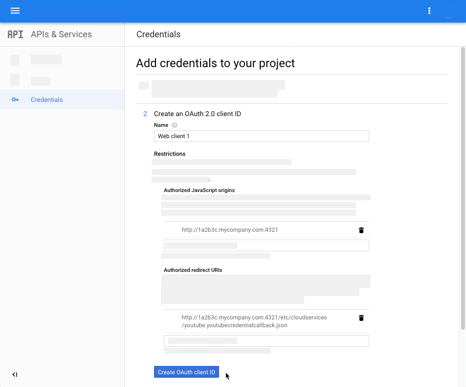
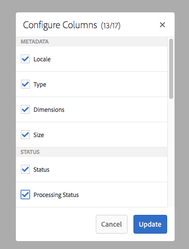

# Video {#video}

本節說明在動態媒體中處理視訊。

## 快速入門：影片 {#quick-start-videos}

下列逐步工作流程說明旨在協助您在動態媒體中使用可調式視訊集快速啟動並執行。 在每個步驟後，您都會交叉參考主題標題，以找到更多資訊。

>[!NOTE]
>
>在您使用Dynamic media處理視訊之前，請確定您的AEM管理員已在「動態媒體- Scene7」模式或「動態媒體——混合」模式中啟用並設定Dynamic Media Cloud Services。
>
>* 請參 [閱「設定動態媒體- Scene7模式」和「疑難排解動態媒體- Scene7模式」中](/help/assets/config-dms7.md#configuring-dynamic-media-cloud-services)[的「設定動態媒體雲端服務」。](/help/assets/troubleshoot-dms7.md)
   >
   >
* 請參 [閱設定動態媒體](/help/assets/config-dynamic.md#configuring-dynamic-media-cloud-services) -混合模式中的設定動態媒體雲端服務。
>


1. **執行下列動作** ，上傳您的動態媒體影片：

   * 建立您自己的視訊編碼設定檔。 或者，您只需使用動態媒體隨附 _的預先定義最適化視訊編碼_ (Adaptive Video Encoding)設定檔。

      * [建立視訊編碼設定檔](/help/assets/video-profiles.md#creating-a-video-encoding-profile-for-adaptive-streaming)。
      * 進一步瞭解視 [訊編碼的最佳實務](#best-practices-for-encoding-videos)。
   * 將視訊處理描述檔關聯至您要上傳主影片的一或多個檔案夾。

      * [將視訊描述檔套用至資料夾](/help/assets/video-profiles.md#applying-a-video-profile-to-folders)。
      * 進一步瞭解組織 [數位資產以使用處理設定檔的最佳實務](/help/assets/organize-assets.md)。
      * 進一步瞭解組 [織數位資產](/help/assets/organize-assets.md)。
   * 將您的主影片上傳至資料夾。 您可以上傳每個高達20 GB的視訊檔案。 當您將視訊新增至資料夾時，會根據您指派至資料夾的視訊處理設定檔進行編碼。

      * [上傳您的影片](/help/assets/managing-video-assets.md#uploadingandpreviewingvideoassets)。
      * 進一步瞭解支 [援的輸入檔案格式](/help/assets/assets-formats.md#supported-multimedia-formats)。
   * 從資產 [或工作流程檢視](#monitoring-video-encoding-and-youtube-publishing-progress) ，監控視訊編碼的進度。


1. **執行下列任一動作** ，以管理您的動態媒體影片：

   * 組織、瀏覽及搜尋視訊資產

      * [組織數位資產](/help/assets/organize-assets.md)進一步了 [解使用處理設定檔組織數位資產的最佳實務](organize-assets.md)

      * [搜尋視訊資產](search-assets.md#custompredicates) 或搜 [尋資產](managing-assets-touch-ui.md#search-assets)
   * 預覽和發佈視訊資產

      * 檢視視訊的來源視訊和編碼轉譯，以及其相關縮圖：
         [預覽影片](managing-video-assets.md#upload-and-preview-video-assets) 或預 [覽資產](previewing-assets.md)
         [檢視視訊轉譯](video-renditions.md)
         [管理視訊轉譯](managing-assets-touch-ui.md#managing-renditions)

      * [管理檢視器預設集](managing-viewer-presets.md)
      * [發佈資產](publishing-dynamicmedia-assets.md)
   * 使用視訊中繼資料

      * 檢視編碼視訊轉譯的屬性，例如影格速率、音訊和視訊位元速率，以及編碼解碼器：
         [檢視視訊轉譯屬性](video-renditions.md)

      * 編輯視訊的屬性，例如標題、說明和標籤、自訂中繼資料欄位：
         [編輯視訊屬性](managing-assets-touch-ui.md#editing-properties)

      * [管理數位資產的中繼資料](metadata.md)
      * [中繼資料結構](metadata-schemas.md)
   * 檢閱、核准和註解視訊，並維持完整的版本控制

      * [為影片加上註解](managing-video-assets.md#annotate-video-assets) ，或為 [資產加上註解](managing-assets-touch-ui.md#annotating)

      * [建立版本](managing-assets-touch-ui.md#asset-versioning)
      * [將工作流程套用至資產](assets-workflow.md) ，或 [請參閱在資產上啟動工作流程](managing-assets-touch-ui.md#starting-a-workflow-on-an-asset)

      * [檢閱資料夾資產](bulk-approval.md)
      * [專案](../sites-authoring/projects.md)


1. **執行下列任一動作** ，即可發佈您的Dynamic Media影片：

   * 如果您使用Adobe Experience manager做為網頁內容管理系統，您可以直接將視訊新增至網頁。

      * [將視訊新增至您的網頁](adding-dynamic-media-assets-to-pages.md)。
   * 如果您使用協力廠商的網頁內容管理系統，可以將視訊連結或內嵌至網頁。

      * 使用URL整合視訊：
         [將URL連結至您的Web應用程式](linking-urls-to-yourwebapplication.md)。

      * 使用網頁上的內嵌程式碼整合視訊：
         [將視訊檢視器內嵌在網頁上](embed-code.md)。
   * [將視訊發佈至YouTube](#publishing-videos-to-youtube)。
   * [產生視訊報表](#viewing-video-reports)。

   * [新增字幕至視訊](#adding-captions-to-video)。


## 在動態媒體中處理視訊 {#working-with-video-in-dynamic-media}

Dynamic media中的視訊是端對端解決方案，可讓您輕鬆發佈高品質的最適化視訊，以便在多種螢幕上串流，包括桌上型電腦、iOS、Android、Blackberry和Windows行動裝置。 「最適化視訊集」會針對以不同位元速率和格式（例如400 kbps、800 kbps和1000 kbps）編碼的相同視訊版本分組。 桌上型電腦或行動裝置會偵測可用頻寬。

例如，在iOS行動裝置上，它會偵測到頻寬，例如3G、4G或Wi-Fi。 然後，自動從最適化視訊集內的各種視訊位元速率中選擇正確編碼視訊。 視訊會串流至桌上型電腦、行動裝置或平板電腦。

此外，如果桌上型電腦或行動裝置的網路狀況有所改變，視訊品質會自動動態切換。 此外，如果客戶進入桌上型電腦的全螢幕模式，最適化視訊集會使用更佳的解析度來回應，進而改善客戶的觀看體驗。 使用最適化視訊集，讓客戶在多種螢幕和裝置上播放動態媒體視訊時，可以盡可能地播放。

視訊播放器用來決定播放或播放期間選取的編碼視訊的邏輯，是以下列演算法為基礎：

1. 視訊播放器會根據最接近播放器本身中為「初始位元速率」所設定之值的位元速率，載入初始視訊片段。
1. 視訊播放器會根據頻寬速度的變更，使用下列條件進行切換：

   1. 播放器會選擇低於或等於估計頻寬的最高頻寬資料流。
   1. 播放器僅會考慮80%的可用頻寬。 但是，如果它正在切換，則要保守的只有70%，以避免高估，並立即切換回去。

如需演算法的詳細技術資訊，請參閱 [https://android.googlesource.com/platform/frameworks/av/+/master/media/libstagefright/httplive/LiveSession.cpp](https://android.googlesource.com/platform/frameworks/av/+/master/media/libstagefright/httplive/LiveSession.cpp)

若要管理單一視訊和最適化視訊集，支援下列功能：

* 從多種支援的視訊格式和音訊格式上傳視訊，並將視訊編碼為MP4 H.264格式，以便在多種螢幕上播放。 您可以使用預先定義的最適化視訊預設集、單一視訊編碼預設集，或自訂您自己的編碼，以控制視訊的品質和大小。

   * 產生最適化視訊集時，會包含MP4視訊。
   * **注意**:主視訊／來源視訊不會新增至最適化視訊集。

* 所有HTML5視訊檢視器中的視訊字幕。
* 使用完整的中繼資料支援來組織、瀏覽和搜尋視訊，以有效管理視訊資產。
* 將最適化視訊集發佈至網路以及桌上型電腦和行動裝置，包括iPhone、iPad、Android、Blackberry和Windows手機。

多種iOS平台都支援最適化視訊串流。 請參 [閱Scene7檢視器參考指南](https://marketing.adobe.com/resources/help/en_US/s7/viewers_ref/c_html5_video_reference.html)。

Dynamic media支援MP4 H.264視訊的行動視訊播放。 您可以在以下位置找到支援此視訊格式的Blackberry裝置：Blackberry [上支援的視訊格式](https://support.blackberry.com/kb/articleDetail?ArticleNumber=000005482)。

您可在下列位置找到支援此視訊格式的Windows裝置：Windows [Phone上支援的視訊格式](https://msdn.microsoft.com/library/windows/apps/ff462087%28v=vs.105%29.aspx)

* 使用動態媒體視訊檢視器預設集來播放視訊，包括：

   * 單一視訊檢視器。
   * 結合視訊和影像內容的混合媒體檢視器。

* 設定視訊播放器以符合您的品牌需求。
* 使用簡單的URL或內嵌程式碼，將視訊整合至您的網站、行動網站或行動應用程式。

請參 [閱動態視訊播放](https://s7d9.scene7.com/s7/uvideo.jsp?asset=GeoRetail/Mop_AVS&config=GeoRetail/Universal_Video1&stageSize=640,480) 範例。

另請參 [閱「Adobe Scene7檢視](https://marketing.adobe.com/resources/help/en_US/s7/viewers_ref/c_html5_s7_aem_asset_viewers.html) 器參考指南」中的「AEM和Scene7的檢視器」 [，以及「AEM資產的檢視器](https://marketing.adobe.com/resources/help/en_US/s7/viewers_ref/c_html5_aem_asset_viewers.html) 」。

## 最佳實務：使用HTML5視訊檢視器 {#best-practice-using-the-html-video-viewer}

動態媒體HTML5視訊檢視器預設集是強穩的視訊播放器。 您可以使用它們來避免許多與HTML5視訊播放相關的常見問題，以及行動裝置相關的問題，例如缺乏可調式串流傳送以及案頭瀏覽器觸及面有限。

在播放器的設計方面，您可以使用標準網頁開發工具來設計視訊播放器的所有功能。 例如，您可以使用HTML5和CSS來設計按鈕、控制項和自訂海報影像背景，協助您以自訂的外觀觸及客戶。

在檢視器的播放端，它會自動偵測瀏覽器的視訊功能。 然後，它使用HLS（HTTP即時串流）來提供視訊，也稱為最適化視訊串流。 或者，如果這些傳送方法不存在，則會改用HTML5漸進式。

結合單一播放器，即可設計使用HTML5和CSS的播放元件、內嵌播放，並視瀏覽器功能而使用可調式和漸進式串流，讓您將豐富型媒體內容的觸及面擴展至案頭和行動使用者，並確保簡化視訊體驗。

另請參 [閱Adobe Scene7檢視器參考指南](https://marketing.adobe.com/resources/help/en_US/s7/viewers_ref/c_html5_viewers_about.html) 中的「關於HTML5檢視器」。

### 使用HTML5視訊檢視器在桌上型電腦和行動裝置上播放視訊 {#playback-of-video-on-desktop-computers-and-mobile-devices-using-the-html-video-viewer}

針對桌上型電腦和行動裝置的可調式視訊串流，用於位元速率切換的視訊是以最適化視訊集中的所有MP4視訊為基礎。

使用HLS或漸進式視訊下載進行視訊播放。 在舊版AEM（例如6.0、6.1和6.2）中，視訊是透過HTTP串流化。

不過，在AEM 6.3和更新版本中，視訊現在會透過HTTPS（即HLS）串流化，因為DM閘道服務URL也一律會使用HTTPS。 請注意，此預設行為不會影響客戶。 也就是說，視訊串流一律會透過HTTPS進行，除非瀏覽器不支援。 （請參閱下表）。 因此，

* 如果您有HTTPS網站含有HTTPS視訊串流，則串流可正常運作。
* 如果您有HTTP網站含HTTPS視訊串流，則串流是正常的，而且網頁瀏覽器不會出現混合內容問題。

HLS是Apple自適應視訊串流的標準，可根據網路頻寬容量自動調整播放。 它也可讓客戶「尋找」視訊中的任何點，而不需等待視訊的其餘部分下載。

漸進式視訊是透過在使用者的案頭系統或行動裝置上下載並儲存視訊來傳送。

下表說明使用Scene7 Video Viewer在桌上型電腦和行動裝置上播放視訊的裝置、瀏覽器和播放方法。

<table>
 <tbody>
  <tr>
   <td><strong>裝置</strong></td>
   <td><strong>瀏覽器</strong></td>
   <td><strong>視訊播放模式</strong></td>
  </tr>
  <tr>
   <td>桌面</td>
   <td>Internet Explorer 9和10</td>
   <td>漸進式下載。</td>
  </tr>
  <tr>
   <td>桌面</td>
   <td>Internet Explorer 11+</td>
   <td>在Windows 8和Windows 10上——每當要求HLS時，強制使用HTTPS。 已知限制：HLS上的HTTP無法在此瀏覽器／作業系統組合<br /><br /> 「On Windows 7 —— 漸進式下載」中運作。 使用標準邏輯來選擇HTTP與HTTPS通訊協定。</td>
  </tr>
  <tr>
   <td>桌面</td>
   <td>Firefox 23-44</td>
   <td>漸進式下載。</td>
  </tr>
  <tr>
   <td>桌面</td>
   <td>Firefox 45或更新版本</td>
   <td>HLS</td>
  </tr>
  <tr>
   <td>桌面</td>
   <td>Chrome</td>
   <td>HLS</td>
  </tr>
  <tr>
   <td>桌面</td>
   <td>Safari(Mac)</td>
   <td>HLS</td>
  </tr>
  <tr>
   <td>行動</td>
   <td>Chrome（Android 6或更舊版本）</td>
   <td>漸進式下載。</td>
  </tr>
  <tr>
   <td>行動</td>
   <td>Chrome（Android 7或更新版本）</td>
   <td>HLS</td>
  </tr>
  <tr>
   <td>行動</td>
   <td>Android（預設瀏覽器）</td>
   <td>漸進式下載。</td>
  </tr>
  <tr>
   <td>行動</td>
   <td>Safari(iOS)</td>
   <td>HLS</td>
  </tr>
  <tr>
   <td>行動</td>
   <td>Chrome(iOS)</td>
   <td>HLS</td>
  </tr>
  <tr>
   <td>行動</td>
   <td>Blackberry</td>
   <td>HLS</td>
  </tr>
 </tbody>
</table>

## 動態媒體視訊解決方案的架構 {#architecture-of-dynamic-media-video-solution}

下圖顯示影片的整體製作工作流程，這些影片是透過DMGateway（在動態媒體混合模式中）上傳和編碼，並可供大眾使用。


## 適用於視訊的混合出版架構 {#hybrid-publishing-architecture-for-videos}


## 編碼視訊的最佳實務 {#best-practices-for-encoding-videos}

如果您 **** 已啟用動態媒體並設定視訊雲端服務，「動態媒體編碼視訊」工作流程會對視訊進行編碼。 此工作流程會擷取工作流程處理歷程記錄和失敗資訊。 請參閱 [監控視訊編碼和YouTube發佈進度](#monitoring-video-encoding-and-youtube-publishing-progress)。 如果您已啟用動態媒體並設定視訊雲端服務，當您上傳視訊時，「動態媒體編碼視訊 **** 」工作流程會自動生效。 (如果您未使用動態媒體， **[!UICONTROL DAM更新資產工作流程將生效]** 。)

以下是編碼來源視訊檔案的最佳實務秘訣。

如需視訊編碼的建議，請參閱下列：

* [串流101:基本功能— 轉碼器、頻寬、資料速率和解析度](https://www.adobe.com/go/learn_s7_streaming101_en)。
* [視訊編碼基礎](https://www.adobe.com/go/learn_s7_encoding_en)。

### 來源視訊檔案 {#source-video-files}

當您對視訊檔案進行編碼時，請使用最高品質的來源視訊檔案。 請避免使用先前編碼的視訊檔案，因為這些檔案已經壓縮，而進一步編碼會造成品質不佳的視訊。

下表說明您的來源視訊檔案在進行編碼之前，建議的大小、外觀比例和最低位元速率：

| 大小 | 外觀比例 | 最低位元速率 |
|--- |--- |--- |
| 1024 X 768 | 4:3 | 4500 kbps，適用於大部分視訊。 |
| 1280 X 720 | 16:9 | 3000 - 6000 kbps，視視訊中的移動量而定。 |
| 1920 X 1080 | 16:9 | 6000 - 8000 kbps，視視訊中的移動量而定。 |

### 取得檔案的中繼資料 {#obtaining-a-file-s-metadata}

您可以使用視訊編輯工具檢視檔案的中繼資料，或使用專為取得中繼資料而設計的應用程式，來取得檔案的中繼資料。 以下是使用協力廠商應用程式MediaInfo取得視訊檔案中繼資料的指示：

1. 前往此網頁： [https://mediainfo.sourceforge.net/en/Download](https://mediainfo.sourceforge.net/en/Download)。
1. 選擇並下載GUI版本的安裝程式，然後按照安裝說明操作。
1. 安裝後，以滑鼠右鍵按一下視訊檔案（僅限Windows）並選取「MediaInfo」，或開啟「MediaInfo」，然後將視訊檔案拖曳至應用程式。 您會看到與視訊檔案相關的所有中繼資料，包括其寬度、高度和fps。

### 外觀比例 {#aspect-ratio}

當您選擇或建立主視訊檔案的視訊編碼預設集時，請確定該預設集與主視訊檔案具有相同的外觀比例。 寬高比是視訊寬度與高度的比例。

若要決定視訊檔案的外觀比例，請取得檔案的中繼資料並記下檔案的寬度和高度（請參閱上述「取得檔案的中繼資料」）。 然後使用此公式來判斷外觀比例：

寬／高=長寬比

下表說明公式結果如何轉換為通用外觀比例選擇：

| 公式結果 | 外觀比例 |
|--- |--- |
| 1.33 | 4:3 |
| 0.75 | 3:4 |
| 1.78 | 16:9 |
| 0.56 | 9:16 |

例如，1440寬度x 1080高度的視訊的外觀比例為1440/1080或1.33。在此例中，您選擇外觀比例為4:3的視訊編碼預設集，以編碼視訊檔案。

### 位元速率 {#bitrate}

位元速率是編碼成一秒視訊播放的資料量。 位元速率以千位／秒(Kbps)計量。

>[!NOTE]
>
>由於所有轉碼器都使用有損壓縮，因此位元速率是影片品質中最重要的因素。 對於有損壓縮，對視頻檔案的壓縮越多，質量就越低。 因此，所有其他特性相同（解析度、幀速率和編碼解碼器），位元速率越低，壓縮檔案的質量就越低。

選取位元速率編碼時，您可以選擇兩種類型：

* **[!UICONTROL 常數位元速率編碼]** (CBR)-在CBR編碼期間，位元速率或每秒位元數在整個編碼程式中會維持不變。 CBR編碼會將設定的資料速率維持在整個視訊的設定中。 此外，CBR編碼不會針對品質最佳化媒體檔案，但可節省儲存空間。
如果視訊在整個視訊中包含類似的動作等級，請使用CBR。 CBR最常用於串流視訊內容。 另請參閱 [使用自訂的視訊編碼參數](/help/assets/video-profiles.md#using-custom-added-video-encoding-parameters)。

* **[!UICONTROL 可變位元速率編碼]** (VBR)- VBR編碼會根據壓縮器所需的資料，將資料速率調低並調至您設定的上限。 這表示在VBR編碼處理期間，媒體檔案的位元速率會根據媒體檔案的位元速率需求動態增加或減少。
VBR編碼時間較長，但結果最好；媒體檔案的品質更優越。 VBR最常用於http漸進式傳送視訊內容。

何時應使用VBR與CRB?
在選擇VBR與CBR時，幾乎總是建議您將VBR用於媒體檔案。 VBR以競爭的位元速率提供更高品質的檔案。 使用VBR時，請務必搭配兩遍編碼使用，並將最大位元速率設定為目標視訊位元速率的1.5倍。

當您選擇視訊編碼預設集時，請考量目標使用者的連線速度。 選擇資料速率為該速度80%的預設集。 例如，如果目標使用者的連線速度是1000 Kbps，則最佳預設集是視訊資料速率為800 Kbps的預設集。

此表說明了典型連接速度的資料速率。

| 速度(Kbps) | 連接類型 |
|--- |--- |
| 256 | 撥號連接。 |
| 800 | 典型的行動連線。 針對此連線，針對3G體驗，將資料速率定位在400到最大800之間。 |
| 2000 | 典型的寬頻台式機連接。 針對此連線，以800-2000 Kbps範圍內的資料速率為目標，大部分目標的平均速率為1200-1500 Kbps。 |
| 5000 | 典型的高寬頻連接。 不建議使用此上限的編碼，因為大部分消費者無法使用此速度的視訊傳送。 |

### 解析度 {#resolution}

**解析度**說明視訊檔案的高度和寬度（以像素為單位）。 大部分來源視訊都以高解析度儲存（例如1920 x 1080）。 為了串流目的，來源視訊會壓縮成較小的解析度（640 x 480或更小）。

解析度和資料速率是決定視訊品質的兩個整體連結因素。 若要維持相同的視訊品質，視訊檔案中的像素數目愈高（解析度愈高），資料速率就愈高。 例如，請考慮320 x 240解析度和640 x 480解析度視訊檔案中每個影格的像素數：

| 解析度 | 每幀像素數 |
|--- |--- |
| 320 x 240 | 76,800 |
| 640 x 480 | 307,200 |

640 x 480檔案的每個畫格像素數是原來的四倍。 若要針對這兩個範例解析度取得相同的資料速率，請將640 x 480檔案的壓縮率套用四倍，以降低視訊品質。 因此，250 Kbps的視訊資料速率可產生320 x 240的解析度，但640 x 480的解析度的高品質檢視。

一般而言，您使用的資料速率越高，視訊的外觀越好，使用的解析度越高，您維持檢視品質所需的資料速率就越高（與解析度較低的比較）。

由於解析度和資料速率是連結的，因此在編碼視訊時有兩個選項：

* 選擇資料速率，然後以最高解析度編碼，以符合您選擇的資料速率。
* 選擇解析度，然後依所需的資料速率編碼，以您選擇的解析度產生高品質視訊。

當您為主視訊檔案選擇（或建立）視訊編碼預設集時，請使用下表來定位正確的解析度：

| 解析度 | 高度 (像素) | 螢幕大小 |
|--- |--- |--- |
| 240p | 240 | 小螢幕 |
| 300p | 300 | 適用於行動裝置的小螢幕 |
| 360p | 360 | 小螢幕 |
| 480p | 480 | 中螢幕 |
| 720p | 720 | 大螢幕 |
| 1080p | 1080 | 高畫質大螢幕 |

### Fps（每秒幀數） {#fps-frames-per-second}

在美國和日本，大部分的視訊拍攝時速為29.97畫格／秒(fps);在歐洲，大部分的視訊拍攝時速為25 fps。 影片以24 fps拍攝。

選擇符合主視訊檔案fps速率的視訊編碼預設集。 例如，如果主視訊是25 fps，請選擇25 fps的編碼預設集。 依預設，所有自訂編碼都使用主視訊檔的fps。 因此，在建立視訊編碼預設集時，您不需要明確指定fps設定。

### 視訊編碼尺寸 {#video-encoding-dimensions}

為獲得最佳結果，請選取編碼維度，讓來源視訊是所有編碼視訊的整數倍。

要計算此比率，可以將源寬度除以編碼寬度以獲得寬度比。 然後，您將來源高度除以編碼高度，以取得高度比。

如果產生的比率是整數，表示視訊已最佳縮放。 如果產生的比率不是整數，則會在顯示器上留下殘留的像素假象，進而影響視訊品質。 當視訊有文字時，此效果最為明顯。

例如，假設您的來源視訊是1920 x 1080。 在下表中，這3個編碼視訊提供了要使用的最佳編碼設定。

| 視訊類型 | 寬x高 | 寬度比例 | 高度比 |
|--- |--- |--- |--- |
| 來源 | 1920x1080 | 1 | 1 |
| 編碼 | 960 x 540 | 2 | 2 |
| 編碼 | 640 x 360 | 3 | 3 |
| 編碼 | 480 x 270 | 4 | 4 |

### 編碼視訊檔案格式 {#encoded-video-file-format}

動態媒體建議使用MP4 H.264視訊編碼預設集。 由於MP4檔案使用H.264視訊codec，所以提供高品質的視訊，但檔案大小壓縮。

## 將影片發佈至YouTube {#publishing-videos-to-youtube}

您可以直接將內部部署的AEM視訊資產發佈至您先前建立的YouTube頻道。

若要將視訊資產發佈至YouTube，請使用標籤設定AEM資產。 您會將這些標籤與YouTube頻道建立關聯。 如果視訊資產的標籤符合YouTube頻道的標籤，則視訊會發佈至YouTube。 只要使用相關標籤，就會隨同視訊的一般發佈一起發佈至YouTube。

YouTube會自行編碼。 因此，上傳至AEM的原始視訊檔案會發佈至YouTube，而非Dynamic media編碼建立的任何視訊轉譯。 雖然使用動態媒體處理視訊不需要，但是當播放時需要檢視器預設集時，視訊處理者應該會這麼做。

當您略過視訊處理設定檔並直接發佈至YouTube時，這隻表示您的AEM Asset視訊資產可能無法取得可檢視的縮圖。 這也表示，如果您在動態媒體或dynamicmedia_scene7執行模式中執行，未編碼的視訊將無法與任何動態媒體資產類型搭配使用。

將視訊資產發佈至YouTube伺服器需要完成下列工作，以確保使用YouTube進行安全且安全的伺服器對伺服器驗證：

1. [設定Google cloud設定](#configuring-google-cloud-settings)
1. [建立YouTube頻道](#creating-a-youtube-channel)
1. [新增發佈標籤](#adding-tags-for-publishing)
1. [啟用YouTube發佈複製代理](#enabling-the-youtube-publish-replication-agent)
1. [在AEM中設定YouTube](#setting-up-youtube-in-aem)
1. [（選擇性）自動設定已上傳影片的預設YouTube屬性](#optional-automating-the-setting-of-default-youtube-properties-for-your-uploaded-videos)
1. [將影片發佈至您的YouTube頻道](#publishing-videos-to-your-youtube-channel)
1. [（可選）驗證YouTube上的已發佈視訊](/help/assets/video.md#optional-verifying-the-published-video-on-youtube)
1. [將YouTube URL連結至您的Web應用程式](#linking-youtube-urls-to-your-web-application)

您也可以解 [除發佈影片，從YouTube移除影片](#unpublishing-videos-to-remove-them-from-youtube)。

### 設定Google cloud設定 {#configuring-google-cloud-settings}

若要發佈至YouTube，您需要Google帳戶。 如果你有GMAIL賬戶，那麼你已經有了谷歌賬戶；如果您沒有Google帳戶，可以輕鬆建立一個帳戶。 您需要帳戶，因為您需要認證才能將視訊資產發佈至YouTube。 如果您已建立帳戶，請略過此工作，然後直接前往「 [Creating a YouTube channel](#creating-a-youtube-channel)」。

與Google cloud搭配使用的帳戶和YouTube使用的Google帳戶不必相同。

請注意，Google會定期變更其使用者介面。 因此，發佈視訊至YouTube的步驟可能與下文所述的步驟稍有不同。 當您嘗試檢查視訊是否上傳至YouTube時，此警告也適用於YouTube。

>[!NOTE]
>
>在編寫本文時，以下步驟是正確的。 不過，Google會定期更新其網站，恕不另行通知。 因此，這些步驟可能略有不同。

若要設定Google cloud設定：

1. 建立新的Google帳戶。
   [https://accounts.google.com/SignUp?service=mail](https://accounts.google.com/SignUp?service=mail)

   如果您已擁有Google帳戶，請跳至下一個步驟。

1. 請至 [https://cloud.google.com/](https://cloud.google.com/)。
1. 在Google cloud頁面的右上角，按一下「主控台」 ****。

   如有必要，您可能需要使 **[!UICONTROL 用Google帳戶認證]** 「登入」才能查看 **[!UICONTROL Console]** 選項。

1. 在「儀表板」頁面的 **[!UICONTROL Google Cloud Platform右側]**，按一下「專案」下拉式清單以開啟「選取專案」對話方塊。
1. 在「選取專案」對話方塊中，點選「 **[!UICONTROL 新增專案」]**。

   

1. 在「新建項目」對話框的「項目名稱」欄位中，鍵入新項目的名稱。

   請注意，您的專案ID是以您的專案名稱為基礎。 因此，請謹慎選擇專案名稱；在建立後無法變更。 此外，當您稍後在AEM中設定YouTube時，還需要再次輸入相同的專案ID;你可能想寫下來。

1. 按一下&#x200B;**[!UICONTROL 「建立」]**。

1. 執行下列任一項作業：

   * 在專案的儀表板中，在「快速入門」卡片中，點選「 **[!UICONTROL 探索」並啟用API]**。
   * 在專案的「儀表板」中，在API卡片中，點選「 **[!UICONTROL 前往API概觀」]**。
   

1. 在「API與服務」頁面頂端附近，點選「 **[!UICONTROL 啟用API與服務」]**。
1. 在「API資料庫」頁面的左側「類別」下方 **[!UICONTROL ，點選]**「 **[!UICONTROL YouTube]**」。 在頁面的右側，點選「 **[!UICONTROL YouTube資料API」]**。
1. 在YouTube Data API v3頁面上，點選「啟 **[!UICONTROL 用」]**。

   

1. 若要使用API，您可能需要認證。 如有必要，請按一下「 **[!UICONTROL 建立認證」]**。

   

1. 在「將 **[!UICONTROL 認證新增至專案」頁]** ，步驟1中執行下列動作：

   * 您使用 **[!UICONTROL 哪個API?]** 下拉式清單中，選 **[!UICONTROL 取YouTube Data API v3]**。

   * 從「 **[!UICONTROL 您要從何處呼叫API?」]** 下拉式清單中，選 **[!UICONTROL 取「Web伺服器」（例如node.js、Tomcat）]**

   * 從「您 **[!UICONTROL 將訪問哪些資料？」]** 下拉式清單中，點選「使 **[!UICONTROL 用者資料」]**。
   

1. 點選「 **[!UICONTROL 我需要哪些認證？」]**
1. 在「 **[!UICONTROL 新增認證至您的專案]** 」頁面的「建立OAuth 2.0用戶端ID **** 」標題下，視需要在「名稱」欄位中輸入唯一名稱。 或者，您可以使用Google指定的預設名稱。
1. 在「已授 **[!UICONTROL 權的Javascript來源]** 」標題下方的文字欄位中，輸入下列路徑，在路徑中取代您自己的網域和埠號，然後按 **[!UICONTROL Enter]** 以新增路徑至清單：

   `https://<servername.domain>:<port_number>`

   例如， `https://1a2b3c.mycompany.com:4321`

   **注意**:上述路徑範例僅供圖例之用。

   

1. 在「已授 **[!UICONTROL 權的重新導向URI]** 」標題下，在文字欄位中輸入下列路徑，在路徑中取代您自己的網域和埠號，然後按 **[!UICONTROL Enter]** ，將路徑新增至清單：

   `https://<servername.domain>:<port_number>/etc/cloudservices/youtube.youtubecredentialcallback.json`

   例如， `https://1a2b3c.mycompany.com:4321/etc/cloudservices/youtube.youtubecredentialcallback.json`

   **注意**:上述路徑範例僅供圖例之用。

1. 按一 **[!UICONTROL 下「建立OAuth用戶端ID]**」。
1. 在「 **[!UICONTROL 新增認證至您的專案]****** 」頁面的「設定OAuth 2.0同意書」畫面標題下方，選取您目前使用的Gmail電子郵件地址。

   

1. 在顯示 **[!UICONTROL 給使用者的產品名稱標題下]** ，在文字欄位中，輸入您要在同意畫面上顯示的內容。

   當AEM管理員向YouTube驗證時，會顯示同意畫面；AEM將會聯絡YouTube以取得許可。

1. 按一 **[!UICONTROL 下繼續]**。
1. 在「新增認證至您的專案」頁面的「下載認證」標題下，點選「 **[!UICONTROL 下載]** 」 **[!UICONTROL 步驟4]**。

   

1. 儲存檔 `client_id.json` 案。

   當您稍後在Adobe Experience manager中設定YouTube時，將需要此下載的json檔案。

1. 按一 **[!UICONTROL 下完成]**。

   登出您的Google帳戶。 您現在將建立YouTube頻道。

### 建立YouTube頻道 {#creating-a-youtube-channel}

將視訊發佈至YouTube需要您有一或多個頻道。 如果您已建立YouTube頻道，可略過此工作並前往「新增標 [記以進行發佈](/help/assets/video.md#adding-tags-for-publishing)」。

>[!CAUTION]
>
>在AEM的「YouTube設定」下方新增頻道之前 *，請確定您已在YouTube中設定一或多個頻道(請參* 閱下方的「AEM中設定YouTube [](#setting-up-youtube-in-aem) 」)。 如果您未能這麼做，則不會收到任何警告，告知您沒有現有渠道。 不過，當您新增頻道時仍會發生Google驗證，但無法選擇視訊傳送的頻道。

若要建立YouTube頻道：

1. 請前往https://www.youtube.com [](https://www.youtube.com/) ，並使用您的Google帳戶認證登入。
1. 在YouTube頁面的右上角，按一下您的描述檔圖片（也可能會以純色圓圈中的字母顯示），然後按一下 **[!UICONTROL YouTube設定]** （圓齒輪圖示）。
1. 在「概述」頁面的「其他功能」標題下，按一下「 **[!UICONTROL 查看我的所有渠道」或建立新渠道]**。
1. 在「渠道」頁面上，按一 **[!UICONTROL 下「建立新渠道」]**。
1. 在「品牌帳戶」頁面的「品牌帳戶名稱」欄位中，輸入您要將視訊資產發佈至何處的商業名稱或其他渠道名稱，然後按一下「建 **[!UICONTROL 立]**」。

   請記住您在此處輸入的名稱，因為當您在AEM中設定YouTube時，需要再次輸入名稱。

1. （可選）視需要新增更多渠道。

   現在您將新增發佈標籤。

### 新增發佈標籤 {#adding-tags-for-publishing}

若要將影片發佈至YouTube,AEM會將標籤關聯至一或多個YouTube頻道。 若要新增發佈的標籤，請參 [閱管理標籤](/help/sites-administering/tags.md)。

或者，如果您想要在AEM中使用預設標籤，則可略過此工作並前往「 [啟用YouTube Publish複製代理」](#enabling-the-youtube-publish-replication-agent)。

### 啟用YouTube Publish複製代理 {#enabling-the-youtube-publish-replication-agent}

啟用YouTube Publish複製代理後，如果您想要測試與Google cloud帳戶的連線，請點選「 **[!UICONTROL Test Connection」]**。 瀏覽器頁籤顯示連接結果。 如果您已新增「YouTube頻道」，則這些頻道的清單會顯示為測試的一部分。

1. 在AEM的左上角，按一下AEM標誌，然後在左側導軌中，按一下「 **[!UICONTROL Tools]** > **[!UICONTROL Deployment]** > **[!UICONTROL Replication]** > **** Agent on AuthorAdor」。
1. 在「作者代理」頁面上，按一下「 **[!UICONTROL YouTube發佈(youtube)」]**。
1. 在工具列的「設定」右側，按一下「編 **[!UICONTROL 輯」]**。
1. 選中「 **[!UICONTROL 啟用]** 」複選框以開啟複製代理。
1. 按一下 **[!UICONTROL 確定]**。

   現在，您將在AEM中設定YouTube。

### 在AEM中設定YouTube {#setting-up-youtube-in-aem}

從AEM 6.4開始，引進了全新的觸控使用者介面方法，以在AEM中設定YouTube發佈。 根據您所使用的AEM安裝例項，執行下列其中一項作業：

* 若要在6.4之前的AEM中設定YouTube，請參閱「在6.4 [之前的AEM中設定YouTube」](/help/assets/video.md#setting-up-youtube-in-aem-before)。
* 若要在AEM 6.4或更新版本中設定YouTube，請參 [閱「在AEM 6.4和更新版本中設定YouTube」](#setting-up-youtube-in-aem-and-later)。

#### 在AEM 6.4和更新版本中設定YouTube {#setting-up-youtube-in-aem-and-later}

1. 請確定您以管理員身分登入您的動態媒體實例。
1. 在AEM的左上角，點選AEM標誌，然後在左側導軌中，點選「 **[!UICONTROL Tools]**（槌子圖示）> **[!UICONTROL Cloud Services]** > **[!UICONTROL YouTube Publishing Configuration]**」。
1. 點選 **[!UICONTROL 全域]** （請勿選取）。

1. 在全域頁面的右上角附近，點選「建 **[!UICONTROL 立」]**。
1. 在「建立YouTube設定」頁面的「Google cloud平台設定」下方的「應用程式名稱」欄位 **[!UICONTROL 中]** ，輸入Google專案ID。

   您最初設定Google cloud設定時，已指定專案ID。
將「建立YouTube設定」頁面保持開啟；你馬上就回來。

   

1. 使用純文字編輯器，開啟您在「設定Google cloud設定」工作中先前下載並儲存的JSON [檔案](/help/assets/video.md#configuring-google-cloud-settings)。
1. 選取並複製整個JSON文字。
1. 返回YouTube帳戶設定對話方塊。 在「 **[!UICONTROL JSON設定」欄位中]** ，貼上JSON文字。
1. 在頁面的右上角附近，點選「儲存 **[!UICONTROL 」]**。

   您現在將在AEM中設定YouTube頻道。

1. 點選「 **[!UICONTROL 新增渠道]**」。
1. 在「頻道名稱」欄位中，輸入您在「將一或多個頻道新增至 **[!UICONTROL YouTube」工作中建立的頻道名稱]** 。

   您可以視需要選擇新增說明。

1. 點選「 **[!UICONTROL 新增]**」。
1. YouTube/Google驗證隨即顯示。 如果您尚未登入Google cloud帳戶，請略過此步驟。

   * 輸入與上述Google Project ID和JSON文字相關聯的Google使用者名稱和密碼。
   * 視您的帳戶有多少個渠道而定，您會看到兩個或多個項目。 選取渠道。 不要選擇電子郵件地址；它不是渠道。
   * 在下一頁，點選「 **[!UICONTROL Accept]** 」（接受）以允許存取此頻道。

1. 點選「 **[!UICONTROL 允許]**」。

   您現在將設定發佈的標籤。

1. **[!UICONTROL 設定要發佈的標籤]** -在「雲端服務」>「YouTube」頁面上，點選鉛筆圖示以編輯您要使用的標籤清單。
1. 點選下拉式清單圖示（倒置脫字型大小）以顯示AEM中可用標籤的清單。
1. 點選一或多個標籤以新增標籤。

   若要刪除已新增的標籤，請選取標籤，然後點選 **[!UICONTROL X]**。

1. 在您新增所需的標籤後，點選「儲存 **[!UICONTROL 」]**。

   現在，您可將視訊發佈至YouTube頻道。

#### 在6.4之前的AEM中設定YouTube {#setting-up-youtube-in-aem-before}

1. 請確定您以管理員身分登入您的動態媒體實例。

1. 在AEM的左上角，點選AEM標誌，然後在左側導軌中，點選「工具（槌子圖示）> **[!UICONTROL Deployment]** > **[!UICONTROL Cloud Services]******」。
1. 在「第三方服務」標題下方的YouTube下方，點選「立即 **[!UICONTROL 設定」]**。
1. 在「建立配置」對話框中，在各個欄位中輸入標題（必填）和名稱（可選）。
1. 點選「 **[!UICONTROL 建立]**」。
1. 在「YouTube帳戶設定」對話方塊的「應用程式名 **[!UICONTROL 稱」欄位中]** ，輸入Google專案ID。

   您在最初設定Google cloud設定時 [指定專案ID](/help/assets/video.md#configuring-google-cloud-settings) 。
讓「YouTube帳戶設定」對話方塊保持開啟；你馬上就回來。

1. 使用純文字編輯器，開啟您在「設定Google雲端設定」工作中先前下載並儲存的JSON檔案。
1. 選取並複製整個JSON文字。
1. 返回YouTube帳戶設定對話方塊。 在「 **[!UICONTROL JSON設定」欄位中]** ，貼上JSON文字。
1. 點選「 **[!UICONTROL 確定]**」。

   您現在將在AEM中設定YouTube頻道。

1. 在「可用頻道」 **[!UICONTROL 的右側]**，點 **選+** （加號圖示）。
1. 在「YouTube頻道設定」對話方塊的「標題」欄位中，輸入您在「先前新增一或多個頻道至YouTube」工作中建立的頻道名稱 **** 。

   您可以視需要選擇新增說明。

1. 點選「 **[!UICONTROL 確定]**」。
1. YouTube/Google驗證隨即顯示。 如果您尚未登入Google cloud帳戶，請略過此步驟。

   * 輸入與上述Google Project ID和JSON文字相關聯的Google使用者名稱和密碼。
   * 視您的帳戶有多少個渠道而定，您會看到兩個或多個項目。 選取渠道。 不要選擇電子郵件地址；它不是渠道。
   * 在下一頁，點選「 **[!UICONTROL Accept]** 」（接受）以允許存取此頻道。

1. 點選「 **[!UICONTROL 允許]**」。

   您現在將設定發佈的標籤。

1. **[!UICONTROL 設定要發佈的標籤]** -在「雲端服務」>「YouTube」頁面上，點選鉛筆圖示以編輯您要使用的標籤清單。
1. 點選下拉式清單圖示（倒置脫字型大小）以顯示AEM中可用標籤的清單。
1. 點選一或多個標籤以新增標籤。

   若要刪除已新增的標籤，請選取標籤，然後點選 **X**。

1. 在您完成新增所需標籤後，點選「確 **[!UICONTROL 定」]**。

   現在，您可將視訊發佈至YouTube頻道。

### （選擇性）自動設定已上傳影片的預設YouTube屬性 {#optional-automating-the-setting-of-default-youtube-properties-for-your-uploaded-videos}

您可以選擇在上傳影片時自動設定YouTube屬性。 您可以在AEM中建立中繼資料處理設定檔來完成此作業。

若要建立中繼資料處理設定檔，您必須先從「欄位標籤 **[!UICONTROL 」、「對應至屬性]********** 」和「選擇」欄位複製值，這些全都可在視訊的中繼資料結構中找到。 然後，您會新增這些值，以建立您的YouTube視訊中繼資料處理設定檔。

若要自動設定已上傳影片的預設YouTube屬性：

1. 在AEM的左上角，按一下AEM標誌，然後在左側導軌中，按一下「工具（槌子圖示）> **[!UICONTROL Assets]** >中繼資 **[!UICONTROL 料結構]******」。
1. 按一 **[!UICONTROL 下預設]**。 （請勿在「預設」左側的選取方塊中新增核取標籤。）
1. 在預 **[!UICONTROL 設頁面]** ，核取視訊左側的方 **[!UICONTROL 塊]**，然後按一下「 **編輯」**。
1. 在「元資料結構編輯器」頁上，按一下「高 **[!UICONTROL 級]** 」頁籤。
1. 在「YouTube發佈」標題下，按一下「 **[!UICONTROL YouTube類別」]**。
1. 在頁面的右側，在「設定」標 **[!UICONTROL 簽下]** ，執行下列動作：

   * 在「對 **[!UICONTROL 應至屬性]** 」文字欄位中，選取並複製值。
將複製的值貼入開啟的文字編輯器中。 當您稍後建立中繼資料處理設定檔時，將需要此值。 讓文字編輯器保持開啟。

   * 在「 **[!UICONTROL 選擇]**」下，選取並複製您要使用的預設值（例如「人物與部落格」或「科學與技術」）。
將複製的值貼入開啟的文字編輯器中。 當您稍後建立中繼資料處理設定檔時，將需要此值。 讓文字編輯器保持開啟。

1. 在「YouTube發佈」標題下，按一下「 **[!UICONTROL YouTube隱私權」]**。
1. 在頁面的右側，在「設定」標 **[!UICONTROL 簽下]** ，執行下列動作：

   * 在「對 **[!UICONTROL 應至屬性]** 」文字欄位中，選取並複製值。
將複製的值貼入開啟的文字編輯器中。 當您稍後建立中繼資料處理設定檔時，將需要此值。 讓文字編輯器保持開啟。

   * 在「 **[!UICONTROL 選擇]**」(Choices)下，選擇並複製要使用的預設值。 請注意，「選擇」(Choices)分成兩對。 對中的底部欄位是要複製的預設值，如公用、未列出或專用。
將複製的值貼入開啟的文字編輯器中。 當您稍後建立中繼資料處理設定檔時，將需要此值。 讓文字編輯器保持開啟。

1. 在「中繼資料結構編輯器」頁面的右上角，按一下「取 **[!UICONTROL 消」]**。
1. 在AEM的左上角，點選AEM標誌，然後在左側導軌中，按一下「工具（槌子圖示）> **[!UICONTROL Assets]** >中繼資 **[!UICONTROL 料設定檔]******」。

1. 在「中繼資料描述檔」頁面的右上角附近，按一下「建 **[!UICONTROL 立]**」。
1. 在「新增中繼資料描述檔」對話方塊的「描述檔標題 **[!UICONTROL 」文字欄位中，輸入名稱，]** 然後按一下「 `YouTube Video` 建立 ****」。
1. 在「中繼資料描述檔編輯器」頁面上，按一下「進 **[!UICONTROL 階]** 」標籤。
1. 執行下列動作，將複製的YouTube發佈值新增至描述檔：

   * 在頁面的右側，按一下「建 **[!UICONTROL 立表單]** 」標籤。
   * （選用）將標示為「區 **[!UICONTROL 段標題]** 」的元件拖曳至左側，並拖曳至表單區域。
   * （可選）按一下 **[!UICONTROL 欄位標籤]** ，以選取元件。
   * （可選）在頁面右側的「設定」標籤下，在「欄位標籤」文字欄位中輸入 `YouTube Publishing`。
   * 按一下「 **[!UICONTROL 建立表單]** 」標籤，然後拖曳標示為「多值文字」的元件，並將其拖曳至您剛建立的「 **[!UICONTROL YouTube發佈]****** 」標題下方。

   * 按一下 **[!UICONTROL欄位標籤** ，選擇元件。
   * 在頁面的右側，在「設定」標籤下，將您先前複製的YouTube發佈值（欄位標籤值和對應至屬性值）貼到表單上的各自欄位。 將「選擇」值貼入「預設值」欄位。

1. 執行下列動作，將複製的YouTube隱私權值新增至描述檔：

   * 在頁面的右側，按一下「建 **[!UICONTROL 立表單]** 」標籤。
   * （選用）將標示為「區 **[!UICONTROL 段標題]** 」的元件拖曳至左側，並拖曳至表單區域。
   * （可選）按一下 **[!UICONTROL 欄位標籤]** ，以選取元件。
   * （可選）在頁面右側的「設定」標籤下，在「欄位標籤」文字欄位中輸入 `YouTube Privacy`。
   * 按一下「 **[!UICONTROL 建立表單]** 」標籤，然後拖曳標示為「多值文字」的元件，並將它拖曳至您剛建立的「 **[!UICONTROL YouTube隱私權]****** 」標題下方。

   * 按一下 **[!UICONTROL 欄位標籤]** ，選擇元件。
   * 在頁面的右側，在「設定」標籤下，將您先前複製的YouTube發佈值（欄位標籤值和對應至屬性值）貼到表單上的各自欄位。 將「選擇」值貼入「預設值」欄位。

1. 在頁面的右上角附近，按一下「儲 **[!UICONTROL 存」]**。
1. 將YouTube Publishing中繼資料設定檔套用至您要上傳影片的資料夾。 您需要同時設定中繼資料描述檔和視訊描述檔。

   請參 [閱中繼資料](/help/assets/metadata-profiles.md)[描述檔和視訊描述檔](/help/assets/video-profiles.md)。

### 將影片發佈至您的YouTube頻道 {#publishing-videos-to-your-youtube-channel}

現在，您可將先前新增的標籤關聯至視訊資產。 此程式可讓AEM知道要發佈到您YouTube頻道的資產。

>[!NOTE]
>
>在動態媒體- Scene7模式中執行時，請注意，立即發佈不會自動發佈至YouTube。 設定動態媒體- Scene7模式時，有兩個發佈選項可供選擇：立 **[!UICONTROL 即或]****[!UICONTROL 啟動後]**。
>
>**[!UICONTROL 立即發佈]** ：表示已上傳的資產在與IPS同步後，會自動發佈至傳送系統。 雖然Dynamic Media是如此，但YouTube則不是這樣。 若要發佈至YouTube，您必須透過AEM Author發佈。

>[!NOTE]
>
>若要從YouTube發佈內容，AEM會使用「發佈至 **[!UICONTROL YouTube]** 」工作流程，讓您監控進度並檢視任何失敗資訊。
>
>請參閱 [監控視訊編碼和YouTube發佈進度](#monitoring-video-encoding-and-youtube-publishing-progress)。
>
>如需更詳細的進度資訊，您可以在複製下監視YouTube記錄檔。 但是，請注意，此類監控需要管理員存取權。

若要將影片發佈至您的YouTube頻道：

1. 在AEM中，導覽至您要發佈至YouTube頻道的視訊資產。
1. 選取視訊資產（最適化視訊集）。
1. 在工具列上，按一下「 **[!UICONTROL 屬性]**」。
1. 在「基本」標籤的「中繼資料」標題下，按一下「標 **[!UICONTROL 記」欄位右側的「開啟選擇對話方塊]** 」。
1. 在「選擇標籤」頁面上，導覽至您要使用的標籤，然後選取一或多個標籤。

   請記住，標籤必須與YouTube頻道相關聯。

1. 在頁面的右上角，按一下「選 **[!UICONTROL 取」]**。
1. 在視訊屬性頁面的右上角，按一下「儲存並 **[!UICONTROL 關閉」]**。
1. 在工具列上，按一下「 **[!UICONTROL 快速發佈」]**。

   另請參 [閱「搭配AEM網站使用出版物管理」](https://helpx.adobe.com/experience-manager/kt/sites/using/publication-management-feature-video-use.html)。

   您可以選擇在YouTube頻道上驗證已發佈的視訊。

### （可選）驗證YouTube上的已發佈視訊 {#optional-verifying-the-published-video-on-youtube}

您可以選擇監控YouTube發佈（或取消發佈）的進度。

請參閱 [監控視訊編碼和YouTube發佈進度](#monitoring-video-encoding-and-youtube-publishing-progress)。

發佈時間會因許多因素而大幅不同，這些因素包括主視訊格式、檔案大小和上傳流量。 發佈程式需要幾分鐘到幾個小時。 此外，請注意，解析度較高的格式轉譯速度會慢得多。 例如，720p和1080p的顯示時間比480p長得多。

八小時後，如果您仍然看到狀態訊息顯示「已上傳」( **[!UICONTROL 正在處理，請稍候)]**，請嘗試從我們的網站移除視訊，然後再次上傳。

### 將YouTube URL連結至您的Web應用程式 {#linking-youtube-urls-to-your-web-application}

您可以在發佈視訊後，取得Dynamic media產生的YouTube URL字串。 當您複製YouTube URL時，它會著陸在剪貼簿上，如此您就可視需要將它貼至網站或應用程式中的頁面。

>[!NOTE]
>
>在您將視訊資產發佈至YouTube之前，YouTube URL無法複製。

若要將YouTube URL連結至您的Web應用程式：

1. 導覽至您 *要複製其URL的YouTube發佈視訊資產* ，然後選取它。

   請記住，YouTube URL只有在您首次將視訊資 *產發佈* 至YouTube *後* ，才可供複製。

1. 在工具列上，按一下「 **[!UICONTROL 屬性]**」。
1. 按一下「進 **[!UICONTROL 階]** 」標籤。
1. 在「YouTube發佈」標題下方的「YouTube URL清單」中，選取URL文字並將它複製至您的網頁瀏覽器，以預覽資產或新增至網頁內容頁面。

### 取消發佈影片以從YouTube移除 {#unpublishing-videos-to-remove-them-from-youtube}

當您在AEM中解除發佈視訊資產時，視訊會從YouTube移除。

>[!CAUTION]
>
>如果您直接從YouTube移除影片，AEM就不會察覺，而且會繼續以視訊仍發佈至YouTube的方式運作。 一律以AEM方式從YouTube取消發佈視訊資產。

>[!NOTE]
>
>若要從YouTube移除內容，AEM會使用「從YouTube **[!UICONTROL 解除發佈]** 」工作流程，讓您監控進度並檢視任何失敗資訊。
>
>請參閱 [監控視訊編碼和YouTube發佈進度](#monitoring-video-encoding-and-youtube-publishing-progress)。

若要解除發佈影片以從YouTube移除影片：

1. 導覽至您要從YouTube頻道取消發佈的視訊資產。
1. 在資產選擇模式中，選取一或多個已發佈的視訊資產。
1. 在工具列上，按一下「管 **[!UICONTROL 理出版物」]**。 您可能需要點選三個點圖示(...)在工具列上，查看「管 **[!UICONTROL 理出版物]**」。
1. 在「管理出版物」頁面上，點選「取 **[!UICONTROL 消發佈]**」。
1. 在頁面的右上角，點選「下一 **[!UICONTROL 步」]**。
1. 在頁面的右上角，點選「解除發 **[!UICONTROL 布」]**。

## 監控視訊編碼和YouTube發佈進度 {#monitoring-video-encoding-and-youtube-publishing-progress}

當您將新視訊上傳至已套用視訊編碼的檔案夾，或將視訊發佈至Youtube時，可以透過多種方式監控視訊編碼/Youtube發佈的進展（或失敗）。 實際的YouTube發佈進度只能透過記錄檔取得，但是其失敗或成功會以下列程式所述的其他方式列出。 此外，當YouTube發佈工作流程或視訊編碼完成或中斷時，您可能會收到電子郵件通知。

### 監控進度 {#monitoring-progress}

若要監控進度（包括失敗的編碼/YouTube發佈）:

1. 在資產檔案夾中檢視視訊編碼進度：

   * 在卡片檢視中，視訊編碼進度會依百分比顯示在資產上。 如果發生錯誤，此資訊也會顯示在資產上。
   

   * 在清單檢視中，視訊編碼進度會顯示在「處 **[!UICONTROL 理狀態]** 」欄。 如果出現錯誤，則該欄會顯示此訊息。
   

   預設不會顯示此欄。 若要啟用欄，請從檢視下拉 **[!UICONTROL 式選單中選取「檢視設定]** 」，然後新增「處理狀態」欄，然後點選或按一下「更新」 ********。

   

1. 檢視資產詳細資訊的進度。 當您點選或按一下資產時，請開啟下拉式選單並選取「時間 **[!UICONTROL 軸」]**。 若要將其縮小至編碼或YouTube發佈等工作流程活動，請選取「工 **[!UICONTROL 作流程]**」。

   

   任何工作流程資訊（例如編碼）都會顯示在時間軸中。 對於YouTube發佈，工作流程時間軸也包含YouTube頻道名稱和YouTube影片URL。 此外，發佈完成後，您會在工作流程時間軸中看到任何失敗通知。

   >[!NOTE]
   >
   >由於重試時有多個工作流配置、重試延遲 **[!UICONTROL ，以及]**********[](https://localhost:4502/system/console/configMgr)https://localhost:4502/system/console/configMgr的逾時(例如：
   >
   >    * Apache Sling Job Queue Configuration
   >    * Adobe Granite Workflow External Process Job Handler
   >    * Granite工作流程逾時佇列
   >
   >您可以調整這些 **[!UICONTROL 配置中]****[!UICONTROL 的重試]**、重試延遲 **[!UICONTROL ,]** 以及超時屬性。

1. 如需進行中的工作流程，請參閱「工具 **[!UICONTROL >工作流程]** >例項」中的「工作流程例 **[!UICONTROL 項」]******。

   >[!NOTE]
   >
   >您可能需要有管理權限才能存取「工 **[!UICONTROL 具]** 」功能表。

   

   選取例項並點選或按一下「開 **[!UICONTROL 啟歷史記錄]**」。

   

   在「工作流實例」區域中，您也可以暫停、終止或更名工作流。 如需詳 [細資訊](/help/sites-administering/workflows-administering.md) ，請參閱管理工作流程。

1. 有關失敗的作業，請參閱「工具」>「工作流 **[!UICONTROL 程」]** > 「失敗 **[!UICONTROL 」中的「工]** 作流失敗 ****」。 「工作 **[!UICONTROL 流失敗]** 」(Workflow Failure)列出所有失敗的工作流活動。

   >[!NOTE]
   >
   >您可能需要有管理權限才能存取「工 **[!UICONTROL 具]** 」功能表。

   

   >[!NOTE]
   >
   >由於重試時有多個工作流程設定、重試延遲 **[!UICONTROL ，以及https://localhost:4502/system/console/configMgr的逾時(例如]**********[](https://localhost:4502/system/console/configMgr):
   >
   >
   >
   >    * Apache Sling Job Queue Configuration
   >    * Adobe Granite Workflow External Process Job Handler
   >    * Granite工作流程逾時佇列
   >
   >
   >您可以調整這些 **[!UICONTROL 配置中]****[!UICONTROL 的重試]**、重試延遲 **[!UICONTROL ,]** 以及超時屬性。

1. 如需完成的工作流程，請參閱「工具 **[!UICONTROL >工作流程]** >封存 **[!UICONTROL 」中的「工作流程封存]******」。 「工作 **[!UICONTROL 流程存檔]** 」會列出所有已完成的工作流活動。

   >[!NOTE]
   >
   >您可能需要有管理權限才能存取「工 **[!UICONTROL 具]** 」功能表。

   

1. 您可能會收到有關中止或失敗的工作流程工作的電子郵件通知。 管理員可設定這些電子郵件通知。 請參閱 [設定電子郵件通知](#configuring-e-mail-notifications)。

#### 設定電子郵件通知 {#configuring-e-mail-notifications}

>[!NOTE]
>
>您可能需要有管理權限才能存取「工 **[!UICONTROL 具]** 」功能表。

設定通知的方式取決於您要將通知用於編碼工作還是YouTube發佈工作：

* 對於編碼工作，您可以從 **[!UICONTROL Tools]** > **[!UICONTROL Operations]** > **[!UICONTROL Web Console]** 存取所有AEM工作流程電子郵件通知的設定頁面，並搜尋 **** Day CQ Workflow Email Notification Service Achignast。 請參閱「 [在AEM中設定電子郵件通知](/help/sites-administering/notification.md)」。 您可以相應地選擇或清除「中止時通 **[!UICONTROL 知」或「完成時通]** 知」的複選框 **** 。

* 若是YouTube發佈工作，請執行下列動作：

1. 在AEM中，點選「工 **[!UICONTROL 具]** >工 **[!UICONTROL 作流程]** > **[!UICONTROL 模型]**」。
1. 在「工作流程模型」頁面上，選取「 **[!UICONTROL 發佈至YouTube]**」，然後點選工 **[!UICONTROL 具列上的「編輯]** 」。
1. 在「發佈至YouTube」工作流程頁面的右上角，點選「編 **[!UICONTROL 輯」]**。
1. 將滑鼠指標暫留在「YouTube上傳」元件上，然後點選一次以顯示內嵌工具列。

   

1. 在內嵌工具列上，點選「設定」圖示（扳手）。 按一下「參 **[!UICONTROL 數]** 」頁籤。

   

1. 在「YouTube上傳程式——步驟屬性」對話方塊中，點選「參 **[!UICONTROL 數]** 」標籤。

   

1. 您可以選取或清除下列核取方塊：

   * 發佈開始
   * 發佈失敗
   * 發佈完成——包含有關頻道和URL的資訊
   清除核取方塊表示您不會從YouTube發佈工作流程收到指定的電子郵件通知。

   >[!NOTE]
   >
   >這些電子郵件是YouTube專屬的，除了一般的工作流程電子郵件通知外，還有其他電子郵件通知。 因此，您可能會收到兩組電子郵件通知- **[!UICONTROL Day CQ Workflow Email Notification Service中提供的一般通知]** ，以及YouTube專用的通知，視您的設定而定。

1. 完成後，在對話框右上角附近點選「完成」圖 **[!UICONTROL 示]** （複選標籤）。
1. 在右上角的「發佈至YouTube」工作流程頁面上，點選「同 **[!UICONTROL 步」]**。

## 檢視視訊報表 {#viewing-video-reports}

>[!NOTE]
>
>視訊報表僅在您執行動態媒體——混合模式時可用。

「視訊報表」會顯示指定時段內的數個匯總量度，以協助您監控*已發佈*個別和匯總視訊是否如預期般執行。 下列主要量度資料會匯總整個網站上所有發佈的影片：

* 視訊開始
* 完成率
* 視訊平均逗留時間
* 視訊總時間
* 每次瀏覽的影片

也會列出所有已 *發佈視訊的表格* ，讓您可以根據視訊開始次數總計來追蹤網站上最常檢視的視訊。

當您點選清單中的視訊名稱時，會以折線圖的形式顯示視訊的觀眾保留（下拉式）報表。 圖表會顯示視訊播放期間任何指定時刻的檢視次數。 當您播放視訊時，垂直列會與播放器中的時間指示器同步追蹤。 折線圖資料中的下降，表示您的讀者從不感興趣的地方流失。

如果視訊是在Adobe Experience Manager Dynamic media以外進行編碼，表格中的觀眾保留率（下拉式）圖表和播放百分比資料將不可用。

另請參 [閱設定動態媒體雲端服務](/help/assets/config-dynamic.md)。

>[!NOTE]
>
>追蹤和報告資料完全以使用Dynamic media本身的視訊播放器和相關視訊播放器預設集為基礎。 因此，您無法追蹤並報告透過其他視訊播放器播放的視訊。

依預設，在您第一次輸入視訊報表時，報表會顯示視訊資料，從當月的第一個開始，並以當月的日期結束。 不過，您可以指定您自己的日期範圍來覆寫預設日期範圍。 下次您輸入視訊報表時，會使用您指定的日期範圍。

若要讓視訊報表正常運作，在設定Dynamic Media Cloud服務時會自動建立報表套裝ID。 同時，報表套裝ID會推送至「發佈」伺服器，以便在您預覽資產時可用於「複製URL」功能。 不過，這需要已設定發佈伺服器。 如果未設定發佈伺服器，您仍可發佈以檢視視訊報表，但是，您必須返回Dynamic Media cloud設定並點選「確 **[!UICONTROL 定」]**。

若要檢視視訊報表：

1. 在AEM的左上角，點選AEM標誌，然後在左側導軌中，點選「工具（槌子圖示）> **[!UICONTROL Assets]** >視訊報 **[!UICONTROL 表」]******。
1. 在「視訊報表」頁面上，執行下列其中一項作業：

   * 在右上角點選「**重新整理視訊報表**」圖示。
如果報表的結束日期是當天，您只需使用「重新整理」。 這可確保您看到自上次執行報表後所發生的視訊追蹤。

   * 在右上角點選「**日期選擇器**」圖示。
指定您要視訊資料的開始和結束日期範圍，然後點選「執行 **[!UICONTROL 報表」]**。
   「排名最前的量度」群組方塊可識別網站上所有*已發佈*視訊的各種匯總量度。

1. 在列出熱門發佈影片的表格中，點選影片名稱以播放影片，並檢視影片的觀眾保留（下拉式）報表。

### 根據您使用Scene7 HMTL5檢視器SDK建立的視訊檢視器，檢視視訊報表 {#viewing-video-reports-based-on-a-video-viewer-that-you-created-using-the-scene-hmtl-viewer-sdk}

如果您使用動態媒體提供的現成可用的視訊檢視器，或是您根據現成可用的視訊檢視器建立自訂的檢視器預設集，則不需執行其他步驟即可檢視視訊報表。 不過，如果您已根據Scene7 HTML5檢視器SDK建立自己的視訊檢視器，請使用下列步驟來確保您的視訊檢視器將追蹤事件傳送至動態媒體視訊報表。

使用Scene7檢視器參考和Scene7 HTML5檢視器SDK來建立您自己的視訊檢視器。

請參 [閱Scene7檢視器參考指南](https://marketing.adobe.com/resources/help/en_US/s7/viewers_ref/index.html)。

從Adobe Developer Connection下載Scene7 HTML Viewer SDK。

請參 [閱Adobe Developer Connection](https://help.adobe.com/en_US/scene7/using/WSef8d5860223939e2-43dedf7012b792fc1d5-8000.html)。

若要根據您使用Scene7 HTML5檢視器SDK建立的視訊檢視器來檢視視訊報表：

1. 導覽至任何已發佈的視訊資產。
1. 在資產頁面的左上角附近，從下拉式清單中選取「檢 **[!UICONTROL 視器]**」。
1. 選取任何視訊檢視器預設集並複製內嵌代碼。
1. 在內嵌代碼中，尋找包含下列項目的行：

   `videoViewer.setParam("config2", "<value>");`

   此參 `config2` 數可在HTML5檢視器中啟用追蹤。 此預設集也是公司專屬的預設集，包含視訊報告和客戶專屬Adobe Analytics組態的組態資訊。

   在**內嵌程式碼**和copy **URL **函式中都可找到config2參數的正確值。 在複製**URL **命令的URL中，要查找的參數為 `&config2=<value>` 。 值幾乎總是 `companypreset`會出現，但在某些情況下 `companypreset-1`, `companypreset-2`它也可以是、等等。

1. 在您的自訂視訊檢視器程式碼中，執行下列動作，將AppMeasurementBridge .jsp新增至檢視器頁面：

   * 首先，確定您是否需要參 `&preset` 數。
如果參 `config2` 數為 `companypreset`，則不需要*need `&preset=parameter`。
如果 `config2` 有其他任何情況，請將預設參數設為與參數相 `config2` 同。 例如，若 `config2=companypreset-2`新增 `&param2=companypreset-2` 至AppMeasurmentBridge.jsp URL。

   * 然後，新增AppMeasurementBridge.jsp指令碼：
      `<script language="javascript" type="text/javascript" src="https://s7d1.scene7.com/s7viewers/AppMeasurementBridge.jsp?company=robindallas&preset=companypreset-2"></script>`

1. 執行下列動作，以建立TrackingManager元件：

   * 在呼叫 `s7sdk.Utils.init();` 建立TrackingManager例項以追蹤事件後，請新增下列項目：
      `var trackingManager = new s7sdk.TrackingManager();`

   * 執行下列動作，將元件連接至TrackingManager:在事件 `s7sdk.Event.SDK_READY` 處理常式中，將您要追蹤的元件附加至TrackingManager。
例如，如果元件為， `videoPlayer`則新增
      `trackingManager.attach(videoPlayer);`
將元件附加至trackingManager。 若要追蹤頁面上的多個檢視器，請使用多個追蹤管理器元件。

   * 新增下列項目，以建立AppMeasurementBridge物件：

      ```
      var appMeasurementBridge = new AppMeasurementBridge(); appMeasurementBridge.setVideoPlayer(videoPlayer);
      ```

   * 新增下列功能以新增追蹤函式：

      ```
      trackingManager.setCallback(appMeasurementBridge.track,
       appMeasurementBridge);
      ```
   appMeasurementBridge物件具有內建的追蹤函式。 不過，您可以提供自己的功能來支援多個追蹤系統或其他功能。

   如需詳細資訊，請 *參閱從Adobe Developer Connection下載的* Scene7 HTML5 Viewer SDK使用指南中的「使用TrackingManager元件」 **[](https://help.adobe.com/en_US/scene7/using/WSef8d5860223939e2-43dedf7012b792fc1d5-8000.html)。

## 新增字幕至視訊 {#adding-captions-to-video}

您可以在單一視訊或最適化視訊集中加入字幕，將視訊的觸角延伸到全球市場。 新增字幕，您就不需要重複編輯音訊，或使用母語人士來重新錄制每種不同語言的音訊。 視訊以錄制的語言播放。 外文字幕出現，讓不同語言的人仍能瞭解音效部分。

字幕功能還可為聾人或聽障人士使用隱藏字幕功能，以提高無障礙環境支援。

>[!NOTE]
>
>您使用的視訊播放器必須支援標題的顯示。

Dynamic media可將標題檔案轉換為JSON（JavaScript物件註解）格式。 此轉換表示您可將JSON文字內嵌至網頁，做為視訊的隱藏但完整記錄。 然後搜尋引擎可以搜尋並索引內容，讓影片更容易被發現，並提供客戶有關視訊內容的其他詳細資訊。

如需 [在URL中使用JSON函式的詳細資訊，請參閱](https://marketing.adobe.com/resources/help/en_US/s7/is_ir_api/is_api/c_serving_static_nonimage_contents.html)** Scene7 Image Serving API說明中的「伺服靜態（非影像）內容」。

若要在視訊中新增標題或字幕：

1. 使用協力廠商應用程式或服務來建立您的視訊標題／字幕檔案。

   請確定您建立的檔案符合WebVTT(Web Video Text Tracks)標準。 字幕副檔名為。vtt。 您可以進一步瞭解WebVTT字幕標準。

   請參 [閱WebVTT:網頁視訊文字追蹤格式](https://dev.w3.org/html5/webvtt/)。

   您可以使用免費和優質的工具和服務，在動態媒體外部製作字幕／字幕檔案。 例如，若要建立沒有樣式的簡單視訊標題檔案，您可以使用下列免費的線上標題製作和編輯工具：

   [WebVTT Caption Maker](https://testdrive-archive.azurewebsites.net/Graphics/CaptionMaker/Default.html)

   為獲得最佳結果，請使用Internet Explorer 9或更新版本、Google Chrome或Safari中的工具。

   在工具的「輸入視訊檔 **[!UICONTROL 案的URL」欄位中]** ，貼上視訊檔案的複製URL，然後按 **一下「[!UICONTROL載入」**。 請參 [閱取得資產的URL](/help/assets/linking-urls-to-yourwebapplication.md#obtaining-a-url-for-an-asset) ，以取得視訊檔案本身的URL，然後您可將它貼入視訊檔案 **[!UICONTROL 的「輸入URL」欄位中]**。 然後，Internet Explorer、Chrome或Safari就可以原生播放視訊。

   現在請依照網站的螢幕上指示來製作和儲存您的WebVTT檔案。 完成後，複製標題檔案內容並將其貼上到純文字檔案編輯器中，然後以。vtt檔案副檔名保存它。

   >[!NOTE]
   >
   >若要全域支援多種語言的視訊字幕，請注意，WebVTT標準要求您針對想要支援的每種語言分別建立。vtt檔案和呼叫。

   通常，您要將標題VTT檔案命名為與視訊檔案相同的名稱，並附加語言地區設定，例如-EN、-FR或-DE等。 如此，它可協助您使用您現有的網頁內容管理系統自動產生視訊URL。

1. 在AEM中，將您的WebVTT標題檔案上傳至DAM。
1. 導覽至您要與您上傳的標題檔案建立關聯的*published *video資產。

   請記住，URL僅可在您首次發 *布資產* 後 *複製* 。

   請參閱 [發佈資產。](/help/assets/publishing-dynamicmedia-assets.md)

1. 執行下列任一項作業：

   * 若需快顯視訊檢視器體驗，請點選 **[!UICONTROL URL]**。 在「URL」對話方塊中，選取並複製URL至剪貼簿，然後將URL傳至簡單的文字編輯器。 使用下列語法附加視訊的複製URL:

      `&caption=<server_path>/is/content/<path_to_caption.vtt_file,1>`

      請注意 `,1` 標題路徑結尾處的。 緊接在路徑中的。vtt副檔名後，您可以選擇分別設定為或，以啟用（開啟）或停用（關閉）視訊播放器列上的隱藏字幕 `,1` 按 `,0`鈕。

   * 如需內嵌的視訊檢視器體驗，請點選「 **[!UICONTROL 內嵌代碼」]**。 在「內嵌代碼」對話方塊中，選取內嵌代碼並將它複製至剪貼簿，然後將代碼貼入簡單的文字編輯器。 以下列語法附加複製的內嵌代碼：

      `videoViewer.setParam("caption","<path_to_caption.vtt_file,1>");`

      請注意 `,1` 標題路徑結尾處的。 緊接在路徑中的。vtt副檔名後，您可以選擇分別設定為或，以啟用（開啟）或停用（關閉）視訊播放器列上的隱藏字幕 `,1` 按 `,0`鈕。

## 在視訊中新增章節標籤 {#adding-chapter-markers-to-video}

您可以在單一影片或最適化影片集中新增章節標籤，讓長篇影片的觀賞和導覽更輕鬆。 當使用者播放視訊時，可以按一下視訊時間軸上的章節標籤（也稱為視訊筆畫），輕鬆導覽至其興趣點，或立即跳至新內容、展示、教學課程等。

>[!NOTE]
>
>使用的視訊播放器必須支援章節標籤的使用。 動態媒體視訊播放器確實支援章節標籤，但使用協力廠商視訊播放器可能不支援。

視需要，您可以建立自訂的視訊檢視器並加上章節，而不是使用視訊檢視器預設集。 如需有關使用章節導覽建立您自己的HTML5檢視器的指示，請參閱Adobe Scene7 Viewer SDK for HTML5指南中類別和下方的「使用修飾詞自訂行為」標 `s7sdk.video.VideoPlayer` 題 `s7sdk.video.VideoScrubber`。 Adobe Scene7 Viewer SDK可從 [Adobe Developer Connection下載](https://help.adobe.com/en_US/scene7/using/WSef8d5860223939e2-43dedf7012b792fc1d5-8000.html)。

您建立視訊的章節清單的方式與建立標題的方式大致相同。 即，建立WebVTT檔案。 但是，請注意，此檔案必須與您也可能使用的任何WebVTT標題檔案分開；您無法將標題和章節結合為一個WebVTT檔案。

您可以使用下列範例作為建立WebVTT檔案時使用章節導覽的格式範例：

### 具有視訊章節導覽的WebVTT檔案 {#webvtt-file-with-video-chapter-navigation}

```xml
WEBVTT
Chapter 1
00:00.000 --> 01:04.364
The bicycle store behind it all.
Chapter 2
01:04.364 --> 02:00.944
Creative Cloud.
Chapter 3
02:00.944 --> 03:02.937
Ease of management for a working solution.
Chapter 4
03:02.937 --> 03:35.000
Cost-efficient access to rapidly evolving technology.
```

在上述範例中， `Chapter 1` 是提示識別碼，是選用的。 的提示時間 `00:00:000 --> 01:04:364` 以格式指定章節的開始時間和結束 `00:00:000` 時間。 最後三位數是毫秒，如果需要，可 `000`以保留為。 本章的章 `The bicycle store behind it all` 節標題是本章內容的實際說明。 當使用者將滑鼠指標暫留在視訊時間軸的視覺提示點上時，提示識別碼、開始提示時間和章節標題都會出現在視訊播放器的快顯視窗中。

由於您使用的是HTML5視訊檢視器，請確定您建立的章節檔案符合WebVTT(Web Video Text Tracks)標準。 章節副檔名為。vtt。 您可以進一步瞭解WebVTT字幕標準。

請參 [閱WebVTT:網頁視訊文字軌道格式](https://dev.w3.org/html5/webvtt/)

**若要將章節標籤新增至影片：**

1. 以UTF8編碼儲存。vtt檔案，以避免章節標題文字中的字元轉譯問題。

   通常，您要將章節VTT檔案命名為與視訊檔案相同的名稱，並附加章節。 如此，它可協助您使用您現有的網頁內容管理系統自動產生視訊URL。
1. 在AEM中，上傳您的WebVTT章節檔案。

   請參閱 [上傳資產](/help/assets/managing-assets-touch-ui.md#uploading-assets)。

1. 執行下列任一項作業：

   <table>
     <tbody>
      <tr>
       <td>提供快顯視訊檢視器體驗</td>
       <td>
       <ol>
       <li>導覽至您 <i>要 </i>與您上傳之章節檔案建立關聯的已發佈視訊資產。 請記住，URL僅可在您首次發 <i>布資產</i> 後 <i>複製</i> 。 請參閱 <a href="/help/assets/publishing-dynamicmedia-assets.md">發佈資產。</a></li>
       <li>從下拉式選單中，按一下或點選「檢 <strong>視器</strong>」。</li>
       <li>在左側導軌中，點選或按一下視訊檢視器預設集名稱。 視訊的預覽會在個別頁面中開啟。</li>
       <li>在左側導軌底部，按一下「 <strong>URL」</strong>。</li>
       <li>在「URL」對話方塊中，選取並複製URL至剪貼簿，然後將URL移至簡單的文字編輯器。</li>
       <li><br /> 使用下列語法附加視訊的複製URL，將它與複製的URL關聯至您的章節檔案： <br /> <code>&navigation=<<i>full_copied_URL_path_to_chapter_file</i>.vtt></code><br /> </li>
       </ol> </td>
      </tr>
      <tr>
       <td>針對內嵌的視訊檢視器體驗<br /> </td>
       <td>
       <ol>
       <li>導覽至您 <i>要 </i>與您上傳之章節檔案建立關聯的已發佈視訊資產。 請記住，URL僅可在您首次發 <i>布資產</i> 後 <i>複製</i> 。 請參閱 <a href="/help/assets/publishing-dynamicmedia-assets.md">發佈資產。</a></li>
       <li>從下拉式選單中，按一下或點選「檢 <strong>視器</strong>」。</li>
       <li>在左側導軌中，點選或按一下視訊檢視器預設集名稱。 視訊的預覽會在個別頁面中開啟。</li>
       <li>在左側導軌底部，按一下「內 <strong>嵌」</strong>。</li>
       <li>在「內嵌代碼」對話方塊中，選取整個代碼並將它複製至剪貼簿，然後貼到簡單的文字編輯器中。</li>
       <li>以下列語法附加視訊的內嵌代碼，將它與複製的URL建立關聯至您的章節檔案：<br /> <br /> <code>videoViewer.setParam("navigation","&lt;<i>full_copied_URL_path_to_chapter_file</i>.vtt&gt;"</code></li>
       </ol> </td>
      </tr>
     </tbody>
   </table>

## 關於動態媒體- Scene7模式中的視訊縮圖 {#about-video-thumbnails-in-dynamic-media-scene-mode}

視訊縮圖是視訊影格或影像資產的縮小版本，代表視訊給客戶。 縮圖應該會鼓勵客戶點選影片。

AEM中的所有影片都必須有相關聯的縮圖；您不能刪除縮圖而不加以取代。 依預設，當您將影片上傳至AEM時，第一個影格會當做縮圖使用。 不過，例如，您可以自訂縮圖以用於品牌或視覺搜尋。 當您自訂視訊縮圖時，您可以播放視訊並暫停要使用的影格，也可以選取您已在數位資產管理員中上傳和發佈的影 *像* 。

請注意，您從視訊中選取的自訂視訊縮圖影像不會擷取並儲存在DAM中，成為個別的不同資產。 不過，您從現有影像資產中選取的自訂視訊縮圖會儲存至JCR。 選取資產的路徑會儲存在視訊資產的節點下，如下列範例路徑所示：

`/content/dam/*<folder_name*>/<*video_name*>/jcr:content/manualThumbnail`

自訂視訊縮圖的功能只有在您將視訊描述檔套用至視訊所在的檔案夾後，才可使用。

另請參閱 [關於動態媒體——混合模式中的視訊縮圖](#about-video-thumbnails-in-dynamic-media-hybrid-mode)。

### 新增自訂視訊縮圖 {#adding-a-custom-video-thumbnail}

這些步驟僅適用於在「Dynamicmedia_Scene7」模式中執行的Dynamic Media。

若&#x200B;**要新增自訂視訊縮圖**,

1. 請確定您已執行下列作業：

   * 已為您的視訊資產建立資料夾。
   * [將視訊描述檔套用至資料夾](/help/assets/video-profiles.md#applying-a-video-profile-to-folders)。

   * [已將您的影片上傳至資料夾](/help/assets/managing-video-assets.md#uploadingandpreviewingvideoassets)。

1. 導覽至您要變更其縮圖影像的已上傳視訊資產。
1. 在「清單檢視」或「資 **[!UICONTROL 產檢視]** 」的 ****&#x200B;資產選擇模式中，點選視訊資產。
1. 在工具列上，點選 **[!UICONTROL屬性** （包含&quot;i&quot;的圓）。
1. 在視訊的「屬性」頁面上，點選「變更 **[!UICONTROL 縮圖」]**。
1. 在「變更縮圖」頁面上，執行下列其中一項作業：

   * 若要使用影片中的影格做為新縮圖：

      * 在工具列上，點選「從 **[!UICONTROL 視訊選取影格」]**。
      * 點選「播放」按鈕，然後點選您要擷取影格上的「暫停」按鈕，做為視訊的新縮圖。
   * 若要將影像資產當做新縮圖使用：

      * 在工具列上，點選「從 **[!UICONTROL 資產選取縮圖」]**。
      * 點選「 **[!UICONTROL 選取縮圖]**」。
      * 導覽至先前上傳和發佈的影像資產，以供您使用。 請注意，資產會自動調整大小，以做為視訊的縮圖影像。
      * 選取影像資產，然後點選「選 **[!UICONTROL 取」]**。


1. 在「變更縮圖」頁面上，點選「 **[!UICONTROL 儲存變更」]**。
1. 在影片的「屬性」頁面的右上角，點選「儲存並關 **[!UICONTROL 閉」]**。

## 關於動態媒體中的視訊縮圖——混合模式 {#about-video-thumbnails-in-dynamic-media-hybrid-mode}

您可以從Dynamic media自動產生的十個縮圖影像中選擇其中一張，以新增至視訊。 當視訊資產與AEM Sites、AEM mobile或AEM Screens的製作環境中的Dynamic media元件搭配使用時，視訊播放器會顯示您選取的縮圖。 縮圖會當做靜態圖片，最能代表整個視訊的內容，並進一步鼓勵使用者按一下「播放」按鈕。

根據視訊的總時間，動態媒體會以1%、11%、21%、31%、41%、51%、61%、71%、81%和91%的比例，擷取十個（預設）縮圖影像。 十個縮圖會持續存在，這表示如果您稍後決定選擇不同的縮圖，則不需要重新產生系列。 您可以預覽10張縮圖影像，然後選取您要用於影片的影像。 如果您想要變更為預設值，可以使用CRXDE Lite來設定縮圖影像產生的時間間隔。 例如，如果您只想從視訊產生四張平均間隔的縮圖影像，您可以設定24%、49%、74%和99%的間隔時間。

最理想的是，在上傳視訊後，您可以在網站上發佈視訊之前，隨時新增視訊縮圖。

如果您喜歡，您可以選擇上傳自訂縮圖來呈現您的視訊，而不是使用動態媒體產生的縮圖。 例如，您可以建立自訂的縮圖影像，其中包含影片標題、搶眼的開頭影像，或是從影片擷取的特定影像。 您上傳的自訂視訊縮圖影像應具有最高解析度1280 x 720像素（最低寬度640像素）且不大於2MB。

另請參閱 [關於動態媒體- Scene7模式中的視訊縮圖](/help/assets/video.md#about-video-thumbnails-in-dynamic-media-scene-mode)。

### 新增視訊縮圖 {#adding-a-video-thumbnail}

這些步驟僅適用於在混合模式中執行的動態媒體。

若&#x200B;**要新增視訊縮圖**,

1. 導覽至您要新增視訊縮圖的已上傳視訊資產。
1. 在「清單檢視」或「卡片檢視」的資產選擇模式中，點選視訊資產。
1. 在工具列上，點選「 **[!UICONTROL 檢視屬性]** 」圖示（其中包含&quot;i&quot;的圓圈）。
1. 在視訊的「屬性」頁面上，點選「變更 **[!UICONTROL 縮圖」]**。
1. 在「變更縮圖」頁面的工具列上，點選「選 **[!UICONTROL 取影格」]**。

   動態媒體會根據您自訂的預設時間間隔或時間間隔，從您的視訊產生一系列縮圖影像。

1. 預覽產生的縮圖影像，然後選取您要新增至影片的影像。
1. 點選「 **[!UICONTROL 儲存變更]**」。

   視訊的縮圖影像會更新，以使用您選取的縮圖。 如果您稍後決定變更縮圖影像，可以返回「變更縮圖」頁 **[!UICONTROL 面]** ，然後選取新的縮圖影像。

   如果您設定了新的預設時間間隔，或上傳了新視訊以取代現有視訊，則需要讓動態媒體重新產生縮圖。

   請參 [閱設定產生視訊縮圖的預設時間間隔](#configuring-the-default-time-interval-that-video-thumbnails-are-generated)。

#### 設定產生視訊縮圖的預設時間間隔 {#configuring-the-default-time-interval-that-video-thumbnails-are-generated}

當您設定並儲存新的預設時間間隔時，您的變更只會自動套用至您日後上傳的影片。 它不會自動將新預設值套用至您先前上傳的影片。 對於現有的視訊，您必須重新產生縮圖。

請參 [閱新增視訊縮圖](#adding-a-video-thumbnail)。

**若要設定產生視訊縮圖的預設時間間隔，**

1. 在AEM中，點選「 **[!UICONTROL 工具]** >一般 **** > **[!UICONTROL CRXDE Lite]**」。

1. 在CRXDE Lite頁面的左側目錄面板中，導覽至 `o etc/dam/imageserver/configuration/jcr:content/settings.`

   如果目錄面板不可見，您可能需要點選「首頁」標籤左側的>>圖示。

1. 在右下方的面板中，在「屬性」標籤中點兩下 `thumbnailtime`。
1. 在「編輯縮圖時間」對話方塊中，使用文字欄位以百分比輸入間隔值。

   * 點選加號(+)圖示可新增一或多個區間值欄位。 您可能需要捲動至對話方塊的底部，才能看到圖示。
   * 點選間隔值欄位右側的減號(-)圖示，將其從清單中刪除。
   * 點選向上箭頭圖示和向下箭頭圖示，以重新排序間隔值。

1. 點選 **[!UICONTROL 「確定]** 」以返回「屬性」標籤。
1. 在CRXDE Lite頁面的左上角附近，點選「全部儲存 ****」，然後點選左上角的「上一頁」圖示以返回AEM。

   請參 [閱新增影片縮圖。](#adding-a-video-thumbnail)

### 新增自訂視訊縮圖 {#adding-a-custom-video-thumbnail-1}

這些步驟僅適用於在混合模式中執行的動態媒體。

若&#x200B;**要新增自訂視訊縮圖**,

1. 導覽至您要新增自訂視訊縮圖的已上傳視訊資產。
1. 在「清單檢視」或「卡片檢視」的資產選擇模式中，點選視訊資產。
1. 在工具列上，點選「 **[!UICONTROL 檢視屬性]** 」圖示（其中包含&quot;i&quot;的圓圈）。
1. 在視訊的「屬性」頁面上，點選「變更 **[!UICONTROL 縮圖」]**。
1. 在「變更縮圖」頁面的工具列上，點選「上傳新縮 **[!UICONTROL 圖」]**。
1. 導覽至您要使用的縮圖影像，選取它，然後點選「 **[!UICONTROL Open]** 」（開啟），開始將影像上傳至AEM。 上傳後，請務必發佈影像。
1. 成功上傳並發佈影像後，在「變更縮圖」頁面中，點選「儲存變 **[!UICONTROL 更」]**。

   自訂縮圖會新增至您的影片。

