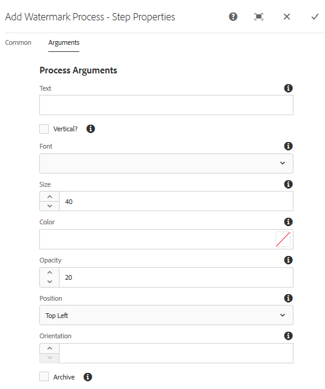

# 浮水印您的數位資產 {#watermarking}

Adobe Experience Manager(AEM)Assets可讓您在資產中新增數位浮水印，協助使用者驗證資產的真實性和版權所有權。 AEM Assets支援將文字用作PNG和JPEG檔案上的浮水印。

若要能夠套用資產上的浮水印，請在 [!UICONTROL DAM更新資產工作流程中新增浮水印步驟] 。

1. 存取AEM使用者介面，並前往「工具 **[!UICONTROL >工作]** 流程 **[!UICONTROL >]** 模型 ****」。
1. 在「工作 **[!UICONTROL 流模型]** 」頁面中，選擇「 **[!UICONTROL DAM更新資產」工作流]** ，然後按一下「 **[!UICONTROL 編輯」]**。

1. 從側面板，將「新增浮水印 **[!UICONTROL 」步驟拖曳至]** DAM更新資產工作流程  。

   

   >[!NOTE]
   >
   >將「新增 [!UICONTROL 浮水印] 」步驟放在「處理縮 [!UICONTROL 圖」步驟之前] 。

1. 開啟「 **[!UICONTROL 新增浮水印]** 」步驟以顯示其屬性。
1. 在「參 **[!UICONTROL 數]** 」標籤中，在各種欄位中指定有效值，包括文字、字型類型、大小、顏色、位置、方向等。 若要確認變更，請點選／按一下「完成」圖示。

   

1. 使用浮水印 **[!UICONTROL 步驟儲存DAM更新資產]** (Dam Update Asset)工作流程。
1. 從「資產」使用者介面上傳範例資產。 浮水印會在您在上述步驟中設定的位置顯示字型大小、顏色等。
