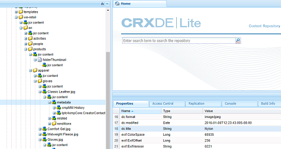

# XMP回寫至轉譯 {#xmp-writeback-to-renditions}

| 版本 | 文章連結 |
| -------- | ---------------------------- |
| AEM as a Cloud Service  | [按一下這裡](https://experienceleague.adobe.com/docs/experience-manager-cloud-service/content/assets/admin/xmp-metadata.html?lang=en) |
| AEM 6.5 | 本文 |

此XMP回寫功能位於 [!DNL Adobe Experience Manager Assets] 會將中繼資料變更複製至原始資產的轉譯。 當您從資產內變更資產的中繼資料，或在上傳資產時，變更最初儲存在資產階層的中繼資料節點中。

XMP回寫功能可讓您將中繼資料變更傳播至資產的所有或特定轉譯。 功能只會回寫使用的中繼資料屬性 `jcr` 命名空間，即名為 `dc:title` 被寫回了，但被命名為 `mytitle` 不是。

假設您修改 [!UICONTROL 標題] 資產的屬性(標題為 `Classic Leather` to `Nylon`.

在此情況下， [!DNL Experience Manager Assets] 將變更儲存至 **[!UICONTROL 標題]** 屬性 `dc:title` 資產階層中儲存的資產中繼資料的參數。

不過， [!DNL Experience Manager Assets] 不會自動將任何中繼資料變更傳播至資產的轉譯。 請參閱 [如何啟用XMP回寫](#enable-xmp-writeback).

## 啟用XMP回寫 {#enable-xmp-writeback}

若要啟用中繼資料變更，以便在上傳資產時傳播至資產的轉譯，請修改 **[!UICONTROL Adobe CQ DAM Rendition Maker]** 配置。

1. 要開啟Configuration Manager，請訪問 `https://[aem_server]:[port]/system/console/configMgr`.
1. 開啟 **[!UICONTROL Adobe CQ DAM Rendition Maker]** 設定。
1. 選取 **[!UICONTROL 傳播XMP]** ，然後儲存變更。

   

## 為特定轉譯啟用XMP回寫 {#enabling-xmp-writeback-for-specific-renditions}

若要讓XMP回寫功能將中繼資料變更傳播至選取的轉譯，請將這些轉譯指定至XMP回寫程式工作流程步驟，其中 [!UICONTROL DAM中繼資料回寫] 工作流程。 依預設，此步驟會以原始轉譯設定。

對於XMP回寫功能，將中繼資料傳播至轉譯縮圖140.100.png和319.319.png，請執行這些步驟。

1. 在Experience Manager介面中，導覽至 **[!UICONTROL 工具]** > **[!UICONTROL 工作流程]** > **[!UICONTROL 模型]**.
1. 從「模型」頁開啟 **[!UICONTROL DAM中繼資料回寫]** 工作流程模型。
1. 在「 **[!UICONTROL DAM中繼資料回寫]** 」屬性頁面中，開啟 **[!UICONTROL 「XMP回寫程式」步驟]** 。
1. 在 [!UICONTROL 步驟屬性] 對話框，按一下 **[!UICONTROL 程式]** 標籤。
1. 在 **引數** 框，添加 `rendition:cq5dam.thumbnail.140.100.png,rendition:cq5dam.thumbnail.319.319.png`，然後按一下 **[!UICONTROL 確定]**.

   

1. 儲存變更。
1. 重新生成金字塔TIFF格式副本 [!DNL Dynamic Media] 影像（具有新屬性），請新增 **[!UICONTROL Dynamic Media處理影像資產]** 步驟至 [!UICONTROL DAM中繼資料回寫] 工作流程。

   PTIFF轉譯只會在Dynamic Media Hybrid實作中建立並儲存在本機。

1. 儲存工作流程。

中繼資料變更會傳播至資產的轉譯縮圖。140.100.png和縮圖。319.319.png，而非其他。

>[!NOTE]
>
>有關64位Linux中的XMP回寫問題，請參閱 [如何在64位RedHat Linux上啟用XMP回寫](https://helpx.adobe.com/experience-manager/kb/enable-xmp-write-back-64-bit-redhat.html).
>
>如需支援的平台，請參閱 [XMP中繼資料回寫必要條件](/help/sites-deploying/technical-requirements.md#requirements-for-aem-assets-xmp-metadata-write-back).

## 篩選XMP中繼資料 {#filtering-xmp-metadata}

[!DNL Experience Manager Assets] 支援封鎖清單和允許的清單篩選XMP中繼資料的屬性/節點，這些中繼資料會從資產二進位檔讀取，並在內嵌資產時儲存在JCR中。

使用封鎖清單進行篩選可讓您匯入除了為排除指定的屬性以外的所有XMP中繼資料屬性。 但是，對於具有大量XMP中繼資料的資產類型（例如1000個節點，具有10,000個屬性），要篩選的節點名稱並不總是事先知道。 如果使用封鎖清單進行篩選，可匯入大量具有大量XMP中繼資料的資產，則 [!DNL Experience Manager] 部署可能會遇到穩定性問題，例如阻塞的觀察隊列。

透過允許的清單篩選XMP中繼資料可讓您定義要匯入的XMP屬性，借此解決此問題。 如此一來，會忽略任何其他或未知的XMP屬性。 為了向後相容性，您可以將其中一些屬性新增到使用已封鎖清單的篩選器中。

>[!NOTE]
>
>篩選只適用於資產二進位檔中從XMP來源衍生的屬性。 對於從非XMP來源衍生的屬性（例如EXIF和IPTC格式），篩選無法運作。 例如，資產建立日期會儲存在名為 `CreateDate` 在EXIFTIFF中。 Experience Manager將此值儲存在名為的中繼資料欄位中 `exif:DateTimeOriginal`. 由於來源為非XMP來源，因此篩選對此屬性無效。

1. 要開啟Configuration Manager，請訪問 `https://[aem_server]:[port]/system/console/configMgr`.
1. 開啟 **[!UICONTROL Adobe CQ DAM XmpFilter]** 設定。
1. 若要透過允許的清單套用篩選，請選取 **[!UICONTROL 將允許清單套用至XMP屬性]**，並指定要在 **[!UICONTROL 允許的XMP篩選XML名稱]** 框。

   

1. 若要在透過允許的清單套用篩選後篩除已封鎖的XMP屬性，請在 **[!UICONTROL 用於XMP篩選的已阻止的XML名稱]** 框。

   >[!NOTE]
   >
   >此 **[!UICONTROL 將封鎖清單套用至XMP屬性]** 選項。 換言之，預設會啟用使用封鎖清單進行篩選。 若要停用此類篩選，請取消選取 **[!UICONTROL 將封鎖清單套用至XMP屬性]** 選項。

1. 儲存變更。
