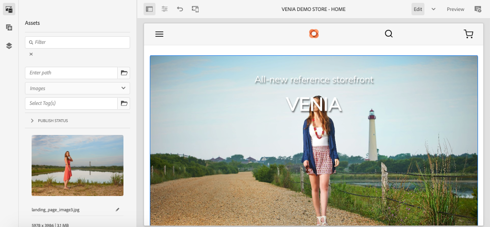
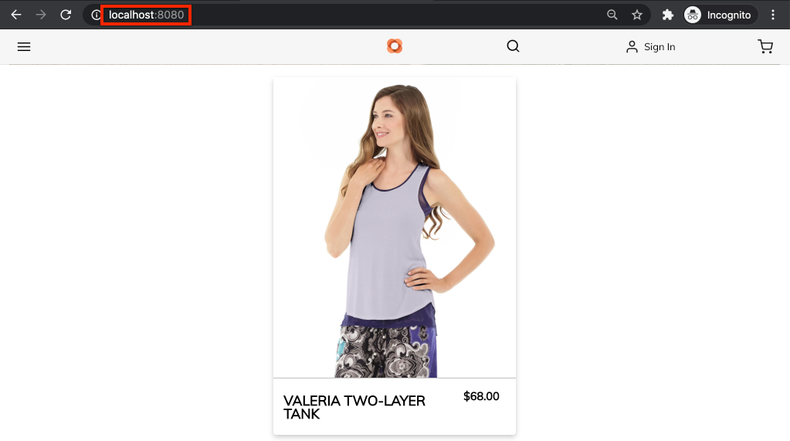

# 建立AEM CIF核心元件的樣式 {#style-aem-cif-core-components}

此 [CIF Venia專案](https://github.com/adobe/aem-cif-guides-venia) 是用於的參考程式碼基底 [CIF Core Components](https://github.com/adobe/aem-core-cif-components). 在本教學課程中，您會檢查Venia參考專案，並瞭解AEM CIF核心元件所使用的CSS和JavaScript如何組織。 您也會使用CSS建立樣式，以更新 **產品Teaser** 元件。

>[!TIP]
>
>使用 [AEM專案原型](https://github.com/adobe/aem-project-archetype) 當您開始自己的commerce實作時。

## 您將建置的內容

在本教學課程中，將針對類似卡片的Product Teaser元件實作新樣式。 在本教學課程中吸取的經驗教訓，可套用至其他CIF核心元件。


## 必備條件 {#prerequisites}

需要本機開發環境才能完成本教學課程。 這包括執行中的AEM執行個體，其已設定並連線至Adobe Commerce執行個體。 檢閱的需求和步驟 [使用AEM設定本機開發](../develop.md).

## 原地複製Venia專案 {#clone-venia-project}

我們仿製 [Venia專案](https://github.com/adobe/aem-cif-guides-venia) 然後覆寫預設樣式。

>[!NOTE]
>
>**歡迎使用現有專案** (根據包含CIF的AEM專案原型)並略過本節。

1. 執行下列git命令以複製專案：

   ```shell
   $ git clone git@github.com:adobe/aem-cif-guides-venia.git
   ```

1. 建置專案並將其部署到AEM的本機執行個體：

   ```shell
   $ cd aem-cif-guides-venia/
   $ mvn clean install -PautoInstallPackage,cloud
   ```

1. 新增必要的OSGi設定以將您的AEM執行個體連線到Adobe Commerce執行個體，或將設定新增到新建立的專案。

1. 此時，您應該有已連線至Adobe Commerce執行個體的有效店面版本。 導覽至 `US` > `Home` 頁面位置： [http://localhost:4502/editor.html/content/venia/us/en.html](http://localhost:4502/editor.html/content/venia/us/en.html).

   您應該會看到店面目前使用Venia主題。 展開店面的「主要」功能表，應該會看到各種類別，表示與Adobe Commerce的連線正常運作。

   

## 使用者端程式庫和ui.frontend模組 {#introduction-to-client-libraries}

在AEM中，負責轉譯店面主題/樣式的CSS和JavaScript是由 [使用者端資源庫](/help/sites-developing/clientlibs.md) 或clientlibs的簡稱。 使用者端程式庫提供的機制可將CSS和JavaScript組織在專案程式碼中，然後傳送至頁面。

品牌特定樣式可透過新增和覆寫這些使用者端資料庫所管理的CSS，套用至AEM CIF核心元件。 瞭解使用者端程式庫的結構及如何包含在頁面上，這點很重要。

此 [ui.frontend](https://experienceleague.adobe.com/docs/experience-manager-core-components/using/developing/archetype/uifrontend.html) 是專用的 [webpack](https://webpack.js.org/) 專案以管理專案的所有前端資產。 如此一來，前端開發人員便可使用各種語言和技術，例如 [TypeScript](https://www.typescriptlang.org/)， [Sas](https://sass-lang.com/) 等等。

此 `ui.frontend` 模組也是Maven模組，並使用NPM模組與較大的專案整合 [aem-clientlib-generator](https://github.com/wcm-io-frontend/aem-clientlib-generator). 在建置期間， `aem-clientlib-generator` 將編譯後的CSS和JavaScript檔案複製到中的使用者端程式庫中 `ui.apps` 模組。


*編譯的CSS和JavaScript複製自 `ui.frontend` 將模組加入 `ui.apps` Maven建置期間作為使用者端程式庫的模組*

## 更新Teaser樣式 {#ui-frontend-module}

接下來，對Teaser樣式進行小幅變更，瞭解 `ui.frontend` 模組和使用者端程式庫可運作。 使用 [您選擇的IDE](https://experienceleague.adobe.com/docs/experience-manager-learn/cloud-service/local-development-environment-set-up/development-tools.html#set-up-the-development-ide) 匯入Venia專案。 使用的熒幕擷取畫面來自 [Visual Studio Code IDE](https://experienceleague.adobe.com/docs/experience-manager-learn/cloud-service/local-development-environment-set-up/development-tools.html#microsoft-visual-studio-code).

1. 導覽並展開 **ui.frontend** 模組並展開資料夾階層以： `ui.frontend/src/main/styles/commerce`：

   

   請注意，有多個Sass (`.scss`)個檔案時，才會考量此變數。 這些是每個Commerce元件的Commerce特定樣式。

1. 開啟檔案 `_productteaser.scss`.

1. 更新 `.item__image` 規則並修改框線規則：

   ```scss
   .item__image {
       border: #ea00ff 8px solid; /* <-- modify this rule */
       display: block;
       grid-area: main;
       height: auto;
       opacity: 1;
       transition-duration: 512ms;
       transition-property: opacity, visibility;
       transition-timing-function: ease-out;
       visibility: visible;
       width: 100%;
   }
   ```

   上述規則應為產品Teaser元件新增粗粉紅色邊框。

1. 開啟新的終端機視窗並瀏覽至 `ui.frontend` 資料夾：

   ```shell
   $ cd <project-location>/aem-cif-guides-venia/ui.frontend
   ```

1. 執行下列Maven命令：

   ```shell
   $ mvn clean install
   ...
   [INFO] ------------------------------------------------------------------------
   [INFO] BUILD SUCCESS
   [INFO] ------------------------------------------------------------------------
   [INFO] Total time:  29.497 s
   [INFO] Finished at: 2020-08-25T14:30:44-07:00
   [INFO] ------------------------------------------------------------------------
   ```

   Inspect終端機輸出。 您可以看到Maven命令執行了數個NPM指令碼，包括 `npm run build`. 此 `npm run build` 命令定義於 `package.json` 及具有編譯webpack專案及觸發使用者端程式庫產生的作用。

1. Inspect檔案 `ui.frontend/dist/clientlib-site/site.css`：

   

   此檔案是專案中所有Sass檔案的編譯和縮製版本。

   >[!NOTE]
   >
   >這類檔案會從原始檔控制中忽略，因為它們應該在建置期間產生。

1. Inspect檔案 `ui.frontend/clientlib.config.js`.

   ```js
   /* clientlib.config.js*/
   ...
   // Config for `aem-clientlib-generator`
   module.exports = {
       context: BUILD_DIR,
       clientLibRoot: CLIENTLIB_DIR,
       libs: [
           {
               ...libsBaseConfig,
               name: 'clientlib-site',
               categories: ['venia.site'],
               dependencies: ['venia.dependencies', 'aem-core-cif-react-components'],
               assets: {
   ...
   ```

   這是的設定檔 [aem-clientlib-generator](https://github.com/wcm-io-frontend/aem-clientlib-generator) 和會決定編譯後的CSS和JavaScript轉換為AEM使用者端程式庫的位置和方式。

1. 在 `ui.apps` 模組檢查檔案： `ui.apps/src/main/content/jcr_root/apps/venia/clientlibs/clientlib-site/css/site.css`：

   

   這會複製 `site.css` 檔案移入 `ui.apps` 專案。 它現在是名為的使用者端資料庫的一部分 `clientlib-site` 具有類別 `venia.site`. 一旦檔案成為 `ui.apps` 模組，可部署至AEM。

   >[!NOTE]
   >
   >這類檔案也會從原始檔控制中忽略，因為它們應該在建置期間產生。

1. 接下來，檢查專案產生的其他使用者端程式庫：

   

   這些使用者端程式庫並非由 `ui.frontend` 模組。 這些使用者端資料庫會包含Adobe提供的CSS和JavaScript相依性。 這些使用者端程式庫的定義位於 `.content.xml` 每個資料夾下方的檔案。

   **clientlib-base**  — 這是空白的使用者端程式庫，只會從內嵌必要的相依性 [AEM Core Components](https://experienceleague.adobe.com/docs/experience-manager-core-components/using/introduction.html). 類別為 `venia.base`.

   **clientlib-cif**  — 這也是一個空白的使用者端程式庫，它只是從內嵌必要的相依性 [AEM CIF Core Components](https://github.com/adobe/aem-core-cif-components). 類別為 `venia.cif`.

   **clientlib-grid**  — 這包括啟用AEM回應式格線功能所需的CSS。 使用AEM格線可啟用 [版面模式](/help/sites-authoring/responsive-layout.md) AEM ，讓內容作者能調整元件大小。 類別為 `venia.grid` 並內嵌於 `venia.base` 資料庫。

1. Inspect檔案 `customheaderlibs.html` 和 `customfooterlibs.html` 下 `ui.apps/src/main/content/jcr_root/apps/venia/components/page`：

   

   這些指令碼包括 **venia.base** 和 **venia.cif** 程式庫作為所有頁面的一部分。

   >[!NOTE]
   >
   >只有基底程式庫在頁面指令碼中會加上「硬式編碼」。 `venia.site` 不會包含在這些檔案中，而是包含在頁面範本中，以提供更大的彈性。 稍後會檢查此專案。

1. 從終端機，建置並部署整個專案到AEM的本機執行個體：

   ```shell
   $ cd aem-cif-guides-venia/
   $ mvn clean install -PautoInstallPackage,cloud
   ```

## 編寫產品Teaser {#author-product-teaser}

現在程式碼更新已部署，請使用AEM編寫工具將產品Teaser元件的新執行個體新增到網站的首頁。 這可讓我們檢視更新的樣式。

1. 開啟新的瀏覽器索引標籤，並導覽至 **首頁** 網站的： [http://localhost:4502/editor.html/content/venia/us/en.html](http://localhost:4502/editor.html/content/venia/us/en.html).

1. 展開「資產尋找器」（側邊欄），在 **編輯** 模式。 將資產篩選器切換至 **產品**.

   

1. 將新產品拖放至主要版面配置容器的首頁：

   

   您應該會看到，根據先前建立的CSS規則變更，產品Teaser現在具有亮粉紅色邊框。

## 驗證頁面上的使用者端程式庫 {#verify-client-libraries}

接下來，驗證頁面上是否包含使用者端程式庫。

1. 導覽至 **首頁** 網站的： [http://localhost:4502/editor.html/content/venia/us/en.html](http://localhost:4502/editor.html/content/venia/us/en.html).

1. 選取 **頁面資訊** 功能表並按一下 **檢視已發佈**：

   

   這樣會開啟頁面，而不載入任何AEM作者JavaScript，如同它顯示在已發佈的網站上的方式。 請注意，url具有查詢引數 `?wcmmode=disabled` 已附加。 開發CSS和JavaScript時，最好使用此引數來簡化頁面，而無需AEM作者提供任何內容。

1. 檢視頁面來源，且您應該能夠識別所包含的多個使用者端程式庫：

   ```html
   <!DOCTYPE html>
   <html lang="en-US">
   <head>
       ...
       <link rel="stylesheet" href="/etc.clientlibs/venia/clientlibs/clientlib-base.min.css" type="text/css">
       <link rel="stylesheet" href="/etc.clientlibs/venia/clientlibs/clientlib-site.min.css" type="text/css">
   </head>
   ...
       <script type="text/javascript" src="/etc.clientlibs/venia/clientlibs/clientlib-site.min.js"></script>
       <script type="text/javascript" src="/etc.clientlibs/core/wcm/components/commons/site/clientlibs/container.min.js"></script>
       <script type="text/javascript" src="/etc.clientlibs/venia/clientlibs/clientlib-base.min.js"></script>
   <script type="text/javascript" src="/etc.clientlibs/core/cif/clientlibs/common.min.js"></script>
   <script type="text/javascript" src="/etc.clientlibs/venia/clientlibs/clientlib-cif.min.js"></script>
   </body>
   </html>
   ```

   傳送至頁面時的使用者端程式庫會加上前置詞 `/etc.clientlibs` 並透過 [proxy](/help/sites-developing/clientlibs.md) 以避免揭露任何敏感內容 `/apps` 或 `/libs`.

   注意 `venia/clientlibs/clientlib-site.min.css` 和 `venia/clientlibs/clientlib-site.min.js`. 這些是衍生自下列專案的已編譯CSS和JavaScript檔案： `ui.frontend` 模組。

## 包含使用者端程式庫與頁面範本 {#client-library-inclusion-pagetemplates}

包含使用者端程式庫有幾個選項。 接下來，檢查產生的專案如何包含 `clientlib-site` 程式庫，透過 [頁面範本](/help/sites-developing/templates.md).

1. 導覽至 **首頁** 在AEM編輯器中的網站： [http://localhost:4502/editor.html/content/venia/us/en.html](http://localhost:4502/editor.html/content/venia/us/en.html).

1. 選取 **頁面資訊** 功能表並按一下 **編輯範本**：

   

   這將會開啟 **登陸頁面** 範本 **首頁** 頁面根據。

   >[!NOTE]
   >
   >若要從AEM開始畫面檢視所有可用的範本，請導覽至 **工具** > **一般** > **範本**.

1. 在左上角，選取 **頁面資訊** 圖示並按一下 **頁面原則**.

   

1. 這會開啟登入頁面範本的頁面原則：

   

   在右側，您可以看到使用者端程式庫的清單 **類別** 此範本會包含在使用此範本的所有頁面上。

   * `venia.dependencies`  — 提供符合以下條件的任何廠商程式庫： `venia.site` 取決於。
   * `venia.site`  — 這是的類別 `clientlib-site` 此 `ui.frontend` 模組產生。

   請注意，其他範本使用相同的原則， **內容頁面**， **登陸頁面**、等等。 透過重複使用相同的原則，我們可以確保在所有頁面上包含相同的使用者端程式庫。

   使用範本和頁面原則來管理使用者端程式庫包含的好處是，您可以根據範本變更原則。 例如，您可能在同一個AEM執行個體中管理兩個不同的品牌。 每個品牌都有其獨特的樣式或 *主題* 但基礎程式庫和程式碼將會相同。 另一個範例，如果您有一個較大的使用者端程式庫，而您只想顯示在某些頁面上，您可以為該範本制定唯一的頁面原則。

## 本機Webpack開發 {#local-webpack-development}

在上一個練習中，更新了 `ui.frontend` 模組，然後在執行Maven組建後，變更會部署到AEM。 接下來，我們將考慮使用webpack-dev-server來快速開發前端樣式。

webpack-dev-server可代理來自AEM本機例項的影像和部分CSS/JavaScript，但可讓開發人員修改中的樣式和JavaScript `ui.frontend` 模組。

1. 在瀏覽器中導覽至 **首頁** 頁面和 **檢視已發佈**： [http://localhost:4502/content/venia/us/en.html?wcmmode=disabled](http://localhost:4502/content/venia/us/en.html?wcmmode=disabled).

1. 檢視頁面來源和 **複製** 頁面的原始HTML。

1. 返回您選擇的IDE，位於 `ui.frontend` 模組開啟檔案： `ui.frontend/src/main/static/index.html`

   

1. 覆寫以下專案的內容： `index.html` 和 **貼上** 上一步中複製的HTML。

1. 尋找包含 `clientlib-site.min.css`， `clientlib-site.min.js` 和 **移除** 它們。

   ```html
   <head>
       <!-- remove this link -->
       <link rel="stylesheet" href="/etc.clientlibs/venia/clientlibs/clientlib-base.min.css" type="text/css">
       ...
   </head>
   <body>
       ...
        <!-- remove this link -->
       <script type="text/javascript" src="/etc.clientlibs/venia/clientlibs/clientlib-site.min.js"></script>
   </body>
   ```

   這些檔案會被移除，因為它們代表產生的CSS和JavaScript編譯版本。 `ui.frontend` 模組。 保留其他使用者端程式庫，因為它們會代理自執行中的AEM執行個體。

1. 開啟新的終端機視窗並瀏覽至 `ui.frontend` 資料夾。 執行命令 `npm start`：

   ```shell
   $ cd ui.frontend
   $ npm start
   ```

   這會啟動webpack-dev-server on [http://localhost:8080/](http://localhost:8080/)

   >[!CAUTION]
   >
   >如果您收到Sass相關錯誤，請停止伺服器並執行命令 `npm rebuild node-sass` 並重複上述步驟。 如果您有其他版本的 `npm` 和 `node` 然後在專案中指定 `aem-cif-guides-venia/pom.xml`.

1. 導覽至 [http://localhost:8080/](http://localhost:8080/) 在與登入的AEM例項具有相同瀏覽器的新標籤中。 您應該會透過webpack-dev-server看到Venia首頁：

   

   讓webpack-dev-server繼續執行。 它將在下一個練習中使用。

## 實作產品Teaser的卡片樣式 {#update-css-product-teaser}

接下來，修改中的Sass檔案 `ui.frontend` 模組，實作類似卡片樣式的Product Teaser。 webpack-dev-server用於快速檢視變更。

返回IDE和產生的專案。

1. 在 **ui.frontend** 模組，重新開啟檔案 `_productteaser.scss` 於 `ui.frontend/src/main/styles/commerce/_productteaser.scss`.

1. 對產品Teaser邊框進行下列變更：

   ```diff
       .item__image {
   -       border: #ea00ff 8px solid;
   +       border-bottom: 1px solid #c0c0c0;
           display: block;
           grid-area: main;
           height: auto;
           opacity: 1;
           transition-duration: 512ms;
           transition-property: opacity, visibility;
           transition-timing-function: ease-out;
           visibility: visible;
           width: 100%;
       }
   ```

   儲存變更，webpack-dev-server應自動以新樣式重新整理。

1. 在「產品Teaser」中新增投影並包含圓角。

   ```scss
    .item__root {
        position: relative;
        box-shadow: 0 4px 8px 0 rgba(0,0,0,0.2);
        transition: 0.3s;
        border-radius: 5px;
        float: left;
        margin-left: 12px;
        margin-right: 12px;
   }
   
   .item__root:hover {
      box-shadow: 0 8px 16px 0 rgba(0,0,0,0.2);
   }
   ```

1. 更新產品名稱以顯示於Teaser底部，並修改文字顏色。

   ```css
   .item__name {
       color: #000;
       display: block;
       float: left;
       font-size: 22px;
       font-weight: 900;
       line-height: 1em;
       padding: 0.75em;
       text-transform: uppercase;
       width: 75%;
   }
   ```

1. 更新產品的價格，使其也出現在Teaser底部，並修改文字顏色。

   ```css
   .price {
       color: #000;
       display: block;
       float: left;
       font-size: 18px;
       font-weight: 900;
       padding: 0.75em;
       padding-bottom: 2em;
       width: 25%;
   
       ...
   ```

1. 更新底部的媒體查詢，在小於的畫面中棧疊名稱和價格 **992畫素**.

   ```css
   @media (max-width: 992px) {
       .productteaser .item__name {
           font-size: 18px;
           width: 100%;
       }
       .productteaser .item__price {
           font-size: 14px;
           width: 100%;
       }
   }
   ```

   您現在應該會看到卡片樣式反映在webpack-dev-server中：

   

   不過，變更尚未部署至AEM。 您可以下載 [在此填入解決方案檔案](../assets/style-cif-component/_productteaser.scss).

1. 從命令列終端機，使用您的Maven技能將更新部署到AEM：

   ```shell
   $ cd aem-cif-guides-venia/
   $ mvn clean install -PautoInstallPackage,cloud
   ```

   >[!NOTE]
   >此外， [IDE設定和工具](https://experienceleague.adobe.com/docs/experience-manager-learn/foundation/development/set-up-a-local-aem-development-environment.html#set-up-an-integrated-development-environment) 可將專案檔案直接同步至本機AEM執行個體，而不需執行完整的Maven建置。

## 檢視更新的產品Teaser {#view-updated-product-teaser}

將專案的程式碼部署到AEM後，您應該能夠看到產品Teaser的變更。

1. 返回瀏覽器並重新整理「首頁」： [http://localhost:4502/editor.html/content/venia/us/en.html](http://localhost:4502/editor.html/content/venia/us/en.html). 您應該會看到已套用更新的產品Teaser樣式。

   

1. 新增其他產品Teaser以進行實驗。 使用「版面模式」來變更元件的寬度和位移，以一列顯示多個Teaser。

   

## 疑難排解 {#troubleshooting}

您可以驗證 [CRXDE-Lite](http://localhost:4502/crx/de/index.jsp) 更新的CSS檔案已部署： [http://localhost:4502/crx/de/index.jsp#/apps/venia/clientlibs/clientlib-site/css/site.css](http://localhost:4502/crx/de/index.jsp#/apps/venia/clientlibs/clientlib-site/css/site.css)

部署新的CSS和/或JavaScript檔案時，請務必確保瀏覽器不會提供過時的檔案。 您可以清除瀏覽器快取或啟動新的瀏覽器工作階段來消除此問題。

AEM也會嘗試快取使用者端程式庫以獲得效能。 有時，在程式碼部署後，系統會提供舊檔案。 您可以使用手動使AEM使用者端程式庫快取失效 [重新建置使用者端資料庫工具](http://localhost:4502/libs/granite/ui/content/dumplibs.rebuild.html). *如果您懷疑AEM已快取舊版的使用者端程式庫，建議使用讓快取失效的方法。 重建程式庫效率低下且耗時。*

## 恭喜 {#congratulations}

您設定了第一個AEM CIF核心元件的樣式，而且使用了Webpack開發伺服器！

## 額外挑戰 {#bonus-challenge}

使用 [AEM樣式系統](/help/sites-authoring/style-system.md) 以建立可由內容作者開啟/關閉的兩種樣式。 [使用樣式系統進行開發](https://experienceleague.adobe.com/docs/experience-manager-learn/getting-started-wknd-tutorial-develop/project-archetype/style-system.html) 包含如何完成此作業的詳細步驟和資訊。


## 其他資源 {#additional-resources}

* [AEM 專案原型](https://github.com/adobe/aem-project-archetype)
* [AEM CIF Core Components](https://github.com/adobe/aem-core-cif-components)
* [設定本機AEM開發環境](https://experienceleague.adobe.com/docs/experience-manager-learn/cloud-service/local-development-environment-set-up/overview.html?lang=zh-Hant)
* [用戶端資源庫](/help/sites-developing/clientlibs.md)
* [AEM Sites快速入門](https://experienceleague.adobe.com/docs/experience-manager-learn/getting-started-wknd-tutorial-develop/overview.html?lang=zh-Hant)
* [使用樣式系統進行開發](https://experienceleague.adobe.com/docs/experience-manager-learn/getting-started-wknd-tutorial-develop/project-archetype/style-system.html)
