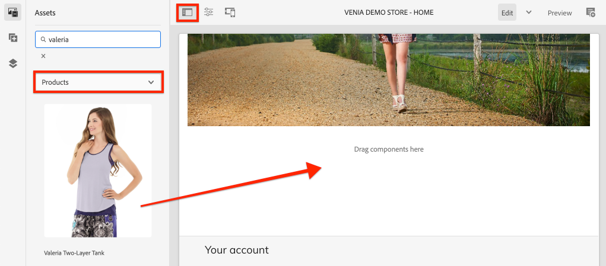

# 樣式AEM CIF核心元件 {#style-aem-cif-core-components}

此 [CIF Venia項目](https://github.com/adobe/aem-cif-guides-venia) 是使用的參考程式碼基底 [CIF核心元件](https://github.com/adobe/aem-core-cif-components). 在本教學課程中，您將檢查Venia參考專案，並了解AEM CIF核心元件所使用的CSS和JavaScript如何組織。 您也將使用CSS建立新樣式，以更新 **Product Teaser** 元件。

>[!TIP]
>
> 使用 [AEM專案原型](https://github.com/adobe/aem-project-archetype) 開始您自己的商務實作時。

## 您要建置的

在本教學課程中，將針對類似卡片的產品預告元件實作新樣式。 本教學課程中的課程可套用至其他CIF核心元件。


## 必備條件 {#prerequisites}

完成本教學課程需要本機開發環境。 這包括已設定並連線至Adobe Commerce執行個體的AEM執行個體。 檢閱 [使用AEM設定本機開發](../develop.md).

## 複製Venia專案 {#clone-venia-project}

我們將複製 [韋尼亞項目](https://github.com/adobe/aem-cif-guides-venia) 然後覆寫預設樣式。

>[!NOTE]
>
> **歡迎使用現有專案** (根據包含CIF的AEM專案原型)，並略過本節。

1. 執行下列git命令以複製專案：

   ```shell
   $ git clone git@github.com:adobe/aem-cif-guides-venia.git
   ```

1. 建立專案並部署至AEM的本機執行個體：

   ```shell
   $ cd aem-cif-guides-venia/
   $ mvn clean install -PautoInstallPackage,cloud
   ```

1. 新增必要的OSGi設定，將您的AEM例項連線至Adobe Commerce例項，或將設定新增至新建立的專案。

1. 此時，您應該有連接至Adobe Commerce執行個體之店面的有效版本。 導覽至 `US` > `Home` 頁面： [http://localhost:4502/editor.html/content/venia/us/en.html](http://localhost:4502/editor.html/content/venia/us/en.html).

   您應該會看到店面目前使用Venia主題。 展開店面的「主功能表」時，您應該會看到各種類別，指出與Adobe Commerce的連線正在運作。

   

## 用戶端程式庫和ui.frontend模組 {#introduction-to-client-libraries}

負責轉譯店面主題/樣式的CSS和JavaScript會由AEM [用戶庫](/help/sites-developing/clientlibs.md) 或clientlib。 用戶端程式庫提供一種機制，可在專案的程式碼中組織CSS和Javascript，然後傳送至頁面。

借由新增和覆寫由這些用戶端程式庫管理的CSS，可將品牌特定樣式套用至AEM CIF核心元件。 了解用戶端程式庫的結構化及包含在頁面上的方式至關重要。

此 [ui.frontend](https://docs.adobe.com/content/help/en/experience-manager-core-components/using/developing/archetype/uifrontend.html) 是專屬 [webpack](https://webpack.js.org/) 專案，管理專案的所有前端資產。 這可讓前端開發人員使用任意數量的語言和技術，例如 [TypeScript](https://www.typescriptlang.org/), [薩斯](https://sass-lang.com/) 還有更多。

此 `ui.frontend` 模組也是Maven模組，通過使用NPM模組與較大的項目整合 [aem-clientlib-generator](https://github.com/wcm-io-frontend/aem-clientlib-generator). 在建置期間， `aem-clientlib-generator` 將編譯的CSS和JavaScript檔案複製到 `ui.apps` 模組。


*編譯的CSS和Javascript會從 `ui.frontend` 模組 `ui.apps` 模組，在Maven建置期間作為用戶端程式庫*

## 更新預告樣式 {#ui-frontend-module}

接下來，對Teaser樣式進行小幅變更，以了解 `ui.frontend` 模組和用戶端程式庫可運作。 使用 [您選擇的IDE](https://docs.adobe.com/content/help/en/experience-manager-learn/cloud-service/local-development-environment-set-up/development-tools.html#set-up-the-development-ide) 匯入Venia專案。 使用的螢幕擷取畫面來自 [Visual Studio代碼IDE](https://docs.adobe.com/content/help/en/experience-manager-learn/cloud-service/local-development-environment-set-up/development-tools.html#microsoft-visual-studio-code).

1. 導覽及展開 **ui.frontend** 模組，然後展開資料夾階層以： `ui.frontend/src/main/styles/commerce`:

   

   請注意，有多個Sas(`.scss`)檔案。 這些是每個商務元件的商務特定樣式。

1. 開啟檔案 `_productteaser.scss`.

1. 更新 `.item__image` 規則及修改邊框規則：

   ```scss
   .item__image {
       border: #ea00ff 8px solid; /* <-- modify this rule */
       display: block;
       grid-area: main;
       height: auto;
       opacity: 1;
       transition-duration: 512ms;
       transition-property: opacity, visibility;
       transition-timing-function: ease-out;
       visibility: visible;
       width: 100%;
   }
   ```

   上述規則應在「產品預告元件」中新增非常粗體的粉紅色邊框。

1. 開啟新的終端機視窗，並導覽至 `ui.frontend` 資料夾：

   ```shell
   $ cd <project-location>/aem-cif-guides-venia/ui.frontend
   ```

1. 運行以下Maven命令：

   ```shell
   $ mvn clean install
   ...
   [INFO] ------------------------------------------------------------------------
   [INFO] BUILD SUCCESS
   [INFO] ------------------------------------------------------------------------
   [INFO] Total time:  29.497 s
   [INFO] Finished at: 2020-08-25T14:30:44-07:00
   [INFO] ------------------------------------------------------------------------
   ```

   Inspect輸出。 您將看到Maven命令執行了多個NPM指令碼，包括 `npm run build`. 此 `npm run build` 命令 `package.json` 具有編譯webpack項目和觸發客戶端庫生成的效果。

1. Inspect檔案 `ui.frontend/dist/clientlib-site/site.css`:

   

   該檔案是項目中所有Sass檔案的編譯和縮製版本。

   >[!NOTE]
   >
   > 類似的檔案會從原始碼控制項中忽略，因為它們應在建置期間產生。

1. Inspect檔案 `ui.frontend/clientlib.config.js`.

   ```js
   /* clientlib.config.js*/
   ...
   // Config for `aem-clientlib-generator`
   module.exports = {
       context: BUILD_DIR,
       clientLibRoot: CLIENTLIB_DIR,
       libs: [
           {
               ...libsBaseConfig,
               name: 'clientlib-site',
               categories: ['venia.site'],
               dependencies: ['venia.dependencies', 'aem-core-cif-react-components'],
               assets: {
   ...
   ```

   這是 [aem-clientlib-generator](https://github.com/wcm-io-frontend/aem-clientlib-generator) 和可決定編譯的CSS和JavaScript將在何處及如何轉換為AEM用戶端程式庫。

1. 在 `ui.apps` 模組檢查檔案： `ui.apps/src/main/content/jcr_root/apps/venia/clientlibs/clientlib-site/css/site.css`:

   

   這會複製 `site.css` 檔案 `ui.apps` 專案。 它現在是用戶端程式庫的一部分，名為 `clientlib-site` 具有 `venia.site`. 一旦檔案成為 `ui.apps` 模組，可部署至AEM。

   >[!NOTE]
   >
   > 類似的檔案也會從原始碼控制項中忽略，因為這些檔案應在建置期間產生。

1. 接下來檢查項目生成的其他客戶端庫：

   

   這些用戶端程式庫不由 `ui.frontend` 模組。 而是這些用戶端程式庫包含Adobe提供的CSS和JavaScript相依性。 這些用戶端程式庫的定義位於 `.content.xml` 檔案。

   **clientlib-base**  — 這是空的用戶端程式庫，僅內嵌來自 [AEM核心元件](https://docs.adobe.com/content/help/zh-Hant/experience-manager-core-components/using/introduction.html). 類別為 `venia.base`.

   **clientlib-cif**  — 這也是空的用戶端程式庫，僅內嵌來自 [AEM CIF核心元件](https://github.com/adobe/aem-core-cif-components). 類別為 `venia.cif`.

   **clientlib-grid**  — 這包括啟用AEM回應式格線功能所需的CSS。 使用AEM格線可啟用 [版面模式](/help/sites-authoring/responsive-layout.md) 在AEM編輯器中，讓內容作者能夠重新調整元件大小。 類別為 `venia.grid` 和內嵌於 `venia.base` 程式庫。

1. Inspect檔案 `customheaderlibs.html` 和 `customfooterlibs.html` 在 `ui.apps/src/main/content/jcr_root/apps/venia/components/page`:

   

   這些指令碼包括 **venia.base** 和 **venia.cif** 程式庫。

   >[!NOTE]
   >
   > 只有基礎程式庫會在頁面指令碼中「硬式編碼」。 `venia.site` 未包含在這些檔案中，而是包含在頁面範本中，以獲得更大的彈性。 稍後會檢查。

1. 從終端機，建立整個專案並部署至本機AEM例項：

   ```shell
   $ cd aem-cif-guides-venia/
   $ mvn clean install -PautoInstallPackage,cloud
   ```

## 製作產品預告 {#author-product-teaser}

現在程式碼更新已部署完畢，請使用AEM製作工具將Product Teaser元件的新例項新增至網站的首頁。 這可讓我們檢視更新的樣式。

1. 開啟新的瀏覽器標籤，並導覽至 **首頁** (位於： [http://localhost:4502/editor.html/content/venia/us/en.html](http://localhost:4502/editor.html/content/venia/us/en.html).

1. 展開資產尋找器（側邊欄），位於 **編輯** 模式。 將「資產」篩選器切換為 **產品**.

   

1. 將新產品拖放至主「版面容器」的首頁：

   

   您應該會看到Product Teaser現在已根據先前建立的CSS規則變更，有亮粉色邊框。

## 驗證頁面上的客戶端庫 {#verify-client-libraries}

接下來，驗證頁面上是否包含用戶端程式庫。

1. 導覽至 **首頁** (位於： [http://localhost:4502/editor.html/content/venia/us/en.html](http://localhost:4502/editor.html/content/venia/us/en.html).

1. 選取 **頁面資訊** 按一下 **檢視為已發佈**:

   

   這會開啟頁面而未載入任何AEM作者javascript，就像顯示在已發佈的網站上一樣。 請注意，URL具有查詢參數 `?wcmmode=disabled` 已附加。 開發CSS和Javascript時，最好使用此參數來簡化頁面，而不需要AEM作者提供任何內容。

1. 檢視頁面來源，您應能識別包含的數個用戶端程式庫：

   ```html
   <!DOCTYPE html>
   <html lang="en-US">
   <head>
       ...
       <link rel="stylesheet" href="/etc.clientlibs/venia/clientlibs/clientlib-base.min.css" type="text/css">
       <link rel="stylesheet" href="/etc.clientlibs/venia/clientlibs/clientlib-site.min.css" type="text/css">
   </head>
   ...
       <script type="text/javascript" src="/etc.clientlibs/venia/clientlibs/clientlib-site.min.js"></script>
       <script type="text/javascript" src="/etc.clientlibs/core/wcm/components/commons/site/clientlibs/container.min.js"></script>
       <script type="text/javascript" src="/etc.clientlibs/venia/clientlibs/clientlib-base.min.js"></script>
   <script type="text/javascript" src="/etc.clientlibs/core/cif/clientlibs/common.min.js"></script>
   <script type="text/javascript" src="/etc.clientlibs/venia/clientlibs/clientlib-cif.min.js"></script>
   </body>
   </html>
   ```

   傳送至頁面時，用戶端程式庫的前置詞為 `/etc.clientlibs` 並透過 [代理](/help/sites-developing/clientlibs.md) 避免在 `/apps` 或 `/libs`.

   通知 `venia/clientlibs/clientlib-site.min.css` 和 `venia/clientlibs/clientlib-site.min.js`. 這些是從 `ui.frontend` 模組。

## 包含頁面範本的用戶端程式庫 {#client-library-inclusion-pagetemplates}

如何包含用戶端程式庫有數個選項。 接下來檢查產生的專案如何包含 `clientlib-site` 透過資料庫 [頁面範本](/help/sites-developing/templates.md).

1. 導覽至 **首頁** 在AEM編輯器中： [http://localhost:4502/editor.html/content/venia/us/en.html](http://localhost:4502/editor.html/content/venia/us/en.html).

1. 選取 **頁面資訊** 按一下 **編輯範本**:

   

   這會開啟 **登陸頁面** 範本 **首頁** 頁面是根據的。

   >[!NOTE]
   >
   > 若要從AEM開始畫面檢視所有可用的範本，請導覽至 **工具** > **一般** > **範本**.

1. 在左上角，選取 **頁面資訊** 圖示並按一下 **頁面原則**.

   

1. 這會開啟「登錄頁面」範本的「頁面原則」：

   

   在右側，您可以看到用戶端程式庫清單 **類別** 將包含在使用此範本的所有頁面上。

   * `venia.dependencies`  — 提供任何供應商庫， `venia.site` 取決於。
   * `venia.site`  — 這是 `clientlib-site` the `ui.frontend` 模組產生。

   請注意，其他範本使用相同的原則， **內容頁面**, **登陸頁面**&#x200B;等。 通過重新使用相同的策略，我們可以確保所有頁面上都包含相同的客戶端庫。

   使用模板和頁面策略來管理包含客戶端庫的好處是，您可以按模板更改策略。 例如，您可能在同一個AEM例項內管理兩個不同的品牌。 每個品牌都有其獨特的風格或 *主題* 但基礎程式庫和程式碼會相同。 另一個範例是，如果您有一個較大的客戶端庫，而您只想在某些頁面上顯示，則可以僅針對該範本建立唯一的頁面原則。

## 本機Webpack開發 {#local-webpack-development}

在先前的練習中，已更新 `ui.frontend` 模組，然後在執行Maven組建後，將變更部署至AEM。 接下來，我們將探討如何利用Webpack-dev-server來快速開發前端樣式。

來自AEM本機例項的webpack-dev-server proxy影像和部分CSS/JavaScript，但可讓開發人員修改 `ui.frontend` 模組。

1. 在瀏覽器中導覽至 **首頁** 頁面和 **檢視為已發佈**: [http://localhost:4502/content/venia/us/en.html?wcmmode=disabled](http://localhost:4502/content/venia/us/en.html?wcmmode=disabled).

1. 檢視頁面的來源，以及 **副本** 頁面的原始HTML。

1. 返回您選擇的IDE，位於 `ui.frontend` 模組會開啟檔案： `ui.frontend/src/main/static/index.html`

   

1. 覆寫 `index.html` 和 **貼上** 在上一步驟中複製的HTML。

1. 查找包括 `clientlib-site.min.css`, `clientlib-site.min.js` 和 **移除** 他們。

   ```html
   <head>
       <!-- remove this link -->
       <link rel="stylesheet" href="/etc.clientlibs/venia/clientlibs/clientlib-base.min.css" type="text/css">
       ...
   </head>
   <body>
       ...
        <!-- remove this link -->
       <script type="text/javascript" src="/etc.clientlibs/venia/clientlibs/clientlib-site.min.js"></script>
   </body>
   ```

   這些檔案會移除，因為它們代表由 `ui.frontend` 模組。 保留其他用戶端程式庫，因為這些程式庫將從執行中的AEM執行個體中複製。

1. 開啟新的終端機視窗，並導覽至 `ui.frontend` 檔案夾。 運行命令 `npm start`:

   ```shell
   $ cd ui.frontend
   $ npm start
   ```

   這會在上啟動Webpack-dev-server [http://localhost:8080/](http://localhost:8080/)

   >[!CAUTION]
   >
   > 如果出現與Sass相關的錯誤，請停止伺服器並運行命令 `npm rebuild node-sass` 並重複上述步驟。 如果您有不同版本的 `npm` 和 `node` 然後在專案中指定 `aem-cif-guides-venia/pom.xml`.

1. 導覽至 [http://localhost:8080/](http://localhost:8080/) 在與AEM登入例項具有相同瀏覽器的新索引標籤中。 您應該會透過webpack-dev-server看到Venia首頁：

   

   讓Webpack-dev-server保持運行。 它將用於下一練習。

## 為Product Teaser實作卡樣式 {#update-css-product-teaser}

接下來，修改 `ui.frontend` 模組，為Product Teaser實作類似卡片的樣式。 webpack-dev-server將用於快速查看更改。

返回到IDE和生成的項目。

1. 在 **ui.frontend** 模組重新開啟檔案 `_productteaser.scss` at `ui.frontend/src/main/styles/commerce/_productteaser.scss`.

1. 對Product Teaser邊框進行下列變更：

   ```diff
       .item__image {
   -       border: #ea00ff 8px solid;
   +       border-bottom: 1px solid #c0c0c0;
           display: block;
           grid-area: main;
           height: auto;
           opacity: 1;
           transition-duration: 512ms;
           transition-property: opacity, visibility;
           transition-timing-function: ease-out;
           visibility: visible;
           width: 100%;
       }
   ```

   儲存變更，webpack-dev-server應會自動以新樣式重新整理。

1. 在Product Teaser中添加陰影並包括圓角。

   ```scss
    .item__root {
        position: relative;
        box-shadow: 0 4px 8px 0 rgba(0,0,0,0.2);
        transition: 0.3s;
        border-radius: 5px;
        float: left;
        margin-left: 12px;
        margin-right: 12px;
   }
   
   .item__root:hover {
      box-shadow: 0 8px 16px 0 rgba(0,0,0,0.2);
   }
   ```

1. 更新產品名稱以顯示在預告底部，並修改文字顏色。

   ```css
   .item__name {
       color: #000;
       display: block;
       float: left;
       font-size: 22px;
       font-weight: 900;
       line-height: 1em;
       padding: 0.75em;
       text-transform: uppercase;
       width: 75%;
   }
   ```

1. 更新產品價格以同時顯示在宣傳預告底部，並修改文字顏色。

   ```css
   .price {
       color: #000;
       display: block;
       float: left;
       font-size: 18px;
       font-weight: 900;
       padding: 0.75em;
       padding-bottom: 2em;
       width: 25%;
   
       ...
   ```

1. 更新底部的媒體查詢，將名稱和價格堆疊在小於 **992px**.

   ```css
   @media (max-width: 992px) {
       .productteaser .item__name {
           font-size: 18px;
           width: 100%;
       }
       .productteaser .item__price {
           font-size: 14px;
           width: 100%;
       }
   }
   ```

   您現在應該會看到Webpack-dev-server反映的卡片樣式：

   

   不過，這些變更尚未部署至AEM。 您可以下載 [解決方案檔案在此處](../assets/style-cif-component/_productteaser.scss).

1. 使用您的Maven技能，從命令列終端機部署更新至AEM:

   ```shell
   $ cd aem-cif-guides-venia/
   $ mvn clean install -PautoInstallPackage,cloud
   ```

   >[!NOTE]
   >還有其他 [IDE設定和工具](https://docs.adobe.com/content/help/en/experience-manager-learn/foundation/development/set-up-a-local-aem-development-environment.html#set-up-an-integrated-development-environment) 可直接將專案檔案同步至本機AEM執行個體，而無須執行完整的Maven組建。

## 檢視更新的Product Teaser {#view-updated-product-teaser}

將專案的程式碼部署至AEM後，我們現在應該就能看到產品預告的變更。

1. 返回瀏覽器並重新整理首頁： [http://localhost:4502/editor.html/content/venia/us/en.html](http://localhost:4502/editor.html/content/venia/us/en.html). 您應該會看到已套用更新的產品預告樣式。

   

1. 加入其他產品茶匙來試驗。 使用「佈局模式」更改元件的寬度和偏移，以便在行中顯示多個茶匙。

   

## 疑難排解 {#troubleshooting}

您可以在 [CRXDE-Lite](http://localhost:4502/crx/de/index.jsp) 已部署更新的CSS檔案： [http://localhost:4502/crx/de/index.jsp#/apps/venia/clientlibs/clientlib-site/css/site.css](http://localhost:4502/crx/de/index.jsp#/apps/venia/clientlibs/clientlib-site/css/site.css)

部署新的CSS和/或JavaScript檔案時，請務必確保瀏覽器不提供過時檔案的服務。 您可以清除瀏覽器快取或啟動新的瀏覽器工作階段，以消除此情況。

AEM也會嘗試快取用戶端程式庫以提升效能。 有時，在程式碼部署後，會提供舊版檔案。 您可以使用 [重建客戶端庫工具](http://localhost:4502/libs/granite/ui/content/dumplibs.rebuild.html). *如果您懷疑AEM已快取舊版用戶端程式庫，建議使用「無效快取」。 重建庫效率低下，且耗時。*

## 恭喜 {#congratulations}

您剛設定好第一個AEM CIF核心元件的樣式，且使用Webpack開發伺服器！

## 獎金挑戰 {#bonus-challenge}

使用 [AEM樣式系統](/help/sites-authoring/style-system.md) 建立可供內容作者開啟/關閉的兩種樣式。 [與風格體系一起發展](https://docs.adobe.com/content/help/en/experience-manager-learn/getting-started-wknd-tutorial-develop/style-system.html) 包含如何完成此作業的詳細步驟和資訊。


## 其他資源 {#additional-resources}

* [AEM 專案原型](https://github.com/adobe/aem-project-archetype)
* [AEM CIF核心元件](https://github.com/adobe/aem-core-cif-components)
* [設定本機AEM開發環境](https://docs.adobe.com/content/help/en/experience-manager-learn/cloud-service/local-development-environment-set-up/overview.html)
* [用戶端資源庫](/help/sites-developing/clientlibs.md)
* [開始使用AEM Sites](https://docs.adobe.com/content/help/en/experience-manager-learn/getting-started-wknd-tutorial-develop/overview.html)
* [與風格體系一起發展](https://docs.adobe.com/content/help/en/experience-manager-learn/getting-started-wknd-tutorial-develop/style-system.html)
