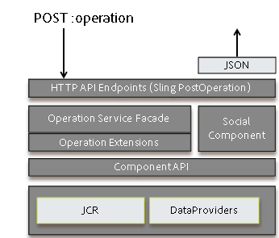

# 活動串流功能{#activity-streams-feature}

## 簡介 {#introduction}

在社區成員中籤名的活動（例如張貼到論壇或部落格）被收集到流中，該流可以通過元件的配置以各種方式被過濾和顯 `Activity Streams` 示。

關注能力為社區成員關注感興趣的帖子或關注其他社區成員的活動添加了另一種活動視圖。

本檔案說明：

* 新增「活動串流」元件至AEM網站
* 活動流元件的配置設定

### 新增活動串流至頁面 {#adding-activity-streams-to-a-page}

如果想要以作者模式將元 `Activity Streams` 件新增至頁面，請使用元件瀏覽器來尋找

* `Communities / Activity Streams`

並將它拖曳至應顯示活動串流的頁面上。

如需必要資訊，請造 [訪Communities Components Basics](/help/communities/basics.md)。

當包含 [所需的用戶端程式庫](/help/communities/essentials-activities.md#essentials-for-client-side) ，元件的顯示方式 `Activity Streams` 如下：

### 設定活動串流 {#configuring-activity-streams}

選擇要訪問 `Activity Streams` 的已放置元件，並選 `Configure` 擇開啟編輯對話框的表徵圖。

在「使用 **者活動** 」標籤下，指定要顯示的活動：

* **活動數目上限**、要顯示的活動數目

* **串流資源路**&#x200B;徑保留空白，以預設為社群網站或社群群組。 串流資源路徑可識別活動的來源。 預設為空白。

* **顯示用戶活動視**&#x200B;圖（如果選中），則活動頁將包含一個頁籤，該頁籤根據當前成員在社區中生成的活動進行篩選。 已勾選預設值。

* **顯示所有活動視**&#x200B;圖（如果選中），則活動頁將包含一個頁籤，其中包含當前成員有權訪問的社區內生成的所有活動。 已勾選預設值。

* **如果選中「** Display Following View」（顯示後續視圖），則活動頁將包含一個頁籤，該頁籤根據當前成員正在跟蹤的活動進行篩選。 已勾選預設值。

### 後續檢視 {#following-view}

必須配置元件以啟用以下功能。 允許以下功能：部落格 [、論壇](/help/communities/blog-feature.md)、 [QnQn](/help/communities/forum.md)、Filary [brary、elignary行事歷、](/help/communities/working-with-qna.md)elicary注釋。

**Follow **button提供了以活動、通知或訂閱等形式關注 [項目](/help/communities/notifications.md)的 [方法](/help/communities/subscriptions.md)。 每次選取**Follow **button時，都可以開啟或關閉選取範圍。 只有 `Email Subscriptions` 在配置時，才會顯示選擇。

如果選取任何下列方法，按鈕的文字會變更為「下 **列」**。 為方便起見，您可以選取以 `Unfollow All` 關閉所有方法。

出現**Follow **button

* 查看其他成員的配置檔案時
* 在主功能頁面上，例如論壇、QnA和部落格

   * 遵循該一般功能的所有活動

* 針對特定項目，例如論壇主題、QnA問題或部落格文章

   * 遵循該特定條目的所有活動

### 其他資訊 {#additional-information}

如需詳細資訊，請參閱開發 [人員的Activity Streams Essentials](/help/communities/essentials-activities.md) (Activity Streams Essentials)頁面。
