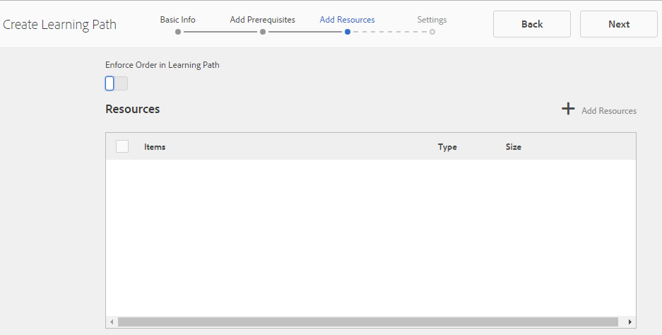

# 社群功能的Analytics設定{#analytics-configuration-for-communities-features}

## 概覽 {#overview}

Adobe Analytics和Adobe Experience Manager(AEM)都是Adobe Marketing cloud的解決方案。

Adobe Analytics可針對AEM Communities進行設定，如此當會員與支援的「社群」功能互動時，事件就會傳送至產生報表的Adobe Analytics。

例如，當啟用社群網站的成員檢視指派給他們的視訊資源時，資源播放器會傳送事件至Analytics，包括視訊心率資料。 在社群網站上，管理員可以看到各種有關視訊播放的報表。

此外，必須分析以下事項：

* 在發佈環境中：

   * 社群趨勢報 [告](/help/communities/trends.md)
   * 允許網站訪客依「檢視次數最多」、「最活躍」、「最喜歡」排序
   * UGC清單上的檢視計數

* 在作者環境中：

   * 在成員管理主控台 [中顯示參與率資料](/help/communities/members.md) （檢視、貼文、關注、按贊）
   * 趨勢摘要、視訊心率和視訊裝置，以用於啟用資源報 [告](/help/communities/reports.md)

支援的社群功能包括：

* [啟用資源](/help/communities/resources.md)
* [論壇](/help/communities/forum.md)
* [QnA](/help/communities/working-with-qna.md)
* [部落格](/help/communities/blog-feature.md)
* [檔案庫](/help/communities/file-library.md)
* [日曆](/help/communities/calendar.md)

本節說明如何將Analytics報表套裝與社群功能連接。 基本步驟為：

1. [複製加密金鑰](#replicate-the-crypto-key) ，以確保所有AEM例項都能正確執行加密／解密
1. 準備Adobe Analytics報 [表套裝](#adobe-analytics-report-suite-for-video-reporting)
1. 建立AEM Analytics雲端 [服務](#aem-analytics-cloud-service-configuration) 和架 [構](#aem-analytics-framework-configuration)

1. [啟用社群網站的Analytics](#enable-analytics-for-a-community-site)
1. [**驗證&#x200B;**](#verify-analytics-to-aem-variable-mapping)Analytics與AEM變數對應
1. 識別主 [要發行者](#primary-publisher)
1. [發佈](#publish-community-site-and-analytics-cloud-service) 社群網站
1. 設 [定從Adobe Analytics匯入報表資料](#obtaining-reports-from-analytics) 至社群網站

## 必備條件 {#prerequisites}

若要設定Analytics for Communities功能，必須與您的帳戶代表合作，以設定Adobe Analytics帳戶和報 [表套裝](#adobe-analytics-report-suite-for-video-reporting)。 建立後，應提供下列資訊：

* 公司名稱與Adobe Analytics帳戶關聯的公司
* 使用者名稱：獲授權管理Analytics帳戶之使用者的登入使用者名稱（應包含網站服務存取權限）

* 密碼為授權用戶的登錄密碼
* Analytics資料中心帳戶的Analytics資料中心URL
* 報表套裝要使用的Analytics報表套裝名稱

## 適用於視訊報告的Adobe Analytics報表套裝 {#adobe-analytics-report-suite-for-video-reporting}

使用Adobe Marketing cloud的「報表套裝管 [理員」](https://marketing.adobe.com/resources/help/en_US/reference/new_report_suite.html)，可以設定Analytics報表套裝，讓社群網站能夠提供社群功能的報表。

透過使用公司名 [稱和使用者名稱登入Adobe Marketing Cloud](https://marketing.adobe.com/resources/help/en_US/analytics/getting-started/analytics-navigation.html)[](/help/communities/analytics.md#prerequisites)，您可以設定新的或現有的報表套裝：

* [11轉換變數](https://marketing.adobe.com/resources/help/en_US/reference/conversion_var_admin.html) (eVar)

   * **`evar1`** 啟用 **`evar11`**

   * 可重複使用（重新命名）現有的eVar，或建立新eVar以用於社群功能

* [7成功事件](https://marketing.adobe.com/resources/help/en_US/reference/success_event.html) （事件）

   * **`event1`** 啟用 **`event7`**

   * 類型 **`Counter`**

      * 非 **`Counter (no subrelations)`**
   * 可以重新使用（重新命名）現有事件，或建立新事件以用於社群功能


* [視訊管理](https://marketing.adobe.com/resources/help/en_US/sc/appmeasurement/hbvideo/video_analytics_config.html)

   * 視訊報告主控台

      * 啟用 `Video Core`
      * 選擇保存
   * 視訊核心測量主控台

      * select `Use Solution Variables`
      * 選擇保存


如果使用新 **的報表套裝**，請注意，新的報表套裝可能只有4個eVar和6個事件變數，而社群則需要11個eVar和7個事件變數。

如果使用 **現有報表套裝**，則可能需要在啟 [動社群網站的Analytics架構前修改變數對應](#modifying-analytics-variable-mapping) 。 請連絡您的帳戶代表，以瞭解有關社群專用變數的任何疑慮。

>[!CAUTION]
>
>**若使用現有報表套裝，且報表套裝已在**
>
>* **`evar1`** through **`evar11`**
   >
   >
* **`event1`** through **`event7`**
>
>
**然後，在社群網站發佈之前，** 請務必移動AEM變數，在社群網站啟用Analytics時，這些AEM變數會自動對應至Analytics變數，以還原預先存在的對應。
>
>若要還原預先存在的對應並將AEM變數移至其他Analytics變數，請參閱修改Analytics變 [數對應一節](#modifying-analytics-variable-mapping)。
>
>如果不這樣做，可能會導致無法恢復的資料丟失。

### 視訊心率分析 {#video-heartbeat-analytics}

授權視訊心率分析時，會指 `Marketing Cloud Org Id` 派一個。

若要在設定視訊報表的Analytics報 [表套裝後啟用視訊心率報表](#adobe-analytics-report-suite-for-video-reporting):

* 建立 [Analytics雲端服務](#aem-analytics-cloud-service-configuration)
* 為社 [群網站啟用Analytics](#enable-analytics-for-a-community-site)
* 將社群 `Marketing Cloud Org Id` 網站建立關聯

可 `Marketing Cloud Org Id` 以在建立社區站點時或更 [新時](/help/communities/sites-console.md#enablement) ，通過修改社 [區站點屬](/help/communities/sites-console.md#modifying-site-properties) 性來輸入。 [](#aem-analytics-cloud-service-configuration)


啟用視訊心率分析時，視訊播放器的JavaScript(JS)程式碼會執行個體化視訊心率程式庫程式碼（也包含在JS中），此程式碼會處理每10秒傳送視訊狀態更新至Analytics視訊追蹤伺服器的所有邏輯（不可設定），並最終傳送視訊工作階段的累積報表至主要Analytics伺服器。

若未啟用，則不會執行個體化視訊心率程式碼，且只會將視訊進度和繼續位置追蹤持續保存至SRP以進行報告。

## AEM Analytics cloud服務設定 {#aem-analytics-cloud-service-configuration}

若要建立新的Analytics整合，並使用作者例項上的標準UI，將Adobe Analytics與AEM社群網站整合：

* 從全局導航：工 **具、部署、雲端服務**
* 向下捲動至 **Adobe Analytics**
* 選擇「 **立即配置** 」或「顯 **示配置」**


### 「建立配置」對話框 {#create-configuration-dialog}

* 選 **[擇「]** Available Configurations **** （可用配置）」旁的+表徵圖以建立新配置

在「建立配置」對話框中，要輸入的值標識配置。



* **Title**（必要）設定的顯示標題。
例如，輸入 *Enablement Community Analytics*

* **Name**（可選）如果未指定，名稱將預設為從標題派生的有效節點名稱。
例如，輸入社 *群*

* *範本選*&#x200B;擇 `Adobe Analytics Configuration`

* 選擇「創 **建」**

   * 啟動配置頁面並開啟對 `Analytics Settings` 話框

### Analytics設定對話方塊 {#analytics-settings-dialog}

初次建立新Analytics設定時，會顯示設定，並顯示新對話方塊以輸入Analytics設定。 此對話方塊需要從 [帳戶代表處取得](#prerequisites) 必要的帳戶資訊。


* **與** Adobe Analytics帳戶關聯的公司

* **使用者**&#x200B;名稱：獲授權管理Analytics帳戶之使用者的登入使用者名稱

* **為授**&#x200B;權用戶的登錄密碼輸入密碼

* **資料中心**&#x200B;選取代管報表套裝的Analytics資料中心

* **請勿將追蹤標籤新增至預設**&#x200B;的頁面（取消選取）

* **使用AppMeasurement**&#x200B;保留為預設值（取消選取）

* **不要每晚匯入頁面印象（作者）**&#x200B;保留為預設值（取消選取）

* **不要每晚匯入頁面印象（發佈）**&#x200B;保留為預設值（取消選取）

要保存設定：

* 選取 **連線至Analytics**

   * 如果不成功，

      * 驗證條目是否包含前導空格
      * 嘗試不同的資料中心
      * 聯絡您的帳戶代表

* 選擇確 **定**


### 建立框架 {#create-framework}

成功設定Adobe Analytics的基本連線後，必須建立或編輯社群網站的架構。 此架構的目的是將社群功能(AEM)變數對應至Analytics（報表套裝）變數。

* 選擇 `[+]` 可用框架旁 **的表徵圖** ，以建立新框架


* **Title**（必要）架構的顯示標題例如，輸入 *Enablement Community Framework*

* **Name**（可選）如果未指定，名稱將預設為從標題派生的有效節點名稱。
例如，輸入社 *群*

* *範本選*&#x200B;擇 `Adobe Analytics Framework`

* 選擇「創 **建」**

建立Analytics架構會開啟要進行設定的架構。

## AEM Analytics Framework設定 {#aem-analytics-framework-configuration}

此架構的目的是將AEM變數對應至Analytics變數（eVar和事件）。 可用於對應的Analytics變數 [在報表套裝中定義](#adobe-analytics-report-suite-for-video-reporting)。


### 選擇報表套裝 {#select-report-suite}

選取已針對視訊報表設定的報表套裝。

如果報表套裝尚未建立或未正確設定，請參閱上一節：適用於[視訊報告的Adobe Analytics報表套裝](#adobe-analytics-report-suite-for-video-reporting)

不需要Sidekick且可將其最小化，以免妨礙存取「報表套裝」設定。

#### 選擇「新增項目」前後的報表套裝對話方塊 {#report-suites-dialog-before-and-after-selecting-add-item}


1. 選擇 **「新增項目+」。**
出現兩個下拉式方塊。

1. 選擇與 `Report suite.`公司帳戶關聯的報表套裝可供選擇。

1. 在開啟的對話方塊中選取**是**:

   ```
   Load default server settings?
    Do you want to load the default server settings and overwrite current values in the Server section?
   ```

1. 選擇 `Run Mode`
1. 選擇發 **布**


Analytic雲端服務與架構現已完成。 在啟用此Analytics服務後建立社群網站後，將會定義對應。

## 啟用社群網站的Analytics {#enable-analytics-for-a-community-site}

### 啟用新社群網站 {#enable-for-new-community-site}

若要在建立新社群網站時 [新增Analytics雲端服務](/help/communities/sites-console.md):

* 在步驟3的「 [ANALYTICS」標籤下](/help/communities/sites-console.md#analytics):
   * 選取「 **啟用分析** 」核取方塊。
   * 從下拉式方塊中選取架構。

* （可選）返回Analytics架構設定以調整變數映射。

### 啟用現有社群網站 {#enable-for-existing-community-site}

若要將Analytics雲端服務新增至現有 [的社群網站](/help/communities/sites-console.md#modifying-site-properties):

* 導覽至「社 **群」、「網站** 」主控台。
* 選擇社群網站的「編輯網站」圖示。
* 選擇「設定」。
* 在「分析」區段中：
   * 選取「啟 **用分析** 」核取方塊。
   * 從下拉式方塊中選擇架構。

* （可選）返回Analytics架構設定以調整變數映射。

### 啟用自訂網站 {#enable-for-customized-sites}

為了讓Analytics追蹤和匯入能正常運作於社群網站，必須有具有類別和href屬 `scf-js-site-title` 性的頁面元素。 頁面上只應存在一個此類元素，例如社群網站的未修改 `sitepage.hbs` 指令碼中。 值會擷 `siteUrl` 取並傳送至Adobe Analytics作為網 *站路徑*。

```xml
# present in default sitepage.hbs
# only one scf-js-site-title class should be included
# this example sets it to be hidden as it serves no visual purpose
<div
    class="navbar-brand scf-js-site-title"
    href="{{siteUrl}}.html"
    style="visibility: hidden;"
>
</div>
```

對於覆 **蓋指令碼的自訂社群網站** ，請確 `sitepage.hbs` 定元素已存在。 變 `siteUrl`數會在伺服器上轉譯後，再提供給用戶端。

對於包 **含Communities元件的一般AEM網站** ，但不是使用網站建立精靈 [建立的AEM網站](/help/communities/sites-console.md)，則必須新增元素。 href的值應為網站的路徑。 例如，如果網站路徑為 `/content/my/company/en`，則使用：

```xml
<div
    class="navbar-brand scf-js-site-title"
    href="/content/my/company/en.html"
    style="visibility: hidden;"
>
</div>
```

## 社群分析功能 {#analytics-for-communities-features}

Analytics會自動用於數個Communities功能。

作者環境的 [OSGi組態](/help/sites-deploying/configuring-osgi.md), `AEM Communities Analytics Component Configuration`提供已為Analytics所創作的元件清單。 變數的自動對應由列出的元件決定。

如果建立了Analytics專用的新自訂元件，則應將其新增至此已設定元件清單。

### 元件配置 {#component-configuration}


>[!NOTE]
>
>日誌元件用於實施部落格功能。

### 將Analytics對應至AEM變數 {#mapped-analytics-to-aem-variables}

在啟用Analytics並選取雲端設定架構時儲存社群網站後，AEM變數會自動對應至以evar1和event1開頭的Analytics eVar和事件，並遞增1。

如果使用現有報表套裝來映射evar1到evar11和event1到event7中的任何變數，則必須重新 [](#modifying-analytics-variable-mapping) 映射AEM變數並還原原始對應。

以下是遵循快速入門教學課程後的預 [設映射範例](/help/communities/getting-started-enablement.md):


#### 與每個事件一起傳送的eVar映射 {#map-of-evars-sent-with-each-event}

<table>
 <tbody>
  <tr>
   <td><strong> </strong></td>
   <td><strong>啟用<br /> 資源類型<br /></strong></td>
   <td><strong>網站標題<br /></strong></td>
   <td><strong>函式類型<br /></strong></td>
   <td><strong>群組標題<br /></strong></td>
   <td><strong>Group<br /> Path</strong></td>
   <td><strong>UGC<br /> Type</strong></td>
   <td><strong>UGC<br /> Title</strong></td>
   <td><strong>用戶<br /> （成員）</strong></td>
   <td><strong>UGC<br /> Path</strong></td>
   <td><strong>網站路徑<br /></strong></td>
  </tr>
  <tr>
   <td><strong> </strong></td>
   <td><strong>eVar1</strong></td>
   <td><strong>eVar2</strong></td>
   <td><strong>eVar3</strong></td>
   <td><strong>eVar4</strong></td>
   <td><strong>eVar5</strong></td>
   <td><strong>eVar6</strong></td>
   <td><strong>eVar7</strong></td>
   <td><strong>eVar8</strong></td>
   <td><strong>eVar9</strong></td>
   <td><strong>eVar10</strong></td>
  </tr>
  <tr>
   <td><strong>event1資源播放<br /> （英文）</strong></td>
   <td><em>(a)</em></td>
   <td><em>-</em></td>
   <td><em>-</em></td>
   <td><em>-</em></td>
   <td><em>-</em></td>
   <td><em>-</em></td>
   <td><em>-</em></td>
   <td><em>-</em></td>
   <td><em>(i)</em></td>
   <td><em>-</em></td>
  </tr>
  <tr>
   <td><strong>event2<br /> SCFView</strong></td>
   <td><em>(a)</em></td>
   <td><em>(b)</em></td>
   <td><em>(c)</em></td>
   <td><em>(d)</em></td>
   <td><em>(e)</em></td>
   <td><em>(f)</em></td>
   <td><em>(g)</em></td>
   <td><em>(h)</em></td>
   <td><em>(i)</em></td>
   <td><em>(j)</em></td>
  </tr>
  <tr>
   <td><strong>event3<br /> SCFCreate(Post)</strong></td>
   <td><em>-</em></td>
   <td><em>(b)</em></td>
   <td><em>(c)</em></td>
   <td><em>(d)</em></td>
   <td><em>(e)</em></td>
   <td><em>(f)</em></td>
   <td><em>(g)</em></td>
   <td><em>(h)</em></td>
   <td><em>(i)</em></td>
   <td><em>(j)</em></td>
  </tr>
  <tr>
   <td><strong>event4<br /> SCFFollow</strong></td>
   <td><em>-</em></td>
   <td><em>(b)</em></td>
   <td><em>(c)</em></td>
   <td><em>(d)</em></td>
   <td><em>(e)</em></td>
   <td><em>(f)</em></td>
   <td><em>(g)</em></td>
   <td><em>(h)</em></td>
   <td><em>(i)</em></td>
   <td><em>(j)</em></td>
  </tr>
  <tr>
   <td><strong>event5<br /> SCFVoteUp</strong></td>
   <td><em>-</em></td>
   <td><em>(b)</em></td>
   <td><em>(c)</em></td>
   <td><em>(d)</em></td>
   <td><em>(e)</em></td>
   <td><em>(f)</em></td>
   <td><em>(g)</em></td>
   <td><em>(h)</em></td>
   <td><em>(i)</em></td>
   <td><em>(j)</em></td>
  </tr>
  <tr>
   <td><strong>event6<br /> SCFVoteDown</strong></td>
   <td><em>-</em></td>
   <td><em>(b)</em></td>
   <td><em>(c)</em></td>
   <td><em>(d)</em></td>
   <td><em>(e)</em></td>
   <td><em>(f)</em></td>
   <td><em>(g)</em></td>
   <td><em>(h)</em></td>
   <td><em>(i)</em></td>
   <td><em>(j)</em></td>
  </tr>
  <tr>
   <td><strong>event7<br /> SCFRate</strong></td>
   <td><em>-</em></td>
   <td><em>(b)</em></td>
   <td><em>(c)</em></td>
   <td><em>(d)</em></td>
   <td><em>(e)</em></td>
   <td><em>(f)</em></td>
   <td><em>(g)</em></td>
   <td><em>(h)</em></td>
   <td><em>(i)</em></td>
   <td><em>(j)</em></td>
  </tr>
 </tbody>
</table>

**eVar值的範例：**

* *(a)[MIME類型](https://www.iana.org/assignments/media-types)*:video/mp4
* *(b)社[群網站標題](/help/communities/sites-console.md#step13asitetemplate)*:Geometrixx Communities
* *(c)社[群功能名稱](/help/communities/functions.md)*:論壇
* *(d)社[群群組名稱](/help/communities/creating-groups.md#creating-a-new-group)*:遠足
* *(e)社群群組內容的路徑*:/content/sites/communities/tw/groups/hiking
* *(f)[UGC元件資源類型](/help/communities/essentials.md)*:social/forum/components/hbs/topic
* *(g)UGC元件標題*:遠足主題
* *(h)登入（可授權的Id）*:aaron.mcdonald@mailinator.com
* *(i)SRP到UGC的路徑*:/content/usergenerated/asi/.../forum/jmtz-topic3或元件 *的後續路徑*:/content/sites/communities/tw/jcr:content/content/primary/forum

* *(j)社群網站內容的路徑*:/content/sites/community/tw

### 修改Analytics變數對應 {#modifying-analytics-variable-mapping}

在社群網站啟用Analytics後，可從架構設定看到Analytics eVar和事件對應至AEM變數。

啟用Analytics後，在社群網站發佈之前，從左側導軌拖曳所需的Analytics evar或事件並拖曳至對應表格的相關列，即可在架構中變更對應。

若要避免重複映射，請務必將已取代的Analytics evar或事件暫留在行上，並選取顯示在Analytics變數元素右側的&quot;X&quot;，以便從行中移除。

如果Communities eVar和事件覆寫報表套裝中預先存在的映射，則為避免資料遺失，請將Communities功能的AEM變數指派給其他Analytics eVar或事件，並還原原始映射。

>[!CAUTION]
>
>在啟用Analytics的情況下發佈社群網站前，請務必重 [新對應](#publishing-the-community-site) ，否則就有資料遺失的風險。

#### 範例步驟1:將Analytics evar14拖曳至對應表格 {#example-step-dragging-analytics-evar-into-mapping-table}


#### 範例步驟2:選取&#39;x&#39;以移除已取代的evar11 {#example-step-selecting-x-to-remove-replaced-evar}


#### 範例步驟3:AEM var eventdata.siteId已重新映射至Analytics evar14 {#example-step-aem-var-eventdata-siteid-remapped-to-analytics-evar}


## 發佈社群網站 {#publishing-the-community-site}

### 驗證Analytics與AEM變數對應 {#verify-analytics-to-aem-variable-mapping}

在發佈社群網站（也發佈Analytics雲端服務和架構）之前，最好先驗證變數對應。

請參閱章節：

* [將Analytics對應至AEM變數](#mapped-analytics-to-aem-variables)
* [修改Analytics變數對應](#modifying-analytics-variable-mapping)

>[!CAUTION]
>
>**若使用現有報表套裝，且報表套裝已在**
>
>* **`evar1`** through **`evar11`**
   >
   >
* **`event1`** through **`event7`**
>
>
**然後，在社群網站發佈之前，** 請務必還原預先存在的對應，並將自動映射的社群AEM變數（當社群網站的Analytics啟用時）移至其他Analytics變數。 此重新映射應在所有社區元件中保持一致。
>
>如果不這樣做，可能會導致無法恢復的資料丟失。

### 主要發行者 {#primary-publisher}

當選擇的部署是發 [布場](/help/communities/topologies.md#tarmk-publish-farm)，則必須將一個AEM發佈例項識別為主要發佈者，以輪詢Adobe Analytics，以便將報表資料寫入 [SRP](/help/communities/working-with-srp.md)。

依預設， `AEM Communities Publisher Configuration` OSGi設定會將其發佈例項識別為主要發佈者，如此發佈群中的所有發佈例項都會自行識別為主要發佈者。

因此，必須編輯所有次要發佈例項的設定，才能取消選取「主要發佈者」核 **取方塊** 。

有關具體說明，請參閱「部署社群」的主要發 [布者部分](/help/communities/deploy-communities.md#primary-publisher)。

>[!CAUTION]
>
>請務必設定主要發佈者，以防止從多個發佈例項進行輪詢。

### 複製加密密鑰 {#replicate-the-crypto-key}

Adobe Analytics認證會加密。 為方便作者與發佈者之間複製或傳輸加密的分析憑證，所有AEM例項都必須共用相同的主加密金鑰。

要執行此操作，請按照複製加密密 [鑰中的說明操作](/help/communities/deploy-communities.md#replicate-the-crypto-key)。

### 發佈社群網站和Analytics cloud服務 {#publish-community-site-and-analytics-cloud-service}

在社群網站啟用Analytics雲端服務後，並視需要調整Analytics與 [AEM變數的對應](#mapped-analytics-to-aem-variables)，就必須透過 [（重新）發佈社群網站，將設定複製至發佈環境](/help/communities/sites-console.md#publishing-the-site)。

## 從Analytics取得報表 {#obtaining-reports-from-analytics}

### 報表管理 {#report-management}

作者和主要發行者的 [OSGi設定](/help/sites-deploying/configuring-osgi.md)`AEM Communities Analytics Report Management`，用於查詢Analytics。

在作者上，查詢是即時報告。

在主要發佈者上，查詢可用來提供資訊，以準備報表匯入工具的Analytic資料匯入。

查詢間隔預設為10秒。

### 報表匯入工具 {#report-importer}

一旦發佈啟用Analytics的社群網站後，主要發行者的 [](/help/sites-deploying/configuring-osgi.md)`AEM Communities Analytics Report Importer`OSGi組態即可設定為針對CRXDE中未個別設定的組態設定預設輪詢間隔。

輪詢間隔控制向Adobe Analytics請求提取並保存到 [SRP中的資料的頻率](/help/communities/working-with-srp.md)。

當資料可歸類為「大資料」時，更頻繁的投票可能會給社群網站帶來很大的負載。

預設輪詢 **導入間隔** 設定為12小時。


### 元件報表自訂 {#component-report-customization}

目前，若要自訂要追蹤的量度，系統會在儲存庫中建立節點，以定義要針對該量度產生報表的時段。

論壇主題是目前此項自訂的唯一範例：

* 在主要發行者上，以管理權限登入。
* 導覽至 [CRXDE Lite](/help/sites-developing/developing-with-crxde-lite.md)。 例如， [https://localhost:4503/crx/de](https://localhost:4503/crx/de)。

* 在語言根目錄的jcr:content節點下(例如，導 `/content/sites/engage/en/jcr:content),`覽至為Analytics報表設定的元件。
例如， **`analytics/reportConfigs/social_forum_components_hbs_topic`**

* 請注意所建立的時段：

   * `last30Days`
   * `last90Days`
   * `thisYear`

* 注意節 `total`點。

   * 修改**`interval`**屬性會覆寫「報表匯入工具」間隔。
   * 值以秒為單位，並設為4小時（14400秒）。


## 在Analytics中管理使用者資料 {#manage-user-data-in-analytics}

Adobe Analytics提供可讓您存取、匯出和刪除使用者資料的API。 如需詳細資訊，請參 [閱提交存取權和刪除請求](https://marketing.adobe.com/resources/help/en_US/analytics/gdpr/gdpr_submit_access_delete.html)。

## 資源 {#resources}

* Adobe Marketing Cloud: [Analytics說明與參考](https://marketing.adobe.com/resources/help/en_US/reference/)
* AEM:與 [Adobe Analytics整合](/help/sites-administering/adobeanalytics.md)
* AEM:Analytics與外 [部提供者](/help/sites-administering/external-providers.md)

